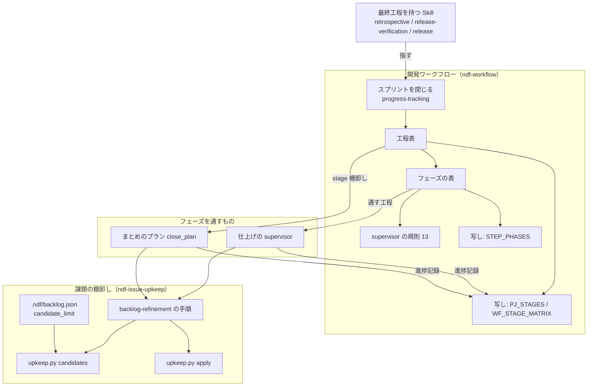
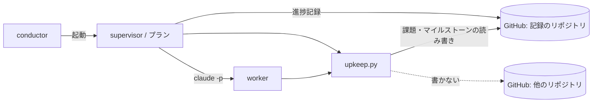
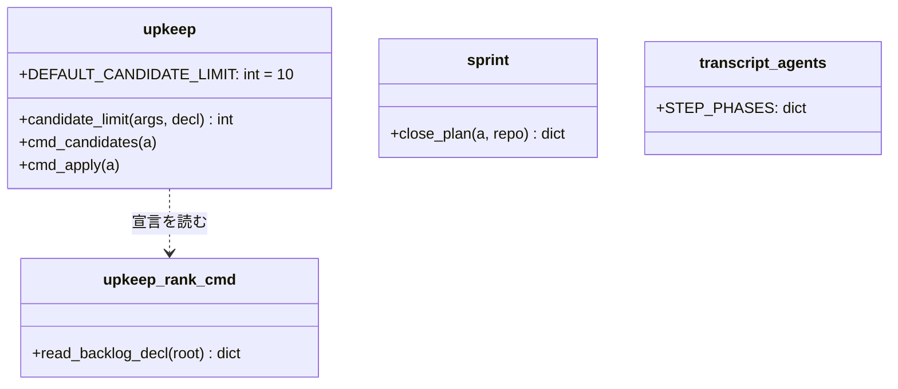
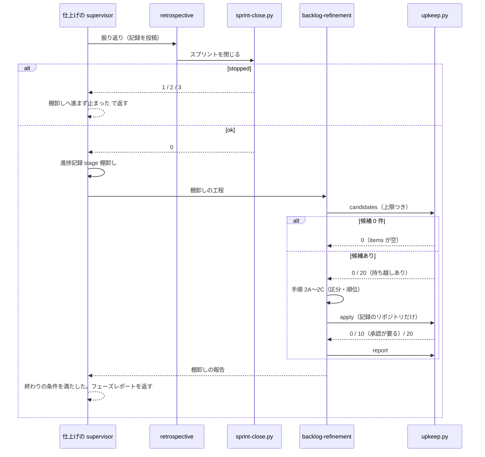
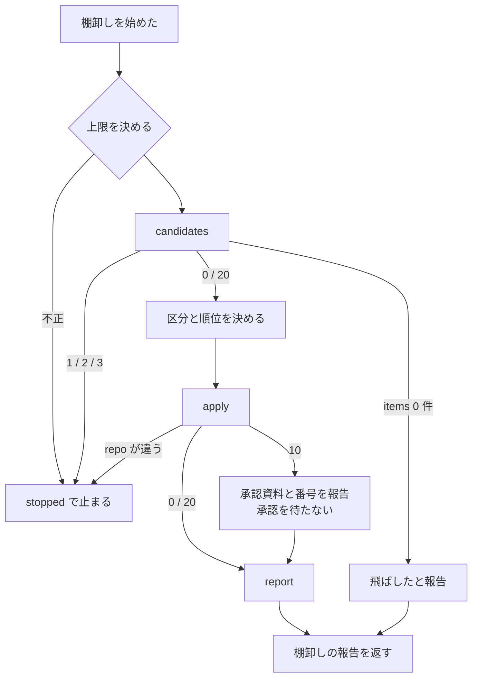

# #842: 棚卸しを工程表の行にし、1 回の件数と書き込む先に上限を置く

要求と受け入れ条件は #842 の本文にある（コピーは `issues/issue-842-requirements.md`）。この文書は「どう作るか」だけを扱う。

## 例: devbase v3.7.0 の仕上げを、変更の後の形で通す

devbase v3.7.0（2026-09-23）の仕上げでは、振り返りの記録を投稿した後に、担当が open 21 件すべての棚卸しへ入り、
他のリポジトリの課題 4 件の本文を書き換えたところで conductor が打ち切った。変更の後は次のように動く。

| 時点 | 変更の前 | 変更の後 |
| --- | --- | --- |
| 振り返りの記録を投稿した | `retrospective` の本文が続けて `/ndf:backlog-refinement` を呼ぶよう指示する | `retrospective` は指示しない。フェーズの表の「通す工程」の次の行が `棚卸し` である |
| スプリントを閉じた（`sprint-close.py` が `ok`） | — | 仕上げの担当が進捗記録 `stage 棚卸し` を打ち、棚卸しの工程に入る |
| 候補を集める | 上限なし（21 件すべて） | `upkeep.py candidates` が上限 10 件で切る。残る 11 件は `metrics.deferred` に番号だけが載る |
| 反映する | 他のリポジトリの課題も `gh` で書き換えた | `upkeep.py apply` は記録のリポジトリ（devbasex/devbase）の課題とマイルストーンだけに書く。他のリポジトリの課題は報告の「人へ戻す」に載る |
| 「やらない」の承認が要る（終了コード 10） | 担当が人を待つか、承認なしで閉じるかを選ばされる | 承認の要る反映を行わず、`presentation_path` と番号を報告に載せて終える |
| 棚卸しの報告を返した | 担当が次の作業を探す | フェーズの終わりの条件を満たしたので、フェーズレポートを返して終わる |

## ドメインモデル

### コンテキスト

| コンテキスト | 何の語が 1 つの意味に決まるか |
| --- | --- |
| NDF の開発ワークフロー（`ndf-workflow`） | 工程・工程表・フェーズ・終わりの条件・プランのステップ |
| NDF の課題の棚卸し（`ndf-issue-upkeep`） | 候補・候補の上限・持ち越し・区分・反映・承認の要る反映 |

**関係は顧客 / 供給者である。** 棚卸し（`upkeep.py`）が供給者で、開発ワークフローが顧客になる。ワークフローは
「いつ・どのフェーズで棚卸しを通すか」を決め、棚卸しは「1 回に扱う件数」と「書き込む先」を自分の契約として
保証する。ワークフローは棚卸しの中身（区分・見積・順位）を知らず、`upkeep.py` の終了コードと報告だけを受け取る。

### 集約

| 集約 | 持ち主（書き換えてよいもの） | 根 | エンティティ | 値オブジェクト |
| --- | --- | --- | --- | --- |
| 工程表 | `development-workflow/SKILL.md` の「モードごとに起動する Skill」 | 工程表 | 工程（行） | 行名・モードごとのセル |
| フェーズの表 | `development-workflow/references/agent-layers.md` の「フェーズ」 | フェーズの表 | フェーズ | 通す工程の並び・終わりの条件 |
| 棚卸しの回 | `backlog-refinement/scripts/upkeep.py`（`candidates` / `apply` / `report`） | 候補の記録（`candidates.json`） | 候補（課題） | 候補の上限・持ち越しの番号の並び・記録のリポジトリ |
| まとめのプラン | `supervise_lib/sprint.py` の `close_plan` | プラン | ステップ | `stage`・`timeout`・`prompt` |

**工程表の行名の写しは 3 か所にあり、持ち主は工程表だけである。** `projects-common.sh` の `PJ_STAGES`、
`workflow-common.sh` の `WF_STAGE_MATRIX`、`transcript_agents.py` の `STEP_PHASES`（フェーズの表の写し）は、
写す側として行を足す。

### 不変条件

| # | 集約 | 条件 | 破れたときの扱い |
| --- | --- | --- | --- |
| I1 | 工程表 | 行名 `棚卸し` が工程表・`PJ_STAGES`・`WF_STAGE_MATRIX` のすべてにある | `projects-sync.sh` は工程表に無い値を終了コード 2 で拒む（既存）。行列に無ければ工程の飛ばしの案内から漏れる |
| I2 | フェーズの表 | `棚卸し` はフェーズの表のちょうど 1 つのフェーズの「通す工程」の最後にあり、`STEP_PHASES["棚卸し"]` がそのフェーズである | 対応表のテストが落ちる（既存の `test_the_step_names_match_the_phase_table`） |
| I3 | 棚卸しの回 | `candidates` が区分を求める候補（`items` の `kind: issue`）の数は、候補の上限以下である。候補の上限は常に 1 以上の整数である | 上限が不正なら候補を集めずに `stopped` で止まる |
| I4 | 棚卸しの回 | `apply` が書き込むのは、記録のリポジトリの課題とマイルストーンだけである | plan の `repo` が記録のリポジトリと違えば、1 件も書かずに `stopped` で止まる |
| I5 | 工程表 | 棚卸しは、スプリントを閉じた（`sprint-close.py` が `ok`）後にだけ始まる | `stopped` なら棚卸しへ進まずに止まる（既存の `progress-tracking` の規則） |
| I6 | 棚卸しの回 | 無人の経路では、承認の要る反映（やらない・承認の要る前倒しと後ろ倒し・親 issue の起票と結び付け）を行わない | `apply` は `approved` の無い「やらない」を `needs_approval` へ回す（既存）。担当は承認を求めずに報告して終える |

### ドメインイベント

| # | イベント | 発生元 | 受け手 |
| --- | --- | --- | --- |
| E1 | スプリントを閉じた | `sprint-close.py`（最終工程の担当が打つ） | 同じフェーズの担当（次の工程の `棚卸し` へ進む） |
| E2 | 棚卸しの工程を始めた | フェーズの担当（supervisor / まとめのプランの `refine` ステップ） | 進捗記録（課題の本文の「進行」とボード） |
| E3 | 候補を集めた | `upkeep.py candidates` | 棚卸しの担当（手順 2A へ）。終了コード 20 なら持ち越しを報告に残す |
| E4 | 候補が 0 件で飛ばした | `upkeep.py candidates` | 棚卸しの担当（報告を返して E8 へ） |
| E5 | 区分と順位を決めた | 棚卸しの担当（手順 2A〜2C） | `upkeep.py apply` |
| E6 | 承認の要る反映を人へ戻した | `upkeep.py apply`（終了コード 10） | 棚卸しの報告（承認資料のパスと番号）。無人の経路では人を待たない |
| E7 | 反映した | `upkeep.py apply` | `upkeep.py report` |
| E8 | 棚卸しの報告を返し、フェーズを終えた | フェーズの担当 | conductor（フェーズレポート / キューの done） |

### 用語

| 用語 | 意味 | 用語集への反映 |
| --- | --- | --- |
| 棚卸し | 既存の課題の本文・マイルストーン・ラベルを現状に合わせ、着手の順位を決め直すこと。工程表の行名でもある | 意味の変更（`ndf-workflow`。「使われる場所」に工程表の行名と進捗記録の `stage` の値を足す） |
| 候補の上限 | 1 回の棚卸しで区分を決める候補の数の上限。`--limit` → `.ndf/backlog.json` の `candidate_limit` → 既定 10 の順に決まる | 追加（`ndf-issue-upkeep`） |
| 持ち越し | 候補の上限を超えたため、その回で区分を決めずに残した候補。`metrics.deferred` に番号だけが載る | 追加（`ndf-issue-upkeep`） |

## 機能一覧

| # | 機能 | 誰が使うか |
| --- | --- | --- |
| F1 | 棚卸しが工程表の 1 行として、すべてのモードでスプリントの最後に通る | conductor・supervisor・まとめのプラン |
| F2 | 1 回の棚卸しで区分を決める件数が、候補の上限で切られる。上限はプロジェクトの宣言で変えられる | 棚卸しの担当・プロジェクトの設定を書く利用者 |
| F3 | 棚卸しの反映が、記録のリポジトリの外へ書き込まない | 棚卸しの担当 |
| F4 | 無人の経路で承認の要る反映に当たったら、承認を待たずに材料を報告して終える | supervisor・まとめのプランの worker |
| F5 | supervisor は、フェーズの終わりの条件を満たしたら、Skill の本文の続きを始めずにフェーズレポートを返す | supervisor |
| F6 | `pace: fast` のまとめのプランが、振り返りと棚卸しを別のステップで流す | conductor（`supervise.py new close`） |
| F7 | 測定（`skill-stats --agents`）が、工程名 `棚卸し` で始まる記録を仕上げのフェーズへ数える | 振り返りの担当 |

## 構成要素

| 要素 | 責務 |
| --- | --- |
| 工程表（`development-workflow/SKILL.md`） | `棚卸し` の行を `振り返り` の下に持つ。5 モードすべてに `backlog-refinement`。進め方の表の「確定仕様化・振り返り」の行と流れ図に棚卸しを足す |
| フェーズの表（`references/agent-layers.md`） | 仕上げの「通す工程」の最後に `棚卸し`、終わりの条件を「棚卸しの報告を返した（候補が 0 件で飛ばした場合を含む）」にする。仕上げを作らないモードの置き場と、supervisor の規則 13 を持つ |
| 工程の単位と進め方（`parallel-work.md` / `pace.md` / `waiting.md`） | 工程の単位の表に `棚卸し`（スプリント）。`fast` のまとめと、`normal` で supervisor が回す工程に棚卸しを足す |
| スプリントを閉じる（`progress-tracking/SKILL.md`） | 「スプリントを閉じる → 棚卸し」の順序の制約を持つ唯一の場所。`ok` なら工程表の次の工程（棚卸し）へ進み、`stopped` なら進まない |
| 最終工程を持つ Skill（`retrospective` / `release-verification` / `release`） | 「蓄積した課題を棚卸しする」の節を消し、「関連」の注記から「この工程の最後に呼ぶ」「振り返りが続かないときに呼ぶ」を外す |
| 棚卸しの Skill（`backlog-refinement/SKILL.md` と `references/ranking.md`） | 「用語」の表に「候補の上限」「持ち越し」を足す。「いつ呼ぶか」を工程表の行へ向け、手順 1 に上限の決まり方と持ち越しの扱い、無人の経路の終了コード 10、記録のリポジトリの外へ書かない規則、進捗記録の値 `棚卸し` を書く。宣言の表に `candidate_limit` |
| `upkeep.py candidates` | `--limit` を省いたときに宣言 → 既定の順で上限を決め、候補を常に有限の件数で切る。既定値 `DEFAULT_CANDIDATE_LIMIT = 10` を持つ唯一の場所 |
| `upkeep.py apply` | plan の `repo` と記録のリポジトリ（`--repo`、無ければ `gh repo view`）を照合し、違えば 1 件も書かずに止まる |
| まとめのプラン（`supervise_lib/sprint.py` の `close_plan`） | `retro` の後に stage `棚卸し` の `refine` ステップ（work・`timeout` つき）を置く |
| 工程の写し（`projects-common.sh` / `workflow-common.sh` / `transcript_agents.py`） | `PJ_STAGES` と `WF_STAGE_MATRIX` に行、`WF_FAST_DEFERRED_STAGES` に `棚卸し`、`STEP_PHASES` に `"棚卸し": "仕上げ"` |
| 説明の文言（`sprint-close.py` / `supervise_lib/new_args.py` / `supervise.py`） | 「backlog-refinement へ進まない」を「棚卸しへ進まない」に、まとめのステージの説明に棚卸しを足す |
| 確定仕様（`docs/specifications/ndf-cleanup-and-bundle-closing.md`） | 「スプリントを閉じる → `backlog-refinement`」を、工程表の次の工程へ進む形に直す |

### 構成要素図



### システムの文脈と配置



`upkeep.py` は棚卸しの担当（`normal` / `auto` では仕上げの supervisor が出した worker か supervisor 自身、`fast` では
まとめのプランの `refine` ステップの worker）と同じマシンで動き、記録の置き場は `$NDF_UPKEEP_STATE_DIR` である（既存）。

## 構造

**変更が触る型は、プランの辞書と 2 つのモジュールの関数・定数である。** 新しいクラスは作らない。



| 型・関数 | 変更 |
| --- | --- |
| `upkeep.candidate_limit(args, decl)` | 新設。`args.limit` → `decl["candidate_limit"]` → `DEFAULT_CANDIDATE_LIMIT` の順に採り、1 以上の整数であることを確かめる。純粋な関数で、不正な値は例外で返す（終了コードへの写しは `cmd_candidates` が行う） |
| `upkeep.cmd_candidates` | 上限を `candidate_limit` で決めてから `_candidate_result` へ渡す。`_candidate_result` の `a.limit is None` の分岐（上限なし）は消える |
| `upkeep.cmd_apply` | 記録のリポジトリを `target_repo(root, a.repo)` で決め、plan の `repo` と照合してから書く |
| `sprint.close_plan` | `retro` の `next` を `refine` にし、`refine` のステップを足す |
| `transcript_agents.STEP_PHASES` | `"棚卸し": "仕上げ"` を足す |

### パッケージ・モジュール構成

```text
plugins/ndf/
├── skills/
│   ├── development-workflow/
│   │   ├── SKILL.md                         # 工程表・進め方の表・流れ図
│   │   ├── references/agent-layers.md       # フェーズの表・モードごとの組み方・規則 13
│   │   ├── references/parallel-work.md      # 工程が動く単位
│   │   ├── references/pace.md               # fast のまとめ
│   │   ├── references/waiting.md            # normal で supervisor が回す工程
│   │   ├── references/glossary.md           # 棚卸しの「使われる場所」
│   │   └── scripts/lib/workflow-common.sh   # WF_STAGE_MATRIX・WF_FAST_DEFERRED_STAGES
│   ├── progress-tracking/SKILL.md           # 順序の制約の正本
│   ├── retrospective/SKILL.md
│   ├── release-verification/SKILL.md
│   ├── release/SKILL.md
│   └── backlog-refinement/
│       ├── SKILL.md
│       ├── references/ranking.md            # 宣言の表に candidate_limit
│       └── scripts/upkeep.py                # 上限の決まり方・記録のリポジトリの照合
└── scripts/
    ├── lib/projects-common.sh               # PJ_STAGES
    ├── lib/transcript_agents.py             # STEP_PHASES
    ├── supervise_lib/sprint.py              # close_plan の refine
    ├── supervise_lib/new_args.py            # close の説明
    ├── supervise.py                         # close の説明のコメント
    └── sprint-close.py                      # 「棚卸しへ進まない」
docs/
├── specifications/ndf-cleanup-and-bundle-closing.md
└── glossary/glossary.json, glossary.md      # 用語の反映（render）
```

## 入出力の契約

### `upkeep.py candidates` の上限

引数は変えない（`--limit N` のまま）。**省いたときの意味だけが「上限なし」から「宣言か既定の上限」に変わる。**

| 入力 | 採る値 | 不正なとき |
| --- | --- | --- |
| `--limit N` を渡した | `N` | `N` が 1 未満なら `stopped`・終了コード 3（呼び出しの誤り）。候補を集めない |
| 省き、`.ndf/backlog.json` に `candidate_limit` がある | その値 | 1 以上の整数でなければ `stopped`・終了コード 2（宣言を読めない。既存の宣言の扱いと同じ） |
| どちらも無い | `DEFAULT_CANDIDATE_LIMIT`（10） | — |

- 宣言の読み方は `read_backlog_decl` のまま（メインディレクトリの `.ndf/` を先に、無ければ `--root` の `.ndf/`）
- `--all` でも上限は効く。全件を 1 回で見るときは `--limit` に open の件数以上を渡す
- 結果の形は変えない。上限を超えれば `metrics.deferred` に番号、終了コード 20、`next` に持ち越しの件数。`metrics` に
  `limit`（採った上限）を足し、報告で上限の出所を読めるようにする

`.ndf/backlog.json` に足すキー（`references/ranking.md` の「宣言の書き方」の表へ 1 行）:

| キー | 意味 | 既定 | 引数 |
| --- | --- | --- | --- |
| `candidate_limit` | 候補の上限（1 回の棚卸しで区分を決める候補の数） | 10 | `candidates --limit` |

### `upkeep.py apply` の記録のリポジトリ

| plan の `repo` | `--repo` | 書き込む先 | 結果 |
| --- | --- | --- | --- |
| 無い | 無い | `gh repo view` のリポジトリ | 既存のとおり反映 |
| 無い | ある | `--repo` | 既存のとおり反映 |
| ある | 無い | `gh repo view` のリポジトリ | plan の `repo` と一致すれば反映、違えば `stopped`・終了コード 3。1 件も書かない |
| ある | ある | `--repo` | 一致すれば反映、違えば `stopped`・終了コード 3 |

**変わるのは 3 行目である。** 今は plan の `repo` が `gh repo view` に勝ち、plan を書く側が黙って他のリポジトリへ
向けられる。`items[0].reason` に 2 つのリポジトリの名前を載せる。

### 棚卸しの工程の報告

`backlog-refinement` の「完了報告」の表に 1 行を足す。ほかの行は変えない。

| 項目 | 何を書くか |
| --- | --- |
| 持ち越し | `report` の `deferred` の件数と番号。採った上限（`limit`）。0 件なら書かない |

**無人の経路で終了コード 10 が返ったときは、承認を求めない。** 報告に承認資料（`presentation_path`）を、対象の
番号を「人の判断待ち」に載せて終える。supervisor のフェーズレポートでは `結果: 完了`・`提示物: <パス>` で返す
（承認ゲートは 2 つのまま増やさない）。他のリポジトリの課題に当たる反映は plan に入れず、区分を `要判断` にして
「人へ戻す」に `<所有者>/<リポジトリ>#<番号>` を載せる。

### 工程表とフェーズの表の行

```markdown
| 棚卸し | `backlog-refinement` | `backlog-refinement` | `backlog-refinement` | `backlog-refinement` | `backlog-refinement` |
```

```markdown
| 仕上げ | 配布（本番）/ リリース後テスト / 振り返り / 棚卸し | スプリント | 本番への承認を受け取った。要らないリポジトリでは取り込みが終わった | 棚卸しの報告を返した（候補が 0 件で飛ばした場合を含む） | 無し |
```

「モードごとの組み方」の `light` の行に「仕上げを作らないときは、棚卸しを取り込みの最後に入れ、取り込みの
終わりの条件に棚卸しの報告を足す」を書く。表の下の「作らないフェーズの工程は次のフェーズの先頭へ入る」は
後ろにフェーズが無い仕上げには当たらないため、仕上げだけは「前のフェーズの最後へ入る」を同じ段落に足す。

### supervisor の規則 13

`agent-layers.md` の「supervisor が守る規則」へ 13 番目として足し、「`prompt` に下の 10 項目と、守る規則 12 個」を
13 個に直す。

> 13. **フェーズの終わりの条件を満たしたら、Skill の本文が続きの作業を指示していても始めず、フェーズレポートを
>     返す。** 続きの指示は、フェーズレポートの `理由` に「<Skill>: <続きの作業>（始めていない）」と書く。工程表と
>     フェーズの表に無い作業は、Skill の本文が指示しても工程として扱わない

### まとめのプランの `refine` ステップ

| キー | 値 |
| --- | --- |
| `id` | `refine` |
| `type` | `work`（`full: true`） |
| `kind` / `stage` | `棚卸し` |
| `timeout` | 3600 |
| `prompt` | `/ndf:backlog-refinement スプリント <名前>（<課題>）。棚卸しの工程として無人で通す。` に、上限を上げて打ち直さない・終了コード 10 は承認を求めず承認資料のパスと番号を報告して終える・`--repo` を渡さない、の 3 点を続ける |
| `next` | `end` |

`retro` の `next` は `end` から `refine` に変わる。`retro` の `prompt` は変えない（今も棚卸しを含まない）。
プランの `上限`（実行するステップの数の歯止め）は 12 のままで足りる（定義するステップは 8 から 9 になる）。

## 処理の流れ

### 仕上げのフェーズ（`normal` / `auto`）



**`fast` では同じ流れを、まとめのプランが `close` → `retro` → `refine` のステップで通す。** `sprint-close.py` は
`close` のステップが先に打ち（既存）、`refine` は `close` が 0 で終わったときだけ届く（run のステップは 0 以外で止まる）。

### 棚卸しの工程の分岐



終了コード 20 の持ち越しは、同じ工程の中で `--limit` を上げて打ち直さず、報告の「持ち越し」に載せて先へ進む。

**処理の流れの図に現れない構成要素は、実行の順序を持たないものである。** 工程の単位と進め方の文書・確定仕様・説明の文言は
読まれるだけで、工程の写し（`PJ_STAGES` / `WF_STAGE_MATRIX` / `STEP_PHASES`）は進捗記録と測定が値を引くときに使う。

## 非機能の実現方式

| 大項目 | 実現方式 |
| --- | --- |
| 性能・拡張性 | 区分を決める候補は `candidates` が上限で切る。上限は常に有限（引数 → 宣言 → 既定 10）で、`metrics.limit` に採った値が載るため、1 回の棚卸しの費用を件数で見積もれる。`refine` ステップの `timeout` 3600 は止まった worker の歯止めで、費用の上限は件数が持つ |
| 運用・保守性 | 工程の境界は工程表とフェーズの表の 2 か所だけが持ち、`retrospective` / `release-verification` / `release` は呼び出しを持たない。順序の制約は `progress-tracking` の 1 か所。上限の既定値は `upkeep.py` の 1 か所 |
| セキュリティ | 書き込む先は `apply` が記録のリポジトリと照合する（I4）。承認の要る反映は `apply` が `needs_approval` へ回し（既存）、無人の担当は承認を求めずに材料だけを返す（I6） |

## 決定の記録

### 決定 1: 棚卸しは仕上げのフェーズの最後の工程にし、新しいフェーズを作らない

フェーズの名前は supervisor の `description` の先頭語と測定の語彙（`POSTS`）を兼ねる。7 つ目のフェーズを作ると、
語彙・測定・`conductor` の起動の表がすべて変わり、1 スプリントに supervisor の起動が 1 回増える。仕上げの終わりの
条件を「棚卸しの報告を返した」に変えれば、受け入れ条件 2 の「ちょうど 1 つのフェーズ」を満たせる。

`棚卸し` という名前のフェーズを新しく作る案は、上の変更の費用に見合う利点（中身の分離）が、規則 13 と上限で
既に得られるため採らない。

根拠: Value 6 / Value 4（MVV 版 2）

### 決定 2: 仕上げを作らないモードでは、棚卸しを取り込みの最後に入れる

`light` は本番の承認が要らなければ仕上げを作らない。既存の規則「作らないフェーズの工程は次のフェーズの先頭へ
入る」は、後ろにフェーズが無い仕上げには当たらない。最後のフェーズだけ「前のフェーズの最後へ入る」と足せば、
取り込みの最後の工程（配布）の後に棚卸しが来て、工程表の順序と一致する。

`light` の工程表のセルを `—` にする案は、利用者の決定（棚卸しを工程表の行にし、範囲と費用を工程として決める）が
モードを限っていないため採らない。

根拠: Value 6（MVV 版 2）

### 決定 3: 棚卸しはすべてのモードで必須（条件をつけない）にする

候補が 0 件なら `candidates` の 1 回で飛ばす（既存）ため、小さな変更でも費用は候補の収集だけである。条件を
つけると、条件を読む担当によって通るかどうかが変わり、溜まった課題を誰も見ない経路が残る。

`operation` の振り返りと同じく「手順を変えたとき」の条件をつける案は、棚卸しの対象が変更の中身ではなく
溜まった課題であり、変更の性質で要否が決まらないため採らない。

根拠: Value 1 / Mission（MVV 版 2）

### 決定 4: `normal` / `auto` では、仕上げの supervisor が振り返りに続けて同じ起動で棚卸しを通す

フェーズは supervisor 1 つが通す工程のグループであり、棚卸しを仕上げに載せた以上、同じ supervisor が通すのが
フェーズの定義どおりである。費用の上限は件数（決定 5）が持ち、手順 2A は件数で worker へ割るため、supervisor 自身の
context window の増え方も上限で抑えられる。

別の supervisor で起動する案は、収束ループでない工程の途中で起動を分ける規則（スイッチポイントは hook が決める）が
無く、conductor の起動の規則を新しく足すことになるため採らない。

根拠: Value 4 / Value 6（MVV 版 2）

### 決定 5: 候補の上限は `upkeep.py candidates` が自分で決め、呼ぶ側で値を解かない

上限を必ず有限にする場所を `candidates` の 1 か所にすれば、supervisor の手順・プランのプロンプト・人が打つ
コマンドのどれから呼んでも同じ上限が効く。呼ぶ側（supervise.py・Skill の本文）で宣言を読んで `--limit` を組み立てる
と、同じ読み方が 2 か所に分かれ、片方を直し忘れると上限なしの経路が残る。置き場は既存のバックログの宣言
（`.ndf/backlog.json`。引数 → 宣言 → 既定値の順に採る規則を `rank` が既に持つ）で、新しい設定ファイルを作らない。

棚卸しの工程から呼ぶときだけ `--limit` を付ける案は、人が工程の外で `--all` を打つ経路に上限が掛からず、
「`--limit` を省くと上限なし」という今の意味が呼ぶ側ごとの約束として残るため採らない。

根拠: Value 6 / Value 5（MVV 版 2）

### 決定 6: 既定の上限は 10 件のまま置く

実測は devbase v3.7.0 の 1 回（open 21 件を約 20 分、1 件あたり約 1 分）だけで、値を変える根拠になる実測が無い。
10 件で 1 回を 10 分程度に収める要求の前提 4 をそのまま採り、リリース後テストで実測（件数・秒・トークン）を取って
見直す。

根拠: Value 3（MVV 版 2）

### 決定 7: 他のリポジトリへの書き込みは、`apply` が plan の `repo` と記録のリポジトリを照合して止める

plan の課題は番号だけで指すため、`apply` が書く先は 1 つのリポジトリに決まる。他のリポジトリへ向かう経路は、
plan の `repo` が `gh repo view` に黙って勝つ今の決まり方だけである。照合で止めれば、引数を増やさずに
受け入れ条件 8 を満たせる。他のリポジトリを意図して扱うときは、今と同じく `--repo` を明示する。

棚卸しの工程からの起動を見分ける引数（例 `--stage`）を足して他のリポジトリを拒む案は、`upkeep.py` の公開の
引数を変える（要求の境界の「確認してから行う」）うえ、照合だけで同じ効果が得られるため採らない。

根拠: C5 / Value 6（MVV 版 2）

### 決定 8: 無人の経路では、承認の要る反映を報告に載せて終え、承認ゲートにしない

承認ゲートは 2 つで増やさない。「やらない」の承認を待つと、棚卸しが終わらないまま仕上げのフェーズが止まり、
次のスプリントの着手まで conductor が待つ。`apply` は承認の無い反映を `needs_approval` に回して書かない（既存）
ため、材料（`presentation_path` と番号）を報告に載せれば、人がいる場面で承認し直せる。

根拠: Value 2 / C3（MVV 版 2）

### 決定 9: 持ち越しは報告に載せるまでにし、次のスプリントへの受け渡しは #1640 で決める

持ち越しを次の回で自動で拾うには、候補の集め方か記録の置き場を変える必要があり、要求の「含まない」に当たる。
この課題では、同じ工程で上限を上げて打ち直さないことと、報告に番号と件数を載せることまでを行う。受け渡しの
置き場は #1640 で決める。

根拠: Value 1 / Value 6（MVV 版 2）

## テスト設計

| 受け入れ条件・不変条件 | どの振る舞いで縛るか | どう壊したら落ちるべきか |
| --- | --- | --- |
| 1・I1 | `projects-sync.sh <課題> stage 棚卸し` が gh へ届く。工程の飛ばしの案内が、5 モードで棚卸しを必須として扱う | `PJ_STAGES` か `WF_STAGE_MATRIX` から `棚卸し` を消す |
| 1（並び） | `grep -n` で工程表の `棚卸し` の行が `振り返り` の行より下にあることを見る（文書の確認。テストは書かない） | — |
| 2・I2・11 | `STEP_PHASES` がフェーズの表の「通す工程」から作った対応と一致し、`棚卸し` の値が `仕上げ` である（既存のテストに乗る） | `STEP_PHASES` の `棚卸し` を消すか `取り込み` にする |
| 3・4・7 | `grep -n` で指示の文が 0 件・順序の制約が 1 か所・規則 13 が 1 か所であることを見る（文書の確認） | — |
| 5・I3 | `candidates` を `--limit` なしで打つと、宣言の `candidate_limit` の件数で切る。宣言が無ければ 10 件で切る。`metrics.limit` に採った値が載る | `candidate_limit` を `None` に戻す（上限なしに戻す）、宣言を読まない |
| 5・I3（不正） | `--limit 0` は終了コード 3、宣言の `candidate_limit` が 0 や文字列なら終了コード 2 で、どちらも候補を集めない | 値の検査を外す |
| 6 | 上限を超えたとき `report` が `deferred` の番号を返す（既存）。`fast` の `refine` のプロンプトが「上限を上げて打ち直さない」を渡す | `refine` のプロンプトから打ち直しの禁止を落とす（プランのテストで見る） |
| 8・I4 | plan の `repo` が記録のリポジトリと違えば、`apply` は gh へ 1 件も書かずに終了コード 3 で止まる。同じなら反映する | 照合を外す（plan の `repo` を書く先に使う今の形に戻す） |
| 9・I6 | `refine` のプロンプトが「終了コード 10 は承認を求めず報告して終える」を渡す。`apply` は `approved` の無い「やらない」を書かない（既存） | プロンプトから無人の扱いを落とす |
| 10 | `new close` が組むプランで、`retro` の `next` が `refine`、`refine` の `stage` が `棚卸し` で `timeout` を持ち、`retro` の `prompt` に `backlog-refinement` が無い | `refine` を消す、`retro` の `next` を `end` に戻す、`timeout` を落とす |
| I5 | `close` のステップが 0 以外で終われば `refine` へ届かない（run のステップの既存の遷移） | `close` に `on_fail: refine` を足す |
| 12 | `uv run --frozen --project . --all-extras pytest . -q -n 4`・`python3 scripts/check-skill-frontmatter.py`・`python3 plugins/ndf/scripts/instructions-check.py --root .`・`claude plugin validate .` が終了コード 0 | — |
| 13 | 候補が 0 件の `candidates` の後、`apply` を打たずに報告を返す（既存の「対象が 0 件なら飛ばす」）。上限の導入で 0 件の結果が `gate` にならない | 0 件のときも終了コード 20 を返すように上限を当てる |

## 設計の結果

| 課題 | 扱い | 取り込み先 | 触るファイル |
| --- | --- | --- | --- |
| #842 | 実装する | — | `plugins/ndf/skills/development-workflow/`、`plugins/ndf/skills/progress-tracking/SKILL.md`、`plugins/ndf/skills/retrospective/SKILL.md`、`plugins/ndf/skills/release-verification/SKILL.md`、`plugins/ndf/skills/release/SKILL.md`、`plugins/ndf/skills/backlog-refinement/`、`plugins/ndf/scripts/lib/projects-common.sh`、`plugins/ndf/scripts/lib/transcript_agents.py`、`plugins/ndf/scripts/supervise_lib/sprint.py`、`plugins/ndf/scripts/supervise_lib/new_args.py`、`plugins/ndf/scripts/supervise.py`、`plugins/ndf/scripts/sprint-close.py`、`plugins/ndf/scripts/tests/`、`docs/specifications/ndf-cleanup-and-bundle-closing.md`、`docs/glossary/` |

## 未確認のまま残ること

| 項目 | 内容 |
| --- | --- |
| 既定の上限 10 件の妥当さ | 実測は devbase の 1 回だけ。次のスプリントのリリース後テストで、棚卸しの件数・秒・トークンを取って見直す（決定 6） |
| 持ち越しの受け渡し | 次のスプリントの棚卸しが持ち越しを拾う置き場は無い。#1640 で決める（決定 9） |
| 無人の経路の承認資料の届け方 | `fast` の `refine` は work のステップで、終了コード 10 の承認資料は worker の報告に載るだけで、キューの `gate` にはならない。conductor が最後の報告で人へ渡すかは、次のスプリントの仕上げで確かめる |
| 既存のボードの選択肢 | `進行` を単一選択で作ったボードには `棚卸し` の選択肢が無く、`projects-sync.sh` はボードへの書き込みを黙って飛ばす（課題の本文の「進行」には残る）。選択肢を足すのは利用者である（`progress-tracking/references/board.md`） |
| 人が工程の外で打つ `--all` | 上限が既定で掛かるようになり、全件を見るには `--limit` を上げる必要がある。人が打つ経路の使い勝手は実測していない |
