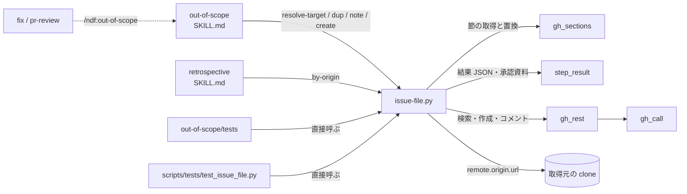
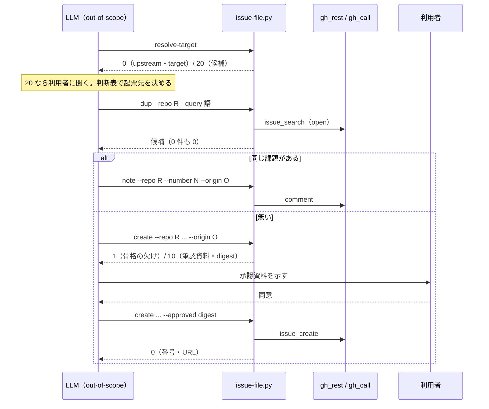

# out-of-scope / retrospective: 範囲外の課題を 1 件起票するたびに LLM が手順書 17.9KB を読み、起票先の解決・重複の検索・由来の書き込みを 1 手ずつ組み立てる → 決まった手順は issue-file の 5 つのサブコマンドが行い、LLM は範囲の判断・起票先の判断・本文だけを持つ（#851 #865）

## 目的

- **何が壊れているか**: 範囲外の課題を起票するたびに、LLM が `out-of-scope/SKILL.md`（10,372B）と `references/issue-target.md`（7,536B）を読み、bash の囲み 20 行余りの起票先の解決・`gh issue list`・本文の 5 項目の確認・由来の書き込みを毎回組み立てている。テストは手順書の囲みの bash を取り出して実行している
- **誰が困るか**: 起票のたびに読み込みと組み立ての費用を払う利用者と、手順書の文言とテストが結び付いて手順書を直しにくい保守者
- **直すと何が成り立つか**: 決まった手順は `issue-file.py` の呼び出しと結果 JSON の読み取りになり、手順書は判断と本文の書き方だけを持つ。起票先・本文・由来・ラベルの結果は今と変わらない

## 適用範囲

- **働く範囲**: 配布先のどのリポジトリでも働く（`out-of-scope` と `retrospective` は既定で配る Skill）。課題の置き場は GitHub だけ
- **プロジェクトごとに違うもの**: 起票先・題・本文・由来・ラベルはすべて引数で受ける。部品は既定のラベルもリポジトリの名前も持たない
- **当たるモード**: どのモードでも、範囲外の課題を見つけたとき（`out-of-scope` は工程の外に置く手順）と、`retrospective` の手順 1

## あるべき姿の根拠

| 根拠 | 種類 | 何を示すか |
| --- | --- | --- |
| #851 の依頼「起票先の解決・重複の検索・由来の付与はスクリプトが行う」「テストもスクリプトを直接呼ぶ形に書き直す」 | 利用者の指示の原文 | 部品の範囲と、テストの書き直し |
| #865 の受け入れ条件「SKILL.md が約 6KB、`issue-target.md` が約 3KB 以下」 | 利用者の指示の原文 | 手順書の量の目標 |
| 2026-10-07 の実測: `gh issue list --state all --search 'PR #1825'` は 11 件、`--search '"PR #1825"'` は 5 件を返し、5 件にはコメントにだけ `PR #1825` を持つ #767 が入る。`'PR #1836'` は本文に `PR #1836` を持たない #860 を返し、`'"PR #1836"'` は 0 件 | 実測 | 由来の検索は句を引用符で囲むと、コメントの由来を拾ったまま無関係な一致が消える（決定 4） |
| 2026-10-07 の実測: `SKILL.md` の節ごとの量は、手順 2 が 1,687B、手順 5 が 1,311B、辿り方が 1,142B、境界が 1,137B。`issue-target.md` は「起票先のリポジトリを決める」の節が 4,387B（全体の 58%） | 実測 | 量を減らす先（「#865 の置き換えの範囲」） |

要求と受け入れ条件は #851 の本文にある（コピーは [issue-851-requirements.md](issue-851-requirements.md)）。#865 の受け入れ条件は #865 の本文にある。この文書は「どう作るか」だけを扱う。

## 例: 範囲外の指摘を 1 件起票すると

`PR #1900` のレビューで、範囲外の不具合を見つけた場面である。

1. LLM が手順 1・2 で「起票する」と決める（今と同じ）
2. `issue-file.py resolve-target` が `{"upstream": "devbasex/ai-plugins", "target": "example/app", "same": false}` を返す（終了コード 0）
3. LLM が判断表で起票先を `devbasex/ai-plugins` に決める
4. `issue-file.py dup --repo devbasex/ai-plugins --query "起票先 解決 fork"` が 0 件を返す
5. LLM が 4 つの節を書いた本文を `/tmp/body.md` に置き、`issue-file.py create --repo devbasex/ai-plugins --title "..." --body-file /tmp/body.md --origin "PR #1900"` を打つ。部品は「由来」の節へ `PR #1900` を入れ、5 項目を検査し、承認資料を書いて終了コード 10 で止まる。`metrics.other_repo` は真（開発対象リポジトリと別）
6. LLM が承認資料を利用者へ示し、同意を得て同じ引数に `--approved <metrics.digest>` を足して打ち直す。課題 #1950 ができる（終了コード 0）
7. 振り返りで `issue-file.py by-origin --origin "PR #1900" --origin "issue #1880" --repo example/app --with-upstream` が #1950 を返す

## ドメインモデル

### コンテキスト

| コンテキスト | 何の語が 1 つの意味に決まるか |
| --- | --- |
| NDF の課題の棚卸し（`ndf-issue-upkeep`） | 起票先・上流リポジトリ・開発対象リポジトリ・由来・本文の骨格 |

1 つのコンテキストに収まる。結果の形は #846 の結果 JSON（`step_result`）に従うだけで、新しい語を持ち込まない。

### 集約

| 集約 | 持ち主（書き換えてよいもの） | 根 | エンティティ | 値オブジェクト |
| --- | --- | --- | --- | --- |
| 範囲外の課題 | `issue-file.py create`（作る）・`issue-file.py note`（既存の課題へ 1 行足す） | 課題（GitHub の issue。`<所有者>/<リポジトリ>#<番号>` で指す） | — | 由来・本文の骨格・起票先・相手の課題（`<所有者>/<リポジトリ>#<番号>`）・提示の要約値 |

起票先の解決（`resolve-target`）・重複の検索（`dup`）・由来での検索（`by-origin`）は読むだけで、集約を書き換えない。

### 不変条件

| # | 集約 | 条件 | 破れたときの扱い |
| --- | --- | --- | --- |
| I1 | 範囲外の課題 | 作る課題の本文は、本文の骨格の 5 つの見出しをすべて持ち、どの節も中身が空でない | 課題を作らず、終了コード 1 で欠けた見出しを返す（AC5） |
| I2 | 範囲外の課題 | 作る課題の「由来」の節に、渡した由来（`PR #<番号>` / `issue #<番号>`）が入る | 由来の形が違えば課題を作らず、終了コード 2（AC6） |
| I3 | 範囲外の課題 | 作る課題は、直前に示した承認資料と同じ起票先・題・本文・ラベルを持つ。示していない課題は作らない | `--approved` が無ければ承認ゲート（10）、要約値が合わなければ課題を作らず終了コード 1（AC7） |
| I4 | 範囲外の課題 | 付けるラベルは呼ぶ側が渡したものだけ | 部品はラベルの既定値を持たない（AC13） |
| I5 | — | 上流リポジトリは、候補が 1 つに絞れたときだけ決まる | 0 件・2 件以上は判断待ち（20）で候補を返す（AC2・AC3） |
| I6 | — | GitHub の読み取りの失敗を「0 件」と取り違えない | 終了コード 2（AC4・AC8） |
| I7 | — | GitHub を呼ぶのは `gh_call` だけ | 部品は `gh_rest` の関数を通す（非機能） |

### ドメインイベント

要求の番号を引き継ぐ。

| # | イベント | 発生元 | 受け手 |
| --- | --- | --- | --- |
| E1 | LLM が範囲外の指摘を「起票する」と判断した | `out-of-scope` の手順 2（LLM） | `resolve-target` を呼ぶ手順 3 |
| E2 | 起票先の候補を解決した | `resolve-target` | 手順 3 の判断表（LLM） |
| E3 | LLM が判断表で起票先を選んだ | 手順 3（LLM） | `dup` |
| E4 | 起票先で重複の候補を検索した | `dup` | 手順 4 の照合（LLM） |
| E5 | 既存の課題へ由来を 1 行足した | `note --origin` | `by-origin`（コメントの由来も拾う） |
| E6 | 本文の骨格を検査した | `create` | 承認資料（E7）か、本文の直し（LLM） |
| E7 | 承認資料を示して同意を得た | `create`（終了コード 10）と呼ぶ側 | `create --approved` |
| E8 | 由来を本文に付けて起票した | `create --approved` | 手順 6 の番号の戻し（呼ぶ側）、`by-origin` |
| E9 | 由来で、その変更から出た課題の一覧を取った | `by-origin` | `retrospective` の手順 1 の突き合わせ（LLM） |

### 用語

| 用語 | 意味 | 用語集への反映 |
| --- | --- | --- |
| 起票先 | `issue-file.py create` が課題を作るリポジトリ | 意味の変更（`ndf-issue-upkeep`。作る主体が `gh issue create` から部品へ移る） |
| 由来 | 範囲外の課題を見つけた元。`PR #<番号>` か `issue #<番号>` の形で書く。Pull Request がまだ無ければ起点の issue | 変更なし（要求の工程で追加済み） |
| 本文の骨格 | 範囲外の課題の本文が持つ 5 項目の見出し | 変更なし（要求の工程で追加済み。確定の時点で `source` を `out-of-scope/SKILL.md` へ移す） |
| 提示の要約値 | 承認資料に載せた起票先・題・本文・ラベルから作る sha256。同意の後の `create --approved` に渡し、示した内容と作る内容が同じことを確かめる | 追加（`ndf-issue-upkeep`） |

## 機能一覧

| # | 機能 | 誰が使うか |
| --- | --- | --- |
| F1 | 上流リポジトリと開発対象リポジトリの名前を解決する | `out-of-scope` の手順 3、`by-origin --with-upstream` |
| F2 | 起票先の open の課題から重複の候補を返す | `out-of-scope` の手順 4 |
| F3 | 既存の課題へ由来か相手の課題の 1 行をコメントする | `out-of-scope` の手順 4、両方にまたがる課題 |
| F4 | 本文の骨格を検査し、承認資料を示し、同意の後に由来を付けて起票する | `out-of-scope` の手順 5 |
| F5 | 由来で、その変更から出た課題を集める | `retrospective` の手順 1、`out-of-scope` の「辿り方」 |
| F6 | 手順書の起票まわりを部品の呼び出しへ置き換える（#865） | `out-of-scope` を読む LLM |

## 構成要素

| 要素 | 変更 | 責務 |
| --- | --- | --- |
| `plugins/ndf/scripts/issue-file.py` | 新規 | 5 つのサブコマンドの入口。引数の形の検査・起票先の解決・本文の組み立てと骨格の検査・要約値・承認資料・結果 JSON。モジュールの冒頭の説明に、起票先の解決が見る場所とその理由（`plugins/ndf/` で絞る・版ごとの配置は `.git` を持たない・現在地は根へ戻す）を置く |
| `plugins/ndf/scripts/lib/gh_rest.py` | 変更 | `issue_search(repo, query, state, limit)` を足す（`gh issue list --search` を `gh_call` で 1 回呼び、`number,title,url,state` を返す）。作成は既存の `issue_create`、コメントは既存の `comment` を使う |
| `plugins/ndf/scripts/lib/gh_sections.py` | 使うだけ | 本文の節の取得と置換（`get_section` / `replace_section`） |
| `plugins/ndf/scripts/lib/step_result.py` | 使うだけ | 結果 JSON（`result` / `emit`）・承認資料（`approval_present`）・終了コードの定数 |
| `plugins/ndf/scripts/lib/README.md` | 変更 | `gh_rest.py` の行に検索を足し、使う側に `issue-file.py` を足す |
| `plugins/ndf/skills/out-of-scope/SKILL.md` | 変更 | 手順 3〜5 と「辿り方」を部品の呼び出しへ（#865。「#865 の置き換えの範囲」） |
| `plugins/ndf/skills/out-of-scope/references/issue-target.md` | 変更 | 判断表と両方にまたがる課題の順序だけを残す（#865） |
| `plugins/ndf/skills/retrospective/SKILL.md` | 変更 | 手順 1 の検索を `by-origin` へ |
| `plugins/ndf/skills/out-of-scope/tests/issue_target_helpers.py`・`test_issue_target.py` | 書き直し | 配置を作る補助だけを残し、`resolve-target` を直接呼ぶ（AC3・AC12） |
| `plugins/ndf/scripts/tests/test_issue_file.py` | 新規 | `dup` / `note` / `create` / `by-origin` と引数の誤り（AC1・AC4〜AC9・AC13） |
| `scripts/check-skill-repo-assumptions.py` | 変更 | `EXCLUSIONS` に `issue-file.py` を足す（NDF の実体を持つ clone を `plugins/ndf/` で見分けるため）。`issue-target.md` の行は、置き換えの後に当たらなくなれば外す |
| `docs/glossary/glossary.json`・`docs/glossary.md` | 変更 | 「起票先」の意味の変更と「提示の要約値」の追加。`glossary.py render` で作り直す |



`fix` と `pr-review` は `/ndf:out-of-scope` を経由し、本文を変えない（前提 3）。図の破線はその関係で、変更の対象ではない。**図に含めない要素**: `issue-target.md`・`lib/README.md`・`check-skill-repo-assumptions.py`・用語集（文書と検査の変更で、呼び出しの関係を持たない）。

### 置き場

```text
plugins/ndf/scripts/
├── issue-file.py                 # 新規（入口。4 ランタイムへ配る scripts/ の直下）
├── lib/
│   ├── gh_rest.py                # issue_search を足す
│   └── README.md
└── tests/
    └── test_issue_file.py        # 新規
plugins/ndf/skills/out-of-scope/
├── SKILL.md
├── references/issue-target.md
└── tests/
    ├── issue_target_helpers.py   # 書き直し
    └── test_issue_target.py      # 書き直し
```

**入口を `scripts/` の直下に置くのは、Skill の下に置くと `retrospective` から引けず、agy に届かないためである**（`scripts/lib/README.md` の「プラグインルート直下に置く理由」、前提 8）。

## 入出力の契約

**どのサブコマンドも、結果を #846 の結果 JSON 1 行で標準出力へ出し、終了コードで終える**（`tool` は `issue-file`）。読み手は `status` と終了コードで次の手を決める。

| 終了コード | `status` | 意味 | 返すサブコマンド |
| --- | --- | --- | --- |
| 0 | `ok` | 済んだ（0 件の検索も含む） | すべて |
| 1 | `stopped` | 本文の骨格が欠ける・要約値が合わない・書き込みが失敗した | `create` / `note` |
| 2 | `stopped` | 引数の形の誤り・GitHub か git を読めない | すべて |
| 10 | `gate` | 承認資料を書いた。同意の後に `--approved` で打ち直す | `create` |
| 20 | `gate` | 上流リポジトリを 1 つに絞れない。候補から利用者に選んでもらう | `resolve-target` |

**値の形の検査**: リポジトリは `^[A-Za-z0-9_.-]+/[A-Za-z0-9_.-]+$`、由来は `^(PR|issue) #[1-9][0-9]*$`、相手の課題は `<リポジトリ>#<番号>`。合わなければ GitHub を呼ばずに 2 で終える。

### `resolve-target`

| 項目 | 内容 |
| --- | --- |
| 入力 | 無し。環境変数 `NDF_SKILL_REPO`・`HOME`・現在地を読む |
| 出力（0） | `metrics`: `upstream`（`<所有者>/<リポジトリ>`）・`target`（開発対象リポジトリ。読めなければ `null`）・`same`（2 つが同じか。`target` が `null` なら `false`）・`source`（`env` / `clone`）。`items`: 候補ごとに `{repo, path}`（`env` のときは空） |
| 出力（20） | `metrics.upstream` は `null`、`items` に見つけた候補（0 件なら空）。`next` は「候補を示して利用者に選んでもらう。推測で起票先を渡さない」 |
| 失敗（2） | `NDF_SKILL_REPO` の形が違う。**開発対象リポジトリを `gh repo view` で読めないことは失敗にしない**（`target: null`・`same: false` で 0 か 20。上流の解決は `gh repo view` を使わず、GitHub 以外に置いたプロジェクトや gh の認証が開発対象に届かない環境でも今の囲みの bash と同じく上流を返す） |
| 解決の順 | 1. `NDF_SKILL_REPO` があれば上流とする。2. `~/.claude/plugins/marketplaces/*/`・`~/.codex/.tmp/marketplaces/*/`・現在地の clone の根（`git rev-parse --show-toplevel`）のうち `plugins/ndf/` を持つものの `remote.origin.url` を読み、GitHub の URL から `<所有者>/<リポジトリ>` を取り出して重複を除く。1 つなら採る |
| 開発対象リポジトリ | `gh repo view --json nameWithOwner`（今の用語集の定義と同じ） |

**URL の読み方は今の囲みの bash と同じにする**（AC3）。`github.com` の後の `:` か `/` から後ろを取り、末尾の `.git` を落とす。GitHub でない URL と、origin の無い clone は候補にしない。

### `dup`

| 項目 | 内容 |
| --- | --- |
| 入力 | `--repo <起票先>`（必須）・`--query <語>`（必須） |
| 出力（0） | `items`: `{number, title, url}`。0 件は空の配列。`metrics.count` |
| 失敗（2） | 検索が失敗した・出力を読めない |
| 呼び出し | `gh issue list --repo <起票先> --state open --search <語> --json number,title,url` を 1 回（件数は gh の既定の 30） |

### `note`

| 項目 | 内容 |
| --- | --- |
| 入力 | `--repo`・`--number`（必須）と、`--origin <由来>` か `--counterpart <相手の課題>` のどちらか 1 つ |
| 書く 1 行 | `--origin`: `同じ事象を <由来> の作業中に確認した。` / `--counterpart`: `開発対象の側は <相手の課題> として残した。` |
| 出力（0） | `items`: `{repo, number, url}`（コメントの URL） |
| 失敗 | 書き込みの失敗は 1、引数の形の誤りは 2 |

### `create`

| 項目 | 内容 |
| --- | --- |
| 入力 | `--repo`・`--title`・`--body-file`・`--origin`（必須）、`--label`（0 回以上）、`--counterpart <相手の課題>`（任意）、`--approved <提示の要約値>`（任意） |
| 本文の組み立て | 「由来」の節に由来が無ければ、節の先頭へ由来の 1 行を入れる。`--counterpart` があれば、その後ろへ `上流リポジトリの側: <相手の課題>` を入れる。ほかの節は変えない |
| 骨格の検査 | 組み立てた本文に `## 何を見つけたか`・`## どこで見つけたか`・`## なぜこの変更の範囲外なのか`・`## 直さないと何が起きるか`・`## 由来` のすべてがあり、どの節にも空白でない行があること。囲みの中の `#` は見出しに数えない |
| 提示の要約値 | `{repo, title, body（組み立てた後）, labels（並べ替えた後）}` を正規化した JSON の sha256（64 桁） |
| 出力（10） | 承認資料を書く（`approval_present`。判断に使うもの: 起票先・開発対象リポジトリと別か・題・ラベル・本文のファイル）。`metrics`: `digest`・`other_repo`・`body_path`（組み立てた本文）。`next`: 同意を得たら `--approved <digest>` を足して打ち直す |
| 出力（0） | `--approved` が要約値と一致したときだけ起票する。`items`: `{repo, number, url}`。`--counterpart` があれば、`next` に相手の課題へ打つ `note --counterpart` のコマンドを入れる |
| 失敗 | 骨格の欠け（1。`items` に欠けた見出し）・要約値の不一致（1）・起票の失敗（1）・引数の形の誤りと本文のファイルを読めない（2）。いずれも課題を作らない |

**`other_repo` は、起票先が開発対象リポジトリ（`resolve-target` と同じ方法で読む）と違うときに真になる。** 読めないときも真にする（他のリポジトリへの公開 C5 の側へ倒す）。

### `by-origin`

| 項目 | 内容 |
| --- | --- |
| 入力 | `--origin <由来>`（1 回以上）・`--repo <リポジトリ>`（0 回以上）・`--with-upstream`（任意）。リポジトリが 1 つも決まらなければ 2 |
| `--with-upstream` | `resolve-target` と同じ解決で上流リポジトリを足す。決まらなければ足さずに続け、`metrics.upstream` を `null` にする（止めない）。開発対象リポジトリ（`target`）を読めなくても止めない（使わない） |
| 呼び出し | 検索の前にリポジトリの一覧（`--repo` と上流）の重複を除く（`--repo` と上流が同じなら 1 つ）。そのうえで、リポジトリ × 由来の組ごとに `gh issue list --repo <R> --state all --search '"<由来>"' --json number,title,url,state` を 1 回 |
| 出力（0） | `items`: `{repo, number, title, url, state, origins}`。同じリポジトリと番号の課題は 1 件にまとめ、当たった由来を `origins` に並べる。`metrics`: `searches`・`count`・`upstream` |
| 失敗（2） | どれか 1 つの検索が失敗した（一部の結果だけを返さない） |

**互換性**: 新しい入口を足すだけで、既存のスクリプトとコマンドは変えない。`gh_rest` へは関数を 1 つ足す。

## 処理の流れ



`create` の中の順序は、引数の形 → 本文の読み込み → 組み立て → 骨格の検査 → 要約値 → （`--approved` が無ければ承認資料と 10）→ 要約値の照合 → 起票である。**検査をすべて GitHub を呼ぶ前に置く。** 欠けた本文で承認を求めず、示した後に検査で落ちることも無い。

### 人に問えない起動での扱い

`create` は同意があったかを判定しない。判定するのは「示した内容と作る内容が同じか」（I3）だけである。同意の取り方は呼ぶ側が決める。

| 起動 | 10 を受けたとき |
| --- | --- |
| 人が見ている会話 | 承認資料を示し、同意を得てから `--approved` で打ち直す（今と同じ） |
| 人に問えない起動（3 層の worker・`claude -p`） | 起動指示の決まり（「確認は提示して進める」）に従う。**ただし `metrics.other_repo` が真なら打ち直さず、承認資料を添えて人へ戻す**（C5 は解釈で緩めない） |

## #865 の置き換えの範囲

**判断と本文の書き方は残し、決まった手順の文と囲みを呼び出しに替える。** 消す説明のうち保守者が要るもの（起票先の解決の理由）は `issue-file.py` の冒頭の説明とテストの説明へ移す。量は `wc -c` で測る。

### `SKILL.md`（10,372B → 約 6KB）

| 節 | 今の量 | 扱い | 目安 |
| --- | ---: | --- | ---: |
| 先頭（frontmatter と導入） | 877B | `allowed-tools` を `Bash(python3 *)`・`Bash(gh *)`（手順 6 の `gh pr comment`）・`Read`・`Grep` にする（`git` を外す）。導入を 2 文に | 650B |
| 用語 | 404B | 「範囲外の課題」「由来」の 2 行に絞る（起票先は `issue-target.md`、起票は一般の語） | 250B |
| いつ呼ぶか | 705B | 表だけを残し、図を消す（表と同じ内容） | 350B |
| 手順（見出し） | 11B | そのまま | 11B |
| 1. 範囲かを照合する | 435B | そのまま | 435B |
| 2. 3 択で決める | 1,687B | 判断と MVV の読み方は残す。3 つ目の理由の段落を 1 文に | 1,100B |
| 3. 起票先を決める | 786B | `resolve-target` の呼び出しと、0 / 20 / 2 の読み方。判断表は `issue-target.md` を指す。`ISSUE_REPO=` の囲みを消す | 450B |
| 4. 重複を確かめる | 495B | `dup` と `note --origin` の呼び出し | 400B |
| 5. 起票する | 1,311B | 本文の雛形は 4 節を書き、「由来」は部品が入れると書く。`create` → 10 → 同意 → `--approved` の 2 回の呼び出しと、人に問えない起動の扱い | 1,100B |
| 6. 由来を残す | 844B | 表と `gh pr comment` を残し、説明を 1 文に（前提 7） | 500B |
| 起票した課題の辿り方 | 1,142B | 由来の形（`PR #<番号>` / `issue #<番号>`、PR の前は起点の issue）と `by-origin` の 1 行。`in:body` の注意と 2 リポジトリの検索は部品が持つので消す | 350B |
| この手順が扱わないこと | 369B | 「蓄積した課題への判断 → `backlog-refinement`」の 1 行を足す | 480B |
| 蓄積した課題との境界 | 1,137B | 消す。正本は `backlog-refinement` の「既存の Skill との境界」で、上の表の 1 行がそこを指す | 0B |
| 関連 | 169B | そのまま | 169B |
| 合計 | 10,372B | | 約 6,245B |

### `references/issue-target.md`（7,536B → 3KB 以下）

| 節 | 今の量 | 扱い | 目安 |
| --- | ---: | --- | ---: |
| 先頭 | 378B | そのまま | 300B |
| 用語 | 543B | 3 語を残し、起票先の意味を用語集に合わせる。「上流リポジトリを別に持たない」の段落は `resolve-target` の `same` の読み方にする | 450B |
| 判断表 | 611B | そのまま（LLM の判断） | 611B |
| 起票先のリポジトリを決める | 4,387B | 「解決は `resolve-target` が行い、見る場所と理由はスクリプトの冒頭にある」「20 なら推測せず候補を示して聞く」「0 でも提示に起票先を含める」の 3 文にする。手順の表・ランタイムの表・`console` と bash の囲みを消す | 600B |
| 重複の確認と起票 | 727B | 消す（`SKILL.md` の手順 4・5 と重なる。`gh issue close` の注意は部品が `--repo` を必ず付けるので要らない） | 0B |
| 両方にまたがる課題 | 890B | 上流を先に起票する理由は残す。手順を「上流へ `create` → 開発対象へ `create --counterpart <上流の課題>` → 結果の `next` の `note --counterpart` を打つ」の 3 行にする | 600B |
| 合計 | 7,536B | | 約 2,561B |

### `retrospective/SKILL.md` の手順 1

`gh issue list --repo "$RECORD_REPO" --state all --search "<由来>"` の囲みと、「起票先が 2 つに分かれた変更では `--repo` を替えてもう一度検索する」の段落を、次の 1 行と「起点の issue と Pull Request の両方を `--origin` に渡す」の 1 文に替える。

```bash
python3 "$SCRIPTS/issue-file.py" by-origin --origin "issue #<起点>" --origin "PR #<番号>" --repo "$RECORD_REPO" --with-upstream
```

3 か所との突き合わせと、取りこぼしを `/ndf:out-of-scope` で起票する段落は変えない（前提 6）。

### テストの書き直し

| ファイル | 今 | 後 |
| --- | --- | --- |
| `issue_target_helpers.py` | 囲みを取り出す `fenced_blocks` / `section` / `resolution_snippet` と、それを bash で動かす `run_resolution` | 配置を作る `make_clone` / `runtime_layout` / `RUNTIME_LAYOUTS` を残す。`run_resolution` は `issue-file.py` を読み込んで `resolve-target` を一時の `HOME` と現在地で呼び、`gh repo view` を `gh_call.RUNNER` の差し替えで答える |
| `test_issue_target.py` | 囲みの bash の 5 つの配置と、囲みを読めないときの失敗 | 同じ 5 つの配置を `resolve-target` で通し、0 / 20 と候補を見る。fork と本家・同じ名前の 2 か所・`plugins/ndf/` を持たない GitHub の取得元を足す（AC3）。囲みを読めないときのテストは対象が無くなるので消す |

**手順書の文言を読むテストは残さない**（`AGENTS.md` の DON'T）。手順書と部品の食い違いは、手順書のコマンドを実行して確かめる（下の「テスト設計」の AC10）。

## 非機能の実現方式

| 大項目 | 実現方式 |
| --- | --- |
| 運用・保守性 | GitHub の読み書きは `gh_rest`（下は `gh_call`）だけを通す。git は `step_result` の `git` を通す。終了コードは `step_result` の定数を使い、`emit` が形を検査する |
| セキュリティ | 同意の後の打ち直しでしか課題を作らない（I3）。`other_repo` で他のリポジトリへの公開（C5）を承認資料と結果に出し、人に問えない起動では作らない。本文はファイルで渡し、シェルの引数に載せない |
| システム環境 | Python 3.11 の標準ライブラリと `lib/` だけで動く。入口は `scripts/` の直下で、4 ランタイムの `$SCRIPTS` から引ける |

## 決定の記録

### 決定 1: 呼ぶ側を 2 つの Skill から引けるよう、部品を `scripts/issue-file.py` の 1 本にし、GitHub は `gh_rest` に 1 関数足して呼ぶ

`out-of-scope` と `retrospective` の両方から呼ぶため、Skill の下ではなく `scripts/` の直下に置く。課題の作成とコメントは `gh_rest` に既にあり（`issue_create` / `comment`）、無いのは検索だけなので、`issue_search` を 1 つ足す。#480 の抽象化は閉じており、作らない。

部品を `lib/` のモジュールと入口の 2 つに分ける形は採らなかった。呼ぶ側は入口だけで、`lib/` に置くと使う側の無い公開の関数が増える。

根拠: Value 4 / Value 6（MVV 版 2）

### 決定 2: 書き込みを読み取りから分けるため、サブコマンドを `resolve-target` / `dup` / `note` / `create` / `by-origin` の 5 つにする

依頼の `orphans` は「起票されていない指摘」を返す名前だが、返すのは由来で見つかった起票済みの課題であり（前提 6）、`by-origin` にする。既存の課題への 1 行は `note` として独立させ、相手の課題への 1 行（両方にまたがる課題）も同じサブコマンドの `--counterpart` で書く。`dup` は読むだけに保つ。

由来の追記を `dup` の選択肢にする形は採らなかった。読むだけのコマンドが書き込みを持つと、検索を打ち直すだけで GitHub へ書き込む。相手の課題へのコメントを `create` の中で続けて打つ形も採らなかった。起票の後にコメントが失敗すると、打ち直しで課題が 2 件になる。

根拠: Value 4 / Value 8（MVV 版 2）

### 決定 3: 示していない課題を作らないため、同意は承認資料の要約値（`--approved <sha256>`）で受ける

`create` は `--approved` が無ければ承認資料を書いて 10 で止まり、打ち直しで要約値が一致したときだけ作る。要約値は組み立てた後の本文から作るため、示した後に本文・題・ラベル・起票先を変えると一致しない。前例は `release-steps.py` の `--approved-sha` である。

真偽の引数（`--yes`）は採らなかった。示した内容と作る内容が同じかを確かめられず、最初の呼び出しから付ければ承認資料を経ずに作れる。

根拠: C5 / Value 2（MVV 版 2）

### 決定 4: コメントの由来を拾ったまま無関係な一致を除くため、由来の検索は句を引用符で囲む

実測で、囲まない `PR #1825` は 11 件、囲んだ `"PR #1825"` は 5 件で、コメントにだけ由来を持つ #767 は両方に入った。囲まない `PR #1836` は本文に由来を持たない #860 を返した。今の手順書は囲まずに打ち、余計な一致を LLM が読み捨てている。

`in:body` で絞る形は採らなかった（コメントの由来が漏れる。今の手順書の注意と同じ）。結果を課題ごとに読み直して文字列で絞る形も採らなかった。1 件ごとに読み取りが増え、引用符で足りる。

根拠: Value 3 / Value 4（MVV 版 2）

### 決定 5: 0 件と取り違えないため、起票先が決まらないときは 20、読めないときは 2 にする

依頼の「決まらなければ exit 2」は、#846 の契約では「読めない・呼び出しの誤り」であり、gh の失敗と区別できない（前提 2）。判断待ちの範囲（20〜29）の先頭の 20 を使う。`EXIT_PAUSE` がこの値を持つ。

21 以降の値に意味を割り当てる形は採らなかった。判断待ちの理由は 1 つで、分ける読み手がいない。

根拠: Value 4（MVV 版 2）

### 決定 6: LLM が由来の節を書き忘れても同じ課題になるよう、由来は部品が本文へ入れる

由来の形は部品が検査するので、本文に入れるのも部品にする。LLM は 4 つの節を書き、「由来」の見出しは置くだけでよい。両方にまたがる課題の相手の番号も `--counterpart` で部品が入れる。骨格の検査は組み立てた後の本文に掛けるため、5 つの節がどれも空でないこと（AC5）はそのまま成り立つ。

LLM が書いた由来の節を検査するだけの形は採らなかった。由来の形の誤りが起票のたびに 1 往復の直しになる。

根拠: Value 4 / Value 2（MVV 版 2）

### 決定 7: 同意の決まりを変えずに無人の起動でも進めるよう、`create` は同意の有無を判定せず、`other_repo` だけを結果に出す

人に問えない起動で承認資料を示して進めてよいかは、起動指示の決まりが持つ。部品が判定すると、同意の決まりを部品の中で変えることになる（前提 5 の範囲外）。ただし他のリポジトリへの起票は C5 であり、手順書に「`other_repo` が真なら人へ戻す」を書く。

根拠: C5 / Value 2（MVV 版 2）

### 決定 8: 手順書の文言をテストに結び付けないため、起票先の解決のテストは `resolve-target` を直接呼ぶ

今のテストは手順書の囲みの bash を取り出して実行しており、手順書を書き換えるたびにテストの読み取りが壊れる。部品へ移した後は、手順書は呼び出しを持つだけで、解決の本体は部品にある。配置を作る補助は引き継ぎ、今の 5 つの配置に AC3 の配置を足す。

手順書の呼び出しの文言を照合するテストは採らなかった（`AGENTS.md` の DON'T）。

根拠: Value 6 / Value 3（MVV 版 2）

## テスト設計

| 受け入れ条件・不変条件 | どの振る舞いで縛るか | どう壊したら落ちるべきか |
| --- | --- | --- |
| AC1 | 5 つのサブコマンドの成功・失敗のどの出口でも、標準出力が 1 行の結果 JSON で `validate_result` を通り、`status` と終了コードが合う | どれか 1 つの出口で JSON を出さずに終わらせる、`status` と終了コードを食い違わせる |
| AC2・I5 | `NDF_SKILL_REPO` があればそれを返す。無ければ `plugins/ndf/` を持つ clone から 1 つに絞れたときだけ返し、0 件・2 件以上は 20 と候補。`target` と `same` を返し、`gh repo view` が失敗すれば `target: null`・`same: false` で 0 | `NDF_SKILL_REPO` を読まない、絞れないときに先頭を採る、20 でなく 0 か 2 を返す、開発対象を読めないと 2 で止まる |
| AC2 | `NDF_SKILL_REPO` の形が違えば 2 | 形を見ずに採る |
| AC3 | Claude Code・Codex・Kiro（現在地とその下のディレクトリ）の配置、`plugins/ndf/` を持たない GitHub の取得元が並ぶ配置、fork と本家、同じ名前が 2 か所から出る配置で、今の bash と同じ名前（か未決）を返す | `plugins/ndf/` の絞り込みを外す、現在地を根へ戻さない、重複を除かない、`.git` の落とし方を変える |
| AC4・I6 | 0 件は 0 で空の配列、検索の失敗は 2。検索は open で 1 回 | 失敗を空の配列で返す、`--state all` で探す、2 回呼ぶ |
| AC5・I1 | 5 つの見出しの 1 つが欠ける・中身が空白だけの本文は 1 で欠けた見出しを返し、`issue_create` を呼ばない。囲みの中の `## ` は見出しに数えない | 欠けを見ずに作る、空の節を通す、囲みの中の行を見出しとして数える |
| AC6・I2 | 作った本文の「由来」の節に由来の 1 行が 1 回だけ入る（既にあれば足さない）。形の違う由来は 2 で、GitHub を呼ばない | 由来を入れない、2 回入れる、形を見ずに作る |
| AC7・I3 | `--approved` 無しは 10 と承認資料（起票先・題・ラベル・本文のファイル）と `digest`。一致する `--approved` だけが作る。本文を 1 文字変えた後の古い `digest` は 1 で作らない | 承認資料の前に作る、要約値を本文より前に作る、不一致でも作る |
| AC8 | 由来 2 つ × リポジトリ 2 つの 4 回を `--state all` と引用符つきの句で検索し、同じ課題を 1 件にまとめて `origins` を並べる。1 つでも失敗すれば 2。`--with-upstream` で上流が決まらなくても、開発対象リポジトリを読めなくても 0。`--repo` と上流が同じなら由来ごとに 1 回（由来 2 つで 2 回） | 組を 1 つ落とす、まとめない、一部の失敗を飲んで返す、上流が決まらないと止まる、同じリポジトリを 2 回検索する |
| AC9 | `note --origin` が「同じ事象を <由来> の作業中に確認した。」の 1 行を、`--counterpart` が「開発対象の側は <相手> として残した。」をコメントする。両方・どちらも無しは 2 | 文を変える、両方を受ける |
| AC10 | `out-of-scope` の `SKILL.md` と `issue-target.md` に、起票先の解決の bash・`gh issue list`・`gh issue create`・`gh issue comment` の囲みが無い。手順書に書いた `issue-file.py` の呼び出しを、書く前に一時の配置で実行して通す（`AGENTS.md` の DO） | — （文言のテストは書かない。実装の検証で `grep` と実行の結果を残す） |
| AC11 | `retrospective` の手順 1 に `gh issue list` の囲みが無く、`by-origin` の呼び出しがある | — （同上） |
| AC12 | `out-of-scope/tests/` が手順書を読まない。テストの中で GitHub へ届く経路が無い（`gh_call.RUNNER` を差し替え、差し替え忘れは失敗にする） | 手順書の囲みを読む補助を残す、`RUNNER` を差し替えずに通る |
| AC13・I4 | ラベルを渡さなければ `issue_create` にラベルが渡らない。渡したものだけが渡る | 既定のラベルを足す |
| AC14 | 全体テスト・`check-skill-frontmatter.py`・`instructions-check.py`・`check-skill-repo-assumptions.py` が通る | `EXCLUSIONS` を足し忘れる |
| I7 | `issue-file.py` が `subprocess` で `gh` を直に起動しない（呼び出しはすべて `gh_rest` を通る） | `subprocess.run(["gh", ...])` を足す |
| `other_repo` | 起票先が開発対象リポジトリと違うとき、読めないときに真 | 読めないときに偽にする |

## 設計の結果

| 課題 | 扱い | 取り込み先 | 触るファイル |
| --- | --- | --- | --- |
| #851 | 実装する | — | `plugins/ndf/scripts/issue-file.py`、`plugins/ndf/skills/out-of-scope/`、`plugins/ndf/scripts/lib/gh_rest.py`、`plugins/ndf/scripts/lib/README.md`、`plugins/ndf/scripts/tests/test_issue_file.py`、`plugins/ndf/skills/retrospective/SKILL.md`、`scripts/check-skill-repo-assumptions.py`、`docs/glossary/glossary.json`、`docs/glossary.md` |
| #865 | 取り込む | #851 | — |

#865 の触るファイル（`plugins/ndf/skills/out-of-scope/`）は #851 の行に含める（前提 4）。実装の Pull Request は #851 と #865 の両方を閉じる。

## 未確認のまま残ること

| 項目 | 内容 |
| --- | --- |
| 引用符つきの検索とコメント | コメントにだけ由来を持つ課題が拾えることは #767 の 1 件で確かめた。由来をコメントに書いた直後に検索の索引へ載るまでの遅れは測っていない。リリース後テストで、`note` の直後の `by-origin` を見る |
| REST とラベル | `issue_create` は REST を先に試す。リポジトリに無いラベルを渡したときの振る舞いが REST と `gh issue create` で同じかは確かめていない。部品はラベルを足さないため、今の手順書（`gh issue create`）と違いうるのはこの場合だけである。実装で 1 度確かめる |
| 量の目安 | `SKILL.md` 約 6,245B・`issue-target.md` 約 2,561B は節ごとの見積で、書いた後に `wc -c` で測る。6KB を大きく超えたら、手順 2 の MVV の段落を `project-mvv.md` への参照に替える |
| 既存の課題へのコメントと C5 | 手順 4 の既存の課題へのコメント（`note`）は、今の手順書でも同意を取らずに打つ。起票先が開発対象リポジトリと別のときは他のリポジトリへの公開（C5）に当たりうる。同意の決まりの変更は範囲外（前提 5）なので、この設計は今の扱いを変えない。扱いを決めるのは人である |
