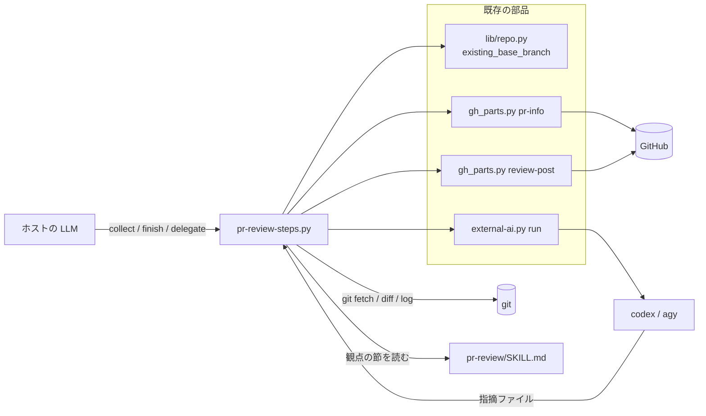
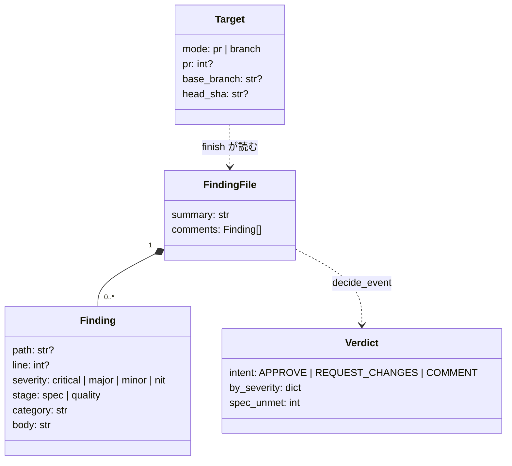
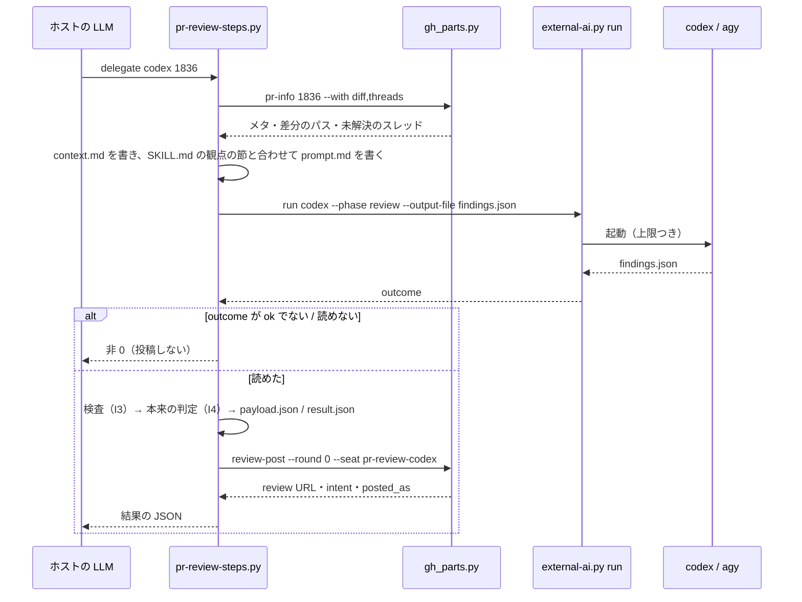
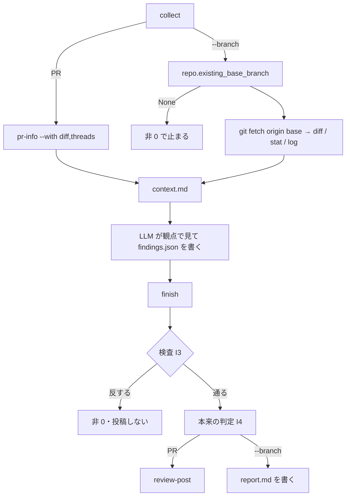

# pr-review: 読むたびに 21,907 B の手順を LLM がたどり、外部 AI が自分で投稿し、外部 AI の待ちに上限が無い → スクリプト 1 本が集める・組む・待つ・判定する・投稿するを持ち、LLM はレビューだけを行う（#860）

## 目的

- **何が壊れているか**: `pr-review/SKILL.md` は 21,907 B あり、ベースブランチの解決・差分の収集・既存コメントの取得・プロンプトの組み立て・投稿と格下げ・投稿の失敗の手当てを bash と文章で持つ。LLM は毎回それを読んで打ち、外部 AI は自分で `gh api` を呼んで投稿する。外部 AI の待ちには上限が無い（#345）
- **誰が困るか**: `/ndf:pr-review` を呼ぶ利用者と、それを工程の中で呼ぶ supervisor（読む量・打つ手順・止まらない待ちの費用を払う）
- **直すと何が成り立つか**: LLM はスクリプトを呼び、レビュー（第 1 段の仕様適合・第 2 段のコード品質）をして指摘ファイルを書くだけになる。判定・投稿・格下げ・待ちの上限はスクリプトと既存の部品が持ち、SKILL.md は 10,240 B 以下になる

## 適用範囲

- **働く範囲**: 配布先のどのリポジトリでも働く（`/ndf:pr-review` は 4 ランタイムの manifests に載る）
- **プロジェクトごとに違うもの**: ベースブランチは `.ndf/worktree.json` の `base_branch`（`lib/repo.py` が読む）、外部 CLI の使用可否は `.ndf/runtimes.json`（`external-ai.py run` が読む）。新しい設定は足さない
- **当たるモード**: `standard`

## あるべき姿の根拠

| 根拠 | 種類 | 何を示すか |
| --- | --- | --- |
| #860 の依頼の原文「上の 5 つがスクリプトの呼び出しになり、SKILL.md が約 10KB 以下になる」「外部 AI の待ちに上限がある（#345）」 | 利用者の指示の原文 | 移す先と大きさの上限 |
| `wc -c plugins/ndf/skills/pr-review/SKILL.md` = 21,907（2026-10-07、ndf 10.17.66） | 実測 | 変える前の大きさ |
| SKILL.md の節の大きさ（観点 3,591 B・重要度 1,276 B・外部 AI への委譲 5,765 B・`--branch` の手順 3,995 B） | 実測 | 観点を残しても 10,240 B に収まる見込み（「SKILL.md の大きさの配分」） |
| `cross-review` の担当は投稿せず指摘ファイルを書き、投稿は回す側が `result_posts.post_review` で行っている（`launch-reviewer.sh`） | 実測（既存の実装） | 外部 AI に投稿させない形が既に動いている |

要求と受け入れ条件は #860 の本文にある（コピーは [issue-860-requirements.md](issue-860-requirements.md)）。この文書は「どう作るか」だけを扱う。決定の理由は [issue-860-design-decisions.md](issue-860-design-decisions.md) にある。

## 例: `/ndf:pr-review 1836 codex` を、変えた後の形で通すと

1. LLM が `python3 "$SKILL_SCRIPTS/pr-review-steps.py" delegate codex 1836` を 1 回打つ
2. スクリプトが `gh_parts.py pr-info 1836 --with diff,threads` で PR のメタ・差分・未解決のスレッド（位置と最初のコメントの本文）を取り、レビューの文脈ファイル `context.md` を書く
3. スクリプトが SKILL.md の `## 観点` の節を読み、文脈ファイルと委譲の決まり（投稿しない・編集しない・指摘ファイルの置き場）を足してプロンプトを書く
4. スクリプトが `external-ai.py run codex --phase review --output-file findings.json` を前景で呼ぶ。上限（1,200 秒。`MONITOR_TIMEOUT` で変えられる）を越えたら非 0 で終わり、投稿しない
5. codex は差分を読んで `findings.json` だけを書く。3 件（`major` 1・`minor` 2）
6. スクリプトが指摘ファイルを検査し、`major` があるので本来の判定を `REQUEST_CHANGES` に決め、payload と判定のファイルを書いて `gh_parts.py review-post --round 0 --seat pr-review-codex` を呼ぶ。自分の PR なので `COMMENT` で送られる
7. LLM は結果の 1 行の JSON（review URL・本来の判定・送った判定・重要度別の件数）を読んで報告する

LLM 自身がレビューするとき（第二引数なし）は、1 が `collect 1836`、5 を LLM が行い、6 が `finish --findings <パス>` になる。

## ドメインモデル

### コンテキスト

| コンテキスト | 何の語が 1 つの意味に決まるか |
| --- | --- |
| NDF の開発ワークフロー（`ndf-workflow`） | レビューの対象・指摘ファイル・本来の判定・仕様適合・ベースブランチ |
| NDF の外部 CLI 委譲（`ndf-agent-cli`） | 外部 CLI の起動・上限つきの待ち・起動結果 |

`ndf-workflow`（pr-review）が顧客、`ndf-agent-cli`（`external-ai.py run`）が供給者の関係（顧客 / 供給者）。pr-review は `run` の引数と結果の JSON（`metrics.outcome`）だけを使い、監視の内部を読まない。

### 集約

| 集約 | 持ち主（書き換えてよいもの） | 根 | エンティティ | 値オブジェクト |
| --- | --- | --- | --- | --- |
| レビューの実行 | `pr-review-steps.py`（文脈ファイル・payload・判定のファイルを書く） | レビューの対象（PR 番号 / `--branch`） | — | ベースブランチ・差分の在りか・未解決のスレッド（位置と最初のコメントの本文）の組・本来の判定（I4 で決め、`<D>/result.json` の `event` に書く） |
| 指摘ファイル | 中身を書くのはレビューする者（LLM か外部 AI）だけ。`pr-review-steps.py` は `collect` が実行の始めに前回のファイルを消すことと、`finish` が読むことだけを行う | 指摘ファイル | 指摘（1 件） | 重要度・段（`spec` / `quality`）・位置（path・line） |
| 投稿 | `gh_parts.py review-post`（既存。変えない） | 1 件のレビュー | — | 送った判定（`posted_as`）。本来の判定は決めず、`result.json` の `event` を読んで `intent` として写すだけ |
| ベースブランチの解決 | `lib/repo.py` | — | — | ベースブランチの名前と出所 |

**指摘ファイルの中身を書くのはレビューする者だけである。** スクリプトが指摘ファイルに行う操作は、`collect` が実行の始めに前回のファイルを消す（前回の指摘を今回の結果として投稿しない）ことと、`finish` が読むことの 2 つに限る。スクリプトは指摘ファイルから別の payload を作り、`review-post` が送れた先を書き戻すのは payload の側になる。

### 不変条件

| # | 集約 | 条件 | 破れたときの扱い |
| --- | --- | --- | --- |
| I1 | ベースブランチの解決 | 宣言のベースブランチが origin にもローカルにも無いとき、既定ブランチへ落とさない | 非 0（3）で止まり、差分を出さない |
| I2 | ベースブランチの解決 | `git ls-remote` の行は参照名が `refs/heads/<名前>` と完全に一致するときだけ「ある」と読む | 別のブランチだけが返れば「無い」（I1 へ） |
| I3 | 指摘ファイル | 重要度は `critical` / `major` / `minor` / `nit` のどれか、段は `spec` / `quality` のどれか（省けば `quality`） | 投稿せず非 0（2）で止まり、どの指摘かを出す |
| I4 | レビューの実行 | 本来の判定は指摘の集合だけから決まる（`critical`・`major`・段 `spec` のどれかが 1 件以上 → `REQUEST_CHANGES`、`minor`・`nit` だけ → `COMMENT`、0 件 → `APPROVE`） | — （関数の出力。テストで縛る） |
| I5 | レビューの実行 | 投稿は指摘ファイルを読めた後に 1 回だけ行う。上限越え・ファイル無し・形が読めないときは投稿しない | 非 0 で終わる |
| I6 | レビューの実行 | `--branch` のときは投稿しない | — （`finish` が `review-post` を呼ばない） |
| I7 | レビューの実行 | PR モードで未解決のスレッドを取れないときは、重複防止なしで進めない | 非 0（2）で止まる |

### ドメインイベント

| # | イベント | 発生元 | 受け手 |
| --- | --- | --- | --- |
| E1 | レビューの対象を決めた | `collect`（`delegate` の中も同じ） | E2・E3 |
| E2 | ベースブランチを解決した（`--branch`） | `lib/repo.py` の `existing_base_branch` | `collect` の差分の収集 |
| E3 | 差分と統計と履歴、または PR のメタと差分を集めた | `collect` | 文脈ファイル |
| E4 | 未解決のスレッドを集めた（PR モード） | `gh_parts.py pr-info --with threads` | 文脈ファイル |
| E5 | 外部 AI へのプロンプトを組んだ | `delegate` | `external-ai.py run` |
| E6 | 外部 AI が指摘ファイルを書いた | 外部 AI（`run` が回収） | `finish` の処理 |
| E7 | LLM がレビューして指摘ファイルを書いた | ホストの LLM | `finish` |
| E8 | 本来の判定を決めた | `finish` | 投稿（PR）・報告（`--branch`） |
| E9 | PR へ投稿した | `gh_parts.py review-post` | 報告 |
| E10 | 結果を報告した | ホストの LLM | 利用者 |

### 用語

| 用語 | 意味 | 用語集への反映 |
| --- | --- | --- |
| 指摘ファイル | レビューする者（`cross-review` の担当・`pr-review` の LLM か外部 AI）が書く、指摘の全件と総評のファイル | 意味の変更（`ndf-workflow`。語の正本 `development-workflow/references/glossary.md` の行は実装で合わせる） |
| レビューの文脈ファイル | `pr-review-steps.py collect` が書く、レビューの対象・差分の在りか・未解決のスレッド（位置と本文）・指摘ファイルの書き方をまとめたファイル。外部 AI へのプロンプトはこれに観点と委譲の決まりを足して組む | 追加（`ndf-workflow`） |
| 仕様適合 | レビューの第 1 段。受け入れ条件・不変条件・対象範囲・テストが仕様を表すかを見る。満たさない指摘は指摘ファイルで段 `spec` を持つ | 追加（`ndf-workflow`） |
| 未解決のスレッド | 要求で追加済み（意味は変えない） | — |
| 本来の判定 | 要求で追加済み（意味は変えない） | — |

## 機能一覧

| # | 機能 | 誰が使うか |
| --- | --- | --- |
| F1 | レビューの対象を集めて文脈ファイルを作る（PR モード / `--branch`） | `/ndf:pr-review` を通す LLM |
| F2 | `--branch` の起点（ベースブランチ）を宣言から実在を確かめて決める | F1 |
| F3 | 外部 AI（codex / agy）に上限つきでレビューさせ、指摘ファイルを回収する | 第二引数を渡した利用者 |
| F4 | 指摘ファイルから本来の判定を決める | F3・ホストの LLM |
| F5 | PR へ 1 件のレビューとして投稿する（自分の PR は `COMMENT`） | F4 の後（PR モード） |
| F6 | `--branch` の報告を指摘ファイルから組む | F4 の後（`--branch`） |

## 構成要素

| 要素 | 責務 | 新規 / 変更 |
| --- | --- | --- |
| `plugins/ndf/skills/pr-review/scripts/pr-review-steps.py` | 部分命令 `collect` / `finish` / `delegate`。対象の決定・文脈ファイル・プロンプト・指摘ファイルの検査・本来の判定・payload と判定のファイル・投稿の呼び出し・`--branch` の報告 | 新規 |
| `plugins/ndf/scripts/lib/repo.py` の `existing_base_branch` | 宣言のベースブランチの実在の確認（取得済みの参照 → `git ls-remote` の参照名の照合）と、宣言が無いときの既定ブランチへの落とし方 | 変更（関数を 1 つ足す。既存の関数は変えない） |
| `plugins/ndf/skills/pr-review/SKILL.md` | 引数・2 つのモード・観点（第 1 段・第 2 段・重要度）・指摘の振り分け・スクリプトの呼び方・報告 | 変更（10,240 B 以下へ） |
| `plugins/ndf/skills/external-ai/SKILL.md` | pr-review への言及 2 か所を「`pr-review-steps.py delegate` が `run --phase review` で呼ぶ」に合わせる | 変更 |
| `gh_parts.py pr-info` / `review-post` | PR のメタ・差分・未解決のスレッドの取得 / 投稿・格下げ・位置の拒否の退避 | 既存（引数は変えない。`pr-info --with threads` の thread item に `body` が増える。下の `gh_pr_info.py` の行） |
| `plugins/ndf/scripts/lib/gh_graphql.py` の `UNRESOLVED_THREADS_QUERY` / `UNRESOLVED_THREADS_JQ` / `unresolved_threads` | 今のクエリは `nodes { id isResolved path line }` だけを取り、jq は 3 列の `@tsv` なので、本文はどこからも来ない。クエリの `nodes` に最初のコメントの本文 `comments(first: 1) { nodes { body } }` を足し、jq で本文の改行を空白へ畳み先頭 200 字にしてから第 4 列として出す（`@tsv` は改行を `\n` の 2 文字へエスケープするため、畳むのは jq の中で行う）。`unresolved_threads` は第 4 列を `body` の鍵として各要素に足す。`unresolved-threads` 経路は要素を `**t` で写すため、そのまま本文が載る | 変更（クエリに本文を足し、jq の列と要素の鍵を 1 つずつ足す。既存の鍵 `thread_id` / `path` / `line` は変えない） |
| `plugins/ndf/scripts/lib/gh_pr_info.py` の `_thread_items` | `pr-info --with threads` 経路（delegate の主経路）。thread item を `kind` / `name` / `result` / `thread_id` / `path` / `line` の鍵で明示して組み直すため、`unresolved_threads` が返す `body` はここで落ちる。thread item に `body` を写す | 変更（鍵を 1 つ足す。既存の鍵は変えない） |
| `external-ai.py run` | 外部 CLI の起動・上限つきの待ち・回収 | 既存（変えない） |
| `plugins/ndf/skills/pr-review/tests/` | F1〜F6 と I1〜I7 のテスト | 新規 |

処理の流れの図に現れないのは、文書の `external-ai/SKILL.md` とテストだけである。



置き場:

```text
plugins/ndf/
├── scripts/lib/repo.py                     # existing_base_branch を足す
└── skills/pr-review/
    ├── SKILL.md
    ├── scripts/pr-review-steps.py          # 新規
    └── tests/test_pr_review_steps.py       # 新規（repo.py の追加分のテストもここ）
```

### SKILL.md の大きさの配分

| 節 | 今 | 変えた後 | 扱い |
| --- | --- | --- | --- |
| frontmatter・引数・2 つのモード | 1,973 B | 約 1,700 B | 引数と例は残す（Skill 名・引数は変えない） |
| `## 観点`（第 1 段・第 2 段・具体的なチェックポイント・重要度） | 4,867 B | 約 4,900 B | 中身は変えず、重要度の表を `## 観点` の中へ移す。スクリプトがこの節を読む |
| 指摘の振り分け | 663 B | 約 600 B | 残す（LLM の判断） |
| 手順（`--branch` の手順・PR モードの手順・投稿・既存コメント・補助コマンド） | 7,445 B | 約 1,600 B | bash・payload・既存コメントの取得・補助コマンドを除く |
| 外部 AI への委譲 | 5,765 B | 約 500 B | `delegate` の 1 行と、結果の読み方だけ |
| 報告・進捗記録・関連 | 1,194 B | 約 800 B | 残す |
| 計 | 21,907 B | 約 10,100 B | 上限 10,240 B |

## 構造



`decide_event(findings) -> Verdict` は副作用を持たない関数にする（I4 のテストの単位）。検査（I3）は別の関数で、読めない指摘の一覧を返す。

## 入出力の契約

### `pr-review-steps.py`

結果はどの部分命令も 1 行の `step_result` の JSON（`tool: "pr-review"`）を標準出力へ出す。終了コードは `step_result` の定数（0 / 1 / 2 / 3）に従う。

| 部分命令 | 入力 | 出力（成功） | 失敗の形 |
| --- | --- | --- | --- |
| `collect [<PR番号>] [--branch] [--focus AREA] [--out-dir D] [--repo R]` | PR 番号（省けば今のブランチの PR）。`--branch` と PR 番号は同時に渡さない | 文脈ファイル `<D>/context.md` を書く。`metrics`: `mode`・`context`（パス）・`findings`（書くべき指摘ファイルのパス `<D>/findings.json`）・`pr`・`head_sha`・`base_branch`・`changed_files`・`unresolved_threads` | 今のブランチに PR が無い → 3。宣言のベースブランチが無い（I1）→ 3。ベースブランチが決まらない → 3。PR・差分・未解決のスレッドを取れない（I7）→ 2。`git fetch` が失敗 → 2。引数の誤り → 2 |
| `finish --findings F (--pr N \| --branch) [--reviewer NAME] [--out-dir D] [--repo R]` | 指摘ファイル。`--reviewer` は席の名前に入れるレビューする者（`host` / `codex` / `agy`。既定 `host`） | PR: `review-post` の結果を `items` に写す（`review_url`・`intent`・`posted_as`）。`metrics`: `intent`・`by_severity`・`spec_unmet`・`findings`。`--branch`: `metrics.report` に報告のファイル `<D>/report.md` | 指摘ファイルが無い・JSON でない・`comments` が配列でない → 2。I3 に反する → 2（`items` に読めない指摘の番号と理由）。`review-post` の失敗 → その終了コードをそのまま返し、指摘ファイルと payload を残す |
| `delegate <codex\|agy> [<PR番号>] [--branch] [--focus AREA] [--out-dir D] [--repo R] [--timeout 秒]` | `collect` と同じ。`--timeout` は `external-ai.py run --timeout` へ渡す | `finish` と同じ（`--reviewer` は CLI の名前） | `collect` の失敗 → そのまま。`run` の `outcome` が `ok` でない → 1（`items` に `run` の `outcome` と `metrics.reason` を写す）。回収した本文が指摘ファイルとして読めない → 2。どちらも投稿しない（I5） |

`--out-dir` の既定は `<一時ディレクトリ>/ndf/pr-review/<owner--repo>-pr<番号>`（`--branch` は `-branch-<ブランチ名の / を - にしたもの>`）。前の実行の `findings.json` は `collect` が消す（前回の指摘を今回のものと読まない）。

### 指摘ファイル（`findings.json`）

`cross-review` の担当が書く形（`summary` + `comments[]`）に、段と分類を足したものである。`cross-review` の指摘ファイルは変えない。

```json
{
  "summary": "総評（設計・横断の所見だけ。個別の指摘を繰り返さない）",
  "comments": [
    {"path": "src/foo.py", "line": 42, "severity": "major", "stage": "quality",
     "category": "可読性", "body": "70 行の関数。〇〇 と △△ に分ける"},
    {"severity": "major", "stage": "spec", "category": "受け入れ条件",
     "body": "受け入れ条件 4 の並び順を満たすテストが無い"}
  ]
}
```

| 鍵 | 必須 | 規則 |
| --- | --- | --- |
| `summary` | 任意 | 文字列 |
| `comments[].severity` | 必須 | I3 |
| `comments[].stage` | 任意 | I3。省けば `quality` |
| `comments[].category` | 任意 | 文字列。本文の接頭辞に使う |
| `comments[].path` / `line` | 任意 | 差分の行を指す。指せないものは省く（総評へ回る） |
| `comments[].body` | 必須 | 空でない文字列 |

### `finish` が `review-post` へ渡すもの

| ファイル | 中身 |
| --- | --- |
| `<D>/payload.json` | `summary` = 「### 仕様適合（満たさない）」の箇条（段 `spec` の指摘の 1 行ずつ）+ 指摘ファイルの `summary`。`comments[]` = 段 `quality` の全件と、位置を持つ段 `spec` の指摘。各 `body` の先頭に `[<重要度> / <分類>] ` を付ける（既に `[<重要度> /` で始まるものは付けない）。`severity` を残す |
| `<D>/result.json` | `{"event": <本来の判定>, "by_severity": {...}}` |

呼び出しは `python3 "$SCRIPTS/lib/gh_parts.py" review-post --payload <D>/payload.json --result <D>/result.json --pr <N> --round 0 --seat pr-review-<reviewer>` の 1 回である（決定 5）。

### 文脈ファイル（`context.md`）の節

| 節 | PR モード | `--branch` |
| --- | --- | --- |
| 対象 | repo・PR 番号・URL・題・head の SHA・ベースブランチ・作業ディレクトリ | ブランチ名・ベースブランチ（`origin/<名前>`）・作業ディレクトリ |
| 受け入れ条件の在りか | PR の本文（そのまま載せる） | 「`issues/` の実装計画か要求のコピーから取る」の 1 行 |
| 差分 | `pr-info` が保存した差分のファイルのパスと、変更ファイルの一覧 | `git merge-base origin/<base> HEAD` を起点にした `git diff <起点> --name-only` と `--stat` の出力（分岐の後に起点へ入った変更を混ぜない）、`git log origin/<base>..HEAD --oneline`、差分を保存したファイルのパス |
| 未解決のスレッド | `path:line` と最初のコメントの本文（`body`）の一覧（無ければ「なし」）と、「同じ位置へ本文と同じ趣旨の指摘を出さない。同じ位置でも趣旨が違えば出す」の 1 行 | 節を作らない |
| 重点 | `--focus` の値（無ければ節を作らない） | 同じ |
| 指摘ファイルの書き方 | 置き場のパス・上の JSON の形・鍵の規則。**この節の文は `pr-review-steps.py` だけが持つ** | 同じ |

### `lib/repo.py` の追加

```python
def existing_base_branch(root, remote: str = "origin") -> tuple[str | None, str]:
    """差分の起点にするベースブランチと、その出所（または決まらない理由）。"""
```

| 場合 | 戻り値 |
| --- | --- |
| 宣言があり、`refs/remotes/<remote>/<名前>` か `refs/heads/<名前>` がある | `(名前, "宣言（取得済みの参照）")` |
| 宣言があり、取得済みの参照に無く、`git ls-remote --heads <remote> refs/heads/<名前>` の行の参照名が完全一致する | `(名前, "宣言（origin へ問い合わせ）")` |
| 宣言があり、どちらにも無い（別のブランチだけが返る場合を含む） | `(None, "<名前> は origin にもローカルにも無い")` |
| 宣言が無く、origin の HEAD がある | `(HEAD の指す先, "既定ブランチ")`（`default_branch(root)`） |
| 宣言も origin の HEAD も無く、ローカルに `main` か `master` がある | `(main または master, "既定ブランチ")`（同じ） |
| 宣言も origin の HEAD も `main` / `master` も無い | `(None, "宣言も origin の HEAD も main / master も無い")` |

`ls-remote` は `GIT_TERMINAL_PROMPT=0` で呼ぶ（今の SKILL.md と `worktree-branch.sh` の `wt_branch_exists` と同じ）。宣言を読むのは既存の `declared_base` で、`.ndf/worktree.json` を読むコードは `repo.py` の外に増えない。

**互換性**: 既存の関数・CLI・結果の形は変えない。`review-post` と `pr-info` と `run` は引数も結果も今のまま使う。例外は `pr-info --with threads` の thread item と `unresolved_threads` の要素に `body` の鍵が 1 つ増えることだけで、既存の鍵は変えない。

## 処理の流れ



ホストの LLM がレビューする流れと `--branch` の流れ:



## 非機能の実現方式

| 大項目 | 要求の条件 | 実現方式 | 確かめ方 |
| --- | --- | --- | --- |
| 性能・拡張性 | SKILL.md の大きさを変更の前後で `wc -c` で測り、PR 本文に載せる（21,907 B → 10,240 B 以下） | 「SKILL.md の大きさの配分」のとおり手順の bash と委譲の節を除く | `wc -c plugins/ndf/skills/pr-review/SKILL.md` |
| 運用・保守性 | ベースブランチの解決・投稿と格下げ・外部 CLI の起動と待ちは、それぞれ既存の 1 か所を呼び、新しい写しを作らない | `repo.existing_base_branch`・`gh_parts.py review-post`・`external-ai.py run` を呼ぶ。`pr-review-steps.py` は `git ls-remote` と `gh api` を自分で打たない | テスト（呼び出しを偽のコマンドで記録し、直接の `gh api` が無いことを見る）と `grep -n "worktree.json" plugins/ndf/skills/pr-review` |
| セキュリティ | payload とプロンプトはスクリプトが JSON・ファイルとして組み、シェルの文字列へ値を埋め込まない。外部 AI に `gh api` の投稿を許す必要が無くなる | payload は `json.dumps` で書き、子のプロセスは argv の配列で起動する（`shell=True` を使わない）。プロンプトに「投稿しない・GitHub と git へ書かない・リポジトリを編集しない」を入れる | テスト（PR の題に `"` と `$()` を含めても payload が壊れない） |
| システム環境 | どのホストからも `$SCRIPTS` の解決で呼べる。標準ライブラリと既存の `scripts/lib` だけを使う | Skill の `scripts/` に置き、`resolve.sh scripts pr-review` で解く（`fix-steps.py` の前例）。`gh_parts.py` は子のプロセスとして呼び、外部パッケージの用意は `gh_parts.py` の `deps.require` に任せる | `python3 -I pr-review-steps.py --help` が uv の環境なしで動く |

## テスト設計

| 受け入れ条件・不変条件 | どの振る舞いで縛るか | どう壊したら落ちるべきか |
| --- | --- | --- |
| `--branch` の 1 回の呼び出しがベースブランチ・変更ファイル・統計・履歴を出す | 一時のリポジトリで `collect --branch` を打つと、`metrics.base_branch` と文脈ファイルに 4 つが載る | 統計か履歴の収集を消す |
| ベースブランチの 5 通り（I1） | `existing_base_branch` が要求の 5 通り（「`repo.py` の追加」の表の 1・2・3・4・5 行目）で表のとおりを返し、6 行目の場合は `None` を返す。どこにも無いとき `collect --branch` は 3 で終わり、文脈ファイルを書かない | 実在の確認を外して宣言をそのまま返す／無いときに `default_branch` へ落とす |
| `ls-remote` が別のブランチだけを返すと「無い」（I2） | `refs/heads/x/refs/heads/<名前>` だけを持つ origin で `None` が返る | 照合を終了コードだけ・末尾一致に変える |
| `.ndf/worktree.json` を読むコードが `repo.py` だけ | `pr-review-steps.py` と SKILL.md に `worktree.json` の語が無い（`grep` のテスト。振る舞いでなくコードの写しの検査として置く） | スクリプトに宣言の読み込みを書く |
| 未解決のスレッドが `pr-info --with threads` からプロンプトへ渡る（I7） | `gh_pr_info._thread_items` の出力（`unresolved_threads` を偽にして呼ぶ）の thread item に `body` が載り、それが文脈ファイルとプロンプトに `path:line` と本文として載る。スレッドが取れない結果のときは 2 で止まる。`UNRESOLVED_THREADS_QUERY` が最初のコメントの本文（`comments(first: 1) { nodes { body } }`）を取り、`UNRESOLVED_THREADS_JQ` を実際の GraphQL 応答の形の JSON（改行を含む本文を持つ）に `jq` で当てると、改行を空白へ畳んだ本文が第 4 列に出る。`unresolved_threads` がその 4 列の出力から `body` を返し、既存の鍵は変わらない | スレッドを渡さない／本文を落として位置だけを渡す／取れないときに「なし」で進める |
| SKILL.md に `pulls/<番号>/comments`・`jq -n`・`-X POST .../reviews`・プロンプトの雛形・起動フラグ・結果サマリが無い | — （文言の検査は書かない。完了判定で `grep` の証跡を取る） | — |
| event の表（I4） | `decide_event` が表の 3 行を返す。段 `spec` の `minor` 1 件だけでも `REQUEST_CHANGES` | `spec` を見落とす／`minor` を `REQUEST_CHANGES` にする |
| 重要度が 4 つのどれでもない（I3） | `finish` が 2 で終わり、`review-post` を呼ばない。段が `spec` / `quality` 以外でも同じ | 不明な重要度を `minor` とみなす |
| 投稿が `review-post` の 1 回（I5） | 偽の `gh_parts.py` が `review-post` を 1 回だけ、`--round 0 --seat pr-review-<名前>` で受ける。payload に仕様適合の箇条と接頭辞が載る | 2 回呼ぶ／自分で `gh api` を打つ |
| 自分の PR は `COMMENT`、本来の判定が残る | 偽の `review-post` が返した `intent` と `posted_as` が `finish` の結果に写る | `posted_as` を `intent` として返す |
| `--branch` は投稿しない（I6） | `finish --branch` が `review-post` を呼ばず、`report.md` を書く | `--branch` でも投稿する |
| 委譲でスクリプトがプロンプトを組み `run --phase review` で起動 | 偽の `external-ai.py` が受けた argv に `--phase review` と `--output-file <D>/findings.json` があり、プロンプトに観点の節と文脈ファイルの中身が入る | `--phase` を落とす／観点を写した定数から組む |
| 観点の正本が 1 か所 | プロンプトの観点が SKILL.md の `## 観点` の節と一致する（SKILL.md を書き換えるとプロンプトが変わる） | スクリプトに観点の文を持たせる |
| 外部 AI は投稿せず指摘ファイルを書く | プロンプトに投稿の禁止と指摘ファイルの置き場が入る。投稿は `finish` の経路だけが行う | プロンプトに `gh api` の投稿の指示を残す |
| 上限越えで非 0・投稿しない（#345・I5） | 応答しない偽の CLI と短い上限（`--timeout`）で `delegate` を打つと、上限の後に 1 で終わり、`review-post` が呼ばれない | 上限を渡さない／`timeout` の後に投稿する |
| SKILL.md が 10,240 B 以下・観点が残る・名前と引数・manifests | — （完了判定で `wc -c`・`check-skill-frontmatter.py`・manifests の `grep` の証跡を取る） | — |
| 全体テスト | `uv run --frozen --project . --all-extras pytest . -q -n 4` が通る | — |

## 設計の結果

| 課題 | 扱い | 取り込み先 | 触るファイル |
| --- | --- | --- | --- |
| #860 | 実装する | — | `plugins/ndf/skills/pr-review/`、`plugins/ndf/scripts/lib/repo.py`、`plugins/ndf/scripts/lib/gh_graphql.py`、`plugins/ndf/scripts/lib/gh_pr_info.py`、`plugins/ndf/skills/external-ai/SKILL.md`、`plugins/ndf/skills/development-workflow/references/glossary.md`、`docs/glossary/glossary.json`、`docs/glossary.md` |

## 未確認のまま残ること

| 項目 | 内容 |
| --- | --- |
| SKILL.md の大きさ | 配分は見込みで、観点を変えずに 10,240 B へ収まるかは書いて測るまで分からない。収まらないときは指摘の振り分けの表を短くし、観点の中身は削らない（削るなら要求へ戻す） |
| `review-post` の `--round 0` | `result_posts` と `post_queue` が 0 を拒まないことはコードを読んで確かめたが、実行では確かめていない。実装の最初のテストで確かめる |
| 未解決のスレッドの本文での重複防止 | 本文の先頭 200 字で趣旨を見分けられるかは実測していない。リリース後テストで重複と取りこぼしを見る |
| 外部 AI の stdout からの回収 | `run` は結果ファイルが無いと stdout を出力のファイルへ写す。codex が JSON を地の文に包んで出したときは読めずに 2 で終わる。リリース後テストで回数を見る |
| 開発版での手動確認 | 要求の検証手段の「手動確認」（`/ndf:pr-review <PR番号>` と `codex` を 1 回ずつ）は配布の後に行う |
