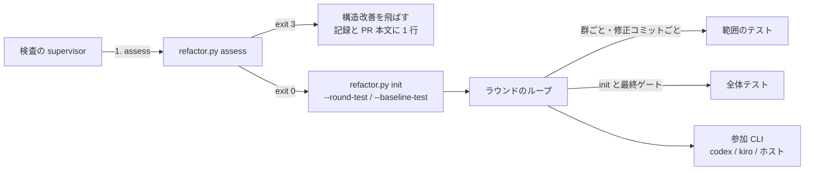
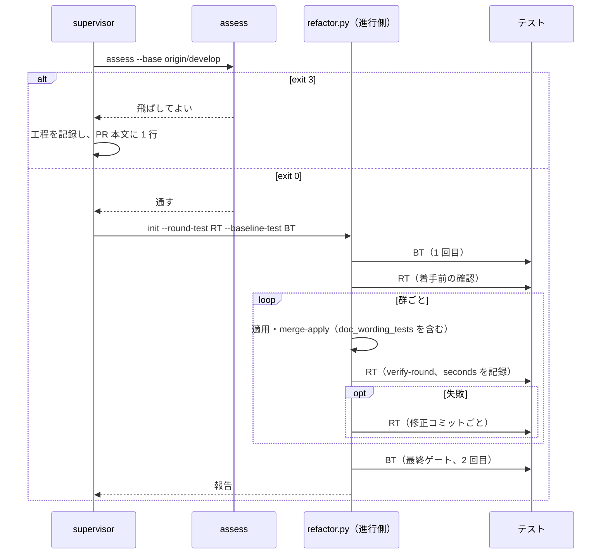

# #880 / #883 / #494 / #723 / #885: cross-refactoring を是正して、構造改善の工程を戻せる状態にする — 設計

要求と受け入れ条件は [issue-880-885-requirements.md](issue-880-885-requirements.md)、決定の理由は
[issue-880-885-design-decisions.md](issue-880-885-design-decisions.md) にある。この文書は「どう作るか」だけを扱う。

## 例 1: 検査の持ち場が構造改善の工程に入る（#494・#880）

実装の Pull Request #910（仮）の差分が `plugins/ndf/skills/cross-refactoring/scripts/refactor_lib/gitfacts.py` の
40 行と、その `tests/test_git_facts.py` の追加だったとする。

| 順 | 誰が | すること | 出力 |
| ---: | --- | --- | --- |
| 1 | supervisor | `python3 "$RF/refactor.py" assess --base origin/develop` | `判定: 通す` / `本番コード: 1 ファイル・40 行` / exit 0 |
| 2 | supervisor | 範囲のテストと全体テストを決める | `--round-test "uv run --with pytest pytest plugins/ndf/skills/cross-refactoring/tests -q"`、`--baseline-test "uv run ... pytest . -q -n 4"` |
| 3 | 進行側 | `init` が全体テストを 1 回、範囲のテストを 1 回走らせる | 両方 green で始まる |
| 4 | 進行側 | 群ごとの `verify-round` が範囲のテストだけを走らせる | 検証の記録に `seconds: 4.1` |
| 5 | 進行側 | 最終ゲートが全体テストを 1 回走らせる | 合格で報告へ |

同じ持ち場で差分が `plugins/ndf/skills/development-workflow/references/workflow-modes.md` だけなら、順 1 が
`判定: 飛ばしてよい` / `理由: 本番コードの差分がありません` / exit 3 を返す。supervisor は `cross-refactoring` を
起動せず、工程「構造改善」を記録し、Pull Request の本文に `構造改善: 飛ばした（本番コードの差分がありません）` を残す。

## 例 2: テストの打ち切り（#883）

| 入力 | 今 | 変更の後 |
| --- | --- | --- |
| `exec sleep 30`、上限 1 秒 | 6.03 秒（上限 1 秒 ＋ 猶予 5 秒） | 約 1.2 秒（SIGTERM で子が終わった次の点検で戻る） |
| `trap '' TERM; (sleep 3 && touch x) & sleep 30`、上限 1 秒・猶予 1 秒 | 約 2 秒で SIGKILL | 同じ（子がグループに残るため猶予を待ってから SIGKILL） |

## 機能一覧

| # | 機能 | 課題 | 誰が使うか |
| --- | --- | --- | --- |
| F1 | 群と修正コミットの検証を `--round-test` で行い、全体テストを着手前と最終ゲートへ寄せる | #880 | cross-refactoring の進行側 |
| F2 | `--round-test` を渡さず範囲より広い `--baseline-test` を渡したときの案内 | #880 | cross-refactoring を起動する側 |
| F3 | 検証の所要の秒数を記録する | #880 | 構造改善を戻す判断（AC21） |
| F4 | 検査の持ち場が 2 つのテストのコマンドを決める基準 | #880 | supervisor |
| F5 | 打ち切りが、子が終わった時点で戻る | #883 | cross-refactoring の進行側・テスト |
| F6 | 構造改善を飛ばしてよいかを差分から判定する（`refactor.py assess`） | #494 | supervisor |
| F7 | 飛ばす条件と退避する条件を分けて書き、飛ばした記録の残し方を決める | #494 | supervisor |
| F8 | テスト整備ラウンドが `.md` を対象にした提案を採らない | #723 | cross-refactoring の進行側・参加 CLI |
| F9 | 適用ラウンドが `.md` を読むテストの追加を弾く | #723 | cross-refactoring の進行側 |
| F10 | リポジトリの `.md` の文言固定テストを削り、参照切れを検査スクリプトへ寄せる | #885 | 開発者・継続的統合 |
| F11 | テストを書く規約へ方針を書く | #885 | テストを書く人・AI |

## 構成要素

### cross-refactoring（F1〜F3・F5・F6・F8・F9）

| 要素 | 機能 | 変えること |
| --- | --- | --- |
| `scripts/refactor.py` の `init` の引数 | F1 | `--round-test CMD` を足す（任意）。`--baseline-test` の help を「着手前と最終ゲートで実行する全体のテスト」へ直す |
| `scripts/refactor.py` の副命令 | F6 | `assess` を足す（`--base REF`、任意の `--max-lines N`（既定 10））。実体は `refactor_lib/commands/assess.py` |
| `refactor_lib/commands/setup.py` | F1 F2 | 状態へ `round_test`（`command`・`status`）を保存する。`init` で全体テストの後に範囲のテストを 1 回実行し、失敗なら止める。`--round-test` を省いたとき、または `round_test.command` が `baseline_test.command` と同じ文字列のときは、全体テストを 1 回だけ実行し、その結果を `round_test.status` にも写す。`require_scope_covers_tests` へ渡すコマンドを `round_test` に替える。F2 の案内を出す。`ResumeField` に `round_test` を足す |
| `refactor_lib/commands/converge.py` の `cmd_verify_round` | F1 F3 | 実行するコマンドを `_round_test_command(state)` から取る。検証の記録へ `seconds` を足す |
| 同 `_inspect_fix_commits` | F1 | `collect_commit_facts` へ渡すコマンドを `_round_test_command(state)` に替える |
| `refactor_lib/commands/gate.py` の `cmd_final_gate` / `_local_gate` / `_verify_final_fix_commits` | F1 F3 | 最終ゲートの判定は今のまま `baseline_test`。`workflow_step` が偽でも、`round_test` が `baseline_test` と違えば先に `_local_gate` を通す。通れば今のとおり cross-review へ渡し、落ちれば `--workflow-step` と同じ修正ラウンドへ入る。修正コミットの検証は `round_test`。最終ゲートの記録（`final_gate.checks` の各件）へ `command`・`seconds` を足す |
| `refactor_lib/gitfacts.py` の `_kill_process_group` | F5 | SIGTERM の後の点検で、先に `proc.poll()` で親シェルを回収し、その後にグループの存否を `killpg(pgid, 0)` で見る。回収済みでグループが空なら戻る |
| `refactor_lib/gitfacts.py`（新設の関数 `production_code_changes`） | F6 | `git diff --numstat --no-renames <base>...HEAD` から、本番コードのファイルと変更行を返す。rename は旧パスの削除と新パスの追加に分けて数える（`--no-renames` を付けないと `dir/{old.py => new.py}` の形になり、拡張子で判定できない）。本番コードの判定は `CODE_EXTENSIONS` と既存の `_is_test_path` |
| `refactor_lib/scope.py`（新設の関数 `round_test_hint`・`round_test_roots`） | F1 F2 | `round_test_hint`: `--round-test` が無く、`baseline_search_roots` が空か、`--scope` のテストの置き場所より広いときに案内の 1 行を返す。`round_test_roots`: `--round-test` の引数から次の順で実行集合の起点を返す。(a) 直前の語が `--` で始まり `=` を含まない長いオプション（`--project`・`--directory`・`--rootdir` など）の値は起点に数えない。(b) 作業ディレクトリの根そのもの（`.` など、正規化して根になる語）は起点に数えない。(c) 残った語のうち、実在するディレクトリと、テストの置き場所に当たる実在するファイル（`_is_test_path` が真）を起点にする。`bash scripts/run-scope-tests.sh` や `python scripts/run_tests.py` のようにテストの置き場所でないファイル（ラッパー・実行スクリプト）は起点に数えない（`baseline_search_roots` はファイル引数を無視するまま変えない）。起点が 1 つも残らなければ全体を覆うとみなす（ラッパーの中身は解析しない。範囲の外を走らせても最終ゲートの全体テストが見る）。`init` はこの起点で `--scope` のテストの置き場所を覆うかを判定する |
| `refactor_lib/proposals.py` の `merge_test_proposals` の `reject` | F8 | `target` の `#` より前が `.md` で終わる提案を「文書の文言を固定するテストは足さない」で見送る |
| `refactor_lib/verify.py`（新設の関数 `doc_wording_tests`）と `verify_apply_round` | F9 | テストのファイルの追加行に、追跡している `.md` のパスを指す文字列があれば、その群を失敗にする。追跡している `.md` の一覧は `git ls-files '*.md'` を 1 回読む |
| `prompts/propose-tests.md` の「守ること」 | F8 | 1 項目を足す（下の「入出力の契約」） |
| `SKILL.md` の「引数」「設計方針」の検証の単位の行 | F1 | `--round-test` の行を足し、`--baseline-test` の意味を直す |
| `CLAUDE.md` の cross-refactoring の節 | F1 | 起動の例の 1 行目に `--round-test` を足す。#892 が触る cross-review の節には触れない |
| テスト（`tests/test_git_facts.py` ほか） | F1〜F3 F5 F6 F8 F9 | 下の「テスト設計」 |

### development-workflow（F4・F7）

| 要素 | 機能 | 変えること |
| --- | --- | --- |
| `references/workflow-modes.md` の「構造改善の退避先」 | F7 | 節を 2 つの表に分ける。「飛ばす」（`assess` の終了コード 3）と「`refactoring` 単独へ退避する」（今の 3 つの条件）。飛ばしたときの記録の残し方を書く |
| `references/stage-notes.md` の構造改善の段落 | F4 F7 | 構造改善に入ったら最初に `assess` を実行すること、通すときに `--round-test` に範囲のテスト・`--baseline-test` に全体テストを渡すことを書く |

**`waiting.md`・`agent-layers.md` には触れない**（#892 #901 の実装が触る）。

### テストと規約（F10・F11）

| 要素 | 機能 | 変えること |
| --- | --- | --- |
| `.md` の文言を照合する pytest（下の「#885 の棚卸」） | F10 | 削る。ファイルの全関数が削る対象ならファイルごと消す |
| 参照切れを見ていたテスト | F10 | 検査スクリプト（`scripts/check-markdown-links.py` ほか）で同じ参照が失敗として現れることを確かめてから削る。現れないものは検査スクリプトへ判定を足す |
| `plugins/ndf/skills/tdd-cycle/references/test-quality.md` | F11 | 「## よくある例と代替」の下に `### 8. .md の文言を照合する` を新設し、「## 削除してよいテスト」に `.md` の文言照合の 1 行を足す |
| `plugins/ndf/skills/quality-gates/SKILL.md` | F11 | 受け入れ条件の検査に文書の文言照合を使わないと書く |
| `AGENTS.md` の「ベストプラクティス」の DON'T | F11 | 1 行足す |

## パッケージ・モジュール構成

```text
plugins/ndf/skills/cross-refactoring/
├── SKILL.md                         … 引数の表に --round-test、副命令に assess
├── prompts/propose-tests.md         … 守ることに 1 項目
└── scripts/
    ├── refactor.py                  … init の引数、assess の副命令
    └── refactor_lib/
        ├── commands/
        │   ├── assess.py            … 新設（F6）
        │   ├── setup.py             … round_test の保存・実行・案内
        │   ├── converge.py          … verify-round と修正の検証のコマンド、seconds
        │   └── gate.py              … 単独起動でも全体テスト 1 回、記録
        ├── gitfacts.py              … _kill_process_group、production_code_changes
        ├── scope.py                 … round_test_hint、round_test_roots
        ├── proposals.py             … merge_test_proposals の reject
        └── verify.py                … doc_wording_tests
plugins/ndf/skills/development-workflow/references/
├── workflow-modes.md                … 構造改善の退避先
└── stage-notes.md                   … 構造改善の段落
```

## システム構成（文脈）



## 入出力の契約

### `refactor.py init` の 2 つのテスト（F1・F2）

| 引数 | 意味 | 既定 | 実行する時点 |
| --- | --- | --- | --- |
| `--baseline-test CMD` | 全体のテスト（必須） | — | `init` の 1 回、最終ゲートの 1 回 |
| `--round-test CMD` | 範囲のテスト（任意） | `--baseline-test` と同じ | `init` の 1 回、群の検証（`verify-round`）ごと、修正コミットごと、最終ゲートの修正コミットごと |

状態ファイルに足す欄:

```json
{
  "round_test": {"command": "uv run --with pytest pytest plugins/ndf/skills/cross-refactoring/tests -q", "status": "green"},
  "rounds": [{"verifications": [{"apply_round": 1, "command": "…", "status": "pass", "seconds": 4.1}]}],
  "final_gate": {"checks": [{"mode": "test", "command": "…", "status": "pass", "seconds": 58.3}]}
}
```

| 状況 | 動き |
| --- | --- |
| `round_test` が無い状態ファイル（変更の前の実行）の再開 | `_round_test_command(state)` が `baseline_test.command` を返す（AC7） |
| `--round-test` を省いたか、`round_test.command` が `baseline_test.command` と同じ文字列 | `init` は全体テストを 1 回だけ実行し、その結果を `round_test.status` にも写す |
| `--round-test` の `init` での実行が失敗（終了コード 5 を含む） | 「範囲のテストが成功しません」で止まる（終了コード 4）。全体テストの結果とは別に表示する |
| `--scope` のテストの置き場所が `--round-test` の実行集合の外 | 今の `scope_problem` の文言で止まる（対象のコマンドの名前だけを `--round-test` に替える）。起点は `round_test_roots` が返すもの（実在するディレクトリと、テストの置き場所に当たる実在するファイル）で、置き場所それぞれについて、起点のどれかがその置き場所と同じか祖先であることを求める。起点が 1 つも無いコマンド（`pytest -q` のように全体を走らせる）は全体を覆うとみなして通す |
| `--round-test` が無く、`--baseline-test` の探索の起点が無いか範囲より広い | 案内を 1 行出して続ける: `ℹ --baseline-test は --scope より広い範囲を走らせます。群ごとの検証を短くするには --round-test に範囲のテストを渡します（例: <プログラム> <テストの置き場所>）` |

**全体テストの実行の回数は、状態ファイルから数えられる。** `init` の 1 回は `baseline_test.status`、最終ゲートの
1 回は `final_gate.checks`（`mode` が `test` の件）にある。群の検証の記録（`rounds[].verifications`）の `command` はすべて
`round_test.command` になる（AC21 (a)）。

### `refactor.py assess`（F6）

```bash
python3 "$RF/refactor.py" assess --base origin/develop; rc=$?; echo "exit=$rc"
```

| 出力の行 | 例 |
| --- | --- |
| 判定 | `判定: 通す` / `判定: 飛ばしてよい` |
| 理由 | `理由: 本番コードの差分がありません` / `理由: 本番コードの変更が 4 行で、上限 10 行以下です` / `理由: 本番コードの変更が 40 行です` |
| 数えた値 | `本番コード: 1 ファイル・40 行（plugins/ndf/.../gitfacts.py）` |

| 終了コード | 意味 | 呼ぶ側の動き |
| --- | --- | --- |
| 0 | 通す | 退避の 3 条件を見たうえで `cross-refactoring` を起動する |
| 3 | 飛ばしてよい | 何も起動しない。工程「構造改善」を記録し、PR 本文に 1 行残す |
| 2 | 引数の誤り・`<base>` を解けない | 値を直して打ち直す。**飛ばさない**（判定できないことを飛ばしてよいと読まない） |

**本番コードの判定:**

| 判定 | 条件 |
| --- | --- |
| 本番コード | パスは `--no-renames` の出力で見る（rename は旧パスと新パスの両方を判定する）。拡張子が `CODE_EXTENSIONS`（`.py .sh .bash .js .mjs .cjs .ts .tsx .jsx .php .rb .go .rs .java .kt .swift .c .h .cc .cpp .cs`）のどれかで、`_is_test_path` が偽 |
| 数えない | それ以外（`.md`・`.json`・`.yml`・`.toml`・画像・テストの置き場所）。削除だけのファイルも行数に入れる（`numstat` の追加＋削除） |

**`assess` は判定の材料を出すだけで、退避の 3 条件（テストが無い・CLI が使えない・範囲を絞れない）は見ない。**
それらは `init` が今のとおり止めて知らせる。

### 飛ばしたときの記録（F7）

| 記録先 | 何を残すか |
| --- | --- |
| 進行の記録 | `projects-sync.sh <課題番号> stage "構造改善"`（今の工程の記録と同じ。**値を増やさない**） |
| Pull Request の本文 | `構造改善: 飛ばした（<assess の理由の行>）` の 1 行 |
| 持ち場の報告 | 同じ 1 行を `理由` に含める |

通した場合と飛ばした場合は、どちらも工程の記録が「記録あり」になる。区別は Pull Request の本文の 1 行が持つ。
**通し忘れは「記録なし」のまま残る**ため、飛ばした場合と見え方が分かれる（#494 の「飛ばした記録が gate に残らない」）。

### `workflow-modes.md`「構造改善の退避先」の中身（F7）

| 区分 | 条件 | 進め方 |
| --- | --- | --- |
| 飛ばす | `refactor.py assess` が終了コード 3（本番コードの差分が無い、または 10 行以下） | 何も起動しない。上の記録を残す |
| 退避する | 振る舞い不変を示すテストが無い / 参加する CLI のいずれかが使えない / 対象の範囲を絞れない（今の 3 つ） | `refactoring` 単独で進める。退避したことを完了報告へ残す（今のまま） |

### `stage-notes.md` の構造改善の段落へ足す手順（F4）

| 順 | 手 |
| ---: | --- |
| 1 | `refactor.py assess --base <起点のブランチ>` を実行する。3 なら飛ばす |
| 2 | `--round-test` に **`--scope` のテストの置き場所だけを走らせるコマンド**を渡す（例: `uv run --with pytest pytest <範囲のテストの置き場所> -q`） |
| 3 | `--baseline-test` に**全体テスト**を渡す。全体テストは `init` と最終ゲートで 1 回ずつ走る。`quality-gates` の全体テストと重ねて回さない |

### `_kill_process_group` の点検（F5）

```text
SIGTERM をグループへ送る
締め切りまで 0.2 秒ごとに:
    proc.poll()                       ← 親シェルを回収する（ゾンビを残さない）
    グループに生きたプロセスが無い → 戻る
締め切りを過ぎたら SIGKILL をグループへ送る
```

**判定は今のままグループの存否で行う。** 親シェルの終了だけで打ち切ると、SIGTERM を無視する子がグループに
残る（今の docstring の理由を保つ）。変えるのは、存否を見る前に親を回収する 1 行だけである。

テストの子の起動（`sleep 2` / `sleep 3`）は変えない。子は打ち切りより後に書き込む必要があるためである
（SIGTERM を無視する子は、上限 1 秒 ＋ 猶予 1 秒の SIGKILL より後に書き込む `sleep 3` のまま）。縮めるのは
「子が書き込まないこと」の確認の待ちで、`time.sleep(3)` / `time.sleep(4)` をどちらも `time.sleep(1.5)` にする。

試作での実測（修正の前 → 後。確認の待ちを含む 1 件の所要）:

| テスト | 前 | 後 |
| --- | ---: | ---: |
| `test_hanging_test_is_cut_off`（`sleep 30`、上限 1 秒） | 6.1 秒 | 1.2 秒 |
| `test_cutting_off_a_test_kills_its_children`（子 `sleep 2`） | 9.1 秒 | 2.7 秒（子は書き込まない） |
| `test_cutting_off_kills_children_that_ignore_sigterm`（子 `sleep 3`、猶予 1 秒） | 6.1 秒 | 3.5 秒（子は書き込まない） |

合計は約 7.4 秒で、AC11 の 10 秒未満に収まる。子の `sleep` を猶予より短くすると、SIGKILL の前に子が
書き込み、テストが打ち切りを確かめなくなる（試作で `sleep 1.5` にすると書き込まれた）。

### `propose-tests.md` の「守ること」へ足す 1 項目（F8）

> **`.md` の文言・見出し・表の並びを固定するテストを提案しない。** `target` に `.md` のファイルを書いた提案は
> 採られない。文書の振る舞いは文言そのものであり、固定すると後の文書の整理が振る舞いの変更として取り消される

### `doc_wording_tests`（F9）

| 入力 | 出力 |
| --- | --- |
| 群のコミットの事実（`test_changes` の追加行）と、追跡している `.md` のパスの一覧 | 該当するテストのファイルの一覧（空なら問題なし） |

**当たりの判定:** 追加行の文字列リテラルのうち、`.md` で終わるものを取り出す。そのリテラルが、追跡している
`.md` のパスのどれかと一致するか、パスの末尾（`/` の区切りで揃えた部分）と一致すれば当たりとする。
`tmp_path / "a.md"` のように追跡していない名前は当たらない。`"README.md"` のように追跡している名前と同じ
一時ファイルを使うテストは当たる（決定 9 で許す誤検知）。

**定数と import の追跡:** 追加行のリテラルに加えて、次の名前を経由する場合も当たりとする。

1. テストのファイルの変更の後の内容を AST で読み、モジュールの直下の代入のうち、右辺の文字列リテラルが追跡している `.md` に当たる名前を集める（例 `SKILL = ROOT / "SKILL.md"`）
2. 同じテストのディレクトリの補助モジュールから `from <補助> import <名前>` した名前も、その補助モジュールで 1 と同じ判定をして集める
3. 追加行が 1・2 で集めた名前を識別子として使っていれば当たりとする

動的に組み立てたパス（`glob` の結果など）は追わない。

失敗の理由: `文書の文言を固定するテストは足さない（<ファイル>: <リテラル>）`。`verify_apply_round` の
`verify_test_changes` の直後で見る。

## 処理の流れ



## 非機能の実現方式

| 条件 | 実現 |
| --- | --- |
| 互換（AC1・AC7） | `_round_test_command(state)` が `round_test` の無い状態で `baseline_test` を返す。`--round-test` を渡さない起動は今と同じコマンドを実行する |
| 費用（AC3） | 全体テストを呼ぶのは `init` と `_local_gate` の 2 か所だけにする |
| 安全（AC3） | 単独の起動でも、`round_test` が `baseline_test` と違えば最終ゲートで全体テストを 1 回通す |
| 止まり方（AC10） | 判定をグループの存否で行うことは変えない |

## #885 の棚卸

**棚卸は develop（`dae35582`）で行った概数である。** 実装の Pull Request 1 は、この表を出発点にして関数ごとに
分類し直し、その結果を本文に載せる（AC19a）。調べ方は、AST で「`.md` を読み、`in` / `not in` / 正規表現で照合する」
関数を拾い、`.md` の文字列を含む 128 ファイルを目で確かめた。

### 分類の規則

issue の境界の表に、棚卸で見つけた 3 つの形（P1〜P3）の扱いを足す（決定 13）。**判定の問いは 1 つで、
「その `.md` をスクリプトが実行時に読むか、テストがその中のコードを実行するか」である。** どちらでもなければ削る。

| 形 | 扱い | 理由 | 例 |
| --- | --- | --- | --- |
| 文書の言い回し・見出し・表の並び・語の有無を照合する | 削る | issue の境界のとおり | `test_agent_layers_doc.py`・`test_skill_terms.py` |
| 2 つの文書の表の並びが一致する | 削る | 表の並びの照合そのもの。どちらの文書もスクリプトが読まない | `test_stage_values.py` |
| 文書の中のコマンドの形を照合する（`gh` に `--repo` が付く など） | 削る | コードを実行せず、文字列を見ている | `test_issue_target.py` の一部・`test_record_target.py` の一部 |
| 文書が指すファイルの実在 | 寄せる | issue の境界のとおり。リンクなら `check-markdown-links.py` が失敗を出す。出ないものだけ検査スクリプトへ判定を足す | `test_operation_mode.py` の `test_the_run_reference_exists_and_is_linked` |
| 消した名前のファイルが無いこと（`launch-gemini.sh` など） | 削る | 参照切れではなく、改名の後始末の確認。役目を終えている | `test_agy_naming.py` の一部 |
| P1: 文書に埋め込んだ bash を取り出して実行する | 残す | 文書の中にしか無いロジックの振る舞いを実行で確かめている | `test_base_branch_consistency.py`・`worktree/tests/test_base_branch.py` |
| P2: スクリプトが実行時に読むプロンプトの、プレースホルダと解析する語 | 残す | スクリプトとプロンプトの契約（issue の「スクリプトが読み書きする `.md` の形式」）。**説明の文言は削る** | `test_assert_changes.py` の 2 関数 |
| P2': スクリプトが実行時に生成した `*-prompt.md` | 残す | リポジトリの文書ではなく、スクリプトの出力 | `test_critiques.py` |
| P3: スクリプトが実行時に読む表とコードの一致 | 残す | 機械が読む契約 | `test_vocabulary_single_source.py`（`vocabulary.py` が `vocabulary.md` を読む） |
| P3': スクリプトが読まない文書の値とコードの定数の一致 | 削る | 文書の値の照合。文書の正しさはレビューが見る | `test_parallel_work_bounds.py` の 2 関数 |
| frontmatter・hook の配線（YAML・JSON） | 残す | ランタイムが読む構造 | `test_worker_agent.py`・`test_workflow_hooks.py` の配線の関数 |
| Markdown の構文の検査（バッククォートの対応） | 残す | 文言ではなく構文 | `test_notion_writing_backticks.py` |

### ファイルごとの概数（削る関数が多い順）

| ファイル | 削る | 寄せる | 残す | ファイルごと消すか |
| --- | ---: | ---: | ---: | --- |
| `plugins/ndf/skills/issue-upkeep/tests/test_issue_upkeep_layout.py` | 約 73 | 1 | 約 5 | 残す |
| `plugins/ndf/skills/development-workflow/tests/test_agent_layers_doc.py` | 約 66 | 約 2 | 0 | 消す |
| `plugins/ndf/skills/development-workflow/tests/test_execution_plan_doc.py` | 約 24 | 約 3 | 0 | 消す |
| `plugins/ndf/skills/development-workflow/tests/test_parallel_work_bounds.py` | 約 25 | 0 | 0 | 消す（P3' の 2 関数も削る） |
| `plugins/ndf/skills/development-workflow/tests/test_approval_gates.py` | 約 22 | 約 1 | 0 | 消す |
| `plugins/ndf/skills/development-workflow/tests/test_operation_mode.py` | 約 20 | 約 10 | 約 14 | 残す |
| `plugins/ndf/skills/release/tests/test_completion_check.py` | 約 20 | 約 3 | 約 12 | 残す |
| `plugins/ndf/skills/cross-refactoring/tests/test_skill_terms.py` | 19 | 0 | 0 | 消す |
| `plugins/ndf/skills/cross-review/tests/test_skill_layout.py` | 約 14 | 約 4 | 約 2 | 残す |
| `plugins/ndf/skills/development-workflow/tests/test_workflow_units.py` | 約 12 | 0 | 約 11 | 残す |
| `plugins/ndf/skills/cross-review/tests/test_skill_bg_wait.py` | 11 | 0 | 0 | 消す |
| `plugins/ndf/skills/development-workflow/tests/test_workflow_hooks.py` | 約 11 | 0 | 約 12 | 残す |
| `plugins/ndf/skills/retrospective/tests/test_record_target.py` | 約 9 | 約 3 | 1 | 残す |
| `plugins/ndf/skills/development-workflow/tests/test_stage_values.py` | 8 | 0 | 0 | 消す |
| `plugins/ndf/skills/development-workflow/tests/test_document_restructuring_stage.py` | 8 | 1 | 2 | 残す |
| `plugins/ndf/skills/out-of-scope/tests/test_issue_target.py` | 約 8 | 約 2 | 約 11 | 残す |
| `plugins/ndf/skills/cross-review/tests/test_writes_by_conductor_docs.py` | 5 | 0 | 0 | 消す |
| `plugins/ndf/skills/retrospective/tests/test_context_window_section.py` | 5 | 0 | 0 | 消す |
| `plugins/ndf/skills/development-workflow/tests/test_workflow_stage_matrix.py` | 4 | 0 | 1 | 残す |
| `plugins/ndf/skills/cross-review/tests/test_agy_naming.py` | 約 7 | 約 1 | 2 | 残す |
| `plugins/ndf/skills/design/tests/test_design_definition_ownership.py` | 3 | 0 | 0 | 消す |
| `plugins/ndf/skills/design/tests/test_documentation_read_order.py` | 3 | 0 | 0 | 消す |
| `plugins/ndf/scripts/tests/test_run_metrics_docs.py` | 2 | 0 | 0 | 消す |
| 合計 | **約 330〜350** | **約 20〜25** | — | 消すファイル 12 本 |

- 全体の収集数は 5356 件（develop dae35582 で `uv run --project plugins/playwright-kit/skills/playwright-kit-ops --with pytest pytest . -q --co`。5141 件は依存を入れずに `pytest scripts/tests plugins --co` した値で、収集の誤り 8 件を含む）。削る関数の多くは `parametrize` を持たないため、件数も同程度減る
- **共有の補助モジュール（`issue_target_helpers.py`・`retrospective_helpers.py`）は残る。** 残す関数が使い続ける。削った後に使われなくなった補助の関数だけを消す
- **棚卸で精査しきれていないファイルがある。** `test_declaration_check.py`・`test_projects_scripts_lookup.py`、補助モジュールから `.md` のパスを import するファイル（`merged/tests/test_closing_issues.py`・`worktree/tests/test_declaration*.py` ほか）。実装では、AST の洗い出しを補助モジュールの定数まで追う形で回し直す（テスト設計の AC19a）

### 検査スクリプトへ寄せるもの

| 見ていたもの | 寄せ先 | 実装ですること |
| --- | --- | --- |
| 文書から文書へのリンクの実在 | `scripts/check-markdown-links.py`（既存） | 参照を壊して失敗が出ることを確かめてから削る |
| 文書の中のパス（リンクでない `` `plugins/…` ``）の実在 | 同上 | 失敗が出なければ、判定を足すか、テストを削って本文に理由を書く。どちらにするかは件数を見て実装の Pull Request で決める（未確認の表） |

## 実装の分け方と順序

**実装は 2 本の Pull Request に分ける。** 触るファイルとレビューの性質が違うためである（決定 11）。

| 順 | Pull Request | 課題 | 触るもの |
| ---: | --- | --- | --- |
| 1 | テストの削除と規約 | #885 | `.md` の文言固定テスト（削除）・検査スクリプト・`tdd-cycle`・`quality-gates`・`AGENTS.md` |
| 2 | cross-refactoring の是正 | #880 #883 #494 #723 | 上の「cross-refactoring」「development-workflow」の表 |

- **1 を先に入れる。** 2 の検査の持ち場で AC20〜AC23 を確かめるとき、範囲の Skill に文言固定テストが残っていると、提案ラウンドの文書の整理が取り消される（AC23 が測れない）
- **1 は #892 #901 の実装の Pull Request を develop へ入れた後に始める。** #901 の実装は `agent-layers.md` を書き換え、その文言を照合するテスト（`test_agent_layers_doc.py`）を直す可能性がある。後から入れる側が削除で衝突を解く形にする
- 2 は `workflow-modes.md`・`stage-notes.md` を触る。#892 #901 が触る `waiting.md`・`agent-layers.md` とは重ならない
- 1 の構造改善の工程は、`assess` がまだ無いため、この設計の条件（本番コードの差分なし）に当たることを本文に書いて飛ばす

## 決定の記録

[issue-880-885-design-decisions.md](issue-880-885-design-decisions.md) にある。

## テスト設計

| 受け入れ条件 | 何で確かめるか |
| --- | --- |
| AC1 | `tests/` に、`init --round-test X` で状態の `round_test.command == X`、省くと `baseline_test.command` と同じになり、省いたときに `init` のテストの実行が 1 回になるテスト |
| AC2 | `verify-round` と修正の取り込みで、実行されたコマンドを差し替えた `run_with_timeout` で記録し、`round_test` だけが渡ることを確かめる |
| AC3 | 単独起動と `--workflow-step` の両方で最終ゲートを通し、全体テストの呼び出しが 1 回ずつであることを確かめる |
| AC4 | `--round-test "false"` と、テストが集まらないコマンド（終了コード 5）で `init` が終了コード 4 で止まる。範囲の置き場所の外を走らせる `--round-test` で止まる。`--round-test "pytest tests/services/test_one.py"` で `--scope tests/services` を渡すと止まる。`uv run --project . pytest tests/services/test_one.py` と `--scope tests/services` で止まる。`bash scripts/run-scope-tests.sh` は止めない（起点なし）、`pytest tests/services/test_one.py` と `--scope tests/services` は止める |
| AC5 | `round_test_hint` に、起点の無いコマンド・範囲より広い起点・範囲と同じ起点を渡し、前 2 つだけが案内を返す |
| AC6 | `verify-round` の後の状態の `verifications[-1]["seconds"]` が 0 以上の数 |
| AC7 | `round_test` を持たない状態ファイルで `verify-round` を通し、`baseline_test.command` が実行される |
| AC9〜AC11 | `test_git_facts.py` に `exec sleep 30` を上限 1 秒で 2 秒以内に戻るテストを足す。既存の 3 件の待ちを縮め、合計の所要を `pytest --durations` で確かめる |
| AC12〜AC14 | 一時リポジトリに、`.md` だけ・テストだけ・`.json` だけ・本番コード 10 行・11 行の差分を作り（変更を伴う rename（`a.py` → `b.py`、11 行以上）で「通す」を含む）、`assess` の終了コードと出力の 3 行を確かめる。`<base>` を解けないと終了コード 2 |
| AC17 | `merge_test_proposals` に `target` が `SKILL.md#節` の提案を渡し、見送りに理由付きで入る |
| AC18 | `doc_wording_tests` に、追跡している `.md` のパスのリテラル・末尾が一致するリテラル・追跡していない `a.md` を含む追加行を渡し、前 2 つだけが当たる。既存の定数 `SKILL` を使う追加行・補助モジュールから import した定数を使う追加行が当たる。`verify_apply_round` がその理由で失敗を返す |
| AC8・AC15・AC16・AC19c | 文書を読んで確かめる。文言を固定するテストは書かない |
| AC19a | 実装の Pull Request 1 で、AST の洗い出し（`.md` を読み照合する関数。補助モジュールから import したパスの定数も追う）を削除の後に回し、出た関数がすべて「分類の規則」の残す行のどれかに当たることを本文の表で示す |
| AC19b | 寄せる関数ごとに、見ていた参照を一時的に壊し、検査スクリプトが失敗を返すことを確かめた記録を本文に残す |
| AC20〜AC23 | 実装の Pull Request 2 の検査の持ち場で、状態ファイルと差分から数える。記録を Pull Request のコメントに残す |
| AC24 | `uv run --project plugins/playwright-kit/skills/playwright-kit-ops --with pytest pytest . -q -n 4` |

## 未確認のまま残ること

| 項目 | 内容 |
| --- | --- |
| 行数の上限 10 行の妥当性 | 初期値。#489（1 行）を飛ばせる値として置いた。構造改善を通した Pull Request の本番コードの変更行と、採用された項目の数の関係は測っていない。AC20 の後、飛ばした Pull Request の件数と合わせて振り返りで見直す |
| 文書の中のリンクでないパスの実在 | `check-markdown-links.py` が見るのはリンクだけの見込み。寄せる関数のうち何件がこれに当たるかは数えていない。実装の Pull Request 1 で数えて、判定を足すかを決める |
| 棚卸の概数 | 精査しきれていないファイルが残る。実装で関数ごとに分類し直すと、削る数は上下する |
| `doc_wording_tests` の誤検知 | 追跡している `.md` と同じ名前の一時ファイルを使うテストを弾く。起きても群が取り消されるだけで、Pull Request に残らない方向に倒れる。どれだけ起きるかは測っていない。動的に組み立てたパスは追わない（提案の基準とレビューが見る） |
| 群の検証の所要の中央値 60 秒（AC21） | 範囲のテストが数秒で終わる前提の上限。範囲にテストが多い Skill（`cross-review` など）では超えうる。超えたら AC21 の値ではなく範囲の決め方を見直す |
| #892 #901 の実装との順序 | 実装の Pull Request 1 は #892 #901 の後に始める（上の「実装の分け方と順序」）。#892 #901 の実装が遅れたときに順序を入れ替えるかは conductor が決める |
