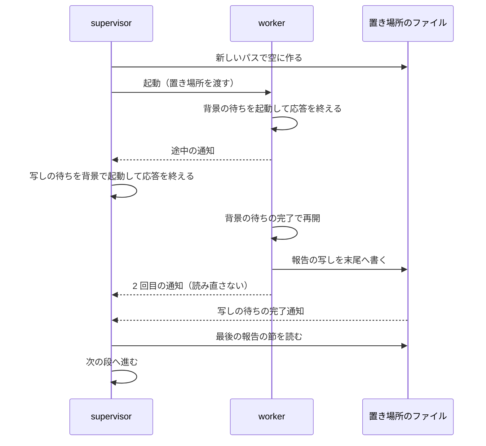

# #892 / #901: cross-review の母集合にホストを入れ、supervisor が worker の途中の通知で止まらないようにする — 設計

要求と受け入れ条件は [issue-892-901-requirements.md](issue-892-901-requirements.md)、決定の理由は
[issue-892-901-design-decisions.md](issue-892-901-design-decisions.md) にある。この文書は「どう作るか」だけを扱う。

## 例 1: Claude Code から `/ndf:cross-review 891 --exclude agy` を起動する（#892）

| 項目 | 今 | 変更の後 |
| --- | --- | --- |
| 母集合（`review_pool("claude")`） | codex / agy / kiro | claude / codex / agy / kiro |
| 使える者（agy を外した後） | codex / kiro | claude / codex / kiro |
| ラウンド 1 の席 | codex / kiro | codex / kiro |
| ラウンド 2 の席 | codex / kiro | claude / kiro |
| ラウンド 3 の席 | codex / kiro | claude / codex |

席は `review_seats` の今の式のまま（`available[r % 3]` と `available[(r + 1) % 3]` を固定の順に並べる）で、
3 ラウンドで 3 通りの組を 1 度ずつ取る。claude の席は `claude -p` の CLI プロセスとして起動する。
ホストの会話の作業文脈は持ち込まれない。

**このループを変更の前に始めていた場合は、席が変わらない。** 状態ファイルに保存された
`participants.available`（codex / kiro）から席を決めるためである（AC6）。

## 例 2: 設計の supervisor が worker の途中の通知を受ける（#901）

| 順 | 誰が | 今 | 変更の後 |
| ---: | --- | --- | --- |
| 1 | supervisor | worker を起動する（`置き場所` は任意） | `置き場所` のファイルを worker ごとに新しいパスで空に作り（`: > <置き場所>`）、その絶対パスを渡して worker を起動する |
| 2 | worker | 背景の待ちを起動して応答を終える | 同じ |
| 3 | supervisor | 途中の通知を受け、「2 回目を待つ」で応答を終える。**誰にも起こされない** | 途中の通知を受け、`置き場所` に報告の写しが現れるまでの待ちを**自分の背景の処理**として起動してから応答を終える |
| 4 | worker | 再開して報告を出す | 再開し、報告の写しを `置き場所` の末尾へ書いてから報告を出す |
| 5 | supervisor | — | 自分の背景の待ちの完了通知で再開し、写しを読んで次の段へ進む |

## 機能一覧

| # | 機能 | 誰が使うか |
| --- | --- | --- |
| F1 | cross-review の母集合にホストを入れる | cross-review を起動する利用者・supervisor |
| F2 | 使える者が 2 者に満たないときの席の埋め方を、ホストの別の確認を使わない形にする | 同上 |
| F3 | 変更の前に作った状態ファイルの再開で、席の決め方を保つ | 進行中の cross-review を再開する側 |
| F4 | supervisor が worker の途中の通知を受けたときの待ち方 | supervisor |
| F5 | worker が報告の写しを `置き場所` へ書く | worker |

## 構成要素

| 要素 | 機能 | 変えること |
| --- | --- | --- |
| `plugins/ndf/scripts/lib/assignment.py` の `review_pool` | F1 | 除外をやめ、`list(ALL_RUNTIMES)` を返す。モジュールの docstring の表（「全ランタイム − ホスト」）も直す |
| `plugins/ndf/skills/cross-review/scripts/state.py` の `_resolve_reviewers` | F2 | 使える者が 2 者に満たないときのホストの確認と `fallback = [host]` を消す。`fallback` は常に空。0 者なら終了コード 1。1 者なら `review_seats` が `<その者>-2` を返す（今の式のまま）。info の文言を直す |
| 同 `_round_reviewers` の順 4（`host` だけを持つ状態） | F3 | `review_pool(host)` の呼び出しを、変更の前の母集合（全ランタイム − ホスト）を返す式へ置き換える。docstring の表も直す |
| 同 `state.py:1939` 付近のコメント | F2 | 「満たなければホストで埋め合わせる」を消す |
| `assignment.review_seats` | — | 変えない。保存された `fallback` を持つ状態ファイルの再開で使う（F3） |
| `plugins/ndf/skills/cross-review/SKILL.md` | F1 F2 | frontmatter の `description`（other than the host）・冒頭の 2 段落（ホストを除く 3 者・ホストを名指しで固定しない理由）を直す |
| `plugins/ndf/skills/cross-review/docs/05-pool-and-convergence.md` | F1 F2 F3 | 9 行目（全ランタイム − ホストの 3 者）・30 行目（`--include` でホストを足す）・47〜48 行目（埋め合わせの表）を直す |
| `plugins/ndf/skills/cross-review/docs/04-contracts.md` | F2 | `fallback` の説明に「この変更の後に作る状態では空」を足す |
| `CLAUDE.md` の cross-review の節 | F1 F2 | 1 段落目を「ホストを含む全ランタイムのうち使える者から 2 席」「2 者に満たなければ同じランタイムの 2 つ目」へ直す |
| `docs/specifications/cross-review-participants-and-seats.md` | F1 F2 | 母集合と埋め合わせの記述を今の振る舞いへ直す（確定仕様化で行う。`plan-to-spec`） |
| 生成物（Codex / Kiro / agy の Skill の写し） | F1 | `description` を変えるため、`bash scripts/build-runtime-plugins.sh` で同期する |
| `plugins/ndf/skills/development-workflow/references/waiting.md` | F4 | 「待つ相手ごとの手」の直後の段落を、conductor の手と supervisor の手に分ける（入出力の契約） |
| 同 `agent-layers.md` の supervisor の規則 4 | F4 | 1 文を足す。規則の数は 10 のまま |
| 同 `agent-layers.md` の worker の規則 5・起動指示の `置き場所` の行 | F5 | 規則 5 に `Monitor` の場合を足し、`置き場所` に報告の写しを足す。規則の数は 5 のまま。`prompt` の行の「守る規則 4 個」を 5 個へ直す |
| `plugins/ndf/skills/cross-refactoring/tests/test_assignment.py` のモジュールの docstring | F1 | 4 行目の「cross-review はホストを除く母集合から 2 席を決める。」を、ホストを含む母集合へ直す |
| テスト | F1〜F3 | 下の「テスト設計」 |

**変えないもの:**

- cross-refactoring の `refactor_pool`（既にホストを含む）
- `review_seats` の式
- `--include` / `--exclude` / `--only` の引数の形
- conductor の手（2 回目の通知を待つ）

### 他に「ホストを除く」前提を持つ輪番が無いことの確かめ

`review_pool` を呼ぶのは `state.py` の 2 か所とテストだけである（`grep -rn review_pool plugins/ndf`）。
2 か所は `_round_reviewers` の順 4 と `_resolve_reviewers` である。cross-refactoring は `refactor_pool` を使う。
配布物とテストの docstring で、cross-review について「ホストを除く」「other than the host」を含むのは上の表の文書だけである
（`grep -rn "ホストを除\|other than the host" plugins/ndf CLAUDE.md`）。

## 入出力の契約

### `review_pool(host)`（F1）

| 入力 | 出力 | 失敗 |
| --- | --- | --- |
| `host` ∈ `HOST_RUNTIMES` | `["claude", "codex", "agy", "kiro"]`（`ALL_RUNTIMES` の順。ホストに依らない） | ホストになれない名前は `AssignmentError`（今のまま） |

引数 `host` は残す。呼び出し側の形を変えず、ホストになれない名前を弾く検査を保つためである。

### `init` の参加者の解決（F1・F2）

| 状況 | 今 | 変更の後 |
| --- | --- | --- |
| `--exclude <ホスト>` | 「母集合に無い者は外せません」で終了コード 1 | 受け付ける。ホストを外した母集合で始まる |
| `--include <ホスト>` | ホストが母集合に加わる | 結果が変わらない（既に入っている）。エラーにしない |
| 使える者 ≥ 2 | `fallback` は空 | 同じ |
| 使える者 = 1（1 者指定なし） | ホストを確かめ、通れば `fallback = [host]` | ホストを確かめない。`fallback` は空。席は `<その者>` と `<その者>-2`。info に「同じランタイムの 2 つ目で埋める（観点が減る）」を出す |
| 使える者 = 0（1 者指定なし） | ホストが通れば `fallback = [host]`、通らなければ終了コード 1 | 終了コード 1。メッセージは母集合の全員が確認を通らないこと |
| 1 者指定 | 埋め合わせなし | 同じ |

### 再開のときの席（F3。`_round_reviewers` の順）

| 順 | 状態 | 返る担当 |
| ---: | --- | --- |
| 1 | ラウンドに `reviewers` がある | その値（変わらない） |
| 2 | `only` がある | `[only]`（変わらない） |
| 3 | `participants` がある | `review_seats(round_no, available, fallback)`。保存された値を使うため変わらない |
| 4 | `host` だけがある | `review_seats(round_no, [r for r in ALL_RUNTIMES if r != host], [])`。**変更の前の `review_pool(host)` と同じ値を式で持つ** |
| 5 | どれも無い | `LEGACY_AGENTS`（変わらない） |

### supervisor の待ち方（F4。`waiting.md` へ書く中身）

**途中の通知**は、背景の処理を残したまま応答を終えた worker について届く 1 回目の通知である。
見分けは通知の注記（「background work of its own still running」「may be interim」）で行う。

| 受け取る層 | 手 |
| --- | --- |
| conductor | 2 回目の通知を待ってから報告を読む（今のまま）。conductor は応答を終えても次の通知で起こされる |
| supervisor | **応答を終える前に、自分の背景の処理として報告の写しの待ちを起動する。** 下のコマンドを `run_in_background: true` で起動し、完了通知で再開する |

**supervisor は worker を起動する前に、`置き場所` のファイルを worker ごとに新しいパスで空に作る（`: > <置き場所>`）。**
前の worker の `## 作業の報告` が残ったファイルを渡すと、途中の通知で起動した待ちがその報告に即座に反応し、今の worker の報告を待たずに終わるためである。

```bash
timeout 3600 bash -c 'until grep -qs "^## 作業の報告" "$1"; do sleep 5; done' _ "<置き場所>"; rc=$?; echo "exit=$rc"; exit "$rc"
```

| 終了コード | supervisor の動き |
| --- | --- |
| 0 | `置き場所` の最後の `## 作業の報告` から末尾までを読み、持ち場を進める |
| 124（上限の 3600 秒に達した） | `agent-layers.md` の「supervisor の worker の点検」を 1 回行う。上限の中断でなければ「報告が無いまま終わったとき」の規則で `SendMessage` を送る |

- **worker の 2 回目の通知は、写しを読んだ後に届いても読み直さない。** 同じ報告である
- 途中の通知でない通知（報告の見出しが無く、背景の処理も残っていない）は今のまま「報告が無いまま終わったとき」の規則で扱う
- 待つ間に問い合わせを繰り返さない。起動は 1 回で、通知も 1 回である（`waiting.md` の「許す待ち方」）

### supervisor の規則 4（F4。`agent-layers.md` へ足す 1 文）

> worker の途中の通知を受けたときも応答を終えない。報告の写しの待ちを自分の背景の処理として起動してから終える（[waiting.md](waiting.md) の「途中の通知を受けたとき」）

### worker の規則 5 と `置き場所`（F5）

規則 5 へ足す 1 文:

> `Monitor` で待つときも同じである。`Monitor` の通知で再開はされるが、親には途中の通知が届く

起動指示の `置き場所` の行:

| 項目 | 中身 |
| --- | --- |
| 置き場所 | 長い出力と**報告の写し**を書くファイルの絶対パス（報告にはパスだけを載せる）。**worker は最後の応答の前に、`## 作業の報告` の節をこのファイルの末尾へ同じ中身で書く。** supervisor は「無し」にせず、worker ごとに新しいパスで空のファイルを作ってから渡す |

## 処理の流れ

**図は F4・F5 だけを描く。** F1〜F3 は分岐を持つだけで順序を変えないため、流れは上の「入出力の契約」の 2 つの表が持つ。



## 非機能の実現方式

| 条件 | 実現 |
| --- | --- |
| 互換（AC6・AC7） | 状態ファイルの形を変えない。順 3 は保存された値を読み、順 4 は変更の前の母集合を式で持つ |
| 費用 | supervisor の待ちは背景の起動 1 回と完了通知 1 回。前景の `sleep` と出力の読み直しをしない |
| 止まり方 | 待ちに `timeout 3600` を付ける。上限で起きたら点検と `SendMessage` の規則へ渡す |

## 決定の記録

[issue-892-901-design-decisions.md](issue-892-901-design-decisions.md) にある。

## テスト設計

| 受け入れ条件 | 何で確かめるか |
| --- | --- |
| AC1 | `test_assignment.py` の `test_review_pool_is_all_minus_host` を「4 ホストとも `ALL_RUNTIMES` を返す」へ書き換える |
| AC2 | `plugins/ndf/skills/cross-review/tests/test_state_review_pool.py` に、ホスト claude・`--exclude agy` で `available` が claude / codex / kiro になり、ラウンド 1〜3 の席が 3 通りの組を 1 度ずつ取るテストを足す |
| AC3 | 同じファイルに、4 つのホストで `init` の出力の「母集合」にホストが入ることを確かめるテストを足す（パラメタ化） |
| AC4 | `--exclude <ホスト>` で `init` が成功し、`participants.available` にホストが無いテストを足す |
| AC5 | 認証の確認を差し替え、使える者 1 者で `fallback == []`・席が `<その者>` と `<その者>-2`、0 者で終了コード 1 のテストを足す。ホストの確認が呼ばれないことも確かめる |
| AC6 | `participants`（`available` 2 者・`fallback: [host]`）を持つ状態ファイルを作り、`_round_reviewers` が変更の前と同じ席を返すテストを足す |
| AC7 | `test_review_seats_match_the_previous_rotation_for_three_available` の母集合を、`review_pool(host)` から「全ランタイム − ホスト」の式へ置き換える。`host` だけの状態ファイルで `_round_reviewers` が同じ値を返すことを 4 ホスト × ラウンド 1〜12 で確かめる |
| AC8〜AC10 | 文書を読んで確かめる。文言を固定するテストは書かない |
| AC11 | `claude -p --output-format stream-json` で、supervisor 役のサブエージェントが worker 役（背景で `sleep 30` を起動して応答を終える）を起動する 2 段を動かす。supervisor の最後の応答に worker の報告が畳まれていること、supervisor の結果が 1 回で `## 作業の報告` の中身を含むことを確かめる。記録を実装の Pull Request に残す |
| AC12 | `uv run --project plugins/playwright-kit/skills/playwright-kit-ops --with pytest pytest . -q -n 4` |

## 未確認のまま残ること

| 項目 | 内容 |
| --- | --- |
| worker の 2 回目の通知が、応答を終えた supervisor を起こさないこと | #901 の実例の注記から読んだ前提 4 で、単独では測っていない。AC11 の再現で、写しの待ちが無い形と比べて確かめる。**2 回目の通知で起こされると分かっても、この設計は保てる**（写しの待ちが先に終わるか後に終わるかだけが変わる） |
| 上限 3600 秒の妥当性 | worker が 1 時間を超える作業を持つ持ち場では、点検が 1 回挟まる。測定（`skill-stats --agents`）で worker の所要時間を見て、振り返りで見直す |
| #828 の実装との重なり | #828 の実装は `agent-layers.md` の起動指示の雛形と規則 3・7 を書き換える。この変更は規則 4・5 と `置き場所` の行だけを触る。後にマージする側が衝突を解く |
