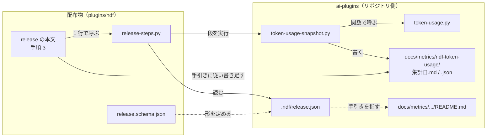
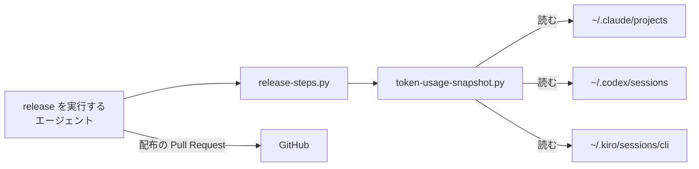
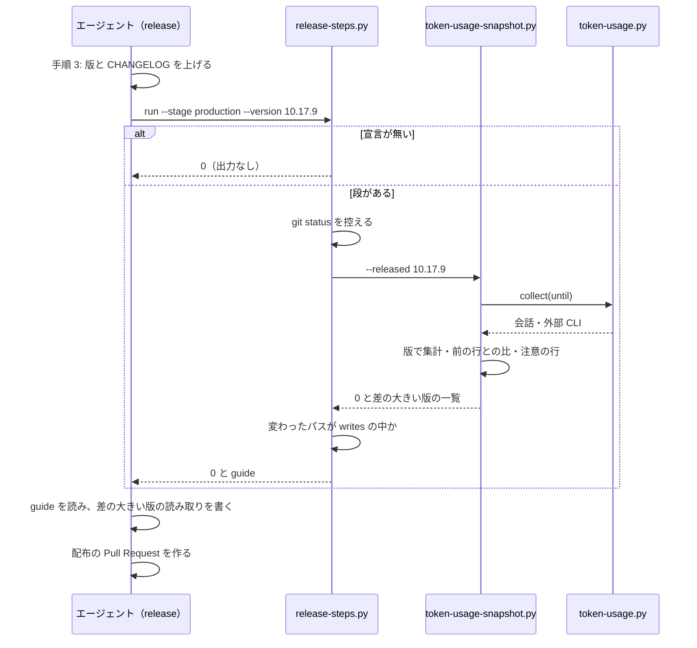

# #893 版を配布するたびに集計結果を残す — 設計

要求と受け入れ条件は [issue-893-release-snapshot-requirements.md](issue-893-release-snapshot-requirements.md) にある。この文書は「どう作るか」だけを扱う。

## 一目で: 10.17.9 を正式版として出すときの流れ

```bash
# release の手順 3。版と CHANGELOG.md を上げた後、配布の Pull Request を作る前に 1 行打つ
python3 "$SCRIPTS/release-steps.py" run --root . --stage production --version 10.17.9
```

このリポジトリでは `.ndf/release.json` が段を 1 つ宣言している。上のコマンドはその段を実行する。

```bash
python3 scripts/token-usage-snapshot.py --released 10.17.9
```

段は `docs/metrics/ndf-token-usage/2026-09-30.md` / `.json` を書く。前の行との比が ±30% を超えた版があれば、段はそれを挙げる。宣言が指す手引き（`docs/metrics/ndf-token-usage/README.md`）に従い、エージェントはその版の読み取りだけを書き足す。できたファイルは配布の Pull Request に入る。

## 機能一覧

| # | 機能 | 誰が使うか |
| --- | --- | --- |
| F1 | リポジトリが宣言した配布の段を、段階に合わせて走らせる | `release` を実行するエージェント（どのリポジトリでも） |
| F2 | 配布の段を宣言する | リポジトリの管理者 |
| F3 | 正式版を出すときに、版ごとのトークン消費と所要時間の記録を書き出す | ai-plugins の配布の担い手 |
| F4 | 前の行との差が大きい版を知らせ、読み取りを書く手引きを示す | 同上 |

## 構成要素

| 要素 | 区分 | 責務 |
| --- | --- | --- |
| `plugins/ndf/skills/release/SKILL.md` | 変える | 手順 3 に「宣言された配布の段を走らせる」を足す。完了の判定に「段が 0 で終わり、手引きの判断を済ませた」を足す |
| `plugins/ndf/skills/release/references/release-steps.md` | 新しく作る | 宣言の書き方・段階の値・終了コード。`instruction-files.md` と同じ位置づけ |
| `plugins/ndf/skills/release/schemas/release.schema.json` | 新しく作る | 宣言の JSON Schema。`instructions.schema.json` と同じ置き方 |
| `plugins/ndf/scripts/release-steps.py` | 新しく作る | 宣言を読み、段階に合う段を順に実行する。書いてよい場所の外が変わったら失敗にする |
| `.ndf/release.json` | 新しく作る | このリポジトリの宣言。段は 1 つ（トークン消費の記録） |
| `scripts/token-usage-snapshot.py` | 新しく作る | `token-usage.py` を読み込み、記録の `.md` / `.json` を書き出す。差の大きい版を挙げる |
| `scripts/token-usage.py` | 変える | 読み込みと集計を関数として呼べるようにする（`main` の中身を `collect(...)` に切り出す）。出力は変えない |
| `docs/metrics/ndf-token-usage/README.md` | 新しく作る | 記録の読み方と、エージェントが書く読み取りの手引き |
| `docs/versioning-and-distribution.md` | 変える | 「正式版を出す」に、記録が配布の Pull Request に載ることを 1 段落足す |



図には文書（`references/release-steps.md`・`docs/versioning-and-distribution.md`）を含めない。どちらも読み手向けの説明で、実行の経路に現れない。

### システムの文脈



外へ書くのは作業ツリーのファイルだけである。GitHub へ出すのは `release` の既存の手順（配布の Pull Request）で、段は push しない。

### パッケージ構成

```text
plugins/ndf/
├── scripts/
│   ├── release-steps.py              # 新規
│   └── tests/test_release_steps.py   # 新規
└── skills/release/
    ├── SKILL.md                      # 手順 3・完了の判定
    ├── references/release-steps.md   # 新規
    └── schemas/release.schema.json   # 新規
.ndf/release.json                     # 新規
scripts/
├── token-usage.py                    # collect() を切り出す
├── token-usage-snapshot.py           # 新規
└── tests/test_token_usage_snapshot.py  # 新規
docs/metrics/ndf-token-usage/README.md  # 新規
```

## 入出力の契約

### 宣言 `.ndf/release.json`

```json
{
  "version": 1,
  "steps": [
    {
      "name": "トークン消費の記録",
      "stage": "production",
      "command": ["python3", "scripts/token-usage-snapshot.py", "--released", "{version}"],
      "writes": ["docs/metrics/ndf-token-usage/"],
      "guide": "docs/metrics/ndf-token-usage/README.md",
      "timeout_seconds": 600
    }
  ]
}
```

| 項目 | 必須 | 何を決めるか |
| --- | --- | --- |
| `version` | 必須 | 宣言の形の版。`1` だけを読む |
| `steps` | 必須 | 段の並び。書いた順に実行する |
| `steps[].name` | 必須 | 出力と完了報告に出す名前 |
| `steps[].stage` | 必須 | `production`（本番への配布）/ `verification`（検証への配布）/ `any` |
| `steps[].command` | 必須 | 引数の配列。シェルを通さない。`{version}` を配る版で置き換える。置き換えるのはこの 1 つだけ |
| `steps[].writes` | 必須 | 書いてよいパスの前置き（リポジトリの根から）。空の配列は「何も書かない段」 |
| `steps[].guide` | 任意 | エージェントが判断する部分の手引き。段が 0 で終わったら、`release` はこれを読んで従う |
| `steps[].timeout_seconds` | 任意 | 既定 600。1 以上 |

### `release-steps.py`

```text
release-steps.py run   --root <dir> --stage production|verification --version <版> [--dry-run]
release-steps.py check --root <dir>
```

| 終了コード | 意味 |
| --- | --- |
| 0 | 宣言が無い（何も出力しない）、段階に合う段が無い、またはすべての段が 0 で終わり書いてよい場所の中だけが変わった |
| 1 | 段が 0 以外で終わった、時間切れ、または書いてよい場所の外が変わった。最初に落ちた段で止める |
| 2 | `check` だけが返す。宣言が無い |
| 3 | 宣言が読めない。どの項目かを標準エラーに出す |

**宣言が無いとき、`run` は 0、`check` は 2 を返す。** `run` は `release` の手順 3 から毎回呼ばれ、宣言の無いリポジトリで止めないため 0 にする。`check` は宣言の有無で分岐する側のためのもので、`worktree-setup.sh check` と同じく「無い」を別の値で返す。

- 段は `--root` を作業ディレクトリにして実行する。`command` と `writes` のパスは根からの相対である
- 変更の判定は、段の前後の控えの差で行う。控えは `git status --porcelain -uall` が挙げたパスごとの内容の要約（`git hash-object`。消えたパスは「無し」）である。段の後の控えは、段の前後どちらかの `git status` に出たパスの和集合について要約を取り直す。要約が前後で違うパスを「段が変えたパス」とする。段の前から変わっていたパスも、段が中身を変えれば数える。段が HEAD の内容へ戻したパスも数える
- 標準出力には段ごとに `段: <name> → 0`、変えたパス、`guide:` の行を出す。段の標準出力はそのまま流す（差の大きい版の一覧はここに出る）
- `--dry-run` は実行せず、走らせる段と置き換えた後の `command` を出す
- `check` は宣言を読むだけで、0 / 2（無い）/ 3 を返す

### `token-usage-snapshot.py`

```text
token-usage-snapshot.py --released <版> [--until <ISO 8601>] [--min-version <版>] [--out <dir>]
```

| 引数 | 既定 | 意味 |
| --- | --- | --- |
| `--released` | 必須 | 配る版。見出しと `.json` の `meta.released` に入る |
| `--until` | 実行した時刻（UTC・分で切り捨て） | 打ち切りの時刻。集計日はこの UTC の日付 |
| `--min-version` | 前の記録の最後の版 | 表の最初の行。前の記録の `.json` の `per_pr` の版を `token-usage.py` の `version_key` で並べた末尾（表の行の並びと同じ。開発版は同じ番号の正式版より前に来る） |
| `--out` | `docs/metrics/ndf-token-usage` | 書き出す先 |

| 終了コード | 意味 |
| --- | --- |
| 0 | 書き出した。差の大きい版の一覧（無ければ「無し」）を標準出力に出す |
| 2 | 前の記録が無く、`--min-version` も無い |
| 1 | 読み込み・書き出しに失敗した |

**前の記録は、`--out` の `.json` のうち、`meta.released` が配る版と違い、`meta.until` がこの打ち切りの時刻より前のもので最も新しいものである。** `meta.until` が無い記録（2026-09-23）は、どの打ち切りよりも前とみなす。同じ版で走らせ直しても（段の失敗後の再試行など）、自分が前に書いた記録を前の記録に取らない。

書き出すファイル名は `<集計日>.md` / `<集計日>.json` である。`meta.released` が配る版と同じ記録が既にあれば、打ち切りの時刻が違ってもそのファイルへ書き直す（走らせ直しは同じ名前になり、ファイルが増えない）。別の版の記録が同じ名前を持っていれば `<集計日>-2`・`-3` と進める。

`.json` の形は `token-usage.py --by version,mode,model,cc,reviewers --format json` と同じである。`meta` にだけ `released` と `previous`（前の記録のファイル名）を足す。前の記録が無く `--min-version` で走らせたときの `previous` は `null` である。

`.md` の節:

| 節 | 中身 | 書き手 |
| --- | --- | --- |
| 見出しと前書き | 配る版・打ち切りの時刻・生の記録を残していないこと | スクリプト |
| 作り方 | 同じ値を作り直すコマンド（`--until` つき） | スクリプト |
| 版ごとの差（PR 1 本あたり） | 2026-09-24.md の同名の表と同じ列。前の行との比 | スクリプト |
| 版と層ごとの呼び出しとキャッシュ | 同上 | スクリプト |
| 比べるときの注意 | PR を作った会話が 2 件以下の版、`CHANGELOG.md` にあって表に出ない版、打ち切りの 30 分前以降にも行がある会話を含む版 | スクリプト |
| 読み取り | 差の大きい版ごとに 1〜3 行。作業の中身の違いか、版の変更の効果か | **エージェント**（手引きに従う） |
| 集計の出力 | `token-usage.py --by version` の Markdown | スクリプト |

## 処理の流れ



## 非機能の実現方式

| 項目 | 実現方式 |
| --- | --- |
| 所要 | 記録の読み込みは 1 回（実測 35 秒）。版ごとと全軸の 2 つの集計は読み込んだ値から作る |
| 秘匿 | 出力の形は `token-usage.py` の JSON と同じで、本文・パス・リポジトリ名・会話の ID を持たない。テストで確かめる |
| 再現 | 打ち切りの時刻を記録に書く。同じ時刻で作り直せる。ただし kiro の席は記録ごとの作成の時刻で打ち切るため、打ち切りをまたいで進行中だった席は credit が変わりうる（未確認 U4） |

## 決定の記録

### 決定 1: 固有の手順は `release` の本文に書かず、リポジトリの宣言 `.ndf/release.json` が段として持つ（関門で最終決定）

`release` は他のリポジトリでも実行される。本文に `scripts/token-usage.py` を書くと、他のリポジトリでは存在しない手順になる。`check-skill-repo-assumptions.py` の規約（AUTHORING.md「対象リポジトリを仮定しない」）にも反する。宣言にすれば、本文は「宣言があれば走らせる」の 1 段で済み、宣言が無いリポジトリでは何も起きない。`.ndf/instructions.json`・`.ndf/document.json` と同じ置き方である。

本文に「このリポジトリなら」という条件付きの段を書く案は採らない。固有の語が本文に入る。リポジトリ側の手順書（`docs/versioning-and-distribution.md`）にだけ書く案も採らない。`release` の本文は「リポジトリに版を上げる手順があればそれに従う」としか言っておらず、読むかどうかがエージェント次第で、実行したかを確かめる手段が無い。

### 決定 2: 判断の要らない部分はすべてスクリプトにし、エージェントには差の大きい版の読み取りだけを残す（関門で最終決定）

2026-09-24.md を書いたときの手作業は、集計（3 回）・版でまとめ直す表 2 つ・前の行との比・比べるときの注意・読み取りだった。このうち読み取り以外は記録の値から一意に決まる。比べるときの注意のうち、件数が少ない版・表に出ない版・進行中の会話を含む版の 3 種は、記録の値と `CHANGELOG.md` から判定できる。判定できないのは「なぜその値になったか」で、同じ版の中の作業の大きさの違いは会話の中身を知らないと書けない。

差の大きい版をスクリプトが挙げるのは、エージェントが書くべき箇所を決めるのも機械でできるためである。しきい値は ±30% とする。10.17.x の 7 つの比では -17% と -7% の 2 つが内に入り、残る 5 つが超える。内に入る差は作業の大きさのばらつきと区別できないため、読み取りを求めない。

読み取りもエージェントに書かせない案は採らない。値の上下だけでは、版の効果と作業の大きさの違いを読み分けられない。

### 決定 3: 記録は本番への配布のときだけ残す

開発版と正式版は同じ日に出ることがある（10.17.8-dev.1 と 10.17.8 は 9 分差）。開発版のたびに残すと、ほぼ同じ内容の記録が並ぶ。開発版の会話は、次の正式版の記録に版の行として入る。

開発版のたびに残す案は採らない。正式版の間隔が 90 日を超えると開発版の記録が消えるが、10.17.x の間隔は 1 日前後である（未確認 U2）。

### 決定 4: 記録は配布の Pull Request に含め、別の Pull Request にしない

手順 3 は版と説明文書のために Pull Request を作る。記録はそこに入れれば、マージと配布の手順が増えない。`release` の「配布そのものを目的とする変更は対象外」の規定にもそのまま収まる（記録は `docs/` の下で、配布物ではない）。

### 決定 5: 表の最初の行は、前の記録の最後の版にする

前の記録の最後の行から始めると、記録どうしが 1 行ずつ重なり、差が途切れずにつながる。前の正式版から始める案は採らない。前の正式版で始めた会話が 1 件も無いと（10.17.4 の例）、最初の行が無く、比の起点が決まらない。

### 決定 6: 集計の本体は読み込みで呼び、サブプロセスで 2 回走らせない

`token-usage.py` を 2 回走らせると、記録の読み込みも 2 回（実測で各 35 秒）になる。`collect(...)` を切り出して読み込みを 1 回にする。ファイル名にハイフンがあるため、`importlib` でパスから読み込む。`exec_module` の前に `sys.modules[名前]` へ登録する。登録しないと `@dataclass` がモジュールを引けず `AttributeError` で落ちる（Python 3.14.4 で実測）。

### 決定 7: 同じ日に別の版の記録があるときは `-2` を付けて別に作り、同じ版の記録は書き直す

`<集計日>` の形は PR #899 が決めた。同じ日に 2 度出すと衝突する（2026-09-24 には既に記録がある）。別の版の記録を上書きすると、コミット済みの記録を作業ツリーで消すことになる。同じ版の記録だけは書き直す（走らせ直しでファイルを増やさない）。

### 決定 8: 段が書いてよい場所を宣言させ、外を変えたら失敗にする

段は任意のコマンドで、配布の Pull Request に何が混ざるかを本文から読めない。書いてよい場所を宣言させれば、配布の Pull Request の差分に段の分として何が入りうるかが宣言から決まる。

## テスト設計

| 受け入れ条件 | 何で確かめるか |
| --- | --- |
| AC1 | `python3 scripts/check-skill-repo-assumptions.py` が 0 |
| AC2 | `test_release_steps.py`: 宣言なしで `run` は出力なし・0、`check` は 2。段階が合う段だけを実行する。`{version}` の置き換え。`--root` と別のディレクトリから呼んでも、段は `--root` で走る |
| AC3 | 同: `writes` の外にファイルを作る段で 1。段の前から変更済みの `writes` の外のパスを、段がさらに書き換えたときも HEAD へ戻したときも 1。段が触らない前からの変更は数えない。`stage` の不一致で実行しない |
| AC4 | 同: 壊れた JSON・`version: 2`・`command` 欠落・`timeout_seconds: 0` で 3 と項目名 |
| AC5 | `release-steps.py check --root .` が 0。`run --dry-run --stage production` が段を 1 つ挙げる |
| AC6 | `test_token_usage_snapshot.py`: 合成の記録から 2 ファイルができる。同名があれば `-2` |
| AC7 | 同: 表の行が前の記録の最後の版から始まる。比の値。注意の 3 種がそれぞれの条件で出る |
| AC8 | 同: ±30% を超えた版だけが一覧に出る |
| AC9 | 同: 同じ `--until` で 2 回作った `.json` が一致し、2 回目は同じ名前へ書く。前の記録に 1 回目の出力を取らない。`--until` を変えて同じ版で走らせ直しても、同じ名前へ書く |
| AC10 | 同: `.json` / `.md` に合成の記録の本文・パス・リポジトリ名・会話の ID が現れない |

## 未確認のまま残ること

| # | 項目 | 内容 |
| --- | --- | --- |
| U1 | 30 分の進行中の判定 | 会話の最後の行が打ち切りの 30 分前以降なら「進行中を含みうる」とする。実物で誤りが多ければ実装で改める |
| U2 | 正式版の間隔 | 90 日を超えると、その間の開発版の記録は消える。間隔を監視する仕組みは作らない |
| U3 | 開発版の会話の扱い | 手元の Claude Code が開発版を読むのは `develop` を取得元にしたときだけである。取得元が `main` のときは開発版の行が出ない |
| U4 | kiro の再現 | kiro の記録はターンに時刻を持たない。打ち切りをまたいで進行中だった席は、作り直すと credit が変わりうる（2026-09-24.md の「作り方」と同じ制約）。ターンごとの境界を記録に残す方式は作らない |
