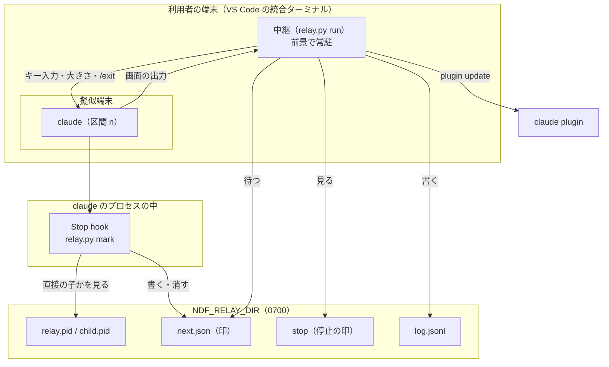
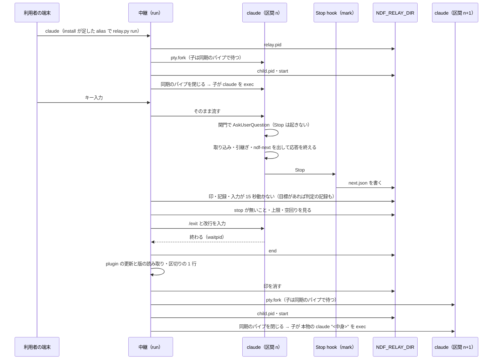
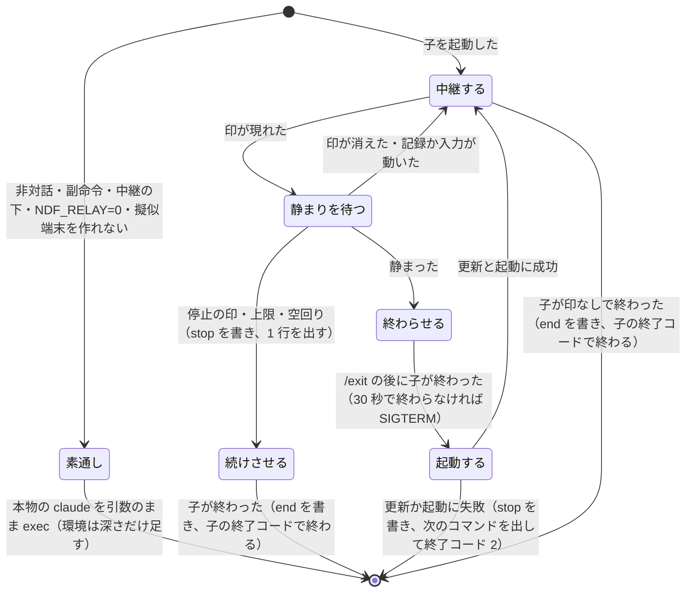

# #895: 区間の切れ目の再起動と次のコマンドの入力を、前景の中継で自動にする — 設計

要求と受け入れ条件は [issue-895-requirements.md](issue-895-requirements.md)、決定の理由は
[issue-895-design-decisions.md](issue-895-design-decisions.md) にある。この文書は「どう作るか」だけを扱う。

## 例: 設計の関門をまたいで実装へ進む

利用者は VS Code の統合ターミナル（tmux の中でも外でもよい）で作業している。

| 順 | 誰が | 何をする |
| ---: | --- | --- |
| 1 | SessionStart hook | 利用者が ndf の入った Claude Code を起動すると、`relay.py install` が中継を安定した場所へ置き、ログインシェルの設定（`~/.bashrc` か `~/.zshrc`）へ印のついた囲みで `alias claude=...` を 1 度だけ足し、足したことを 1 行で知らせる。**利用者の手作業は無い。** 次に開いたシェルから、いつもどおり `claude` と打つと中継を挟む。中継は端末の前景に残り、擬似端末の子として素の claude を起動する。画面は普段の claude の TUI と同じに見える |
| 1b | 利用者 | 起動した claude の中で `/goal /ndf:development-workflow #895` を入力する（中継の引数には渡さない） |
| 2 | conductor（区間 1） | 設計の関門で `AskUserQuestion` を出す。**このあいだ Stop は起きず、印は書かれない** |
| 3 | 利用者 | 「承認」と答える（キー入力は中継を通ってそのまま子へ届く） |
| 4 | conductor | 設計 Pull Request をマージし、引継ぎ文書を更新し、最後の応答に次のブロックを出して応答を終える |
| 5 | Stop hook | 中継の直接の子の claude で、最後の応答にブロックが 1 つあるので、印 `next.json` を書く |
| 6 | 中継 | 印と会話の記録と利用者の入力が 15 秒動かないのを見て、子の端末へ `/exit` と改行を入力する。子が終わったのを確かめる |
| 7 | 中継 | `claude plugin marketplace update ai-plugins` と `claude plugin update ndf@ai-plugins -y` を打ち、版を読む。区切りの 1 行（`── ndf-relay: 区間 2 ──`）を出す |
| 8 | 中継 | 同じ端末で `claude "<ブロックの中身>"` を子として起動する。記録に 1 行足す |
| 9 | conductor（区間 2） | 新しい版の hook と Skill で実装の持ち場から始める |

手順 4 のブロック:

````markdown
```ndf-next
/goal /ndf:development-workflow #895
```
````

利用者が入力したのは手順 1b と手順 3 だけである（手順 1 は hook が自動で行う）。**`/goal` を使わない普段の利用では、印が書かれないので、中継は何もしないまま claude と同じ終了コードで終わる。**

**中継が使えない・止まると決めたときは、今までどおりに落ちる。**

| 場面 | 画面に出るもの | 人がすること |
| --- | --- | --- |
| 手順 1 の `claude` が対話でない（`-p`・パイプ・副命令・`--help` など）か、中継の下で打たれた | 何も出さない。中継を挟まずに本物の claude をそのまま exec する（素通し） | 何もしない（claude を直接打ったのと同じ） |
| 手順 1 の `claude` が対話だが擬似端末を作れない | `ndf-relay: 中継を始めない（<理由>）。切れ目では示されたコマンドを手で入力する` の 1 行を標準エラーへ出した後、素通しする | 今までどおり（切れ目で `/exit` し、ブロックの中身を貼り付ける） |
| 手順 6 で上限・空回り・停止の印 | `ndf-relay: 次の区間を起動しない（<理由>）。このまま続けるか、/exit して示されたコマンドを手で入力する` の 1 行 | 同上 |
| 手順 7〜8 で更新・起動の失敗 | `ndf-relay: 次の区間を起動できない（<理由>）。次のコマンド:` の後に中身を出し、シェルへ戻る | 表示された中身で claude を起動する |

## 機能一覧

| # | 機能 | 誰が使うか |
| --- | --- | --- |
| F1 | 次のコマンドを `ndf-next` のブロックで出す規約 | conductor・引継ぎ文書を書く側 |
| F2 | 区間の終わりに印を書く・消す（Stop hook） | Claude Code（中継の直接の子のときだけ働く） |
| F3 | claude を擬似端末の子として起動し、端末の入出力と大きさを中継する | 中継 |
| F4 | 印を待ち、前の区間を終え、更新し、次の区間を起動する | 中継 |
| F5 | 上限と止める手段 | 中継・利用者 |
| F6 | 区間ごとの記録（版を含む） | 利用者・振り返り・#893 の測定 |
| F7 | 中継が使えない・止まると決めたときに、今までどおりの運用へ落ちて理由を示す | 中継・利用者 |
| F8 | 中継の始め方と止め方の案内 | 利用者 |
| F9 | `alias claude=...` で常に中継を挟む起動。claude の引数の素通し・本物の claude の解決・非対話の素通し | 利用者 |
| F11 | 文脈が上限（既定 200,000）を超えたら、背景の子が居ない切りの良いところで区間を切る（既存の文脈量の hook を中継の下で強める・印の条件に背景の処理が無いことを足す） | conductor・中継 |
| F10 | 中継を安定した場所へ置き直し、ログインシェルの設定へ alias を 1 度だけ足す（`relay.py install`。SessionStart hook が毎回呼ぶ） | Claude Code（SessionStart） |

## 確かめたこと（2026-09-23、Claude Code 2.1.280・Python 3・Linux、`--model haiku` で実測）

| # | 何を | 結果 |
| ---: | --- | --- |
| 1 | Stop hook の標準入力 | `session_id` / `transcript_path` / `cwd` / `stop_hook_active` / `last_assistant_message` などが来る。`last_assistant_message` は最後の応答の本文そのもの |
| 2 | 位置引数の最初の入力 | 対話の TUI でそのまま送られる。改行を含む 3 行も 1 つの入力になる。擬似端末（`pty.fork()`）の中でも 6 回とも応答し、Stop hook が発火した。未信頼のディレクトリでは信頼の確認で止まる |
| 3 | スラッシュコマンドの位置引数 | `/cost` はコマンドとして実行された |
| 4 | `/goal` | セッションの間だけ働く prompt 型の Stop hook。settings の Stop hook は各ターンの終わりに判定と並んで発火し、2 回目から `stop_hook_active` が真。標準入力だけでは最後の Stop か分からない。判定の結果は記録の `goal_status` に、command hook より後に書かれる |
| 5 | `AskUserQuestion` | 表示中の約 40 秒、Stop は起きなかった。答えた後のターンの終わりに 1 回起きた |
| 6 | 擬似端末への `/exit` の差し込み | 親がマスタへ `/exit` と `\r` を書くと約 1.6 秒で終わった（終了コード 0）。記録は全行が JSON として読め、SessionEnd（`prompt_input_exit`）が発火した。終了で Stop は起きない |
| 7 | シグナル | SIGTERM で約 1.3 秒で終わった（終了コード 143）。SIGINT は 1 回で終わった（終了コード 0）。どちらも記録は壊れず、SessionEnd（`other`）が発火した |
| 8 | キー入力の中継 | 入力待ちの子の端末は raw（`ISIG` が偽）。親が流した `\x03` はバイトのまま子に届き、Claude Code の Ctrl-C として扱われた（0.5 秒の間隔の 2 回で終了）。`TIOCSWINSZ` はマスタに設定でき、読み戻せた |
| 9 | hook の出力で終わらせる | Stop hook が `{"continue": false}` を返しても、理由が表示されるだけでプロセスは入力待ちのまま残った |
| 12 | 背景の処理と Stop hook | 背景の Bash（`sleep 40`）と、背景で起動したサブエージェントの中の背景の Bash（`sleep 30`）を残して応答を終えると、Stop hook の標準入力の `background_tasks` に 2 件（`type: shell`・`status: running`）が載った。何も残さない応答では空の配列 |
| 11 | claude の副命令と起動の費用 | `claude --help` の副命令は `agents` / `attach` / `auth` / `auto-mode` / `doctor` / `gateway` / `import` / `install` / `logs` / `mcp` / `plugin`・`plugins` / `project` / `respawn` / `rm` / `setup-token` / `stop`・`kill` / `ultrareview` / `update`・`upgrade`。中継が使う標準ライブラリを読み込む Python の起動は約 0.01 秒。`~/.claude/plugins/installed_plugins.json` の `ndf@<名前>` が `installPath`（版つきのキャッシュ）と `version` を持つ |
| 10 | `claude plugin` | `claude plugin update [-y] <plugin>`（TTY でなければ `-y` が必須）、`claude plugin marketplace update [name]`、`claude plugin list --json` が `id` と `version` を返す。`id` は `ndf@ai-plugins` の形（`<プラグイン>@<マーケットプレイス>`）で、`version` は `10.17.2` だった |

6 と 9 が「中継が子の端末へ `/exit` を入力する」形の根拠である。4 が「静まりを待つ」段と、
`stop_hook_active` を見ない判定の理由である。Claude Code の中から起こしたプロセスは `CLAUDECODE` などを
継ぐため、子を起動する前に外す。

## 構成要素

| 要素 | 区分 | 責務 |
| --- | --- | --- |
| `plugins/ndf/scripts/relay.py` | 新設 | 中継の本体。副命令 `run`（前景で常駐し、子の claude を起動する。要らなければ素通しする）・`stop`（停止の印を置く）・`mark`（Stop hook の本体）・`install`（安定した場所へ写し、シェルの設定へ alias を 1 度だけ足す）を持つ。標準ライブラリだけで書く |
| `plugins/ndf/hooks/claude.json` の `Stop` | 変える | 環境変数 `NDF_RELAY_DIR` があるときだけ `python3 <root>/scripts/relay.py mark` を呼ぶ 1 件を足す。既存の Slack 通知の後に置く |
| `plugins/ndf/hooks/claude.json` の `SessionStart`（`matcher: startup`） | 変える | `python3 <root>/scripts/relay.py install` を呼ぶ 1 件を既存の 3 件の後に足す。`timeout` は 5 秒、`continueOnError: true` |
| `development-workflow/references/relay.md` | 新設 | 中継の始め方（自動の `install` と止め方 `NDF_RELAY_AUTO=0`）・止め方・上限・記録の読み方・落ちたときの続け方・区間をまたいで設定を保つ方法 |
| `development-workflow/references/context-window.md` の「新しい会話で戻す」 | 変える | 次のコマンドを `ndf-next` のブロック 1 つで出すこと、関門の承認より前に出さないこと、引継ぎ文書の「次に実行するコマンド」も同じ形にすることを定める（形の定義はここ 1 か所） |
| `development-workflow/SKILL.md` の引き継ぎの 1 行の段落と「`/goal` の引数として呼ばれたとき」 | 変える | 1 行を `ndf-next` のブロックで出すと書き、`relay.md` への参照を足す |
| `plugins/ndf/scripts/token-guard.sh` の文脈量の判定 | 変える | 止めたときの理由の文を「次のコマンドを `ndf-next` のブロックで示して」へ直す。**中継の直接の子の conductor（`NDF_RELAY_DIR` があり、判定 4 と同じ親のたどりで `child.pid` と一致）では、同じ起動の 1 度の通しをやめ、上限を超えている限り工程へ入る起動を止め続ける**（下の「文脈の上限で切る」） |
| `plugins/ndf/README.md` の hook の一覧 | 変える | Stop hook に中継の印を足す |
| `plugins/ndf/scripts/tests/test_relay.py` | 新設 | F2〜F10 の単体テスト |
| `plugins/ndf/scripts/tests/test_token_guard.py` | 変える | F11 の中継の下での判定のテストを足す |

**Codex / agy の hook の定義（`hooks/codex.json`・`dev.agy/hooks.json`）は変えない。Kiro は hook の定義を持たない**（AC16）。
`waiting.md` と `agent-layers.md` は触らない（#892 #901 の実装が触っている）。



### パッケージ構成

```text
plugins/ndf/
├── hooks/claude.json                         # Stop に 1 件足す
├── scripts/
│   ├── relay.py                              # 新設（run / stop / mark / install）
│   ├── token-guard.sh                        # 理由の文と、中継の下での通しの扱い
│   └── tests/test_relay.py                   # 新設
└── skills/development-workflow/
    ├── SKILL.md                              # 引き継ぎの段落と /goal の節
    └── references/
        ├── context-window.md                 # 「新しい会話で戻す」
        └── relay.md                          # 新設
```

### 配置

| 実行の単位 | どこで動くか | 寿命 |
| --- | --- | --- |
| 中継（`relay.py run`） | 利用者の端末の前景（シェルの子） | 利用者が始めてから、子が印なしで終わるか、落ちると決めた区間が終わるまで |
| 区間の claude | 中継が作った擬似端末（中継の子） | 切れ目の `/exit` まで |
| Stop hook（`relay.py mark`） | 各区間の claude の子のプロセス | 1 回の Stop ごと（1 秒以内） |

## 起動と状態の置き場所（#827 と共有する答え）

**#827 と同じ問い「何が claude を起動し、状態をどこに持つか」に、層を問わず次の 3 つで答える。**
#827 の supervisor の駆動も同じ形に乗せる。

| 問い | 答え | この課題での形 |
| --- | --- | --- |
| 何が起動するか | **スクリプトが起動し、LLM は起動しない。** LLM のプロセスは 1 単位ごとに新しく作り、終わったら捨てる | 中継が区間ごとに `claude` を子として起動する |
| 状態をどこに持つか | **正本は会話の外の記録（課題の本文・盤面・通過工程の控え・Pull Request・引継ぎ文書）。** スクリプトが要る状態は作業ディレクトリのファイルに置き、会話には持たない | 中継の状態は `NDF_RELAY_DIR` のファイルだけ。次の区間は `context-window.md` の「新しい会話で戻す」で状態を戻す |
| 単位の終わりをどう渡すか | **LLM の側が決まった形の結果を出し、hook かプロセスの終わりがそれをファイルへ写す。スクリプトはファイルを待つ**（LLM のトークンを使わない） | Stop hook が `ndf-next` のブロックを印へ写し、中継が印を待つ |

## 入出力の契約

### 次のコマンドの形（F1。`context-window.md` に書く中身）

- conductor は切れ目で、最後の応答に**情報文字列 `ndf-next` の囲みのコードブロックを 1 つだけ**置く。囲みの中身が次の区間の最初の入力になる。複数行でよい
- 3 層（`/goal`）で進めているときは、中身の先頭を `/goal ` にする
- **関門の承認と取り込みより前には出さない。** 出すと、中継が関門の前で会話を切る
- ブロックを 2 つ以上置かない（印を書かない。AC4）
- ブロックは中継の有無によらず出す。中継が無ければ、人がその中身を貼り付ける（今までどおり）
- 引継ぎ文書の「次に実行するコマンド」の節も同じブロックで書く

### `relay.py` の副命令

| 副命令 | 引数 | 終了コード | 出力 |
| --- | --- | --- | --- |
| `run` | `[claude の引数 ...]`。**`run` の後ろはすべて claude の引数で、中継は解釈しない。** 中継の設定は環境変数だけで受ける: `NDF_RELAY_MAX_STARTS`（既定 20）/ `NDF_RELAY_QUIET`（秒、既定 15）/ `NDF_RELAY=0`（常に素通し） | 素通しでは claude の終了コードそのもの（exec で置き換わるため）。中継では最後の区間の claude の終了コード（シグナルで終わったら 128 + シグナルの番号）/ 2: 次の区間の更新か起動に失敗した / 127: 本物の claude が見つからない・起動の入れ子が深すぎる | 区切りの 1 行と、落ちるときの `ndf-relay:` の 1 行を画面へ。印なしで終わるときは何も出さない |
| `stop` | 無し | 0: 動いている中継に停止の印を置いた（1 つ以上）/ 1: 動いている中継が無い | 置いた中継の pid を 1 行ずつ |
| `mark` | 標準入力に Stop hook の JSON | 常に 0 | 常に無し |
| `install` | 無し | 常に 0（SessionStart を止めない） | 足したときと、既存の `claude` の定義で足さなかったときの初回だけ、`{"systemMessage": "<1 行>"}` を標準出力へ（利用者の画面に出る）。それ以外は何も出さない |

**`run` は、中継が要らない・始められない起動を素通しする**（AC15・AC19）。素通しは、下の「本物の claude」の絶対パスを `os.execve` に渡し、引数をそのまま渡して起動する。**環境は `NDF_RELAY_DEPTH` を 1 増やすことだけを変える**（入れ子の止め方のため。条件 2）。claude を直接打ったのと同じ振る舞い・終了コード・シグナルの届き方になる。

| # | 条件（上から順に見る） | すること |
| ---: | --- | --- |
| 1 | `NDF_RELAY=0` | 素通し |
| 2 | `NDF_RELAY_DEPTH` が 2 以上 | `ndf-relay: 起動が入れ子になっている（<本物の claude の候補>）` を標準エラーへ出して終了コード 127。`claude` という名前のラッパーが自分を呼び返す繰り返しを止める |
| 3 | `NDF_RELAY_DIR` がある（中継の子の中で打たれた。conductor が Bash から起こす `claude -p` など） | 素通し。入れ子の中継にしない |
| 4 | 引数に `-p` / `--print` / `-h` / `--help` / `-v` / `--version` がある、または最初の引数が claude の副命令の名前（「確かめたこと」の 11） | 素通し |
| 5 | 標準入力か標準出力が端末でない（パイプ・リダイレクト） | 素通し |
| 6 | `pty` を読み込めない・擬似端末を作れない（Windows など） | `ndf-relay: 中継を始めない（擬似端末を作れない）…` を標準エラーへ出してから素通し |
| 7 | 上のどれでもない | 中継として始める。1 つ目の区間は `<本物の claude> <run の引数>` を子として起動する |

**2 つ目以降の区間は `<本物の claude> <印の中身>` だけで起動し、`run` の引数は引き継がない。** `--resume` や `-c` を引き継ぐと、捨てたはずの会話へ戻る。モデルなどを区間をまたいで保ちたいときは、設定か環境変数（`ANTHROPIC_MODEL` など）で与える（`relay.md` に書く）。

### 本物の claude（F9）

alias は子のプロセスには効かないため、中継は実体を探す。**素通しも区間の起動も、ここで決めた絶対パスを使う**（名前 `claude` で `PATH` を引き直さない）。

| 順 | 何を見るか |
| ---: | --- |
| 1 | 環境変数 `NDF_RELAY_CLAUDE`（実体の絶対パス）があればそれ |
| 2 | `PATH` を前から見て、実行できる `claude` のうち、実体（`realpath`）が自分自身（`relay.py` とその安定した置き場所）でなく、先頭 4 KB に `relay.py` を含まないもの（`claude` という名前で中継を呼ぶラッパーを飛ばす） |
| 3 | 見つからなければ `ndf-relay: 本物の claude が見つからない` を出して終了コード 127 |

### 中継の置き場所と alias の自動の追記（F10。`relay.py install`）

**alias は安定した場所 `${XDG_DATA_HOME:-$HOME/.local/share}/ndf/relay.py` を指す。** 版つきのキャッシュ（`~/.claude/plugins/cache/<名前>/ndf/<版>/scripts/relay.py`）を直接指すと、更新しても古い版に固定され、古い版のディレクトリが消えると alias が壊れる。

**SessionStart hook が Claude Code の起動のたびに `install` を呼ぶ。** hook は起動した版のパスで動くので、配布と `claude plugin update` の後の最初の起動（中継が起動する次の区間を含む）で、安定した場所の中継が新しい版になる。

| # | 段 | すること |
| ---: | --- | --- |
| I1 | 止める | `NDF_RELAY_AUTO=0` なら何もしない。それ以外は `${XDG_STATE_HOME:-$HOME/.local/state}/ndf/relay/install.lock` を `fcntl.flock` で取り（待つのは 2 秒まで。取れなければ何もせず終わる）、**I2〜I7 をすべてこのロックの中で確かめて書く**。同じ HOME で Claude Code が同時に起動しても、囲み・バックアップ・知らせは 1 回になる |
| I2 | 中継を置き直す | 自分（hook の版の `relay.py`）と安定した場所の写しの中身が違うとき、または写しが無いときだけ、一時ファイルに書いてから置き換える（権限 `0755`）。同じなら何もしない |
| I3 | 足す先を決める | `$SHELL` の名前が `bash` なら `~/.bashrc`、`zsh` なら `${ZDOTDIR:-$HOME}/.zshrc`。それ以外のシェルでは足さない（何も出さない） |
| I4 | 既にあるか | 足す先に囲みの開きの行 `# >>> ndf relay >>>` があれば何もしない |
| I5 | 利用者が消したか | 記録 `${XDG_STATE_HOME:-$HOME/.local/state}/ndf/relay/rc-added` に足す先のパスがあるのに囲みが無ければ、利用者が消したとみなして足さない（何も出さない）。足し直したいときは記録の行を消す |
| I6 | 既存の `claude` の定義 | 足す先（bash では `~/.bash_aliases` も）に、囲みの外で `alias claude=` か `claude()` か `function claude` の行があれば足さない。記録 `rc-skipped` に無ければ、`ndf-relay: <足す先> に claude の定義があるため alias を足さない。中継を使うなら <alias の 1 行> を自分で置く` を 1 度だけ知らせ、記録に足す |
| I7 | 足す | 足す先を `<足す先>.ndf-bak-<UTC の時刻>` へ写してから、末尾へ下の囲みを追記する（ファイルが無ければ作り、写しは作らない）。`rc-added` に足す先のパスを記録し、`ndf-relay: <足す先> へ alias claude を足した。次に開くシェルから効く（今のシェルでは source <足す先>）。戻すには囲みを消す` を知らせる |

足す囲み:

```bash
# >>> ndf relay >>>
# ndf の中継（区間の切れ目で claude を自動で起動し直す）。消せば元に戻る。
alias claude='python3 "${XDG_DATA_HOME:-$HOME/.local/share}/ndf/relay.py" run'
# <<< ndf relay <<<
```

**`install` は失敗しても SessionStart を止めない。** 書けない・読めないときは何も出さずに終了コード 0 で終わる。
中身が同じときに書かないので、2 回目以降の起動ではファイルを 1 つ読み比べるだけで終わる。

**区間の途中と切れ目では、動いている中継は入れ替わらない。** 安定した場所の写しが新しくなっても、動いている `run` のプロセスは古い版のまま最後まで動き、利用者が次に `claude` を打ったときから新しい版になる。hook（`mark`）は区間ごとに新しい版のパスで呼ばれるため、**印とディレクトリの形（`next.json` のキーと `NDF_RELAY_DIR` のファイル）は版をまたいで変えない**。変えるときはファイル名を変え、古い中継が新しい印を読み違えないようにする。

### 作業ディレクトリ `NDF_RELAY_DIR`

`${XDG_STATE_HOME:-$HOME/.local/state}/ndf/relay/<起動の時刻（UTC の %Y%m%dT%H%M%SZ）>-<中継の pid>-<乱数 8 桁>/`。権限は `0700`。`run` が `os.mkdir` で新しく作り（既にあれば別の乱数で作り直す。前の起動のディレクトリを使い回さない）、子の環境変数 `NDF_RELAY_DIR` に置く。pid が再利用されても、前の起動の `stop` / `next.json` / `child.pid` は別のディレクトリに残るため、今回の中継が読むことはない。
`run` が終わるとき `relay.pid` を消す（`log.jsonl` は残す）。1 日の起動回数は、この親のディレクトリの全 `log.jsonl` の今日の `start` を数える。

| ファイル | 書く側 | 中身 |
| --- | --- | --- |
| `relay.pid` | `run` | 中継の pid。`mark` と `stop` が生きているかを見る |
| `child.pid` | `run` | 今の区間の claude の pid。区間ごとに書き換える |
| `next.json` | `mark` | 印（下の表）。一時ファイルに書いてから `rename` する |
| `stop` | `stop` か利用者 | 空。在れば停止の印 |
| `log.jsonl` | `run` | 記録（下の表） |

### 印（`next.json`）

| キー | 値 | 出所 |
| --- | --- | --- |
| `command` | ブロックの中身（前後の改行を除く） | `last_assistant_message` |
| `cwd` | 作業ディレクトリ | 標準入力の `cwd` |
| `session_id` / `transcript_path` | 会話の ID と記録の場所 | 標準入力 |
| `written_at` | UTC の ISO 8601 | `mark` の時刻 |

### `mark` の判定（F2）

| # | 条件 | すること |
| ---: | --- | --- |
| 1 | `NDF_RELAY_DIR` が無い | 何もしない（hook の定義の側でも、無ければ `python3` を起こさない） |
| 2 | `relay.pid` の pid が生きていない | 何もしない |
| 3 | 標準入力を JSON として読めない | 何もしない |
| 4 | hook の親をたどって最初に当たる `claude` のプロセスの pid が `child.pid` と違う | 何もしない。conductor が Bash から起こした `claude -p` は `NDF_RELAY_DIR` を継ぐが、中継の直接の子ではないので印を書かず、印も消さない |
| 5 | `last_assistant_message` の中の `ndf-next` のブロックがちょうど 1 つで、`background_tasks` に `status` が `running` のものが無い | 印を書く（前の印は置き換わる） |
| 6 | ブロックが 0 か 2 つ以上、または背景の処理が動いている | 印があれば消す（AC4b）。背景の処理が動いているあいだに切ると、その処理（supervisor を含む）が子の claude と一緒に終わるためである。処理が終わって応答し直した Stop で、改めて印が書かれる |

**`stop_hook_active` は見ない。** `/goal` が応答を続けさせた後の Stop は `stop_hook_active` が真になるが、
その Stop こそ区間の最後の応答でありうる（「確かめたこと」の 4）。

**ブロックの読み取りは、外側の囲みの中を除く。** 応答を先頭から行ごとに読み、囲みの開き（行頭のバッククォート 3 つ以上）と閉じ（同じ数以上の行頭のバッククォートだけの行）の入れ子を数える。数えるのは、どの囲みの中でもない位置で開く、バッククォートがちょうど 3 つで情報文字列が `ndf-next` の囲みだけである。説明のために 4 つのバッククォートの中へ引いた例（この文書の「例」の節の形）は数えない。

### 文脈の上限で切る（F11）

**切れ目は関門の後だけではない。** conductor の文脈が上限を超えたら、次の切りの良いところで区間を切る。
上限・文脈量の読み方・工程へ入る起動の見分け方は、既存の文脈量の hook（`token-guard.sh`。確定仕様
`docs/specifications/ndf-token-waits-and-context-cut.md` の「文脈量の判定」）をそのまま使う。**上限は
`NDF_CONTEXT_LIMIT`（既定 200,000）の 1 つで、中継は別の値を持たない。**

| # | 誰が | 何をする |
| ---: | --- | --- |
| C1 | 文脈量の hook | conductor が工程へ入る起動（工程 Skill・持ち場の Agent）で上限を超えていれば止め、「新しい持ち場を起動せず、動いている supervisor の報告を受け取ってから、引継ぎ文書を更新し、次のコマンドを `ndf-next` のブロックで出して応答を終える」を理由に載せる。**切りの良いところは「前の持ち場の報告を受け取った後で、次の持ち場を起動する前」であり、この起動がその時点に当たる** |
| C2 | 文脈量の hook（中継の下） | 中継の直接の子の conductor では、同じ起動をもう一度行っても通さない。LLM が「このまま続ける」と決めて上限を超えたまま進むことを、機械で止める。中継の外では今までどおり 1 度だけ通す（人が続けると決められる） |
| C3 | conductor | 背景で動いている supervisor があれば、その報告を待つ（新しい持ち場は C2 で起動できない）。すべて受け取ったら、引継ぎ文書（`/goal` の指示が名指しした文書。無ければ書かない。状態は課題の本文と盤面に残る）を更新し、`ndf-next` のブロックを出して応答を終える。ブロックの中身は、その区間を始めたコマンドのうち残りの作業を指す形（名指しの引継ぎ文書があれば「<文書> の続きから」、無ければ `/goal /ndf:development-workflow #<課題>`） |
| C4 | Stop hook | 背景の処理が残っていれば印を書かない（判定 5・6）。関門の `AskUserQuestion` の応答待ちでは Stop が起きない |
| C5 | 中継 | 印を拾い、ほかの切れ目と同じく次の区間を起動する。中継が居なければ、人がブロックの中身を貼り付ける（今までどおり） |

**hook が止めるのは工程へ入る起動だけで、工程の途中の Bash や Read は止めない。** 1 つの持ち場の中で上限を
超えても、その持ち場は最後まで通る（supervisor の文脈は conductor と別で、conductor が増えるのは報告を受け取ったときである）。

### 記録（`log.jsonl` の 1 行）

| キー | 値 |
| --- | --- |
| `event` | `start`（区間を起動した）/ `end`（区間が終わった）/ `stop`（中継が次の区間を起動しないと決めた） |
| `at` | UTC の ISO 8601 |
| `section` | 区間の番号（中継の中で 1 から） |
| `pid` | 区間の claude の pid（`start`・`end`） |
| `command` | 起動に渡した中身（`start`） |
| `from_session` | 前の区間の `session_id`（`start`。1 つ目は空） |
| `plugin_version` | 起動の直前に `claude plugin list --json` から読んだ `ndf@<マーケットプレイス>` の `version`（`start`。AC8） |
| `cwd` / `cwd_fallback` | 起動した作業ディレクトリと、印の `cwd` が消えていたときの元の値（`start`。消えていなければ `cwd_fallback` は無い） |
| `seconds` | 区間の長さ。`start` の `at` から、印の `written_at`（`mark` と `sigterm` と `sigkill`。どちらも印を受けて終わらせたので、`/exit` の後の待ちを含めない）か子の終わり（`no-mark`）まで（`end`） |
| `ended_by` | `mark`（印を受けて `/exit` を入力し、子が終わった）/ `no-mark`（子が印なしで終わった）/ `sigterm`（`/exit` の後 30 秒で終わらず SIGTERM で終わらせた）/ `sigkill`（SIGTERM の後 10 秒でも終わらず SIGKILL で終わらせた）（`end`） |
| `reason` | 次の区間を起動しない理由（`stop`）。`stop-file` / `max-starts` / `spin` / `update-failed` / `start-failed` |

**`end` は区間の claude が実際に終わったときだけ書く。** 上限・空回り・停止の印で落ちるときは `/exit` を入力せず、
区間は動き続けるため、`stop` の行だけを書く。その区間が後で終わったときに `end` を書く。

## 処理の流れ



### 中継の状態遷移



### 各段の中身

| 段 | すること |
| --- | --- |
| 中継する | 始める前に自分の端末の属性を `tcgetattr` で保存し、標準入力を raw にする。**保存した属性は、正常な終わり・例外・SIGTERM と SIGHUP の受け取りのすべての経路で `tcsetattr` により戻す**（`try` / `finally` とシグナルの受け取りの中で戻す）。戻さないと、シェルへ戻った後の端末が raw のまま残る。`select` で標準入力 → マスタ、マスタ → 標準出力を流す。SIGWINCH を受けたら自分の端末の大きさをマスタへ `TIOCSWINSZ` で写す。2 秒ごとに `next.json` を見る（スクリプトの中の待ちで、LLM は使わない）。子の終わりは `waitpid(WNOHANG)` で見る |
| 静まりを待つ | 次の 3 つがそろうまで待つ。(1) 印の `written_at`・`transcript_path` の更新時刻・利用者の最後の入力の時刻のうち最も遅いものから `NDF_RELAY_QUIET` 秒（既定 15）たつ。(2) 会話の記録に `/goal` の目標がある区間では、印の `written_at` より後の `goal_status` の記録がある。(3) 印が消えていない。判定が止めを拒んだときは応答が続いて記録が動き、次の Stop で印が書き直されるか消える |
| 続けさせる | 停止の印があるか、1 日の起動回数が上限か、空回り（直前の 2 つの `end` の `seconds` がともに 120 未満で、今の区間の長さ＝印の `written_at` − その区間の `start` の `at` も 120 未満）なら、`/exit` を入力しない。`stop` の行を書き、`ndf-relay:` の 1 行を出し、印を消す。以後は中継するだけで、次の印では何もしない |
| 終わらせる | 子の端末へ `/exit` を書き、1 秒おいて `\r` を書く。`waitpid` で 30 秒まで待ち、終わらなければ SIGTERM を送って 10 秒まで待ち、それでも終わらなければ SIGKILL を送って終わりを待つ（SIGKILL の後は必ず終わる）。**子の終わりを `waitpid` で確かめてから** `end` を書き、次へ進む |
| 起動する | マーケットプレイスの名前が読めていれば、`claude plugin marketplace update <マーケットプレイス>` → `claude plugin update ndf@<マーケットプレイス> -y` → `claude plugin list --json` で版を読む。どれかが 0 以外で終われば `update-failed` で終わる。名前か版が読めなければ（下の段落）、同じく `update-failed` で終わる（次の区間を起動せず、次のコマンドを画面に出す）。作業ディレクトリは印の `cwd` で、消えていれば、パスに `/.worktrees/` を含むならその手前（主ディレクトリ）を、含まなければ在る最も近い親を使う。区切りの 1 行を出す。**起動の順序は、印を消す → `pty.fork()` → 子は同期のパイプの読み口で待つ → 親が `child.pid` と `start` の行を書く → 親が同期のパイプを閉じる → 子が `<本物の claude> <中身>` を exec する、に固定する。** **exec の成否は、close-on-exec の結果のパイプで親へ返す。** 子は exec が失敗したら `errno` をそのパイプへ書いて終わる。親は読み口が何も読まずに閉じれば成功、読めれば `start-failed` として、`end` を書かずに `stop` の行（理由と `errno`）と次のコマンドを出して終了コード 2 で終わる。** 子がすぐ Stop に達しても、hook が読む `child.pid` は新しい値で、親が消す印は前の区間のものだけになる（「本物の claude」の絶対パスと引数の配列で `os.execve` に渡し、シェルも `PATH` の探索も通さない。環境から `CLAUDECODE` / `CLAUDE_CODE_SESSION_ID` / `CLAUDE_CODE_ENTRYPOINT` を外し、`NDF_RELAY_DIR` を置く）。起動できなければ `start-failed` で終わる |

**マーケットプレイスの名前は、中継を始めたときに `claude plugin list --json` の `id` が `ndf@<名前>` の要素から読む**（「確かめたこと」の 10）。**このとき読んだ `version` を、1 つ目の区間の `start` の `plugin_version` にする。**
開発版のチャネルを使う利用者でも、登録した取得元から更新される。区間の切れ目でもう一度読み、読めなければ `update-failed` とする。版を記録できないまま次の区間を起動しないためである（AC8）。

**子が印を書かずに終わったら、中継も終わる**（AC12）。人が `/exit` した・Ctrl-C を 2 回押した・落ちたの
いずれかで、同じコマンドを起動し直しても進まないためである。利用者から見ると、普段の claude を終えたときと同じくシェルへ戻る。

**中継は例外で子を巻き込まない。** 中継が落ちると擬似端末が閉じ、子は SIGHUP で終わる。そのため `run` の本体の
例外は捕まえて `stop` の行と `ndf-relay:` の 1 行に変え、子が終わるまでは入出力の中継だけを続ける。

## 非機能の実現方式

| 条件 | 実現 |
| --- | --- |
| 可用性 | 始められないときは claude をそのまま exec し、止まると決めたときは今の区間を続けさせる（F7）。本体の例外は捕まえて入出力の中継だけを続け、子を SIGHUP で終わらせない |
| 費用 | 中継の待ちは 2 秒ごとのファイルの確認と `select` で、LLM を使わない。`mark` は `NDF_RELAY_DIR` が無ければ `python3` を起こさず、在っても `/proc`（macOS では `ps`）の読み取りとファイル 1 つの書き込みで終わる |
| 運用・保守性 | 落ちた理由は画面の `ndf-relay:` の 1 行と `log.jsonl` の `stop` の行の 2 か所。区間ごとの版は `start` の行、終わり方は `end` の行 |
| セキュリティ | `NDF_RELAY_DIR` は `0700`。中身は「本物の claude」の絶対パスとともに `os.execve` の引数の配列で渡し、シェルも `PATH` の探索も通さない（`claude` という名前のラッパーへ戻らない）。印は同じ利用者のプロセスだけが書ける |
| システム環境 | Linux / macOS の端末、Python 3 の標準ライブラリ（`pty` / `tty` / `termios` / `select` / `json` / `subprocess`）、Claude Code 2.1.280 以降。tmux の中でも外でも同じに動く |

## 決定の記録

[issue-895-design-decisions.md](issue-895-design-decisions.md) にある（決定 20 件）。

## テスト設計

子の claude の代わりに、擬似端末の上で動く短い試験用のプログラム（受けたバイトをファイルへ書き、指示に応じて印を書く・終わる）を使う。

| 受け入れ条件 | 何で確かめるか |
| --- | --- |
| AC1・AC2 | 文書を読んで確かめる。文言を固定するテストは書かない |
| AC3 | `test_relay.py`: 親のたどりを差し替え、ブロック 1 つの標準入力で印が書かれ、5 つのキー（`command` / `cwd` / `session_id` / `transcript_path` / `written_at`）を持つこと。4 つのバッククォートの囲みの中に `ndf-next` のブロックを引いた応答では印を書かないこと |
| AC4 | 同: `NDF_RELAY_DIR` 無し・pid が死んでいる・ブロック 0・ブロック 2・囲みの中だけ・壊れた JSON・直接の子でない claude（`claude -p` が子の claude の孫に当たる形）の 7 通りで、印が無く出力が空で終了コード 0 |
| AC4b | 同: 印がある状態でブロック無しの標準入力を与えると印が消える。`stop_hook_active: true` でもブロック 1 つなら書く。直接の子でない claude のブロック無しの Stop は印を消さない |
| AC5 | 「確かめたこと」の 5 と、AC17 で `AskUserQuestion` を 1 回出す |
| AC6 | 同: 起動した直後に印を書く試験用の子で、印が消されず次の周へ進むこと（`child.pid` と `start` が子の exec より前に書かれていること）。試験用の子で 1 周させ、`/exit` と `\r` が子へ届く → 子の終わり → `marketplace update` → `plugin update -y` → `plugin list --json` → 区切りの 1 行 → 次の子の起動（中身が 1 つの引数）の順になること。記録の更新時刻が新しいあいだ・利用者の入力から 15 秒たたないあいだ・目標のある記録で印より後の `goal_status` が無いあいだは `/exit` を送らないこと |
| AC7 | 同: 中継の標準入力に見立てたパイプへ `\x03` と文字を書くと、同じバイトが子へ届くこと。SIGWINCH の後に子の端末の大きさが変わること。中継を擬似端末の上で動かし、子が終わった後・本体で例外を起こした後・SIGTERM を送った後のそれぞれで、中継の端末の属性が始める前と同じに戻っていること |
| AC8 | 同: 1 周で `end`（6 つのキー: `event` / `at` / `section` / `pid` / `seconds` / `ended_by`）と `start`（8 つのキー: `event` / `at` / `section` / `pid` / `command` / `from_session` / `plugin_version` / `cwd`。`cwd_fallback` は消えていたときだけ足す）の 2 行が書かれ、`plugin_version` が差し替えた `plugin list --json` の値、`ended_by` が `mark` であること。1 つ目の区間の `start` も `plugin_version` を持ち、それは中継を始めたときに読んだ `plugin list --json` の値であること |
| AC9 | 同: 印の `cwd` が消えた（`<主>/.worktrees/design/x`）とき `<主>` で次の子が起動し、`start` の行に `cwd_fallback` が載ること |
| AC10 | 同: 今日の `start` が 20 行ある記録で印を与えると、`/exit` を送らず `stop`（`max-starts`）と `ndf-relay:` の 1 行を出し、子を続けさせること |
| AC11 | 同: 区間の長さが 119・119・119 と続くと 3 つ目の印で `/exit` を送らず `stop`（`spin`）、119・121・119 では送ること。1 つ目の区間（`run` の引数で起動した区間）も数えること。`sigterm` で終わった区間の長さが印の `written_at` までで測られること |
| AC12 | 同: 試験用の子が印なしで終わると、`end`（`no-mark`）を書いて子の終了コードで終わること |
| AC13 | 同: 別のプロセスから `relay.py stop` を打つと `stop` ができ、次の印で `/exit` を送らないこと。動いている中継が無ければ `stop` が終了コード 1 |
| AC26 | 同: 同じ pid を返すように差し替えた 2 回の `run` が別の `NDF_RELAY_DIR` を作り、前の起動のディレクトリに置いた `stop` と `next.json` を読まないこと |
| AC14 | 同: AC10・AC11・AC13 と、`plugin update` の差し替えが 0 以外のとき・次の子の起動に失敗したときに、`ndf-relay:` の 1 行と `stop` の行が出ること。後の 2 つは次のコマンドを画面に出し、終了コード 2。存在しない実行ファイルを次の子にすると、exec の失敗が結果のパイプで返り、`stop` の `reason` が `start-failed`・終了コード 2・次のコマンドが画面に出て、`end` の行が増えないこと。`/exit` にも SIGTERM にも反応しない試験用の子で、SIGKILL の後に終わりを確かめてから `end`（`sigkill`）を書くこと |
| AC15 | 同: 素通しの 6 つの条件（`NDF_RELAY=0`・`NDF_RELAY_DIR` あり・`-p`・`--help`・副命令 `mcp`・標準入力がパイプ）で、`os.execv` を差し替えて、本物の claude のパスと元の引数がそのまま渡り、環境が `NDF_RELAY_DEPTH` 以外変わらず、何も出力しないこと。`pty` を読み込めないように差し替えた対話の `run` では `ndf-relay:` の 1 行を標準エラーへ出してから素通しすること |
| AC16 | 同: AC4 の `NDF_RELAY_DIR` 無し。`hooks/claude.json` 以外の hook の定義の差分が無いことを実装の Pull Request の差分で見る |
| AC19 | 同: 引数なしの `run` で 1 つ目の子の引数が空、`run --model haiku -c` で 1 つ目の子が同じ引数を受け、2 つ目の子は `<印の中身>` だけを受けること。試験用の子が印なしで終了コード 3 で終わると、中継も何も出さずに終了コード 3 で終わること。シグナル 15 で終わると 143 |
| AC20 | 同: `PATH` の前に `claude` という名前で中継を呼ぶラッパーを置くと、それを飛ばして本物を選ぶこと。`NDF_RELAY_DEPTH=2` では終了コード 127 と 1 行を出すこと。`NDF_RELAY_CLAUDE` が最優先になること |
| AC21 | 同: 一時の HOME と `SHELL=/bin/bash` で `install` を打つ。1 回目: 安定した場所に写しができ、`~/.bashrc` に囲みが 1 つ足され、バックアップと `rc-added` の記録ができ、`systemMessage` が 1 行出る。2 回目: 何も書かず何も出さない（ファイルの中身と更新時刻が変わらない）。囲みを消した後の 3 回目: 足さない。`~/.bashrc` に `alias claude=` がある: 足さず、案内は 1 回目だけ。`NDF_RELAY_AUTO=0`: 何もしない。`SHELL=/bin/fish`: 写しだけを置き直し、設定は書かない。写しと中身が違う `relay.py` から打つと写しが置き換わる。書けないディレクトリでも終了コード 0。同じ一時の HOME で `install` を 4 つ同時に起動しても、囲みは 1 つ・バックアップは 1 つ・`systemMessage` は 1 回であること |
| AC22 | 実装の Pull Request の差分で、`install` を呼ぶのが `hooks/claude.json` の SessionStart だけで、Codex / agy の hook の定義に無いこと。`claude plugin validate` が通ること |
| AC23 | `test_token_guard.py`: `NDF_RELAY_DIR` と `child.pid` を用意し、親のたどりを差し替えて中継の直接の子の conductor にすると、上限を超えた持ち場の Agent の起動が 2 回続けて止まること（1 度の通しが無い）。理由の欄が `ndf-next` と「動いている supervisor の報告を待つ」を含むこと。中継の外では今までどおり 2 回目が通ること |
| AC24 | `test_relay.py`: ブロックが 1 つでも `background_tasks` に `running` が 1 件ある標準入力では印を書かず、前の印を消すこと。`background_tasks` が空の配列のときは書くこと |
| AC25 | AC17 の通しの確かめの中で、`NDF_CONTEXT_LIMIT` を小さくして（例 30,000）conductor 役に持ち場の Agent を起動させ、止められた後に `ndf-next` のブロックが出て中継が次の区間を起動することを見る。背景で supervisor 役を動かしているあいだは印が書かれないことも見る |
| AC17 | 擬似端末の上で alias と同じ形（引数なしの `run`）で中継を動かし、起動した claude へ最初の入力を書き込んで始める。`--model haiku` の claude に「次の区間を `ndf-next` で 1 回出す」指示を 2 段で渡す通しの確かめ。3 つ目の区間の起動・`log.jsonl` の `start` 3 行と `end` 2 行（`ended_by` が `mark`）を見る。1 つ目の区間で `AskUserQuestion` を出させ、答える前に印が無いことも見る。前の区間の画面が端末の履歴を遡って読めるかも記録する。記録を実装の Pull Request に残す |
| AC18 | `uv run --project plugins/playwright-kit/skills/playwright-kit-ops --with pytest pytest . -q -n 4` |

## 未確認のまま残ること

| 項目 | 内容 |
| --- | --- |
| `/goal` と Skill を位置引数で渡したときの挙動 | 2 つ目以降の区間は `<本物の claude> <印の中身>` で起動する。`/cost` はコマンドとして実行された。`/goal /ndf:development-workflow ...` の複数行が同じように働くかは AC17 で確かめる。働かなければ、中身を `/goal` の無い形で渡し、`/goal` を 2 つ目の入力として子の端末へ書く形へ替える（実装で決める） |
| `background_tasks` にサブエージェントが載るか | 背景の Bash は載ることを確かめた（「確かめたこと」の 12）。背景で動いているサブエージェント（supervisor）そのものが載るかは確かめていない。AC25 で確かめ、載らなければ、conductor の記録から背景の Agent の未完了を数える形へ替える（実装で決める） |
| 既存の `claude` の定義を見落とす | I6 が見るのは足す先と `~/.bash_aliases` だけである。別のファイルから読み込む定義は見落とし、囲みの alias が後から上書きする（後に読まれた定義が勝つ）。利用者は囲みを消せば戻せ、消した後は足し直さない（I5） |
| 素通しの副命令の一覧の追随 | 副命令の名前は Claude Code の版で増える。一覧に無い副命令は対話として扱われ中継を挟むが、その副命令が端末を使わずに終われば印は書かれず、中継は同じ終了コードで終わるので害は小さい。一覧は実装の時点の `claude --help` から写す |
| 切れ目で `/goal` の判定が止めを許すか | 今の運用では conductor が切れ目で止まれている。止めを拒まれて応答が続いても、中継は静まるまで待つので誤って終わらせない。続いた応答がブロックを出さなければ、印は消えて中継は待ち続ける |
| `goal_status` の記録の形 | 目標の判定の後に記録へ書かれることは確かめた（「確かめたこと」の 4）。止めを拒んだときの値と、記録の中の目標の有無の見分け方は AC17 で記録を読んで決める（実装で決める） |
| 前の区間の画面を遡れるか | 次の区間の TUI は同じ端末に描かれる。VS Code の統合ターミナルの履歴に前の区間の出力が残るかは AC17 で見る。残らなくても会話の記録（transcript）は残り、区切りの 1 行で区間の境は分かる |
| SIGWINCH での再描画 | `TIOCSWINSZ` はマスタに設定できた。子が再描画するかは AC7 のテストと AC17 で見る |
| 親のたどりの macOS での形 | Linux は `/proc/<pid>/stat`、macOS は `ps -o ppid=,comm=` で親をたどる。macOS の実機では確かめていない |
| 更新で古い版のディレクトリが消えたときの中継 | 中継は起動の後にディスクから読み直さない。hook は新しい版のパスで呼ばれる。AC17 の中で更新を挟んで確かめる |
