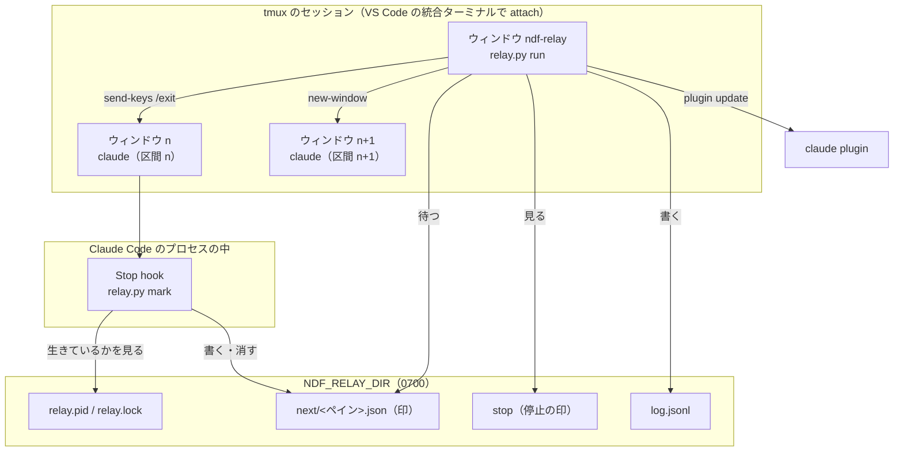
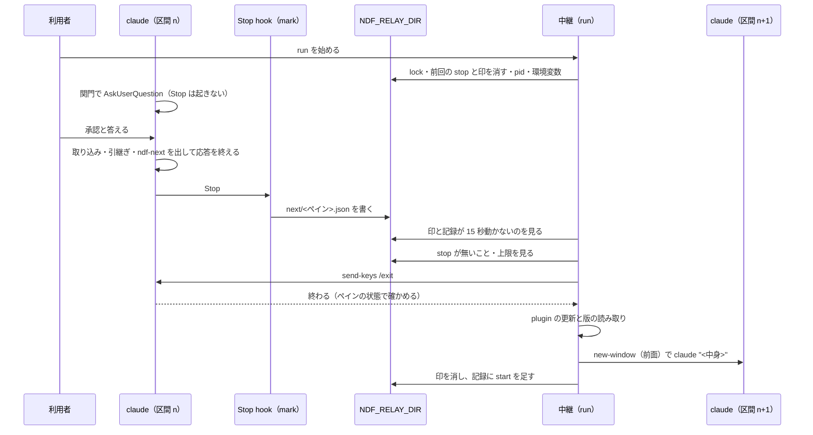
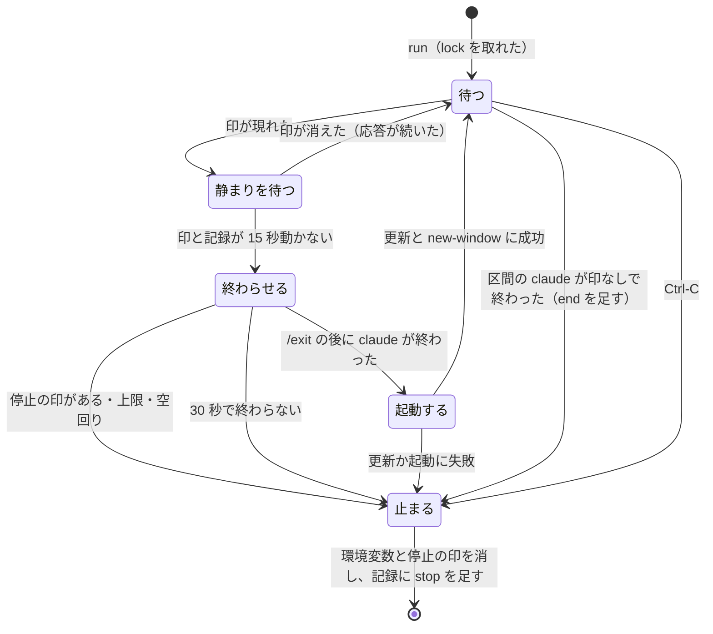

# #895: 区間の切れ目の再起動と次のコマンドの入力を、tmux の上の中継で自動にする — 設計

要求と受け入れ条件は [issue-895-requirements.md](issue-895-requirements.md)、決定の理由は
[issue-895-design-decisions.md](issue-895-design-decisions.md) にある。この文書は「どう作るか」だけを扱う。

## 例: 設計の関門をまたいで実装へ進む

利用者は VS Code の統合ターミナルで tmux のセッション `work` に attach している。ウィンドウ 1 で
`/goal /ndf:development-workflow #895` を動かしている。

| 順 | 誰が | 何をする |
| ---: | --- | --- |
| 1 | 利用者 | 最初に 1 度、中継を始める（`tmux new-window -d -n ndf-relay "python3 <scripts>/relay.py run"`）。`run` は始める前に `setup` と同じ確認を行い、VS Code の統合ターミナルが tmux を開く設定が無ければ入れて、入れた内容を示す。中継はセッション `work` に `NDF_RELAY_DIR` を置く |
| 2 | conductor（ウィンドウ 1） | 設計の関門で `AskUserQuestion` を出す。**このあいだ Stop は起きず、印は書かれない** |
| 3 | 利用者 | 「承認」と答える |
| 4 | conductor | 設計 Pull Request をマージし、引継ぎ文書を更新し、最後の応答に次のブロックを出して応答を終える |
| 5 | Stop hook | 最後の応答にブロックが 1 つあるので、印 `next/%3.json` を書く（`%3` はウィンドウ 1 のペイン） |
| 6 | 中継 | 印と会話の記録が 15 秒動かないのを見て、ペイン `%3` へ `/exit` を送る。claude が終わったのを確かめる |
| 7 | 中継 | `claude plugin marketplace update ai-plugins` と `claude plugin update ndf@ai-plugins -y` を打ち、版を読む |
| 8 | 中継 | ウィンドウ 3 を前面に開き、`claude "<ブロックの中身>"` を印の作業ディレクトリで起動する。記録に 1 行足す |
| 9 | conductor（ウィンドウ 3） | 新しい版の hook と Skill で実装の持ち場から始める |

手順 4 のブロック:

````markdown
```ndf-next
/goal /ndf:development-workflow #895
```
````

利用者が入力したのは手順 1（最初の 1 度）と手順 3 だけである。

## 機能一覧

| # | 機能 | 誰が使うか |
| --- | --- | --- |
| F1 | 次のコマンドを `ndf-next` のブロックで出す規約 | conductor・引継ぎ文書を書く側 |
| F2 | 区間の終わりに印を書く・消す（Stop hook） | Claude Code（中継が動いているときだけ働く） |
| F3 | 印を待ち、前の区間を終え、更新し、次の区間を起動する | 中継 |
| F4 | 上限と止める手段 | 中継・利用者 |
| F5 | 区間ごとの記録（版を含む） | 利用者・振り返り・#893 の測定 |
| F6 | 中継の始め方と止め方の案内 | 利用者 |
| F7 | 前提（tmux・今のペインが tmux の中・VS Code の統合ターミナルが tmux を開く設定）を確かめ、無い設定を入れ、入れた内容を示す（`relay.py setup`。`run` も始める前に同じ処理を通る） | 利用者・中継 |

## 確かめたこと（2026-09-23、Claude Code 2.1.280・tmux 3.6、別のソケットの tmux と haiku で実測）

| # | 何を | 結果 |
| ---: | --- | --- |
| 1 | Stop hook の標準入力 | `session_id` / `transcript_path` / `cwd` / `stop_hook_active` / `last_assistant_message` などが来る。`last_assistant_message` は最後の応答の本文そのもの |
| 2 | 位置引数の最初の入力 | 対話の TUI でそのまま送られる。改行を含む 3 行も 1 つの入力になる。未信頼のディレクトリでは信頼の確認で止まる |
| 3 | スラッシュコマンドの位置引数 | `/cost` はコマンドとして実行された |
| 4 | `/goal` | セッションの間だけ働く prompt 型の Stop hook。settings の Stop hook は各ターンの終わりに判定と並んで発火し、2 回目から `stop_hook_active` が真。標準入力だけでは最後の Stop か分からない |
| 5 | `/exit` の送信 | 応答待ちの TUI は約 1 秒で終わる（Stop は起きない）。`remain-on-exit on` では `#{pane_dead}=1` |
| 6 | `AskUserQuestion` | 表示中の約 40 秒、Stop は起きなかった。答えた後のターンの終わりに 1 回起きた |
| 7 | `claude plugin` | `claude plugin update [-y] <plugin>`（TTY でなければ `-y` が必須）、`claude plugin marketplace update [name]`、`claude plugin list --json` が `id` と `version` を返す |
| 8 | `new-window` | `-P -F '#{window_index}'` で番号を受け取れる。`-d` が無いと前面に出る。`new-window -t <セッション>: -- env true \; set-option -w remain-on-exit on` を 1 回の tmux の呼び出しで打つと、すぐ終わる処理でもウィンドウが残った（5 回とも `#{pane_dead}=1`）。`-d` を付けると後ろの `set-option -w` が前面の別のウィンドウに掛かる |
| 9 | `new-window` の実行の欄 | `--` の後に引数を 2 つ以上渡すと、tmux はシェルを通さずそのまま実行する。`'a "$(echo X)" b'` と改行を含む 1 つの引数が、置き換えられずに 1 つの引数のまま届いた（tmux 3.6）。引数が 1 つだけのときは `sh -c` に渡るため、中身の前に必ず `env` などの固定の語を置く |
| 10 | 統合ターミナルのプロファイルの設定 | VS Code のサーバ（`~/.vscode-server/bin/<版>/out/server-main.js`）の設定の定義で、`terminal.integrated.profiles.linux` と `defaultProfile.linux` は `restricted`（信頼していないワークスペースの設定では効かない）で、適用範囲の指定が無い（Machine 設定に書ける）。今の Machine 設定は `window.title` だけを持つ |

4 が「静まりを待つ」段と、`stop_hook_active` を見ない判定の理由である。2 の信頼の確認は、次の区間の
作業ディレクトリが前の区間と同じ（信頼済み）なので当たらない。Claude Code の中から起こした tmux の
サーバは `CLAUDECODE` などを継ぐため、起動の前に外す。

## 構成要素

| 要素 | 区分 | 責務 |
| --- | --- | --- |
| `plugins/ndf/scripts/relay.py` | 新設 | 中継の本体。副命令 `run`（常駐）・`stop`（停止の印を置く）・`mark`（Stop hook の本体）・`setup`（前提の確かめと導入）を持つ。標準ライブラリだけで書く |
| `plugins/ndf/hooks/claude.json` の `Stop` | 変える | `TMUX` があるときだけ `python3 <root>/scripts/relay.py mark` を呼ぶ 1 件を足す。既存の Slack 通知の後に置く |
| `development-workflow/references/relay.md` | 新設 | 中継の始め方（`setup` → `run`）・止め方・上限・記録の読み方・tmux が無いときの扱い |
| `development-workflow/references/context-window.md` の「新しい会話で戻す」 | 変える | 次のコマンドを `ndf-next` のブロック 1 つで出すこと、関門の承認より前に出さないこと、引継ぎ文書の「次に実行するコマンド」も同じ形にすることを定める（形の定義はここ 1 か所） |
| `development-workflow/SKILL.md` の引き継ぎの 1 行の段落と「`/goal` の引数として呼ばれたとき」 | 変える | 1 行を `ndf-next` のブロックで出すと書き、`relay.md` への参照を足す |
| `plugins/ndf/scripts/token-guard.sh` の止めたときの理由の文 | 変える | 「次の 1 行を示して」を「次のコマンドを `ndf-next` のブロックで示して」へ直す |
| `plugins/ndf/README.md` の hook の一覧 | 変える | Stop hook に中継の印を足す |
| `plugins/ndf/scripts/tests/test_relay.py` | 新設 | F2〜F5 の単体テスト |

**Codex / agy の hook の定義（`hooks/codex.json`・`dev.agy/hooks.json`）は変えない。Kiro は hook の定義を持たない**（AC14）。
`waiting.md` と `agent-layers.md` は触らない（#892 #901 の実装が触っている）。



### パッケージ構成

```text
plugins/ndf/
├── hooks/claude.json                         # Stop に 1 件足す
├── scripts/
│   ├── relay.py                              # 新設（run / stop / mark / setup）
│   ├── token-guard.sh                        # 理由の文だけ直す
│   └── tests/test_relay.py                   # 新設
└── skills/development-workflow/
    ├── SKILL.md                              # 引き継ぎの段落と /goal の節
    └── references/
        ├── context-window.md                 # 「新しい会話で戻す」
        └── relay.md                          # 新設
```

### 配置

| 実行の単位 | どこで動くか | 寿命 |
| --- | --- | --- |
| 中継（`relay.py run`） | 利用者の tmux のセッションの 1 ウィンドウ | 利用者が始めてから、止まる条件（F4）まで |
| Stop hook（`relay.py mark`） | 各区間の claude の子のプロセス | 1 回の Stop ごと（1 秒以内） |
| 区間の claude | 中継が開くウィンドウ（最初の区間は利用者が開いたもの） | 切れ目の `/exit` まで |

## 起動と状態の置き場所（#827 と共有する答え）

**#827 と同じ問い「何が claude を起動し、状態をどこに持つか」に、層を問わず次の 3 つで答える。**
#827 の supervisor の駆動も同じ形に乗せる。

| 問い | 答え | この課題での形 |
| --- | --- | --- |
| 何が起動するか | **スクリプトが起動し、LLM は起動しない。** LLM のプロセスは 1 単位ごとに新しく作り、終わったら捨てる | 中継が区間ごとに `claude` を新しいウィンドウで起動する |
| 状態をどこに持つか | **正本は会話の外の記録（課題の本文・盤面・通過工程の控え・Pull Request・引継ぎ文書）。** スクリプトが要る状態は作業ディレクトリのファイルに置き、会話には持たない | 中継の状態は `NDF_RELAY_DIR` のファイルだけ。次の区間は `context-window.md` の「新しい会話で戻す」で状態を戻す |
| 単位の終わりをどう渡すか | **LLM の側が決まった形の結果を出し、hook かプロセスの終わりがそれをファイルへ写す。スクリプトはファイルを待つ**（LLM のトークンを使わない） | Stop hook が `ndf-next` のブロックを印へ写し、中継が印を待つ |

## 入出力の契約

### 次のコマンドの形（F1。`context-window.md` に書く中身）

- conductor は切れ目で、最後の応答に**情報文字列 `ndf-next` の囲みのコードブロックを 1 つだけ**置く。囲みの中身が次の区間の最初の入力になる。複数行でよい
- 3 層（`/goal`）で進めているときは、中身の先頭を `/goal ` にする
- **関門の承認と取り込みより前には出さない。** 出すと、中継が関門の前で会話を切る
- ブロックを 2 つ以上置かない（印を書かない。AC4）
- 引継ぎ文書の「次に実行するコマンド」の節も同じブロックで書く。中継が無い利用者は中身を貼り付ける

### `relay.py` の副命令

| 副命令 | 引数 | 終了コード | 出力 |
| --- | --- | --- | --- |
| `run` | `--max-starts <N>`（既定 20）/ `--keep-windows <N>`（既定 10）/ `--quiet <秒>`（既定 15） | 0: 停止の印で止まった / 1: 起動できない（tmux の外・2 つ目の中継）/ 2: 上限・空回り・印の無い終わり・更新の失敗・`/exit` の後に 30 秒で終わらない（`exit-timeout`）で止まった / 130: `Ctrl-C` | 止まるとき、理由を 1 行（`relay: 止まった: <理由>`）を標準エラーへ |
| `stop` | 無し | 0: 停止の印を置いた / 1: このセッションで中継が動いていない | 無し |
| `setup` | `--check`（確かめるだけで書かない） | 0: 前提がそろった（入れた・既にあった）/ 1: 入れられない前提が欠けている（tmux が無い・設定ファイルを安全に書けない）/ 3: `--check` で、入れれば足りる設定が欠けている | 確かめた項目ごとに 1 行（`ok` / `added` / `missing` / `skipped` と理由）。書いたときはバックアップのパスと戻し方の 1 行 |
| `mark` | 標準入力に Stop hook の JSON | 常に 0 | 常に無し |

`run` と `stop` は tmux の中（`TMUX` があるところ）で打つ。対象のセッションは打ったペインのセッションである。
`run` を tmux の外で打つと、`setup` の結果（VS Code の設定を入れたなら新しい統合ターミナルを開く案内）を出して終了コード 1 で終わる。中継は始めない。

### `setup` の確かめる項目と入れる先（F7）

| # | 確かめること | 無いとき |
| ---: | --- | --- |
| S1 | `tmux` がコマンドの探索路にある | 入れない。パッケージの入れ方と権限は環境ごとに違うため、案内を出して終了コード 1 |
| S2 | 今のペインが tmux の中（`TMUX` がある） | 入れるものは無い。S3 を済ませた後に「新しい統合ターミナルを開くと tmux の中で始まる」と示す |
| S3 | VS Code のリモートの設定が統合ターミナルで tmux を開く: Machine 設定（`~/.vscode-server/data/Machine/settings.json`）の `terminal.integrated.defaultProfile.linux` が指すプロファイルの `path` が `tmux` | 下の「入れる値」を Machine 設定へ足す |
| S4 | ワークスペースの設定（`<git の根>/.vscode/settings.json` と `*.code-workspace`）が `terminal.integrated.defaultProfile.linux` を tmux でないプロファイルに上書きしていない | 書き換えない。上書きしている場所を示す（ワークスペースの設定は Machine 設定より強い） |

**入れる先は Machine 設定だけである。** VS Code の設定は既定 < ユーザー（手元）< リモートの Machine < ワークスペース < フォルダの順に強い。手元のユーザー設定はコンテナの中から読み書きできず、ワークスペースの設定はリポジトリに入り他の利用者にも効く。Machine 設定はそのリモートの利用者だけに効き、手元のユーザー設定より強い。VS Code のリモートでない環境（`~/.vscode-server` が無い）では S3 を `skipped` にして書かない。

入れる値（既にある値は変えない）:

```json
{
  "terminal.integrated.profiles.linux": {
    "ndf-tmux": { "path": "tmux", "args": ["new-session", "-A", "-s", "${workspaceFolderBasename}"] }
  },
  "terminal.integrated.defaultProfile.linux": "ndf-tmux"
}
```

| 既にある状態 | すること |
| --- | --- |
| `defaultProfile.linux` が `path` に `tmux` を持つプロファイルを指す | 何もしない（`ok`） |
| `defaultProfile.linux` が無い | プロファイル `ndf-tmux` を足し、`defaultProfile.linux` を `ndf-tmux` にする（`added`） |
| `defaultProfile.linux` が tmux でない別のプロファイルを指す | 書き換えない（`skipped`）。値と、差し替えるなら入れる 1 行を示す。利用者が選んだ既定を黙って替えないため |
| ファイルに注釈（`//` `/* */`）があり、書き戻すと失われる / JSON として読めない | 書かない（終了コード 1）。入れる値を示す |
| ファイルが無い | 作る（`added`） |

**書くときは先に `settings.json.ndf-bak-<UTC の時刻>` へ写し、一時ファイルに書いてから置き換える。** 書いた後に、足したキーと、戻すための `cp <バックアップ> <元のパス>` の 1 行を示す。**2 回目の `setup` は何も書かない**（冪等）。`~/.tmux.conf` とシェルの設定は触らない。

### 作業ディレクトリ `NDF_RELAY_DIR`

`${XDG_STATE_HOME:-$HOME/.local/state}/ndf/relay/<tmux のサーバの pid>-<セッション名>/`。権限は `0700`。
`run` が作り、tmux のセッションの環境変数 `NDF_RELAY_DIR` に置く（`tmux set-environment`）。止まるとき消す（`set-environment -u`）。
**ディレクトリは同じサーバとセッション名で次の `run` にも使われるため、`run` は `relay.lock` を取った後、
環境変数を置く前に、前回の `stop` と `next/*.json` を消す。** 残すと、始めた直後に古い停止の印で止まるか、
古い印で区間を終わらせる。`log.jsonl` は消さない（1 日の起動回数と空回りの判定が読む）。止まるときも `stop` を消す。

| ファイル | 書く側 | 中身 |
| --- | --- | --- |
| `relay.lock` | `run` | `fcntl.flock` の排他。取れなければ 2 つ目の中継である（AC10） |
| `relay.pid` | `run` | 中継の pid。`mark` が生きているかを見る |
| `next/<ペインの ID の数字>.json` | `mark` | 印（下の表）。一時ファイルに書いてから `rename` する |
| `stop` | `stop` か利用者 | 空。在れば停止の印 |
| `log.jsonl` | `run` | 記録（下の表）。区間ごとの `start` と `end` の 2 行（中継が起動していない最初の区間は `end` だけ）と、止まったときの 1 行 |

### 印（`next/<ペイン>.json`）

| キー | 値 | 出所 |
| --- | --- | --- |
| `command` | ブロックの中身（前後の改行を除く） | `last_assistant_message` |
| `pane` | `%3` の形 | 環境変数 `TMUX_PANE` |
| `cwd` | 作業ディレクトリ | 標準入力の `cwd` |
| `session_id` / `transcript_path` | 会話の ID と記録の場所 | 標準入力 |
| `written_at` | UTC の ISO 8601 | `mark` の時刻 |

### `mark` の判定（F2）

| # | 条件 | すること |
| ---: | --- | --- |
| 1 | `TMUX` か `TMUX_PANE` が無い | 何もしない（hook の定義の側でも `TMUX` が無ければ `python3` を起こさない） |
| 2 | `tmux show-environment NDF_RELAY_DIR` が無い、または `relay.pid` の pid が生きていない | 何もしない |
| 3 | 標準入力を JSON として読めない | 何もしない |
| 3b | hook を呼んだ claude がペインの前面の claude でない（親をたどって最初に当たる `claude` のプロセスが、`#{pane_pid}` そのものでもその子でもない） | 何もしない。conductor が Bash から起こした `claude -p`（cross-review の担当など）は `TMUX_PANE` を継ぐが、ペインの前面ではないので印を書かず、前面の印も消さない |
| 4 | `last_assistant_message` の中の `ndf-next` のブロックがちょうど 1 つ | 印を書く（同じペインの印は置き換わる） |
| 5 | ブロックが 0 か 2 つ以上 | 同じペインの印があれば消す（AC4b） |

**中継が追う区間の列は 1 本である。** 中継は最初に受けた印のペインに縛られ、以後は自分が開いたペインの印だけを受ける。同じセッションの別のウィンドウの claude が書いた印は読まずに残す（そのペインの次の Stop が置き換えるか消す）。

**`stop_hook_active` は見ない。** `/goal` が応答を続けさせた後の Stop は `stop_hook_active` が真になるが、
その Stop こそ区間の最後の応答でありうる（「確かめたこと」の 4）。

**ブロックの読み取りは、外側の囲みの中を除く。** 応答を先頭から行ごとに読み、囲みの開き（行頭のバッククォート 3 つ以上）と閉じ（同じ数以上の行頭のバッククォートだけの行）の入れ子を数える。数えるのは、どの囲みの中でもない位置で開く、バッククォートがちょうど 3 つで情報文字列が `ndf-next` の囲みだけである。説明のために 4 つのバッククォートの中へ引いた例（この文書の「例」の節の形）は数えない。

### 記録（`log.jsonl` の 1 行）

| キー | 値 |
| --- | --- |
| `event` | `start`（区間を起動した）/ `end`（区間が終わった）/ `stop`（中継が止まった） |
| `at` | UTC の ISO 8601 |
| `window` / `pane` | 起動した・終わった区間のウィンドウの番号とペイン（`start`・`end`） |
| `command` | 起動に渡した中身（`start`） |
| `from_session` | 前の区間の `session_id`（`start`） |
| `cwd_fallback` | 印の `cwd` が消えていたとき、代わりに使った作業ディレクトリ（`start`。消えていなければ無い） |
| `plugin_version` | 更新の後に `claude plugin list --json` から読んだ `ndf@<マーケットプレイス>` の `version`（`start`。AC8） |
| `seconds` | 区間の長さ。その区間の `start` の `at` から、印の `written_at` か claude の終わりを見た時刻まで（`end`。中継が起動していない最初の区間は空） |
| `ended_by` | 終わり方。`mark`（印を受けて `/exit` を送り、claude が終わった）/ `no-mark`（中継が起動した区間の claude が印なしで終わった）（`end`） |
| `reason` | 止まった理由（`stop`）。`stop-file` / `max-starts` / `spin` / `no-mark` / `update-failed` / `exit-timeout` / `sigint` |

**`end` は区間の claude が実際に終わったときだけ書く。** 停止の印・上限・空回りで止まるときは `/exit` を送らず、区間は動き続けるため、`stop` の行だけを書く。

**区間ごとに `start` と `end` の 2 行を書く。** `start` は起動の時点で分かること（版を含む）を、
`end` は終わった後に分かること（長さと終わり方）を持つ。1 行にまとめると、起動の後に落ちた区間の
行が書かれないか、書き直しになる。

## 処理の流れ



### 中継の状態遷移



### 各段の中身

| 段 | すること |
| --- | --- |
| 待つ | 2 秒ごとに `next/` と `stop` を見る（スクリプトの中の待ちで、LLM は使わない）。中継が起動した区間のペインは、`#{pane_dead}` かペインの消滅で終わりを見る |
| 静まりを待つ | 次の 2 つがそろうまで待つ。(1) 印の `written_at` と `transcript_path` の更新時刻の遅いほうから `--quiet` 秒たつ。(2) 会話の記録に `/goal` の目標がある区間では、印の `written_at` より後の `goal_status` の記録がある（目標の判定が済んだ）。判定が止めを拒んだときは応答が続いて記録が動き、次の Stop で印が書き直されるか消えるため、(1) が満たされない。`/goal` の無い区間は (1) だけで足りる（判定が無く、Stop の後に応答は続かない） |
| 終わらせる | 停止の印があれば `/exit` を送らずに止まる（AC13）。1 日の起動回数（`log.jsonl` の今日の `start` の数）が上限なら止まる（AC9）。中継が起動した区間のうち、直前の 2 つの `end` の行の `seconds` がともに 120 未満で、今の区間（これも中継が起動したもの）の長さ（印の `written_at` − その区間の `start` の `at`）も 120 未満なら（3 区間続けて空回り）、次の区間を起動せずに止まる（AC11）。どれでもなければ印のペインへ `remain-on-exit on` を置き、`tmux send-keys -t <ペイン> /exit Enter` を送り、ペインが死ぬ・消える・`#{pane_current_command}` が `claude` でなくなるのを 30 秒まで待つ |
| 起動する | `claude plugin marketplace update <マーケットプレイス>` → `claude plugin update ndf@<マーケットプレイス> -y` → `claude plugin list --json` で版を読む。どれかが 0 以外で終われば止まる。起動する作業ディレクトリは印の `cwd` で、消えていれば（設計のブランチの作業ツリーが `merged` で消えた切れ目など）、パスに `/.worktrees/` を含むならその手前（主ディレクトリ）を、含まなければ在る最も近い親を使い、`start` の行に `cwd_fallback` として残す。`tmux new-window -t <セッション>: -c <cwd> -P -F '#{window_index} #{pane_id}' -- env -u CLAUDECODE -u CLAUDE_CODE_SESSION_ID -u CLAUDE_CODE_ENTRYPOINT claude <中身> \; set-option -w remain-on-exit on` を 1 回の tmux の呼び出しで打つ（中身はシェルを通さず 1 つの引数で渡す。`-d` を付けない。「確かめたこと」の 8）。中継が開いたウィンドウで死んだものが `--keep-windows` を超えたら古いものから `kill-window` する（AC7） |

**マーケットプレイスの名前は、中継を始めたときに `claude plugin list --json` の `ndf@<名前>` から読む。**
開発版のチャネルを使う利用者でも、登録した取得元から更新される。

**最初の区間は中継が起動したものでなくてよい。** 印はペインを持つため、利用者が先に開いていた
claude の区間も終わらせられる。**中継は `/exit` を送る前に、印のペインへ `remain-on-exit on` を置く**
（`tmux set-option -p -t <ペイン> remain-on-exit on`）。利用者が開いたペインも、終わった後に画面が残る
（AC7）。上限を超えたときに閉じるのは中継が開いたウィンドウだけで、利用者が開いたウィンドウは閉じない。

**区間の claude が印を書かずに終わったら止まる**（AC12）。人が `/exit` した・落ちた・認証が切れた
のいずれかで、同じコマンドを起動し直しても進まないためである。

## 非機能の実現方式

| 条件 | 実現 |
| --- | --- |
| 可用性 | 中継は区間の claude の親ではない（tmux が親）。中継が落ちても区間は動き続け、`NDF_RELAY_DIR` の pid が死ぬので `mark` は印を書かなくなる。利用者は今の手動の運用へ戻れる |
| 費用 | 中継の待ちは 2 秒ごとのファイルの確認で、LLM を使わない。`mark` は `TMUX` が無ければ `python3` を起こさず、在っても tmux への問い合わせ 1 回とファイル 1 つの書き込みで終わる |
| 運用・保守性 | 止まった理由は標準エラーと `log.jsonl` の `stop` の行の 2 か所。区間ごとの版は `start` の行、終わり方は `end` の行 |
| セキュリティ | `NDF_RELAY_DIR` は `0700`。中身は `new-window` の引数の配列で渡し、シェルを通さない。印は同じ利用者のプロセスだけが書ける |
| システム環境 | tmux 3.x、Python 3 の標準ライブラリ（`json` / `fcntl` / `subprocess` / `shlex`）、Claude Code 2.1.280 以降。tmux が無い環境では `mark` が何もせず、`run` は終了コード 1 で終わる |

## 決定の記録

[issue-895-design-decisions.md](issue-895-design-decisions.md) にある（決定 14 件）。

## テスト設計

| 受け入れ条件 | 何で確かめるか |
| --- | --- |
| AC1・AC2 | 文書を読んで確かめる。文言を固定するテストは書かない |
| AC3 | `test_relay.py`: tmux の問い合わせを差し替え、ブロック 1 つの標準入力で印が書かれ、6 つのキーを持つこと。4 つのバッククォートの囲みの中に `ndf-next` のブロックを引いた応答では印を書かないこと |
| AC4 | 同: `TMUX` 無し・環境変数無し・pid が死んでいる・ブロック 0・ブロック 2・壊れた JSON・前面でない claude（プロセスの親子の読み取りを差し替え、`claude -p` がペインの前面の claude の孫に当たる形）の 7 通りで、印が無く出力が空で終了コード 0。前面でない claude のブロック無しの Stop が前面の印を消さないことも見る |
| AC4b | 同: 印がある状態でブロック無しの標準入力を与えると印が消える。`stop_hook_active: true` でもブロック 1 つなら書く |
| AC5 | 「確かめたこと」の 6 と、AC15 の通しの確かめで `AskUserQuestion` を 1 回出す |
| AC6 | 同: tmux・claude の呼び出しを差し替えた中継の 1 周で、`send-keys /exit` → 終わりの確認 → `marketplace update` → `plugin update -y` → `plugin list --json` → `new-window`（`-d` 無し・中身が 1 つの引数）の順に呼ぶこと。静まる前（記録の更新時刻が新しい）と、目標のある記録で印より後の `goal_status` が無いあいだは `/exit` を送らないこと |
| AC7 | 同: 印のペインへ `/exit` の前に `remain-on-exit on` を置くこと。死んだウィンドウが 11 個になったとき、中継が開いた最も古いものだけを `kill-window` し、利用者が開いたウィンドウは閉じないこと |
| AC8 | 同: 1 周で `end`（6 つのキー）と `start`（7 つのキー。`cwd_fallback` は作業ディレクトリが消えていたときだけ足す）の 2 行が書かれ、`plugin_version` が差し替えた `plugin list --json` の値、`ended_by` が `mark` であること。印なしで終わった区間では `ended_by` が `no-mark` の `end` と `stop` の 2 行。停止の印で止まるときは `end` を書かず `stop` だけ |
| AC9 | 同: 今日の `start` が 20 行ある記録で印を与えると、`/exit` を送らず終了コード 2・理由が出ること |
| AC10 | 同: `relay.lock` を別のプロセスで持った状態の `run` が終了コード 1。1 周の中で `new-window` が前のペインの終わりの確認の後にだけ呼ばれること。前回の `stop` と印が残ったディレクトリで `run` を始めると、それらを消してから待ち、止まらず `/exit` も送らないこと。最初の印のペインに縛られた後、別のペインの印では `/exit` を送らないこと |
| AC11 | 同: 中継が起動した区間の長さが 119・119・119 と続くと、3 つ目の印で 4 つ目を起動せず止まり（`end` は書かず `stop` の `reason` が `spin`）、119・121・119 では止まらないこと。利用者が開いた最初の区間は数えないこと |
| AC12 | 同: 中継が開いたペインが印なしで死ぬと終了コード 2 |
| AC13 | 同: `stop` があるとき `/exit` を送らず終了コード 0。`SIGINT` で終了コード 130、`send-keys` も `kill-window` も呼ばず、`set-environment -u` を呼ぶこと |
| AC14 | 同: AC4 の `TMUX` 無し。`hooks/claude.json` 以外の hook の定義の差分が無いことを実装の Pull Request の差分で見る |
| AC15 | 別のソケット（`tmux -L ndf-relay-e2e`）で中継を始め、`--model haiku` の claude に「次の区間を `ndf-next` で 1 回出す」指示を 2 段で渡す通しの確かめ。3 つ目の区間の起動・ウィンドウ 3 つ・`log.jsonl` の `start` 2 行（中継が起動した 2 つ目と 3 つ目の区間。最初の区間は利用者が開くため行が無い）と `end` 2 行（1 つ目と 2 つ目の区間、`ended_by` が `mark`）を見る。1 段目で `AskUserQuestion` を出させ、答える前に印が無いことも見る。記録を実装の Pull Request に残す |
| AC17 | 同: 前提を差し替えた一時の HOME で `setup` を打つ。Machine 設定が無い → 作って `added`、2 回目は書かず `ok`（ファイルの中身と更新時刻が変わらない）。`defaultProfile.linux` が別のプロファイル → 書かず `skipped`。注釈を含むファイル → 書かず終了コード 1。書いたときはバックアップがあり、もとのキーが残ること。`--check` は書かず終了コード 3 |
| AC18 | 同: `tmux` の探索路を空にすると `setup` が終了コード 1 と案内。`TMUX` 無しの `run` が中継を始めず終了コード 1 で、`setup` と同じ確認の出力を出すこと。ワークスペースの `.vscode/settings.json` が別のプロファイルを指すと、その場所を示し書き換えないこと |
| AC19 | 同: 印の `cwd` が消えた（`<主>/.worktrees/design/x`）とき `new-window -c <主>` で起動し、`start` の行に `cwd_fallback` が載ること。実 tmux の別のソケットで、すぐ終わる処理を起動したウィンドウが残ること |
| AC16 | `uv run --project plugins/playwright-kit/skills/playwright-kit-ops --with pytest pytest . -q -n 4` |

## 未確認のまま残ること

| 項目 | 内容 |
| --- | --- |
| `/goal` と Skill を位置引数で渡したときの挙動 | `/cost` はコマンドとして実行された。`/goal /ndf:development-workflow ...` の複数行が同じように働くかは AC15 で確かめる。働かなければ、中身を `/goal` の無い形で渡し、`/goal` を 2 つ目の入力として `send-keys` する形へ替える（実装で決める） |
| 切れ目で `/goal` の判定が止めを許すか | 今の運用では conductor が切れ目で止まれている。止めを拒まれて応答が続いても、中継は静まるまで待つので誤って終わらせない。続いた応答がブロックを出さなければ、印は消えて中継は待ち続ける |
| `goal_status` の記録の形 | 目標の判定の後に記録へ書かれることは確かめた（「確かめたこと」の 4）。止めを拒んだときの値と、記録の中の目標の有無の見分け方は AC15 で記録を読んで決める。15 秒は判定を待つ値ではなく、応答が続くかを見る値である |
| プロファイルの引数の `${workspaceFolderBasename}` | VS Code が統合ターミナルのプロファイルの引数で変数を置き換えるかは、実装で Machine 設定に入れて新しいターミナルを開いて確かめる。置き換えないなら、`setup` が打った時点の git の根の名前を値として書く |
| 更新で古い版のディレクトリが消えたときの中継 | 中継は 1 ファイルで、起動の後にディスクから読み直さない。hook は新しい版のパスで呼ばれる。AC15 の中で更新を挟んで確かめる |
