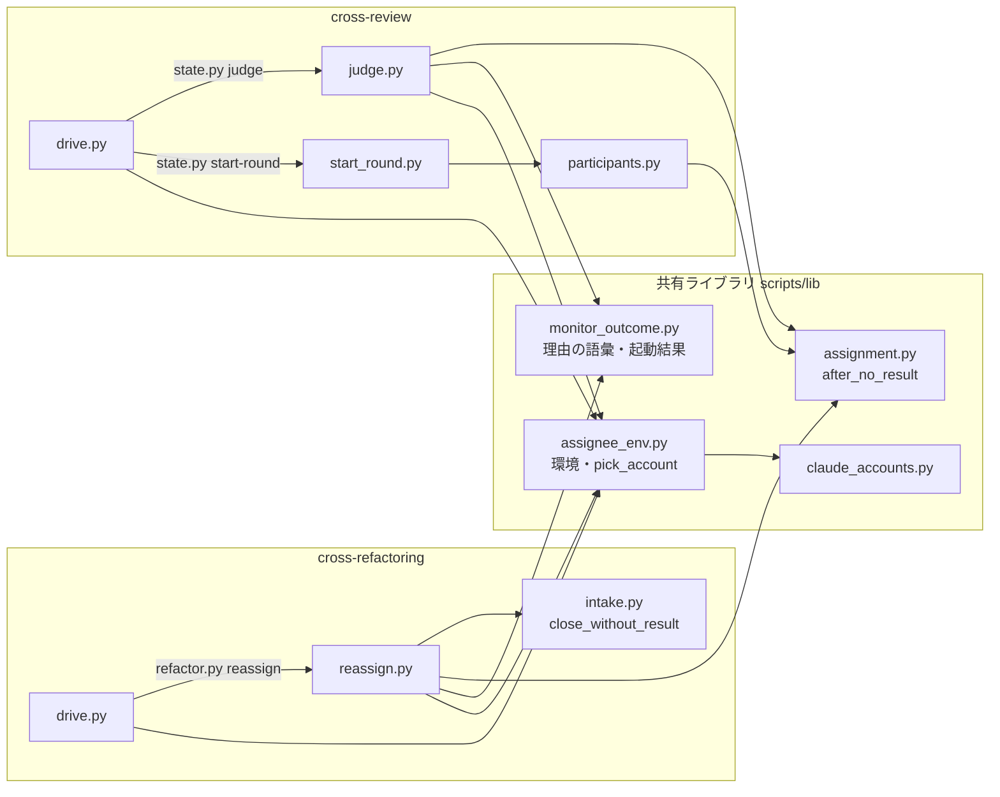
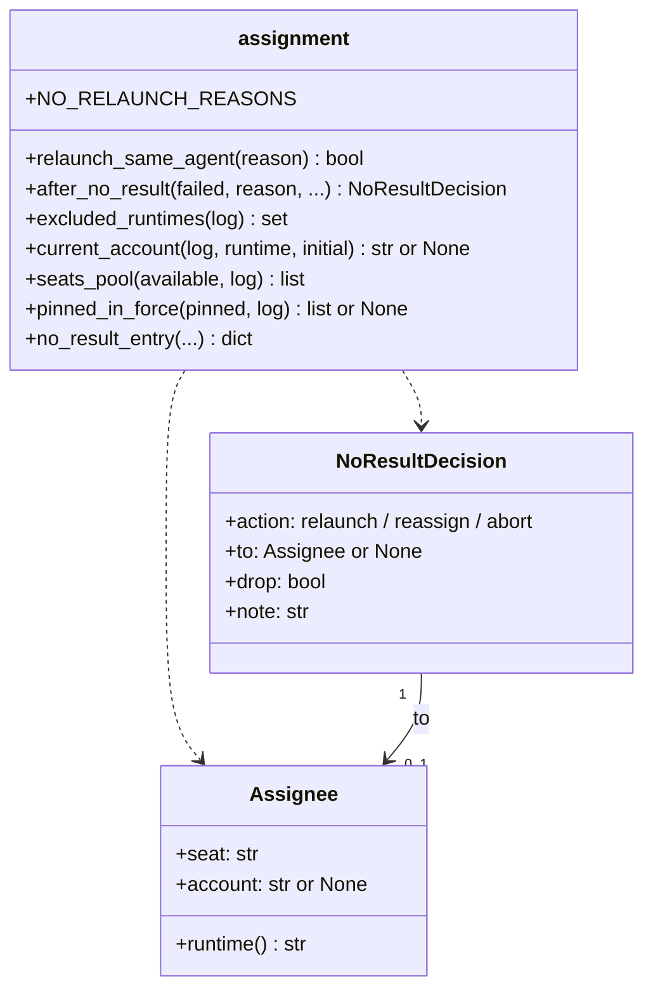
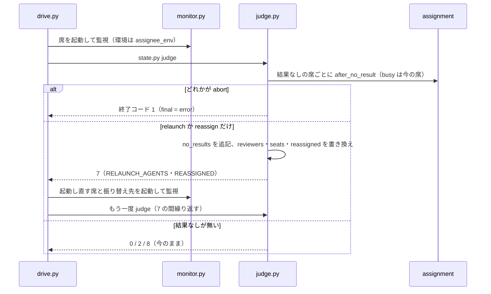
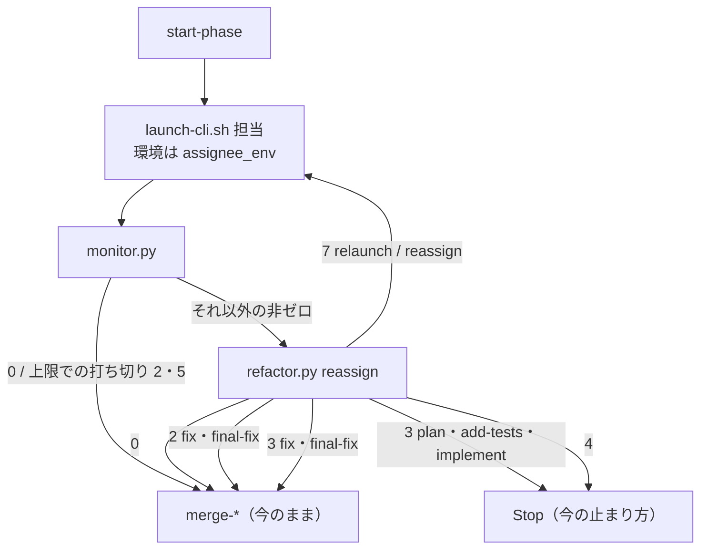
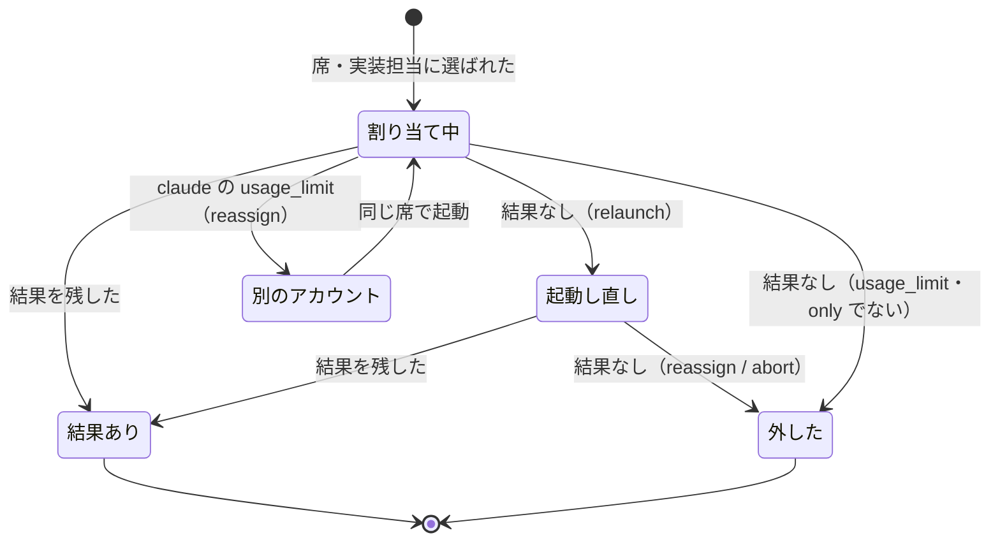

# cross-review / cross-refactoring: 結果を残さなかった担当が利用上限か 2 度目の結果なしで収束を止め、状態ファイルの手編集が要る → 残った参加者か別のアカウントへ振り替えて、人の手なしで先へ進む（#919）

## 目的

- **何が壊れているか**: 担当が結果を残さなかったときの規則は「同じ担当で 1 度だけ起動し直す」だけである。利用上限と 2 度目の結果なしでは、cross-review は `final = error` で止まり、cross-refactoring は実行ごと止まる（PR #1673 では採用 0・未確認 14・終了コード 4）
- **誰が困るか**: 2 つの Skill を回す conductor と利用者。状態ファイルを手で直すか（`only` と `final`）、状態を退避して流し直す必要がある
- **直すと何が成り立つか**: 利用可能な参加者（claude ではほかのアカウントも）が残っていれば、同じ実行の中で振り替えて先へ進む。規則は `lib/assignment.py` の 1 か所に置き、2 つの Skill が同じ規則で動く

## 適用範囲

- **働く範囲**: 配布先のリポジトリでも働く。cross-review と cross-refactoring が共有するライブラリ（`plugins/ndf/scripts/lib/`）と、2 つの Skill の駆動・状態の副命令
- **プロジェクトごとに違うもの**: 振り替え先の候補は、今の参加者の決め方（引数 `--include` / `--exclude` / `--only` と、設定 `.ndf/runtimes.json` の `allowed` と `review_seats`）で決まる。新しい設定も引数も足さない
- **当たるモード**: `standard`

## あるべき姿の根拠

| 根拠 | 種類 | 何を示すか |
| --- | --- | --- |
| PR #1673 の振り返り（#919 の追記）。実装担当の claude が 429 で 180 秒で落ち、採用 0・未確認 14・終了コード 4。手で状態を退避し `run --from refactor` で流し直した 2 回目は採用 6 で最終ゲートを通った | 実測 | 振り替え先が同じ未確認の項目を引き継げば、手の作業なしで同じ結果に届く |
| #794 の agy 1 件と #819 の codex 2 件（利用上限）。回避はどちらも状態ファイルの手編集 | 実測 | 結果なしは特定のランタイムに限らず起き、今の規則では毎回人の手が要る |
| 親 #1290 の修正方針「散った選び方と振り替えの規則を `lib/assignment.py` へ統合し、呼ぶ側からは判断を移す」 | 利用者の指示の原文 | 規則の置き場を 1 か所にする |

要求と受け入れ条件は #919 の本文にある（コピーは [issue-919-requirements.md](issue-919-requirements.md)）。この文書は「どう作るか」だけを扱う。分けた文書は次の 2 つである。

| 文書 | 中身 |
| --- | --- |
| [issue-919-design-decisions.md](issue-919-design-decisions.md) | 決定の記録 |
| [issue-919-design-tests.md](issue-919-design-tests.md) | テスト設計・既存の規則への当てはめ・未確認のまま残ること |

## 例: PR #1673 を、変えた後の形で通す

1. cross-refactoring の実装の工程で、実装担当の claude（共有の設定のアカウント）が 429 で落ちる。監視は理由 `usage_limit`・終了コード 4 を返す
2. `drive.py` は止まらずに `refactor.py reassign <ID> implement` を打つ。`reassign` は工程の起点から HEAD までを取り消し（今の `close_without_result`）、`assignment.after_no_result` に答えを求める
3. 規則は「claude の利用上限なので、別のアカウントを先に試す」。登録済みアカウント `work2` が使えれば `claude@work2` へ、無ければ残りの参加者から「ホスト → 先頭」で codex へ振り替える
4. `reassign` は結果なしの記録（`no_results`）に 1 件を足し、実装担当を書き換えて `IMPL=codex` と終了コード 7 を返す
5. `drive.py` は同じ実装の工程を codex で起動する。採用済みの項目は触らず、`planned` / `tested` のまま残った 14 件から続け、`merge-implement` → 検証 → 最終ゲートへ進む
6. 結果 JSON の `metrics.reassigned` は 1 になり、報告に「実装: claude → codex（usage_limit）」の 1 行が載る

## ドメインモデル

### コンテキスト

| コンテキスト | 何の語が 1 つの意味に決まるか |
| --- | --- |
| NDF の外部 CLI 委譲（`ndf-agent-cli`） | 担当・結果なし・利用上限・振り替え・リトライ可否・結果なしの記録・外した担当 |
| NDF の cross-review（`ndf-cross-review`） | 席・ラウンド・judge の出口 |
| NDF の cross-refactoring（`ndf-cross-refactoring`） | 実装担当・提案担当・工程・未確認 |

`ndf-agent-cli` が供給者、2 つの Skill が顧客の関係（顧客 / 供給者）。2 つの Skill は「結果なしのときに次に何をするか」を自分で決めず、供給者の規則（`after_no_result`）の答えをそのまま実行する。

### 集約

| 集約 | 持ち主（書き換えてよいもの） | 根 | エンティティ | 値オブジェクト |
| --- | --- | --- | --- | --- |
| 結果なしの記録（cross-review） | `state.py judge`（`review_lib/commands/judge.py`） | 状態ファイルの `no_results` | 記録の 1 件 | 担当（席・アカウント）・理由・答え |
| 結果なしの記録（cross-refactoring） | `refactor.py reassign`（新しい `refactor_lib/commands/reassign.py`） | 状態ファイルの `no_results` | 記録の 1 件 | 担当・理由・答え |
| ラウンドの席（cross-review） | `state.py start-round` と `state.py judge` | `rounds[].reviewers` / `rounds[].seats` | 席の記録 | 席の名前・アカウント |
| 実装担当（cross-refactoring） | `refactor.py init`（初期化と再開）と `refactor.py reassign`（実行の途中） | `implementer` / `implementer_account` | — | 担当 |

**規則（`after_no_result`）は集約を持たない。** 記録を読んで答えを返すだけで、書くのは各集約の持ち主である。ラウンドの席と実装担当には持ち主が 2 つずつあるが、書く時点が分かれる。`start-round` と `init` は開く時点、`judge` と `reassign` は結果なしの後だけである。

### 不変条件

| # | 集約 | 条件 | 破れたときの扱い |
| --- | --- | --- | --- |
| I1 | 結果なしの記録 | 記録は追記だけで、既存の件を書き換えない・消さない | 実装の誤り。テストで落とす |
| I2 | 結果なしの記録 | 答えが `reassign`（別のランタイムへ）か `abort` の件の担当のランタイムは、同じ実行の以後の席・実装担当・振り替え先に選ばれない（`-2` の席を含む） | 実装の誤り。テストで落とす |
| I3 | 結果なしの記録 | 振り替え先は、その実行の利用可能な参加者（`participants.available`）の中だけから選ぶ | 実装の誤り。テストで落とす |
| I4 | 結果なしの記録 | 同じ工程・同じ試行で、同じ担当（席とアカウント）の答えが `relaunch` になるのは 1 度だけ | 実装の誤り。テストで落とす |
| I5 | 結果なしの記録 | 1 回の実行の答え `reassign` の件数は、参加者の数と登録済みアカウントの数の和を超えない | 実装の誤り。テストで落とす |
| I6 | ラウンドの席 | 振り替えは、同じラウンドの 2 つの席のランタイムを新たに重ねない。振り替えの前から同じランタイムの 2 席（利用可能な参加者が 1 者のときの `<その者>-2`、固定の組の `claude` / `claude-2`）は、同じ席のままアカウントだけを替える振り替え（規則の順 3）に限って重なりを保ってよい。別のランタイムへの振り替え（順 4）は、もう一方の席のランタイムを `busy` に入れて選ぶ | 振り替え先の候補から外す（I6 を守れる候補が無ければ `abort`） |
| I7 | 実装担当 | 振り替え先を起動する前に、結果を残さなかった起動の範囲（工程の起点から HEAD）を取り消す。取り消すのは、`plan` / `add-tests` / `implement` では `reassign`（規則に答えを求める前）、`final-fix` では担当を書き換えた後の今の `merge-final-fix`（`close_without_result`）で、`reassign` は取り消さない（決定 7・14。取り消しは 1 回だけ）。`fix` は範囲を取り消さない。今の `merge-fix` は範囲の取り消しを持たず、修正の起点から HEAD のコミットを `Item-Id` で受け取り（手順を外れたら範囲ごと `discard_range`）、受け取った項目は次の `verify` が範囲テストで見直す。採用済みの項目のコミットは範囲に入らない | `reassign` が範囲を確定できなければ振り替えず、今の中断（終了コード 4）にする。`merge-fix` / `merge-final-fix` の側は今の扱いのまま |
| I8 | 結果なしの記録 | `--only` の実行では答えが `reassign` にならない | 実装の誤り。テストで落とす |
| I9 | 担当 | 子の環境へトークン・スコープの変数を渡さない。アカウントの環境は `claude_accounts.account_env` の作るもの（`CLAUDE_CONFIG_DIR` を向ける）だけで、状態ファイルと耐久の記録へは環境ではなくアカウントの名前だけを書く | 実装の誤り。テストで落とす |

### ドメインイベント

| # | イベント | 発生元 | 受け手 |
| --- | --- | --- | --- |
| E1 | 担当を起動した | 2 つの `drive.py` | 監視（`monitor.py`） |
| E2 | 担当が結果を残さずに終わった | 監視 | `judge` / `reassign` |
| E3 | 結果なしの理由を判定した | `monitor_outcome.read_launch_outcome` | `judge` / `reassign` |
| E4 | 同じ担当で 1 度だけ起動し直すと決めた | `after_no_result` | `judge` / `reassign`（記録して `drive.py` へ返す） |
| E5 | 担当を同じ実行の残りから外した | `after_no_result`（答えに含まれる） | 結果なしの記録。以後の席の選択（`_round_reviewers`）と振り替え先の候補が読む |
| E6 | 振り替え先を選んだ | `after_no_result` | `judge` / `reassign` |
| E7 | 振り替え先の担当を起動した | 2 つの `drive.py` | 監視（E2 へ戻る） |
| E8 | 結果なしの起動の範囲を取り消した | `plan` / `add-tests` / `implement` は `reassign`（`intake.close_without_result`。E6 より前）、`final-fix` は `merge-final-fix`（E6 の後）。`fix` は取り消さない（I7。今の `merge-fix` の受け取りと次の `verify` の見直しに任せる） | 振り替え先の起動（E7 より前） |
| E9 | 振り替え先が無いため中断した | `judge`（`final = error`）/ `reassign`（終了コード 3） | `drive.py` |
| E10 | 振り替えの事実を記録した | `judge` / `reassign` | 状態ファイル・judge の出力 `REASSIGNED`・報告・`metrics.reassigned` |

### 用語

| 用語 | 意味 | 用語集への反映 |
| --- | --- | --- |
| 担当 | レビュー・提案・実装を受け持つ CLI の起動の単位。ランタイムと、claude ではアカウントで決まる | 追加済み（要求の変更で足した） |
| 結果なし | 担当が結果ファイルを残さずに終わったこと | 追加済み |
| 利用上限 | 担当の CLI が使用量の上限に当たって止まったこと（理由 `usage_limit`） | 追加済み |
| 振り替え | 結果なしの担当の役割を、同じ実行の中で別の担当へ移すこと。同じ担当で起動し直すことは含まない | 追加済み |
| リトライ可否 | 同じ担当を同じ条件で起動し直せば解ける理由か（`assignment.relaunch_same_agent`）。起動結果ではなく規則が持つ | 意味の変更 |
| 結果なしの記録 | 状態ファイルの `no_results`。結果なしの 1 回ごとに、担当・理由・規則の答え（`relaunch` / `reassign` / `abort`）・振り替え先を追記だけで積む | 追加 |
| 外した担当 | 結果なしの記録から導く、同じ実行の残りで割り当てないランタイム（claude ではアカウント） | 追加 |

## 機能一覧

| # | 機能 | 誰が使うか |
| --- | --- | --- |
| F1 | 結果なしのときに「起動し直す / 振り替える / 中断する」を 1 つの規則で決める | 2 つの Skill の副命令 |
| F2 | cross-review のラウンドの席を、同じラウンドの中で振り替え先へ替えて judge を先へ進める | cross-review を回す conductor |
| F3 | 外した担当を、同じ実行の以後のラウンドの席から外す | cross-review |
| F4 | cross-refactoring の実装担当を振り替え、未確認の改善項目から同じ工程を続ける | cross-refactoring を回す conductor |
| F5 | 提案担当の全員が結果なしのとき、残りの担当で提案を集め直す | cross-refactoring |
| F6 | claude の利用上限のとき、別の登録済みアカウントの claude へ先に振り替える | 2 つの Skill |
| F7 | 振り替えの事実を状態ファイル・judge の出力・報告・結果 JSON に残す | conductor・振り返り |

## 構成要素

| 要素 | 変更 | 責務 |
| --- | --- | --- |
| `plugins/ndf/scripts/lib/assignment.py` | 変更 | 規則の正本。`after_no_result`・`NoResultDecision`・`Assignee`、`NO_RELAUNCH_REASONS` と `relaunch_same_agent`（`monitor_outcome.py` から移す）、記録から導く `excluded_runtimes` / `current_account` / `pinned_in_force` / `seats_pool`、記録の 1 件を作る `no_result_entry`。副作用を持たない |
| `plugins/ndf/scripts/lib/monitor_outcome.py` | 変更 | 理由の語彙と起動結果の読み書きだけを持つ。`NO_RELAUNCH_REASONS`・`relaunch_same_agent`・`LaunchOutcome.relaunch_same_agent` を消す |
| `plugins/ndf/scripts/lib/assignee_env.py` | 新規 | 担当の起動の環境を組む。claude でアカウントがあれば `claude_accounts.account_env`、ほかは元の環境。アカウントを選ぶ関数 `pick_account`（`claude_accounts.choose_env` を包み、名前だけを返す）も持つ。2 つの `drive.py` と 2 つの副命令が呼ぶ |
| `skills/cross-review/scripts/review_lib/commands/judge.py` | 変更 | `_handle_no_result_round` が席ごとに `after_no_result` を呼び、答えに従って記録・席の書き換え・出力・終了コードを決める。可否を自分で決める分岐を消す |
| `skills/cross-review/scripts/review_lib/participants.py` | 変更 | `_round_reviewers` が `seats_pool` と `pinned_in_force` を通して `review_seats` を呼ぶ。`seat_records` が席のアカウントを持つ |
| `skills/cross-review/scripts/review_lib/commands/start_round.py` | 変更 | 外した担当を引いた結果、席を選べないときに `final = error`・終了コード 1 にする |
| `skills/cross-review/scripts/drive.py` | 変更 | `collect_reviews` が 7 の間、`RELAUNCH_AGENTS` と `REASSIGNED` の振り替え先を起動して繰り返す（1 度だけの局所の旗を外す）。起動の環境を `assignee_env` で組む |
| `skills/cross-review/scripts/review_lib/commands/report.py` | 変更 | 完了報告に振り替えと外した担当の行を足す |
| `skills/cross-refactoring/scripts/refactor_lib/commands/reassign.py` | 新規 | 副命令 `reassign <ID> <工程>`。起動結果を読み、範囲を取り消し、規則の答えを記録して実装担当・提案担当を書き換え、出力と終了コードで `drive.py` へ返す |
| `skills/cross-refactoring/scripts/refactor.py` | 変更 | `reassign` を登録する |
| `skills/cross-refactoring/scripts/drive.py` | 変更 | `impl_phase` と `propose` が、監視の非ゼロ（上限での打ち切りを除く）で `reassign` を打ち、7 なら同じ工程を返された担当で起動する。起動の環境を `assignee_env` で組む |
| `refactor_lib/intake.py`・`refactor_lib/commands/final_fix.py`・`refactor_lib/commands/gate.py`・`refactor_lib/commands/converge.py` | 変更 | `ClosedAttempt.relaunch_same_agent` を消す。旗を立てるのは `reassign` の答え `abort` だけにする（`final-fix` は今の `final_gate.no_relaunch`、`fix` は新しい欄 `fix_no_relaunch`）。旗を読むのは `converge.py` の `_fix_stop` の 1 か所にし、`fix_no_relaunch` が立っていれば時計によらず真を返す。範囲テストの経路（`_settle_scope` の `_give_up`）も全体テストの経路（`_fix_or_narrow`）も同じ判定で止まる（cross-refactoring の決定 22 と同じ形）ため、`cmd_verify` は `VERIFY=fix` をどちらの出口からも出さず、落ちた項目を締め切りのときと同じく取り消して `VERIFY=done` で進む。`final_gate.no_relaunch` は `fix` では立てない |
| `refactor_lib/commands/setup.py` | 変更 | `_recheck_implementer` が結果なしの記録の外した担当を参加者から引く。`implementer_account` を初期化する |
| `skills/cross-refactoring/scripts/drive.py` の `counts`・`refactor_lib/commands/report.py` | 変更 | `metrics.reassigned` と報告の行 |
| 文書 | 変更 | cross-review の `docs/01-state-and-review.md`（結果を残さなかったレビュアーの扱い）・`docs/04-contracts.md`（状態の欄）・`SKILL.md`（同じラウンドで 1 度だけ起動し直す、の段落）、cross-refactoring の `SKILL.md` と契約の文書、`scripts/lib/README.md`、`docs/glossary.md`（`glossary.py render`） |
| テスト | 新規・変更 | `plugins/ndf/scripts/tests/test_lib_assignment.py`・`test_monitor_outcome_unit.py`、`skills/cross-review/tests/`、`skills/cross-refactoring/tests/` |



図に載せない要素: cross-review の `report.py`、`refactor.py`（`reassign` の登録だけ）、`intake.py` 以外の cross-refactoring の副命令（`final_fix.py` / `gate.py` / `converge.py` / `setup.py` / `report.py`）、文書、テスト。いずれも `after_no_result` を呼ばない。記録と状態の欄を読むか、旗（`no_relaunch`）を見るだけである（`setup.py` は再開の当て直しで `excluded_runtimes` を読む）。

## 構造



`choose_implementer` と `review_seats` は形を変えずに使う。`after_no_result` は振り替え先の順に `choose_implementer`（ホスト → 先頭）を当てる（決定 3）。

## データ構造

**永続データは 2 つの Skill の状態ファイル（JSON）である。** 欄を足すだけで、既存の欄の形と意味は変えない。欄が無い状態ファイルは「結果なしの記録が 0 件」として読む（移行は不要）。

### 結果なしの記録（`no_results`。2 つの Skill で同じ形）

時系列は「事象の記録」で持つ。外した担当・今のアカウント・起動し直し済みかは、この記録から導き、別の欄に上書きで持たない（決定 2）。

| 列 | 型 | 空を許すか | 意味 |
| --- | --- | --- | --- |
| `step` | str | 許さない | cross-review は `review`。cross-refactoring は工程（`propose` / `plan` / `add-tests` / `implement` / `fix` / `final-fix`） |
| `attempt` | int | 許さない | cross-review はラウンドの番号。cross-refactoring は `fix` が `fix.attempt`、`final-fix` が `fix_rounds`、ほかの工程は 1 |
| `seat` | str | 許さない | 結果なしの担当の席の名前（`SEAT_PATTERN`） |
| `account` | str | 許す | 結果なしの担当の claude のアカウント名。空は「アカウントを選んでいない（共有の設定か、claude 以外）」 |
| `reason` | str | 許さない | 起動結果の理由（`usage_limit` など。cross-review の `no_verdict` / `not_posted` を含む） |
| `decision` | str | 許さない | `relaunch` / `reassign` / `abort` |
| `to` | str | 許す | 振り替え先の席。空は `decision` が `reassign` でない |
| `to_account` | str | 許す | 振り替え先の claude のアカウント名。空は「アカウントを選ばない」 |
| `at` | str | 許さない | 記録した時刻（`clock.now_iso()`） |

### 足すほかの欄

| 状態ファイル | 欄 | 意味 |
| --- | --- | --- |
| cross-review | `rounds[].seats[].account` | 席の claude のアカウント名。空はアカウントを選んでいない |
| cross-review | `rounds[].reassigned` | そのラウンドで振り替えた `{from, to, to_account, reason}` の並び（報告と judge の出力の元。正は `no_results`） |
| cross-refactoring | `implementer_account` | 実装担当の claude のアカウント名。空はアカウントを選んでいない |
| cross-refactoring | `implementer_reason` | 既存の値（`named` / `host` / `first`）に `reassigned` を足す |
| cross-refactoring | `fix_no_relaunch` | bool。`fix` 工程の `reassign` が `abort` を返したときだけ真にする。`verify` が `_fix_stop` で読み、真なら範囲テスト・全体テストのどちらの修正も求めない。最終ゲートの `final_gate.no_relaunch`（既存）とは別の欄で、互いに立て合わない |
| cross-refactoring | `proposer_accounts` | 提案担当のランタイムごとのアカウント名（振り替えた者だけ） |

`rounds[].reviewers` / `rounds[].seats` は振り替え先へ書き換える。書き換える前の席の結果なしの欄（`rounds[].<元の席>`）は残す。

### CRUD 図

| 機能 | `no_results` | `rounds[].reviewers`・`seats` | `rounds[].reassigned` | `implementer`・`implementer_account` | `final_gate.no_relaunch` | `fix_no_relaunch` |
| --- | --- | --- | --- | --- | --- | --- |
| F1 規則 | R | — | — | — | — | — |
| F2 席の振り替え（judge） | C | U | C | — | — | — |
| F3 以後の席（start-round） | R | C | — | — | — | — |
| F4 実装担当の振り替え（reassign） | C | — | — | U | U（`final-fix` の `abort` のとき） | U（`fix` の `abort` のとき） |
| F5 提案の振り替え（reassign） | C | — | — | — | — | — |
| F4 の続き（`verify`） | — | — | — | — | — | R |
| F7 報告・結果 JSON | R | R | R | R | — | — |

## 入出力の契約

### `assignment.after_no_result`

| 項目 | 内容 |
| --- | --- |
| 入力 | `failed: Assignee`、`reason: str`、`available: list[str]`（`participants.available`）、`log: list[dict]`（`no_results`）、`step: str`、`attempt: int`、`busy: Iterable[str]`（同じラウンドのほかの席のランタイム。実装担当では空）、`host: str`、`only: bool`、`initial_account: str or None`（環境の `NDF_CLAUDE_ACCOUNT`）、`pick_account: Callable[[frozenset[str]], str or None] or None` |
| 出力 | `NoResultDecision`。`action` が `relaunch` なら `to` は `failed`、`reassign` なら振り替え先、`abort` なら `None` |
| 失敗の形 | 例外を出さない。`failed.seat` が `SEAT_PATTERN` に合わないときだけ `AssignmentError` |
| 互換性 | 新しい関数。`relaunch_same_agent` は名前と意味を変えずに `monitor_outcome` から移す |

規則（上から順に、最初に当たった行の答えを返す）:

| 順 | 条件 | 答え |
| ---: | --- | --- |
| 1 | `relaunch_same_agent(reason)` が真で、記録に同じ `step`・`attempt`・`seat`・`account` の `relaunch` が無い | `relaunch` |
| 2 | `only` が真 | `abort` |
| 3 | `failed` のランタイムが claude、`reason` が `usage_limit`、`pick_account` があり、`pick_account(試したアカウント)` が名前を返す。試したアカウントは `failed.account` と、記録の claude の件の `account` / `to_account` | `reassign`。`to` は同じ席で、そのアカウント |
| 4 | 候補 = `available` −（外した担当 ∪ `failed` のランタイム）− `busy`。候補が 1 者以上 | `reassign`。`to` は `choose_implementer(候補, host)` の者の 1 つ目の席（ランタイム名）。claude なら `current_account(log, "claude", initial_account)` を添える |
| 5 | どれにも当たらない | `abort` |

`drop` は答えが `reassign`（順 4）か `abort` のとき真である。外した担当は記録から `excluded_runtimes` が導く: `decision` が `abort` か、`to` のランタイムが `seat` のランタイムと違う件の、`seat` のランタイム。

### cross-review の `state.py judge`（出力の行と終了コード）

| 出力 | 変更 | 形と意味 |
| --- | --- | --- |
| `NO_RESULT_REASONS` | なし | 今のまま。先頭で 1 度だけ出す |
| `RELAUNCH_AGENTS` / `RELAUNCH_AGENTS_CSV` / `RELAUNCH_TARGET` | なし | 答えが `relaunch` の席だけを載せる。`relaunch` の席が無いときは出さない（今と同じ） |
| `REASSIGNED` | 追加 | `REASSIGNED='<元の席>=<振り替え先>:<理由> ...'`。アカウントへの振り替えは振り替え先を `claude@<アカウント>` と書く。振り替えが無いときは出さない |

| 終了コード | 変更 | 意味 |
| ---: | --- | --- |
| 7 | 意味を広げる | このラウンドで起動する担当がいる（起動し直し・振り替え）。起動するのは `RELAUNCH_AGENTS` と `REASSIGNED` の振り替え先 |
| 1 | なし | 答えが `abort` の席が 1 つでもある。`final = error`、メッセージに記録のこのラウンドの担当と理由を並べる |
| 0 / 2 / 8 | なし | 今のまま |

### cross-refactoring の `refactor.py reassign <ID> <工程>`

工程は `propose` / `plan` / `add-tests` / `implement` / `fix` / `final-fix`。

| 終了コード | 意味 | 出力の行 | `drive.py` がすること |
| ---: | --- | --- | --- |
| 0 | 結果なしとして扱わない（結果がある・上限での打ち切り `timeout` / `stalled`） | `REASSIGN=none` | 今のまま次へ進む |
| 7 | 同じ工程を起動する（`propose` / `plan` / `add-tests` / `implement`） | `IMPL=<席>`（提案は `PROPOSERS='<席> ...'`）、振り替えなら `REASSIGNED='...'` | 返された担当で同じ工程を起動し、監視へ戻る |
| 2 | 次の起動から担当を替えた、または今のまま起動し直す（`fix` / `final-fix`） | `IMPL=<席>`、振り替えなら `REASSIGNED='...'` | 今のまま `merge-fix` / `merge-final-fix` へ進む |
| 3 | 振り替え先が無い（`abort`） | `REASSIGN=abort` | `propose` / `plan` / `add-tests` / `implement` は今の止まり方（`Stop`、終了コードは監視の値）。`fix` / `final-fix` は取り込みへ進む（`fix` は `fix_no_relaunch`、`final-fix` は `final_gate.no_relaunch` が修正を打ち切る） |
| 4 | 範囲を確定できない | — | 今の中断（`ABORT`） |

工程ごとの扱い:

| 工程 | 範囲の取り消し | `relaunch` | `reassign` | `abort` |
| --- | --- | --- | --- | --- |
| `plan` / `add-tests` / `implement` | `reassign` が `close_without_result`（工程の起点から HEAD） | 同じ担当で同じ工程を起動（7） | 実装担当を替え、同じ工程を起動（7） | 今の止まり方（3） |
| `fix` | 取り消さない（今の `merge-fix` が `Item-Id` で受け取り、次の `verify` が見直す） | 次の `verify` の修正で同じ担当（2。今と同じ） | 実装担当を替え、次の修正から振り替え先（2） | `fix_no_relaunch` を立て、以後の修正を求めない（3） |
| `final-fix` | 今の `merge-final-fix`（`close_without_result`） | 次の修正ラウンドで同じ担当（2。今と同じ） | `final_gate.impl` と実装担当を替え、次の修正ラウンドから振り替え先（2） | `final_gate.no_relaunch` を立てる。次の最終ゲートが今の打ち切り（3） |
| `propose` | 範囲は無い | 結果なしの者だけを同じ担当で起動（7） | 提案を出していない担当で起動（7） | 今の止まり方（3） |

`propose` で `reassign` を打つのは、提案担当の全員が結果なしのときだけである（前提 9）。候補の `busy` には、既に提案を出した担当と、同じ呼び出しで振り替え先に選んだ担当を入れる。

### 結果 JSON と報告

| 出力 | 変更 |
| --- | --- |
| cross-refactoring の `metrics.reassigned` | 追加。`no_results` の `decision = reassign` の件数。0 でも出す |
| cross-refactoring の報告 | `no_results` の `reassign` / `abort` の件を 1 行ずつ（工程・試行・元の担当 → 振り替え先・理由） |
| cross-review の完了報告 | 同じ形の行を足す（ラウンド・元の席 → 振り替え先・理由）。外した担当を 1 行 |

## 処理の流れ

### cross-review の 1 ラウンド



次のラウンドの `start-round` は、`_round_reviewers` が `seats_pool(available, log)` を `review_seats` へ渡す。固定の組は `pinned_in_force` が「どちらかのランタイムが振り替えの元になった」と読めば渡さない（前提 6）。候補が 0 になれば `start-round` が `final = error`・終了コード 1 で止める。

**繰り返しは記録が止める。** `drive.py` は 7 の回数を数えない。席ごとに `relaunch` は 1 度（I4）、`reassign` は候補が減るたびに 1 度で、候補が尽きれば `abort` になる（I5）。

### cross-refactoring の担当 1 者の工程



`reassign` の中の順序: 起動結果を読む（`read_result`）→ 結果ありか `STOPPED_REASONS` なら 0 → `close_without_result`（`plan` / `add-tests` / `implement` のみ。範囲を確定できなければ 4）→ `after_no_result` → `no_results` へ追記 → 担当の書き換えと旗（`abort` のとき。`fix` は `fix_no_relaunch`、`final-fix` は `final_gate.no_relaunch`）→ 保存 → 出力。**保存は出力の前に行う。** 出力の後に落ちると、打ち直しの `reassign` が同じ件をもう一度記録する。打ち直しで同じ `step`・`attempt`・`seat` の件が既にあれば、記録した答えを出力し直すだけにする。

**採用済みの項目は取り消さない。** 取り消す範囲は今の工程の起点から HEAD までで、前の工程で採った項目のコミットは起点より前にある（I7）。振り替え先は `live_items` のうち今の工程が扱う状態の項目（`implement` なら `planned` / `tested`）から続ける。

### 担当の状態



外した担当から割り当て中へ戻る遷移は無い（前提 2・3）。`--only` の担当は `外した` へ進まず、`abort` で実行が終わる。

## 非機能の実現方式

| 大項目 | 要求の条件 | 実現方式 | 確かめ方 |
| --- | --- | --- | --- |
| 可用性 | 利用上限に当たった担当が 1 者いても、利用可能な参加者が残っていれば実行は人の手を要さずに先へ進む | 結果なしを judge / `reassign` が規則へ渡し、`drive.py` は答えの担当で同じラウンド・同じ工程を起動する | AC6・AC11・AC16 の結合テスト |
| 運用・保守性 | 規則の正本は `lib/assignment.py` の 1 か所で、規則を変えるときに触る場所は 1 つ。振り替えの事実は状態ファイルと報告から後で数えられる | 可否の集合と答えの表を `assignment.py` に置く。judge と `reassign` は答えを実行するだけにし、`monitor_outcome.py` は可否を持たない。記録は追記だけの `no_results` | AC5 の検索（下）と、`metrics.reassigned` |
| セキュリティ | アカウントへの振り替えでトークン・スコープを子へ渡さない。子へは `account_env` の作る環境（`CLAUDE_CONFIG_DIR`）だけを渡し、`.credentials.json` を NDF が読まない | 環境は起動の耐久ステップの中で `assignee_env` が組み、ステップの引数・状態ファイル・出力にはアカウントの名前だけを書く。`.credentials.json` は `claude_accounts` の外から開かない | I9 のテスト。`grep -rn "credentials" plugins/ndf/scripts/lib/assignee_env.py plugins/ndf/scripts/lib/assignment.py` が 0 件 |

AC5 の検索（実装の後に 0 件であること）:

```bash
grep -rn "relaunch_same_agent\|NO_RELAUNCH_REASONS" plugins/ndf/scripts/lib/monitor_outcome.py plugins/ndf/skills/cross-review/scripts plugins/ndf/skills/cross-refactoring/scripts
```

## 設計の結果

| 課題 | 扱い | 取り込み先 | 触るファイル |
| --- | --- | --- | --- |
| #919 | 実装する | — | `plugins/ndf/scripts/lib/assignment.py`、`plugins/ndf/scripts/lib/monitor_outcome.py`、`plugins/ndf/scripts/lib/assignee_env.py`、`plugins/ndf/scripts/lib/README.md`、`plugins/ndf/scripts/tests/`、`plugins/ndf/skills/cross-review/`、`plugins/ndf/skills/cross-refactoring/`、`docs/glossary.md`、`docs/glossary/glossary.json` |
