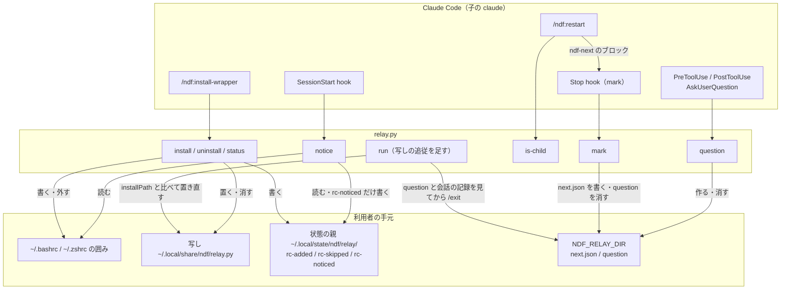
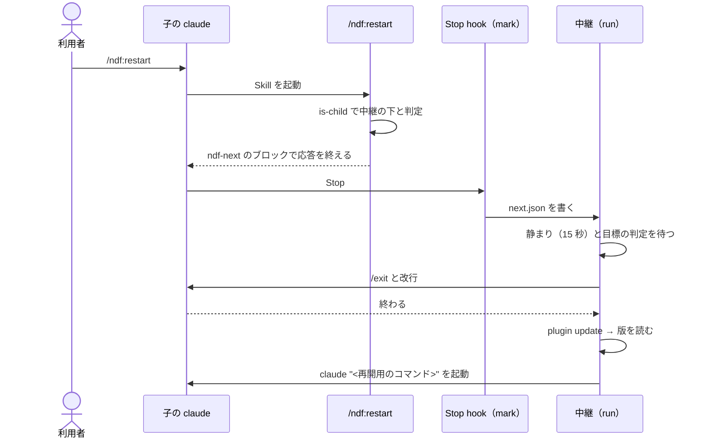
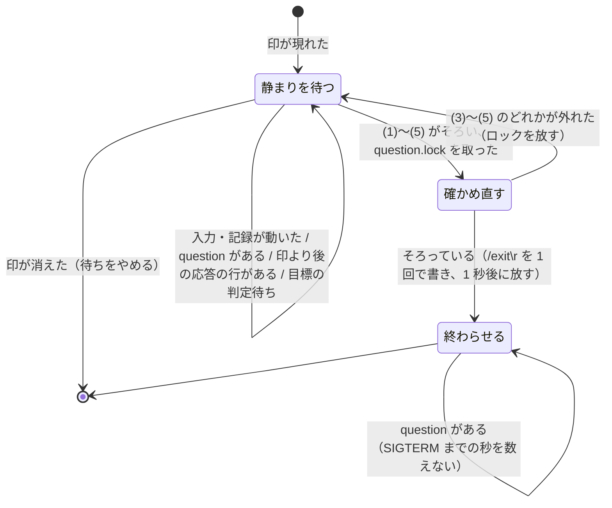
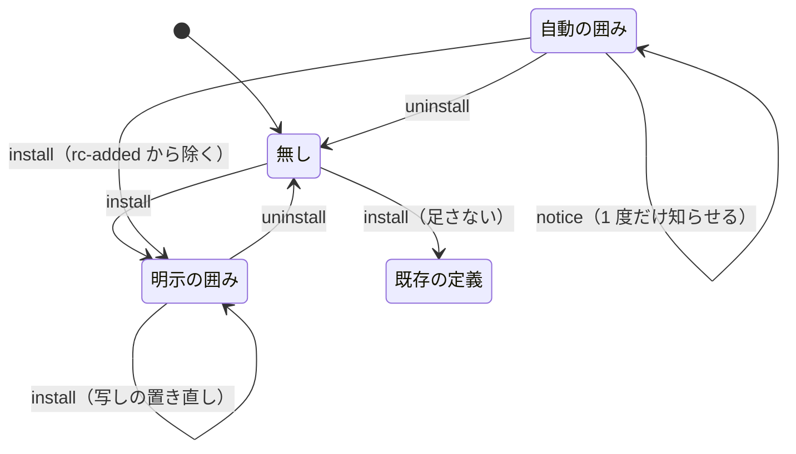

# #928: 中継の導入を明示の操作にし、再起動のコマンドを足す — 設計

要求と受け入れ条件は [issue-928-requirements.md](issue-928-requirements.md) にある。決定の理由は
[issue-928-design-decisions.md](issue-928-design-decisions.md) にある。項目 3（親から子への送り込み）の
実測と不変条件は [issue-928-design-injection.md](issue-928-design-injection.md) にある。
この文書は「どう作るか」だけを扱う。土台の中継の契約は確定仕様
`docs/specifications/ndf-relay-segment-restart.md` のとおりで、ここでは変えるところだけを書く。

**Skill の名前は決定 1 の推奨（`install-wrapper`）で書く。** 利用者の指示の `install_wrapper` は
Skill の名前の規約に合わないため、関門で最終の名前を決める。

## 例: 10.17.4 の利用者と新しい利用者

| 順 | 誰が | 何をする |
| ---: | --- | --- |
| 1 | 10.17.4 の利用者 | 次の版へ上げて claude を起動する。SessionStart hook の `relay.py notice` が、`rc-added` に載った `~/.bashrc` に囲みが残っているのを読み、「10.17.4 が自動で足した alias が残っている…」の 1 行を 1 度だけ出す。何も書き換えない |
| 2 | 同じ利用者 | そのまま `claude` と打つ。囲みの alias が写しの中継を起こし、中継は `claude plugin list --json` の `installPath` の `relay.py` と写しを比べ、違えば写しを置き直してから始まる |
| 3 | 新しい利用者 | claude の中で `/ndf:install-wrapper` を打つ。Skill が `relay.py install` を呼び、写しを置き、`~/.bashrc` をバックアップしてから囲みを足し、「次に開くシェルから効く」を示す |
| 4 | どちらの利用者も | 中継の下で `/ndf:restart` を打つ。claude が再開用のコマンドを `ndf-next` のブロックで出して応答を終え、中継が 15 秒の静まりの後に `/exit` → 更新 → 起動を行う |
| 5 | 外したい利用者 | `/ndf:install-wrapper uninstall`。`~/.bashrc` と `~/.zshrc` の囲みを外し（バックアップの後）、写しを消し、記録から外す |

## 機能一覧

| # | 機能 | 誰が使うか |
| --- | --- | --- |
| F1 | 中継の導入・更新（`/ndf:install-wrapper` / `install`） | 利用者（明示） |
| F2 | 中継の取り外し（`/ndf:install-wrapper uninstall`） | 利用者（明示）。10.17.4 の自動の囲みも対象 |
| F3 | 導入の状態の表示（`/ndf:install-wrapper status`） | 利用者（明示） |
| F4 | 自動の囲みの知らせ（SessionStart の `relay.py notice`） | 10.17.4 で自動の囲みを足された利用者（1 度だけ） |
| F5 | 写しの追従（`relay.py run` の開始時） | 写しを使って中継を起こす利用者 |
| F6 | 再起動（`/ndf:restart`） | 利用者・モデル（中継の下では自動、外では手順の 1 行） |
| F7 | 関門を越えない守り（質問の表示中・応答の再開の後は書かない） | 中継（切れ目の `/exit` と、別の課題の送り込み） |

## 構成要素

| 要素 | 変更 | 責務 |
| --- | --- | --- |
| `plugins/ndf/hooks/claude.json` の `SessionStart` | 変える | `relay.py install` の行を外し、`rc-added` があるときだけ `relay.py notice` を呼ぶ行に置き換える |
| `plugins/ndf/hooks/claude.json` の `PreToolUse` / `PostToolUse`（`AskUserQuestion`） | 足す | `NDF_RELAY_DIR` があるときだけ `relay.py question open` / `question close` を呼ぶ |
| `plugins/ndf/scripts/relay.py` | 変える | `install` を明示の導入に変え、`uninstall` / `status` / `notice` / `question` を足す。`run` の開始時に写しを追従させる。切れ目で `/exit` を書く前に守り（G1〜G3）を確かめ、`/exit` と改行を 1 回の write にする。`mark` は質問の印も消す。`stop` / `is-child` は変えない |
| `plugins/ndf/skills/install-wrapper/SKILL.md` | 足す | 引数（`install` / `uninstall` / `status`）を `relay.py` の副命令へ渡し、出力をそのまま示す。明示指示専用 |
| `plugins/ndf/skills/restart/SKILL.md` | 足す | 再開用のコマンドを決め、中継の下なら `ndf-next` のブロックを出して応答を終え、外なら手順の 1 行を示す |
| `plugins/ndf/manifests/claude-skills.txt` | 変える | 2 つの Skill を足す（Codex / Kiro / agy の manifest には足さない） |
| `plugins/ndf/scripts/tests/test_relay.py` | 変える | 上の副命令と追従の単体テスト |
| `development-workflow/references/relay.md` | 変える | 「始め方」を明示の導入へ、止め方・戻し方に `uninstall` を、`/ndf:restart` を足す |
| `docs/specifications/ndf-relay-segment-restart.md` | 変える（確定仕様化の工程） | `install` の節と決定の表を新しい契約へ直す |



**Codex / Kiro / agy には何も足さない。** 2 つの Skill は `claude-skills.txt` にだけ載り、hook の定義も
`claude.json` だけを変える。

**クラス図は作らない。** `relay.py` は関数の集まりで型を定義せず、足す副命令も関数である（決定 10）。

パッケージの構成（足す・変えるファイルだけ）:

```text
plugins/ndf/
├── hooks/claude.json                 # SessionStart の 1 行を差し替え、AskUserQuestion の 2 件を足す
├── manifests/claude-skills.txt       # install-wrapper / restart を足す
├── scripts/relay.py                  # install を変え、uninstall / status / notice / question、run の追従と守りを足す
├── scripts/tests/test_relay.py
└── skills/
    ├── install-wrapper/SKILL.md      # 新規
    ├── restart/SKILL.md              # 新規
    └── development-workflow/references/relay.md
```

## 入出力の契約（`relay.py`）

### 副命令（変える・足すものだけ）

| 副命令 | 引数 | 終了コード | 出力 | 書くもの |
| --- | --- | --- | --- | --- |
| `install` | 無し | 0: 囲みを足した・既に在った（写しだけ置き直した）/ 1: 足さなかった（既存の `claude` の定義・bash と zsh 以外のシェル）/ 3: ロックが取れない・書けない | 標準出力へ人が読む行（下の表） | 写し・囲み・バックアップ。`rc-added` から足す先を除く |
| `uninstall` | 無し | 0: 外した・外すものが無かった / 1: 閉じの無い囲みがあり、そのファイルを変えなかった / 3: ロックが取れない・書けない | 同上 | バックアップ・囲みを外した設定・写しの削除・`rc-added` / `rc-skipped` / `rc-noticed` から外したパスを除く |
| `status` | 無し | 0 | 同上 | 無し |
| `notice` | 無し | 常に 0 | 知らせるときだけ `{"systemMessage": "<1 行>"}` | `rc-noticed` に知らせたパスを足す |
| `question` | `open` / `close`。標準入力の hook の JSON は読み捨てる | 常に 0 | 無し | 作業ディレクトリの `question` を作る・消す（下の「関門を越えない守り」） |
| `run` | 変えない | 変えない | 変えない | 写しの置き直し（下の「写しの追従」） |

**`install` は `NDF_RELAY_AUTO` を見ない。** 明示の起動なので止める変数は要らない（決定 9）。
副命令が無い・知らないときの振る舞い（使い方を出して終了コード 2）は変えない。使い方の 1 行に
足した副命令を並べる。

**`install` の段**（I1〜I7 を置き換える。ロックは今の `install.lock` を 2 秒まで待つ）:

| # | 段 | すること | 出す行 |
| ---: | --- | --- | --- |
| E1 | 写し | 写しが無いか中身が違えば、一時ファイルに書いて `0755` にしてから置き換える | 無し（E4 の行に含める） |
| E2 | 足す先 | `$SHELL` の名前が `bash` なら `~/.bashrc`、`zsh` なら `${ZDOTDIR:-$HOME}/.zshrc`。それ以外は終了コード 1 | `ndf-relay: <シェル> には足さない。使うなら次の 1 行を設定へ置く: <alias の行>` |
| E3 | 既にある | 足す先に `# >>> ndf relay >>>` の行があれば足さない。`rc-added` から足す先を除く（明示に選んだ囲みになる） | `ndf-relay: <足す先> には既に囲みがある。写しを <版> で置き直した` |
| E4 | 既存の定義 | 足す先（bash では `~/.bash_aliases` も）に行頭の `alias claude=` / `function claude` / `claude()` があれば足さず、終了コード 1 | `ndf-relay: <ファイル> に claude の定義があるため足さない。使うなら次の 1 行を自分で置く: <alias の行>` |
| E5 | 足す | 足す先があれば `<足す先>.ndf-bak-<UTC>` へ写す。末尾が改行で終わらなければ改行を 1 つ、最後の行が空行でなければ空行を 1 つ足してから囲みを追記する（無ければ作る） | `ndf-relay: <足す先> へ alias claude を足した（バックアップ <パス>）。次に開くシェルから効く（今のシェルでは source <足す先>）` |

**E3〜E5 は `rc-added` / `rc-skipped` を足さない。E3 と E5 は `rc-added` から足す先を除く**（明示に選んだ囲みは自動の囲みの知らせの対象でない。決定 12）。 10.17.4 の「利用者が消したら足し直さない」（I5）と
「案内は 1 度だけ」（I6）は、明示の起動では当たらない。打たれるたびに同じ判定をし、同じ行を出す。

**`uninstall` の段:**

| # | 段 | すること |
| ---: | --- | --- |
| U1 | 対象 | `~/.bashrc` と `${ZDOTDIR:-$HOME}/.zshrc` の両方（`$SHELL` に依らない。10.17.4 は起動した時点の `$SHELL` で足した） |
| U2 | 囲みを探す | 行を読み、`# >>> ndf relay >>>` の行から次の `# <<< ndf relay <<<` の行までを 1 つの囲みとする。いくつあってもすべて。開きの後に閉じが無ければ、そのファイルは変えずに終了コード 1 の理由にする |
| U3 | 外す | 囲みが 1 つ以上あれば `<ファイル>.ndf-bak-<UTC>` へ写してから、囲みの行だけを除いた中身を一時ファイルに書き、元の権限で置き換える。**囲みの外の行は変えない**（E5 が足した空行も残す） |
| U4 | 写し | 写しを消す（無ければ何もしない） |
| U5 | 記録 | `rc-added` / `rc-skipped` / `rc-noticed` から外したファイルのパスの行を除く |
| U6 | 報告 | 外したファイルとバックアップを 1 行ずつ。最後に「開いているシェルでは `unalias claude` で外れる（写しを消したので、そのままでは `claude` が失敗する）」を出す。外すものが無ければ `ndf-relay: 外す囲みも写しも無い` |

**`status` の出す行:** 各ファイル（U1 の 2 つ）の囲みの有無と、在れば `rc-added` に載るか（載れば
「10.17.4 が自動で足した」）。写しの有無と、写しの `relay.py` の中身が導入済みのプラグインの
`installPath/scripts/relay.py` と同じか（読めなければ「比べられない」）。

**`notice` の判定:**

| # | 条件 | すること |
| ---: | --- | --- |
| 1 | `rc-added` が無い | 何もしない（hook の定義の側でも `python3` を起こさない） |
| 2 | `rc-added` の各パスのうち、今もそのファイルに囲みがあり、`rc-noticed` に無いものが無い | 何もしない |
| 3 | 上に当たるパスがある | そのパスを `rc-noticed` に足し、`{"systemMessage": "ndf-relay: <パス> の alias claude は 10.17.4 が自動で足したもの。使い続けるなら何もしなくてよい。外すなら /ndf:install-wrapper uninstall"}` を出す（パスが 2 つなら 1 行に並べる） |

**`notice` は設定ファイルと写しを読むだけで、書くのは状態の親の `rc-noticed` だけである。** 例外は
すべて捕まえて終了コード 0 で終わる。**判定 2・3 は `install.lock` の中で行う**（2 秒まで待ち、
取れなければ何もせず終わる）。同じ HOME の 2 つの起動が同時に来ても、`rc-noticed` の読み書きが
重ならず、知らせは 1 度だけになる。取れなかった起動では知らせず、次の起動で改めて判定する。

**hook の定義**（`matcher: startup` の最後の 1 件を差し替える。`timeout` 5・`continueOnError: true`）:

```sh
sh -c 'R="${XDG_STATE_HOME:-$HOME/.local/state}/ndf/relay/rc-added"; [ -f "$R" ] || exit 0; ROOT="${CLAUDE_PLUGIN_ROOT:-${PLUGIN_ROOT:-}}"; [ -n "$ROOT" ] || exit 0; python3 "$ROOT/scripts/relay.py" notice; exit 0'
```

### 写しの追従（`run`）

`run` が中継として始める直前（`read_plugin` の後、作業ディレクトリを作る前）に 1 度だけ行う。

| # | 条件 | すること |
| ---: | --- | --- |
| 1 | 自分（`realpath(__file__)`）が写し（`${XDG_DATA_HOME:-~/.local/share}/ndf/relay.py` の `realpath`）でない | 何もしない（プラグインのキャッシュから直接起こされた） |
| 2 | `plugin list --json` の `ndf@<名前>` の要素に `installPath` が無い・`<installPath>/scripts/relay.py` が読めない | 何もしない |
| 3 | 中身が写しと同じ | 何もしない |
| 4 | 違う | 一時ファイルに書いて `0755` にしてから写しを置き換える。例外は捕まえて無視する |

**動いている `run` は置き換えた後も古い版のまま最後まで動く。** 次に `claude` と打ったときから新しい
版になる（確定仕様の「動いている中継は入れ替えない」を保つ）。`read_plugin` は `installPath` も
返すように広げる（戻り値に 3 つ目を足す。区間の切り替えの版の読み取りは今のまま）。

## Skill の契約

### `/ndf:install-wrapper`

| 項目 | 値 |
| --- | --- |
| frontmatter | `name: install-wrapper`、`argument-hint: "install \| uninstall \| status"`、`disable-model-invocation: true`、`allowed-tools: [Bash]`。`description` に「明示指示のみで実行する」と Claude Code 専用を書く |
| 引数 | 無し・`install` → `install`、`uninstall`・`status` はそのまま。それ以外は使い方を示して何もしない |
| 手順 | プラグインのルートを `statusline` と同じ手順で決め、`python3 "<root>/scripts/relay.py" <副命令>` を 1 回だけ実行し、出力と終了コードをそのまま示す |
| 確認 | 置かない。明示指示専用で、書く前にバックアップを取り、`uninstall` で戻せる（AUTHORING の「実行前確認の要否を決める 3 つの問い」の明示指示専用） |

### `/ndf:restart`

| 項目 | 値 |
| --- | --- |
| frontmatter | `name: restart`、`argument-hint: "[再開用のコマンド]"`、`allowed-tools: [Bash]`。`disable-model-invocation` は付けない（モデルも起動できる）。`description` に Claude Code 専用と、中継の外では手順を示すだけであることを書く |
| 引数 | 再開用のコマンド（複数行可）。無ければ下の「再開用のコマンドの決め方」 |
| 中継の下かの判定 | `[ -n "${NDF_RELAY_DIR:-}" ] && python3 "<root>/scripts/relay.py" is-child`。終了コード 0 なら中継の下（決定 11） |
| 中継の下 | 最後の応答の末尾に、情報文字列 `ndf-next` の囲みを **ちょうど 1 つ** 置き、中身を再開用のコマンドにして応答を終える。その前の行で「中継が静まりを待ってから切り替える」と示す。背景の処理を起こさない。`/goal` の判定が応答を続けさせたら、続いた応答の最後に同じブロックを出し直す |
| 中継の外 | ブロックを出さず、`/exit してから claude を起動し、下の中身を最初の入力として貼り付ける（/ndf:install-wrapper で中継を入れると自動になる）` の 1 行と、再開用のコマンドを囲み `text` で示して終える。**シェルへ貼る 1 行（`claude "..."`）は示さない**（決定 16） |

**再開用のコマンドの決め方**（引数が無いとき。上から最初に当たるもの）:

| # | 会話の状態 | 再開用のコマンド |
| ---: | --- | --- |
| 1 | `/goal` の目標がある | その目標の入力をそのまま（`/goal /ndf:development-workflow #928` など）。引継ぎ文書を名指ししていれば「<文書> の続きから」を足す（`context-window.md` の「新しい会話で戻す」と同じ形） |
| 2 | 課題・作業ツリー・Pull Request が会話にある | それらを指し、「続きから始める。状態は <課題> の本文の `## 進行` と <Pull Request> を読む」の 1 段落 |
| 3 | どれも無い | 引数を求める 1 行を示し、ブロックを出さずに終える |

**再開用のコマンドには承認・同意・判断の結果を書かない**（「利用者は承認した」「マージしてよい」
など）。次の区間の claude はそれを人の入力として読むため、関門を越える経路になる。承認は会話の外の
記録（課題の本文・Pull Request）から次の区間が読み直す。

## 関門を越えない守り

実測と不変条件は [issue-928-design-injection.md](issue-928-design-injection.md) にある。ここでは G1〜G3 の
作り方だけを書く。

**質問の印 `question`**（作業ディレクトリの新しいファイル。`next.json` の形は変えない）:

| 書く側 | 条件 | すること |
| --- | --- | --- |
| `question open`（`PreToolUse`・`AskUserQuestion`） | `NDF_RELAY_DIR` があり、中継が動いていて（`relay.lock` が取れない）、hook の親をたどって最初に当たる claude が `child.pid` と一致する | 作業ディレクトリの `question.lock` の排他を 3 秒まで待って取り、権限 `0600` の空のファイルを作ってから放す。取れなくても作る（hook を止めない） |
| `question close`（`PostToolUse`・`AskUserQuestion`） | 同じ | 消す |
| `mark`（Stop） | 既存の判定の 4（直接の子）を通った | 印の判定の前に消す。Stop が起きたなら質問は表示されていない。`Esc` で取り消して `PostToolUse` が来なかった印もここで消える |

hook の定義（`PreToolUse` と `PostToolUse` に `matcher: AskUserQuestion` の 1 件ずつ。`timeout` 5・
`continueOnError: true`。`<動作>` は `open` / `close`）:

```sh
sh -c '[ -n "${NDF_RELAY_DIR:-}" ] || exit 0; ROOT="${CLAUDE_PLUGIN_ROOT:-${PLUGIN_ROOT:-}}"; [ -n "$ROOT" ] || exit 0; python3 "$ROOT/scripts/relay.py" question <動作>; exit 0'
```

**中継の「静まりを待つ」の条件に 2 つを足す**（確定仕様の (1)〜(3) の後）:

| # | 条件 | 外れたとき |
| ---: | --- | --- |
| (4) | 作業ディレクトリに `question` が無い | 待ち続ける（G1） |
| (5) | 印の `transcript_path` に、`timestamp` が印の `written_at` より後で `type` が `assistant` か `user` の行が無い | 待ち続ける。次の Stop が印を書き直すか消す（G2）。目標の判定の行（`type: attachment`）は数えない |

**終わらせる段を変える（G3）。** (1)〜(5) がそろったら、次の順で書く。

| 順 | 中継がすること |
| ---: | --- |
| 1 | (1)〜(5) がそろった時点の、印の `written_at` と会話の記録の大きさ・更新時刻を控える（記録を全行読むのはこの前の段だけ） |
| 2 | `question.lock` の排他を取る（取れなければ次の確認まで待つ） |
| 3 | ロックの中では記録を読み直さない。`question` が無いこと、印の `written_at` と記録の大きさ・更新時刻が 1 の控えと同じことだけを、`stat` と印の読み取りで確かめる。外れていれば放して「静まりを待つ」へ戻る |
| 4 | `/exit\r` を **1 回の write** で書く |
| 5 | 1 秒おいてから放す |

**ロックで質問の始まりと write を排他にする。** 質問は `PreToolUse` の hook が終わってから描かれ、
その hook は `question.lock` を取ってから印を作る。そのため、確かめ直しの後に質問が描かれることは
無い。書いた後に 1 秒持つのは、TUI が書いた入力を読み終える前に質問が描かれないためである。
**ロックを持つ時間は、ファイルの `stat`・印の読み取り・write と 1 秒である。** 会話の記録を全行
読む処理（目標の判定・(5)）をロックの中に置かないので、持つ時間は記録の長さに依らない。**持つ時間
（1 秒と数ミリ秒）は、`question open` が待つ 3 秒より短く、hook の `timeout` 5 秒にも収まる**（決定 17）。

**書いた後に `question` が現れたら、消えるまで `NDF_RELAY_EXIT_WAIT` の秒を数えない。** 印の
確かめ直しと write の間に応答が再開していた場合、書いた `/exit` は待ち行列に入る。その応答が質問を
出すと、`/exit` は答えの後に働く。秒を数え続けると、人が答える前に SIGTERM で質問ごと消す。

`NDF_RELAY_EXIT_GAP` は使わなくなる（決定 14）。SIGTERM・SIGKILL の秒は変えない。

**`mark` の関数は `question` を消す 1 行を足すだけで、印の判定は変えない。** 古い版の中継（写しの
追従の前に動いていたもの）は `question` を読まないが、壊れもしない（今までと同じ振る舞い）。

## 処理の流れ

### 再起動（中継の下）



**中継の側に再起動のための変更は無い。** 静まり・背景の処理・`AskUserQuestion` の答え待ち・目標の
判定・上限・空回りの判定と、この課題で足す守り（G1〜G3）が、既存の切れ目と同じに効く（AC15）。

### 切れ目で `/exit` を書くまで（守りを足した後）



### 導入の状態



「自動の囲み」は 10.17.4 からの移行の状態で、新しい版はこの状態を作らない。利用者が手で囲みを
消した場合は「無し」と同じに扱う（`notice` は囲みが無ければ知らせない）。

## 非機能の実現方式

| 大項目 | 実現方式 |
| --- | --- |
| 可用性 | `notice` は常に終了コード 0 で、hook の定義でも `continueOnError: true`。写しの追従の失敗は無視して古い写しのまま始める |
| 運用・保守性 | 入口は `/ndf:install-wrapper` の 1 つ。手で戻す方法（囲みを消す・写しを消す）を `relay.md` に残す |
| 移行性 | 囲みの行・alias の行・写しの置き場所・状態の親のファイル名を 10.17.4 と同じにする。新しい版で足した囲みは 10.17.4 に戻しても同じ形として読まれる（10.17.4 の I4 は囲みがあれば何もしない） |
| セキュリティ | 質問の表示中と印の後の応答の再開では、中継が子の端末へ書かない（G1〜G3）。設定ファイルを書くのは明示指示専用の Skill だけ。書く前にバックアップを取り、囲みの外を変えない。再開用のコマンドに承認を書かない。送り込みは不変条件（[issue-928-design-injection.md](issue-928-design-injection.md)）を満たすまで実装しない |
| 費用 | `notice` は `rc-added` が無ければ `python3` を起こさない。写しの追従は始めるときのファイル 2 つの読み比べだけ |

## テスト設計

| 受け入れ条件 | 何で確かめるか |
| --- | --- |
| AC1 | `claude.json` の SessionStart に `install` が無いこと（hook の定義を読む単体テスト）と、一時の HOME で `notice` の hook のコマンドをそのまま動かして設定・写しの中身と更新時刻が変わらないこと |
| AC2 | `git diff origin/develop -- plugins/ndf/hooks/codex.json plugins/ndf/dev.agy plugins/ndf/dev.kiro` が空 |
| AC3〜AC5 | `test_relay.py`: bash / zsh（`ZDOTDIR`）で囲み・バックアップ・行が出る。2 回目は写しだけ置き直す。`rc-added` があっても足す。既存の alias / 関数 / `~/.bash_aliases`・fish で足さず終了コード 1。E5 の空行を 1 つだけ挟む |
| AC6 | `test_relay.py`: 両方のファイルの囲み（複数を含む）を外し、囲みの外がバイトで同じ。閉じの無い囲みで変えず終了コード 1。写しと記録の行が消える。10.17.4 の `install` で作った状態（`rc-added` あり）から外れる |
| AC7 | `test_relay.py`: 各状態で出す行と、何も書かないこと（前後のファイルの比較） |
| AC8・AC16 | manifests と `check-skill-frontmatter.py`。`install-wrapper` に `disable-model-invocation: true`、`restart` に無いこと |
| AC9 | `test_relay.py`: `rc-added` あり・囲みありで 1 度だけ `systemMessage`、2 回目は出ない。同時に 2 つ走らせても出るのは 1 つだけ。囲みが消えていれば出ない。設定と写しを書かない |
| AC10 | 10.17.4 の囲みの文字列のまま `run` が始まること（既存の中継のテストが通る） |
| AC11 | `test_relay.py`: 写しから起こした `run` が、差し替えの `plugin list` の `installPath` の中身へ写しを置き直す。写しでない場所から起こしたとき・`installPath` が無いときは置き直さない |
| AC12〜AC15 | `restart/SKILL.md` を読んで確かめる（文言を固定するテストは書かない）と AC21 |
| AC17〜AC19 | [issue-928-design-injection.md](issue-928-design-injection.md) の実測の表・不変条件の節と、起票した課題 |
| AC23 | `test_relay.py`: 印があって静まっても `question` がある間は子へ何も届かない。`question close` の後に Stop（印の書き直し）で切り替わる。`mark` が `question` を消す |
| AC24 | `test_relay.py`: 印の後に会話の記録へ `assistant` の行を足すと `/exit` が届かない。`attachment` の行では止まらない |
| AC25 | `test_relay.py`: 子へ届いたバイトが `/exit\r` の 1 回であること。確かめ直しの直前に `question` を置くと届かないこと（差し込み点で試す）。中継が `question.lock` を持つ間、`question open` が放されるまで待ち、放された後に印を作ること |
| AC25b | `test_relay.py`: `/exit` の後に `question` を置いた試験用の子が、`NDF_RELAY_EXIT_WAIT` を過ぎても SIGTERM を受けず、`question` を消した後に数え始めること |
| AC26 | `test_relay.py`: `NDF_RELAY_DIR` 無し・中継が動いていない・直接の子でないで、`question open` が何も作らず出力が空で終了コード 0 |
| AC20〜AC22 | 全体テスト・静的検査。AC21 は本物の Claude Code（一時の HOME・隔離した `CLAUDE_CONFIG_DIR`・`DISABLE_AUTOUPDATER=1`）の上で `/ndf:restart` を 1 度通し、`log.jsonl` の `start` 2 行を実装の Pull Request に残す。同じ通しで、印の後に質問を出させ（`/goal` の続きか、質問を出す指示）、表示の 30 秒のあいだ `/exit` が書かれないことを見る |

## 未確認のまま残ること

| 項目 | 内容 |
| --- | --- |
| `/restart` の名前の衝突 | Claude Code の組み込みや主要プラグインに `restart` を末尾に持つ Skill・コマンドがあるかは、実装の時点で `/` メニューに打って確かめる（AUTHORING の「外部 Skill 名の末尾要素にしない」）。衝突すれば `relay-restart` へ寄せる |
| `/goal` の下の再起動 | 目標の判定が再起動の応答を「未達」として続けさせたとき、モデルがブロックを出し直すかは実機の通し（AC21）で 1 度見る。出し直さなければ印が消え、中継は切り替えない（落ちる形であって壊れない） |
| macOS | `uninstall` の置き換えと権限の保持は Linux でだけ確かめる |
| 書いた入力を TUI が読む時間 | 1 秒で読み終えるかは、実機の通し（AC21）で `question.lock` を持つ秒を変えて 1 度見る。実測では、応答の途中に書いた `/clear` は 1 秒後の画面で待ち行列に入っていた |
| 会話の記録の行の型 | (5) が数える `assistant` / `user` の行が、印の後の Stop hook の記録（`system` など）を含まないことを、実装の時点で本物の記録で確かめる |
