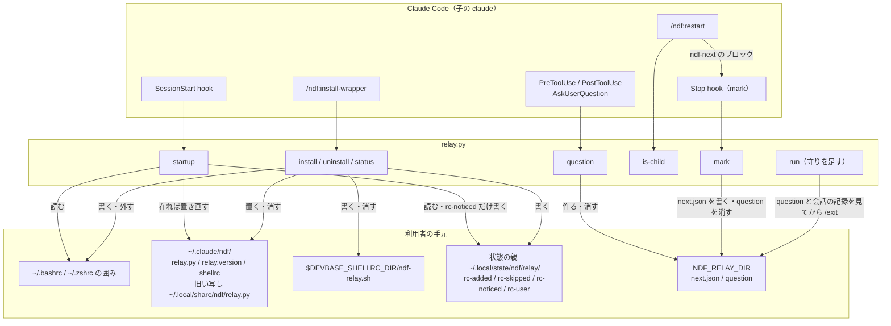
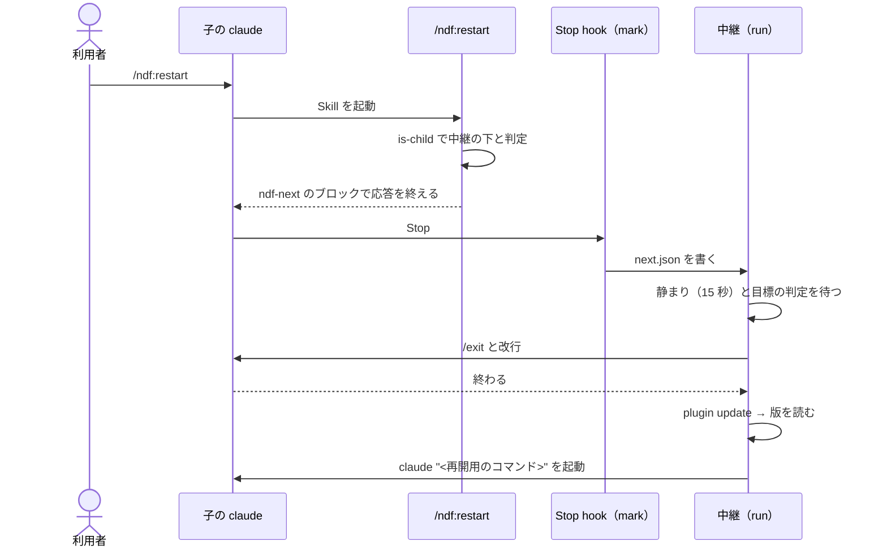
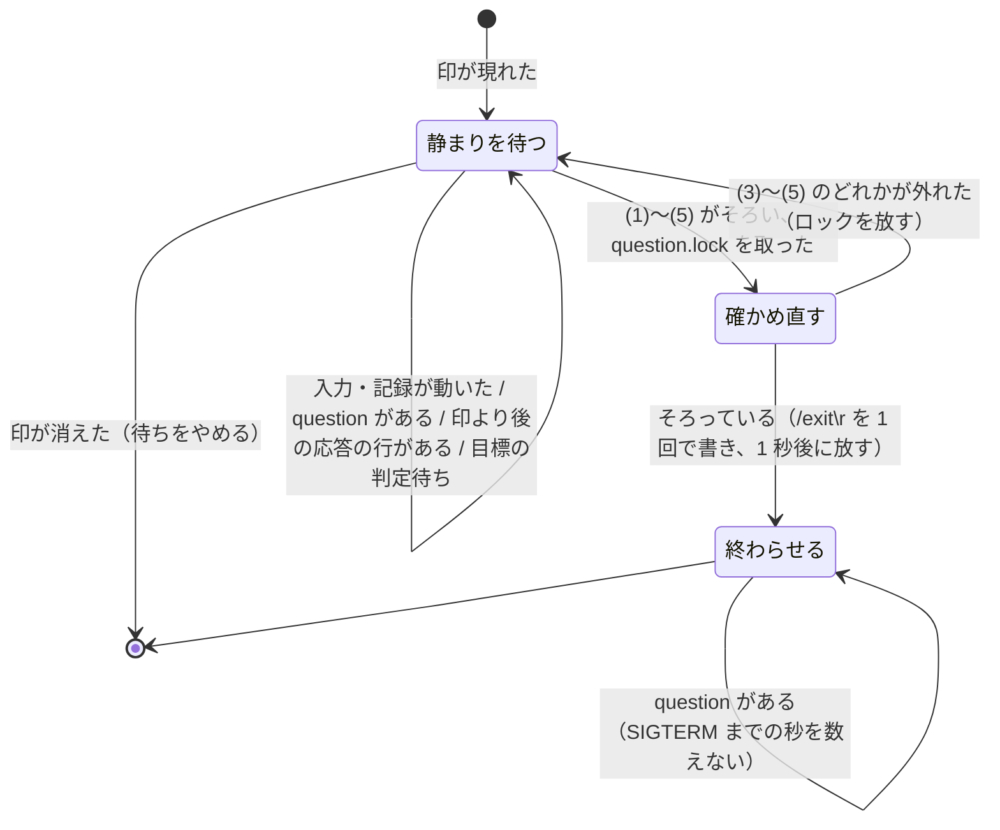
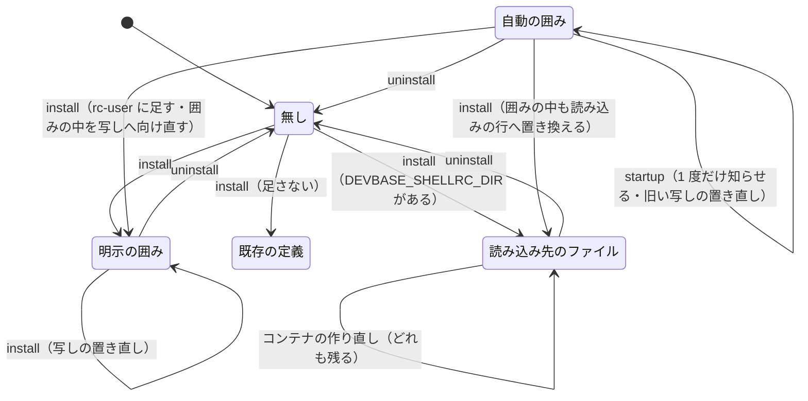

# #928: 中継の導入を明示の操作にし、再起動のコマンドを足す — 設計

要求と受け入れ条件は [issue-928-requirements.md](issue-928-requirements.md) にある。決定の理由は
[issue-928-design-decisions.md](issue-928-design-decisions.md) にある。項目 3（親から子への送り込み）の
実測と不変条件は [issue-928-design-injection.md](issue-928-design-injection.md) にある。
この文書は「どう作るか」だけを扱う。土台の中継の契約は確定仕様
`docs/specifications/ndf-relay-segment-restart.md` のとおりで、ここでは変えるところだけを書く。

**Skill の名前は決定 1 の推奨（`install-wrapper`）で書く。** 利用者の指示の `install_wrapper` は
Skill の名前の規約に合わないため、関門で最終の名前を決める。

## 例: 10.17.4 の利用者と新しい利用者

| 順 | 誰が | 何をする |
| ---: | --- | --- |
| 1 | 10.17.4 の利用者 | 次の版へ上げて claude を起動する。SessionStart hook の `relay.py startup` が、10.17.4 が置いた旧い写し（`~/.local/share/ndf/relay.py`）を今の版の `relay.py` で置き直す。`rc-added` に載った `~/.bashrc` に囲みが残っているのを読み、「10.17.4 が自動で足した alias が残っている…」の 1 行を 1 度だけ出す。シェルの設定は書き換えない |
| 2 | 同じ利用者 | そのまま `claude` と打つ。囲みの alias が、1 で置き直した新しい版の旧い写しの中継を起こす |
| 3 | 新しい利用者 | claude の中で `/ndf:install-wrapper` を打つ。Skill が `relay.py install` を呼び、写しを `~/.claude/ndf/relay.py`、alias を `~/.claude/ndf/shellrc` に置く。`~/.bashrc` をバックアップしてから、`shellrc` を読む 1 行の囲みを足し、「次に開くシェルから効く」を示す |
| 4 | どちらの利用者も | 中継の下で `/ndf:restart` を打つ。claude が再開用のコマンドを `ndf-next` のブロックで出して応答を終え、中継が 15 秒の静まりの後に `/exit` → 更新 → 起動を行う |
| 5 | 外したい利用者 | `/ndf:install-wrapper uninstall`。`~/.bashrc` と `~/.zshrc` の囲みを外し（バックアップの後）、`shellrc`・写し・旧い写しを消す。`rc-skipped` / `rc-noticed` から外し、`rc-added` には残して `rc-user` に足す |
| 6 | devbase の利用者（devbasex/devbase#253 の後） | `/ndf:install-wrapper` を打つ。`DEVBASE_SHELLRC_DIR` があるので、`~/.bashrc` ではなく読み込み先のファイル `ndf-relay.sh` に `shellrc` を読む 1 行を置く。コンテナを作り直しても、写し・`shellrc`・`ndf-relay.sh` はどれも `/persistent/group` にあり、`claude` は中継を通ったまま動く |

## 機能一覧

| # | 機能 | 誰が使うか |
| --- | --- | --- |
| F1 | 中継の導入・更新（`/ndf:install-wrapper` / `install`） | 利用者（明示） |
| F2 | 中継の取り外し（`/ndf:install-wrapper uninstall`） | 利用者（明示）。10.17.4 の自動の囲みも対象 |
| F3 | 導入の状態の表示（`/ndf:install-wrapper status`） | 利用者（明示） |
| F4 | 自動の囲みの知らせ（SessionStart の `relay.py startup`） | 10.17.4 で自動の囲みを足された利用者（1 度だけ） |
| F5 | 写しの置き直し（SessionStart の `relay.py startup`。写しが在るときだけ） | 写しを置いた利用者（10.17.4 の自動の導入を含む） |
| F6 | 再起動（`/ndf:restart`） | 利用者・モデル（中継の下では自動、外では手順の 1 行） |
| F7 | 関門を越えない守り（質問の表示中・応答の再開の後は書かない） | 中継（切れ目の `/exit` と、別の課題の送り込み） |
| F8 | 永続化される場所への導入（中継の rc と読み込み先のファイル） | devbase の利用者（コンテナを作り直しても alias が残る） |

## 構成要素

| 要素 | 変更 | 責務 |
| --- | --- | --- |
| `plugins/ndf/hooks/claude.json` の `SessionStart` | 変える | `relay.py install` の行を外し、`rc-added` か写しがあるときだけ `relay.py startup` を呼ぶ行に置き換える |
| `plugins/ndf/hooks/claude.json` の `PreToolUse` / `PostToolUse`（`AskUserQuestion`） | 足す | `NDF_RELAY_DIR` があるときだけ `relay.py question open` / `question close` を呼ぶ |
| `plugins/ndf/scripts/relay.py` | 変える | 写しと alias（中継の rc）の置き場所を Claude Code の設定の親の下へ移し、`install` を明示の導入に変え、`uninstall` / `status` / `startup` / `question` を足す。切れ目で `/exit` を書く前に守り（G1〜G3）を確かめ、`/exit` と改行を 1 回の write にする。`mark` は質問の印も消す。`stop` / `is-child` は変えない |
| `plugins/ndf/skills/install-wrapper/SKILL.md` | 足す | 引数（`install` / `uninstall` / `status`）を `relay.py` の副命令へ渡し、出力をそのまま示す。明示指示専用 |
| `plugins/ndf/skills/restart/SKILL.md` | 足す | 再開用のコマンドを決め、中継の下なら `ndf-next` のブロックを出して応答を終え、外なら手順の 1 行を示す |
| `plugins/ndf/manifests/claude-skills.txt` | 変える | 2 つの Skill を足す（Codex / Kiro / agy の manifest には足さない） |
| `plugins/ndf/scripts/tests/test_relay.py` | 変える | 上の副命令と写しの置き直しの単体テスト |
| `development-workflow/references/relay.md` | 変える | 「始め方」を明示の導入へ、止め方・戻し方に `uninstall` を、`/ndf:restart` を足す |
| `docs/specifications/ndf-relay-segment-restart.md` | 変える（確定仕様化の工程） | `install` の節と決定の表を新しい契約へ直す |



**Codex / Kiro / agy には何も足さない。** 2 つの Skill は `claude-skills.txt` にだけ載り、hook の定義も
`claude.json` だけを変える。

**クラス図は作らない。** `relay.py` は関数の集まりで型を定義せず、足す副命令も関数である（決定 10）。

パッケージの構成（足す・変えるファイルだけ）:

```text
plugins/ndf/
├── hooks/claude.json                 # SessionStart の 1 行を差し替え、AskUserQuestion の 2 件を足す
├── manifests/claude-skills.txt       # install-wrapper / restart を足す
├── scripts/relay.py                  # install を変え、uninstall / status / startup / question、run の守りを足す
├── scripts/tests/test_relay.py
└── skills/
    ├── install-wrapper/SKILL.md      # 新規
    ├── restart/SKILL.md              # 新規
    └── development-workflow/references/relay.md
```

## 入出力の契約（`relay.py`）

### 副命令（変える・足すものだけ）

| 副命令 | 引数 | 終了コード | 出力 | 書くもの |
| --- | --- | --- | --- | --- |
| `install` | 無し | 0: 読み込みを置いた・既に在った（写しと中継の rc を置き直し、囲みの中が違えば置き換えた）/ 1: 置かなかった（既存の `claude` の定義・bash と zsh 以外のシェル・閉じの無い囲み・引用できないパス）/ 3: ロックが取れない・書けない | 標準出力へ人が読む行（下の表） | 写し・写しの版・中継の rc・読み込み（読み込み先のファイルか囲み）・バックアップ。囲みを書いたら `rc-added` と `rc-user` に足す先を足す |
| `uninstall` | 無し | 0: 外した・外すものが無かった / 1: 閉じの無い囲みがあり、何も変えなかった / 3: ロックが取れない・書けない | 同上 | バックアップ・囲みを外した設定・読み込み先のファイル・中継の rc・写し・写しの版・旧い写しの削除。`rc-skipped` / `rc-noticed` から外したパスを除き、`rc-added` には残し、`rc-user` に足す |
| `status` | 無し | 0 | 同上 | 無し |
| `startup` | 無し | 常に 0 | 知らせるときだけ `{"systemMessage": "<1 行>"}` | 在る写し（版の後退はしない）・写しの版・旧い写しの置き直し。`rc-noticed` に知らせたパスを足す |
| `question` | `open` / `close`。標準入力の hook の JSON は読み捨てる | 常に 0 | 無し | 作業ディレクトリの `question` を作る・消す（下の「関門を越えない守り」） |

**`install` は `NDF_RELAY_AUTO` を見ない。** 明示の起動なので止める変数は要らない（決定 9）。
副命令が無い・知らないときの振る舞い（使い方を出して終了コード 2）は変えない。使い方の 1 行に
足した副命令を並べる。

### 置き場所

**`claude` の定義は、写しと同じ永続化される親の下の「中継の rc」に書く。** シェルの設定には、中継の rc を
読む 1 行だけを置く（決定 18・19）。`<親>` は `install` の時点の `${CLAUDE_CONFIG_DIR:-$HOME/.claude}/ndf` である。

| ファイル | パス | 誰が置くか | devbase での永続性（2026-09-23 の実測） |
| --- | --- | --- | --- |
| 写し | `<親>/relay.py` | 明示の `install`。在れば `startup` が置き直す | 残る。`~/.claude` は `/persistent/group/.claude` への symlink（`readlink -f`）で、`/persistent/group` は名前付きボリュームの mount（`findmnt`） |
| 写しの版 | `<親>/relay.version`（プラグインの版の 1 行） | `install`・`startup` | 残る |
| 中継の rc | `<親>/shellrc` | `install` | 残る |
| 読み込み先のファイル | `$DEVBASE_SHELLRC_DIR/ndf-relay.sh` | `install`（`DEVBASE_SHELLRC_DIR` がディレクトリを指すとき） | 残る（devbasex/devbase#253 が入った後） |
| 読み込みの囲み | `~/.bashrc`・`${ZDOTDIR:-$HOME}/.zshrc` の囲み | `install`（上の変数が無いとき） | 消える。どちらもコンテナの層の中の普通のファイル |
| 旧い写し | `${XDG_DATA_HOME:-$HOME/.local/share}/ndf/relay.py` | 10.17.4 の hook（新しい版は置かない） | 消える |
| 状態の親 | `${XDG_STATE_HOME:-$HOME/.local/state}/ndf/relay/` | 変えない | 消える |

devbase では `~/.claude`・`~/.claude.json`・`~/.gemini` が `/persistent/group` へ、`~/.codex`・`~/.kiro`・
`~/.serena`・`~/.ssh` が `/persistent/ai` へ symlink されている。`/persistent/group` はアカウントグループ
単位で、同じグループの別のコンテナとも共有される（devbasex/devbase#116）。**そのため devbase では、
`install` と `uninstall` の効果は同じグループの全コンテナに及ぶ。**

**中継の rc と読み込みの中身**（`$HOME` の下なら `"$HOME/..."` の形で書き、それ以外は絶対パスを書く）:

```sh
# <親>/shellrc
# ndf の中継。/ndf:install-wrapper が書き、/ndf:install-wrapper uninstall が消す
function claude {
  if [ -f "$HOME/.claude/ndf/relay.py" ]; then python3 "$HOME/.claude/ndf/relay.py" run "$@"
  else command claude "$@"; fi
}

# 読み込み先のファイル、または囲みの中の 1 行
[ -f "$HOME/.claude/ndf/shellrc" ] && . "$HOME/.claude/ndf/shellrc"
```

**写しの有無は `claude` を呼んだ時点で見る。** 別のコンテナの `uninstall` が共有された写しを消しても、
開いたままのシェルの `claude` は素の `claude` へ落ち、失敗しない（alias の形では起動した時点でしか
見られない。レビューの指摘）。中継の rc が無ければ、読み込みの行は何もしない。

**関数は `function claude { ... }` の形で書く。** 先に `alias claude=...` があると、`claude() { ... }` の形は
定義の行が alias で展開されて壊れる。`function` の後の名前は展開されない。先の alias は呼び出しの時に
展開され、その引数が関数へ渡る。devbase の `alias claude='claude --dangerously-skip-permissions'` の後に
読むと、`--dangerously-skip-permissions` が中継を通って子の `claude` へ届く（2026-09-23 に bash 5 で
`bash --rcfile` を使って確かめた。zsh は手元に無く確かめていない）。
`${CLAUDE_CONFIG_DIR:-...}` をファイルに残さないのは、隔離した `CLAUDE_CONFIG_DIR` で `claude` を
起動したときに写しを見失わないためである。パスに引用を壊す文字が含まれれば何も書かない（E0）。

**`install` の段**（I1〜I7 を置き換える。ロックは今の `install.lock` を 2 秒まで待つ）:

| # | 段 | すること | 出す行 |
| ---: | --- | --- | --- |
| E0 | パス | 写し・中継の rc・読み込み先のファイルのパスに `'`・`"`・`\`・`$`・`` ` `` が含まれれば、何も書かず終了コード 1 | `ndf-relay: <パス> は引用できない文字を含むため置かない` |
| E1 | 読み込み先 | `DEVBASE_SHELLRC_DIR` が在るディレクトリを指せば、読み込み先のファイルを使う。無ければ `$SHELL` の名前が `bash` なら `~/.bashrc`、`zsh` なら `${ZDOTDIR:-$HOME}/.zshrc` の囲みを使う。どちらでもなければ何も書かず終了コード 1 | `ndf-relay: <シェル> には足さない。使うなら次の 1 行を設定へ置く: <読み込みの行>` |
| E2 | 既存の定義 | `~/.bashrc`（bash では `~/.bash_aliases` も）か `.zshrc` に行頭の `alias claude=` / `function claude` / `claude()` があれば、何も書かず終了コード 1。囲みの中の行は数えない | `ndf-relay: <ファイル> に claude の定義があるため足さない` |
| E2b | 囲みの形 | `~/.bashrc` と `.zshrc` を調べ、開きの後に閉じの無い囲みが 1 つでもあれば、何も書かず終了コード 1（U2 と同じ判定） | `ndf-relay: <ファイル> の囲みに閉じが無い。直してから打ち直す` |
| E3 | 写し | 写しが無いか中身が違えば、`<親>` を作り、一時ファイルに書いて `0755` にしてから置き換える。写しの版に自分の版を書く。旧い写しには触れない | 無し（E6 の行に含める） |
| E4 | 中継の rc | 無いか中身が違えば、一時ファイルに書いて `0644` で置き換える | 同上 |
| E5 | 読み込み | 読み込み先のファイルなら、無いか中身が違えば置き換える。囲みなら、既に囲みがあれば足さない。囲みの中が今の読み込みの行と違えば（10.17.4 の囲みは alias を直に持つ）、`<ファイル>.ndf-bak-<UTC>` へ写してから囲みの行だけを置き換える。囲みが無ければ、バックアップの後に、末尾の改行と空行を 1 つずつ整えて囲みを追記する | 同上 |
| E6 | 報告 | 置いた・置き直したものを示し、次に開くシェルから効くことを示す | `ndf-relay: <読み込み先> から <中継の rc> を読むようにした（バックアップ <パス>）。次に開くシェルから効く（今のシェルでは source <中継の rc>）` |

**E5 は、読み込み先のファイルを使うときも、`~/.bashrc` と `.zshrc` に残った囲みの中を今の読み込みの行へ
置き換える。** 10.17.4 の囲みが写しでなく旧い写しを指したまま残らないためである。
**囲みを足すか置き換えたら、そのパスを `rc-added` に残し（無ければ足す）、`rc-user` に足す**（決定 12）。
`rc-added` を残すのは、10.17.4 へ戻した利用者が囲みを手で消したとき、10.17.4 の hook（I5）が
足し直さないためである。`rc-user` は「利用者が明示に導入か取り外しをしたパス」で、`startup` と
`status` はここに載るパスを自動の囲みとして扱わない。E1・E2 で終わったときは記録を変えない。
10.17.4 の「利用者が消したら足し直さない」（I5）と「案内は 1 度だけ」（I6）は、明示の起動では当たらない。

**`uninstall` の段:**

| # | 段 | すること |
| ---: | --- | --- |
| U1 | 対象 | `~/.bashrc` と `${ZDOTDIR:-$HOME}/.zshrc` の両方（`$SHELL` に依らない。10.17.4 は起動した時点の `$SHELL` で足した）と、`DEVBASE_SHELLRC_DIR` が在れば読み込み先のファイル |
| U2 | 囲みを探す | 行を読み、`# >>> ndf relay >>>` の行から次の `# <<< ndf relay <<<` の行までを 1 つの囲みとする。いくつあってもすべて。**U1 のうちシェルの設定の 2 つを先にすべて調べ、1 つでも開きの後に閉じが無ければ、何も変えずに終了コード 1 で終わる**（読み込み先のファイルは囲みを持たないので、U4 で消すだけ） |
| U3 | 外す | 囲みが 1 つ以上あれば `<ファイル>.ndf-bak-<UTC>` へ写してから、囲みの行だけを除いた中身を一時ファイルに書き、元の権限で置き換える。**囲みの外の行は変えない**（E5 が足した空行も残す） |
| U4 | 消す | 読み込み先のファイル・中継の rc・写しの版・写し・旧い写しを消す（無いものは飛ばす）。**写しも消す**（決定 20） |
| U5 | 記録 | `rc-skipped` / `rc-noticed` から外したファイルのパスの行を除く。**`rc-added` には外したパスを残す（無ければ足す）。** 10.17.4 へ戻した利用者の hook（I5）が「利用者が消した」と読み、足し直さないためである。**あわせて `rc-user` に外したパスを足す** |
| U6 | 報告 | 外したファイル・バックアップ・消したファイルを 1 行ずつ。最後に「開いているシェルでは `unset -f claude`（10.17.4 の囲みなら `unalias claude`）で外れる」を出す。`<親>` が別の環境と共有されうるときは「同じ設定を共有する環境でも、中継を通らなくなる（開いたままのシェルは素の `claude` へ落ちる）」を足す。外すものが無ければ `ndf-relay: 外すものが無い` |

**`status` の出す行:** 読み込み先（読み込み先のファイルか、どのシェルの設定の囲みか）と、その有無。
各シェルの設定の囲みの有無と、在れば `rc-added` に載り `rc-user` に載らないか（そうなら「10.17.4 が
自動で足した」）と、囲みの中が読み込みの行か直の alias か。中継の rc の有無。写しと旧い写しそれぞれの
有無と、中身が今のプラグインの `relay.py`（`status` を動かしている自分）と同じか。写しの版。

**`startup` の判定**:

| # | 条件 | すること |
| ---: | --- | --- |
| 0a | 写しが在り、中身が自分と違う | 写しの版が自分の版より新しければ置き直さない。そうでなければ `install` の E3 と同じ形で置き直し、写しの版に自分の版を書く（決定 21）。**写しが無ければ作らない** |
| 0b | 旧い写しが在り、中身が自分と違う | 同じ形で置き直す（旧い写しはコンテナごとなので版は見ない）。無ければ作らない |
| 1 | `rc-added` が無い | 知らせない |
| 2 | `rc-added` の各パスのうち、今もそのファイルに囲みがあり、`rc-noticed` にも `rc-user` にも無いものが無い | 何もしない |
| 3 | 上に当たるパスがある | そのパスを `rc-noticed` に足し、`{"systemMessage": "ndf-relay: <パス> の alias claude は 10.17.4 が自動で足したもの。使い続けるなら何もしなくてよい。外すなら /ndf:install-wrapper uninstall"}` を出す（パスが 2 つなら 1 行に並べる） |

**版の比べ方:** 版は `<プラグインのルート>/.claude-plugin/plugin.json` の `version` を読む（`relay.py` の
1 つ上のディレクトリがルート）。形は `X.Y.Z` か `X.Y.Z-dev.N` で、数を順に比べ、同じ `X.Y.Z` では
`-dev.N` を付かないものより前に置く。写しの版が無い・読めないときは置き直す。自分の版が読めない
ときは置き直さない。

**`startup` が書くのは、在る写し・写しの版・旧い写しの置き直しと、状態の親の `rc-noticed` だけである。**
シェルの設定・中継の rc・読み込み先のファイルは書かない。例外はすべて捕まえて終了コード 0 で終わる。
**判定 0a〜3 は `install.lock` の中で行う**（2 秒まで待ち、取れなければ何もせず終わる）。同じ HOME の
2 つの起動が同時に来ても、`rc-noticed` の読み書きが重ならず、知らせは 1 度だけになる。取れなかった
起動では知らせず、次の起動で改めて判定する。

**hook の定義**（`matcher: startup` の最後の 1 件を外し、`matcher: startup|resume` の新しい 1 件として置く。`claude -c` / `--resume` の起動でも写しを置き直すためである。`timeout` 5・`continueOnError: true`）:

```sh
sh -c 'R="${XDG_STATE_HOME:-$HOME/.local/state}/ndf/relay/rc-added"; C="${XDG_DATA_HOME:-$HOME/.local/share}/ndf/relay.py"; N="${CLAUDE_CONFIG_DIR:-$HOME/.claude}/ndf/relay.py"; [ -f "$R" ] || [ -f "$C" ] || [ -f "$N" ] || exit 0; ROOT="${CLAUDE_PLUGIN_ROOT:-${PLUGIN_ROOT:-}}"; [ -n "$ROOT" ] || exit 0; python3 "$ROOT/scripts/relay.py" startup; exit 0'
```

### 写しの置き直しを hook で行う理由

**10.17.4 が置いた旧い写しは、新しい版の処理を持たない。** 追従を `run` に置くと、10.17.4 の写しの `run` は
それを実行できず、写しは 10.17.4 のまま残る（G1〜G3 の守りも届かない）。新しい版の処理を確実に
走らせられるのは、新しい版のプラグインから呼ばれる SessionStart の hook である。中継の下では、区間の
切り替えで起動した claude の hook が写しを置き直すので、次に `claude` と打ったときから新しい版になる。
動いている中継は古い版のまま最後まで動く（確定仕様の「動いている中継は入れ替えない」を保つ）。

## Skill の契約

### `/ndf:install-wrapper`

| 項目 | 値 |
| --- | --- |
| frontmatter | `name: install-wrapper`、`argument-hint: "install \| uninstall \| status"`、`disable-model-invocation: true`、`allowed-tools: [Bash]`。`description` に「明示指示のみで実行する」と Claude Code 専用を書く |
| 引数 | 無し・`install` → `install`、`uninstall`・`status` はそのまま。それ以外は使い方を示して何もしない |
| 手順 | プラグインのルートを `statusline` と同じ手順で決め、`python3 "<root>/scripts/relay.py" <副命令>` を 1 回だけ実行し、出力と終了コードをそのまま示す |
| 確認 | 置かない。明示指示専用で、書く前にバックアップを取り、`uninstall` で戻せる（AUTHORING の「実行前確認の要否を決める 3 つの問い」の明示指示専用） |

### `/ndf:restart`

| 項目 | 値 |
| --- | --- |
| frontmatter | `name: restart`、`argument-hint: "[再開用のコマンド]"`、`allowed-tools: [Bash]`。`disable-model-invocation` は付けない（モデルも起動できる）。`description` に Claude Code 専用と、中継の外では手順を示すだけであることを書く |
| 引数 | 再開用のコマンド（複数行可）。無ければ下の「再開用のコマンドの決め方」 |
| 中継の下かの判定 | `[ -n "${NDF_RELAY_DIR:-}" ] && python3 "<root>/scripts/relay.py" is-child`。終了コード 0 なら中継の下（決定 11） |
| 中継の下 | 最後の応答の末尾に、情報文字列 `ndf-next` の囲みを **ちょうど 1 つ** 置き、中身を再開用のコマンドにして応答を終える。その前の行で「中継が静まりを待ってから切り替える」と示す。背景の処理を起こさない。`/goal` の判定が応答を続けさせたら、続いた応答の最後に同じブロックを出し直す |
| 中継の外 | ブロックを出さず、`/exit してから claude を起動し、下の中身を最初の入力として貼り付ける（/ndf:install-wrapper で中継を入れると自動になる）` の 1 行と、再開用のコマンドを囲み `text` で示して終える。**シェルへ貼る 1 行（`claude "..."`）は示さない**（決定 16） |

**再開用のコマンドの決め方**（引数が無いとき。上から最初に当たるもの）:

| # | 会話の状態 | 再開用のコマンド |
| ---: | --- | --- |
| 1 | `/goal` の目標がある | その目標の入力をそのまま（`/goal /ndf:development-workflow #928` など）。引継ぎ文書を名指ししていれば「<文書> の続きから」を足す（`context-window.md` の「新しい会話で戻す」と同じ形） |
| 2 | 課題・作業ツリー・Pull Request が会話にある | **定型の 1 文だけ:** 「<課題番号・作業ツリーのパス・Pull Request の URL> の続きから始める。状態は課題の本文の `## 進行` と Pull Request を読む」。山括弧の中に入れてよいのは番号・パス・URL だけで、自由な文を足さない |
| 3 | どれも無い | 引数を求める 1 行を示し、ブロックを出さずに終える |

**再開用のコマンドには承認・同意・判断の結果を書かない**（「利用者は承認した」「マージしてよい」
など）。次の区間の claude はそれを人の入力として読むため、関門を越える経路になる。承認は会話の外の
記録（課題の本文・Pull Request）から次の区間が読み直す。

## 関門を越えない守り

実測と不変条件は [issue-928-design-injection.md](issue-928-design-injection.md) にある。ここでは G1〜G3 の
作り方だけを書く。

**質問の印 `question`**（作業ディレクトリの新しいファイル。`next.json` の形は変えない）:

| 書く側 | 条件 | すること |
| --- | --- | --- |
| `question open`（`PreToolUse`・`AskUserQuestion`） | `NDF_RELAY_DIR` があり、中継が動いていて（`relay.lock` が取れない）、hook の親をたどって最初に当たる claude が `child.pid` と一致する | 作業ディレクトリの `question.lock` の排他を 3 秒まで待って取り、権限 `0600` の空のファイルを作ってから放す。**取れなければ質問を止める**（下の「ロックが取れないとき」） |
| `question close`（`PostToolUse`・`AskUserQuestion`） | 同じ | 消す |
| `mark`（Stop） | 既存の判定の 4（直接の子）を通った | 印の判定の前に消す。Stop が起きたなら質問は表示されていない。`Esc` で取り消して `PostToolUse` が来なかった印もここで消える |

**ロックが取れないとき、`question open` は質問を出させない。** 標準出力へ `PreToolUse` の拒否
（`{"hookSpecificOutput": {"hookEventName": "PreToolUse", "permissionDecision": "deny", "permissionDecisionReason": "ndf-relay: 中継が入力を書いている。もう一度 AskUserQuestion を呼ぶ"}}`）を出して
終了コード 0 で終わる。質問は描かれず、モデルは理由を受けて呼び直す。**印を作って質問を描かせる形は
採らない**（中継がまだロックを持っていれば、書く `/exit\r` が質問に届く。決定 17）。中継が落ちると
OS がロックを放すので、取れないのは中継が 3 秒を超えて持つときだけである。

hook の定義（`PreToolUse` と `PostToolUse` に `matcher: AskUserQuestion` の 1 件ずつ。`timeout` 10・
`continueOnError: true`。`<動作>` は `open` / `close`）:

```sh
sh -c '[ -n "${NDF_RELAY_DIR:-}" ] || exit 0; ROOT="${CLAUDE_PLUGIN_ROOT:-${PLUGIN_ROOT:-}}"; [ -n "$ROOT" ] || exit 0; exec python3 "$ROOT/scripts/relay.py" question <動作>'
```

**`question open` は失敗したら質問を拒否する（fail-closed）。** 中継の下の直接の子と判定した後に、ロックが取れない・印を作れない・例外が起きたときは、どれもロックが取れないときと同じ拒否を出す。印が無いまま質問が描かれると、中継が `/exit\r` を書けるためである。中継の下でない・直接の子でない判定の前の例外では、何も出さない（中継の外の質問を止めない）。`question close` の失敗は何も出さない（印が残るのは安全な側）。**どの場合も終了コード 0 で終わる。**`exec` で
python の出力をそのまま hook の出力にする。**hook の `timeout` で打ち切られると、拒否も印も残らずに質問が描かれる。** そのため `question open` は
自分で期限を持つ。起動の時刻から 3 秒でロックの待ちを打ち切り、打ち切ったら拒否を出す。ロックを
取った後の印の作成はファイル 1 つで、例外も含めて 1 秒以内に終わる。**hook の `timeout` は 10 秒にする。**
`question open` の期限（最大 4 秒）との差を 6 秒持ち、python の起動と親のたどり（`/proc` の読み取り）が
遅れても、hook の打ち切りより先に拒否か印の作成が終わる。

**中継の「静まりを待つ」の条件に 2 つを足す**（確定仕様の (1)〜(3) の後）:

| # | 条件 | 外れたとき |
| ---: | --- | --- |
| (4) | 作業ディレクトリに `question` が無い | 待ち続ける（G1） |
| (5) | 印の `transcript_path` に、`timestamp` が印の `written_at` より後で `type` が `assistant` か `user` の行が無い | 待ち続ける。次の Stop が印を書き直すか消す（G2）。目標の判定の行（`type: attachment`）は数えない |

**終わらせる段を変える（G3）。** (1)〜(5) がそろい、既存の順で停止の印・`count.lock` の取得・1 日の上限・空回りを
通った後に、次の順で書く。**`count.lock` は同じ HOME の全中継で共有するので、持ったまま待たない。**

| 順 | 中継がすること |
| ---: | --- |
| 1 | (1)〜(5) がそろった時点の、印の `written_at` と会話の記録の大きさ・更新時刻を控える（記録を全行読むのはこの前の段だけ） |
| 2 | `question.lock` の排他を取る。取れなければ `count.lock` を放して「静まりを待つ」へ戻る |
| 3 | ロックの中では記録を読み直さない。`question` が無いこと、印の `written_at` と記録の大きさ・更新時刻が 1 の控えと同じことだけを、`stat` と印の読み取りで確かめる。外れていれば `question.lock` と `count.lock` の両方を放して「静まりを待つ」へ戻る |
| 4 | `/exit\r` を **1 回の write** で書く |
| 5 | 1 秒おいてから放す |

**どの経路で戻るときも、`count.lock` を持ったまま次の確認まで待たない。**

**ロックで質問の始まりと write を排他にする。** 質問は `PreToolUse` の hook が終わってから描かれ、
その hook は `question.lock` を取ってから印を作る。そのため、確かめ直しの後に質問が描かれることは
無い。書いた後に 1 秒持つのは、TUI が書いた入力を読み終える前に質問が描かれないためである。
**ロックを持つ時間は、ファイルの `stat`・印の読み取り・write と 1 秒である。** 会話の記録を全行
読む処理（目標の判定・(5)）をロックの中に置かないので、持つ時間は記録の長さに依らない。**持つ時間
（1 秒と数ミリ秒）は、`question open` が待つ 3 秒より短く、hook の `timeout` 10 秒にも収まる**（決定 17）。

**書いた後に `question` が現れたら、`count.lock` を放し、`question` が消えるまで
`NDF_RELAY_EXIT_WAIT` の秒を数えない（AC25b）。** 書いた `/exit` が応答の待ち行列に入ると、その応答が
出した質問の答えの後に働く。秒を数え続けると、人が答える前に SIGTERM で質問ごと消す。`count.lock` を
持ったまま待つと、答えを待つあいだ同じ HOME の別の中継が切り替えられない。

**この経路で子が終わったら、印を読み直してから次を決める。** 答えの後の応答の Stop が、印を書き直すか
消しているためである。

| 読み直した印 | すること |
| --- | --- |
| 無い | 次の区間を起動しない。`end`（`no-mark`）を書き、子の終了コードで終わる |
| ある | `count.lock` を取り直し、1 日の上限と空回りを判定し直してから、**読み直した印の `command` と `cwd`** で起動する。取れない・上限・空回りなら今までの `stop` の行と 1 行で終わる |

`NDF_RELAY_EXIT_GAP` は使わなくなる（決定 14）。SIGTERM・SIGKILL の秒は変えない。

**`mark` の関数は `question` を消す 1 行を足すだけで、印の判定は変えない。** 古い版の中継（写しの
置き直しの前に動いていたもの）は `question` を読まないが、壊れもしない（今までと同じ振る舞い）。

## 処理の流れ

### 再起動（中継の下）



**中継の側に再起動のための変更は無い。** 静まり・背景の処理・`AskUserQuestion` の答え待ち・目標の
判定・上限・空回りの判定と、この課題で足す守り（G1〜G3）が、既存の切れ目と同じに効く（AC15）。

### 切れ目で `/exit` を書くまで（守りを足した後）



### 導入の状態



「自動の囲み」は 10.17.4 からの移行の状態で、新しい版はこの状態を作らない。利用者が手で囲みを
消した場合は「無し」と同じに扱う（`startup` は囲みが無ければ自動の囲みとしては知らせない）。
devbasex/devbase#253 が入る前の devbase では、`install` は囲みを使う。コンテナを作り直すと囲みが
消えて「無し」へ戻り、写しと中継の rc だけが残る（知らせは出さない。決定 19）。`install` を打ち直すか、
#253 の後に打てば読み込み先のファイルへ移る。

## 非機能の実現方式

| 大項目 | 実現方式 |
| --- | --- |
| 可用性 | `startup` は常に終了コード 0 で、hook の定義でも `continueOnError: true`。写しの置き直しの失敗は無視し、古い写しのまま次の起動で改めて試す |
| 運用・保守性 | 入口は `/ndf:install-wrapper` の 1 つ。手で戻す方法（囲みを消す・写しを消す）を `relay.md` に残す |
| 移行性 | 囲みの開きと閉じの行・状態の親のファイル名を 10.17.4 と同じにする。10.17.4 の囲みは旧い写しを指したまま動き、hook は囲みの中を書き換えない（向け直すのは明示の `install` だけ）。新しい版で足した囲みは 10.17.4 に戻しても同じ形として読まれる（10.17.4 の I4 は囲みがあれば何もしない）。戻した後も囲みは中継の rc を読み、alias は写しを指す（写しは戻した版では置き直されない）。読み込み先のファイルだけで入れた利用者が 10.17.4 へ戻すと、10.17.4 の hook が `~/.bashrc` に自動の囲みを足しうる（10.17.4 の振る舞いのまま） |
| 永続性 | 写し・中継の rc・読み込み先のファイルを、devbase で永続化される場所に置く（決定 18・19）。同じグループのコンテナで古い版のプラグインが起動しても、写しは後退しない（決定 21） |
| セキュリティ | 質問の表示中と印の後の応答の再開では、中継が子の端末へ書かない（G1〜G3）。設定ファイルを書くのは明示指示専用の Skill だけ。書く前にバックアップを取り、囲みの外を変えない。再開用のコマンドに承認を書かない。送り込みは不変条件（[issue-928-design-injection.md](issue-928-design-injection.md)）を満たすまで実装しない |
| 費用 | `startup` は `rc-added` も写しも旧い写しも無ければ `python3` を起こさない。写しの置き直しは起動ごとに最大 2 組のファイルの読み比べだけ |

## テスト設計

| 受け入れ条件 | 何で確かめるか |
| --- | --- |
| AC1 | `claude.json` の SessionStart に `install` が無いこと（hook の定義を読む単体テスト）と、一時の HOME で `startup` の hook のコマンドをそのまま動かして、設定の中身と更新時刻が変わらず、写しが無ければ作られないこと |
| AC2 | `git diff origin/develop -- plugins/ndf/hooks/codex.json plugins/ndf/dev.agy plugins/ndf/dev.kiro` が空 |
| AC3〜AC5 | `test_relay.py`: bash / zsh（`ZDOTDIR`）で囲み・バックアップ・行が出る。写し・写しの版・中継の rc が `CLAUDE_CONFIG_DIR` の下にでき、囲みの中は中継の rc を読む 1 行で、中継の rc の alias は `"$HOME/..."` の形で写しを指す。2 回目は何も足さない。10.17.4 の囲み（alias を直に持つ）があれば、バックアップの後に囲みの中だけが置き換わり、囲みの外はバイトで同じ。写しを消すと、中継の rc を読んだシェルの `claude` が素の `claude` を起こす（試験用の `claude` を PATH に置く）。先に `alias claude='claude --x'` を定義した rc の後に中継の rc を読むと、`--x` が中継へ渡る。閉じの無い囲み・引用できないパスで何も書かず終了コード 1。`rc-added` があっても足し、`rc-added` を残したまま `rc-user` に足す。既存の alias / 関数 / `~/.bash_aliases`・fish で足さず終了コード 1。E5 の空行を 1 つだけ挟む |
| AC6 | `test_relay.py`: 両方のファイルの囲み（複数を含む）を外し、囲みの外がバイトで同じ。片方のファイルに閉じの無い囲みがあれば、どちらのファイルも写しも記録も変えず終了コード 1。中継の rc・写しの版・写し・旧い写しと `rc-skipped` / `rc-noticed` の行が消え、`rc-added` には外したパスが残る。10.17.4 の `install` で作った状態（`rc-added` あり）から外れる |
| AC7 | `test_relay.py`: 各状態で出す行と、何も書かないこと（前後のファイルの比較） |
| AC8・AC16 | manifests と `check-skill-frontmatter.py`。`install-wrapper` に `disable-model-invocation: true`、`restart` に無いこと |
| AC9 | `test_relay.py`: `rc-added` あり・囲みありで 1 度だけ `systemMessage`、2 回目は出ない。同時に 2 つ走らせても出るのは 1 つだけ。囲みが消えていれば出ない。シェルの設定を書かない（写しが古ければ置き直すのは AC11 の期待） |
| AC10 | 10.17.4 の囲みの文字列のまま `run` が始まること（既存の中継のテストが通る） |
| AC11 | `test_relay.py`: 中身の違う写し・旧い写しのそれぞれを `startup` が今の版で置き直し、無い方は作らない。置き直しの後も設定ファイルは変わらない |
| AC27 | 設計の文書の「置き場所」の実測と、`test_relay.py`（`CLAUDE_CONFIG_DIR` の有無で写しと中継の rc のパスが変わる。パスに `'` があれば何も書かず終了コード 1） |
| AC28 | `test_relay.py`: `DEVBASE_SHELLRC_DIR` に一時のディレクトリを置くと、`ndf-relay.sh` ができ、`~/.bashrc`・`.zshrc` の中身と更新時刻は変わらない。10.17.4 の囲みが残っていれば、その中だけが読み込みの行へ置き換わる。`uninstall` で `ndf-relay.sh` が消える。状態の親を消しても（作り直しの模擬）何も出ず、`bash --rcfile` で読ませたシェルの `type claude` が中継の rc の関数を示す |
| AC29 | `test_relay.py`: 写しの版に新しい版を書いた写しへ、古い版のプラグインのルートから `startup` を動かしても写しが変わらない。写しの版が無い・読めないときは置き直す。`-dev.N` の付いた版は同じ `X.Y.Z` の正式版より古いとして比べる |
| AC12〜AC15 | `restart/SKILL.md` を読んで確かめる（文言を固定するテストは書かない）と AC21 |
| AC17〜AC19 | [issue-928-design-injection.md](issue-928-design-injection.md) の実測の表・不変条件の節と、起票した課題 |
| AC23 | `test_relay.py`: 印があって静まっても `question` がある間は子へ何も届かない。`question close` の後に Stop（印の書き直し）で切り替わる。`mark` が `question` を消す |
| AC24 | `test_relay.py`: 印の後に会話の記録へ `assistant` の行を足すと `/exit` が届かない。`attachment` の行では止まらない |
| AC25 | `test_relay.py`: 子へ届いたバイトが `/exit\r` の 1 回であること。確かめ直しの直前に `question` を置くと届かないこと（差し込み点で試す）。中継が `question.lock` を持つ間、`question open` が放されるまで待ち、放された後に印を作ること |
| AC25b | `test_relay.py`: `/exit` の後に `question` を置いた試験用の子が、`NDF_RELAY_EXIT_WAIT` を過ぎても SIGTERM を受けず、`question` を消した後に数え始めること。待つあいだ `count.lock` を別のプロセスが取れること。子が終わった後、印が無ければ起動しないこと、書き直された印なら新しい `command` で起動すること。G3 の確かめ直しが外れたとき `count.lock` が放されること |
| AC26 | `test_relay.py`: `NDF_RELAY_DIR` 無し・中継が動いていない・直接の子でないで、`question open` が何も作らず出力が空で終了コード 0 |
| AC26b | `test_relay.py`: 別のプロセスが `question.lock` を 3 秒より長く持つと、`question open` が起動から 4 秒以内に `permissionDecision: deny` を出し、`question` を作らず終了コード 0。作業ディレクトリを書けないときも同じ拒否になる。`claude.json` の 2 件の `timeout` が 10 であること |
| AC20〜AC22 | 全体テスト・静的検査。AC21 は本物の Claude Code（一時の HOME・隔離した `CLAUDE_CONFIG_DIR`・`DISABLE_AUTOUPDATER=1`）の上で `/ndf:restart` を 1 度通し、`log.jsonl` の `start` 2 行を実装の Pull Request に残す。同じ通しで、印の後に質問を出させ（`/goal` の続きか、質問を出す指示）、表示の 30 秒のあいだ `/exit` が書かれないことを見る |

## 未確認のまま残ること

| 項目 | 内容 |
| --- | --- |
| `/restart` の名前の衝突 | Claude Code の組み込みや主要プラグインに `restart` を末尾に持つ Skill・コマンドがあるかは、実装の時点で `/` メニューに打って確かめる（AUTHORING の「外部 Skill 名の末尾要素にしない」）。衝突すれば `relay-restart` へ寄せる |
| `/goal` の下の再起動 | 目標の判定が再起動の応答を「未達」として続けさせたとき、モデルがブロックを出し直すかは実機の通し（AC21）で 1 度見る。出し直さなければ印が消え、中継は切り替えない（落ちる形であって壊れない） |
| macOS | `uninstall` の置き換えと権限の保持は Linux でだけ確かめる |
| devbase 以外の永続化 | 写しを `~/.claude` の下に置けば残ることは devbase でだけ確かめた。ほかの環境で `~/.claude` を作り直す運用は想定しない |
| zsh での関数の形 | `function claude { ... }` が先の alias と組み合わさることは bash でだけ確かめた。zsh は実装の時点で確かめる |
| devbase の読み込み先の名前 | `DEVBASE_SHELLRC_DIR` と `~/.shellrc.d/*.sh` は devbasex/devbase#253 で出した案である。devbase が別の名前を選べば、実装の持ち場が E1・U1 の変数名を合わせる |
| hook の待ちの中で書いた `/exit` | 中継がロックを持つ間に質問の hook が待つと、書いた `/exit` は hook の実行中に届き、質問の前に claude を終わらせる（実測。答えは残らない）。関門は答えられないが、その質問は失われる。**質問の `tool_use` の行が `PreToolUse` の hook より前に会話の記録へ書かれるかは確かめていない。** 書かれるなら G3 の段 3 の記録の大きさの確かめで書かずに戻れる。実装の時点で本物の記録で確かめる |
| 再開用のコマンドの中身 | 引数なしの再開用のコマンドを定型（`/goal ...` の入力そのもの・番号とパスと URL だけの 1 文）に限ったが、守るのはモデルで、機械の検査は無い。引数で渡された中身は利用者の入力として扱い、検査しない |
| `AskUserQuestion` の拒否 | `PreToolUse` の `permissionDecision: deny` が `AskUserQuestion` でも質問を描かせずに理由をモデルへ返すかは、実装の時点で本物の Claude Code で 1 度確かめる |
| 書いた入力を TUI が読む時間 | 1 秒で読み終えるかは、実機の通し（AC21）で `question.lock` を持つ秒を変えて 1 度見る。実測では、応答の途中に書いた `/clear` は 1 秒後の画面で待ち行列に入っていた |
| 会話の記録の行の型 | (5) が数える `assistant` / `user` の行が、印の後の Stop hook の記録（`system` など）を含まないことを、実装の時点で本物の記録で確かめる |
