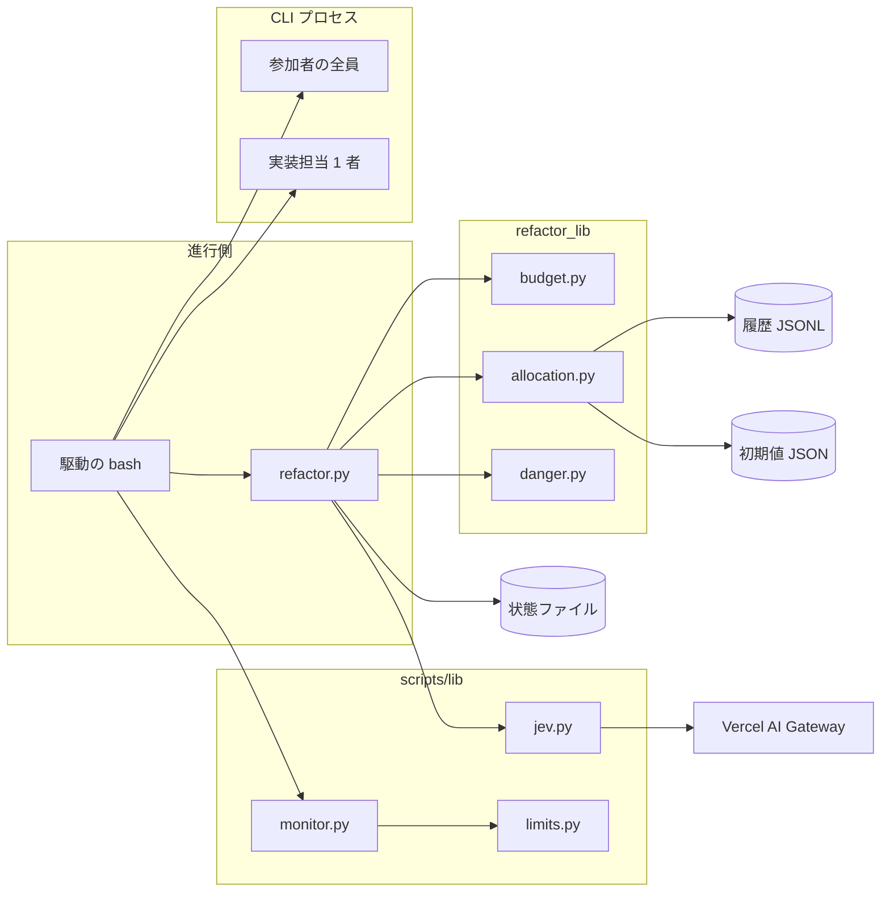
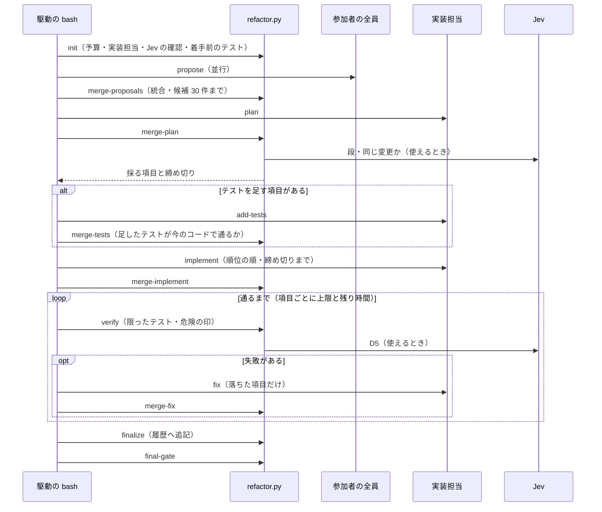
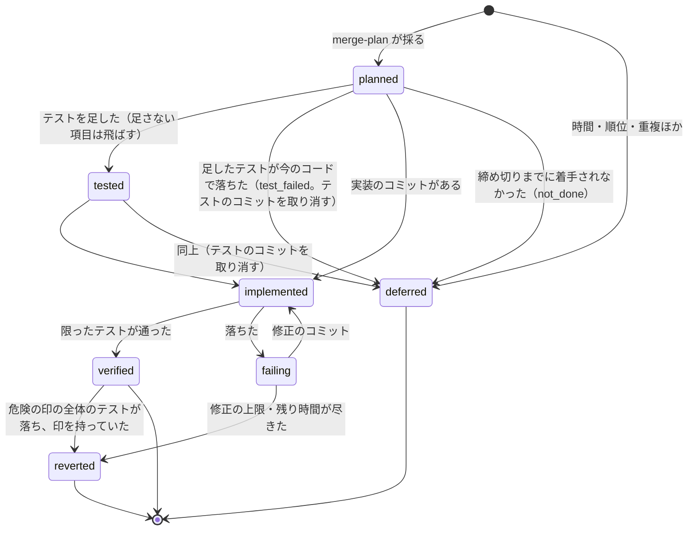

# #933: cross-refactoring を想定最大時間に収める 1 回の計画実行へ改める — 設計

要求と受け入れ条件は [issue-933-requirements.md](issue-933-requirements.md) にある。この文書は「どう作るか」だけを扱う。
決定の理由と採らなかった案は [issue-933-design-decisions.md](issue-933-design-decisions.md) にある。

## 例: #917 の実測を、変えた後の計画に当てはめる

**#917 と同じ範囲・同じ参加者（claude / codex / kiro、ホストは claude）で `--budget-minutes 60` を渡した場合の見積りである。**
値は #917 の実行の要約（`launches` の実測）から取った。

| 時点 | 所要 | 経過 |
| --- | ---: | ---: |
| `init`（着手前の全体のテスト 1 回と範囲のテスト 1 回） | 約 1.5 分 | 1.5 分 |
| 提案（3 者が並行。律速は codex の約 4.5 分） | 約 4.5 分 | 6 分 |
| 計画（実装担当 claude が 1 回。提案 30 件まで） | 見込み約 3 分 | 9 分 |

計画を取り込む時点の残りは 51 分である。ここから控えを引く。

| 控え | 値 | 出所 |
| --- | ---: | --- |
| 危険の印が立ったときの全体のテスト 1 回 | 1 分 | 同じ実行の `init` で測った全体のテストの秒 |
| 最終ゲートの全体のテスト（`--ci-check` が無いとき） | 1 分 | 同上 |
| 修正の起動 1 回分 | 5.5 分 | 配分テーブルの `fix`（初期値） |

使える時間は 51 − 7.5 = **43.5 分**である。項目 1 件の見積りは配分テーブルから引く（初期値）。

| 項目の形 | 見積り（分） |
| --- | ---: |
| 改善項目（テストを足さない） | 実装 1.3 + 検証 0.2 = 1.5 |
| 改善項目（テストを 1 件足す） | テスト 2.7 + 実装 1.3 + 検証 0.2 = 4.2 |

順位の順に積むと、テストを足す項目が半分なら 15 件前後が入る。#917 は 71 分で 25 項目（テスト 10・改善 15）だった。
**テストは改善項目の検証に要る分だけになり、改善項目の数は同じ程度で、所要は 60 分の内に収まる見込みである。**

## 機能一覧

| # | 機能 | 誰が使うか |
| --- | --- | --- |
| F1 | 想定最大時間を指定して構造改善を 1 回通す | 利用者・`development-workflow` の構造改善の工程 |
| F2 | 参加者の全員から多面的な提案を 1 度だけ集める | 進行側（`refactor.py`） |
| F3 | 提案を順位付けし、時間に収まる件数と、項目ごとに足すテスト・限ったテストを決める | 実装担当・Jev・進行側 |
| F4 | 採った項目に要るテストだけを足す | 実装担当 |
| F5 | 採った項目を順に 1 件ずつ適用する | 実装担当 |
| F6 | 項目ごとに限ったテストで検証し、通るまで直す。直らない項目を取り消す | 進行側・実装担当 |
| F7 | 危険の印が立ったときだけ全体のテストを 1 度走らせる | 進行側 |
| F8 | 実績を履歴へ追記し、次の計画の配分テーブルにする | 進行側 |
| F9 | Jev が使えるときは判断の一部を Jev に任せ、使えないときは実装担当の判断で進む | 進行側 |

## 構成要素

| 要素 | 状態 | 責務 |
| --- | --- | --- |
| `refactor.py`（入口） | 変える | サブコマンドの登録。ラウンド制のサブコマンドを外し、フェーズのサブコマンドを足す |
| `commands/setup.py` の `init` | 変える | `--budget-minutes` / `--implementer` を受ける。廃止した引数を知らせて無視する。実装担当を決め、Jev が使えるかを 1 度だけ確かめる。旧い状態ファイルで止める |
| `commands/propose.py` | 新しく作る（`apply.py` の `merge-proposals` から移す） | `merge-proposals`: 鍵（`path` + `symbol` + `smell`）が同じ提案の機械的な統合・語彙としきい値の検査・候補の上限（30 件）の切り出し |
| `commands/plan.py` | 新しく作る | `merge-plan`: 実装担当の計画を取り込み、順位を決め、見積りを付け、時間に収まる件数を選び、項目ごとの締め切りを出す |
| `commands/implement.py` | 新しく作る（`apply.py` の取り込みの検査を移す） | `merge-tests` / `merge-implement`: テストの追加と実装の結果を取り込む。コミットと項目の対応を git から検査する |
| `commands/converge.py` | 変える | `verify`: 項目ごとに限ったテストを走らせ、危険の印を立て、全体のテストを 1 度だけ走らせるかを決める。`merge-fix` / 項目の取り消し |
| `commands/report.py` | 変える | `finalize`: 履歴へ 1 行追記する。`report`: フェーズ別の所要・想定最大時間との差・見送りの理由別の件数 |
| `commands/gate.py` | 少し変える | 最終ゲート。検証の中で通った全体のテストを使い回す判定を足す |
| `refactor_lib/budget.py` | 新しく作る | 見積り・控え・件数の選び方・締め切りの計算（純粋な処理） |
| `refactor_lib/allocation.py` | 新しく作る | 履歴の読み書きと配分テーブルの集計 |
| `refactor_lib/danger.py` | 新しく作る | 危険の印の判定（git の事実から） |
| `refactor_lib/rounds.py` | 外す | ラウンドと輪番の扱い。ラウンドに依らない関数（`item_key` / `item_label` / `item_kind` / `entry_kind` / `deferred_record` と定数 `TEST` / `STRUCTURE`）は `refactor_lib/items.py` へ移す |
| `refactor_lib/items.py` | 新しく作る | 項目の鍵・表示・種類・見送りの記録（`rounds.py` から移した関数） |
| `refactor_lib/proposals.py` / `plan.py` / `measure.py` / `outbound.py` | 変える | import の元を `rounds.py` から `items.py` へ替える。`measure.py` はフェーズ別の所要を読む形へ変える |
| `data/allocation-defaults.json` | 新しく作る | 配分テーブルの初期値と、その出所（#917） |
| `prompts/propose.md` | 変える | 観点を並べた多面的な提案 |
| `prompts/plan.md` | 新しく作る | 順位付け・足すテスト・限ったテストの対象（`test_targets`） |
| `prompts/add-tests.md` | 新しく作る（`propose-tests.md` を外す） | 計画が決めたテストだけを足す |
| `prompts/implement.md` | 新しく作る（`apply.md` を外す） | 計画の順に 1 件ずつ適用し、締め切りを守る |
| `prompts/fix.md` | 変える | 失敗した項目だけを直す |
| `launch-cli.sh` | 変える | フェーズの名前（`propose` / `plan` / `add-tests` / `implement` / `fix` / `final-fix`）と雛形の対応 |
| 共通層 `scripts/lib/jev.py` | 新しく作る | Jev の呼び出し・疎通の確認・失敗時に `None` を返す |
| 共通層 `scripts/lib/limits.py` | 変える | `plan` / `add-tests` / `implement` の監視の上限を足す |
| 共通層 `scripts/lib/assignment.py` | 変える | 輪番（`impl_assign`）を外し、実装担当の選び方を足す |
| `SKILL.md` と `docs/01〜04` | 書き直す | 5 フェーズの形。駆動の bash は短くなる |
| 確定仕様 `docs/specifications/cross-refactoring-participants.md` / `cross-refactoring-round-tests-and-assess.md` / `cross-refactoring-apply-intake.md` と `docs/specifications/README.md` の索引 | 改める（`plan-to-spec` の工程） | 輪番・廃止する 3 引数・全体のテストを 2 回に限る記述・適用ラウンドの開き直しは、この変更で過去の仕様になる。現行の仕様を新しい確定仕様へ移し、旧い 3 本には「#933 で置き換えた」と先頭に書く |

### 構成要素図



### システムの文脈と配置

| 外側 | 関係 | 動く場所 |
| --- | --- | --- |
| 参加者の CLI（claude / codex / kiro、`--include agy`） | 提案は全員、計画以降は実装担当だけを起動する | 利用者の機械の別プロセス |
| git と GitHub | 作業ディレクトリ・push・改修計画のコメント | 利用者の機械と GitHub |
| Vercel AI Gateway（Jev） | 判断の一部を問う。使えなければ呼ばない | 外部。公開リポジトリに限る |
| 履歴 | 実行ごとの所要を追記する | 利用者の機械（リポジトリの外） |

### パッケージ構成

```text
plugins/ndf/skills/cross-refactoring/
├── SKILL.md
├── data/allocation-defaults.json      # 新: 初期値と出所
├── docs/01-state-and-propose.md       # 書き直す（init / 提案）
├── docs/02-plan-and-implement.md      # 02-apply-and-review.md を置き換える（計画 / テスト追加 / 実装）
├── docs/03-review-viewpoints.md
├── docs/04-verify-and-report.md       # 04-fix-and-report.md を置き換える（検証/修正 / 配分テーブル / 最終ゲート / 報告）
├── prompts/{propose,plan,add-tests,implement,fix,final-fix,judge-test-changes}.md
└── scripts/
    ├── refactor.py
    └── refactor_lib/{budget,allocation,danger}.py と commands/{setup,propose,plan,implement,converge,gate,report,assess}.py
plugins/ndf/scripts/lib/{jev,limits,assignment}.py
```

## データ構造: 状態ファイル（版 2）

置き場所は今と同じ `<work>/.cross_refactoring/cross-refactoring-rf<番号>-state.json` である。**最上位に `schema: 2` を持つ。**

| キー | 型 | 中身 |
| --- | --- | --- |
| `schema` | int | 2。無い状態ファイルは旧い形（ラウンド制） |
| `budget_minutes` | int | 想定最大時間 |
| `started_at` | 時刻 | `init` の開始（今は記録が無い） |
| `phase` | 文字列 | `propose` / `plan` / `tests` / `implement` / `verify` / `final` / `done` |
| `phases.<名前>` | `{started_at, ended_at, seconds}` | フェーズの所要。**進行側の時計で測る**（担当の申告を使わない） |
| `participants` / `runtimes` / `models` | 今と同じ | 提案の参加者 |
| `implementer` | 文字列 | 実装担当。`implementer_reason` に決め方（`named` / `host` / `first`） |
| `judge` | `{kind: "jev" \| "runtime", reason, failures}` | `kind` は Jev を使ったか。`reason` は使わなかった理由（`no_key` / `private_repo` / `disabled` / `probe_failed`）。`failures` は呼び出しの失敗の数 |
| `candidates[]` | 提案 | 統合した提案。`key`・`proposed_by[]`・`severity`・`smell`・`technique`・`path`・`symbol`・`plan` ほか |
| `plan` | オブジェクト | `available_minutes`・`reserve`（下の表）・`selected[]`・`table_source`（初期値か履歴か） |
| `items[]` | 項目 | 採った項目。下の表 |
| `deferred_items[]` | 今と同じ形 | 理由は `budget` / `rank` / `duplicate` / `vocabulary` / `threshold` / `test_failed` / `not_done` |
| `whole_test` | `{ran, flags[], status, seconds, head, reverted}` | 検証の中の全体のテスト（最大 1 回）。`reverted`（bool）は、落ちて印を持つ項目を取り消したら真になる。最終ゲートはこのキーを読み、取り消した後の HEAD で全体のテストを走らせるかを決める |
| `baseline_test` / `round_test` | 今と同じ | 着手前のテスト。`baseline_test.seconds` を控えに使う |
| `final_gate` / `plan_comment` / `pending_push` / `sync_command` | 今と同じ | 変えない |
| `history_written` | bool | 履歴へ追記したか（二重に書かない） |

`plan.reserve`:

| キー | 値 |
| --- | --- |
| `danger_whole_test` | `baseline_test.seconds`（分へ直す） |
| `final_whole_test` | `--ci-check` が無いときは `baseline_test.seconds`、あれば 0。工程の 1 つなら最終ゲートの全体のテスト、単独なら取り消しの確かめ（下の「最終ゲートとの関係」）に使う |
| `fix` | 配分テーブルの `fix`（修正の起動 1 回あたり） |

`items[]` の 1 件:

| キー | 中身 |
| --- | --- |
| `id` | `I-001` の形（ラウンドの番号を持たない） |
| `rank` | 最終の順位 |
| `kind` | 配分テーブルの種類（`structure/<technique>`）。足すテストは別に `tests` が持つ |
| `estimate` | `{test, implement, verify}`（分） |
| `tests[]` | 足すテストの置き場所（空なら足さない） |
| `test_targets` | 限ったテストの対象（パスかノード ID の並び）。進行側がこれから語の並びを組み立てる（下の「実装担当の `plan` の結果ファイル」）。空なら `--round-test`（省けば `--baseline-test`）をそのまま使う |
| `start_deadline` | 実装に着手してよい最後の時刻 |
| `status` | 下の状態遷移図 |
| `commits` | `{test, implement, fix[]}` の SHA |
| `seconds` | `{test, implement}`。起点は、そのフェーズで最初の項目なら**そのフェーズの CLI を起動した時刻**（`phases.<名前>.started_at`）、2 件目からは**同じフェーズの直前の項目のコミットの時刻**である。終点はこの項目のコミットの時刻。修正のコミットは項目の所要に入れない |
| `fix_count` | 修正の回数 |
| `danger[]` | 立った印（`D1`〜`D5`） |

## データ構造: 履歴と配分テーブル

**履歴は実行ごとに 1 行の JSONL で、リポジトリごとに 1 ファイルである。**

- 置き場所: `run_metrics.metrics_dir()` の下の `<owner>--<repo>/cross-refactoring-allocation.jsonl`
- 根の決め方は実行の要約と同じである（`NDF_METRICS_DIR` → `$XDG_STATE_HOME/ndf/metrics` → `~/.local/state/ndf/metrics`）
- `NDF_METRICS=0` でも書く。計画の材料であって計測ではないためである

1 行の形:

```json
{"schema": 1, "run": "rf917-20260923T142912Z", "at": "2026-09-23T15:40:16+09:00",
 "pr": 917, "implementer": "claude", "budget_minutes": 60, "elapsed_seconds": 3200,
 "phases": {"propose": 272, "plan": 180, "tests": 800, "implement": 900, "verify": 120},
 "kinds": {"test": {"count": 5, "seconds": 800},
           "structure/extract_method": {"count": 6, "seconds": 480}},
 "verify": {"items": 11, "seconds": 110}, "fix": {"launches": 1, "seconds": 300},
 "whole_test_seconds": 59}
```

**配分テーブルは保存しない。** 計画のたびに履歴から集計する（集計の値を別に持つと、履歴と食い違う）。

| 種類 | 1 件あたりの値 | 足りないときの代わり |
| --- | --- | --- |
| `test` | 直近 10 行の Σ秒 ÷ Σ件数 | 初期値 |
| `structure/<technique>` | 同上 | `structure/*` をまとめた値 → 初期値 |
| `verify` | 直近 10 行の Σ秒 ÷ Σ項目 | 初期値 |
| `fix` | 直近 10 行の Σ秒 ÷ Σ起動 | 初期値 |

- 「直近 10 行」は**その種類を含む行**の直近 10 行である。種類ごとに数えるため、珍しい手法も 10 回分まで遡れる
- **実装担当ごとに分けない。** 分けると標本が 3 分の 1 になる。実装担当は行に残し、分けたくなったら後で集計を変えられる
- 読めない行は飛ばす。ファイルが無い・全行が読めないときは初期値を使い、`plan.table_source` に `defaults` と残して 1 行知らせる

`data/allocation-defaults.json`（#917 の実測から。**適用の CLI の実測の秒を件数で割った値**で、担当の申告は使わない）:

| 種類 | 値（分） | 出所 |
| --- | ---: | --- |
| `test` | 2.7 | テスト整備の適用 1592 秒 ÷ 10 件 |
| `structure` | 1.3 | 構造改善の適用 1126 秒 ÷ 15 件 |
| `verify` | 0.2 | 群の検証の中央値 10.1 秒（群を項目へ読み替える） |
| `fix` | 5.5 | #917 は修正 0 回。構造改善の群の適用の中央値 330 秒で代える（未確認） |

ファイルには出所の URL（`https://github.com/devbasex/ai-plugins/pull/917#issuecomment-5796914428`）と、値を導いた式を持つ。

## 入出力の契約

### 引数

| 引数 | 変わり方 | 既定 |
| --- | --- | --- |
| `--budget-minutes N` | 新しい。1 以上の整数。それ以外は終了コード 4 | 60 |
| `--implementer NAME` | 新しい。参加者の中の 1 者。参加者に無ければ終了コード 4 | 下の決め方 |
| `--max-fix-rounds N` | 意味が変わる。**1 項目あたり**の修正の上限 | 3 |
| `--max-test-rounds` / `--max-outer-rounds` / `--max-items-per-round` | 廃止。受け取ると `⚠ <引数> は廃止しました（#933）。--budget-minutes で所要を決めます` を標準エラーへ出して無視する | — |
| そのほか（`--scope` / `--baseline-test` / `--round-test` / `--host` / `--exclude` / `--include` / `--require-all` / `--model` / `--ci-check` / `--workflow-step` / `--severity-threshold` / `--test-timeout` / `--sync-command` / `--plan-file`） | 変えない | 今と同じ |

**実装担当の決め方:** `--implementer` → ホストが参加者にいればホスト → 参加者の先頭。`init` で決めて状態へ書き、再開で変えない。

### サブコマンド

| サブコマンド | 入力 | 出力（標準出力の `KEY=VALUE`） | 終了コード |
| --- | --- | --- | --- |
| `init` | 引数 | `ID` `RUNTIMES` `RUNTIMES_CSV` `IMPL` `WORK` `TMP_DIR` ほか今と同じ。`PHASE`（再開の地点） | 0 / 4 |
| `merge-proposals` | 参加者の結果ファイル | — | 0 / 2（候補 0 件。最終ゲートへ） |
| `merge-plan` | 実装担当の `plan` の結果ファイル | `TESTS_NEEDED=0\|1` | 0 / 2（残る項目 0 件。最終ゲートへ） / 4 |
| `merge-tests` | git の範囲 | — | 0 / 2（残る項目 0 件のとき。最終ゲートへ）。足したテストが今のコードで落ちた項目は、その項目のテストのコミットを取り消して `test_failed` で見送る。計画に無いテストのコミットも取り消す（AC10） |
| `merge-implement` | git の範囲 | — | 0 / 2（残る項目 0 件。1 件も適用されなかったとき。最終ゲートへ）。コミットの無い項目は `not_done` で見送り、その項目のテストのコミットも取り消す |
| `verify` | 状態 | `VERIFY=done\|fix` | 0 / 4 |
| `merge-fix` | git の範囲 | — | 0 |
| `finalize` | 状態 | — | 0（履歴の追記に失敗しても 0。知らせるだけ） |
| `final-gate` / `merge-final-fix` / `report` / `status` / `assess` | 今と同じ | 今と同じ | 今と同じ |

外すサブコマンドは次の 7 つである。

- `start-round` / `next-apply-round` / `merge-apply` / `advance`（ラウンドと群）
- `verify-round` / `should-abandon` / `abandon-items`（`verify` と `merge-fix` へ畳む）

`merge-test-judgements` は残す。修正がテストを書き換えたときに、振る舞いの変更を含むかを判定する経路である。

### 実装担当の `plan` の結果ファイル

```json
{"items": [
  {"key": "src/a.py#Foo.run#long_method", "tier": "high",
   "tests": ["tests/test_a.py"], "test_targets": ["tests/test_a.py::TestFoo"],
   "merge_into": null, "risk": false}
]}
```

- `tier` は `high` / `medium` / `low`。候補の全件に付ける
- `merge_into` は同じ変更だと判断した相手の `key`
- **実装担当はコマンドを返さず、テストの対象（`test_targets`）だけを返す。** 限ったテストのコマンドは進行側が組み立てる。`--round-test`（省けば `--baseline-test`）を `shlex.split` で語に分け、その対象の語を `test_targets` に差し替えた語の並びを `shell=False` で走らせる。対象の語の見分けは `scope.round_test_roots` と同じ規則を使う
- `test_targets` の各要素は次をすべて満たす。1 つでも満たさなければ、その項目の対象を空として扱い、`--round-test` をそのまま使う（見送らない）
  - `--scope` のテストの置き場所の中のパスか、そのパスに `::` で続くノード ID である（`scope.round_test_roots` の検査を使い回す）
  - パスの部分が作業ディレクトリに実在する
  - シェルの構文の文字（`;` `&` `|` `$` `` ` `` `<` `>` `(` `)` 改行）と空白を含まない

### Jev の問い（`scripts/lib/jev.py`）

| 箇所 | 問いの型 | 入力 | 使い方 |
| --- | --- | --- | --- |
| 順位の段（`tier`） | `score`（`["low","medium","high"]`） | 提案の `path` / `symbol` / `smell` / `technique` / `rationale` / `plan` / 賛同した者の数 | 確信度 0.6 以上なら Jev の段、未満なら実装担当の段 |
| 同じ変更か | `boolean` | 同じ `path` + `symbol` の 2 件の提案 | 確信度 0.8 以上で真なら統合。それ以外は実装担当の `merge_into` |
| 公開の入出力が変わりうるか（`D5`） | `boolean` | 項目の提案のフィールド（上と同じ）と `git diff --stat` の行だけ | 確信度 0.7 以上で真なら印を立てる |

**Jev へ送るのは、提案のフィールドと `git diff --stat` の行だけである。** 差分の本文・ファイルの本文・テストの出力は送らない。テストの出力には秘密の値や利用者のデータが混ざりうるためで、テストの失敗の分類は Jev に問わない。

- 使える条件は次の 4 つがそろうことである
  - `AI_GATEWAY_API_KEY` がある
  - `NDF_JEV` が `0` でない
  - 対象のリポジトリが公開である（`gh repo view --json visibility` が `PUBLIC`）
  - `init` の疎通の確認（固定の `boolean` の問い 1 回、10 秒）が通る
- 呼び出しが 1 回失敗したら、その問いは実装担当の答えで決める。**進行を止めない。** 失敗の数は `judge.failures` に数える
- 鍵の値は状態・報告・ログへ書かない。`jev.py` は鍵を環境変数から読むだけで、引数で受け取らない

## 処理の流れ



**駆動の bash は繰り返しを 1 つしか持たない**（検証と修正）。今の二重の繰り返し（ラウンドと適用ラウンド）は無くなる。

### 項目の状態遷移



## 時間の決め方

`merge-plan` の時点で次を計算する（`budget.py`、純粋な処理）。

```text
経過 E        = 今 − started_at
控え R        = danger_whole_test + final_whole_test + fix
使える時間 A  = budget_minutes − E − R
項目 i の見積り c_i = (tests が空でなければ test) + structure/<technique> + verify
```

- 候補を順位の順にたどり、**入る項目は入れ、入らない項目は飛ばして次を見る**（`budget` の理由で見送る）
- 順位は `(段, 賛同した者の数, 重要度)` の降順、同じなら見積りの昇順
- 項目 i の締め切り（実装に着手してよい最後の時刻）: `started_at + budget_minutes − R − Σ_{j≤i} verify_j − implement_i`
- テストの追加の締め切りも同じ形で出し、`add-tests` の雛形に渡す
- **実行中の CLI は時間切れで止めない。** 監視の上限（`limits.py`）はそのまま歯止めとして残す

## 検証と修正

### 検証と修正の繰り返し（`verify`）

1. `implemented` の項目ごとに、HEAD で限ったテストを走らせる
2. 落ちた項目のうち、`fix_count` が上限に達したもの、または残り時間が `fix` に足りないものを取り消す（項目の単位。隣接する変更は今と同じく全件の取り消しへ退避）
3. 残りの落ちた項目があれば `VERIFY=fix` を返す（駆動が修正を 1 回起動する）
4. 落ちた項目が無くなったら危険の印を判定する。印が 1 つでもあり、`whole_test.ran` が偽なら全体のテストを 1 度走らせる
5. 全体のテストが落ちたら、印を持つ項目を新しい順に取り消し、`whole_test.reverted` を真にする。**検証の中では走らせ直さない。** 取り消した後の HEAD は最終ゲートが全体のテストで確かめる（下の「最終ゲートとの関係」）
6. `VERIFY=done` を返す

### 危険の印

| 印 | 条件 | 見るもの |
| --- | --- | --- |
| D1 | 項目のコミットが、項目の `path` と `tests[]` 以外のファイルを触った | `git show --name-only` |
| D2 | ファイルを消した・名前を変えた | `git diff --name-status` の `D` / `R` |
| D3 | 触った本番のファイルが `--scope` の外から参照されている | 拡張子を除いたファイル名と、項目の `symbol` の名前を `git grep -lw` で `--scope` の外に探す。1 件でも当たれば立てる。触ったファイルがパッケージの入口（`__init__.py` / `index.*` / `mod.rs` など、再 export を持ちうるもの）なら探さずに立てる |
| D4 | 限ったテストが触った本番のファイルを覆うと示せない | 限ったテストのファイルのどれにも、拡張子を除いたファイル名と `symbol` の名前のどちらも現れなければ立てる |
| D5 | 公開の入出力が変わりうる | Jev（使えるとき）。使えないときは実装担当の結果の `risk` |

- **D4 は、覆っていると示せたときだけ印を立てない。** 名前が限ったテストに現れない変更は、立てる側へ倒す
- **D3 は、名前が当たったときとパッケージの入口のときに立てる。** 当たらない（0 件）ときは立てない。名前の一致は、動的な読み込みや文字列で組み立てた import による参照を見落とす。この見落としは**残る危険として受け入れる**。0 件のときにも立てると、`--scope` の外に参照の無い変更でも毎回全体のテストが走り、「原則実施しない」が成り立たない。残る危険は最終ゲート（`cross-review`・継続的統合・全体のテスト）が拾う
- 言語ごとの参照の解決は持たない（決定 20）
- **D5 の `risk` は印を立てる側にだけ使う。** 担当の申告で検証を減らすことはしない（結果ファイルの申告を検証に使わない方針を保つ）
- 印は項目ごとに `items[].danger` へ、全体として走らせた理由は `whole_test.flags` へ残る

## 最終ゲートと再開

### 最終ゲートとの関係

| 起動のされ方 | 最終ゲート | 検証の中の全体のテストとの関係 |
| --- | --- | --- |
| 単独・`--ci-check` なし | `cross-review`（想定最大時間の外） | **検証の中の全体のテストが落ちて項目を取り消したとき（`whole_test.reverted`）だけ、`cross-review` の前に全体のテストを 1 度走らせる**（想定最大時間の内。控えの `final_whole_test`）。落ちたら今の最終ゲートの修正（`final-fix`）へ進む |
| `--ci-check` あり（単独・工程の 1 つ） | 継続的統合の結果 | 取り消した後の HEAD も継続的統合が確かめる |
| 工程の 1 つ・`--ci-check` なし | 全体のテスト（想定最大時間の内。控えに入れる） | **検証の中で走って通り（取り消しが無く）、その後に HEAD が生成物の同期のコミットしか進んでいなければ、走らせずに通す** |

### 再開

- 同じ `init` を打ち直すと、`schema: 2` の状態の `phase` を `PHASE` として返し、駆動は終わったフェーズを飛ばす。各 `merge-*` は今と同じく取り込み済みの印で冪等にする
- `schema` を持たず `rounds` を持つ状態で `final` が空なら、終了コード 4 で止まる。案内は「旧い版（v10.17.5 以前）で終えるか、`<状態ファイル>` を消して始め直す」の 1 行である
- 再開で `--budget-minutes` を渡すと置き換える（`resume_changes` に残る）。`--implementer` は置き換えない（通知だけ）
- **再開で参加者を作り直した結果、実装担当が参加者から外れたとき**（`--exclude` で外された・認証が通らない）は、計画のフェーズより前なら決め方を当て直し、新しい実装担当と理由を `resume_changes` に残す。計画のフェーズ以降なら終了コード 4 で止める。計画・テスト・実装を担った者が途中で替わると、見積りの前提（担当ごとの所要）と、項目とコミットの対応を読む者が食い違うためである

## 非機能の実現方式

| 大項目 | 実現方式 |
| --- | --- |
| 性能・拡張性 | 計画の時点で見積りの合計を使える時間に収める。実装の途中は締め切りで着手を止める。`init` の開始から、最終ゲートの全体のテスト（走らせたとき）の終わりまでの所要を、`report` が想定最大時間と並べて出す。`cross-review` の所要は含めない |
| 運用・保守性 | フェーズの所要は進行側の時計、項目の所要はコミットの時刻で測る（担当の申告を使わない）。履歴の行は実行の ID を持ち、初期値のファイルは出所の URL を持つ |
| 移行性 | 旧い引数は、この変更を含む版では知らせて無視し、その次の版で外す。旧い状態は読み替えずに止める |
| セキュリティ | Jev は公開リポジトリに限る。送るのは提案のフィールドと `git diff --stat` の行だけで、差分・ファイルの本文・テストの出力を送らない。鍵は環境変数からだけ読む |

## テスト設計

| 受け入れ条件 | 何で確かめるか |
| --- | --- |
| AC1〜AC3 | `init` の単体（引数の検査・廃止の知らせ・`max_fix_rounds` の意味） |
| AC4 AC6 | 偽の CLI を使う結合テスト。起動の記録（`launch-cli.sh` の呼び出し）を数える |
| AC5 | 雛形を展開した結果に観点の語彙の値が並ぶことを、`launch-cli.sh` の展開の単体で見る（文言ではなく、語彙の値の列挙を見る） |
| AC7 AC8 AC9 | `budget.py` の単体（見積り・控え・飛ばして詰める・締め切り）と `merge-plan` の単体 |
| AC10 AC11 | git を使う結合（項目に紐づかないテスト・`test_failed`・`not_done` のテストのコミットの取り消し、1 項目 = 1 コミット） |
| AC10b | 語の並びの組み立ての単体（差し替え・シェルの構文の文字・範囲の外・実在しないパスで `--round-test` に戻る）と、`shell=False` で走ることの単体 |
| AC12 | `merge-implement` の単体（コミットの無い項目が `not_done` になる）と、雛形に締め切りが渡る単体 |
| AC13 AC14 | `danger.py` の単体（D1〜D5）と `verify` の結合（全体のテストが 2 回走らない） |
| AC15 AC16 | git を使う結合（項目の単位の取り消し・隣接する変更の退避） |
| AC16b | `final-gate` の単体（`whole_test.reverted` が真で `--ci-check` が無いとき、単独起動でも全体のテストを走らせる。落ちたら `final-fix` の経路を返す） |
| AC17〜AC20 | `allocation.py` の単体（`NDF_METRICS_DIR` を一時ディレクトリへ向ける。#938 の汚染を繰り返さない） |
| AC21 | `assignment.py` の単体 |
| AC22 AC23 | `jev.py` の単体（HTTP を偽の応答へ差し替える。鍵が無い・`NDF_JEV=0`・非公開・疎通の失敗・呼び出しの失敗・確信度の足りない場合）と、`merge-proposals` / `merge-plan` / `verify` の単体（段・同じ変更か・D5 の 3 つの経路が Jev の答えと実装担当の答えのどちらでも決まる） |
| AC24 AC25 | 再開の単体（フェーズの飛ばし・旧い状態で止まる） |
| AC26 | `report` の単体 |
| AC27 AC28 | 既存のテストのうちラウンド制に依らないもの（`test_scope_*`・`test_assess`・`test_sync_*`・`test_plan_comment*` ほか）をそのまま通す |
| 性能の条件 | 実装の後、#917 と同じ範囲で手動で 1 回通す（未確認のまま残ること） |

## 未確認のまま残ること

| 項目 | 内容 | いつ決まるか |
| --- | --- | --- |
| Jev の応答の形 | #841 の本文の試験（2026-09-22）から書いた。この設計では疎通を試していない | 実装の最初に `jev.py` の疎通の確認で確かめる |
| `fix` と `verify` の初期値 | #917 は修正 0 回で標本が無い。`fix` は適用の群の中央値で代えた | 履歴が溜まれば置き換わる |
| 実装担当が締め切りを守るか | 雛形で時刻を渡すだけで、CLI を止めない | 実装の後の手動の 1 回で、締め切りの後に着手した項目の数を見る |
| 提案 30 件の上限 | 計画の入力の大きさと Jev の呼び出しの数から置いた | 手動の 1 回で、候補の数と計画の所要を見る |
| #930 との順序 | 理由は 2 つある。#930 は参加者の決め方（cross-review の既定の母集合から agy を外し、母集合に無い者の除外を無視する）を変え、この設計の参加者はそれに合わせる。あわせて #930 は `setup.py` / `report.py` / `prompts/apply.md` を触り、この設計が変えるファイルと重なる | 実装は #930 のマージの後に作業ツリーを作る |
