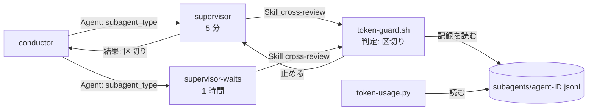
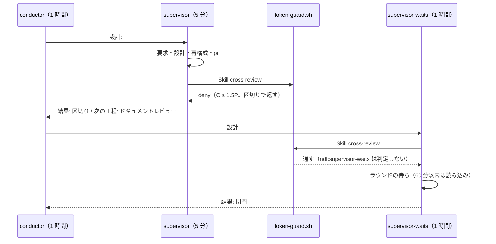
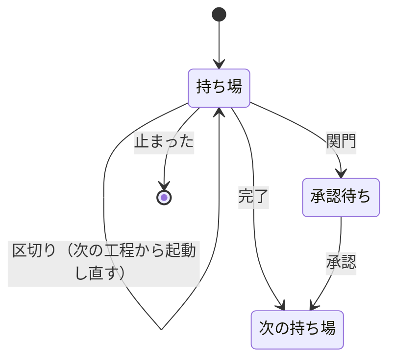

# #954: supervisor が長い待ちの後に文脈の全体を書き直す — 設計

**この文書は「どう作るか」だけを扱う。** 他の 3 つは次のとおりである。

| 文書 | 中身 |
| --- | --- |
| [issue-954-requirements.md](issue-954-requirements.md) | 要求と受け入れ条件 |
| [issue-954-design-decisions.md](issue-954-design-decisions.md) | 決定の理由と、候補の数値の比較 |
| [issue-954-design-tests.md](issue-954-design-tests.md) | テスト設計と未確認 |

## 例: 設計の持ち場を、変えた後の形で通すと

1. conductor が `設計: #954` を **`ndf:supervisor`**（寿命 5 分）で起動する
2. supervisor が要求・設計・再構成を通し、設計 Pull Request を出す。文脈は 30 万を超えている
3. supervisor が `cross-review` を起動しようとする。hook が自分の記録を読み、今の文脈が最初の
   呼び出しの文脈の 1.5 倍以上なので止める。理由の欄に区切りの返し方が出る
4. supervisor が `結果: 区切り`・`次の工程: ドキュメントレビュー` で返す
5. conductor が同じ `設計: #954` を **`ndf:supervisor-waits`**（寿命 1 時間）で起動し直す。
   起動指示の「前の持ち場の報告」に 4 の報告を入れる
6. 新しい supervisor は前提（約 43k）から `cross-review` を回す。ラウンドの待ちが 60 分以内なら、
   起きたときの文脈は読み込みで済む

## 機能一覧

| # | 機能 | 誰が使うか | 候補 |
| --- | --- | --- | --- |
| F1 | supervisor の定義を 2 つにし、待ちを抱える区間だけ寿命を 1 時間にする | conductor（起動） | 3 |
| F2 | 収束ループの前で持ち場を区切り、新しい supervisor に続けさせる | supervisor（返す）・conductor（起動し直す） | 2 |
| F3 | 区切りの条件を hook が守らせる | Claude Code | 2 |
| F4 | 待ちの後の書き直しの量を集計する | 測定（AC7〜AC9） | — |
| F5 | 待ちを drive が持ち、判断の地点で新しい文脈を起こす契約 | #870・#827 の実装 | 1 |

F1〜F4 を #954 で実装する。F5 は契約だけをこの設計に置き、実装は #870・#827 が持つ（決定 5）。

## 基準の実測

`docs/metrics/ndf-token-usage/2026-09-24.json` の `per_role` から、10.16.0 以降の supervisor を
持ち場ごとに足した。量は入力のトークン数（換算前）。「待ちの後」は直前の間隔が 5 分を超えた
書き直しで、量は書き直しの量を回数の比で按分した推定である（集計に量の列が無い。AC6 で足す）。

| 持ち場 | 起動 | 書き直し | うち待ちの後 | 待ちの後の量 | 1 回の平均 | 1 起動あたり待ちの後の量 | それ以外の書き込み |
| --- | ---: | ---: | ---: | ---: | ---: | ---: | ---: |
| 設計 | 13 | 66 | 49 | 16.29M | 333k | 1.25M | 10.40M |
| 検査 | 12 | 49 | 40 | 4.74M | 118k | 0.40M | 2.91M |
| 実装 | 16 | 11 | 9 | 2.19M | 244k | 0.14M | 4.43M |
| 取り込み | 11 | 5 | 3 | 0.41M | 137k | 0.04M | 1.77M |
| 仕上げ | 8 | 5 | 3 | 0.27M | 90k | 0.03M | 1.25M |

**待ちの後の書き直しは設計が最も多く（量で検査の 3.4 倍）、次が検査である。** どちらも収束ループ
（設計は `cross-review`、検査は `cross-refactoring` と `cross-review`）を持つ。`cross-review` は
`bg-wait.sh wait` を 1 回最長 540 秒で呼び直すため、呼び直すたびに 5 分を超えて書き直す。

## 構成要素

| 要素 | 変更 | 責務 |
| --- | --- | --- |
| `plugins/ndf/agents/supervisor.md` | 新規 | 寿命 5 分の supervisor の定義。本文は規約の正本（`agent-layers.md`）を指すだけ（全文は「supervisor の定義の作り方」） |
| `plugins/ndf/agents/supervisor-waits.md` | 新規 | 同じ本文に `experimental: { cacheTtl: 1h }` を足したもの |
| `plugins/ndf/scripts/tests/test_supervisor_agents.py` | 新規 | 2 つの定義の登録・寿命・本文の一致・道具を照らす |
| `plugins/ndf/.claude-plugin/plugin.json` | 変更 | `agents` に 2 つを足す。`description` の定義の数を直す |
| 定義の数を書いた現行の文書 | 変更 | 書き方の正本は `docs/specifications/ndf-worker-agent-and-skill-excerpts.md` の「専門エージェントの一覧に入れない」。**supervisor の 2 定義も専門の数に入れず、3 層の定義として別枠にする**（「専門 8 個と、3 層の定義 3 個（supervisor 2・worker 1）」）。直すのは正本の列挙する 5 か所（`README.md` の箇条書き・表を含む、`plugins/ndf/README.md`、`docs/ndf-plugin-reference.md`、`AGENTS.md`、`plugin.json` の `description`）と正本そのもの。発表・記事など時点の記録は変えない |
| `agent-layers.md` | 変更 | 起動指示の `subagent_type`（区間の先頭の工程で選ぶ。定義が使えないときは省く）、持ち場の報告の `結果: 区切り` と `次の工程`、conductor の受け方、supervisor の規則 11（区切り） |
| `context-window.md` | 変更 | 「切ってよい点」の後に、持ち場の中の切れ目として「区切り」を 1 節足す（4 つの切れ目と持ち場の境は変えない） |
| `waiting.md` | 変更 | 待ちの費用の節に、待ちの後の書き直しと区切り・寿命への参照を 1 段落 |
| `plugins/ndf/scripts/token-guard.sh` | 変更 | 判定「区切り」を足す（F3） |
| `scripts/token-usage.py` | 変更 | F4 の 3 つ: 列 `rewrite_tokens_after_5m`・`read_tokens_after_5m`、呼び出しの並びへの読み込みの量、`per_role` の軸 `agent_type` |
| テスト | 新規・変更 | 定義の frontmatter、hook、集計 |



## 入出力の契約

### F1: supervisor の定義

定義は 2 つで、違いは frontmatter の `name`・`description` と `experimental` だけである。作り方は次の節
「supervisor の定義の作り方」にある。

**起動指示の `subagent_type` は、その supervisor が最初に通す工程で決める。**

| 最初に通す工程 | `subagent_type` | 当たる起動 |
| --- | --- | --- |
| 構造改善・実装レビュー・ドキュメントレビュー（収束ループ） | `ndf:supervisor-waits` | 検査の持ち場の起動、区切りの後の設計・検査の起動 |
| それ以外 | `ndf:supervisor` | 設計・実装・取り込み・仕上げの持ち場の起動 |

モードで検査が構造改善を含まない（`documentation` / `light`）ときは、検査の最初の工程が実装
レビューになり、同じく `supervisor-waits` に当たる。

### supervisor の定義の作り方

#### 1. 2 つの定義の全文

`plugins/ndf/agents/worker.md` の形（frontmatter・見出し・正本を指す段落・守る規則の要約）にならう。
**守る規則の本文は写さない。** 起動指示が 11 個を渡すので、定義には正本の場所と、定義で守らせる 1 点だけを書く。

`plugins/ndf/agents/supervisor.md`:

```markdown
---
name: supervisor
description: NDF の 3 層の supervisor。1 つの持ち場（連続する工程の束）を通し、持ち場の報告で返す
---

# supervisor

NDF の 3 層（conductor → supervisor → worker）の supervisor である。conductor が起動し、
1 つの持ち場を通して `## 持ち場の報告` で返す。規約の正本は `development-workflow` の
`references/agent-layers.md` の「conductor → supervisor」にある。

**守る規則は起動指示の「守る規則」が渡す。** この定義は規則を写さない。起動指示に規則が
無いときは、正本の規則に従う。

**寿命の違う 2 つの定義があり、本文は同じである。** `supervisor` はキャッシュの寿命が 5 分で、
収束ループの工程（構造改善・実装レビュー・ドキュメントレビュー）を持ち場の途中で始めると
hook が止める。止められたら `結果: 区切り` で返す（規則 11）。`supervisor-waits` は寿命が
1 時間で、収束ループの工程から始める持ち場に使い、hook は止めない。
```

`plugins/ndf/agents/supervisor-waits.md`:

```markdown
---
name: supervisor-waits
description: NDF の 3 層の supervisor（収束ループから始める区間。キャッシュの寿命 1 時間）。持ち場を通し、持ち場の報告で返す
experimental:
  cacheTtl: 1h
---

# supervisor

NDF の 3 層（conductor → supervisor → worker）の supervisor である。conductor が起動し、
1 つの持ち場を通して `## 持ち場の報告` で返す。規約の正本は `development-workflow` の
`references/agent-layers.md` の「conductor → supervisor」にある。

**守る規則は起動指示の「守る規則」が渡す。** この定義は規則を写さない。起動指示に規則が
無いときは、正本の規則に従う。

**寿命の違う 2 つの定義があり、本文は同じである。** `supervisor` はキャッシュの寿命が 5 分で、
収束ループの工程（構造改善・実装レビュー・ドキュメントレビュー）を持ち場の途中で始めると
hook が止める。止められたら `結果: 区切り` で返す（規則 11）。`supervisor-waits` は寿命が
1 時間で、収束ループの工程から始める持ち場に使い、hook は止めない。
```

- **どちらも `tools` / `disallowedTools` を書かない。** supervisor は Skill と Agent を使う。`general-purpose` と同じ道具を持つ
- `model` は書かない（conductor と同じモデル。`agent-layers.md` の「モデルを選ぶ」）
- 本文に「5 分」「1 時間」の片方だけを書かない。2 つの本文を同じに保つため、両方の寿命を 1 段落で説明する

#### 2. 2 つの本文を同じに保つ

**手で 2 つ書き、テストで本文の一致を確かめる**（決定 12）。生成はしない。

| 検査 | 中身 |
| --- | --- |
| 本文の一致 | 2 つのファイルの frontmatter（先頭の `---` から次の `---` まで）を除いた残りが、バイト単位で等しい |
| frontmatter の差 | `name` が `supervisor` / `supervisor-waits`。`experimental.cacheTtl` は `supervisor-waits` だけが `1h` を持ち、`supervisor` は `experimental` を持たない |
| 道具 | どちらも `tools` / `disallowedTools` を持たない |

#### 3. `plugin.json` への登録と検査

`plugins/ndf/.claude-plugin/plugin.json` の `agents` の配列の、`./agents/worker.md` の前に 2 行を足す。

```json
"./agents/supervisor.md",
"./agents/supervisor-waits.md",
"./agents/worker.md"
```

検査は `plugins/ndf/scripts/tests/test_supervisor_agents.py` に置く（`test_worker_agent.py` にならう。
frontmatter の読み方も同じく、字下げの無い行だけを `key: value` として読み、`experimental` の下の
`cacheTtl` は字下げの行として別に読む）。

| テスト | 照らすもの |
| --- | --- |
| 定義が配られる | `plugin.json` の `agents` に `./agents/supervisor.md` と `./agents/supervisor-waits.md` がある |
| 寿命は片方だけ | 上の表の「frontmatter の差」 |
| 本文が同じ | 上の表の「本文の一致」 |
| 道具を絞らない | 上の表の「道具」 |

`claude plugin validate .` の終了コードも見る（AC1）。`scripts/build-runtime-plugins.sh` は触らない。
agy へは `dev.agy/agents -> ../agents` の symlink で届き、生成する物が無い（決定 11）。

#### 4. 定義が使えないとき

**3 層は Claude Code だけで動く。** conductor が `Agent` ツールで supervisor を起動する形で、Codex / Kiro /
agy の側に 3 層の起動は無い。

| 場面 | 何が起きるか | 扱い |
| --- | --- | --- |
| Claude Code が 2.1.248 より前 | `experimental` を読まず、`supervisor-waits` も寿命 5 分で動く | 何もしない。hook は `supervisor-waits` を区切らないので、その区間は今と同じ費用になる（損はしない） |
| 手元の NDF が古く、`ndf:supervisor` / `ndf:supervisor-waits` が無い | 知らない `subagent_type` で `Agent` が失敗する | conductor は、起動の前に自分の会話の「使えるエージェントの一覧」に `ndf:supervisor` があるかを見る。**無ければ `subagent_type` を省いて起動する**（`general-purpose`。今と同じ動き）。一覧にあっても `Agent` が失敗したら、同じ起動を `subagent_type` を省いて 1 度だけやり直す |
| 利用枠を超えて usage credits に入った | frontmatter の `1h` が無視され、5 分になる | 何もしない。損はしない。測定で 1 時間の区間に 5 分の書き込みが出たら、この場合と読む（U4） |
| Codex / Kiro | 定義は配られない（Kiro は `.kiro/agents/ndf.json` を雛形から作り、`agents/*.md` を写さない。Codex には配る経路が無い） | 何もしない |
| agy | `dev.agy/agents` の symlink で 2 つの定義が届き、公開エージェントが 9 から 11 に増える | 受け入れる（決定 11）。agy に 3 層の起動は無く、定義は起動されない限り何もしない |

**`general-purpose` へ落ちたときは区切りも働かない。** hook は入力の `agent_type` が `ndf:supervisor` の
ときだけ判定する（F3）。そのため、落ちた supervisor は今と同じ形で最後まで通す。

#### 5. 1 時間が効いたかを確かめる（U1）

**会話の記録の `usage.cache_creation` の 2 つの区分で見る。** 呼び出しごとに
`ephemeral_5m_input_tokens` と `ephemeral_1h_input_tokens` が分かれて記録される。

| 見る場所 | 1 時間が効いたとき | 効いていないとき |
| --- | --- | --- |
| 実機の 1 回（AC3）: `<記録のディレクトリ>/<セッション>/subagents/agent-<ID>.jsonl` の assistant 行 | `supervisor-waits` の起動で `ephemeral_1h_input_tokens` > 0、`ephemeral_5m_input_tokens` = 0 | `ephemeral_1h_input_tokens` がすべて 0 |
| 配布の後（AC7）: `token-usage.py --format json` の `per_role` | `agent_type` が `ndf:supervisor-waits` の行で `w1h` > 0、`w5` = 0 | 同じ行で `w1h` = 0 |

`w5` / `w1h` は今の集計にある列で、`cache_creation` の 2 つの区分をそのまま足したものである。
`agent_type` の軸は F4 で足す。**`ndf:supervisor` の行は `w1h` = 0 で、`w5` だけを持つ**ことも同時に見る。
両方の行で `w1h` > 0 なら、設定か環境変数で寿命が一括で変えられている。

AC3 の実機の 1 回は、`env -i` と一時の HOME で隔離した claude に `--plugin-dir` で作業ツリーの NDF を渡し、
`ndf:supervisor-waits` と `ndf:supervisor` のサブエージェントを 1 本ずつ起動して記録を読む。
同じ 1 回で、hook の入力の `agent_type` の値（U2）と、meta の `agentType` の値も控える。

### F2: 持ち場の報告に足すもの

| 項目 | 値 | 空のとき |
| --- | --- | --- |
| 結果 | `完了` / `関門` / `止まった` / **`区切り`** | 空にしない |
| 次の持ち場 | `区切り` のときは**同じ持ち場の名前** | — |
| **次の工程** | 工程表の行名。`区切り` のときだけ書く | `無し` |

conductor の受け方（`agent-layers.md` の表へ 1 行足す）:

| 見出しの有無 | `結果` | conductor の動き |
| --- | --- | --- |
| ある | `区切り` | 同じ持ち場を、`次の工程` から通す supervisor として起動し直す。`subagent_type` は上の表で選び、起動指示の「持ち場」の工程の一覧は `次の工程` から写す。「前の持ち場の報告」に区切りの報告を入れる。関門を問わない。**同じ `次の工程` の `区切り` が続けて 2 回返ったら、`止まった` と同じに扱う**（区切りの後の supervisor が最初の Skill の前に文脈を伸ばすと、区切りが際限なく続くため） |

supervisor の規則に 11 を足す:

> 11. 収束ループの工程（構造改善・実装レビュー・ドキュメントレビュー）の Skill を起動して hook に
>     止められたら、同じ起動をやり直さずに `結果: 区切り`・`次の工程: <その工程>` で返す。起動の前に
>     済ませること（Pull Request を出す・進行を記録する）は、起動の前に済ませておく

**区切るかを supervisor に判断させない。** 規則 11 は hook の判定（F3）に従うだけで、自分から区切らない。
文脈が短い（C < 1.5P）ときは hook が通し、そのまま続ける。hook の無いランタイムでは区切らない。

**区切りは持ち場の語彙を増やさない。** `description` は同じ `<持ち場>: <課題>` のままで、
測定（`skill-stats --agents`・`token-usage.py`）の持ち場の判定は変わらない。「持ち場の一覧」では、
区切りの後の起動を別の行にする（同じ持ち場を工程の途中から起動し直した行）。

### F3: hook の判定「区切り」

`token-guard.sh` の PreToolUse `Skill` に判定を 1 つ足す。**`Skill` のとき、区切りの判定を今の `guard_context` より先に、
`NDF_CONTEXT_GUARD` とは独立に呼ぶ。** `guard_context` は `agent_id` があると抜けるので、その中や後ろに置くと
supervisor の中で一度も走らない。区切りの判定が止めなければ、今のとおり `guard_context` へ進む。

**`ndf:supervisor-waits` は対象にしない。** 1 時間の区間では区切りが損になる（決定 4）。

**判定は安い順に行い、外れた時点で抜ける。** 順序は `NDF_SUPERVISOR_CUT_GUARD` → Skill の名前 → `agent_id` →
入力の `agent_type` → P と C である。対象外の Skill（`/ndf:fix` など）では記録を読まない。meta のファイルと
親の記録は読まない。

| 項目 | 値 |
| --- | --- |
| 対象 | 入力に `agent_id` があり、その supervisor の定義の名前（下の「定義の名前」）が `ndf:supervisor`（寿命 5 分）で、Skill の名前が `cross-review` / `cross-refactoring`（`ndf:` の有無を問わない） |
| 定義の名前 | hook の入力の `agent_type`。サブエージェントの中の PreToolUse の入力には `agent_id` と `agent_type` が付き、本体の入力には付かない（#829 の実測、Claude Code 2.1.280。`issues/old/milestone-26-token-waits/issue-829-830-implementation-plan.md`）。無ければ判定しない |
| 読む記録 | **supervisor 自身の記録** `${transcript_path%.jsonl}/subagents/agent-<agent_id>.jsonl`。入力の `transcript_path` はサブエージェントの中でも親（conductor）の記録を指すので、そのまま読まない（`token-guard.sh` の既存の注記、`statusline.sh` の組み立てと同じ） |
| P | 読む記録の**先頭から**最初の assistant 呼び出しを探し、その文脈（`input + cache_read + cache_creation`）を取る。既存の `context_tokens()` は末尾 200 行だけを読んで最後の呼び出しを返すので、P には使えない。先頭から読む走査を別に持つ |
| C | 読む記録の最後の assistant 呼び出しの文脈 |
| 止める条件 | `C ≥ 比 × P`。比の既定は 1.5（決定 4） |
| 止め方 | `permissionDecision: deny`。理由の欄に規則 11 の返し方（`結果: 区切り`・`次の工程`）を出す |
| 止め続ける | **条件を満たす間は、同じ起動を何度でも止める。** conductor の判定の「1 度だけ通す」は持たない。supervisor の下には人がおらず、やり直すだけで越えられると、区切るかが LLM の裁量に戻るためである（中継の子の conductor と同じ扱い）。控えのファイルも持たない |
| 止めない | `agent_id` が無い（conductor）・定義の名前が `ndf:supervisor` でない（`ndf:supervisor-waits`・worker・`general-purpose`・取れない）・記録が読めない・P か C が読めない |
| 変える | `NDF_SUPERVISOR_CUT_RATIO`（既定 1.5）。`NDF_SUPERVISOR_CUT_GUARD=0` でこの判定を無効にする |

**定義の名前で見分けるので、`subagent_type` を省いて起動した supervisor（conductor が古い起動の形を使った場合）は
止めない。** その supervisor は区切らずに続ける（今と同じ費用）。

### F4: 集計の列

`token-usage.py` の `per_role` と `external` に `rewrite_tokens_after_5m`（直前の間隔が 5 分を超えた
書き直しの量の合計）を足す。md の「持ち場ごとの呼び出しとキャッシュ」の表に列を 1 つ足す。
間隔のしきい値は今の `rewrites_after_5m` と同じ（`CACHE_5M = 300`）。

**量と間隔を呼び出しの単位で対応づける。** 今の集計は書き直しの量を `rewrite_tokens` の合計へ、間隔を
`gaps` の並びへ別々に積み、`rewrites_after_5m` は `gaps` だけから数える。そのため、後から量を間隔で分けられない。
構造を次のとおり変える。

| 箇所 | 今 | 変えた後 |
| --- | --- | --- |
| 呼び出しの並び（`scan_file` が `record_calls` へ渡す） | （時刻, 文脈, 書き込み）の 3 つ | （時刻, 文脈, 書き込み, 読み込み）の 4 つ。読み込みは `cache_read_input_tokens`。並びを作る箇所をすべて直す |
| 直前の間隔 | `is_rewrite` の分岐の中でだけ求める | 2 回目以降のすべての呼び出しで求める |
| 書き直しの呼び出し | 量を `rewrite_tokens` へ足す | 加えて、間隔が `CACHE_5M` を超えれば `rewrite_tokens_after_5m` へ足す |
| 書き直しでない呼び出し | 何もしない | 間隔が `CACHE_5M` を超えれば、読み込みの量を `read_tokens_after_5m` へ足す |
| 合算（`Usage.add()`） | 足すフィールドをリテラルで列挙する（`rewrite_tokens` まで） | 2 つのカウンタを列挙に足す。足さないと、会話をまたいで合算した `per_role` / `external` で 0 に落ちる |
| 出力（`call_stats()` と `render_md` の `per_role` / `external` の表） | `rewrite_tokens` も列に出さない | 2 つのカウンタを返り値と表の列に足す |

時刻を欠く呼び出し（`rewrites_untimed` に数えるもの）は、どちらのカウンタにも足さない。

**定義の名前を集計の軸に足す。** 設計の持ち場では前半（5 分）と区切りの後（1 時間）が同じ `description`
（`設計: #954`）を持つので、今の `per_role` では同じ行に混ざり、AC9 が区間ごとに計算できない。`per_role` の
鍵に `agent_type` を足し、md の表にも列を足す。集計は hook の入力を持たないので、値は記録から引く。
`subagents/agent-<ID>.meta.json` の `agentType` が `ndf:` で始まればその値、そうでなければ meta の `toolUseId` を
親の記録から探し、その `Agent` 呼び出しの `input.subagent_type` を使う。どちらも取れなければ `-` にする。

**あわせて `read_tokens_after_5m`（直前の間隔が 5 分を超えた呼び出しの読み込みの量の合計）を足す。** 1 時間の区間では
5 分を超える待ちの後の呼び出しが読み込みになり、`is_rewrite` に当たらない。`rewrite_tokens_after_5m` だけでは、
1 時間にしたことで書き直しを免れた量が見えず、AC9 の再計算が必ず「満たさない」になる。AC9 の得の側は、
1 時間の区間では `read_tokens_after_5m` から、5 分の区間では `rewrite_tokens_after_5m` から計算する。

### F5: 候補 1 の契約（#870・#827 が実装する）

**待ちを持つのは drive で、drive を起動するのは conductor である。** conductor は寿命 1 時間で、
文脈が supervisor より小さい。drive の待ちの間、LLM は誰も文脈を抱えない。

```bash
drive <PR> [init の引数] [--on-pause <起こす側>]
# --on-pause なし: LLM の要る地点で止まり、1 行の JSON を出して終わる（#870 の形）
#   {"pause":"fix","prompt_file":"...","result_file":"...","round":3}
# --on-pause あり: 止まる代わりに <起こす側> を pause の種類とファイルを引数に起動し、
#   result_file ができたら続ける。起こす側が 0 以外で終わった pause だけ、止まって JSON を出す
```

| pause の種類（#870） | 起こす相手 | 前提 |
| --- | --- | --- |
| `fix` / `sweep` | CLI の worker（`claude -p`、道具は Read・Edit・Bash。#760・#859） | 修正の抜粋と PR 固有の穴埋め |
| rotate の title・body / 振動の裁定 | 最小構成の `claude -p`（#827 の 7.3k） | 規則の抜粋と結果ファイル |
| 収束しない・範囲外の課題が要る・最終ゲートで落ちた | 起こさない（止まって JSON を出す） | conductor が supervisor を起動し、JSON を渡す |

持ち場の報告には `待ち`（drive のコマンド 1 行。`無し` が既定）を足す。conductor の動きは次の 2 段である。

1. `結果: 区切り` で `待ち` があれば、そのコマンドを `run_in_background` で起動する
2. 完了の通知で `次の工程` の supervisor を起動する。「前の持ち場の報告」に drive の結果ファイルのパスを添える

**`待ち` の項目は drive ができた時点で #870 が足す。** #954 では足さない（使う相手が無い）。

## スクリプトにする範囲

収束ループの工程で supervisor が今している仕事を、器ごとに分けた。器の名前は
`work-vessels.md` の表のもの。

| 仕事 | 今 | #954 の後（つなぎ） | 候補 1 の後（#870・#827） |
| --- | --- | --- | --- |
| レビュー担当・提案者の起動、監視、取り込み、根拠の検証、反証 | スクリプト（supervisor が 1 段ずつ呼ぶ） | 同じ | スクリプト（drive が続けて呼ぶ） |
| 待ち | supervisor が `bg-wait.sh wait` を呼び直す | 同じ。寿命 1 時間の supervisor が呼び直す | drive の中。LLM は待たない |
| 収束の判定・上限の打ち切り | スクリプト（`state.py judge` の終了コード）を supervisor が読む | 同じ | drive が読む |
| 区切るかの判定 | — | hook（比の規則） | drive の pause の種類 |
| 指摘の修正・最終スイープ | worker（サブエージェント） | 同じ | CLI の worker |
| rotate の title・body、振動の裁定 | supervisor | 同じ | 最小構成の `claude -p` |
| 範囲外の起票・収束しないときの判断・持ち場の報告 | supervisor | 同じ | supervisor（drive が止まったときと、drive の後の区間） |
| `--scope` / `--baseline-test` / `--sync-command` を決める | supervisor | 同じ | supervisor（drive の前の区間） |
| 進行の記録 | supervisor が記録のコマンドを打つ | 同じ | 同じ（drive は記録を呼ばない。#870） |

**LLM に残るのは、表の最後の 3 行の判断と、修正・裁定の中身だけである。** 待ち・判定・起動の組み立ては
すべてスクリプトが持つ。

## 処理の流れ



supervisor の結果の遷移（`区切り` は同じ持ち場へ戻る）:



## 既存の規則への当てはめ

`結果` の値の集合へ `区切り` を、`subagent_type` の値へ 2 つの定義を足す。そこで、今の値を前提にした
規則を集めて当てはめた。当てはまらないものだけを挙げる。

| 集め方 | 範囲 |
| --- | --- |
| 検索した語 | `結果`・`完了`・`関門`・`止まった`・`general-purpose` |
| 検索した文書 | `agent-layers.md`・`SKILL.md`・`context-window.md`・`relay.md`・`waiting.md`・`docs/specifications/ndf-agent-layers-unattended-run.md` |
| 検索したスクリプト | `scripts/` の `.py` / `.sh`。`結果` を読むものは無い |

| 規則 | どこ | 変える内容 |
| --- | --- | --- |
| conductor の受け方の表が 3 値だけを扱う | `agent-layers.md`「持ち場の報告」 | `区切り` の行を足す（F2） |
| `次の持ち場` は「持ち場の語彙のどれか」で、同じ持ち場を想定していない | 同じ表 | `区切り` のときは同じ持ち場と書く |
| 起動指示の `subagent_type` は「省く（`general-purpose`）」 | `agent-layers.md`「conductor → supervisor」 | F1 の表へ置き換える |
| 切れ目は 4 つで、それぞれが持ち場の境になる（`agent-layers.md` の「切れ目 → 持ち場の境」の表）。持ち場の中で切る点を想定していない | `context-window.md`「切ってよい点は 4 つある」 | 4 つの切れ目は変えない。**区切りを持ち場の中の切れ目として別の節に置く。** 持ち場の境にならないので、`agent-layers.md` の表と `token-guard-stages.txt` の正（`docs/specifications/ndf-token-waits-and-context-cut.md`）は変えない |
| 中断の点検の手順 3 は「`最後に記録した工程` の頭から、同じ持ち場の名前で起動し直す」で、`subagent_type` を言わない | `agent-layers.md`「conductor の中断の点検」 | 起動し直すときも F1 の表で選ぶ、と足す |
| 「落ちた層ごとの割り当て」の supervisor の行も「`最後に記録した工程` の頭から新しい supervisor」で、`subagent_type` を言わない | `agent-layers.md`「落ちた層ごとの割り当て」 | 同じく F1 の表で選ぶ、と足す |
| 起動指示の「持ち場」は持ち場の表から全工程を写す | `agent-layers.md`「conductor → supervisor」の必須項目 | `区切り` の後の起動では `次の工程` から写す |
| `prompt` の中身は「9 項目と、守る規則 10 個」 | 同じ節の引数の表 | 規則 11 を足すので 11 個にする |
| 確定仕様の起動の指示は「守る規則 10 個」「`subagent_type` と `model` は省く」 | `docs/specifications/ndf-agent-layers-unattended-run.md`「起動の指示」 | 「規則 11 個・`subagent_type` は F1 の表で選ぶ」へ直す |
| `plugins/ndf/agents/` は `dev.agy/agents` から参照され、agy にも同じ定義が配られる | `plugins/ndf/dev.agy/agents -> ../agents` | 変えない。agy へも 2 つの定義が届く（決定 11） |
| 測定の層の判定は `spawnDepth` と `description` で、`agentType` を見ない | `token-usage.py` | `per_role` の鍵に `agent_type` を足す（F4）。持ち場の判定（`description` の先頭語）は変えない |

## 非機能

**費用が下がらないときに戻せること。** 1 時間の寿命は定義の 1 行で、区切りの hook は環境変数で
止められる。AC9 の再計算で損益分岐を満たさない区間は、起動の表で `ndf:supervisor` へ戻す。
