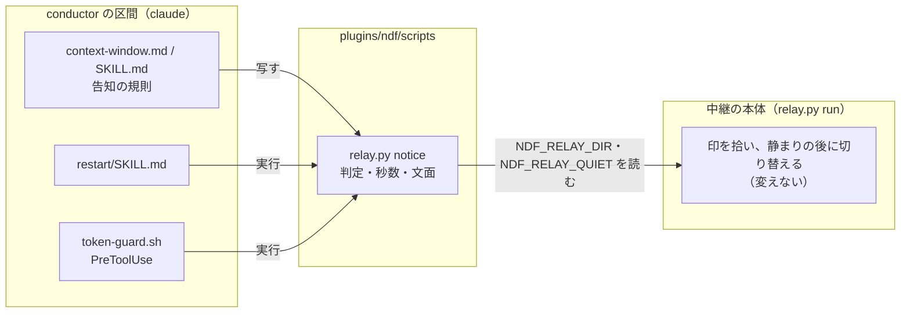
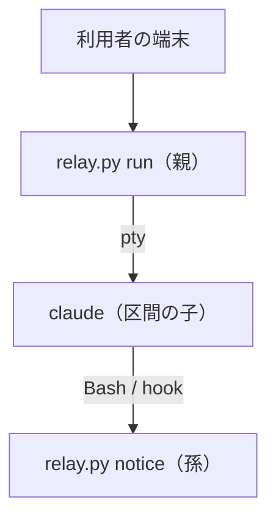
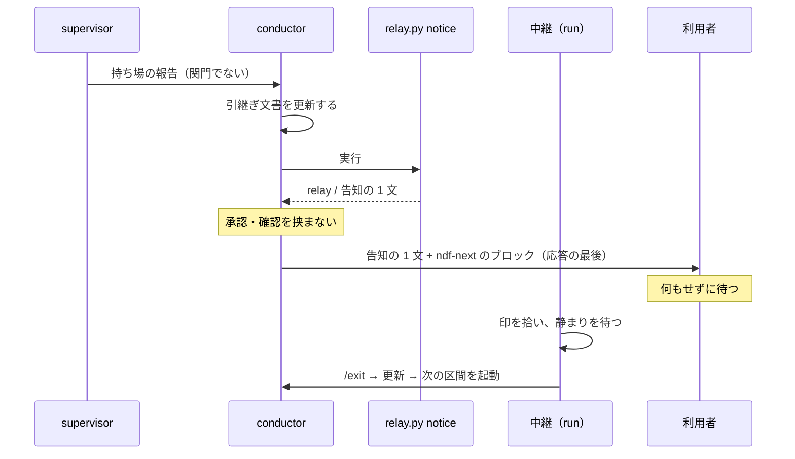

# #980: 中継の下の区間の切れ目で、利用者に「操作せずに待つ」と告げる

**中継（`relay.py`）の下で conductor が `ndf-next` のブロックを出すとき、最後の告知を
「約 N 秒後に自動で新しい会話へ切り替わる。キー入力やスクロールをせずに、そのまま待つ」に固定する。**
N は静まりの秒数（`NDF_RELAY_QUIET`、既定 5）である。
文面と秒数はスクリプト（`relay.py notice`）が出し、conductor はそれを写すだけにする。
あわせて、区間の切れ目の再起動は関門ではないと定め、切り替えの前に「再起動してよいか」を
尋ねない。

## 具体例

2026-09-24 の devbase#270 の作業で起きた（ndf 10.17.7、`NDF_RELAY_QUIET` の既定 15 秒）。区間 2 の
conductor は上限で止められた後、最後の応答を次のように締めた。

````text
新しい会話で続きから始めるには、次の 1 行を使ってください。

```ndf-next
/goal /ndf:development-workflow #270
```
````

利用者はこれを手順と読み、29 秒後に `/ndf:restart /goal /ndf:development-workflow #270` を
手で入力した。入力で応答が再開したため最初の印は無効になり（`replied_after`）、`/ndf:restart`
が出し直したブロックで 16 秒後に切り替わった。**自動で進むはずの切れ目で人に操作させ、
30 秒余り余計に掛かった。**

この設計の後は、同じ場面の最後の応答が次のようになる（静まりが既定の 5 秒のとき）。

````text
約 5 秒後に自動で新しい会話へ切り替わる。キー入力やスクロールをせずに、そのまま待つ
（切り替わらずに ndf-relay: で始まる 1 行が出たら、その案内に従う）

```ndf-next
/goal /ndf:development-workflow #270
```
````

## 要求

### 依頼（原文）

> 中継の下（`NDF_RELAY_DIR` がある）では、最後の告知を「約 N 秒後に自動で新しい会話へ切り替わる。
> キー入力やスクロールをせず、そのまま待つ」という趣旨に固定する。N は静まりの秒数
> （`NDF_RELAY_QUIET`）に切り替えの時間を足した値。中継の外では今の「次の 1 行を新しい会話へ
> 貼り付ける」のままにする。（#980 の「直し方の案」）

conductor からの補足（利用者の方針、2026-09-24）:

> 中継（relay）の下の区間の切れ目の再起動は、利用者の承認を求めない。conductor は引き継ぎ文書を
> 更新して ndf-next を出し、そのまま切り替えさせる。承認を求めるのは関門 2 つ（設計 PR のマージ・
> 本番の系へ届く操作）だけ。
>
> 「どこまでスクリプトにできるか」を決定の記録に残す（利用者の方針: 判断の要らない手順は
> scripts/ へ）

**依頼の案から変えたこと:** N に切り替えの時間を足さず、静まりの秒数そのものにする（2026-09-24、利用者の指示
「切り替え時間の考慮は不要。余白に余白を足さない」。決定 5）。

### 目的

- 中継の下の区間の切れ目で、人の入力を要らなくする。中継を入れた目的（人の入力を関門の答えだけに
  する）を切れ目でも果たす

### 前提

- 前提 1: 静まりの既定は 10.17.8 で 5 秒である（`relay.md` の「上限」）。10.17.7 の 15 秒には
  合わせない
- 前提 2: conductor の区間の子は、中継が渡した環境をそのまま継ぐ。`NDF_RELAY_DIR` と、利用者が設定して
  いれば `NDF_RELAY_QUIET` である（`relay.py` の `child_env` は環境を写す）

### 対象範囲

含む:

- 中継の下・外で、区間の切れ目の最後の告知に何を書くか（conductor の 4 つの切れ目・文脈量の
  hook に止められたとき・`/ndf:restart`）
- 告知の文面と秒数を出すスクリプト
- 区間の切れ目の再起動が関門ではないことの明記

含まない:

- 静まりの数え方（端末のどの入力でも数え直す）。人が端末の前にいる印として今のまま残す（決定 4）
- 中継が待っている間に端末へ 1 行を出すこと（決定 3）
- 関門の前に会話を切らない規則（`context-window.md` の現行の規則のまま）
- Codex / Kiro / agy（中継は Claude Code だけ）

## 設計

### 機能一覧

| # | 機能 | 誰が使うか |
| --- | --- | --- |
| F1 | 中継の下かを判定し、告知の 1 行を出す（`relay.py notice`） | conductor・`restart` の Skill・`token-guard.sh` |
| F2 | 区間の切れ目の告知と、承認を挟まない規則 | conductor（`context-window.md` / `SKILL.md`） |
| F3 | 上限で止めたときの拒否文に告知を載せる | `token-guard.sh` |
| F4 | `/ndf:restart` の告知 | 利用者が打つ `/ndf:restart` |

### 構成要素

| 要素 | 変更 | 責務 |
| --- | --- | --- |
| `plugins/ndf/scripts/relay.py` | 副命令 `notice` を足す | 判定（`is-child` と同じ条件）・秒数の計算・告知の文面。**文面の唯一の定義** |
| `plugins/ndf/skills/development-workflow/references/context-window.md` | 「新しい会話で戻す」に 2 項目 | 告知は `notice` の 2 行目で書く。切れ目では承認を挟まない |
| `plugins/ndf/skills/development-workflow/SKILL.md` | 「人手の承認を求める関門」に 1 文。区間の切れ目の段落に `notice` の呼び方 | 区間の切れ目の再起動は関門ではない。`'${CLAUDE_PLUGIN_ROOT}/scripts/relay.py'` を置き、Claude Code が置き換えた絶対パスで `notice` を呼ばせる |
| `plugins/ndf/scripts/token-guard.sh` | 中継の下の拒否文 | `notice` の 2 行目を埋め込み、確認を挟まないと書く |
| `plugins/ndf/skills/restart/SKILL.md` | 冒頭の例・手順 1・手順 3 の表 | 判定を `notice` に替え、2 行目を示す |
| `plugins/ndf/scripts/tests/test_relay.py` | テストを足す | `notice` の出力と終了コード |
| `plugins/ndf/scripts/tests/test_token_guard.py` | テストを足す | 中継の下の拒否文に告知が入る |



図の最後の辺は、`notice` が中継の本体と同じ環境変数と作業ディレクトリ（`child.pid`・pid の
ファイル）を読むことを表す。中継の本体へ書くものは無い。テストの 2 ファイルは図に含めない。

### システムの文脈と配置

変わるのは claude の区間の中で動くものだけである。中継の本体は区間の外の親プロセスで動き、
この変更で触らない。



### パッケージ構成

```text
plugins/ndf/
├── scripts/
│   ├── relay.py              # 副命令 notice を足す
│   ├── token-guard.sh        # 中継の下の拒否文
│   └── tests/
│       ├── test_relay.py
│       └── test_token_guard.py
└── skills/
    ├── development-workflow/
    │   ├── SKILL.md          # 関門の節に 1 文
    │   └── references/context-window.md
    └── restart/SKILL.md
```

### 入出力の契約（`relay.py notice`）

| 項目 | 内容 |
| --- | --- |
| 呼び方 | `python3 <scripts>/relay.py notice`（引数なし） |
| 読むもの | `NDF_RELAY_DIR`、`NDF_RELAY_QUIET`、中継の作業ディレクトリ（`is-child` と同じ） |
| 標準出力 1 行目 | `relay` か `outside` |
| 標準出力 2 行目 | 告知の 1 文（下の表） |
| 終了コード | 常に 0。判定の失敗（例外）は `outside` として出す |

| 1 行目 | 2 行目 |
| --- | --- |
| `relay` | `約 {N} 秒後に自動で新しい会話へ切り替わる。キー入力やスクロールをせずに、そのまま待つ（切り替わらずに ndf-relay: で始まる 1 行が出たら、その案内に従う）` |
| `outside` | `/exit してから claude を起動し、下の中身を最初の入力として貼り付ける（/ndf:install-wrapper で中継を入れると自動になる）` |
| `relay`（N = 0） | `まもなく自動で新しい会話へ切り替わる。キー入力やスクロールをせずに、そのまま待つ（切り替わらずに ndf-relay: で始まる 1 行が出たら、その案内に従う）` |
| `relay`（`NDF_RELAY_QUIET=inf`） | `NDF_RELAY_QUIET が有限でないため、中継は自動で切り替えない。/exit してから claude を起動し、下の中身を最初の入力として貼り付ける` |

`N = round(q)`（Python の `round`。最も近い整数で、ちょうど半分は偶数へ丸める。切り上げない）。
N が 0 のときは「約 0 秒後」と書かず、上の表の N = 0 の行を出す。`q` は `quiet` が有限で正ならその値、負か `nan` なら 0 とする（`inf` は下の表で別に扱う）。
`max(quiet, 0)` は `nan` を返しうるため使わず、`round` の前に `nan` を 0 へ落とす。`quiet` は中継本体と同じ `_num("NDF_RELAY_QUIET", 5)` で読む。数でなければ 5 になる。
負の値は丸めない。中継本体は負の静まりを待たずに通すため、待つ秒数を 0 として数え、告知と実際の待ちを
そろえる。切り替えの時間は足さない（決定 5）。

**有限でない値も中継本体の待ちに合わせる。** `_num` は `nan` と `inf` も受け付ける。

| `NDF_RELAY_QUIET` | 中継本体の待ち | `notice` の出力 |
| --- | --- | --- |
| `nan` | 待たずに切り替える（`経過 < nan` が偽） | `relay`。静まりを 0 として数える（N = 0 の行） |
| `-inf` | 待たずに切り替える（`経過 < -inf` が偽） | 負の値と同じ。`relay`、N = 0 の行 |
| `inf` | 切り替えない | 1 行目は `relay` のまま、2 行目は上の表の `inf` の行 |

**1 行目は中継の直接の子かだけを表し、`is-child` の判定と常に一致させる。** 自動で切り替わるかは 2 行目が
表す。1 行目を切り替えの可否で変えると、`token-guard.sh` が中継の子を外と読み、上限を超えた起動を 1 度
通してしまう（「上限を超えたら hook が止める」の中継の下の規則が外れる）。

### 処理の流れ



文脈量の hook に止められたときは、hook の拒否文が同じ告知を持つため、conductor は `notice` を
実行し直さずに写してよい。`/ndf:restart` は手順 1 で `notice` を実行する。

### 非機能の実現方式

| 条件 | 実現方式 |
| --- | --- |
| 定義を 1 箇所に置く | 文面と秒数は `relay.py` の関数 1 つが作る。Skill の文書は文面を写さず「2 行目を示す」とだけ書く。例外は `relay.py` を呼べないときの外の文面 2 つ（`restart` の AC7、`context-window.md` の AC4）。`token-guard.sh` は実行結果を埋め込む |
| hook の追加の起動を 1 回まで | 中継の下の判定で既に呼んでいる `relay.py is-child` を `relay.py notice` に置き換え、1 行目で判定、2 行目を拒否文へ使う。起動の数は今と同じ |

## 決定の記録

### 決定 1: 告知の文面と秒数は `relay.py notice` が出し、LLM はそれを写す

判定（中継の直接の子か）・秒数の計算・文面の選択は、どれも判断が要らない。conductor に書かせると
区間ごとに言い回しが揺れ、#980 のように手順と読める文になる。スクリプトが出せば、Skill と hook の
3 箇所が同じ文を示す。

文面を `context-window.md` に書き、conductor に秒数を計算させる案は採らない。秒数は環境変数に依り、
文書に書いた値は利用者の設定とずれる。

**どこまでスクリプトにできるか:** 判定・秒数・文面の 3 つはスクリプトにする。**LLM に残るのは、
いまが切れ目か（持ち場の報告を受けた・関門の承認の後か・hook に止められたか）と、再開用の
コマンドの中身（課題番号・引継ぎ文書）の 2 つである。** 前者は報告の `結果` を読む判断、後者は
会話の中の状態から組み立てる判断で、どちらも `/goal` の目標や引継ぎ文書の名指しに依る。
告知とブロックを 1 回の出力にまとめて出すスクリプトは作らない。再開用のコマンドを引数で渡すと、
LLM が組み立てた中身をスクリプトが写すだけになり、減る判断が無い。

### 決定 2: 区間の切れ目の再起動は関門ではなく、ブロックの前に確認を挟まない

関門は 2 つで増やさない（`SKILL.md` の「人手の承認を求める関門」）。切れ目の再起動は、状態が
課題の本文と Pull Request に残っており取り消せる。中継の下で `AskUserQuestion` を出すと、質問の印が
切り替えを止め（`relay.md` の「関門を越えない守り」）、人の入力を 1 回増やす。前の会話で conductor が
再起動の前に「再起動してよいか」を尋ねたのは、`/goal` の文面の「ユーザに承認を求める」をこの切れ目
にも当てたためである。規則として「`/goal` の文面が承認を求めると書いていても、指すのは関門 2 つ
だけ」と書く。

中継の外でも確認は挟まない。外では人が貼り付けるため、確認の答えと貼り付けが 2 度の入力になる。

### 決定 3: 中継の本体は、待っている間に端末へ 1 行を出さない

子の claude の TUI が画面を持っている間に中継が書くと、次の再描画で消えるか、入力欄と重なる。
告知は conductor の応答の最後に出ており、中継が同じ時点で重ねて出しても伝わる情報が増えない。
中継が出すのは、今と同じく切り替えない・切り替えられないと決めたときの `ndf-relay:` の 1 行だけで、
告知の 2 行目はその 1 行を案内する。

### 決定 4: 静まりは端末のどの入力でも数え直すまま残す

入力は人が端末の前で操作している印で、その最中に `/exit` を書き込まないための守りである。入力の
種類（キー・マウスのスクロール）を見分けて一部を無視すると、人が打ち始めた入力へ `/exit` を
重ねる経路ができる。告知で「操作せずに待つ」と伝えるほうが、壊れる経路を作らずに済む。

### 決定 5: 秒数は静まりの秒数そのものとし、余白を足さない

告知の N は `NDF_RELAY_QUIET` の実効値である。静まり自体が、人の入力と重ならないための余白である。
そこへ切り替えの時間（`/exit` → 更新 → 起動）を足すと、余白に余白を重ねる（利用者の指示、2026-09-24）。
利用者に伝えたいのは「いつ終わるか」ではなく「待っている間は操作しない」ことで、静まりが明ければ
中継が操作を始める。`/goal` の目標の判定の記録や背景の処理を待つと延びるため「約」を付ける。

切り替えの時間を定数（10 秒）で足す案と、中継の記録（`log.jsonl` の `end` → `start`）から毎回集計する案は
採らない。前者は余白の重ね掛けで、後者は最初の切れ目では標本が無い。表示の丸めも同じ理由で切り上げず、最も近い整数にする。

### 決定 6: #954 と接する点

課題 #954 は、supervisor が長い待ちを抱えるとキャッシュが切れる問題を扱う。その設計は、待ちを supervisor の
外へ出す案か、待ちの前に持ち場を切る案を選ぶ。`context-window.md` と `agent-layers.md` の持ち場の切れ目に
触れる見込みである。**この設計が変えるのは conductor の区間の切れ目の告知と確認の有無だけで、持ち場を
どこで切るかは変えない。** #954 が持ち場の切れ目を増やしても、増えた切れ目の告知はこの規則に従う。
同じ節（「新しい会話で戻す」）を両方が書き換える場合は、後にマージする側が合わせる。

### 決定 7: クラス図を作らない

`relay.py` に足すのは関数 1 つで（定数は足さない）、型を定義・変更しない。

## 受け入れ条件と確かめ方

### 受け入れ条件

**`relay.py notice` の振る舞い（出力の文面は「入出力の契約」の表）:**

| # | 条件 | 1 行目 | 2 行目 | 終了コード |
| --- | --- | --- | --- | --- |
| AC1 | 中継の直接の子で実行する | `relay` | 告知の 1 文。N は `NDF_RELAY_QUIET`（既定 5）を最も近い整数にした値（既定で 5）。切り替えの時間は足さない | 0 |
| AC2 | `NDF_RELAY_DIR` が無い・中継が動いていない・直接の子でない | `outside` | 貼り付けの手順の 1 文 | 0 |
| AC3 | `NDF_RELAY_QUIET` が数でない | AC1 と同じ | N を既定 5 で数える（中継本体の `_num` と同じ。N = 5） | 0 |
| AC3b | `NDF_RELAY_QUIET` が負 | AC1 と同じ | 静まりを 0 として数える（中継本体は負の静まりを待たない。N = 0 の行） | 0 |
| AC3c | `NDF_RELAY_QUIET` が `nan` / `-inf` / `inf` | `relay` | `nan` と `-inf` は静まりを 0 として数える（N = 0 の行）。`inf` は契約の表の `inf` の行（`outside` の行ではない） | 0 |

**規則と文面:**

- [ ] AC4: `context-window.md` の「新しい会話で戻す」が、Claude Code では告知を `relay.py notice` の 2 行目で
  書くと定める。呼び方は `development-workflow` の `SKILL.md` の本文に置く（`restart` の手順 1 と同じ
  `PLUGIN_ROOT='${CLAUDE_PLUGIN_ROOT}'` の置き換えで解く）。references の文書では `${CLAUDE_PLUGIN_ROOT}` が
  置き換わらないため、`$SCRIPTS`（`scripts-lookup.md`）には頼らない。解決できないか失敗したときは中継の外として扱い、`context-window.md` の今の文（人がブロックの中身を新しい会話へ
  貼り付ける）を示す。Codex / Kiro / agy は今の「中身を新しい会話へ貼り付ける」のまま。
  中継の下では、手で入力させる文（「次の 1 行を使って」「貼り付け」）を書かないと定める。例外は `notice` の
  2 行目そのものが貼り付けの手順を示すとき（`NDF_RELAY_QUIET=inf`）
- [ ] AC5: 区間の切れ目の再起動は関門ではないと定める。ブロックの前に承認・確認（`AskUserQuestion` を含む）を
  挟まない。書く先は `context-window.md` の同じ節と、`development-workflow` の `SKILL.md` の関門の節
- [ ] AC5b: 同じ 2 箇所が、`/goal` の文面の「承認を求める」は関門 2 つだけを指すと定める
- [ ] AC6: `token-guard.sh` が中継の下で起動を止めたとき、拒否文が `notice` の 2 行目をそのまま含む。
  「確認を挟まずに出して終える」も含む。今の固定文「中継がそのブロックで次の区間を起動する」は外し、切り替えの
  説明は 2 行目に任せる（`inf` のとき固定文と 2 行目が食い違うため）。中継の外の拒否文は変えない。`NDF_RELAY_QUIET=inf` でも中継の子なら
  止め続ける（1 度の通しをしない）
- [ ] AC7: `restart` の Skill の手順 1 が `relay.py notice` を 1 回実行し、判定と文面を得る。
  `${CLAUDE_PLUGIN_ROOT}` が置き換わらず `relay.py` を呼べないときは、中継の外として扱い、Skill に残した
  外の文面（今の手順 3 の外の行と同じ）を示す
- [ ] AC7b: `restart` の冒頭の例と手順 3 の中継の下の行は、2 行目を示す（「中継が静まりを待ってから切り替える」と
  「静まり（既定 5 秒）」を外す）。
  外の行は 2 行目と `text` の囲みを示す（今の振る舞いと同じ）

**退行しないこと:**

- [ ] AC8: `relay.py` の `is-child` と中継本体（`run`）の振る舞い・端末への出力は変わらない
- [ ] AC9: 既存のテスト（`test_relay.py` / `test_token_guard.py` を含む全体）が通る

### 非機能の条件

| 大項目 | 条件 |
| --- | --- |
| 運用・保守性 | 秒数と文面の定義は `relay.py` の 1 箇所だけに置く。Skill と hook はそれを呼ぶか写す。例外は `relay.py` を呼べないときの外の文面 2 つ（AC4・AC7） |
| 性能・拡張性 | hook の拒否文を作るときの追加の起動は `python3` 1 回まで（上限を超えて止めるときだけ） |

### 検証手段

| 項目 | 手段 |
| --- | --- |
| テスト | `uv run --project plugins/playwright-kit/skills/playwright-kit-ops --with pytest pytest plugins/ndf/scripts/tests -q -n 4` |
| 規約 | `python3 scripts/check-skill-frontmatter.py`・`claude plugin validate .` |
| 手動確認 | 中継の下で `/ndf:restart` を打ち、告知の 1 行に秒数が出て、何も押さずに切り替わるのを見る（リリース後テスト） |

### 境界

| 区分 | 内容 |
| --- | --- |
| 常に行う | 既存テストの実行。文面の定義を `relay.py` に 1 つだけ置く（AC4・AC7 の外の文面を除く） |
| 行わない | 中継の静まりの数え方・端末への出力を変える。`.md` の文言を照合するテストを書く（AGENTS.md） |

### テスト設計

| 受け入れ条件 | 何で確かめるか |
| --- | --- |
| AC1 | `test_relay.py`: 中継の作業ディレクトリと `child.pid` を用意した子として `notice` を実行し、1 行目 `relay`・2 行目の秒数（既定 5、`NDF_RELAY_QUIET=6.4` で 6）・終了コード 0 |
| AC2 | `test_relay.py`: `NDF_RELAY_DIR` 無し・中継停止・直接の子でない、の 3 通りで 1 行目 `outside`・終了コード 0 |
| AC3・AC3b・AC3c | `test_relay.py`: `NDF_RELAY_QUIET=abc` で秒数 5、`2.5` で 2（偶数丸め）、`-3`・`nan`・`-inf` で N = 0 の行（「約 0 秒後」を含まない）、`inf` で 1 行目 `relay`・2 行目が契約の表の `inf` の行と一致する |
| AC4・AC5・AC5b・AC7・AC7b | レビューで読む（文言を照合するテストは書かない。AGENTS.md） |
| AC6 | `test_token_guard.py`: 中継の下で上限を超えたとき、拒否文に `notice` の 2 行目が含まれる。`NDF_RELAY_QUIET=inf` でも同じ起動を 2 度続けて止める。外では従来の拒否文と一致する |
| AC8 | 既存の `test_relay.py` の `is-child` と `run` のテストが変わらず通る |
| AC9 | 検証手段のテストのコマンドが全件通る |

## 未確認のまま残ること

| 項目 | 内容 |
| --- | --- |
| スクロールが入力として届くか | 端末と tmux の設定（マウスの報告）で変わる。届かない環境では告知の「スクロールをせずに」は余分だが害は無い |
| LLM が 2 行目をそのまま写すか | 規則は「写す」と書くが、言い換えを機械では止めない |
