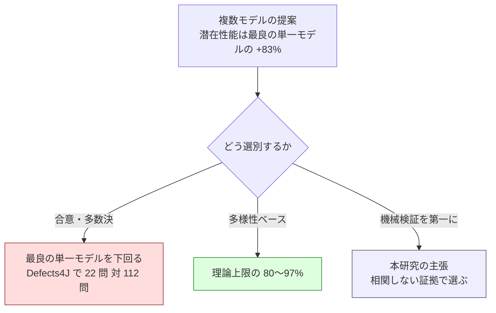

# AI エージェント開発におけるモデルのアンサンブル利用に関する研究メモ

## この文書の位置づけ

ブログ記事および論文執筆のための素材である。確定した仕様ではなく、研究テーマ、調査した
文献、手元の実測データ、検証計画を残す。設計へ反映した結果は
[cross-refactoring-round-time-and-defects.md](cross-refactoring-round-time-and-defects.md) にある。

作成日: 2026-08-29

## 研究テーマ

**AI エージェントによる開発において、複数モデルのアンサンブル利用が単一モデルより優位で
あることを示す。**

対象は、コードを書く・直す・レビューする一連の作業を AI エージェントに任せる状況である。
単一のモデルへ何度も問い合わせる構成（self-consistency、反復サンプリング）や、単一の
高性能モデルを使う構成と比較する。

### 示したい 3 つの命題

| # | 命題 | 現在の裏付け |
| --- | --- | --- |
| 1 | 複数モデルの潜在性能は、最良の単一モデルを大きく上回る | 文献（Defects4J で +83%） |
| 2 | ただし集約を誤ると、単一モデルを下回る | 文献（合意ベースで最良単一の 5 分の 1 に落ちる） |
| 3 | 開発というドメインは、機械検証で潜在性能を引き出せる点で有利である | 未検証（本研究の主張） |

命題 3 がこの研究の固有性である。多くの合議研究は正解ラベルのある推論タスクを扱うが、
コードはテスト・型検査・静的解析・参照検索という**参加者の誤りと相関しない証拠**を持つ。
合議の集約を LLM に委ねずに済むドメインとして提示できる。

## 文献調査

読んで数値を確認したものと、検索で見つけたが本文を読んでいないものを分ける。

### 本文を読んだもの

| 略称 | 論文 | 出典 |
| --- | --- | --- |
| Wisdom and Delusion | Wisdom and Delusion of LLM Ensembles for Code Generation and Repair | [arXiv:2510.21513](https://arxiv.org/html/2510.21513) |
| ModelSwitch | Do We Truly Need So Many Samples? Multi-LLM Repeated Sampling Efficiently Scales Test-Time Compute | [arXiv:2504.00762](https://arxiv.org/html/2504.00762v2) |
| Harness-Bench | Measuring Harness Effects across Models in Realistic Agent Workflows | [arXiv:2605.27922](https://arxiv.org/html/2605.27922v1) |
| CORE-Bench 事例 | Life After Benchmark Saturation: A Case Study of CORE-Bench | [arXiv:2606.26158](https://arxiv.org/html/2606.26158v1) |
| Hidden Clones | Exposing and Fixing Family Bias in Vision-Language Model Ensembles | [arXiv:2603.17111](https://arxiv.org/html/2603.17111) |
| Correlated Errors | Correlated Errors in Large Language Models | [arXiv:2506.07962](https://arxiv.org/html/2506.07962v1) |
| Minority Sentinel | When to Overturn Majority Voting in Multi-Agent LLM Debates | [arXiv:2606.29270](https://arxiv.org/html/2606.29270v1) |

### 一覧で見つけたが本文を未読のもの

| 論文 | 出典 |
| --- | --- |
| Enhancing LLM Code Generation with Ensembles: A Similarity-Based Selection Approach | [arXiv:2503.15838](https://arxiv.org/html/2503.15838v1) |
| Multi-Programming Language Ensemble for Code Generation | [arXiv:2409.04114](https://arxiv.org/pdf/2409.04114) |
| Agents in Software Engineering: Survey, Landscape, and Vision | [arXiv:2409.09030](https://arxiv.org/pdf/2409.09030) |
| Self-Preference Bias in LLM-as-a-Judge | [arXiv:2410.21819](https://arxiv.org/abs/2410.21819) |
| Are Diversity Metrics Measuring Diversity? | [arXiv:2607.20768](https://arxiv.org/html/2607.20768v1) |
| Too Polite to Disagree: Sycophancy Propagation in Multi-Agent Systems | [arXiv:2604.02668](https://arxiv.org/html/2604.02668v2) |
| Talk Isn't Always Cheap: Failure Modes in Multi-Agent Debate | [arXiv:2509.05396](https://arxiv.org/html/2509.05396) |
| Stop Comparing LLM Agents Without Disclosing the Harness | [arXiv:2605.23950](https://arxiv.org/pdf/2605.23950) |
| LLM-TOPLA: Efficient LLM Ensemble by Maximising Diversity | [arXiv:2410.03953](https://arxiv.org/html/2410.03953) |
| Dipper: Diversity in Prompts for Producing LLM Ensembles | [arXiv:2412.15238](https://arxiv.org/pdf/2412.15238) |
| LLM-Blender | [arXiv:2306.02561](https://arxiv.org/abs/2306.02561) |
| Multiagent Debate | [arXiv:2305.14325](https://arxiv.org/abs/2305.14325) |
| ReConcile | [arXiv:2309.13007](https://arxiv.org/abs/2309.13007) |
| Mixture-of-Agents | [arXiv:2406.04692](https://arxiv.org/abs/2406.04692) |

## 命題 1: アンサンブルの潜在性能は単一モデルを大きく上回る

Wisdom and Delusion は、10 モデル（5 ファミリー）でコード生成と自動プログラム修復を
測定している。「いずれかのモデルが正解を出していれば成功」とする理論上限（oracle）は
次のとおり。

| ベンチマーク | 最良の単一モデル | アンサンブルの理論上限 | 伸び |
| --- | ---: | ---: | ---: |
| Defects4J v2.0（525 バグ） | 112 問 | 205 問 | +83% |
| LiveCodeBench（454 問） | 155 問 | 185 問 | +19% |
| HumanEval-Java（164 バグ） | 122 問 | 139 問 | +14% |

**潜在性能の差はタスクによって大きく変わる。** 実世界のバグ（Defects4J）で最も大きく、
競技プログラミング（LiveCodeBench）や合成バグ（HumanEval-Java）では小さい。実務に近い
タスクほどモデルごとの得意分野が分かれる、と読める。

ModelSwitch は推論タスクで同じ方向を示している。

| データセット | 構成 | 結果 |
| --- | --- | --- |
| MATH | Gemini 1.5 Flash + GPT-4o mini（35 サンプル） | 81% |
| MATH | Gemini 1.5 Flash 単独（512 サンプル） | 79.8% |
| MMLU-Pro | 複数モデル | 63.2%（最良単一 53% から +10.2 ポイント） |

**単一モデルを 512 回サンプリングするより、2 モデルを 35 回サンプリングするほうが精度が
高い**（14 倍の効率）という結果になる。

## 命題 2: 集約を誤ると単一モデルを下回る

Wisdom and Delusion の最も重要な発見である。同じ 10 モデルのアンサンブルでも、選択戦略で
結果が逆転する。

| 選択戦略 | Defects4J の解決数 | 理論上限に対する実現率 |
| --- | ---: | ---: |
| 理論上限（oracle） | 205 問 | 100% |
| 多様性ベース | 164 問 | 80% |
| ナイーブ | 97 問 | 47% |
| **合意ベース（CodeBERT）** | **22 問** | **11%** |
| （参考）最良の単一モデル | 112 問 | — |

**合意ベースの選択は 22 問で、最良の単一モデル 112 問を大きく下回る。** 著者はこれを
`popularity trap` と呼び、原因を「モデルは構文的に類似しているが意味的に誤った解を頻繁に
生成し、合意に基づく選択がこれを増幅する」と説明している。

多様性ベースの戦略は、ベンチマークによっては理論上限の 97% を実現する。

| ベンチマーク | 構成 | 実現率 |
| --- | --- | ---: |
| HumanEval-Java | 大規模 5 モデル | 97% |
| LiveCodeBench | 全 10 モデル | 92% |
| Defects4J | 小規模 5 モデル | 88% |

### 多数決が少数派の正解を潰す構造

Minority Sentinel は 3 ベンダーの LLM で議論させ、1,754 サンプルを測定している。

| 指標 | 値 |
| --- | ---: |
| 2:1 の意見分裂が起きた割合 | 39.1%（686/1,754） |
| 分裂のうち少数派が正しかった割合 | 25.5%（175/686） |
| 多数決の精度 | 74.3% |
| 少数派を全て正しく救った場合の上限 | 84.3% |

覆す判定に何を使うかで結果が分かれる。

| 判定方法 | ネットゲイン |
| --- | ---: |
| 学習した分類器（22 次元の特徴量 + LightGBM） | +1.71% |
| ロジスティック回帰 | +0.68% |
| **LLM を審判にする** | **−1.37%** |

**集約を LLM に委ねると悪化する。** 著者は「同じ知識の盲点を共有する」ためとしている。

Hidden Clones も同じ構造を示す。「最良モデルが正解しているのに多数決で全滅する」層
（Misleading Tier）が VQAv2 で 2.5%、GQA で 6.5% 存在し、そこでの多数決の精度は 0% である。

## 命題 3: 開発ドメインは機械検証で潜在性能を引き出せる

命題 1 と 2 を合わせると、アンサンブルの課題は**潜在性能をどう引き出すか**に絞られる。
Defects4J では上限 205 問に対し、多様性ベースでも 164 問（80%）にとどまる。

推論タスクでは、選別に使えるのは LLM の判断か、統計的な一致度しかない。ところが
**ソフトウェア開発には、参加者の誤りと相関しない証拠がある。**

| 証拠 | 何を確かめられるか | 相関するか |
| --- | --- | --- |
| テストの実行 | 振る舞いが変わっていないか | しない |
| 型検査・静的解析 | 型の整合、未使用、到達不能 | しない |
| 参照検索 | その定義がどこから使われているか | しない |
| ビルド | 構文と依存が通るか | しない |
| LLM の支持票 | もっともらしさ | **する** |

リファクタリングは「振る舞いを変えずに構造を変える」作業なので、**成功条件が機械的に
定義できる**。この性質を使えば、合議を判定の中心に置かずに済む。

これが本研究の主張である。**合議は候補を広く集めるために使い、選別は機械検証に任せる。**

## 独立性はどこから来るか

アンサンブルの効果は参加者の誤りが相関しないことに依存する。では何が独立性を生むか。

### モデルの系統

| 出典 | 同一系統 | 異なる系統 | 差 |
| --- | ---: | ---: | ---: |
| Hidden Clones（VQAv2、17 モデル） | r = 0.67 ± 0.12 | r = 0.53 ± 0.07 | 0.14（p < 0.001） |
| Hidden Clones（TextVQA / GQA） | — | — | 0.13 / 0.15 |

Correlated Errors は回帰分析で要因を分解している。

| 要因 | HuggingFace | Helm |
| --- | ---: | ---: |
| 同じ企業 | 0.066 | 0.022 |
| 同じアーキテクチャ | 0.076 | — |
| 両モデルの精度の交互作用 | 0.023 | 0.026 |
| ベースライン（ランダム） | 約 0.127 | — |

読み取れることは 2 つある。

1. **異なる系統でも相関は高い。** r = 0.53 で、同一系統との差は 0.14 にとどまる
2. **系統より両者の精度のほうが効く。** 著者は「より正確なモデルペアほど誤りが相関する」
   と述べている。前線モデルを並べる構成では、系統を分散させても相関は残る

Hidden Clones は帰結として、17 モデルの統計的な力が**実質 2.5〜3.6 の独立投票者**に
しか相当しないことを固有値分析で示している。各系統から 1 モデルずつ選んだ 8 モデルの
均衡アンサンブルが、17 モデルの 99.9% の性能を出す（VQAv2 86.63% 対 86.70%）。
**投票者を増やすより相関を下げるほうが効く。**

### ハーネス（スキャフォールド）

Harness-Bench（6 ハーネス × 8 モデル × 106 タスク = 5,194 軌跡）:

- ハーネス間の差は **23.8 ポイント**（NanoBot 76.2% ↔ OpenClaw 52.4%）
- 強いモデルほどハーネス差に頑健で、弱いモデルほどハーネス設定に敏感
- 著者の結論は「エージェントの能力はベースモデルだけでは特徴づけられず、観測・行動・
  回復・成果物生成を仲介する実行層にも規定される」

CORE-Bench 事例はさらに直接的である。

> Opus 4.5 において、CORE-Agent と OpenCode は**どちらも 82.1% の精度**でありながら、
> **39 タスク中 12 タスク（31%）で結果が一致しなかった**

失敗の種類もスキャフォールドで偏る（計算エラーは CORE-Agent に 14 件、タイムアウトは
OpenCode に 8 件、依存関係の失敗は OpenCode に 6 件）。解決戦略の選択にも差があり、
直接修正を選ぶ割合が Codex CLI で 82%、CORE-Agent で 49% である。

**同一モデル・同一精度でも、ハーネスが違えば 3 割のケースで別の結論に至る。**
モデル系統の相関ギャップ（0.14）より大きな効果である。

### 何を独立性の根拠にするか

| 要素 | 効果 | 測り方 |
| --- | --- | --- |
| ハーネスの違い | 大（31% の不一致） | 参加者ごとに記録する |
| モデル系統の違い | 中（相関ギャップ 0.14） | 参加者ごとに記録する |
| 両者の精度 | 高いほど相関が上がる | 前線モデルを並べる限り下げられない |
| プロンプトの多様化 | 単一モデルでも一定の効果（Dipper、未読） | 未検証 |

独立性は前提として主張せず、**実行のたびに測って記録する**のが妥当である。測る指標は
提案の重複率と判定の一致率になる。

## コスト

アンサンブルは参加者の数だけ費用がかかる。ModelSwitch はこの点を扱っている。

| 指標 | 値 |
| --- | --- |
| サンプル数の削減 | 6 データセット平均 **34%**（GSM8K 43% / MGSM 41%） |
| 必要なモデル数 | **2 モデルで最大の改善**。3〜6 でプラトーまたは低下 |
| 小さいモデルの組み合わせ | 9B + 8B で 70B 単独に匹敵（69% 対 68.7%） |
| Multi-agent debate との比較（MMLU-Pro、15 サンプル予算） | ModelSwitch 63.2% / MOA 50.8% / MAD 45% / AgentVerse 38% |

Wisdom and Delusion も 2 モデルで効果が出ることを示している（Defects4J で多くのペアが
単一モデルより 20 問以上多く解決）。**参加者を増やすほど良いわけではない。**

これは手元の設計にも効く。4 ランタイムを並べる構成は、コストの観点では過剰な可能性がある。
ただし手元の構成は「サンプリングの多重化」ではなく「役割の分担」（提案・適用・レビュー）
なので、そのまま当てはまるとは限らない。ここは検証が要る。

## 手元の実測データ

`cross-refactoring` 7 回目の試行（devbase の Pull Request #121、4 ラウンド）と、
`cross-review`（ai-plugins の Pull Request #155、6 ラウンド）で得たデータである。
いずれも N=1 の事例で、統計的な主張はできない。実運用での観測として記録する。

### 参加構成

| 役割 | 参加者 | ハーネス | モデル |
| --- | --- | --- | --- |
| ホスト | claude | Claude Code | 既定 |
| 提案・レビュー | codex | codex CLI | 既定 |
| 提案・レビュー | gemini | Gemini CLI | 既定 |
| 提案・レビュー | kiro | kiro-cli | `claude-sonnet-5` |
| 適用 | claude / codex / kiro | 各 CLI | 上記 |

**4 者のハーネスはすべて異なり、モデルは claude と kiro が同系列である。**

### 提案の重複率

3 者が同じ範囲（1,189 行）に対して独立に提案した結果である。

| ラウンド | codex | gemini | kiro | 計 | 統合後 | 重複 |
| ---: | ---: | ---: | ---: | ---: | ---: | ---: |
| 1 | 3 | 4 | 3 | 10 | 9 | 1 |
| 2 | 3 | 4 | 0 | 7 | 5 | 2 |
| 3 | 4 | 3 | 1 | 8 | 8 | 0 |
| 4 | 1 | 2 | 2 | 5 | 4 | 1 |
| 合計 | 11 | 13 | 6 | 30 | 26 | 4 |

**重複率 13.3%。** 提案の 86.7% は 1 者だけが挙げたものだった。採用された 19 件のうち、
2 者以上が挙げたものは 4 件（21.1%）である。

この数値は 2 通りに読める。どちらが支配的かは、この試行では切り分けられていない。

- 参加者の探索が独立している（ハーネスの違いが効いている）
- 提案の空間が広く、3 者が別々の場所を見ただけである（合意の機会がそもそも少ない）

**低い重複率は、命題 1 の潜在性能が手元でも成立しうることを示唆する。** 1 者だけが
見つけた改善が 86.7% を占めるなら、単一モデルで進めた場合に取り逃がす量は大きい。

### レビューの判定の分岐

`cross-refactoring` のレビューは 2 者で行う。6 回の判定は次のとおり。

| ラウンド | 実装担当 | レビュー担当と判定 | 一致 |
| ---: | --- | --- | --- |
| 1（1 回目） | codex | gemini APPROVE / kiro REQUEST_CHANGES | 分岐 |
| 1（2 回目） | codex | gemini REQUEST_CHANGES / kiro REQUEST_CHANGES | 一致 |
| 2（1 回目） | kiro | codex APPROVE / gemini REQUEST_CHANGES | 分岐 |
| 2（2 回目） | kiro | codex APPROVE / gemini APPROVE | 一致 |
| 3 | claude | codex APPROVE / kiro APPROVE | 一致 |
| 4 | codex | gemini APPROVE / kiro REQUEST_CHANGES | 分岐 |

**判定が分岐したのは 6 回中 3 回（50%）。** Minority Sentinel の「2:1 分裂が 39.1%」と
同じ桁である（参加者数が違うため直接比較はできない）。

分岐したケースでは、いずれも `REQUEST_CHANGES` 側に具体的な根拠があった。ラウンド 1 で
kiro が単独で挙げた指摘は次のもので、これにより振る舞いが変わる項目 1 件が Pull Request から
外れている。

> 共通化した `_environment_entries` が常にキーを strip するため、`_apply_dev_environment` の
> list 分岐で空白を含むキーの扱いが変わる（旧: 重複追記、新: 既存要素を除去して追記）。
> 現状固定テストで拾われていない。

**少数派（1 者）の指摘が正しかった事例**であり、命題 2 の「合意を関門にすると取り逃がす」に
対応する。

### 参加者ごとに停止条件が異なる事例

ai-plugins の Pull Request #155 を codex と gemini が 6 ラウンドレビューした結果である。

| ラウンド | codex | gemini |
| ---: | --- | --- |
| 1 | REQUEST_CHANGES (3) | REQUEST_CHANGES (3) |
| 2 | REQUEST_CHANGES (1) | REQUEST_CHANGES (3) |
| 3 | REQUEST_CHANGES (1) | REQUEST_CHANGES (1) |
| 4 | APPROVE (0) | REQUEST_CHANGES (1) |
| 5 | APPROVE (0) | REQUEST_CHANGES (2) |
| 6 | APPROVE (0) | REQUEST_CHANGES (2) |

**codex は 4 ラウンド目で承認へ移り、gemini は 6 ラウンド目まで指摘を出し続けた。**
gemini の指摘は毎回新規で、同じ指摘の再掲は 0% だった。指摘 17 件はすべて修正され、
却下は 0 件である。

収束を「全員が承認するまで」と定義すると、最も止まらない参加者に律速される。
**停止条件の設計が、参加者を増やしたときの費用を決める。**

## 設計への反映

この調査を受けて `cross-refactoring` の採否を次の順序へ改めた。

1. **機械検証**。参照検索・テスト・静的解析で立証できる提案は、支持が 1 者でも採用する
2. **反証**。`refute` が返された提案は、支持数によらず落とす
3. **得点**。決まらないものを得点と影響の広さで並べ、閾値未満を落とす
4. **不採用**。得点が割れた提案は採用しない。得点と内訳は報告へ残す

4 段階すべてを自動判定にしている。人の判断を待つ出口を作ると自律実行が止まるためで、
機械検証で立証できるものは段階 1 で先に拾われる。

提案者の合意を関門にする案は取り下げた。Wisdom and Delusion の合意ベース（22 問 対
最良単一 112 問）と、Minority Sentinel の少数派 25.5% が根拠である。

## 検証計画

### 比較する構成

同じ対象に対して次を実行し、結果を比較する。

| 構成 | 内容 |
| --- | --- |
| single best | 単一モデル・単一ハーネスで実行 |
| single repeated | 単一モデルを複数回サンプリングして自己一致で選ぶ |
| union | 全参加者の提案をすべて採用 |
| majority | 単純多数決で採用 |
| current | 現行の cross-refactoring |
| proposed | 機械検証 → 反証 → 得点の順で採用 |
| oracle | いずれかの参加者が正しい提案を出していれば成功とみなす上限 |

`oracle` との差が「潜在性能をどれだけ引き出せたか」になる。Wisdom and Delusion の
実現率（80〜97%）と比較できる。

### 計測する指標

| 指標 | 目的 |
| --- | --- |
| 採用件数、レビューを通過した件数、取り消された件数 | 精度 |
| 参加者ごとの提案数、単独提案数、提案者ペアごとの重複率 | 独立性 |
| 判定の一致率、分岐時にどちらが正しかったか | 相関 |
| 機械検証で立証できた件数、反証できた件数 | 命題 3 の裏付け |
| 単純多数決なら採用されたか / 証拠ベースなら採用されたか | 集約方法の比較 |
| 少数派のみが支持したが正しかった件数 | 命題 2 の裏付け |
| 所要時間、参加者ごとの利用量 | コスト |

### 切り分けられていない交絡

| 問い | 交絡 | 分離の方法 |
| --- | --- | --- |
| 重複率 13.3% は独立性か探索空間の広さか | 対照条件が無い | 同一モデル・同一ハーネスを 3 プロセス並列で走らせて比較する |
| ハーネスとモデルのどちらが提案を分けるか | 両方が同時に変わっている | モデルを固定してハーネスだけ変える条件と、その逆を組む |
| 同系統（claude / kiro）の提案は他より似ているか | 提案元ペアごとの対比較をしていない | 対象・手法の一致率を提案者ペアごとに測る |
| 4 者は過剰か | 参加者数を変えた実験をしていない | 2 者・3 者・4 者で同じ対象を処理して費用対効果を測る |

ModelSwitch の「2 モデルで最大、3〜6 でプラトー」が手元の構成にも当てはまるかは、
4 番目の実験で確かめる。ただし手元は役割分担（提案・適用・レビュー）であり、
サンプリングの多重化とは構造が違う。

### 評価用データセット

実際の不具合を含む過去の Pull Request に加え、既知の欠陥を注入した小規模なベンチマークを
用意すると比較しやすい。リファクタリングの場合は、振る舞いを変える書き換えを人為的に
混ぜて、機械検証がそれを捕捉できるかを測る形になる。

## 記事・論文にするときの主張

1. **AI エージェント開発におけるアンサンブルの価値は、同じ結論への投票ではなく、
   異なる失敗モードを持つ参加者から候補を広く集めることにある。**
   手元の重複率 13.3% と、Wisdom and Delusion の理論上限 +83% が支持する
2. **集約を LLM の合議に委ねると、単一モデルを下回りうる。**
   合意ベースの 22 問（最良単一 112 問）と、LLM 審判の −1.37% が示す
3. **ソフトウェア開発は、機械検証によって潜在性能を引き出せるドメインである。**
   テスト・型検査・参照検索は参加者の誤りと相関しない。リファクタリングは成功条件が
   機械的に定義できるため、この構造を最も素直に使える
4. **独立性の源泉はモデルの系統よりハーネスの違いにある。**
   相関ギャップ 0.14 に対し、同一モデルでも 31% の不一致

3 点目が本研究の固有性で、既存の合議研究（正解ラベルつきの推論タスク）との差になる。

## 関連する検討

`cross-review`（レビュー側）への同じ考え方の適用は
[issue #156](https://github.com/devbasex/ai-plugins/issues/156) にある。証拠ベースの
adversarial review と、single best / union / majority / oracle を比較する評価基盤の設計が
まとまっている。本メモの検証計画はその評価設計と揃えてある。
