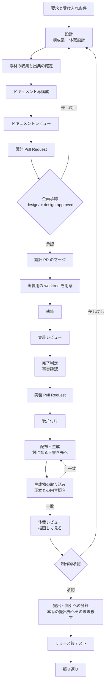

# マイルストーン 10: ビジネス文書ワークフロー — 設計

要求と受け入れ条件は [milestone-10-documentation-workflow.md](milestone-10-documentation-workflow.md)
にある。この文書は「どう作るか」だけを扱う。決定の記録は
[milestone-10-design-decisions.md](milestone-10-design-decisions.md) にある。

対象は親 #506 と子 9 件（#507 / #508 / #509 / #510 / #511 / #512 / #513 / #514 / #515）である。

## 3 つの軸

**この設計の中核は、1 つに潰れていた軸を 3 つへ分けることである。** #506 は「出力の形」と
「文書タイプ」を挙げ、#515 が「ドキュメンテーションシステム」を足した。3 つは**別々に変わる**。

| 軸 | 値 | 何を決めるか | 持つ場所 |
| --- | --- | --- | --- |
| 文書タイプ | 提案・企画 / 決裁・稟議 / 定例報告 / 指標定義 / 運用マニュアル / 説明・研修 | **何を書くか**（節・読み手が最初に問うこと） | 判定は `development-workflow`、中身は `document-drafting` |
| 出力の形 | スライド / 文書 / 表計算 / ページ | **どう見えるか**（版面・書体・1 枚あたりの情報量） | 決めるのは `design`、生成するのは `release` |
| ドキュメンテーションシステム | Google Drive / Notion / Confluence / SharePoint / リポジトリ自身 | **どこへ置くか**（認証・API・記法・図の扱い） | `document-systems` |

**3 つは掛け合わせになる。** 同じ「提案・企画」が、スライドの形で Google Drive にも、
ページの形で Notion にも載る。1 つの軸へ潰すと、値の数が 6 × 4 × 5 に膨らむ。


**軸をまたぐ規約を持たせない。** `form-slide.md` は投稿の手順を書かず、`system-notion.md` は
文書タイプごとの節を書かない。同じ規約が 2 箇所にあると片方だけが更新される。

## 構成要素

### 新設する Skill（4 個）

| 要素 | 責務 | 工程 |
| --- | --- | --- |
| `document-sources` | 使う数値・図・引用の出所を一覧にし、後から同じ値へ戻れる形で残す | 素材の収集と出典の確定 |
| `document-drafting` | 6 タイプそれぞれの中身（節・読み手が最初に問うこと・よくある欠落）を書かせる | 実装（執筆） |
| `layout-review` | 生成物を描画し、版面の欠陥を見る | 体裁レビュー |
| `document-systems` | システムごとの認証・取得・投稿・描画の手順を 1 システム 1 ファイルで持つ | 配布 / 素材の収集 / 体裁レビューの 3 つが読む |

### 既存 Skill へ足すもの

| 要素 | 足すもの |
| --- | --- |
| `development-workflow` | `documentation` モード、工程 2 行、`references/document-types.md` |
| `design` | `references/layout-<出力の形>.md` 4 本。触る領域の表へ「読み手へ渡す文書を作る」の行 |
| `release` | `references/form-<出力の形>.md` 4 本。生成と提出の 2 段 |
| `quality-gates` | モード別の表へ `documentation` の行。追加で要るものとして事実確認 |
| `requirements-design` | `references/document-requirements.md`（読み手・目的・読み手に求める判断） |
| `cross-review` | `state.py` の `PATH_CATEGORY_RULES` へ文書のカテゴリ |

### 変える定数

| 要素 | 現行 | 変更後 |
| --- | --- | --- |
| `workflow-common.sh` の `WF_MODES` | 4 値 | 5 値 |
| 同 `WF_STAGE_MATRIX` | 16 行 × 4 列 | **18 行 × 5 列** |
| 同 `WF_MODE_HEIGHT` | 4 値 | 5 値 |
| 同 `wf_stage_class` | 列を `c1`〜`c4` で読む | `c5` を足す |
| `projects-common.sh` の `PJ_STAGES` | 16 値 | 18 値 |
| 同 `PJ_MODES` | 4 値 | 5 値 |

## 工程表（18 行 × 5 列）

**列の並びは高さと同じ順である。** `documentation` は高さが 5 であるため、5 列目に来る。
**高さは必須の工程の数ではない**（この表で `R` を数えると `standard` が 16 個、
`documentation` は 14 個である）。高さの根拠は決定 2 にある。

| 工程 | `light` | `operation` | `legacy-refactor` | `standard` | `documentation` |
| --- | --- | --- | --- | --- | --- |
| 要求と受け入れ条件 | R | R | — | R | R |
| 作業場所の用意 | C | C | R | R | R |
| 設計 | C | C | R | R | R |
| **素材の収集と出典の確定** | — | — | — | — | R |
| ドキュメント再構成 | — | — | C | R | R |
| ドキュメントレビュー | — | — | C | R | R |
| 計画 | — | R | R | R | C |
| 実装 | R | R | R | R | R |
| 構造改善 | — | — | R | R | — |
| 実装レビュー | R | R | R | R | R |
| 完了判定 | R | R | R | R | R |
| Pull Request | R | R | R | R | R |
| 確定仕様化 | — | C | — | R | C |
| 後片付け | R | R | R | R | R |
| 配布 | R | R | R | R | R |
| **体裁レビュー** | — | — | — | — | R |
| リリース後テスト | — | C | R | R | C |
| 振り返り | — | C | R | R | R |

**`documentation` 列の対象外は 1 セルだけである**（構造改善）。90 セル全体では 21 セルが
対象外で、内訳は**新しい 2 行 × 既存 4 モードの 8 セル**（素材の収集と出典の確定 / 体裁
レビューは `light` / `operation` / `legacy-refactor` / `standard` のいずれでも対象外）と、
**既存 16 行の 13 セル**である。**表を分ける根拠は無い。**

**新しい 2 行の位置は固定である。** 素材の収集と出典の確定は `設計` の後、体裁レビューは
`配布` の後に置く。盤面の単一選択は順序が工程の順序を表すため、4 箇所が同じ並びを持つ。

## 判定の順序

**`documentation` を 2 番目に置く。** 最初に該当したモードを採る規約は変えない。

| 順 | モード | 該当条件 |
| --- | --- | --- |
| 1 | `operation` | 本番コードも文書も変えず、外部の系の状態だけを変える |
| 2 | **`documentation`** | **読み手へ渡すビジネス文書を作る・改訂する** |
| 3 | `standard` | 公開インタフェースの変更ほか（現行のまま） |
| 4 | `legacy-refactor` | 現行のまま |
| 5 | `light` | 現行のまま |

**リポジトリの説明文書は `documentation` ではない。** `README.md` や `docs/` の変更は
これまでどおり `light` である。判定を分けるのは**読み手**で、リポジトリの外にいる人へ渡す
ものだけが `documentation` に当たる。この境界は `references/document-types.md` が持つ。

## 文書タイプの判定（6 タイプ）

**タイプ判定はモード判定の 2 段目である。** `documentation` に決まった後に 1 つを選ぶ。

| タイプ | 判定に使う条件 | 実在した例 |
| --- | --- | --- |
| 提案・企画 | 読み手に**採否の判断**を求める。まだ決まっていないことを提案する | `買取エージェントサービス_ご提案資料` |
| 決裁・稟議 | 読み手に**承認**を求める。金額・期間・責任の所在が本体 | `2026_1Q開発稟議` |
| 定例報告 | **決まった周期**で同じ枠に値を入れる。読み手は差分を見る | `0907月次MTG資料（8月振り返り）` |
| 指標定義 | **何を数えるか**を決める。値ではなく定義が本体 | `DXM事業部OKR管理` |
| 運用マニュアル | 読み手が**その場で手を動かす**。改訂が続く | `クエステトラの操作マニュアル` |
| 説明・研修 | 読み手に**理解**だけを求める。判断も操作も求めない | `全社AI活用方針_全社説明資料` |

**境界は「読み手に何を求めるか」で切る。** 同じ内容でも、採否を求めれば提案、承認を求めれば
決裁である。複数に当たるときは**読み手が実際に取る行動**で決め、それでも決まらないときは
上の順で先に来るものを採る。

## 入出力の契約

### `.ndf/document.json`（新設の宣言ファイル）

**文書の提出先は git の外にあるため、別の宣言が要る。** `.ndf/worktree.json` の
`production_branch` は git のブランチしか指せない。

| 項目 | 内容 |
| --- | --- |
| 名前 | `.ndf/document.json` |
| 入力 | リポジトリの根からの相対パスで読む |
| 出力 | 提出先の一覧。`production` が真のものが本番の系。真のものは `draft` で対になる下書き先を指す |
| 失敗の形 | **無ければ何も起きず終了コード 0。** 提出の工程は「提出先が宣言されていない」と伝えて止まる |
| 互換性 | 新設のため既存の呼び出し側は無い。`.ndf/worktree.json` と `.ndf/projects.json` の宣言方式に揃える |

```json
{
  "version": 1,
  "source_root": "docs/documents",
  "destinations": [
    {
      "name": "proposal-drive",
      "system": "gdrive",
      "location": "https://drive.google.com/drive/folders/<識別子>",
      "visibility": "internal",
      "production": true,
      "draft": "proposal-drive-draft",
      "auth": { "kind": "env", "keys": ["GOOGLE_APPLICATION_CREDENTIALS"] }
    },
    {
      "name": "proposal-drive-draft",
      "system": "gdrive",
      "location": "https://drive.google.com/drive/folders/<識別子>",
      "visibility": "internal",
      "production": false,
      "auth": { "kind": "env", "keys": ["GOOGLE_APPLICATION_CREDENTIALS"] }
    }
  ],
  "index": { "system": "notion", "location": "https://www.notion.so/<識別子>" }
}
```

- **認証情報そのものは書かない。** `auth` が持つのは出所（環境変数の名前、秘密情報の管理系の
  識別子）だけである
- `production` が真の提出先へ届く操作が**制作物承認の関門**である。偽の提出先（下書きの共有）
  は承認を求めない
- **承認の前に書き込んでよいのは `production` が偽の提出先だけである。** 生成・取り込みと
  内容照合・体裁レビューはすべてこちらで行い、真の提出先へは承認した生成物だけが届く
  （決定 24）。既存の正式な文書を改訂する場合も、真の提出先を直接書き換えない
- **`draft` は本番の提出先ごとに 1 つ要る。** `production` が真の提出先は、対になる下書き先の
  `name` を `draft` で指す。**対の下書き先は `system` が同じでなければならない**（決定 24）。
  系が違うと、承認した生成物をそのまま移せず作り直しになるため、承認したものと届くものが
  別になる
- **`draft` を解決できないときは提出の工程で止める。** 指す先が無い・`production` が真・
  `system` が違う・`draft` の記載自体が無いのいずれでも、その提出先は使えないものとして扱う。
  **「偽の提出先がどこかに 1 つある」では足りない**（決定 24）
- `index` は索引への登録先である。無ければ索引への登録の手順を飛ばす

### `wf_stage_class` の列の追加

| 項目 | 内容 |
| --- | --- |
| 名前 | `wf_stage_class <モード> <工程>` |
| 入力 | モード名と工程名。変更なし |
| 出力 | `R` / `C` / `-` のいずれか。変更なし |
| 失敗の形 | 知らないモードで終了コード 1。変更なし |
| 互換性 | **呼び出し側は変わらない。** 列を読む `case` へ 5 番目を足すだけである |

### 新設 Skill の起動

| Skill | 入力 | 出力 |
| --- | --- | --- |
| `document-sources` | 文書のソースのパス | ソースの `## 出典` の節が埋まる |
| `document-drafting` | 文書タイプ、文書のソースのパス | 本文の Markdown |
| `layout-review` | 生成物のパスまたは URL、出力の形 | 描画した画像と、見た結果 |
| `document-systems` | システム名、用途（取得 / 投稿 / 描画） | 該当する `system-<名前>.md` の手順 |

## 処理の流れ



**企画承認は「ドキュメントレビュー」の段ではなく、設計 Pull Request のマージである。**
レビューは指摘を出す工程で、承認の関門はその後のマージに置く。マージした後は実装用の
ブランチ名で `worktree` を呼び直す（マージが設計のブランチと作業ツリーを消すため）。

**`配布` は生成と提出の 2 段である。** 図の K（生成）と N（提出・索引への登録）はどちらも
工程表の `配布` に当たり、その間に生成物の取り込みと内容照合・`体裁レビュー`・制作物承認が
入る。提出まで終わった後に
`リリース後テスト` と `振り返り` が続く（工程表の最後の 2 行）。

**生成物の内容は、描画とは別に照合する。** 体裁レビューが見るのは版面だけであるため、
非決定的な生成（AI エージェントが組む経路）で数値が変わったり本文が欠けたりしても、描画を
見るだけでは表に出ない。**生成した後・制作物承認の前に生成物を取り込み、正本の Markdown と
差分で突き合わせる**（#514 の用途 1）。取り込みの手段は `document-systems` の
`system-<名前>.md` が持ち、正規化は決定 37 が定める。

| 項目 | 決めたこと |
| --- | --- |
| 担当 | **配布（生成）を行った側**が取り込みと照合まで行う。生成の経路を選んだのがこの担当であり、欠落は経路に由来するため |
| 突き合わせる先 | 正本の Markdown。取り込んだものは正本と別のファイルへ置く（決定 37） |
| 一致の判定 | 差分が正規化の範囲に収まっていること。数値・固有名詞・出典・本文の欠落が差分に出たら不一致 |
| 不一致のとき | **正本は直さず、生成をやり直す。** 正本が誤っていたと分かったときだけ執筆へ戻る |
| 承認への持ち込み | 照合の差分を制作物承認の提示物へ含める |

**体裁レビューが配布の後にあるのは、Markdown の時点では版面が存在しないためである。**
生成してはじめて描画できる。

**差し戻しは設計へ戻る。** 版面の欠陥は体裁設計が決めた版面か、生成の経路のどちらかに
由来する。執筆へ戻しても直らない。

## 承認の 2 つの関門（写像）

**新しい関門を作らない。** `WF_APPROVAL_LABEL` と `WF_DESIGN_PREFIX` を変更しない。

| 既存の関門 | 文書での意味 | 引き金 | 提示するもの |
| --- | --- | --- | --- |
| 設計 Pull Request のマージ | **企画承認** | head のブランチ名 `design/` + ラベル `design-approved` | 読み手 / 読み手に求める判断 / 章立て / 使う数値の出所 / 触れない範囲 / 版面と図表の種類 |
| 本番の系へ届く操作 | **制作物承認** | `production` が真の提出先への操作 | **生成物を描画した画像** / **生成物と正本の内容照合の差分** / 受け入れ条件の充足 / 事実確認の記録 / 提出先と公開範囲 / 取り消しの手段と限界 |

**文字だけでは体裁を承認できない。** 制作物承認の提示物には描画した画像を必ず含める。

**検証への提出は承認を求めない。** `production` が偽の提出先（社内の下書き共有）は、開発側の
「検証への配布」に当たる。

## テスト設計

| 受け入れ条件 | 何で確かめるか |
| --- | --- |
| 工程表が 18 行 × 5 列 | `plugins/ndf/skills/development-workflow/tests/test_workflow_stage_matrix.py` が `SKILL.md` の表と `WF_STAGE_MATRIX` を突き合わせる |
| 4 箇所の並びが一致 | `plugins/ndf/skills/development-workflow/tests/test_stage_values.py` が担当する（既存）。新しい 2 工程を `references/projects-tracking.md` の対応表と `PJ_STAGES` へ足せば、そのまま並びまで突き合わせる |
| `WF_MODE_HEIGHT` に `documentation` | `wf_mode_height documentation` が 5 を返す |
| `wf_stage_class` が 5 列目を読む | `wf_stage_class documentation 体裁レビュー` が `R` を返す |
| 承認の関門が 2 つ | `WF_APPROVAL_LABEL` と `WF_DESIGN_PREFIX` の値を固定するテスト |
| 新設 4 個が manifest に載る | `skills/` の実体と `manifests/*-skills.txt` の突き合わせ（既存テスト） |
| 境界をまたぐ参照 | 4 つの manifest すべてが参照元と参照先を載せることを固定してから `check-cross-skill-refs.py` の例外へ |
| `SKILL.md` が 500 行以下 | `python3 scripts/check-doc-line-limit.py` |
| 自リポジトリ前提を持たない | `python3 scripts/check-skill-repo-assumptions.py` |
| 公開 Skill 数の記載 | `python3 scripts/check-doc-staleness.py` |
| 宣言が無ければ何も起きない | `.ndf/document.json` が無い状態で提出の手順が終了コード 0 で終わる |
| 対の下書きが無ければ止まる | `draft` が無い / 指す先が無い / `system` が違う / 指す先が `production` 真、の 4 つの宣言で提出の手順が「承認前の生成先が無い」と伝えて止まる |

## 未確認のまま残ること

| 項目 | 内容 |
| --- | --- |
| 往復で保たれるもの | 外部 → Markdown → 生成 → 外部の 1 周を実測していない。#514 の受け入れ条件が求めるため、実装 2 で実測する |
| 画像を読めないランタイム | 4 ランタイムのどれで画像を読めるかを実測していない。`layout-review` は 4 つとも配り、読めないときは止める側へ倒す |
| コメントの取り込み | Google スライドと Notion のコメントが取れるかは未確認である。**取り込まない**を既定にし、取れると分かった時点で足す |
| ページを描画して見る手段 | Notion / Confluence / SharePoint のページを画像にする手段が未確認。公開 URL を `playwright-evidence` で撮る案を書き、実測は各システムの導入時に行う |
| Confluence / SharePoint の実測 | 既存実装（別リポジトリ）の知識から書く。このリポジトリでは実行して確かめていない |
