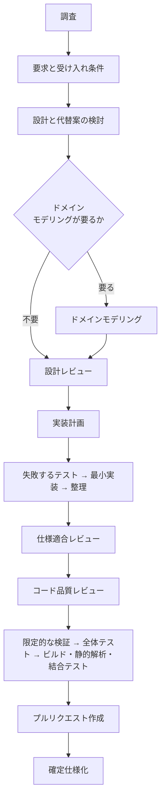

# 開発方法論 Skill の新設と既存 Skill の改修

用語は [01-overview.md](01-overview.md) を参照。

## 新設する Skill

```text
plugins/ndf-shared/skills/
├── development-workflow/
│   ├── SKILL.md
│   └── references/workflow-modes.md
├── requirements-design/
│   ├── SKILL.md
│   └── references/
│       ├── spec-template.md
│       └── acceptance-criteria.md
├── design-review/
│   ├── SKILL.md
│   └── references/design-review-checklist.md
├── domain-modeling/
│   ├── SKILL.md
│   └── references/
│       ├── strategic-ddd.md
│       ├── tactical-ddd.md
│       └── domain-model-template.md
├── object-design/
│   ├── SKILL.md
│   └── references/
│       ├── solid-grasp.md
│       ├── class-design-checklist.md
│       └── pattern-selection.md
├── tdd-cycle/
│   ├── SKILL.md
│   └── references/
│       ├── test-quality.md
│       └── testing-levels.md
├── safe-refactoring/
│   ├── SKILL.md
│   └── references/
│       ├── characterization-tests.md
│       ├── code-smells.md
│       └── refactoring-catalog.md
└── quality-gates/
    ├── SKILL.md
    └── references/definition-of-done.md
```

| Skill | 役割 |
| --- | --- |
| `development-workflow` | 変更を 4 モードに分類し、必要な工程へ振り分ける |
| `requirements-design` | 要求から受け入れ条件と仕様を起こす |
| `tdd-cycle` | 「失敗するテスト → 最小実装 → 整理」のサイクルを定義する |
| `safe-refactoring` | コードスメル起点の構造改善と現状固定テスト |
| `quality-gates` | 完了の定義と、完了宣言前の検証証跡 |
| `design-review` | 実装前の設計レビュー |
| `domain-modeling` | ドメイン駆動設計（Evans 系） |
| `object-design` | クラス設計とデザインパターン採否の判断基準 |

## ワークフローの 4 モード

全変更にフル工程を課さず、`development-workflow` が最初にモードを判定する。

| モード | 対象 | 必須工程 |
| --- | --- | --- |
| `light` | 文言、ドキュメント、設定、振る舞いを変えない局所変更 | 成功条件、対象範囲、限定的な検証 |
| `standard` | 一般的な機能追加・バグ修正 | 仕様、計画、テスト駆動、小規模な整理、レビュー、全体検証 |
| `architecture` | 公開インタフェース、データベーススキーマ、認証、複数モジュール、重要なドメイン変更 | ドメインモデリング、設計判断記録、設計レビュー、テスト駆動、契約テストと結合テスト、相互レビュー |
| `legacy-refactor` | テストが少ない既存コードの振る舞い維持型改善 | 構造分析、現状固定テスト、段階的改善、退行検証 |

標準フロー:



`light` モードは A → K → L のみを通る。

## テスト駆動の Skill は 1 つに統合する

上流 3 者のテスト駆動 Skill を並列に自動起動させない。カバレッジ基準や強制ルールが微妙に異なり、同じ場面で衝突する。`tdd-cycle` を唯一の正とし、次の内容を統合する。

| 出典 | 採用する内容 |
| --- | --- |
| addyosmani/agent-skills | リポジトリ固有のテストコマンドを事前調査、振る舞いをテストする、本物 > 疑似 > スタブ > モックの優先順、ドキュメントと静的設定にはテスト駆動を強制しない、バグ修正は再現テストから |
| obra/superpowers | 失敗が「期待した理由で」起きたことの確認、通す実装は最小限、整理中はテストを通ったまま保つ、実行していないテストを「通った」と報告しない |
| modu-ai/moai-adk | テストの乏しい既存コードでは現状固定テストを先行、小さな安全状態を積み重ねる |

## 用語の扱い

modu-ai/moai-adk の「構造分析 → 現状固定 → 改善」サイクルは有用だが、同リポジトリが DDD と呼ぶものは Domain-Driven **Development** である。このサイクルは `safe-refactoring` の legacy モードとして取り込み、`domain-modeling` は Evans の Domain-Driven **Design** 専用とする。

modu-ai/moai-adk の固定閾値（カバレッジ 10% 未満 / 最終 85% 以上）はプロジェクト設定にする。

## 行数ルールを使わない

ramziddin/solid-skills の「メソッド 10 行未満」「インスタンス変数 2 個まで」といった数値規則は採用しない。`object-design` では凝集度・結合度・変更理由・認知負荷・テスト容易性をレビュー質問として使う。

## 既存 Skill の改修

| ファイル | 改修内容 |
| --- | --- |
| `skills/implementation-plan/SKILL.md` | 目的と非目的、前提、受け入れ条件、代替案、ドメイン用語集、不変条件、インタフェースとスキーマの互換性、機能単位の分割、各タスクの「失敗 → 通す → 整理」、リスク、切り戻し手順、完了の定義を追加 |
| `skills/problem-solving/SKILL.md` | バグ修正前の再現テストを必須化。テスト困難な既存コードでは現状固定テストを先行 |
| `skills/review/SKILL.md` | 仕様適合とコード品質の二段構成に再編 |
| `skills/pr-tests/SKILL.md` | 限定的な検証と全体テストを区別。実行コマンド・終了コード・実行時刻を証跡として残す |
| `skills/plan-to-spec/SKILL.md` | ドメイン用語集、不変条件、公開インタフェース、設計判断記録の結論を確定仕様へ引き継ぐ |
| `skills/cross-review/SKILL.md` | 起動対象を `architecture` モード相当の高リスク変更に限定 |
| `skills/issue-plan-strategy/SKILL.md` | 一気通貫実行機能から呼ばれる手順として整理し、責務の境界を明記 |
| `skills/investigation-rules/SKILL.md` | トリガ `'調査'` を具体化し、`problem-solving` との境界を明記 |
| `plugins/ndf-claude/agents/director.md` | 4 モードを判定して Skill へ振り分ける |

`review` の二段構成:

```text
第 1 段: 仕様適合
- 受け入れ条件を満たすか
- ドメインの不変条件を破っていないか
- 対象範囲外の変更がないか
- テストが仕様を表しているか

第 2 段: コード品質
- 責務・凝集度・結合度
- 依存の向き
- 可読性・単純性
- コードスメル
- セキュリティ・性能
- テストが実装詳細に結合していないか
```

既存のプルリクエスト差分レビューは廃止せず、二段に分けるだけとする。

## エージェント定義の編集元

`plugins/ndf-shared/` には `skills/` `scripts/` `manifests/` しかなく、エージェント定義は `plugins/ndf-claude/agents/*.md` と `plugins/ndf-kiro/agents/default.json.template` に個別に存在する。

`director` の改修は Claude Code 版のみに閉じる。Kiro 版へは Skill 経由で効かせる。判定ロジックを Skill 側に置けば、Kiro の組み込みエージェントが `.kiro/skills/` を読むため追随する。Codex はエージェント定義を持たない。

## ライセンスと上流の固定

`THIRD_PARTY_NOTICES.md` と `upstream-skills.lock.yaml` を追加し、参照元リポジトリ、固定コミット、参照したパス、対応する Skill、ライセンス、改変内容を記録する。

modu-ai/moai-adk は Apache-2.0 のため、告知の保持と改変記録の要件を満たす記述にする。他は MIT。本体は MIT を維持する。

上流由来の Skill には frontmatter へ帰属を記録する。Agent Skills 仕様が定める項目なのでランタイムを問わず残る。

```yaml
license: MIT
metadata:
  ndf-upstream: addyosmani/agent-skills
  ndf-upstream-commit: "<pinned-sha>"
```

`metadata` は文字列キーから文字列値へのマップに限られ、入れ子構造は使えない。
