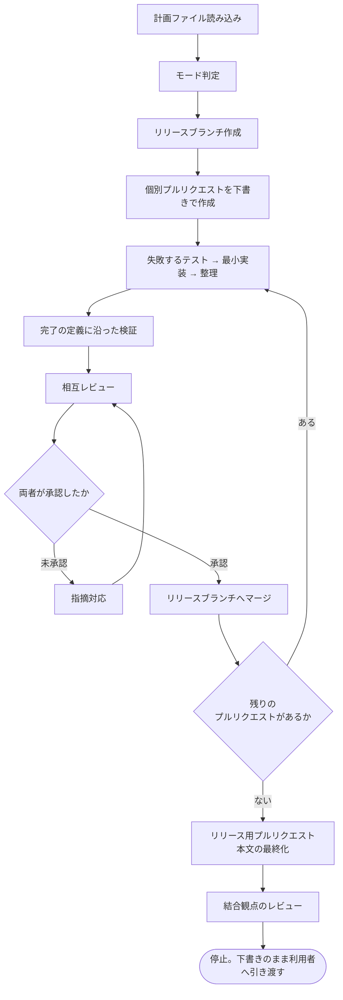

# 一気通貫実行機能

用語は [01-overview.md](01-overview.md) を参照。

設計が確定した実装計画を受け取り、リリース直前まで開発ワークフローを自動で進める Skill を `goal` として新設する。利用者は `/ndf:goal <計画ファイル>` で起動する。

## 責務の境界

`goal` は**新しい手順を定義しない**。既存の Skill を順に呼ぶ調整役に徹する。手順の二重定義は棚卸の目的に反する。

| 段階 | 呼び出す Skill |
| --- | --- |
| モード判定 | `development-workflow` |
| リリースブランチと個別プルリクエストの作成 | `issue-plan-strategy` |
| 実装 | `tdd-cycle` |
| 検証 | `quality-gates` |
| レビュー | `cross-review` |
| 指摘対応 | `fix` |

## 自動で進める範囲



## 停止条件

利用者の判断が要る境界では必ず止まる。

| 停止条件 | 理由 |
| --- | --- |
| リリース用プルリクエストをレビュー依頼可能にする直前 | 本流への統合は利用者の承認が必要（`AGENTS.md` の運用ルール） |
| 計画に受け入れ条件がない、または曖昧 | 前提を勝手に埋めると誤った実装が完成する |
| データベース移行・認証・公開インタフェースの破壊的変更を検出 | 影響が大きく、設計判断のやり直しが要り得る |
| 相互レビューが既定 3 巡で収束しない | 設計上の問題である可能性が高い |
| テストが失敗したまま次のプルリクエストへ進もうとした | 完了の定義に反する |
| 想定外のファイル（環境変数ファイル、認証情報、ライセンス）に変更が及んだ | セキュリティ要件 |

停止時は現在地、残作業、判断が必要な理由を提示する。

## 中断と再開

長時間実行になるため、進捗を `issues/.goal-state/<計画 ID>.json` に保存する。`cross-review` が既に同種の状態管理を持つため、形式を揃える。

再開時は状態ファイルと `git branch -a` / `gh pr list` を突き合わせて現在地を復元し、既存のブランチとプルリクエストを重複作成しない。

## 設定

```yaml
name: goal
description: "Drive a finalized implementation plan through coding, review, and merge up to just before release. Use when the design is settled and the plan file is ready (計画を実装して / リリース直前まで進めて)."
argument-hint: "[計画ファイルパス | 計画 ID]"
arguments: plan
disable-model-invocation: true   # 破壊的操作を含むため明示指示専用
context: fork                    # メインコンテキストを長時間占有しない
background: false                # 停止条件で利用者の判断を仰ぐため同期実行
agent: ndf:director              # 既存のタスク統括エージェントを使う
effort: high
```

`context: fork` の実行単位は会話履歴を引き継がない。計画ファイルのパスを `$plan` で受け取り、必要な文脈はすべてファイルから読む前提で本文を書く。

## 事前チェックと確認モード

起動時に計画ファイルの存在と受け入れ条件の記載を確認する。なければ `requirements-design` へ差し戻して停止する。

`--dry-run` を指定した場合は、作成するブランチとプルリクエストの一覧と順序だけを出力し、実際の作成は行わない。
