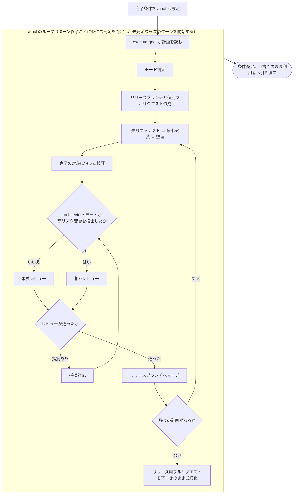

# 設計確定後の一気通貫実行

用語は [01-overview.md](01-overview.md) を参照。

設計が固まった実装計画を、リリース直前まで通しで実行する Skill `execute-goal` を新設する。計画ができた後も実装・検証・レビュー・マージの各段階を利用者が指示し続けている状態（[01-overview.md](01-overview.md)「設計確定後も逐次指示が要る」）を解消することが目的である。

## 土台にするランタイム機能

ターンをまたいで作業を継続させる仕組みは、Claude Code と Codex が `/goal` として組み込みで備えている。`execute-goal` はこれを実行基盤として使い、そこへ渡す完了条件と、ループが回す工程の中身を受け持つ。

| ランタイム | `/goal` | 動作 |
| --- | --- | --- |
| Claude Code | あり（v2.1.139 以降） | 各ターン終了後に小型モデルが条件の充足を判定し、未充足なら次のターンを開始する。セッション単位の Stop フックとして実装されている |
| Codex | あり | セッションに目的を永続化し、継続・状況確認・完了検証を行う。`/goal pause` `/goal resume` `/goal clear` を持つ |
| Kiro | **なし** | `/goal` は `unrecognized subcommand` で拒否される（kiro-cli 2.16.1 で確認） |

組み込みの `/goal` から NDF の Skill を直接駆動する使い方は、すでに 8 回記録されている（`/goal /ndf:cross-review <プルリクエスト番号>`、`/goal /ndf:issue-plan-strategy <計画ファイル> 実装開始` など）。`execute-goal` はこの使い方を正式な手順として整備したものにあたる。

`/goal` には次の制約があり、`execute-goal` の設計はこれに従う。

| 制約 | 設計への影響 |
| --- | --- |
| 条件文は 4,000 文字まで（Claude Code / Codex 共通） | 計画の内容をそのまま貼らず、終了状態と証明方法へ圧縮する |
| Claude Code の評価器はツールを呼ばず、会話に現れた内容だけで判定する | 条件はエージェント自身の出力で証明できる形に限る |
| 実行権限は変わらない | 無人で走らせるには自動承認モードとの併用が要る |

## `execute-goal` が担う範囲

Skill 名は、目的を表す `goal` を含めつつ、その語で始めない `execute-goal` とする。`goal` は Claude Code と Codex の組み込みコマンド名であり、同名の Skill は衝突する。先頭一致する名前もスラッシュコマンドのタブ補完で組み込み側と競合するため避ける。

担うのは次の 3 つで、継続ループそのものと個々の開発手順は既存の仕組みへ委ねる。

1. 起動前に計画ファイルを検査し、実行へ進めてよいかを判定する
2. 計画の内容から完了条件の文面を組み立て、`/goal` に渡す形で提示する
3. 各段階で呼ぶ既存 Skill を並べ、実行順とレビュー段階の分岐を決める

## 実行の流れ

各段階の実体は既存 Skill である。

| 段階 | 呼び出す Skill |
| --- | --- |
| モード判定 | `development-workflow` |
| リリースブランチと個別プルリクエストの作成 | `issue-plan-strategy` |
| 実装 | `tdd-cycle` |
| 検証 | `quality-gates` |
| レビュー | モード判定の結果で分岐（後述） |
| 指摘対応 | `fix` |



### レビュー段階の分岐

相互レビューは外部 AI を複数回起動する重い工程であり、[04-development-skills.md](04-development-skills.md) は起動対象を高リスク変更に限定する。`execute-goal` も同じ基準で呼び先を決める。

| 呼び出す Skill | 適用するモード | 基準 |
| --- | --- | --- |
| `review`（単独レビュー） | `light` / `standard` / `legacy-refactor` | 公開インタフェース・スキーマ・認証にまたがらない変更。単独レビューで足りる |
| `cross-review`（相互レビュー） | `architecture` | 複数モジュールや公開インタフェースに及ぶ高リスク変更。外部 AI を複数回起動する費用に見合う |

実装の途中で、`architecture` 以外のモードでもデータベース移行・認証・公開インタフェースの破壊的変更が見つかることがある。その場合は高リスク変更として扱い、以降その計画単位のレビューを `cross-review` へ切り替える。切り替えた事実と理由は、完了条件の判定材料として会話へ出力する。

## 完了条件の組み立て

評価器が会話の内容だけで判定する以上、条件は「何が終われば完了か」と「それをどう示すか」を対にして書く。これは `quality-gates` が完了宣言に求める証跡（コマンド、終了コード、実行時刻）と同じ性質であり、両者を組み合わせて設計する。

| 要素 | 例 |
| --- | --- |
| 測定可能な終了状態 | 計画中の全プルリクエストがリリースブランチへマージ済み |
| 証明方法 | `gh pr list --base release/<ID> --state open` の出力が空 |
| 変えてはならない制約 | リリース用プルリクエストを下書きのままにする |
| 上限 | レビューの手戻りが 3 巡を超えたら停止して状況を報告する |

`execute-goal` は計画ファイルからこれらを組み立て、`/goal` に渡す文面として提示する。条件文の型と記入例は `skills/execute-goal/references/goal-conditions.md` に置く（[07-tasks.md](07-tasks.md) Task 3-1）。

## 利用者が判断する境界

`/goal` は条件が充足するまでターンを繰り返すため、利用者の判断を挟みたい箇所はあらかじめ止まるように書いておく。手段は、その境界を完了状態または制約として条件文へ書き込むか、そもそも `/goal` を設定しないかの 2 つである。

| 止めたい状況 | 実現方法 |
| --- | --- |
| リリース用プルリクエストをレビュー依頼可能にする直前 | 下書きのままであることを完了状態の一部として条件文に書く |
| 計画に受け入れ条件がない | 起動前の検査で検出し、`requirements-design` へ差し戻して `/goal` を設定しない |
| データベース移行・認証・公開インタフェースの破壊的変更を検出 | 検出したら報告して指示を待つ旨を制約として条件文に書く |
| 相互レビューが収束しない | 手戻りの上限回数を条件文に書き、超えたら状況を報告して終える |
| 想定外のファイルに変更が及んだ | 変更してはならないパスを制約として条件文に列挙する |

起動前の検査では、計画ファイルの存在と受け入れ条件の記載を確認する。`--dry-run` を指定した場合は、組み立てた完了条件と、作成予定のブランチおよびプルリクエストの一覧だけを出力し、`/goal` は設定しない。

無人実行に要る自動承認モードは、マージやプッシュを含む破壊的操作をそのまま通す。**併用するかは利用者が判断する**前提で手順を書き、`execute-goal` の側から併用を促さない。

## ランタイム別の差分

Kiro には継続ループがないため、`execute-goal` は段階ごとに利用者の続行指示を要する手順書として動作する。この差は `plugins/ndf-kiro/README.md` に明記する。

計画ファイルの受け取り方もランタイムごとに異なる（[03-runtime-conformance.md](03-runtime-conformance.md)）。

| ランタイム | 受け取り方 |
| --- | --- |
| Claude Code | `arguments` で宣言した名前を本文から `$plan` として参照する |
| Codex | `argument-hint` / `arguments` とも読まれないため、`execute-goal/agents/openai.yaml` の `interface.default_prompt` で受け取る |
| Kiro | 引数の受け渡し機構がないため、本文中で利用者に尋ねる |

frontmatter は次のとおり。

```yaml
name: execute-goal
description: "Read a finalized implementation plan and drive it through coding, review, and merge up to just before release. Emits a completion condition for the runtime's built-in /goal loop. Use when the design is settled and the plan file is ready (計画を実装して / リリース直前まで進めて)."
argument-hint: "[計画ファイルパス | 計画 ID]"
arguments: plan
disable-model-invocation: true   # 破壊的操作を含むため明示指示専用
effort: high
```

`context: fork` は使わない。Claude Code の `/goal` はセッション単位の Stop フックとして動くため、分離した実行単位では評価器が働かない（[02-skill-inventory.md](02-skill-inventory.md)「未使用項目の導入」）。

## 中断と再開

継続ループの状態はランタイムが持つ。Claude Code は `--resume` で条件を復元する（ターン数と使用量の集計はリセットされる）。Codex は `/goal pause` と `/goal resume` を持つ。

NDF 側で状態を二重に持たない。再開時は `git branch -a` と `gh pr list` から現在地を判断し、既存のブランチとプルリクエストを重複作成しない手順を本文に書く。
