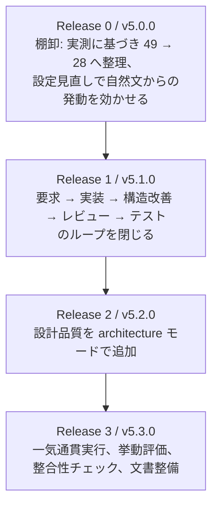

# リリースと PR の分割

用語は [01-overview.md](01-overview.md) を参照。タスクの詳細は [07-tasks.md](07-tasks.md)。

base branch: `main`

## 導入順

棚卸を最初に置くのは、整理されていない 49 個の上に 9 個を積むとトリガ衝突とコンテキスト肥大が悪化するためである。一気通貫実行を最後に置くのは、呼び出す工程 Skill がすべて揃ってからでないと調整役として成立しないためである。

## バージョンの扱い

Skill 名の統合は既存のコマンド名を壊す。`4.20.1` → **`5.0.0`** とし、旧名から新名への対応表を `ndf-policies` に 1 リリース分だけ残す。次のメジャーで削除する旨も併記する。

## Release 0: Skill 棚卸（`release/skill-inventory`）→ v5.0.0

| PR # | branch 名 | 概要 | 依存 | 並行可否 |
| --- | --- | --- | --- | --- |
| 0-1 | `feature/inventory-measure` | 全 Skill の起動率を実測し棚卸台帳を作成。frontmatter 規約を明文化 | なし | ○ |
| 0-2 | `feature/inventory-merge-review` | `review` + `review-branch` 統合、`review-pr-comments` + `fix` + `resolve-pr-comments` 統合 | 0-1 | × |
| 0-3 | `feature/inventory-merge-external-ai` | `codex` + `gemini` → `external-ai` 統合 | 0-1 | ○ |
| 0-4 | `feature/inventory-merge-git` | `clean` → `merged` 統合、`branch-fix-strategy` → `cherry-pick-pr` 統合、`sync-main` 削除 | 0-1 | ○ |
| 0-5 | `feature/inventory-merge-playwright` | ブラウザ自動テスト 9 個 → 4 個へ集約 | 0-1 | ○ |
| 0-6 | `feature/inventory-delete` | 起動ゼロ 9 個の削除、発動改善対象の `description` 見直し | 0-1 | ○ |
| 0-7 | `feature/inventory-frontmatter` | 全 Skill の frontmatter 見直しと検査スクリプト追加 | 0-2〜0-6 | × |
| 0-8 | `feature/inventory-codex-conformance` | Codex の `agents/openai.yaml` 生成 | 0-7 | ○ |
| 0-9 | `feature/inventory-kiro-delivery` | Kiro 導入方式の修正 | 0-7 | ○ |
| 0-10 | `feature/inventory-finalize` | manifest 3 種の更新、旧名からの移行案内、文書更新、version bump | 0-8, 0-9 | × |

## Release 1: 開発ループを完成させる（`release/devskills-phase1`）→ v5.1.0

| PR # | branch 名 | 概要 | 依存 | 並行可否 |
| --- | --- | --- | --- | --- |
| 1-1 | `feature/devskills-requirements-design` | `requirements-design` | なし | ○ |
| 1-2 | `feature/devskills-tdd-cycle` | `tdd-cycle` | なし | ○ |
| 1-3 | `feature/devskills-safe-refactoring` | `safe-refactoring` | なし | ○ |
| 1-4 | `feature/devskills-quality-gates` | `quality-gates` | なし | ○ |
| 1-5 | `feature/devskills-licensing` | `THIRD_PARTY_NOTICES.md` + `upstream-skills.lock.yaml` | なし | ○ |
| 1-6 | `feature/devskills-workflow-router` | `development-workflow`（4 モード判定と振り分け） | 1-1〜1-4 | × |
| 1-7 | `feature/devskills-existing-skills` | 既存 5 Skill の改修 + manifest 登録 + version bump | 1-6 | × |

PR 1-6 を後段に置くのは、`scripts/check-markdown-links.py` がリンク切れを検出するためである。振り分け先が存在しない状態でリンクを書くと継続的インテグレーションが落ちる。

## Release 2: 設計品質を追加する（`release/devskills-phase2`）→ v5.2.0

| PR # | branch 名 | 概要 | 依存 | 並行可否 |
| --- | --- | --- | --- | --- |
| 2-1 | `feature/devskills-design-review` | `design-review` | なし | ○ |
| 2-2 | `feature/devskills-domain-modeling` | `domain-modeling` | なし | ○ |
| 2-3 | `feature/devskills-object-design` | `object-design` | なし | ○ |
| 2-4 | `feature/devskills-routing-update` | `director` 改修、`cross-review` の適用範囲限定、manifest 登録、version bump | 2-1〜2-3 | × |

ドメインモデリングは全変更へ適用せず、`architecture` モードでのみ有効化する。

## Release 3: 一気通貫実行と運用安定化（`release/devskills-phase3`）→ v5.3.0

| PR # | branch 名 | 概要 | 依存 | 並行可否 |
| --- | --- | --- | --- | --- |
| 3-1 | `feature/execute-plan-skill` | `execute-plan` 本体と完了条件の組み立て | なし | ○ |
| 3-2 | `feature/devskills-eval-harness` | Skill 挙動評価 12 シナリオ + 継続的インテグレーション設定 | なし | ○ |
| 3-3 | `feature/devskills-spec-consistency` | 仕様・設計・タスクの整合性チェックを `plan-to-spec` へ追加 | なし | ○ |
| 3-4 | `feature/devskills-docs` | 確定仕様書、`AGENTS.md`、各 README 更新、version bump | 3-1〜3-3 | × |
