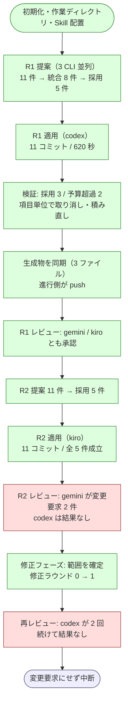

# cross-refactoring 5 回目の実機試行の結果

Pull Request #130（NDF v8.5.1）で直した 2 件を実機で確かめた記録である。
対象は Pull Request #131（Draft）。

経緯は次の 4 つにある。

- [issue-113-cross-refactoring-trial-report.md](issue-113-cross-refactoring-trial-report.md) — 1 回目
- [issue-113-cross-refactoring-retrial.md](issue-113-cross-refactoring-retrial.md) — 2 回目
- [issue-113-cross-refactoring-re-retrial.md](issue-113-cross-refactoring-re-retrial.md) — 3 回目
- [issue-113-cross-refactoring-4th-trial-report.md](issue-113-cross-refactoring-4th-trial-report.md) — 4 回目

## 結果

**4 回目に見つけた 2 件は直っていた。** 修正フェーズが範囲を確定して修正ラウンドを進め、
レビュー担当が結果を残さなかったラウンドは変更要求にせず中断した。進行が終わらない
経路には入っていない。

中断の引き金となったレビュー結果の欠落そのものは、原因を特定できた。**レビュー担当が
自分の Pull Request へ承認を投稿できず、投稿の失敗で結果ファイルを書かないまま終了する。**
過去 2 回の試行で「codex がレビュー結果を残さない」と記録していた事象と同じものである。

## 実行条件

| 項目 | 値 |
| --- | --- |
| ホスト | Claude Code（提案・レビューには不参加） |
| 提案・レビュー | codex / gemini / kiro |
| 適用の母集合 | claude / codex / kiro |
| 使用する版 | プラグインキャッシュの v8.5.1 |
| ラウンド上限 | 3（実際は 2 ラウンド目で中断） |
| 着手前のテスト | 466 passed |

```bash
/ndf:cross-refactoring 131 \
  --scope plugins/ndf-shared/skills/cross-refactoring/scripts \
          plugins/ndf-shared/skills/cross-refactoring/tests \
          plugins/ndf-shared/skills/cross-review/scripts/lib \
          plugins/ndf-shared/skills/cross-review/tests \
  --sync-command "bash scripts/build-runtime-plugins.sh" \
  --baseline-test "uv run --with pytest python -m pytest \
      plugins/ndf-shared/skills/cross-refactoring/tests \
      plugins/ndf-shared/skills/cross-review/tests -q" \
  --max-outer-rounds 3
```

## 到達点



## v8.5.1 の修正の確認

| # | 直したこと | 観測 | 判定 |
| --- | --- | --- | --- |
| 16 | 修正フェーズの起点の記録 | ラウンド 2 で変更要求 2 件を受けた後、`修正を取り込みました（解決 2 スレッド / 修正ラウンド 1）` が出て修正ラウンドが 0 から 1 へ進んだ。4 回目に出ていた `修正の範囲を確定できませんでした（起点 None）` は現れない | 成立 |
| 17 | レビュー結果の欠落の扱い | 1 回目の欠落は差し戻して再レビューになり、2 回目で `レビュー担当 codex が結果を残しませんでした。実装担当への指摘ではないため、進行を中断します` が出て終了コード 4 で止まった | 成立 |

修正 16 のうち「差し戻しの上限から変更要求へ落ちる出口」は、修正 17 が先に中断へ倒すため
実機では通らない経路になった。範囲を確定して修正ラウンドを進める側は上記のとおり成立している。

## 見つけた不具合

### 18. 自分の Pull Request にレビューを投稿できない

**レビュー担当が投稿に失敗する。** レビュー本体が完成していても GitHub が受け付けない。

```text
$ gh api repos/devbasex/ai-plugins/pulls/131/reviews -X POST -f event=APPROVE -f body='...'
gh: Unprocessable Entity (HTTP 422)
{"message":"Unprocessable Entity",
 "errors":["Review Can not approve your own pull request"]}
```

レビュープロンプトは判定を 2 値に限っている。

```text
`APPROVE` / `REQUEST_CHANGES` の 2 値だけを使います。**`COMMENT` は使いません。**
```

GitHub は自分の Pull Request への `APPROVE` と `REQUEST_CHANGES` をどちらも拒む。
`cross-review` は作成者を照合して `COMMENT` へ倒す仕組みを持つが、`cross-refactoring`
には同じ仕組みが無い。

```bash
$ grep -rn "is_own_pr\|event_downgrade" skills/cross-review/scripts/state.py | head -2
849:            print(f"IS_OWN_PR={'1' if st.get('is_own_pr') else '0'}")
850:            print(f"EVENT_DOWNGRADE={'1' if st.get('event_downgrade') else '0'}")

$ grep -rn "is_own_pr\|event_downgrade" skills/cross-refactoring/scripts/refactor.py \
                                        skills/cross-refactoring/scripts/launch-cli.sh
（該当なし）
```

**直し方**: 初期化で作成者を照合し、自分の Pull Request なら投稿の event を `COMMENT` へ
倒す。判定そのものは `APPROVE` / `REQUEST_CHANGES` のまま結果ファイルへ残し、収束判定は
そちらを見る。`cross-review` の `intent` と `posted_as` の二重保持と同じ形になる。

### 19. 投稿に失敗すると結果ファイルを書かずに終わる

レビュープロンプトの末尾に次の 1 行がある。

```text
- `gh api` が失敗したら、エラー内容を標準エラー出力へ残して即座に終了する
```

結果ファイルの書き出しより先に終了するため、進行側から見ると「結果なし」になる。実機では
codex がこの指示どおりに停止し、3 回とも結果ファイルを残さなかった。

```text
[codex] ❌ codex NO_RESULT (90s) — process exited but result.json missing:
        .../codex-review-r2-result.json
```

`cross-review` は同じ状況を想定して、投稿の失敗理由を含む結果ファイルの書き出しを求めている
（SKILL.md のアンチパターン「投稿に失敗したまま result.json を書かずに終了する」）。

**直し方**: 投稿の成否にかかわらず結果ファイルを書かせる。投稿に失敗したときは失敗理由を
フィールドとして残し、進行側がレビュー担当の停止と投稿の失敗を区別できるようにする。

### 20. 投稿されていないレビューが承認として通る

ラウンド 1 は gemini と kiro の承認で通ったが、両者の結果ファイルはレビューの URL を
持っていない。

```bash
$ python3 -c "..." gemini-review-r1-result.json kiro-review-r1-result.json
gemini-review-r1-result.json: APPROVE | url=  | findings= 0
kiro-review-r1-result.json:   APPROVE | url= None | findings= 0
```

GitHub 側に残っているレビューは 3 件で、いずれもラウンド 2 のものである。

```bash
$ gh api repos/devbasex/ai-plugins/pulls/131/reviews \
    --jq '.[] | "\(.user.login) \(.state) \(.submitted_at)"'
<利用者> COMMENTED 2026-08-21T04:15:29Z
<利用者> COMMENTED 2026-08-21T04:18:52Z
<利用者> COMMENTED 2026-08-21T04:19:04Z
```

ラウンド 1 の承認は Pull Request 上に痕跡が無いまま採用の確定に使われた。`cross-review` は
v8.5.0 で申告されたコメント数を GitHub 側の実数と突き合わせるようにしたが、
`cross-refactoring` は結果ファイルの申告だけで判定している。

**直し方**: 結果ファイルのレビュー URL を必須にし、進行側が GitHub 側の存在を確かめてから
判定に使う。取得できないときは申告を採用し、確認できなかったことを出力へ残す。

## 運用上の観測

| 事象 | 内容 |
| --- | --- |
| 取り消しの単位 | ラウンド 1 は項目単位で成立した（取り消し 11 コミット → 積み直し 5 コミット）。3 回目と 4 回目はラウンド全件へ退避していた |
| 差分予算による失敗 | ラウンド 1 の 2 件が予算超過で落ちた（277 行 / 240 行、113 行 / 100 行）。`long_method` の抽出が見積より膨らむ傾向は 4 回目と同じ |
| 生成物の同期 | ラウンド 1 で 3 ファイル、ラウンド 2 で 6 ファイルが同期され、いずれも進行側のコミットとして push まで届いた |
| gemini の投稿 | 判定は変更要求でも、GitHub 上の状態は `COMMENTED` になっている。プロンプトの 2 値の指示に対し、自分の Pull Request の制約を回避する形で投稿された |
| 中断後の状態 | 作業ディレクトリはクリーンで、`origin` と同じ地点にある。対象範囲のテストは 466 passed |

## 集計

| 実装担当 | 担当R | 適用 | 見送り | 初回承認率 | 予算超過率 | 所要秒 |
| --- | ---: | ---: | ---: | ---: | ---: | ---: |
| codex / default | 1 | 3 | 2 | 1.00 | 0.40 | 620 |
| kiro / default | 1 | 0 | 0 | 0.00 | — | 540 |

| レビュー担当 | レビュー回数 | 指摘 | 判定一致率 | 所要秒 |
| --- | ---: | ---: | ---: | ---: |
| codex / default | 1 | 0 | 0.00 | 52 |
| gemini / default | 4 | 2 | 0.50 | 600 |
| kiro / default | 1 | 0 | 1.00 | 142 |

kiro は既定モデル（auto）で動いたため、ラウンド 1 はレビュー担当の集計から、ラウンド 2 は
実装担当の集計から分離された。1 回の実行内の値なので、ランタイムの優劣を読む材料にはならない。

## 残リスク

- 不具合 18 を直すまで、自分の Pull Request を対象にした試行はレビューの投稿が成立しない。
  他者の Pull Request を対象にした場合の挙動は未確認
- ラウンド 2 の改善項目 5 件は、レビューが揃わないまま `reviewing` の状態で Pull Request に
  残っている。承認を得ていないため、そのままマージする対象にはならない
