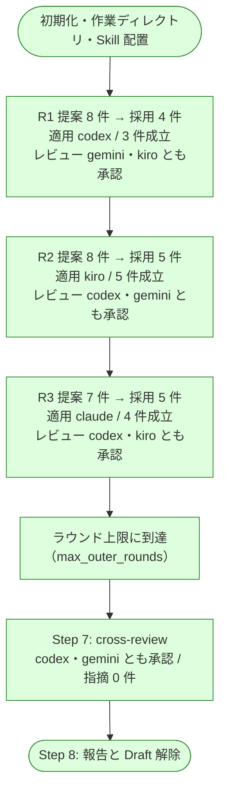

# cross-refactoring 6 回目の実機試行の結果

Pull Request #133 / #134 / #135（NDF v8.5.2〜v8.5.4）で直した 4 件を実機で確かめた記録である。
対象は Pull Request #136。

経緯は次の 5 つにある。

- [issue-113-cross-refactoring-trial-report.md](issue-113-cross-refactoring-trial-report.md) — 1 回目
- [issue-113-cross-refactoring-retrial.md](issue-113-cross-refactoring-retrial.md) — 2 回目
- [issue-113-cross-refactoring-re-retrial.md](issue-113-cross-refactoring-re-retrial.md) — 3 回目
- [issue-113-cross-refactoring-4th-trial-report.md](issue-113-cross-refactoring-4th-trial-report.md) — 4 回目
- [issue-113-cross-refactoring-5th-trial-report.md](issue-113-cross-refactoring-5th-trial-report.md) — 5 回目

## 結果

**5 回目に見つけた 3 件は直っており、ラウンド上限までの全工程を初めて通した。**
提案から適用・レビュー・収束後の関門・Draft 解除までが 1 度も中断せずに進み、
改善項目 14 件のうち 12 件が Pull Request に残った。新しい不具合は見つかっていない。

所要は 95 分（初期化から Draft 解除まで）。

## 実行条件

| 項目 | 値 |
| --- | --- |
| ホスト | Claude Code（提案・レビューには不参加） |
| 提案・レビュー | codex / gemini / kiro |
| 適用の母集合 | claude / codex / kiro |
| 使用する版 | プラグインキャッシュの v8.5.4 |
| kiro のモデル | `claude-sonnet-5` |
| ラウンド上限 | 3（3 ラウンドとも完走） |
| 着手前のテスト | 500 passed |
| 収束後のテスト | 502 passed |

```bash
/ndf:cross-refactoring 136 \
  --scope plugins/ndf-shared/skills/cross-refactoring/scripts \
          plugins/ndf-shared/skills/cross-refactoring/tests \
          plugins/ndf-shared/skills/cross-review/scripts/lib \
          plugins/ndf-shared/skills/cross-review/tests \
  --model kiro=claude-sonnet-5 \
  --sync-command "bash scripts/build-runtime-plugins.sh" \
  --baseline-test "<上のテストコマンド>" \
  --max-outer-rounds 3
```

セッションの Skill 一覧が更新前の版を指していたため、`PLUGIN_ROOT` に v8.5.4 の
パスを渡して起動した。SKILL.md 本体は 2 つの版で同一で、差分のある `refactor.py` /
`prompts/propose.md` / `docs/02-apply-and-review.md` は v8.5.4 側が使われている。

## 到達点



## v8.5.2〜v8.5.4 の修正の確認

| # | 直したこと | 観測 | 判定 |
| --- | --- | --- | --- |
| 18 | 自分の Pull Request では投稿の event を `COMMENT` へ倒す | `init` が `⚠ 自分の Pull Request です（作成者 <利用者>）— 投稿は COMMENT へ倒します` を出し、レビュー担当 6 者すべてが `HTTP 422` を受けずに投稿した | 成立 |
| 19 | 投稿に失敗しても結果ファイルを書く | 投稿の失敗が起きなかったため、この経路は通っていない | 未到達 |
| 20 | 投稿されたことを GitHub 側で確かめる | 6 件のレビューがいずれも `review_url` を持ち、GitHub 側にも同数が残っている。差し戻しは発生していない | 成立 |
| 21 | 抽出系の手法の差分予算 | 採用された 12 件のうち 5 件は、実差分が見積の 2 倍を超えている（2.08〜2.91 倍）。倍率 2 のままなら落ちていた項目である | 成立 |

投稿の実体は GitHub 側でも確かめた。

```bash
$ gh api repos/devbasex/ai-plugins/pulls/136/reviews \
    --jq '.[] | "\(.user.login) \(.state)"' | sort | uniq -c
      8 <利用者> COMMENTED
```

改善ラウンドの 6 件と Step 7 の 2 件で、判定はいずれも承認である。

### 倍率 3 が効いた項目

採用された 12 件のうち、実差分が見積の 2 倍を超えたものは 5 件である。いずれも抽出系の
手法で、v8.5.4 より前の倍率 2 では予算超過として取り消されていた。

| 項目 | 手法 | 実差分 | 見積 | 倍率 |
| --- | --- | ---: | ---: | ---: |
| R1-002 | `split_into_pipeline` | 437 行 | 150 行 | 2.91 |
| R2-002 | `extract_method` | 133 行 | 60 行 | 2.22 |
| R1-003 | `extract_method` | 106 行 | 50 行 | 2.12 |
| R2-003 | `extract_method` | 148 行 | 70 行 | 2.11 |
| R3-005 | `consolidate_duplication` | 52 行 | 25 行 | 2.08 |

倍率 2 が適用されたのは 14 件中 1 件（`flatten_conditional` の R3-003）だけで、
この構成の提案は抽出系へ強く偏る。

## 未検証だった範囲の到達

| 対象 | 結果 |
| --- | --- |
| Step 7 の関門 | 到達。Pull Request 全体を `cross-review` にかけ、1 ラウンドで両者承認 |
| Draft の解除 | 到達。`gh pr ready` で解除し、Pull Request は `open` |
| 提案の収束 | **未到達。** ラウンド上限で終了したため、新しい提案が尽きる経路と重複率による判定には入っていない |
| 修正ラウンドの上限 | **未到達。** 3 ラウンドとも初回で承認されたため、修正フェーズそのものに入っていない |
| 他者の Pull Request | **未到達。** 6 回とも自分の Pull Request を対象にした |

## 運用上の観測

### 差分予算の超過は 2 件

見積に対する実差分の倍率が予算を超え、項目単位で取り消された。

| 項目 | 対象 | 手法 | 倍率の適用 | 実差分 | 見積 | 倍率 |
| --- | --- | --- | ---: | ---: | ---: | ---: |
| R1-001 | `monitor.py#monitor_agent` | `extract_method` | 3 | 414 行 | 125 行 | 3.31 |
| R3-003 | `refactor.py#_handle_review_verdict` | `flatten_conditional` | 2 | 226 行 | 75 行 | 3.01 |

v8.5.4 で広げた倍率 3 の範囲に入る項目でも、それを超える見積の外し方が起きている。
どちらも取り消しは項目単位で成立し、ラウンドの他の項目は残った。

倍率をさらに広げると範囲外の変更を通してしまうため、次に取りうるのは見積の精度を
上げる側である。実測は 4 回目から 6 回目まで 2.03〜3.31 倍に散らばっており、
提案時点で固定費を数え切れていないことを示している。

### 取り消しは 2 回とも項目単位で成立した

同一ファイルの隣接行を触る項目どうしはラウンド全件へ退避する規定があるが、6 回目は
2 回とも項目単位で分離できた（取り消し 16 コミット → 積み直し 9 コミット、
取り消し 10 コミット → 積み直し 7 コミット）。

### レビュー担当の指摘は 0 件だった

6 回のレビューすべてが指摘なしの承認である。3 ラウンドとも修正フェーズに入らなかった
のはこのためで、実装担当の成果が機械検証を通った時点で、レビュー担当が追加で
返す指摘は無かったことになる。

### gemini の書き込み先

`cross-review` のラウンド 1 で、gemini が作業ディレクトリの外へ結果を書こうとして
拒まれた。監視は致命ではないと判断して継続し、gemini は結果ファイルを残している。

```text
[gemini] ⚠️  gemini early-error WARN (non-fatal, not killing): Error executing tool
write_file: Path not in workspace: Attempted path "/tmp/payload.json" resolves
outside the allowed workspace directories
```

判定と投稿には影響していない。

## 集計

| 実装担当 | 担当R | 適用 | 見送り | 初回承認率 | 予算超過率 | 所要秒 |
| --- | ---: | ---: | ---: | ---: | ---: | ---: |
| claude / default | 1 | 4 | 1 | 1.00 | 0.20 | 633 |
| codex / default | 1 | 3 | 1 | 1.00 | 0.25 | 1500 |
| kiro / claude-sonnet-5 | 1 | 5 | 0 | 1.00 | 0.00 | 1500 |

| レビュー担当 | レビュー回数 | 指摘 | 判定一致率 | 所要秒 |
| --- | ---: | ---: | ---: | ---: |
| codex / default | 2 | 0 | 1.00 | 232 |
| gemini / default | 2 | 0 | 1.00 | 240 |
| kiro / claude-sonnet-5 | 2 | 0 | 1.00 | 560 |

kiro にモデルを指定したため、6 回目で初めて 3 者すべてが集計に載った。ただし改善項目の
難易度が揃わないため、1 回の実行内の値をランタイムの優劣として読む材料にはならない。

## 残リスク

- 修正フェーズと見送りの経路（`should-abandon` → `abandon-items`）は 6 回の試行で
  一度も通っていない。現状固定テストでは固めてあるが、実機の確認は残っている
- 提案が尽きて終わる経路も未到達である。到達させるには `--max-outer-rounds` を
  上げるか、`--scope` を狭めて提案の母数を減らす
- 他者の Pull Request を対象にした場合、投稿の event は `APPROVE` / `REQUEST_CHANGES`
  のまま送られる。この経路は現状固定テストの範囲にとどまる
