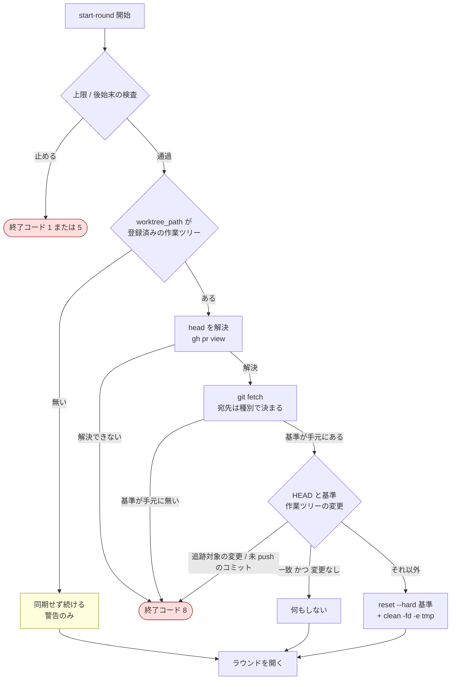
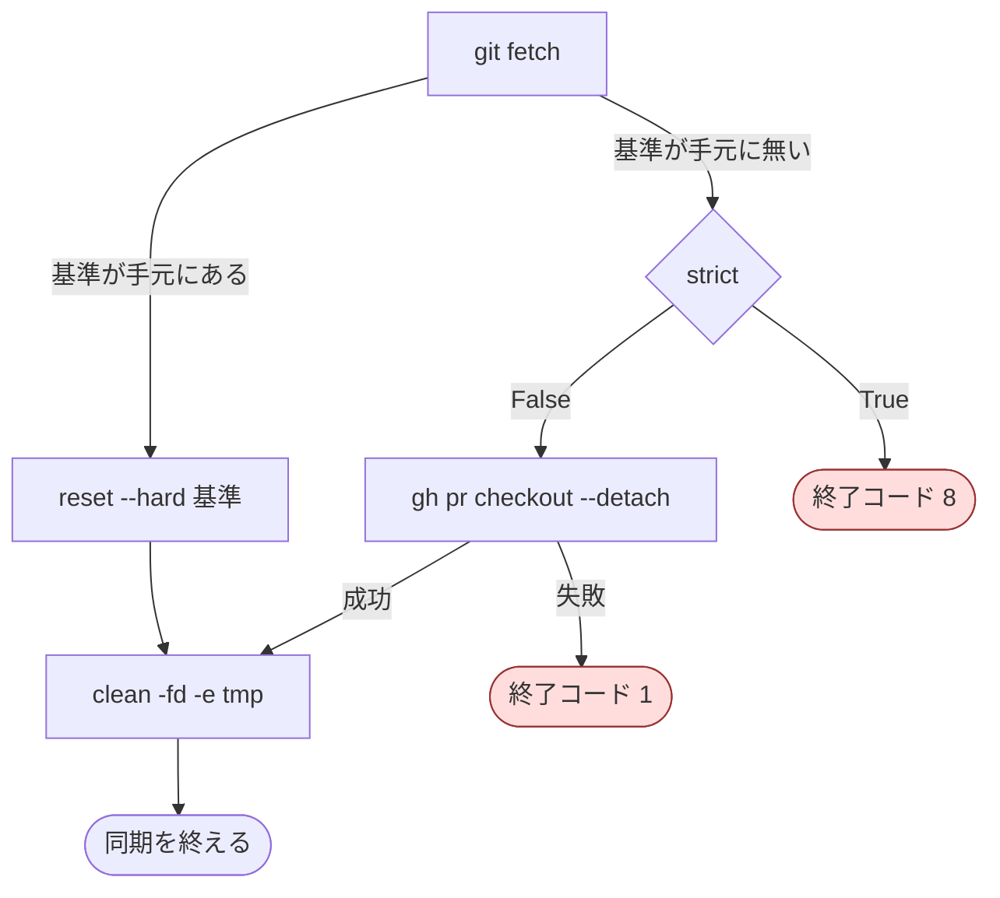
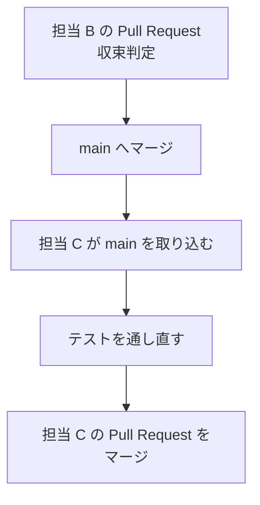

# 担当 C — レビュー用の作業ツリーをラウンドの開始時に head へ揃える（#217）

- issue: https://github.com/devbasex/ai-plugins/issues/217
- ブランチ: `fix/issue-217-sync-on-round-start`
- モード: `standard`
- Pull Request の宛先: `main`（`develop` はまだ無い）

この文書は仕様と設計を兼ねる。「受け入れ条件」までが仕様、「設計」以降が設計である
（`design` Skill の規約に従い、同じファイルの別の節として書く）。

## 用語（この文書での意味）

| 語 | この文書での意味 |
| --- | --- |
| レビュー用の作業ツリー | `cross-review` が codex / gemini に読ませるために作る git worktree。実体は `<worktree-base>/<owner>--<repo>/pr<番号>`。既定では `/tmp/ndf-worktrees/...` の下に置かれる |
| 主ディレクトリ | clone したディレクトリ。`cross-review` を起動した側がいる場所。`.worktrees/` の作業ツリーもここに含めて考える |
| head | レビュー対象の Pull Request の head branch と、その先端のコミット。先端のコミットは `gh pr view <PR> --json headRefOid` が返す値を指す（フォークの Pull Request では `origin/<head branch>` が無いため、`origin` を基準にしない） |
| フォークの Pull Request | head branch が base のリポジトリではなく、そこから fork したリポジトリにある Pull Request。`gh pr view <PR> --json isCrossRepository` が `true` を返す |
| 基準 | 作業ツリーの状態を突き合わせる相手のコミット。この文書では `headRefOid` を指す |
| 同期 | レビュー用の作業ツリーの内容を head の内容に一致させる操作 |
| ラウンド | codex / gemini が 1 回ずつレビューを投稿し、判定を経て修正までを終える 1 周 |
| 修正の工程 | ループの Step 5。`/ndf:fix` をレビュー用の作業ツリーの中で実行し、修正して push する |
| 巻き直し | PR ローテーション（Step 6）。同じブランチで作り直す `light` と、新しいブランチへ squash する `squash` の 2 つがある |
| 追跡対象外のファイル | git の管理下に無いファイル（untracked）。`.gitignore` に載っているものは含めない |
| tmp ディレクトリ | 状態ファイルと結果ファイルの置き場。既定は `<作業ツリー>/.cross_review/` |

## 何を解決するか

レビュー用の作業ツリーは、作られるときと再開するときにだけ head へ揃えられる。
**ラウンドの開始時には揃えない。** そのため、修正をレビュー用の作業ツリーの外で行って
push すると、次のラウンドは 1 つ前の内容をレビューする。

実測（PR #212、issue #217 の本文より）。

| ラウンド | 作業ツリーの HEAD | origin の先端 | 結果 |
| --- | --- | --- | --- |
| 5 | `2066e91` | `2a03298` | ラウンド 4 と同じ指摘 2 件が再び投稿された |

再び投稿された 2 件は、どちらも `2a03298` で対応済みだった。指摘した側から見ると修正が
反映されていないため、収束が遅れる。**対応済みかどうかを人が毎回確かめることになる。**

修正の工程はレビュー用の作業ツリーの中で走る設計なので（`SKILL.md` の全体フロー）、
通常の経路では作業ツリーと head は一致する。ずれるのは、進行側が手で修正した場合、
別の担当が同じ Pull Request へ push した場合、中断と再開をまたいだ場合である。
**どの経路で push されても同じ差分がレビューされる状態にする。**

## 現状（実測）

### 同期は 2 箇所からしか呼ばれない

```console
$ grep -n "_sync_worktree(" plugins/ndf/skills/cross-review/scripts/state.py
285:def _sync_worktree(worktree: str, pr: int, head_branch: str) -> None:
901:                _sync_worktree(str(wt), int(st.get("current_pr") or pr), resume_head)
935:        _sync_worktree(worktree, pr, head_branch)
```

901 行は `cmd_init` の再開の経路（#203 で入った）、935 行は `cmd_init` が既存の作業ツリーを
流用する経路である。`cmd_start_round` には無い。

### `cmd_start_round` は git に触れていない

`plugins/ndf/skills/cross-review/scripts/state.py` の 1085〜1112 行。

```python
def cmd_start_round(args: argparse.Namespace) -> None:
    """Step 1 — round 開始判定。"""
    st = _load(args.pr)
    total = len(st["rounds"])
    max_r = st["max_rounds"]
    if total >= max_r:
        st["final"] = "max_rounds"
        st["ended_at"] = _now()
        _save(args.pr, st)
        die(f"max_rounds={max_r} 到達。中断。", code=1)
    # 上限に達していれば、そこでループが終わる。後始末の検査はその後で意味を持たない。
    if total > 0:
        _guard_previous_round(st, st["rounds"][-1])

    pr = st["current_pr"]
    round_no = total + 1
    round_in_pr = sum(1 for r in st["rounds"] if r["pr"] == pr) + 1

    # round エントリを開く
    st["rounds"].append({ ... })
    _save(args.pr, st)
```

状態ファイルの読み書きと後始末の検査だけを行う。作業ツリーの内容は見ていない。

### 既存の同期処理（285〜332 行）

```python
def _sync_worktree(worktree: str, pr: int, head_branch: str) -> None:
    fetch_result = subprocess.run(["git", "fetch", "origin", head_branch], ...)
    if fetch_result.returncode == 0:
        target = f"origin/{head_branch}"
        reset = subprocess.run(["git", "reset", "--hard", target], ..., cwd=worktree)
        if reset.returncode != 0:
            die(f"worktree を {target} へ同期できない: {reset.stderr.strip()}")
    else:
        # フォーク PR は origin に head branch が無い。作成時と同じ経路で合わせる。
        checkout = subprocess.run(["gh", "pr", "checkout", str(pr), "--detach"], ..., cwd=worktree)
        if checkout.returncode != 0:
            die(f"gh pr checkout --detach #{pr} 失敗: ...")
    clean = subprocess.run(["git", "clean", "-fd"], ..., cwd=worktree)
    if clean.returncode != 0:
        die(f"追跡対象外のファイルを消せない: {clean.stderr.strip()}")
```

読み取れる性質は 4 つある。

| 性質 | 内容 |
| --- | --- |
| 無条件 | head と一致していても `git reset --hard` と `git clean -fd` を発行する |
| 失われるものを見ない | 追跡対象のファイルの変更も、origin に無いローカルのコミットも、確認せずに捨てる |
| 止める方針 | 同期できないときは `die()`（終了コードは既定の 1） |
| フォーク PR | `git fetch` に失敗したら `gh pr checkout <PR> --detach` へ落とす |

`git clean` に `-x` を付けないのは、tmp ディレクトリ（`.cross_review/`）を残すためである。
このリポジトリの `.gitignore` には 47 行目に `.cross_review/` があるため、実際に残る。
**レビュー対象のリポジトリで同じ記述がある保証は無い。**

### 同期先のブランチ名の出どころ

| 呼び出し元 | 出どころ |
| --- | --- |
| 新規の `init`（925 行） | `gh pr view <PR> --json headRefName` |
| 再開（899 行） | 状態ファイルの `head_branch` |

状態ファイルの `head_branch` は、`init` が書いた後は更新されない。巻き直しの `squash` は
新しいブランチを作るが（`rotate-pr.sh` の 232 行 `new_branch="${branch}-r$(date +%H%M%S)"`、
251 行 `git checkout -b`、259 行 `git push -u origin`）、`cmd_set_current_pr`（1731 行）が
更新するのは `current_pr` と `pr_history` だけである。

```console
$ sed -n '1731,1755p' plugins/ndf/skills/cross-review/scripts/state.py | grep -c head_branch
0
```

**つまり `squash` の巻き直しの後は、状態ファイルの `head_branch` が巻き直し前のブランチを
指したままになる。** 再開の経路（901 行）はこの値を使うため、同じ性質を持つ。

### 終了コードの割り当て

ループの骨組みは `SKILL.md` の 223 行にある。

```bash
ROUND_VARS=$("$SCRIPTS/state.py" start-round "$STATE_PR") || { RC=$?; [ "$RC" -eq 1 ] && break; exit "$RC"; }
```

**1 は「`max_rounds` に到達したのでループを抜ける」を意味する。** 同期の失敗で 1 を返すと、
上限に達したものとして最終スイープへ進む。使用済みの値は次のとおり。

| 値 | 意味 | 出どころ |
| --- | --- | --- |
| 1 | `max_rounds` 到達 → ループを抜ける | `cmd_start_round` |
| 2 | 継続 | `judge` / `check-oscillation` / `should-rotate` |
| 3 | コード関連の CI 失敗 | `merge-fix` |
| 4 | 振動検知 | `check-oscillation` |
| 5 | 前のラウンドの後始末が未了 | `cmd_start_round` |
| 6 | 最終スイープの後に未解決の指摘が残る | `verify-sweep` |
| 7 | 結果を残さなかった担当を起動し直す | `judge`（担当 B が #196 で新設する） |

**7 は担当 B が使う。** 同じバッチの担当 B が issue #196 で「結果を残さなかった担当を同じ
ラウンドで 1 度だけ起動し直す」出口に 7 を割り当てる。マージの順序が B → C であるため、
こちらは 8 を使う。8 が空いている。

### 振動検知の現状

`cmd_check_oscillation`（1439 行）は、前のラウンドと現ラウンドの `path:line` の集合の
重なりで測る。issue #217 が記録した `overlap=0/2 (0%)` は、**前のラウンドと現ラウンドが
別の内容を読んでいた**ときの値である。同期を直すと入力が揃うため、まず直してから測り直す。

## 受け入れ条件

すべて `plugins/ndf/skills/cross-review/tests/` の自動テストで確かめる。GitHub と git は
呼ばず、`subprocess.run` と `_sh` を差し替えて発行されたコマンドを検査する。

| # | 条件 | 確かめ方 |
| --- | --- | --- |
| 1 | ラウンドを開始するとき、作業ツリーが head より古ければ `git fetch` と `git reset --hard <headRefOid>` が発行される | 発行されたコマンドの列に両方が含まれる |
| 2 | ラウンドを開始するとき、作業ツリーの HEAD が `headRefOid` と一致し、変更が無ければ `git reset --hard` も `git clean` も発行しない | 発行されたコマンドの列にどちらも含まれない。標準エラーに「同期済み」が出る |
| 3 | 追跡対象のファイルに変更があるとき、ラウンドは始まらず終了コード 8 で止まる | `SystemExit.code == 8`。`git reset --hard` を発行していない |
| 4 | `headRefOid` に含まれないローカルのコミットがあるとき、ラウンドは始まらず終了コード 8 で止まる | 同上 |
| 5 | 同期に失敗したとき、ラウンドのエントリが開かれない | 状態ファイルの `rounds` の長さが呼び出しの前後で変わらない |
| 6 | 同期の失敗で終了コード 1 を返さない | `SystemExit.code != 1`。1 はループを抜ける値である |
| 7 | 同期先を `gh pr view <current_pr> --json headRefName,headRefOid,isCrossRepository` から取る | 差し替えた `gh` の応答で同期先が決まり、状態ファイルの古い `head_branch` は使われない |
| 8 | 解決したブランチ名を状態ファイルの `head_branch` へ書き戻す | ラウンドの開始後に `head_branch` が更新される |
| 9 | head を解決できないとき、終了コード 8 で止まる | `SystemExit.code == 8` |
| 10 | `strict=False` で基準を手元に持てないときは `gh pr checkout <PR> --detach` へ落ち、成功したら `git clean` まで進む | 発行されたコマンドの列に両方が含まれる |
| 11 | `git clean` が tmp ディレクトリを除外する | `git clean` の引数に `-e` と除外先が含まれ、`-x` は含まれない |
| 12 | 状態ファイルに `worktree_path` が無いときは、同期せずに続ける | 例外にならず、ラウンドが 1 つ増える |
| 13 | `init` と再開の経路の振る舞いが変わらない | 既存の 199 件が通る（`-e` の追加で 1 件だけ期待値を書き換える。後述） |
| 14 | フォークの Pull Request では `git fetch origin refs/pull/<PR>/head` を宛先にし、`origin/<head branch>` を参照しない | 差し替えた `gh` が `isCrossRepository: true` を返したとき、発行されたコマンドの列がこの宛先を含み、`origin/<head branch>` を含まない |
| 15 | `strict=True` で基準を手元に持てないときは、`gh pr checkout --detach` を発行せず終了コード 8 で止まる | `SystemExit.code == 8`。発行されたコマンドの列に `gh pr checkout` が含まれない |

`uv run --with pytest pytest plugins/ndf/skills/cross-review/tests -q` で確認する。

## 対象範囲

### 含む

- `plugins/ndf/skills/cross-review/scripts/state.py` の `cmd_start_round`（1085 行付近）と
  `_sync_worktree`（285 行付近）、およびその周辺に新設する補助関数
- `plugins/ndf/skills/cross-review/tests/` の新規テストと、`test_state_sync_worktree.py` の
  期待値の更新
- `plugins/ndf/skills/cross-review/SKILL.md` の**作業ツリーの同期に関する記述だけ**
  （120 行の表の 2 行目と、`<worktree-base>` の解決順の節）
- `plugins/ndf/skills/cross-review/docs/01-state-and-review.md` の Step 1 の節（184〜196 行）と、
  worktree 作成の節（157〜176 行）

### 含まない

| 対象 | 理由 |
| --- | --- |
| `cmd_judge`（1396 行付近）・`_round_passes`（1018 行付近）・`_is_pass`（1005 行付近） | 担当 B が触る |
| `SKILL.md` の収束判定と全体フローの節 | 担当 B が触る |
| `cmd_check_oscillation`（1439 行付近） | 決定の記録 D6 を参照。別に起票する |
| `rotate-pr.sh` と `cmd_set_current_pr` | 決定の記録 D5 を参照。別に起票する |
| `_create_worktree`（229 行） | 作成の直後は head と一致している。同期の対象にならない |
| `scripts/lib/` の共通層 | `cross-refactoring` も使う。この変更では触らない |

## 設計

### 構成要素

| 要素 | 種別 | 役割 |
| --- | --- | --- |
| `cmd_start_round` | 既存（変更） | ラウンドを開く前に同期を差し込む |
| `HeadRef` | 新設 | `head_branch` / `head_oid` / `is_fork` の 3 つを持つ `NamedTuple` |
| `_resolve_head_ref(pr)` | 新設 | `gh pr view <pr> --json headRefName,headRefOid,isCrossRepository` を 1 回呼び、`HeadRef` を返す。失敗したら終了コード 8 で止める |
| `_fetch_head(worktree, pr, head)` | 新設 | 取り込みの宛先を Pull Request の種別で決めて `git fetch` し、基準のコミットが手元にあるかを返す |
| `_sync_worktree(worktree, pr, head, *, strict=False)` | 既存（第 3 引数を `HeadRef` へ広げ、`strict` を追加） | 同期の本体。`strict` で失われるものの扱いと終了コードを切り替える |
| `_sync_exclusions(worktree)` | 新設 | `git clean` から外すパスの一覧を返す |
| `_worktree_changes(worktree, exclusions)` | 新設 | 追跡対象の変更と追跡対象外のファイルを分けて返す |

### 触る領域

| 領域 | 有無 | 備考 |
| --- | --- | --- |
| 永続データ | 無 | 状態ファイルの `head_branch` を書き戻すのみ。項目は増やさない |
| API の契約 | 無 | |
| 画面 | 無 | |
| 外部との入出力 | 有 | `gh pr view` を 1 ラウンドにつき 1 回追加する（取る項目は `headRefName` / `headRefOid` / `isCrossRepository` の 3 つで、呼び出しは 1 回のまま）。`git fetch` も 1 回増える |
| 終了コード（呼び出し側との契約） | 有 | `start-round` に 8 を追加する。ループの骨組みは `exit "$RC"` で素通しするため、bash 側の変更は要らない |

### 処理の流れ



**同期はラウンドのエントリを開く前に行う。** 途中で止まったときにラウンドが半端に開かれず、
原因を取り除いた後に同じラウンド番号から再開できる。

### 基準の取り込みとフォークの Pull Request

**比較の基準はコミット（`headRefOid`）で、`origin/<head branch>` ではない。** フォークの
Pull Request では head branch が base のリポジトリに無いため、`origin/<head branch>` は
解決できない。基準を ref で持つと、未 push のコミットの検出（`git rev-list 基準..HEAD`）も
HEAD の一致判定も、フォークのときだけ行えなくなる。コミットで持てば種別によらず同じ形で
比べられる。

取り込みの宛先だけが種別で変わる。

| 種別 | 取り込み | 根拠 |
| --- | --- | --- |
| 同じリポジトリ | `git fetch origin <head branch>` | 既存の経路。`origin/<head branch>` も更新される |
| フォーク | `git fetch origin refs/pull/<PR>/head` | GitHub は base のリポジトリ側に Pull Request ごとの `refs/pull/<番号>/head` を持つ |

`refs/pull/<番号>/head` が base のリポジトリから引けることは実測で確かめた。

```console
$ git ls-remote origin 'refs/pull/230/head'
5d9e0d6f046906c70dc3a7bf13b730c1f38bc3b1	refs/pull/230/head
$ gh pr view 230 --json headRefName,headRefOid,isCrossRepository
{"headRefName":"docs/parallel-batch-03-design","headRefOid":"5d9e0d6f046906c70dc3a7bf13b730c1f38bc3b1","isCrossRepository":false}
```

取り込みの後、`git cat-file -e <headRefOid>^{commit}` で基準が手元にあることを確かめる。
`gh pr view` と `git fetch` の間に head が動いていると、取り込んだ内容に基準が含まれない。

基準を手元に持てなかったときの行き先は `strict` で分かれる。



**`gh pr checkout --detach` は `strict=False` の経路にだけ残す。** この操作は HEAD を動かすが、
動かす前に何が失われるかを判定する材料が無い（基準が手元に無いのだから、未 push のコミットを
数えられない）。`strict=True` は失われるものがあるときに止める約束なので、判定できない状態で
この操作を発行すると約束が守れない。`strict=False` はもともとすべて捨てる方針であるため、
これまでどおり落として構わない。**`strict=True` でこの経路に落ちるのは、`gh pr view` が
返した基準を `git fetch` で取り込めないときだけであり、そのまま止めても失うものは無い。**

### `strict` が変えること

| 観点 | `strict=False`（`init` / 再開） | `strict=True`（ラウンドの開始） |
| --- | --- | --- |
| head と一致していて変更が無いとき | reset と clean を発行する | 何もしない |
| 追跡対象のファイルに変更があるとき | 捨てる | 止める |
| 基準に無いローカルのコミット | 捨てる | 止める |
| 追跡対象外のファイル | 消す | 消す |
| 基準を手元に持てないとき | `gh pr checkout --detach` へ落とす | 止める |
| 止めるときの終了コード | 1 | 8 |

`init` の側を変えないのは、そこで見つかる残骸が**前回の実行のもの**だからである。ラウンドの
開始時に見つかる変更は、**同じループの修正の工程が今まさに残したもの**であり、意味が違う。

### 状態の読み取りで気をつける点

`git status --porcelain` の出力は先頭 2 文字が状態、3 文字目が空白、4 文字目からがパスである。
**行全体を `strip()` しない。** 先頭が空白の状態（` M path` など）で 1 文字ずれる
（v9.2.1 で同じ形の不具合を直している）。`line[:2]` と `line[3:]` で読む。

### `git clean` の除外

`git clean -fd` に `-e <除外先>` を足す。除外先は次の 2 つ。

1. `.cross_review`（既定の tmp ディレクトリ名）
2. `CROSS_REVIEW_TMP_DIR` が作業ツリーの中を指しているときの、その相対パス

除外は `strict` の値によらず常に付ける。`init` の 1 回では表に出にくいが、ラウンドごとに
実行すると、tmp ディレクトリを `.gitignore` に持たないリポジトリで状態ファイルと
結果ファイルが毎ラウンド消える。消えると次の読み込みで止まり、振動検知は前のラウンドの
`payload.json` を失う。

## 決定の記録

### D1 — 毎ラウンド確認し、差分があるときだけ書き換える

**結論**: `git fetch` と比較は毎ラウンド行う。`git reset --hard` と `git clean` は、
head と一致していないか作業ツリーに変更があるときだけ行う。

**理由**: 差分の有無は fetch しないと分からないため、確認は毎回要る。一方で reset と clean は
失われるものがある操作なので、必要なときだけ実行する。

**採らなかった案**

| 案 | 採らなかった理由 |
| --- | --- |
| 無条件に毎ラウンド reset と clean を実行する | 実装は最短だが、head と一致している場面でも作業ツリーを掃除する。修正の工程がレビュー用の作業ツリーに残した証跡（ログ・出力）を、同期の必要が無いときにも消す |
| 前のラウンドに修正の記録があるときだけ同期する | 判定の材料が状態ファイルの申告になる。#217 で観測されたのは作業ツリーの外で push された経路であり、申告からは見えない |

### D2 — 同期の失敗では止める。ラウンドの開始からの終了コードは 8

**結論**: `git reset --hard` に失敗した場合と `git clean` に失敗した場合は、どちらの経路でも
止める。基準を手元に持てないときの行き先だけが `strict` で分かれる。

| 経路 | 基準を手元に持てないとき | 止めるときの終了コード |
| --- | --- | --- |
| `strict=False`（`init` / 再開） | `gh pr checkout <PR> --detach` へ落とし、それにも失敗したら止める | 1 |
| `strict=True`（ラウンドの開始） | `gh pr checkout` を発行せずその場で止める | 8 |

**`gh pr checkout --detach` へ落ちるのは `strict=False` の経路だけである。** ラウンドの開始は
`git fetch` の後に `git cat-file -e <headRefOid>^{commit}` で基準のコミットを確かめ、
無ければ終了コード 8 で止める（受け入れ条件 15）。落とさない理由は「基準の取り込みと
フォークの Pull Request」に書いた。

**理由**: 古い差分をレビューさせるより止める。これは既存の `_sync_worktree` の方針と同じで、
`docs/01-state-and-review.md` の 164 行にも「同期できないときは止める」と書かれている。
8 を使うのは、1 がループを抜ける値だからである。1 を返すと、同期できない状態が
「`max_rounds` に到達した」として最終スイープへ進む。

**採らなかった案**

| 案 | 採らなかった理由 |
| --- | --- |
| 警告して続ける | #217 が直らない。古い差分のままレビューが回る。警告は heartbeat の出力に埋もれる |
| 既存と同じ終了コード 1 を使う | ループを抜けて最終スイープへ進む。同期できない原因が残ったまま完了報告に到達する |

**「同期の対象が無い」と「同期できない」は分けて扱う。** 状態ファイルに `worktree_path` が
無い、または登録済みの作業ツリーでない場合は、同期せずに警告して続ける。作業ツリーが
失われている状態は、この後の `launch-codex.sh` / `launch-gemini.sh` が表に出す。
ここで止めても分かることは増えない。

### D3 — 未コミットの変更は、種類で分ける

**結論**: 追跡対象のファイルの変更と、基準に含まれないローカルのコミットが
あるときは止める。追跡対象外のファイルは消す（tmp ディレクトリを除く）。

**理由**: 前者は、修正の工程が push を終えていないことの証拠である。消すと修正そのものが
失われ、しかも失われたことが誰にも見えない。後者は前回の実行の残骸で、残すと修正の担当が
`git add -A` を使ったときに Pull Request へ混ざる（既存の `_sync_worktree` の理由と同じ）。

**採らなかった案**

| 案 | 採らなかった理由 |
| --- | --- |
| `init` と同じくすべて捨てる | 修正の工程が commit まで済ませて push に失敗した場合、その修正が消える |
| 変更があるときは同期を飛ばす | 古い差分のままレビューが回る。#217 が直らない |
| `git stash` へ退避する | 退避したものを戻す担い手がいない。作業ツリーは使い捨てなので、退避だけが積み上がる |

### D4 — 同期の処理は 1 つに保つ

**結論**: `_sync_worktree` を 1 つに保ち、`init` の流用・再開・ラウンドの開始の 3 箇所から
呼ぶ。違いは `strict` の 1 つの真偽値で表す。

**理由**: フォーク PR のフォールバック（`gh pr checkout --detach`）を 2 箇所に置かない。
置くと、片方だけを直した状態が生まれる。

**採らなかった案**

| 案 | 採らなかった理由 |
| --- | --- |
| ラウンドの開始専用の関数を新設する | フォーク PR の経路が二重になる |
| 3 箇所すべてを `strict` にする | 前回の実行が残した変更で `init` が止まり、レビューを始められない |
| `strict` と終了コードを別々の引数にする | 呼び出し側が 2 つの値を揃える必要が出る。組み合わせは 2 通りしか使わない |

### D5 — 同期先のブランチ名は毎ラウンド取り直し、状態ファイルへ書き戻す

**結論**: `gh pr view <current_pr> --json headRefName,headRefOid,isCrossRepository` で取り直す。
取れた `headRefName` を状態ファイルの `head_branch` へ書き戻す。

**理由**: `squash` の巻き直しは `<branch>-r<HHMMSS>` という新しいブランチを作るが、
`cmd_set_current_pr` は `head_branch` を更新しない。状態ファイルの値をそのまま使うと、
**巻き直しの後に巻き直し前のブランチへ戻すことになる。** 現在の `current_pr` の head は
GitHub 側にしか無いため、そこから取る。書き戻すと、再開の経路（901 行）も現在の head を
見るようになる。

**採らなかった案**

| 案 | 採らなかった理由 |
| --- | --- |
| 状態ファイルの `head_branch` をそのまま使う | 巻き直しの後に誤る |
| 巻き直しの側（`rotate-pr.sh` / `cmd_set_current_pr`）で `head_branch` を更新する | 直し方としては筋が良い。ただし変更が巻き直しの経路へ広がり、この Pull Request の範囲が同期から外れる。**別に起票する**（この変更の後で単独で行える） |
| `gh pr view` の失敗時に状態ファイルの値へ落とす | 巻き直しの後は古い値なので、落ちた先が誤る。落とさずに止める |

### D6 — 振動検知には手を入れない

**結論**: `cmd_check_oscillation` は変更しない。

**理由**: 振動検知は `path:line` の集合の重なりで測る。#217 が記録した `overlap=0/2 (0%)` は、
前のラウンドと現ラウンドが**別の内容を読んでいた**ときの値である。読む内容が揃えば入力が
変わるため、まず同期を直してから測り直す順になる。文字列としての一致では拾えない同じ指摘を
どう数えるかは判定方法の設計であり、この変更とは別の題である。

`out-of-scope` に従い、**その場で起票する**。起票する内容は次の 2 件。

1. 巻き直しの後に状態ファイルの `head_branch` が古いままになる（D5 の 2 つ目の案）
   → [#244](https://github.com/devbasex/ai-plugins/issues/244)
2. 振動検知が `path:line` の一致だけで測るため、同じ趣旨の指摘を別の箇所に出されると拾えない
   → [#246](https://github.com/devbasex/ai-plugins/issues/246)

### D7 — `git clean` から tmp ディレクトリを外す

**結論**: `-e` で除外する。`strict` の値によらず常に付ける。

**理由**: 状態ファイルと結果ファイルは tmp ディレクトリにある。`.cross_review/` が
`.gitignore` に載っているのはこのリポジトリの都合で（`.gitignore` の 47 行目）、レビュー対象の
リポジトリで載っている保証は無い。載っていない場合、ラウンドごとの `git clean -fd` が
状態ファイルと `payload.json` を消す。`init` の 1 回では表に出にくく、毎ラウンド行うと踏む。

### D8 — 比較の基準はコミットにする

**結論**: 突き合わせる相手を `gh pr view --json headRefOid` が返すコミットにする。
`origin/<head branch>` は使わない。取り込みの宛先だけを Pull Request の種別で変える。

**理由**: フォークの Pull Request では head branch が base のリポジトリに無く、
`origin/<head branch>` が解決できない。ref を基準に据えると、未 push のコミットの検出と
HEAD の一致判定がフォークのときだけ行えなくなる。**#217 の目的は古い差分でレビューさせない
ことなので、判定できない種別を残すと目的が半分しか満たせない。**

**採らなかった案**

| 案 | 採らなかった理由 |
| --- | --- |
| フォークのときは同期を飛ばす | 古い差分のままレビューが回る。#217 が直らない |
| フォークのときだけ `gh pr checkout --detach` で合わせる | HEAD は合うが、動かす前に未 push のコミットを数えられない。`strict=True` の約束（失われるものがあれば止める）を守れない |
| `isCrossRepository` を見ず、常に `refs/pull/<PR>/head` を宛先にする | 種別の分岐は消えるが、同じリポジトリの Pull Request で `origin/<head branch>` が更新されなくなる。既存のテストと `init` の経路が見ている前提を、この変更の範囲の外で変えることになる |
| head branch を fork の remote として登録する | remote が作業ツリーごとに増え、後始末の担い手がいない |

## テスト設計

### 新規: `tests/test_state_start_round_sync.py`

`test_state_round_guard.py` の足場に揃える（`CROSS_REVIEW_TMP_DIR` を `tmp_path` へ向け、
状態ファイルを直接書く）。`subprocess.run` は `test_state_sync_worktree.py` の `_Recorder` と
同じ形で差し替え、`_resolve_head_ref` と `_is_registered_worktree` は `monkeypatch` で
差し替える。

| テスト | 何を確かめるか | 受け入れ条件 |
| --- | --- | --- |
| `test_syncs_before_opening_a_round` | 作業ツリーが古いとき、fetch と reset が発行される。ラウンドは同期の後に開く | 1 |
| `test_does_nothing_when_already_at_head` | HEAD が `headRefOid` と一致し変更が無ければ、reset も clean も発行しない | 2 |
| `test_stops_when_tracked_files_are_modified` | 追跡対象の変更があるとき終了コード 8 で止まり、reset を発行しない | 3, 6 |
| `test_stops_when_local_commits_are_not_pushed` | `<headRefOid>..HEAD` が 0 でないとき終了コード 8 で止まる | 4, 6 |
| `test_no_round_is_opened_when_sync_fails` | 止まったとき `rounds` の長さが変わらない | 5 |
| `test_head_ref_comes_from_github` | 状態ファイルの古い `head_branch` ではなく `gh pr view` の応答で同期先が決まる | 7 |
| `test_resolved_head_branch_is_written_back` | ラウンドの開始後、状態ファイルの `head_branch` が更新される | 8 |
| `test_stops_when_head_ref_cannot_be_resolved` | head を解決できないとき終了コード 8 | 9 |
| `test_fetches_the_pull_ref_for_a_fork` | `isCrossRepository: true` のとき `refs/pull/<PR>/head` を取り込み、`origin/<head branch>` を参照しない | 14 |
| `test_strict_stops_when_the_base_commit_is_missing` | `strict=True` で基準が手元に無いとき、`gh pr checkout` を発行せず終了コード 8 で止まる | 15 |
| `test_continues_without_a_worktree_path` | `worktree_path` が無い状態ファイルでも例外にならず、ラウンドが 1 つ増える | 12 |

### 既存への追加: `tests/test_state_sync_worktree.py`

| テスト | 何を確かめるか | 受け入れ条件 |
| --- | --- | --- |
| `test_excludes_the_tmp_dir_from_clean` | `git clean` の引数に `-e` と除外先が含まれ、`-x` は含まれない | 11 |
| `test_strict_mode_keeps_tracked_changes` | `strict=True` で追跡対象の変更があるとき、reset を発行せずに止める | 3 |
| `test_falls_back_to_gh_pr_checkout` | 既存。`strict=False` で基準を手元に持てないとき、`gh pr checkout --detach` の後に `git clean` まで進む | 10 |

**既存の `test_removes_untracked_leftovers` は期待値を書き換える。** 現在は
`["git", "clean", "-fd"] in rec.commands()` という完全一致で見ており、`-e` を足すと一致
しなくなる。先頭 3 語の一致と、`-e` の有無、`-x` が無いことを見る形へ変える。**この 1 件が、
既存の 199 件のうち書き換えが要る唯一のテストである。**

### 実行

```bash
uv run --with pytest pytest plugins/ndf/skills/cross-review/tests -q
```

変更の前は 199 件が通る（実測）。

## 担当 B との境界とマージの順序

### 境界

| 対象 | 担当 |
| --- | --- |
| `state.py` の `cmd_judge`（1396 行付近）・`_round_passes`（1018 行付近）・`_is_pass`（1005 行付近） | B |
| `state.py` の `cmd_start_round`（1085 行付近）・`_sync_worktree`（285 行付近）とその周辺 | C |
| `SKILL.md` の収束判定と全体フローの節 | B |
| `SKILL.md` の作業ツリーの同期の節（120 行の表と `<worktree-base>` の節） | C |
| `docs/01-state-and-review.md` の Step 3 と判定の節 | B |
| `docs/01-state-and-review.md` の worktree の節（157〜176 行）と Step 1 の節（184〜196 行） | C |

`cmd_start_round` は担当 C が触るが、その中から呼ばれる `_guard_previous_round` は
担当 B の判定と関わる。**担当 C は `_guard_previous_round` の中身を変更しない。** 同期は
`_guard_previous_round` の呼び出しの後、ラウンドのエントリを開く前に差し込む。

### マージの順序

**B → C の順にマージする。** 担当 C の Pull Request は、担当 B のマージの後に `main` を
取り込んでから検証する。



同じファイルの別の関数を触るため、git は自動で解決できる見込みが高い。解決できない場合でも
**担当 B の側を優先し、担当 C の変更を載せ直す**。取り込んだ後は
`uv run --with pytest pytest plugins/ndf/skills/cross-review/tests -q` を通し直す。

## 完了条件

- [ ] ラウンドの開始時に、レビュー用の作業ツリーが Pull Request の head へ揃う
- [ ] head と一致していて変更が無いときは、`git reset --hard` も `git clean` も発行しない
- [ ] 追跡対象のファイルの変更と、未 push のローカルのコミットがあるときは、終了コード 8 で止まる
- [ ] 同期に失敗したときにラウンドのエントリが開かれない
- [ ] 同期の失敗で終了コード 1 を返さない
- [ ] 同期先を `gh pr view` から取り、`headRefName` を状態ファイルの `head_branch` へ書き戻す
- [ ] フォークの Pull Request でも、基準のコミットを取り込んで一致判定と未 push のコミットの検出ができる
- [ ] `strict=True` で基準を手元に持てないときは、`gh pr checkout --detach` を発行せずに終了コード 8 で止まる
- [ ] `git clean` が tmp ディレクトリを除外する
- [ ] `init` と再開の経路の振る舞いが変わらない
- [ ] 上記に対応する自動テストがあり、`uv run --with pytest pytest plugins/ndf/skills/cross-review/tests -q` が通る
- [ ] 既存の 199 件が通る（`test_removes_untracked_leftovers` の期待値の更新を含む）
- [ ] `SKILL.md` の作業ツリーの同期の節と `docs/01-state-and-review.md` の Step 1 に、ラウンドの開始時の同期と終了コード 8 が書かれている
- [x] D5 と D6 で範囲外とした 2 件を起票し、issue 番号をこの文書へ追記する（#244 / #246）
- [ ] 担当 B のマージの後に `main` を取り込み、テストを通し直した

## 参照

- `plugins/ndf/skills/cross-review/scripts/state.py` — `_sync_worktree`（285 行）、`cmd_init`（838 行）、`cmd_start_round`（1085 行）、`cmd_check_oscillation`（1439 行）、`cmd_set_current_pr`（1731 行）
- `plugins/ndf/skills/cross-review/scripts/rotate-pr.sh` — `squash` の巻き直し（232 行、251 行、259 行）
- `plugins/ndf/skills/cross-review/SKILL.md` — 事前確認の表（120 行）、ループの骨組み（223 行）
- `plugins/ndf/skills/cross-review/docs/01-state-and-review.md` — worktree の同期（157〜176 行）、Step 1（184〜196 行）
- `plugins/ndf/skills/cross-review/tests/test_state_sync_worktree.py` — 同期のテストの足場
- `plugins/ndf/skills/cross-review/tests/test_state_round_guard.py` — `cmd_start_round` のテストの足場
- issue #203 — 再開の経路へ同期を入れた変更
