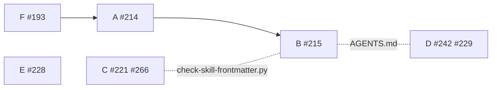

# 並行開発 バッチ 05 — 全体指示

8 件の課題を同時に進めるための指示書である。**各担当は、この文書と自分の担当ファイルの
両方を読んでから着手する。** この文書は、担当どうしが同じ行を書き換えないための境界と、
着手の順序と、設計で確定した担当をまたぐ約束を定める。担当ファイルだけでは、境界と順序が
分からない。

## 着手する前に知っておくこと

| 項目 | 現在の状態 |
| --- | --- |
| 現行版 | **9.8.0-dev.1**（開発版。`develop` に載る。`main` は `9.7.0`） |
| 開発の起点 | **`develop`**。`.ndf/worktree.json` の `base_branch` が宣言している |
| Pull Request の宛先 | **`develop`**。`--base develop` を必ず付ける |
| 配布の時期 | **このバッチのマージがすべて終わった後**。個別には版を上げない |
| `/goal` で工程を通すとき | 設計レビューのマージ前で 1 度止まり、承認を待つ（`development-workflow` の該当節） |

**このバッチの 8 件は、バッチ 04 が「次のまとまりへ回す」と明記して外したものである**
（[バッチ 04 の全体指示](../old/parallel-batch-04/00-overview.md) の「このバッチに入れなかった
課題」）。#266 と #221 は「#265 の運用を先に見る」として保留していたが、運用者の判断で着手する。

## 用語

| 語 | この文書での意味 |
| --- | --- |
| 担当 | 1 件以上の課題を最後まで進める実行主体。1 担当 = 1 作業ツリー = 1 Pull Request |
| 検査 | `scripts/` 配下のスクリプトが行う機械的な突き合わせ |
| 起点 | 開発の本流のブランチ。このリポジトリでは `develop` |
| 収束 | `cross-review` で 2 つの外部 AI の両方が承認した状態 |
| 参加 CLI | 外部 AI として委譲する先の CLI。現在は codex / gemini / kiro-cli / claude |
| 配布先ランタイム | Skill・エージェント・hook を配る先。現在は Claude Code / Codex / Kiro |

**参加 CLI と配布先ランタイムは別の概念である。** #214 は前者を、#215 は後者を扱う。

## 担当と課題

| 担当 | 課題 | モード | ブランチ | 指示書 |
| --- | --- | --- | --- | --- |
| A | `gemini` の呼び出しと記述を `agy` へ置き換える（#214） | `architecture` | `feature/issue-214-agy-cli` | [01-issue-214.md](01-issue-214.md) |
| B | 配布先ランタイムへ `agy` を加える（#215） | `architecture` | `feature/issue-215-agy-runtime` | [02-issue-215.md](02-issue-215.md) |
| C | 工程の飛ばしを検知し、設計 Pull Request のマージを承認に縛る（#221 / #266） | `architecture` | `feature/issue-221-266-stage-guard` | [03-issue-221-266.md](03-issue-221-266.md) |
| D | 振り返りの記録先と、起票先の判断（#242 / #229） | `standard` | `feature/issue-242-229-retrospective` | [04-issue-242-229.md](04-issue-242-229.md) |
| E | `release` に配備の完了の確かめ方を書く（#228） | `standard` | `feature/issue-228-release-completion` | [05-issue-228.md](05-issue-228.md) |
| F | `$NDF_SCRIPTS` の解決手順を与える（#193） | `standard` | `fix/issue-193-ndf-scripts` | [06-issue-193.md](06-issue-193.md) |

各担当の指示書は受け入れ条件・設計・決定の記録・テスト設計を持つ。実装へ入る前にこの 4 つを
書き終える（バッチ 03 / 04 と同じ進め方）。

**8 件のうち `light` は 1 件も無い。** 全員が設計工程を通る。設計 Pull Request は
**6 担当分をまとめて 1 本**にする（設計文書が別々のファイルにあり、同じ行を書き換えないため）。

## 担当どうしの境界

| 担当 | 書き換えてよいパス | 触らないパス |
| --- | --- | --- |
| A | `plugins/ndf/skills/cross-review/` / `cross-refactoring/` / `external-ai/` / `fix/SKILL.md` / `issue-plan-strategy/SKILL.md` / `pr-review/SKILL.md` / `worktree/` の `gemini` の記述 / `plugins/ndf/scripts/lib/worktree-common.sh` / `plugins/ndf/scripts/worktree-guard.sh` / `.ndf/worktree.json` | `scripts/` / 説明文書 / `development-workflow/` / `merged/` / `retrospective/` / `out-of-scope/` / `release/` |
| B | `plugins/ndf/dev.agy/`（新設） / `plugins/ndf/manifests/` / `.agents/` / `scripts/` / `plugins/ndf/skills/README.md` / 説明文書一式 / `docs/specifications/` / `plugins/ndf/skills/worktree/tests/` の**新しいファイル** / 「`$SCRIPTS` を決める」節の候補の一覧（下の例外） / `worktree/tests/test_scripts_reference.py` への agy の配置の追記（下の例外） | `plugins/ndf/skills/<Skill 名>/` の SKILL.md と参照（例外は候補の一覧の 1 箇所） / `worktree/tests/` の既存ファイル（例外は `test_scripts_reference.py`） / `plugins/ndf/scripts/`（担当 A のマージ後に触る） |
| C | `plugins/ndf/skills/development-workflow/` / `plugins/ndf/skills/merged/` | `release/` / `retrospective/` / `out-of-scope/` / `worktree/` / `scripts/` / 説明文書 |
| D | `plugins/ndf/skills/retrospective/` / `plugins/ndf/skills/out-of-scope/` / `AGENTS.md` のドキュメント表の行 | `development-workflow/` / `release/` / `scripts/` / `AGENTS.md` の他の節 |
| E | `plugins/ndf/skills/release/` | 他のすべての Skill / `scripts/` / 説明文書 |
| F | `plugins/ndf/skills/worktree/` の `$NDF_SCRIPTS` の行 / `worktree/tests/test_scripts_reference.py`（新設） | `worktree/` の `gemini` の記述（担当 A が持つ） / `merged/`（担当 C が持つ） / `development-workflow/references/projects-tracking.md`（担当 C が持つ） |

### 説明文書は担当 B が独占する

`README.md` / `CLAUDE.md` / `plugins/ndf/README.md` / `.claude-plugin/marketplace.json` /
`plugins/ndf/.claude-plugin/plugin.json` / `plugins/ndf/.codex-plugin/plugin.json` は**担当 B が
持つ**。#215 が 3 ランタイム構成の記述を 4 ランタイムへ全面的に書き直すため、他の担当が同じ
ファイルへ手を入れると衝突する。

**例外は `AGENTS.md` のドキュメント表の行だけである。** 担当 D の #242 が
`docs/development-history/` の説明を直す。担当 B が触る「NDFプラグインについて」「版の付け方と
開発版の配布」の節とは別の位置にあるため、行単位で分ける。

**担当 A は説明文書を触らない。** `gemini` の記述の書き換えは担当 B が 4 ランタイム化と
まとめて行う。担当 A の指示書へ、書き換えるべき記述の一覧を残す。

### 担当 F と A は `worktree/` で接する

`plugins/ndf/skills/worktree/SKILL.md` と `references/declaration.md` は、
**`$NDF_SCRIPTS` の行（担当 F）**と**`gemini` の記述（担当 A）**の両方を持つ。行が違うため
git は自動でマージできるが、**マージの順序は F → A とする**。担当 A は起点を取り込んでから
`worktree/` に手を付ける。

### 担当 C と F は参照の解決手順で接する

`$SCRIPTS` の解決手順の本体は
`plugins/ndf/skills/development-workflow/references/projects-tracking.md` にある（#193 の
「検討の材料」が指しているもの）。**この参照は担当 C が持つ。** 突き合わせた結果、担当 F は
この節を動かさず、そのまま指す設計を採る（後段の「「`$SCRIPTS` を決める」節は動かさない」）。
担当 C はこの節の本文を変えない。

### 担当 A と B は `agy` の扱いで接する

| 何を決めるか | 持ち主 |
| --- | --- |
| 参加 CLI の母集合に `agy` を入れる | 担当 A |
| 起動オプションの対応（`--add-dir` / `--dangerously-skip-permissions` など） | 担当 A |
| 配布先ランタイムとしての `agy`（`plugin.json` / `hooks.json` / manifest） | 担当 B |
| `worktree-common.sh` の `toolCall.args` からパスを取り出す経路 | 担当 B（担当 A のマージ後） |
| 「`$SCRIPTS` を決める」節の候補の一覧へ agy の導入先を足す | 担当 B（下の「解決手順の候補への agy の追加は担当 B が持つ」） |

**マージの順序は A → B とする。**

## 設計で確定したこと

6 担当の設計を突き合わせた結果、着手前の想定から変わった点と、担当をまたぐ約束をここへ集める。
**各担当は自分の指示書に加えて、この節を読む。**

### 担当 B は `plugins/ndf/plugin.json` を新設しない

課題 #215 の本文は「ルート直下の `plugin.json` を新設する」としていた。**担当 B の実測で、
これを置くと Codex の配布 Skill が 31 個から `skills/` の実体 33 個へ変わることが分かった。**
増える 2 個は Claude Code だけで動くものである。

agy 向けの定義は `plugins/ndf/dev.agy/` へ置く。Kiro CLI 向けの `dev.kiro/` と同じ位置づけで、
Agent Plugins 1.0.0 §8.2 のクライアント拡張ディレクトリにあたる。

**この変更は課題の本文へ追記する。** 本文の前提と設計の結論が食い違ったまま残らないようにする。

### 版数を持つ箇所が 13 から 15 になる

`plugins/ndf/dev.agy/plugin.json` の `version` と `description` が加わる。`AGENTS.md` の
「検査が突き合わせる 13 箇所」の表と検査（`scripts/check-doc-staleness.py`）は**担当 B が直す**。

### `scripts/check-skill-frontmatter.py` の許可する項目名は担当 C が持つ

境界表では `scripts/` を担当 B の持ち分としているが、**この 1 箇所だけは担当 C が持つ**。

担当 C は `development-workflow` の frontmatter へ `hooks` を足す。いまの検査はこれを未知の
項目名として落とす（実測済み）。**担当 C の Pull Request の中で検査が通る必要があるため、
同じ Pull Request へ入れる。**

| ファイル | 担当 C が触る箇所 | 担当 B が触る箇所 |
| --- | --- | --- |
| `scripts/check-skill-frontmatter.py` | 許可する項目名へ `hooks` を足す | 対応ランタイムの一覧（3 箇所）と agy の予算 |

**先にマージされた側の変更を、後の側が取り込んでから続ける。**

### 「`$SCRIPTS` を決める」節は動かさない

担当 F は既存の節をそのまま指す設計を採り、担当 C はその本文を変えない前提で設計している。
**両者の前提は一致している。** 節の置き場所の見直しは
[#282](https://github.com/devbasex/ai-plugins/issues/282) が扱う。

### 解決手順の候補への agy の追加は担当 B が持つ

担当 B が agy を配布先ランタイムへ加えるため、`$SCRIPTS` の解決手順が試す候補も 3 ランタイム分の
ままでは足りない。**agy へ導入した配置から `worktree` の手順を実行しても、候補が 1 つも当たらない。**

`agy plugin install` はプラグインのディレクトリ全体を
`~/.gemini/config/plugins/<plugin.json の name>/` へ複製し、`dev.agy/scripts` の symlink は実体へ
解決して複製される（`02-issue-215.md` の実測）。導入先は `~/.gemini/config/plugins/ndf/scripts`
になる。手元では未導入のため、複製の先のディレクトリだけを確かめた。

```console
$ agy --version
1.1.24
$ ls -ld ~/.gemini/config/plugins
drwxr-xr-x 2 ubuntu ubuntu 4096 Sep  3 01:33 /home/ubuntu/.gemini/config/plugins
$ agy plugin list
No imported plugins.
```

**この 1 箇所だけは担当 B が持つ。** 節そのものは担当 C の持ち物だが、agy を配布先ランタイムへ
加えることに伴う変更は担当 B がまとめて持つ（manifest・検査・実機確認と同じ）。導入先を実測した
のも担当 B である。`scripts/check-skill-frontmatter.py` の 1 項目を担当 C が持つのと、向きが逆の
同じ例外にあたる。

| ファイル | 担当 B が触る箇所 | 担当 C が触る箇所 |
| --- | --- | --- |
| `development-workflow/references/projects-tracking.md` | 「`$SCRIPTS` を決める」節の候補の一覧と、その上の対応表への agy の行 | 触らない（節の本文は動かさない） |
| `development-workflow/tests/test_projects_scripts_lookup.py` | agy の配置を作る枝 | 他の枝 |

**担当 F の設計は 3 ランタイム前提のままで成立する。** 担当 F が担当 C と突き合わせた 3 つの前提
（節の位置と見出し・変数名 `SCRIPTS`・決まらないときに空の値を残すこと）は、候補が 1 つ増えても
崩れない。マージの順序は F → A → B であるため、**担当 B は担当 F のマージ後に候補を足す**。

### 設計 Pull Request のブランチは `design/` で始める

担当 C の #266 が、設計 Pull Request の見分けを head のブランチ名の接頭辞で行う。
**このバッチの設計 Pull Request（`design/parallel-batch-05`）は既にこの形である。**
規約は担当 C が `development-workflow` の設計レビューの節へ書く。

承認の印はラベル `design-approved` で、**ラベルがリポジトリに定義されていること自体が
有効化の宣言になる**。定義されるまでは拒否が働かない。

### `worktree/tests/` は 3 担当が触る

設計を突き合わせた結果、3 担当が同じディレクトリへ手を入れることが分かった。**ファイルが
違うため、新設と既存で分ける。**

| 担当 | 触るファイル | 内容 |
| --- | --- | --- |
| A | `test_allow_path.py` / `test_guard.py`（既存） | `gemini` の記述に対応する期待値 |
| B | 新しいファイル（新設） | agy の `PreToolUse` / `PreInvocation` の経路 |
| F | `test_scripts_reference.py`（新設） | 手順書と解決手順の対応 |

**既存のファイルは担当 A が持つ。** 担当 B と F は新しいファイルだけを足す。

**例外が 1 つある。担当 B は `test_scripts_reference.py` へも追記する。** 担当 B が解決手順の
候補へ agy の導入先を足すため、その候補を検査する側にも agy の配置が要る。**候補だけを足して
テストを直さないと、テストが 3 ランタイム分のまま通り続ける。** マージの順序が F → A → B で
あるため、担当 B が触る時点でこのファイルは起点に入っている。担当 F と同時に書き換えることは
無い。

### `plugins/ndf/scripts/worktree-guard.sh` は担当 A と B が触る

担当 A が `gemini` の記述を、担当 B が agy の `PreToolUse` の経路を足す。
**マージの順序（A → B）で解決する。** 担当 B は起点を取り込んでから手を付ける。

### 担当 B と D は `AGENTS.md` で接する

| 担当 | 触る節 |
| --- | --- |
| B | 「NDFプラグインについて」「版の付け方と開発版の配布」「検査が突き合わせる 13 箇所」 |
| D | ドキュメント表の `docs/development-history/` の行 |

節が違うため git は自動でマージできるが、**先にマージされた側の変更を後の側が取り込む**。

### `merged` が閉じる先の解決は担当 C が持つ

担当 D の #229 は、課題の性質によっては NDF の実体を持つリポジトリ（`devbasex/ai-plugins`）へ
起票する。**開発の対象が別のリポジトリのとき、そこへ起票した issue は `merged` で閉じられない。** 本文から番号を取り出す
`closing-issues.sh` が、閉じる語と番号の間に何も置けない正規表現を持つためである（実測で
`Fixes devbasex/ai-plugins#283` と issue の URL はどちらも落ちた）。

**閉じる先の解決は担当 C が持つ。** `merged/` は境界表で担当 C の持ち分であり、境界は動かない。
担当 D は判断表と起票までを持ち、閉じる経路は実装しない。

**マージの順序は決めない。** 閉じる語の書き方から閉じる先を決める変更は #229 のマージを前提と
せず、単独で成立する。

## マージの順序



実線は取り込みの順序、破線は同じファイルの別の節で接することを表す。

- **F → A → B** は同じファイルで接するため順序を持つ
- **C と B** は `scripts/check-skill-frontmatter.py` で、**B と D** は `AGENTS.md` で接する。
  どちらも節が違うため順序は決めず、後にマージする側が起点を取り込む
- **E** は他の担当と接しない。準備ができた順にマージする
- 順序を持つ担当は、直前の担当のマージ後に `git fetch origin && git rebase origin/develop` で
  起点を取り込んでから続ける

## 完了条件（バッチ全体）

- [ ] 設計 Pull Request（6 担当分をまとめた 1 本）がマージされている
- [ ] 6 件の実装 Pull Request がいずれもマージされている
- [ ] `bash scripts/validate-runtime-plugins.sh` が終了コード 0 で終わる
- [ ] `uv run --with pytest pytest scripts/tests plugins/ndf -q` が通る
- [ ] `python3 scripts/check-doc-staleness.py --root .` が終了コード 0 で終わる
- [ ] `claude plugin validate` が通る
- [ ] `agy plugin validate plugins/ndf/dev.agy` が通る（担当 B の受け入れ条件）
- [ ] 範囲外と判断した課題が `out-of-scope` で issue になっている
- [ ] 版を上げて配布し（`release`）、リリース後テストと振り返りを残している

## 共通の進め方

### 作業ツリーを用意する

```bash
cd /work/ai-plugins
git fetch origin
git worktree add -b "<ブランチ名>" ".worktrees/<ブランチ名>" origin/develop
cd ".worktrees/<ブランチ名>"
```

**起点は `develop` である。** `main` から切らない。

### テストを動かす

システムの `python3` には `pytest` が入っていない。`uv` の仮想環境で動かす。

```bash
uv run --with pytest pytest <テストのパス> -q
```

リポジトリの根から 1 回の起動で全体を回せる（バッチ 04 の #232 / #233 / #235 で直した）。

```bash
uv run --with pytest pytest scripts/tests plugins/ndf -q
```

### 生成物を同期する

`plugins/ndf/skills/` を触った担当は、Pull Request の中で実行する。

```bash
bash scripts/build-runtime-plugins.sh
```

### Pull Request の宛先

**`--base develop` を必ず付ける。** 既定ブランチが `main` のため、指定しないと `main` 宛になり
`pr-base-guard` で落ちる。

### issue を閉じる

**`develop` 宛の Pull Request では GitHub の自動クローズが働かない。** `merged` が閉じ忘れを
拾うようになった（#259）が、マージした後に `gh issue close` で閉じることは変わらない。

### 範囲外の課題を見つけたとき

`out-of-scope` を使い、**見つけたその場で** issue にする。判断は 3 択（起票する / 範囲内へ入れる /
起票しない）に限り、3 つ目も理由を 1 行残す。

**起票先はこのリポジトリ（ai-plugins）である。** このバッチの対象は NDF の Skill そのもので
あるため、見つかる課題も原則としてここで直せる。判断の基準そのものは担当 D の #229 が扱う。

## 参照

- [issues/old/parallel-batch-04/00-overview.md](../old/parallel-batch-04/00-overview.md) — 前のバッチの指示書
- [docs/development-history/10-2026-09-02.md](../../docs/development-history/10-2026-09-02.md) — バッチ 04 の振り返り
- `plugins/ndf/skills/development-workflow/SKILL.md` — 工程の振り分けの基準
