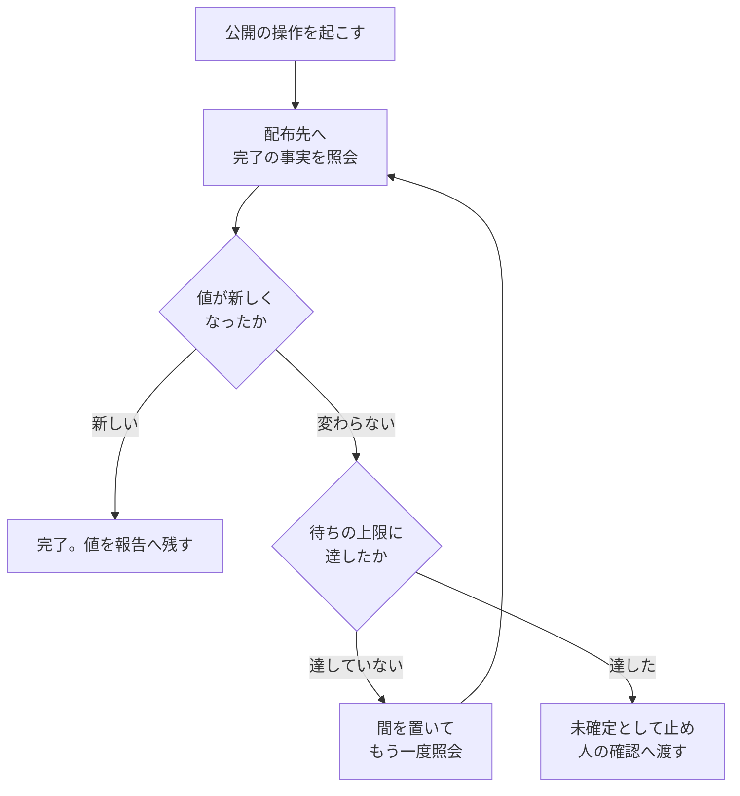

# 担当 E — `release` に配備の完了の確かめ方を書く（#228）

- issue: https://github.com/devbasex/ai-plugins/issues/228
- ブランチ: `feature/issue-228-release-completion`
- モード: `standard`

## 用語

| 語 | この文書での意味 |
| --- | --- |
| 公開の操作 | `release` の手順 4 で実行する操作。レジストリへの公開・配備先への反映・署名した配布物の設置・ストアへの提出 |
| 完了の事実 | 公開の操作が済んだことを、**配布先の状態から読み取れる値**。レジストリの登録時刻、配備先が返す版数、ストアの提出物の状態など |
| 打ち切り | 待つのをやめること。成否の判定とは別の判断 |
| 収束ループの監視 | `cross-review` が外部 CLI の終了を判定する仕組み（`scripts/lib/monitor.py`） |
| 形 | `release` が定める配布の形。パッケージ・プラグイン / サービス / デスクトップ / モバイル / 手順・設定の 5 つ |

**「完了の事実」と「ログの出力」を分ける。** この 2 つを 1 つの語で書くと、#228 が指す食い
違いそのものを説明できない。ログは公開の操作が書き出す文字列で、実装の都合で変わる。完了の
事実は配布先が持つ値で、公開の操作の実装とは別に読み取れる。

## 何を解決するか

`release` は公開の操作を「実行する」ところまでを書いており、**それが済んだことをどう確かめる
かを書いていない**。書いていない部分は実行者がその場で決めることになり、#228 の事例では
ログに出ると見込んだ語（`pushed`）を待つループになった。**公開の操作は成功していたが、その語は
ログに出ないため、待ちだけが残った。**

配布は取り消しの費用が大きく、失敗と実行中を取り違えたまま次の工程（`release-verification`）へ
進むと、出ていない版を確かめることになる。

## 現状（実測）

### `release` に完了を確かめる記述が無い

```console
$ grep -rn "完了を待\|待機\|until \|ポーリング\|timeout\|sleep\|バックグラウンド" plugins/ndf/skills/release/
（出力なし）

$ grep -n "完了を待\|待機\|until\|ポーリング\|timeout\|sleep" plugins/ndf/skills/quality-gates/SKILL.md
（出力なし）
```

`release` の「完了の判定」が求めるのは、どの段階まで配布したか・利用者が受け取れる状態か・
版が記録されているか・説明文書が一致しているか・届き方が書かれているかの 5 つで、**公開の操作
そのものが済んだことを何で確かめるかは項目に無い**。

### 多軸の完了判定を持つのは収束ループの監視だけである

```console
$ grep -rl "\bsentinel\b\|hard timeout\|\bstall\b" plugins/ndf/skills/ | cut -d/ -f4 | sort -u
cross-review
external-ai
pr-review
qa-security-scan
```

`external-ai` / `pr-review` / `qa-security-scan` の記述は、外部 CLI 1 本の完了検知の説明である。
複数の根拠を組み合わせて判定する実体は `cross-review/scripts/lib/monitor.py` の 1 本にある。

### 収束ループの監視が採っている考え方

`monitor.py`（952 行）を読むと、判定の構造は次の 4 つに分けられる。

| 何を | どう見ているか |
| --- | --- |
| 成否 | **プロセスが終わった後に、成果物（`result.json`）が実在するか**で決める。ログの語では決めない |
| 打ち切り | 上限の時間（既定 420 秒）、出力が増えない時間（対象ごとに 180〜900 秒）、致命的な語の 3 つを並行して見る |
| ログの語 | 補助に置く。完了の合図（`^tokens used$`）は 1 つの対象だけが持ち、致命的な語は**引用の中・差分の文脈行・表のセルを除外**してから判定する |
| 結果 | どの軸で終わったかを終了コード（0 / 2〜6）と 1 行の JSON で残す |

**成果物が出ているのにプロセスが終わらない経路には、こちらから打ち切る逃げ道がある。**
成果物の更新時刻が 30 秒以上前であれば、待たずに完了として扱う。

ここから借りるのは考え方であって、実装ではない。**成否は成果物の実在で決め、ログは打ち切りの
手段に置き、軸を複数持ち、どの軸で終わったかを残す。**

## 受け入れ条件

「実行者が推測の条件を書かなくなる」ことは、この変更だけでは観測できない。**受け入れ条件は
文書の構成と、機械で見られる条件へ落とす。**

1. `references/form-*.md` の 5 ファイルすべてが「完了の事実」の項目を持ち、その形で照会する
   対象を 1 つ以上書いている。**ファイル数と項目数が一致する**
2. `SKILL.md` と `references/distribution-forms.md` が書く「形ごとに変わるもの」の列挙が、
   同じ 5 項目・同じ並びである
3. `references/completion-check.md` があり、次の 4 つの節を持つ
   - ログで判定するときの決まり。**必須と推奨が区別されている**
   - 3 軸を見張るときの bash の雛形。そのまま実行できる
   - 待ちの上限の決め方と、**照会の間隔の下限**
   - 上限に達したときの扱い
4. `SKILL.md` の手順 4 に完了の確かめ方の節があり、`completion-check.md` と形ごとのファイルの
   両方を指している
5. `SKILL.md` の「完了の判定」に、完了の事実を確かめたことを求める項目がある
6. 出力物の雛形に「完了の確認」の行があり、**確かめた値を書く欄になっている**
7. `SKILL.md` が 300 行以内、追加する参照を含むすべてのファイルが 500 行以内である
8. `python3 scripts/check-markdown-links.py --root .` が終了コード 0 で終わる
9. `bash scripts/validate-runtime-plugins.sh` /
   `python3 scripts/check-doc-staleness.py --root .` /
   `python3 scripts/check-skill-frontmatter.py` /
   `uv run --with pytest pytest scripts/tests plugins/ndf -q` がいずれも終了コード 0 で終わる
10. 条件 1・2・3・5・6 を落とせる検査が `plugins/ndf/skills/release/tests/` にある。
    **記載を消したときも落ちる**（読み取れないこと自体を失敗として扱う）

## 対象範囲

### 含む

- `plugins/ndf/skills/release/SKILL.md` の手順 4・完了の判定・出力物・配布の形の節
- `plugins/ndf/skills/release/references/form-package-plugin.md` /
  `form-service.md` / `form-desktop.md` / `form-mobile.md` / `form-procedure.md`
- `plugins/ndf/skills/release/references/distribution-forms.md`
- `plugins/ndf/skills/release/references/completion-check.md`（新設）
- `plugins/ndf/skills/release/tests/`（新設）

### 含まない

- `plugins/ndf/skills/cross-review/`。このバッチでは担当 A が持つ。`monitor.py` の共通化は
  行わない（決定 5）
- `plugins/ndf/skills/quality-gates/`。完了の証跡を求める工程だが、配布の形を持たない
- `plugins/ndf/skills/release-verification/`。配布された成果物を確かめる工程で、この変更が
  扱うのは配布そのものが済んだかである
- `scripts/` と説明文書。担当 B が持つ
- 配布の形の追加・削除。5 つの形は変えない

## 設計

### 構成要素

| 要素 | 責務 |
| --- | --- |
| `SKILL.md` の手順 4 の節 | 完了の事実で確かめるという原則を 1 か所で述べ、詳細を 2 種類の参照へ渡す |
| `SKILL.md` の完了の判定・出力物 | 確かめた値を残すことを求める |
| `references/completion-check.md`（新設） | **形をまたぐ決まり**。ログで判定するときの決まり、3 軸を見張るときの雛形、待ちの上限、上限に達したときの扱い |
| `references/form-*.md` の「完了の事実」の項目 | **形ごとに違う値**。その形で何を照会すれば済んだと言えるか |
| `references/distribution-forms.md` | 「形ごとに変わるもの」の列挙を 5 項目へ揃える |
| `tests/test_completion_check.py`（新設） | 上の記載が揃っていることを機械で突き合わせる |

### 置き場所と読ませ方

`release` は形ごとに 1 ファイルを持ち、`SKILL.md` が対象の形のファイルだけを読ませる。**完了の
確かめ方も形で変わるため、この構成へ合わせる。**

```text
SKILL.md                       … 原則を 1 節。詳細は書かない
references/completion-check.md … 形をまたぐ決まり。公開の操作がすぐ終わらないときに読む
references/form-<形>.md        … その形の「完了の事実」。着手の時点で読む
```

`SKILL.md` は現在 242 行で、形ごとの内容をここへ並べると 300 行を超え、対象外の形の記述まで
読ませることになる。

### 形ごとの完了の事実

形ごとのファイルへ、既存の項目（起点・公開・取得・取り消し）と同じ粒度で 1 つ足す。

| 形 | 完了の事実 | 照会の対象の例 |
| --- | --- | --- |
| パッケージ（レジストリ型） | レジストリに新しい版が現れ、取得できる | レジストリの版の一覧。何も入っていない場所での取得 |
| パッケージ（エージェントプラグイン型） | 取得元の ref が公開したコミットを指す | `git ls-remote` が返す識別子と、送ったコミットの識別子 |
| サービス | 配備先が返す版数またはリビジョンが新しいものへ変わる | 版数を返す経路。配備の履歴が持つ状態 |
| デスクトップ | 配布先に署名済みの配布物が置かれ、取得できる | 配布先の一覧。署名の検証 |
| モバイル | ストアの提出物の状態が公開へ変わる | ストアの管理画面または API が返す状態 |
| 手順・設定 | 配った先に新しい版が届いている | 配布の記録（いつ、誰へ） |

**公開の操作の途中で作られる配布物にも、同じ考え方を当てる。** サービスの反映がコンテナ
イメージの登録を伴う場合、レジストリが持つ登録時刻を、そのコミットの時刻と突き合わせる
（#228 の事例がこれにあたる）。`form-service.md` へこの例を書く。

### ログで判定するときの決まり

外部の事実を照会する手段が無い場合に限り、ログで判定する。決まりは `completion-check.md` が
持つ。**必須は 2 つで、3 軸の見張りは推奨に置く。**

| 決まり | 扱い | 内容 |
| --- | --- | --- |
| 完了の語と失敗の語を、先に 1 度流して確かめる | 必須 | 見込みで書かない。#228 の事例ではログの完了行に `pushed` は出ず、待ちが残った |
| ログでの判定は打ち切りの合図に使い、成否の根拠にしない | 必須 | 打ち切った後に、その形の完了の事実を照会して成否を決める |
| 見張る対象を 3 つ持つ（完了の語・失敗の語・出力が増えない時間） | 推奨 | 完了の語だけを見張ると、失敗・停止・実行中が同じ「まだ終わらない」になる |

これは収束ループの監視が採っている構造と同じである。成否は成果物の実在で決め、ログの語は
補助に置く。

### 3 軸を見張るときの雛形

**推奨に留めても、採る実行者はその場で待ち方を書くことになる。** そのまま貼れる形を
`completion-check.md` へ 1 つ置く。実測で、完了の語で抜ける経路と、出力が止まって抜ける経路の
両方が終了コード 0 で終わることを確かめた。

```bash
# $LOG は追記されるログ、$DONE と $FAIL は先に流して確かめた語、$IDLE と $LIMIT は秒
start=$SECONDS; last=$SECONDS; size=0
while :; do
  now=$(wc -c <"$LOG")
  [ "$now" -ne "$size" ] && { size=$now; last=$SECONDS; }
  grep -q "$DONE" "$LOG" && { echo done;  break; }
  grep -q "$FAIL" "$LOG" && { echo fail;  break; }
  [ $((SECONDS - last))  -ge "$IDLE"  ] && { echo idle;  break; }
  [ $((SECONDS - start)) -ge "$LIMIT" ] && { echo limit; break; }
  sleep 5
done
# どの語で抜けても成否は決めない。この後に、その形の完了の事実を照会する
```

雛形は 12 行で、`monitor.py` の代わりではない。**再起動・pidfile・結果ファイルの規約は持たず、
ログの読み取りだけを行う。** これらは配布の待ちに要らない（決定 5）。

### 待ちの上限

**上限を決めずに待たない。** 上限に達したときは成功にも失敗にも倒さず、**未確定**として止め、
完了の事実の照会へ移る。

既定の秒数は置かない。形によって桁が変わるためである（レジストリへの公開は分、ストアの審査は
日）。着手の時点で上限を決め、完了報告へ書く。

**間を置かずに照会し直さない。** 下の `F` の「間を置く」は必須で、既定は 5 秒とする。3 軸の
見張りを採らない場合も同じで、`sleep` を持たない照会のループを書かない。配布先の API は利用
上限を持ち、間を置かない照会はその上限へ達して、待ちの途中で照会そのものが失敗する。

**間隔にだけ既定を置けるのは、上限と違って形で桁が変わらないためである。** 照会 1 回の費用は
形によらずほぼ同じで、長い待ちでは伸ばしてよい。縮めるときは、その形の上限を確かめてから決める。

### 処理の流れ



3 軸を採る場合は、`F` の間を置く判断がログの 3 つの対象で決まる。ログが完了か失敗の語を
出したときと、出力が増えない時間が上限に達したときに、待つのをやめて `B` へ戻る。**`C` の
判定はログを見ない。**

## 決定の記録

### 決定 1: 完了の確かめ方を、形ごとのファイルと形をまたぐ参照へ分けて置く

完了の事実は形で変わり、ログと上限の決まりは形で変わらない。`release` は形ごとに 1 ファイルを
持つ構成をすでに採っているため、変わる部分だけをそちらへ足し、変わらない部分を 1 本の参照へ
集める。

`SKILL.md` へまとめて書く案は採らない。242 行のファイルへ形ごとの内容を並べると 300 行を
超え、対象外の形の記述まで読ませることになる。

### 決定 2: 形をまたぐ決まりを `distribution-forms.md` へ足さず、別のファイルにする

`distribution-forms.md` は形を選ぶための索引で、着手の時点で必ず読む。ログと上限の決まりが
要るのは、公開の操作がその場で終わらない場合に限られる。分けておけば、その場で終わる形では
読み込まずに済む。

### 決定 3: 「形ごとに変わるもの」の列挙を 4 つから 5 つへ揃える

`SKILL.md` と `distribution-forms.md` は、形ごとに変わるものを「起点の決め方・公開の仕方・
取得の手順・取り消し手段の 4 つ」と書いている。完了の確かめ方を加えて 5 つにする。2 か所の
列挙が同じ並びであることを検査で突き合わせる（工程の並びを 4 か所で突き合わせている #231 と
同じ考え方）。

`distribution-forms.md` の一覧表へ列を足す案は採らない。6 列が 7 列になり、本文の幅に収まら
なくなる。形ごとのファイルが項目として持つ。

### 決定 4: 待ちの上限に既定の秒数を置かない

形によって所要が分から日まで変わる。既定を置くと、合わない形へも同じ値が使われる。代わりに
条件を課す。**上限を決めずに待たないこと**と、**上限に達したら未確定として止めること**を求める。

収束ループの監視は既定を持つが、そちらは対象が外部 CLI の 1 プロセスに限られており、桁が
揃っている。

### 決定 5: 収束ループの監視は切り出さず、考え方だけを書く

このバッチでは `cross-review/` を担当 A が持つため、切り出しは担当の境界を越える。

境界を別にしても、いま切り出す判断にはならない。`monitor.py` が見るのは pidfile・標準エラー
出力のログ・結果ファイルという `cross-review` の一時ファイルの規約で、配布で確かめたい値
（レジストリの登録時刻、配備先が返す版数、ストアの状態）は監視の対象に入っていない。共通化
しても、配布側が要る軸は足すことになる。

`release` へ書くのは考え方と、貼れる雛形 1 つに限る。**成否は成果物の実在で決める・ログは
打ち切りの手段に置く・軸を複数持つ・どの軸で終わったかを残す。** このうち軸の数だけを推奨に
置く（決定 6）。切り出しの要否は、この指針が実際の配布で使われてから判断する（範囲外として #280 に起票済み）。

### 決定 6: 3 軸の見張りを推奨に置き、雛形を 1 つ添える

`monitor.py` を切り出さない（決定 5）以上、3 軸の待ち方は実行者がその場で書くことになる。
必須に置くと、書けない実行者は待ち方ごと省き、完了の確認まで飛ばす。**緩和の目的は、
飛ばされる経路を消すことである。**

必須と推奨は、飛ばしたときに何が壊れるかで分けた。

| 決まり | 飛ばしたときに壊れるもの | 扱い |
| --- | --- | --- |
| 完了の語と失敗の語を先に確かめる | 出ない語を待ち続ける。#228 の事例そのもの | 必須 |
| ログを打ち切りの合図に限る | ログの語だけで成功と報告する | 必須 |
| 3 軸を見張る | 打ち切りが待ちの上限まで遅れる。成否の判定は変わらない | 推奨 |

**3 軸を推奨に置けるのは、待ちの上限が必須だからである。** 上限に達すれば必ず打ち切られ、
完了の事実の照会へ移る。3 軸が無い場合に失うのは、早く打ち切れることだけである。

推奨に置くだけでは、採る実行者の負担は変わらない。そのため 12 行の雛形を
`completion-check.md` へ置く。共通スクリプトを新設する案は採らない。置き場所が
`release/scripts/` になり、`monitor.py` との重複を担当の境界をまたいで抱えることになる。

### 決定 7: 完了報告へ確かめた値そのものを残す

出力物の雛形へ「完了の確認」の行を足し、照会した対象と返ってきた値を書く欄にする。確かめた
かどうかだけを残すと、何を見て済んだと判断したのかが後から追えない。飛ばしたときに根拠の
コマンドを残す既存の決まりと同じ形になる。

## テスト設計

検査の本体は `plugins/ndf/skills/release/tests/test_completion_check.py` に置く。`release` は
これまでテストを持たないため、ディレクトリごと新設する。外部コマンドを使わないため、
リポジトリの根の `conftest.py` の必須コマンドの一覧へは足さない。

| 受け入れ条件 | 何で確かめるか |
| --- | --- |
| 1（形ごとの完了の事実） | `references/form-*.md` を列挙し、各ファイルが「完了の事実」の項目を持ち、本文が空でないことを見る。ファイル数と項目数の一致も見る |
| 2（列挙の並び） | `SKILL.md` と `distribution-forms.md` の列挙を読み取り、5 項目が同じ並びであることを見る。読み取れないことも失敗として扱う |
| 3（形をまたぐ決まり） | `completion-check.md` の見出しに 4 つの節があることを見る。決まりの表が必須と推奨を持つことと、上限の節が照会の間隔の下限を持つことと、雛形の bash が `bash -n` を通ることも見る |
| 4（手順 4 の節） | `SKILL.md` の手順 4 の節から `completion-check.md` と形ごとのファイルへの参照が張られていることを見る |
| 5（完了の判定の項目） | `SKILL.md` の「完了の判定」に完了の事実の項目があることを見る |
| 6（出力物の行） | `SKILL.md` の出力物の雛形に「完了の確認」の行があることを見る |
| 7（分量） | `SKILL.md` が 300 行以内、`release/` 配下のすべての Markdown が 500 行以内であることを見る |
| 8（リンク） | `python3 scripts/check-markdown-links.py --root .` |
| 9（既存の検査） | `bash scripts/validate-runtime-plugins.sh` / `python3 scripts/check-doc-staleness.py --root .` / `python3 scripts/check-skill-frontmatter.py` / `uv run --with pytest pytest scripts/tests plugins/ndf -q` |
| 10（消しても落ちる） | 条件 1・2・3・5・6 の各検査について、対象の記載を取り除いた一時ファイルを作り、検査が落ちることを見る |

**条件 10 を入れるのは、記載を消すことで検査を通せる状態にしないためである。** 位置を決める
語が見つからなければ、読み取れないこととして落とす（`check-doc-staleness.py` と同じ扱い）。

## 完了条件

- [ ] 受け入れ条件 1〜10 をすべて満たしている
- [ ] `bash scripts/build-runtime-plugins.sh` を実行し、生成物に差分が出ないことを確かめている
- [ ] 範囲外と判断した課題が `out-of-scope` で issue になっている
- [ ] `plugins/ndf/skills/release/` 以外のパスに差分が無い（担当の境界）

## 範囲外として見つけたこと

| 見つけたこと | 判断 | 理由 |
| --- | --- | --- |
| 収束ループの監視（`cross-review/scripts/lib/monitor.py`）に、配布でも使える多軸の待ち方が入っているが、`cross-review` の一時ファイルの規約と結び付いており他の工程から呼べない | 起票済み（#280） | 共通化の要否は、`release` の指針が実際の配布で使われてから決まる。このバッチでは `cross-review/` を担当 A が持つため、境界を越える |
| `quality-gates` にも完了待ちの記述が無い。完了の証跡を求める工程であるため、外部の事実で確かめる考え方はこちらにも当てはまる | 起票済み（#280 に含む） | `quality-gates` は担当の書き換えてよいパスの外にある。#228 の対象は `release` に限られている |
| `external-ai` / `pr-review` / `qa-security-scan` が、外部 CLI の完了検知の手順をそれぞれ別に書いている（`^tokens used$` の待ち方が 3 か所にある） | 起票済み（#280 に含む） | 記述の重複であり、#228 が指す配備の完了とは対象が違う。まとめ方の判断には 3 つの Skill を横断して読む必要がある |
| `release` の「配布の形」の表と `distribution-forms.md` の一覧表が、形の並びと呼び名を別々に持っている。片方だけを直せる状態にある | 起票しない | この変更で足す列挙の検査が 2 か所の突き合わせを始めるため、同じ検査の拡張として次に扱える。いま独立した課題にすると対象が重なる |

## 参照

- `plugins/ndf/skills/release/SKILL.md` — 配布の工程
- `plugins/ndf/skills/release/references/distribution-forms.md` — 形の索引と形をまたぐ決まり
- `plugins/ndf/skills/cross-review/scripts/lib/monitor.py` — 多軸の完了判定の実装（考え方の出所）
- `plugins/ndf/skills/development-workflow/tests/test_stage_values.py` — 複数箇所の並びを
  突き合わせる検査の書き方
- [00-overview.md](00-overview.md) — このバッチの境界と順序
