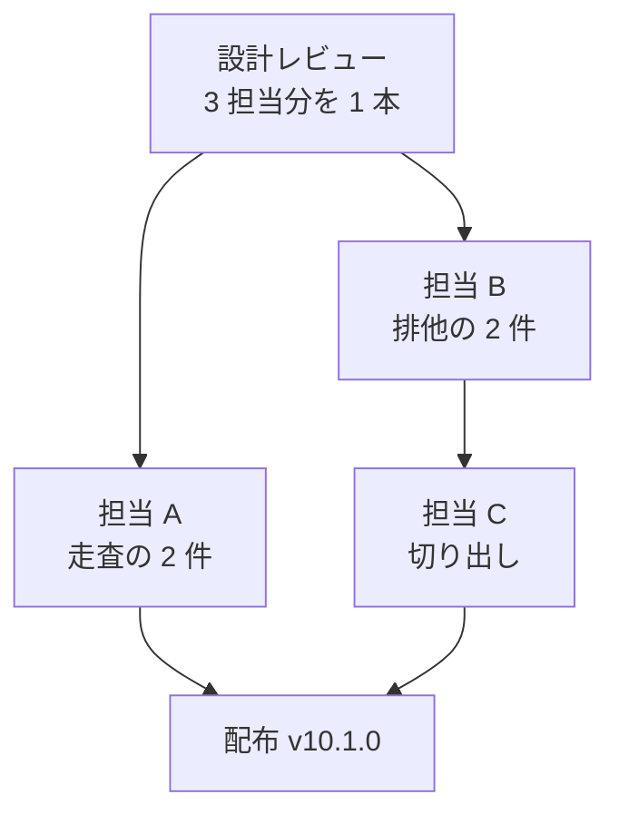

# 並行開発 バッチ 06 — 全体指示

マイルストーン v10.1.0 の 5 件を同時に進めるための指示書である。**各担当は、この文書と
自分の担当ファイルの両方を読んでから着手する。** この文書は、担当どうしが同じ行を書き
換えないための境界と、着手の順序と、担当をまたぐ約束を定める。担当ファイルだけでは、
境界と順序が分からない。

## 着手する前に知っておくこと

| 項目 | 現在の状態 |
| --- | --- |
| 現行版 | **`10.0.0`**（`main` と `develop` が同じ位置にある） |
| 次に出す版 | **`10.1.0`**。開発版は `10.1.0-dev.1` から |
| 開発の起点 | **`develop`**。`.ndf/worktree.json` の `base_branch` が宣言している |
| Pull Request の宛先 | **`develop`**。`--base develop` を必ず付ける |
| 配布の時期 | **このバッチのマージがすべて終わった後**。個別には版を上げない |
| `/goal` で工程を通すとき | 設計レビューのマージ前で 1 度止まり、承認を待つ |

**5 件は 1 つのマイルストーンにまとまっている。** 主題は作業ツリー運用（`worktree`）の
安定化であり、排他の 3 件（#297 / #293 / #308）と、書き込み先の走査の 2 件（#201 / #197）に
分かれる。

## 用語

| 語 | この文書での意味 |
| --- | --- |
| 担当 | 1 件以上の課題を最後まで進める実行主体。1 担当 = 1 作業ツリー = 1 Pull Request |
| 排他 | 同じ資源を同時に書き換えないための仕組み。このリポジトリでは `mkdir` を関門に使う |
| 台帳 | 作業ツリーの割り当てを記録する `.git/ndf/worktree-registry.json` |
| 控え | 通過工程を記録するファイル。`development-workflow` が持つ |
| 走査 | `wt_extract_write_target` がコマンドの文字列を 1 度読み通して書き込み先を決める処理 |
| 写し | 同じ内容の実装が 2 箇所にある状態。ここでは `wf_lock_acquire` を指す |
| 収束 | `cross-review` で 2 つの外部 AI の両方が承認した状態 |

**排他の「持ち主」は、ロックを取得した 1 つのプロセスを指す。** ロックのディレクトリを
作れたプロセスと同義ではない。この区別が #297 の主題である。

## 担当と課題

| 担当 | 課題 | モード | ブランチ | 指示書 |
| --- | --- | --- | --- | --- |
| A | 書き込み先の走査が `cd` とファイル記述子を取り違える（#201 / #197） | `standard` | `fix/issue-201-197-write-target` | [01-issue-201-197.md](01-issue-201-197.md) |
| B | `mkdir` の成功だけで持ち主を決める排他を直す（#297 / #308） | `standard` | `fix/issue-297-308-lock` | [02-issue-297-308.md](02-issue-297-308.md) |
| C | 排他の実装を 1 箇所へ寄せる（#293） | `architecture` | `refactor/issue-293-lock-common` | [03-issue-293.md](03-issue-293.md) |

各担当の指示書は**受け入れ条件・設計・決定の記録・テスト設計**を持つ。実装へ入る前にこの
4 つを書き終える（バッチ 03 / 04 / 05 と同じ進め方）。

**設計 Pull Request は 3 担当分をまとめて 1 本にする。** 設計文書が別々のファイルにあり、
同じ行を書き換えないためである。

## 担当どうしの境界

| 担当 | 書き換えてよいパス | 触らないパス |
| --- | --- | --- |
| A | `plugins/ndf/scripts/lib/worktree-common.sh` の**走査の節**（`_wt_tokenize` から `wt_normalize_path` まで） / `plugins/ndf/skills/worktree/tests/test_write_target.py` | 同じファイルの**排他の節**（`_wt_lock_sleep` 以降） / `development-workflow/` / `scripts/` / 説明文書 |
| B | `plugins/ndf/scripts/lib/worktree-common.sh` の**排他の節**（`_wt_lock_sleep` から `wt_lock_is_held` まで） / `plugins/ndf/skills/worktree/tests/test_registry.py` / `plugins/ndf/skills/development-workflow/scripts/lib/workflow-common.sh` の**排他の節** / `development-workflow/tests/test_stage_check.py` | 同じファイルの**走査の節** / `workflow-common.sh` の控えの節 / `scripts/` / 説明文書 |
| C | `plugins/ndf/scripts/lib/lock-common.sh`（新設） / 上の 2 ファイルの**排他の節**（担当 B のマージ後） / `plugins/ndf/manifests/` / `scripts/build-runtime-plugins.sh` などの配布の経路 / `docs/specifications/` | 走査の節 / 控えの節 / 説明文書のうち版数を持つ箇所 |

### 担当 A と担当 B は同じファイルの別の節を持つ

`plugins/ndf/scripts/lib/worktree-common.sh` は 1969 行あり、走査（261〜1454 行）と
排他（1787〜1900 行）は 300 行以上離れている。**行が重ならないため git は自動でマージ
できる。** どちらが先にマージされてもよい。

**ただし、どちらの担当も「自分の節の外を直したくなる」場面を持つ。** 見つけた課題は
自分で直さず、`out-of-scope` で起票するか、この文書の「担当をまたぐ調整」へ書き足す。

### 担当 C は担当 B のマージを待つ

#293 の本文が定めている。**排他になっていない実装を切り出すと、切り出した先が同じ欠陥を
持ったまま 2 箇所から使われる。** 担当 B が `wt_lock_acquire` へ 2 段目の `held` の関門を
入れ、それが `develop` へ載ってから、担当 C が起点を取り込んで切り出す。

### 担当 B と担当 C は排他の写しで接する

| 何を決めるか | 持ち主 |
| --- | --- |
| `mkdir` の成功後に印を確かめる手順 | 担当 B |
| 陳腐化の判定（持ち主の生存確認・経過時間） | 担当 B |
| 排他の関数を置くファイルと、その配布の経路 | 担当 C |
| 写しを置き換えるか、写した状態を残すか | 担当 C |

**担当 B は写しの側（`workflow-common.sh`）にも触る。** #308 の再現がどちらの実装で
起きるかを先に決められないためである。担当 C はその結果を受け取って切り出す。

## 着手の順序

1. 3 担当が自分の指示書へ受け入れ条件・設計・決定の記録・テスト設計を書く
2. 設計 Pull Request を 1 本にまとめ、`cross-review` を通す
3. 承認を得てマージし、実装用の作業ツリーを担当ごとに作り直す
4. 担当 A と担当 B が並行して実装し、それぞれ Pull Request を出す
5. 担当 B のマージの後、担当 C が着手する
6. 3 件のマージがすべて終わってから版を上げ、配布する

## 全担当に共通する約束

- **テストはリポジトリの根から 1 回の起動で通す。** `uv run --with pytest pytest scripts/tests plugins/ndf -q`
- **範囲外の課題は見つけたその場で起票する**（`out-of-scope`）。判断は 3 択に限り、
  起票しない場合も理由を 1 行残す
- **主ディレクトリで編集しない。** 開発の変更は `.worktrees/<ブランチ名>` の中で行う。
  `issues/` `docs/` と各ランタイムの設定だけが例外である
- **説明文書の版数は誰も触らない。** 版を上げるのは配布の工程であり、このバッチの
  3 件はいずれも版数を持つ箇所を書き換えない

## 設計で確定したこと

3 担当の設計を突き合わせた結果、着手前の想定から変わった点と、担当をまたぐ約束をここへ集める。
**各担当は自分の指示書に加えて、この節を読む。**

### 排他の関門は 2 段になり、印の読み直しは採らない

着手前の想定は、控えの側（`wf_lock_acquire`）が持つ「印を書いて読み直し、自分の印が残る
ときだけ持ち主とする」手を、台帳の側（`wt_lock_acquire`）へも持ち込むことだった。**担当 B の
実測で、この手そのものが #308 の原因だと分かった。**

印を同時に書くと、書き込みの尾が混ざって、どの担当の印とも一致しない値が残る。作成に成功した
全員が競り負け、持ち主のいないロックが 5 分間だれにも取れなくなる。

確定した関門は 2 段である。

| 段 | 手段 | 役割 |
| --- | --- | --- |
| 1 | `mkdir` | ロックの位置を押さえる。陳腐化の判定（持ち主の生存確認・経過時間）がこの段に乗る |
| 2 | 部分シェルの `( set -C; : >"$dir/held" ) 2>/dev/null` | 持ち主を 1 つに決める。シェル自身の `open(O_CREAT|O_EXCL)` が関門になる |

印（`token`）は識別のためだけに残り、持ち主の決定には使わない。書くのは持ち主だけになる。

### 排他が成り立たない条件は overlayfs に限らない

#297 の本文は overlayfs を条件に挙げているが、担当 B の実測では **ext4 でも複数成功が出た**
（200 試行 × 6 並列で 6 件）。システムコールの `mkdir` では両方とも 0 件である。条件は
ファイルシステムではなく、`mkdir` コマンドの実装（uutils coreutils 0.8.0）にある。

**この結果は課題 #297 の本文へ追記する。** 本文の前提と設計の結論が食い違ったまま残らない
ようにする。

### 書き込み先の走査は、1 パスを保ったまま 4 事象とも直せる

#201 の本文は「3 件とも 1 パス走査の枠を超える」「完全に潰すには bash の構文解析器が要る」と
見立てていた。**担当 A が語の並びを実測した結果、4 事象とも後ろ向きの状態だけで直せる。**
構文解析器が要るという見立ては、4 事象の外（`eval` / 別名定義 / `coproc` / `trap` / `source`）で
成り立つ。

**同じ本文の「3 件はいずれも逆向き（案内が出ない見落とし）」も、形を変えると誤検知になる。**
作業ツリーへ移ってから関数定義やフォールスルーを挟むと、主ディレクトリ向けの案内が出る。
`cp a b 2>&1` は本来の宛先 `b` を落として `2` だけを出す。

**この 2 点は課題 #201 と #197 の本文へ追記する。**

### 排他の実装は 1 つのファイルへ寄せる

#293 の本文は「切り出しただけでは共有できない」ことを前提に置いていた。**担当 C の実測では、
4 ランタイムすべてで Skill のディレクトリからプラグインルートの `scripts/` へ相対でたどれる。**
ただし `cd` で解決すると Kiro CLI の symlink の手前へ戻るため、指し方を契約として固定する。

**この結果は課題 #293 の本文へ追記する。**

### 本文への追記は設計 Pull Request のマージの後に行う

3 件の追記は、設計レビューで結論が変わりうる。**確定してから本文へ書く。**

## 担当をまたぐ調整

| 相手 | 何を調整するか |
| --- | --- |
| 担当 A ↔ 担当 B | 同じファイルの別の節を持つ。**行番号ではなく関数名で対象を指す**（排他の節の行数が変わるため、着手の時点で相手の指示書が書いた行の範囲はずれる） |
| 担当 B → 担当 C | 担当 B は振る舞いの正しさだけを扱い、関数の分け方・引数の形・置き場所は変えない。担当 C は 2 箇所が同じ手順になった状態を受け取って寄せる |
| 担当 B ↔ 担当 C | `set -C` は呼び出し側のシェルの状態を変える。**元へ戻す責務は担当 B が負う。** 担当 B が部分シェル `( set -C; : >"$dir/held" ) 2>/dev/null` で囲み、呼び出し側の `$-` に `C` を残さない。担当 C はこれを共通ファイルの契約として引き継ぐ |
| ロックの単体テスト 8 件 | `test_testenv.py` にあり、どの担当の書き換えてよいパスにも入っていない。**変更せずに通ることを担当 B が確かめたため、境界は動かさない**。新しく足す検査は `test_registry.py` へ置く |

## 参照

- [バッチ 05 の全体指示](../parallel-batch-05/00-overview.md) — 直前のバッチ。担当の境界の書き方はこれに倣う
- `plugins/ndf/scripts/lib/worktree-common.sh` — 走査と排他の実体
- `plugins/ndf/skills/development-workflow/scripts/lib/workflow-common.sh` — 排他の写し
