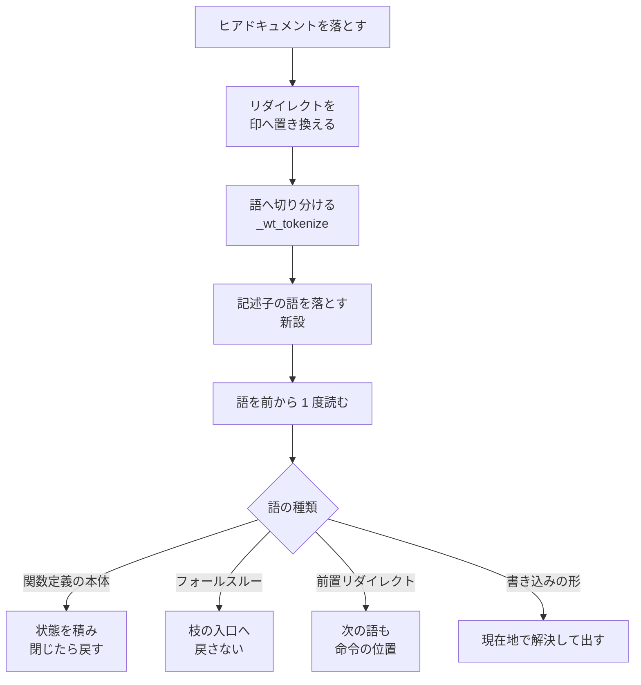

# 担当 A — 書き込み先の走査が `cd` とファイル記述子を取り違える（#201 / #197）

- issue: https://github.com/devbasex/ai-plugins/issues/201 / https://github.com/devbasex/ai-plugins/issues/197
- ブランチ: `fix/issue-201-197-write-target`
- モード: `standard`

`standard` のため、この文書は受け入れ条件・設計・決定の記録・テスト設計を持つ。実装は
設計 Pull Request のマージ後に行う。

## 用語

| 語 | この文書での意味 |
| --- | --- |
| 走査 | `wt_extract_write_target` がコマンドの文字列を 1 度読み通して書き込み先を決める処理 |
| 語 | `_wt_tokenize` が切り出した 1 単位。引用符を解いた後の文字列 |
| 印 | 走査だけが使う語。`__WT_SEP__` `__WT_REDIR__` `__WT_CASE_END__` など `__WT_` で始まる |
| 現在地 | 走査が追っている、その時点の作業ディレクトリ |
| 起点 | `wt_extract_write_target` の第 2 引数。相対パスをここから解決する |
| 案内 | 主ディレクトリを編集しようとしたときに tool 実行前の hook が出す文言。編集は止めない |
| 主ディレクトリ | clone したディレクトリ。`.worktrees/` の親にあたる |
| 記述子 | ファイル記述子。`2>&1` の `2` のように、リダイレクトの左へ添える番号 |
| 見落とし | 主ディレクトリへ書くのに案内が出ないこと |
| 誤検知 | 作業ツリーの中で書いているのに、主ディレクトリ向けの案内が出ること |
| 事象 | この文書が扱う 4 つの不具合。#201 の 3 つと #197 の 1 つ |

**「見落とし」と「誤検知」を分けて書く。** どちらも走査の結果が実際の書き込み先と食い違う
ことを指すが、利用者から見た現れ方が逆である。

## 何を解決するか

走査は、シェルのコマンド文字列から書き込み先を推定して案内の要否を決める。次の 4 つの形では
推定した位置が実際の書き込み先と食い違う。

| 事象 | 何が食い違うか |
| --- | --- |
| #201-1 | 関数定義の本体の `cd` を、定義した時点で走ったものとして数える |
| #201-2 | `case` の枝を `;&` `;;&` で落ちたとき、前の枝の移動を引き継がない |
| #201-3 | 命令名より前に置いたリダイレクトの後ろの `cd` を、被演算子として読み飛ばす |
| #197 | リダイレクトの左に添えた記述子の番号を、書き込み先のファイル名として拾う |

## 現状（実測）

以下はすべて、この作業ツリーの `develop`（`b656503`）で実行した結果である。

```bash
source plugins/ndf/scripts/lib/worktree-common.sh
wt_extract_write_target '<コマンド>' /base
```

### 4 事象の出力

| 事象 | 入力 | 現在の出力 |
| --- | --- | --- |
| #201-1 | `f () { cd .worktrees/x; }; cp a.txt README.md` | `/base/.worktrees/x/README.md` |
| #201-2 | `case x in x) cd .worktrees/x ;& y) cd ../..; cp a README.md ;; esac` | `/README.md` |
| #201-3 | `cd .worktrees/x; >/dev/null cd ../..; cp a README.md` | `/base/.worktrees/x/README.md` |
| #197 | `sed -i 's/a/b/' x.md 2>&1`（起点なし） | `x.md` と `2` の 2 行 |

### 実際の bash が書いた位置

#201 の 3 つは、同じコマンドを bash で走らせて `cp` が作ったファイルを `find` で確かめた。
3 件とも `<起点>/README.md` に落ちた。**issue #201 の期待値の表と一致する。**

```console
$ bash -c 'cd /tmp/wt/base; f () { cd .worktrees/x; }; cp a.txt README.md'
$ find /tmp/wt -name README.md
/tmp/wt/base/README.md
```

### 見落としだけでなく誤検知も起きる

issue #201 は 3 件を「案内が出るべき場面で出ない見落とし」と書いている。**同じ 3 つの欠陥は、
入力の形を変えると誤検知にもなる。** 実際の書き込み先は bash で確かめた。

| 事象 | 入力（起点 `/base`） | 走査の出力 | 実際の書き込み先 |
| --- | --- | --- | --- |
| #201-1 | `cd .worktrees/x; f () { cd ../..; }; cp a.txt README.md` | `/base/README.md` | `/base/.worktrees/x/README.md` |
| #201-2 | `case x in x) cd .worktrees/x ;& y) cp a README.md ;; esac` | `/base/README.md` | `/base/.worktrees/x/README.md` |
| #201-3 | `>/dev/null cd .worktrees/x; cp a README.md` | `/base/README.md` | `/base/.worktrees/x/README.md` |

3 件とも、作業ツリーの中で書いているのに主ディレクトリ向けの案内が出る。**この hook は編集を
止めないため実害は案内 1 回分だが、案内が増えると利用者が案内を読まなくなる。**

#197 も、番号を拾うだけでなく本来の書き込み先を落とす。`cp` と `mv` は最後の被演算子を宛先と
するため、記述子の番号がその位置を奪う。

```console
$ wt_extract_write_target 'cp a b 2>&1' /base
/base/2
```

### 1 パス走査の枠を超えるかを確かめた

issue #201 は 3 件とも 1 パス走査の枠を超えるという見立てを書いている。**語の並びを実測した
結果、3 件とも後ろ向きの状態だけで直せる。** 先読みが必要になるのは #201-3 だけで、そこは
既存の `_redir_target` が同じ先読みを済ませている。

| 事象 | issue の見立て | 実測 |
| --- | --- | --- |
| #201-1 | 名前・`()`・本体を跨いだ先読みが要る | 字句解析が `f()` を 1 語に、`f ()` を `f` と `()` の 2 語にまとめる。直前の語を見れば足りる |
| #201-2 | 枝ごとに 2 つの位置を持ち回る必要がある | 前の枝の出口は現在地そのものである。枝の入口へ戻す処理を飛ばすかどうかの真偽値 1 つで足りる |
| #201-3 | 走査を先読みへ変える必要がある | `_redir_target` が読み終えた語の位置を返す。その次を命令の位置として数えれば足りる |

語の並びは次のとおりである（`_wt_tokenize` の出力）。

| 入力 | 語の並び |
| --- | --- |
| `f () { cd x; }` | `f` / `()` / `{` / `cd` / `x` / `__WT_SEP__` / `}` |
| `f() { cd x; }` | `f()` / `{` / `cd` / `x` / `__WT_SEP__` / `}` |
| `function f { cd x; }` | `function` / `f` / `{` / `cd` / `x` / `__WT_SEP__` / `}` |
| `x) cd a ;& y)` | `x` / `__WT_CASE_END__` / `cd` / `a` / `__WT_SEP__` / `&` / `y` / `__WT_CASE_END__` |
| `sed -i s x.md 2>&1` | `sed` / `-i` / `s` / `x.md` / `2` / `__WT_REDIR__` / `&1` |

**`;&` は `__WT_SEP__` と `&` の 2 語になる。** 後者は背景実行の演算子として読まれ、現在地が
まとまりの入口へ戻る。`;;&` は `__WT_SEP__` 2 つと `&` になる。

**「完全に潰すには bash の構文解析器が要る」という見立ては、この 4 事象の外で成り立つ。**
`eval`・別名定義・`coproc`・`trap`・`source` は字面から実行順を決められない。この変更はこれらを
含まない（「対象範囲」の「含まない」）。

### 既存のテストは 321 件が通っている

```console
$ uv run --with pytest pytest plugins/ndf/skills/worktree/tests/test_write_target.py -q
321 passed in 3.91s
```

`echo hi 2>&1` を終了コード 1 と空の出力で確かめるテストが既にある
（`test_file_descriptor_duplication_opens_no_file`）。`echo` が書き込みの形に当たらないため、
記述子の番号がそこまで届いていない。**4 事象のいずれも、既存のテストが期待値として
固定していない。**

## 受け入れ条件

出力は 1 行 1 件で、順序は走査が見つけた順である。起点は明記しない限り `/base` を渡す。

### 条件 1: 関数定義の本体の `cd` が、定義の外の現在地を変えない

| 入力 | 現在の出力 | 受け入れ後の出力 |
| --- | --- | --- |
| `f () { cd .worktrees/x; }; cp a.txt README.md` | `/base/.worktrees/x/README.md` | `/base/README.md` |
| `f() { cd .worktrees/x; }; cp a.txt README.md` | `/base/.worktrees/x/README.md` | `/base/README.md` |
| `function f { cd .worktrees/x; }; cp a.txt README.md` | `/base/.worktrees/x/README.md` | `/base/README.md` |
| `f () ( cd .worktrees/x ); cp a.txt README.md` | `/base/.worktrees/x/README.md` | `/base/README.md` |
| `cd .worktrees/x; f () { cd ../..; }; cp a.txt README.md` | `/base/README.md` | `/base/.worktrees/x/README.md` |
| `f () { cp a.txt README.md; }` | `/base/README.md` | 変えない |
| `f () { cd .worktrees/x; }; f; cp a.txt README.md` | `/base/.worktrees/x/README.md` | 出力なし・終了コード 1 |

最後の 1 行は、定義した関数を同じコマンドの中で呼んだ形である。本体の移動は呼び出しの側で
効くが、呼び出しの時点の現在地は字面から決められない（決定 3）。

### 条件 2: `case` のフォールスルーが前の枝の移動を引き継ぐ

| 入力 | 現在の出力 | 受け入れ後の出力 |
| --- | --- | --- |
| `case x in x) cd .worktrees/x ;& y) cd ../..; cp a README.md ;; esac` | `/README.md` | `/base/README.md` |
| `case x in x) cd .worktrees/x ;& y) cp a README.md ;; esac` | `/base/README.md` | `/base/.worktrees/x/README.md` |
| `case x in x) cd .worktrees/x ;;& y) cp a README.md ;; esac` | `/base/README.md` | `/base/.worktrees/x/README.md` |
| `case x in x) cd .worktrees/x ;; y) cd ../..; cp a README.md ;; esac` | `/README.md` | 変えない |

最後の 1 行が `;;` で、枝どうしが排他である従来の扱いを保つ。

### 条件 3: 命令名より前のリダイレクトが命令の位置を保つ

| 入力 | 現在の出力 | 受け入れ後の出力 |
| --- | --- | --- |
| `cd .worktrees/x; >/dev/null cd ../..; cp a README.md` | `/base/.worktrees/x/README.md` | `/base/README.md` |
| `>/dev/null cd .worktrees/x; cp a README.md` | `/base/README.md` | `/base/.worktrees/x/README.md` |
| `2>&1 cd .worktrees/x; cp a README.md` | `/base/README.md` | `/base/.worktrees/x/README.md` |
| `>log cd .worktrees/x; cp a README.md` | `/base/log` と `/base/README.md` | `/base/log` と `/base/.worktrees/x/README.md` |

4 行目は、前置したリダイレクトの書き込み先そのものは移動前の位置で開かれることを併せて
確かめる。

### 条件 4: 記述子の番号を書き込み先として出さない

| 入力 | 現在の出力 | 受け入れ後の出力 |
| --- | --- | --- |
| `sed -i 's/a/b/' x.md 2>&1`（起点なし） | `x.md` と `2` | `x.md` |
| `cp a b 2>&1` | `/base/2` | `/base/b` |
| `mv a b 2>>log` | `/base/2` と `/base/log` | `/base/b` と `/base/log` |
| `tee out.txt 2>&1` | `/base/out.txt` と `/base/2` | `/base/out.txt` |
| `echo hi 2>&1` | 出力なし・終了コード 1 | 変えない |
| `cat file2>log` | `/base/log` | 変えない |

最後の 1 行は、`>` の左の数字が語の一部である形である。bash も `file2` を語として扱い、
`log` だけを開く（実測）。番号として落としてよいのは、すべて数字の語だけである。

### 条件 5: 退行させない

- 既存の `test_write_target.py` の 321 件を、期待値を変えずに通す
- `{ cd .worktrees/x; }; cp a.txt README.md` は `/base/.worktrees/x/README.md` のまま
  （関数定義ではないまとまりは同じシェルで走る）
- `uv run --with pytest pytest scripts/tests plugins/ndf -q` が終了コード 0 で終わる

## 対象範囲

### 含む

- `plugins/ndf/scripts/lib/worktree-common.sh` の走査の節（`_wt_tokenize` から
  `wt_normalize_path` まで）
- `plugins/ndf/skills/worktree/tests/test_write_target.py`

### 含まない

| 含まないもの | 理由 |
| --- | --- |
| 排他の節（`_wt_lock_sleep` 以降） | 担当 B と担当 C の持ち物（`00-overview.md` の境界） |
| `eval` / 別名定義 / `coproc` / `trap` / `source` | 字面から実行順を決められない。構文解析器が要る |
| すべて数字の名前のファイルへの書き込み | 決定 7 で受け入れる損失として記録する |
| リダイレクトより後ろに置いた被演算子 | 走査が印で打ち切る既存の制限。#313 として起票した |
| 説明文書の版数 | 版を上げるのは配布の工程 |

## 設計

### 構成要素

| 要素 | 責務 | 変更 |
| --- | --- | --- |
| `_wt_tokenize` | 引用符を解いて語へ切り分け、印を挟む | `;&` `;;&` を 1 つの印にする |
| 記述子の語を落とす処理 | 語の並びから、リダイレクトの印の直前にあるすべて数字の語を取り除く | 新設 |
| `wt_extract_write_target` の 1 パス走査 | 語を前から読み、現在地を追い、書き込み先を出す | 関数定義・フォールスルー・前置リダイレクトの 3 つの枝を足す |
| `_redir_target`（既存） | 印の後ろから、実際に開かれるファイルと読み終えた語の位置を決める | 変更しない |
| `_push_subshell` / `_pop_subshell`（既存） | 追跡の状態を積み、出口で戻す | 関数定義の本体からも呼ぶ |

### 触る領域: 呼び出される約束

`wt_extract_write_target` の入出力は変えない。

| 項目 | 決めた内容 |
| --- | --- |
| 引数 | 第 1 にコマンドの文字列、第 2 に相対パスの起点（省略可） |
| 出力 | 書き込み先を 1 行 1 件。推定できなければ終了コード 1 |
| 現在地を決められないとき | 相対パスを出さない（絶対パスは出す）。既存の規則を保つ |
| 印 | 走査の外へ出さない。`_wt_is_not_target` が `__WT_*` を落とす |

**字句解析の出力形式は 1 か所だけ変える。** `case` のフォールスルーに `__WT_CASE_FALL__` を
新設する。`;&` を `__WT_SEP__` と `&` の 2 語にしている今の形では、フォールスルーと背景実行を
走査の側で見分けられない。

**新しい印が走査の外の利用者へ届くことはない。** `_wt_tokenize` の呼び出し元は
`wt_extract_write_target` の 1 か所である（`grep -rn '_wt_tokenize'` の結果は定義 1 件と
呼び出し 1 件）。`wt_extract_patch_target` は `apply_patch` の本文を行単位で読み、字句解析を
通さない。名前が `__WT_` で始まるため、`_wt_is_separator` と `_wt_is_not_target` の既存の
`__WT_*` の枝が新しい印も拾う。

### 語の並びに対する 4 つの手当て

| 事象 | 手当て | 必要な状態 |
| --- | --- | --- |
| #201-1 | 直前の語が `()` で終わるか `function` なら、次の `{` `(` を関数定義の本体として開く。本体は部分シェルと同じく追跡の状態を積み、閉じるときに戻す | 定義を待っている真偽値・本体を開いた深さ・移動を含む関数の名前 |
| #201-2 | `__WT_CASE_FALL__` を読んだら、その段のフォールスルーの真偽値を立てる。次の `__WT_CASE_END__` は、立っていれば枝の入口へ戻さない | 段ごとの真偽値 |
| #201-3 | 命令の位置でリダイレクトの印を読んだら、`_redir_target` が返した語の位置を控える。その次の語も命令の位置として数える | 語の位置 1 つ |
| #197 | 走査に入る前に、リダイレクトの印の直前にあるすべて数字の語を並びから取り除く | なし |

### 処理の流れ



## 決定の記録

### 決定 1: 4 事象とも直し、1 パス走査を保つ

字句解析を 2 度通したり、構文木を組み立てたりはしない。**4 事象に必要なのは、後ろ向きの状態
（直前の語・段ごとの真偽値・控えた語の位置）だけである。** 実測の節に挙げた語の並びで確かめた。

先読みを足すのは #201-3 だが、そこで読むのは既存の `_redir_target` が返す値である。走査の
構造は変えない。

### 決定 2: 関数定義の本体は、部分シェルと同じ隔離で扱う

本体の中の書き込み先はこれまでどおり出し、本体の `cd` だけを外へ漏らさない。`_push_subshell` /
`_pop_subshell` が既に「中では追い、出口で戻す」を実装しているため、本体の入口と出口から
同じ関数を呼ぶ。

**本体の書き込み先を出さない案は採らない。** 定義しただけの本体は走らないが、同じコマンドの
中で呼ぶ形（`f () { cp a README.md; }; f`）があり、出さないと案内の機会を失う。走らせない
可能性のあるものを出す側へ倒すのは、`if` の本体・`case` の枝と同じ扱いである。

見分ける形は 4 つで、いずれも実測した語の並びに基づく。

| 形 | 見分け方 |
| --- | --- |
| `f() { ... }` | 命令の位置の語が `()` で終わる |
| `f () { ... }` | 命令の位置の語の次が `()` |
| `function f { ... }` | 命令の位置の語が `function` |
| `f () ( ... )` | 本体が `(` で開く。字句解析が部分シェルとして数えている |

4 つ目は今も部分シェルの終わりの印が出ているが、入口が命令の位置として数えられないため状態を
積んでいない。命令の位置として数えるようにすると、入口と出口が揃う。

### 決定 3: 定義した関数の呼び出しは、現在地を決められない形として扱う

本体で移動した関数の名前を控え、その名前が命令の位置に現れたら現在地を「決められない」に
する。相対パスの書き込み先はそこから出さない。

**本体の移動を呼び出しの位置へ当てはめる案は採らない。** 本体の相対パスは呼び出しの時点の
現在地から解決されるため、当てはめるには本体をもう一度読み直すことになる。1 パス走査の枠を
出る。

**この扱いは両方向の損失を持つ。** どちらも、決められないものを決めない側へ倒した結果である。

| 形 | 効果 |
| --- | --- |
| `f () { cd .worktrees/x; }; f; cp a README.md` | 誤検知を出さない（実際の書き込みは作業ツリーの中） |
| `cd .worktrees/x; f () { cd ../..; }; f; cp a README.md` | 案内が出なくなる（実際の書き込みは主ディレクトリ） |

`cd` に展開前の変数を渡した形・`cd -`・条件分岐の本体で移動した形が、既に同じ扱いを受けて
いる。規則を増やさずに済む。

### 決定 4: フォールスルーは新しい印にする

`;&` と `;;&` を `__WT_CASE_FALL__` の 1 語にする。走査の側では `__WT_SEP__` と同じ後始末
（and-or リストとパイプの入口を引き直す）を行い、あわせてその段のフォールスルーの真偽値を
立てる。

**`;;` の扱いは変えない。** 枝どうしが排他であるという前提は `;;` では成り立っており、既存の
テスト（`test_a_case_branch_opens_a_command_position`）が期待値として固定している。

**`;&` と `;;&` を分けない。** `;;&` は次の見出しを試し直すが、見出しの評価では命令が走らない
ため、次の枝の本体が始まる位置はどちらも前の枝の出口である。枝が走ったかどうかの不確かさは、
`esac` で移動の回数を比べる既存の処理が受け持つ。

### 決定 5: 前置リダイレクトは、読み終えた語の次を命令の位置として数える

`_redir_target` は印の後ろを読み、開かれるファイルと読み終えた語の位置を返す。命令の位置で
印を読んだときだけ、その位置を控える。走査が控えた位置の次の語へ来たら、命令の位置として
数える。

**変数代入と `command` / `builtin` が既に同じ形で命令の位置を延ばしている。** 延ばす条件を
1 つ増やすだけで、判定の場所は 1 か所のままになる。

前置リダイレクトの書き込み先そのものは、今までどおり移動前の位置で解決する。シェルは
リダイレクトを開いてから命令を実行するためである。

### 決定 6: 記述子の番号は、語へ切り分けた後で落とす

走査に入る前に語の並びを 1 度なぞり、リダイレクトの印（`__WT_REDIR__` / `__WT_APPEND__`）の
直前にある**すべて数字の語**を取り除く。

**字句解析より前で落とす案は採らない。** 印への置き換えは引用符を見ないため、その段階で数字を
落とすと引用符の中の字面まで書き換わる。`cp a "x 2>&1"` の宛先は `x 2>&1` という名前の
ファイルで、番号は名前の一部である。語へ切り分けた後なら、語の中身を書き換えずに並びから
外すだけで済む。

**被演算子を読む 4 つの枝（`sed` / `tee` / `cp` / `mv`）へ個別に条件を足す案も採らない。**
同じ判定が 4 か所へ散る。並びから外せば、命令の位置を延ばす処理（決定 5）も番号を跨げる。
`2>&1 cd .worktrees/x` の形がこれに当たる。

### 決定 7: すべて数字の名前のファイルは取り逃がす

`cp a 2 >f` は `2` という名前のファイルを作る（実測）。語へ切り分けた後では、この `2` と
`cp a b 2>&1` の記述子を見分けられない。印への置き換えが、番号と `>` の間の空白の有無を
消してしまうためである。

**見分けるには、置き換えの段階で語の境目を見る処理が要る。** その段階は引用符を解いていない
ため、決定 6 の理由がそのまま当てはまる。

| 形 | 受け入れ後の出力 | 実際の書き込み先 |
| --- | --- | --- |
| `cp a 2 >f` | `/base/a` と `/base/f` | `/base/2` と `/base/f` |

宛先を落とした結果、`cp` の枝は 1 つ前の被演算子（複製元）を宛先として出す。**取り逃がしと
引き換えに、`2>&1` を伴う `cp` / `mv` / `tee` / `sed` の本来の宛先が出るようになる**（条件 4）。
名前がすべて数字のファイルへリダイレクトを添えて書く形は、この作業ツリー運用では見つかって
いない。

### 決定 8: 4 事象の外は対象にしない

`eval`・別名定義・`coproc`・`trap`・`source` は、字面から実行順や本体を決められない。issue
\#201 の「完全に潰すには bash の構文解析器が要る」はこの範囲で成り立つ。**この変更は構文解析器を
持ち込まず**、決められない形は決定 3 と同じく現在地を「決められない」に倒す。

## 誤検知を新たに生まないための担保

**案内は編集を止めないが、増えると読まれなくなる。** 4 事象の手当てが新しい誤検知を作らない
ことを、次の 4 つで担保する。

| 担保 | 何を確かめるか |
| --- | --- |
| 既存の 321 件を期待値のまま通す | 走査の既存の振る舞いを固定する。とくに部分シェル・`case` の枝・記述子の複製・演算子の切り出しの 4 群 |
| 鏡像の形を受け入れ条件へ入れる | 4 事象それぞれについて、作業ツリーの中で書いている入力を条件へ書いた（条件 1〜4 の各 2 行目） |
| 決められないものは出さない | 決定 3 と決定 8 のとおり、現在地が定まらない間は相対パスを出さない。案内も出ない |
| 印を案内へ漏らさない | `__WT_CASE_FALL__` は `__WT_` で始まるため、`_wt_is_not_target` の既存の枝が書き込み先から外す |

**関数定義の手当ては、まとまり（`{ ... }`）の扱いを変えない。** `{ cd .worktrees/x; }` は同じ
シェルで走り、移動は後続へ残る。定義を待っている真偽値が立っているときだけ本体として開く
ため、まとまりの側の経路は変わらない（条件 5）。

## テスト設計

`plugins/ndf/skills/worktree/tests/test_write_target.py` へ足す。既存のケースは変更しない。

置き方は既存の並びに合わせる。1 つの事象を 1 つの `@pytest.mark.parametrize` と 1 つのテスト
関数にまとめ、docstring へ「取り違えると何が起きるか」を 1〜2 文で書く。起点を渡す形は
`extract_at(command, "/base")` を使い、渡さない形は `extract(command)` を使う。

| 追加するテスト関数 | 受け入れ条件 | ケース |
| --- | --- | --- |
| `test_a_function_body_does_not_move_the_definer` | 条件 1 | 4 つの定義の形と、移動を先に済ませた形の 5 件 |
| `test_a_function_body_still_reports_its_writes` | 条件 1 | 本体の中の書き込み先を出すこと 1 件 |
| `test_calling_a_moving_function_leaves_the_position_undecidable` | 条件 1 | 定義して呼ぶ形。終了コード 1 と空の出力 |
| `test_a_case_fallthrough_carries_the_previous_branch` | 条件 2 | `;&` の 2 件と `;;&` の 1 件 |
| `test_a_case_break_still_isolates_the_branches` | 条件 2 | `;;` が従来どおりであること 1 件 |
| `test_a_redirection_before_the_command_keeps_the_command_position` | 条件 3 | 4 件（記述子付きの前置と、前置の書き込み先を含む） |
| `test_a_file_descriptor_number_is_not_a_write_target` | 条件 4 | `sed` / `cp` / `mv` / `tee` の 4 件 |
| `test_a_digit_inside_a_word_is_not_a_file_descriptor` | 条件 4 | `cat file2>log` 1 件 |
| `test_a_brace_group_still_carries_cd_outside_itself` | 条件 5 | まとまりが従来どおりであること 1 件 |

**期待値は bash の実測で決める。** #201 の 3 事象と鏡像の 6 件は、この設計の時点で
`cp` の落ちた位置を `find` で確かめてある。テストへ書く値はその位置と一致させる。

全体の検査は `uv run --with pytest pytest scripts/tests plugins/ndf -q` を終了コード 0 で
終わらせる。

## 完了条件

- [ ] 受け入れ条件 1〜5 を満たす
- [ ] 既存の 321 件を期待値を変えずに通す
- [ ] `bash scripts/build-runtime-plugins.sh` を実行し、生成物を同じ Pull Request に載せる
- [ ] 走査の節の外（排他の節・`scripts/`・説明文書）を変更していない
- [ ] 範囲外と判断した課題が issue になっている

## 範囲外として見つけたこと

| 見つけたこと | どこで | 判断 |
| --- | --- | --- |
| リダイレクトより後ろの被演算子を読み落とす。`sed -i 's/a/b/' x.md >log y.md` の `y.md` は書き換わるが出力に現れない。`_wt_is_separator` が印で走査を打ち切るため | `wt_extract_write_target` の被演算子を読む 4 つの枝 | #313 として起票した（この変更の 4 事象と別の系統） |
| `case` の見出しが `cd` という語のとき、`;;` の後ろで命令として数える。`__WT_SEP__` の後ろを命令の位置とする既存の規則による | `wt_extract_write_target` の命令の位置の判定 | 起票しない（見出しが `cd` の `case` は現れず、当たっても現在地を決められない側へ倒れるため案内が減らない） |
| `cp` と `mv` の宛先が読み落とされたとき、1 つ前の被演算子（複製元）を宛先として出す | 同上の `cp` / `mv` の枝 | 範囲内へ入れる（決定 7 に記録した） |

## 参照

- [00-overview.md](00-overview.md) — バッチ 06 の境界と順序
- `plugins/ndf/scripts/lib/worktree-common.sh` — 走査の実体（`_wt_tokenize` 261 行付近から）
- `plugins/ndf/skills/worktree/tests/test_write_target.py` — 既存のテスト 321 件
- [../parallel-batch-05/06-issue-193.md](../parallel-batch-05/06-issue-193.md) — 担当指示書の構成
