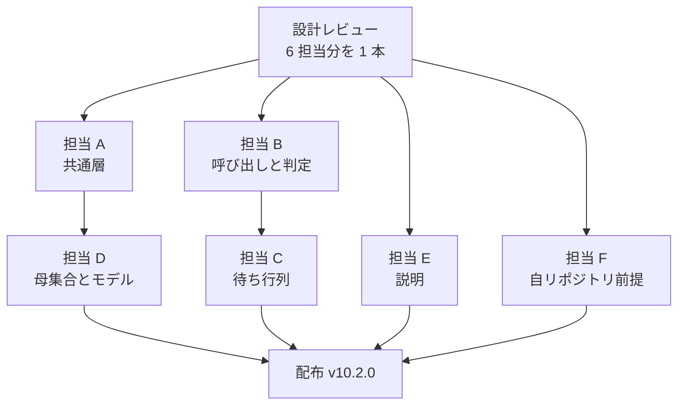

# 並行開発 バッチ 07 — 全体指示

マイルストーン v10.2.0 の 11 件を同時に進めるための指示書である。**各担当は、この文書と
自分の担当ファイルの両方を読んでから着手する。** この文書は、担当どうしが同じ行を書き
換えないための境界と、着手の順序と、担当をまたぐ約束を定める。担当ファイルだけでは、
境界と順序が分からない。

## 着手する前に知っておくこと

| 項目 | 現在の状態 |
| --- | --- |
| 現行版 | **`10.1.0`**（`main` と `develop` が同じ位置にある） |
| 次に出す版 | **`10.2.0`**。開発版は `10.2.0-dev.1` から |
| 開発の起点 | **`develop`**。`.ndf/worktree.json` の `base_branch` が宣言している |
| Pull Request の宛先 | **`develop`**。`--base develop` を必ず付ける |
| 配布の時期 | **このバッチのマージがすべて終わった後**。個別には版を上げない |
| `/goal` で工程を通すとき | 設計レビューのマージ前で 1 度止まり、承認を待つ |

**11 件の主題は `cross-review` / `cross-refactoring` 基盤の技術的負債である。** 実害が出た
2 件（#271 / #291）、任意のリポジトリで壊れる 1 件（#292）、共通層と母集合の非対称 3 件
（#285 / #280 / #216）、収束の判定に穴がある 1 件（#327）、説明が実装に追いついていない
4 件（#329 / #330 / #286 / #284）に分かれる。

## 用語

| 語 | この文書での意味 |
| --- | --- |
| 担当 | 1 件以上の課題を最後まで進める実行主体。1 担当 = 1 作業ツリー = 1 Pull Request |
| 共通層 | 2 つの Skill が読み込む Python モジュールとシェルスクリプトの置き場所。現在は `cross-review/scripts/lib/` |
| 収束 | `cross-review` で 2 つの外部 AI の両方が承認し、判定が `final = approved` を出した状態 |
| 母集合 | `cross-refactoring` が提案・レビュー・適用の担当を選ぶ元になる CLI の集合 |
| 待ち行列 | GitHub へ投稿できないときに、投稿する内容を順序付きでローカルへ積む仕組み（#291） |
| 対象リポジトリ | Skill を実行する先のリポジトリ。**ai-plugins 自身とは限らない**（#292） |
| 継続的統合 | Pull Request に対して走る GitHub Actions のジョブ群 |

**「共通層」は置き場所を指す語であり、特定のファイルを指さない。** 担当 A が移す対象は
`monitor.py` だけではない。

## 担当と課題

| 担当 | 課題 | モード | ブランチ | 指示書 |
| --- | --- | --- | --- | --- |
| A | 収束ループの共通層を 1 箇所へ寄せる（#285 / #280） | `architecture` | `refactor/issue-285-280-shared-lib` | [01-issue-285-280.md](01-issue-285-280.md) |
| B | GitHub 呼び出しを減らし、収束の判定へ継続的統合を入れる（#271 / #327） | `architecture` | `fix/issue-271-327-github-calls` | [02-issue-271-327.md](02-issue-271-327.md) |
| C | GitHub が使えない間も収束ループを進める（#291） | `architecture` | `feat/issue-291-offline-queue` | [03-issue-291.md](03-issue-291.md) |
| D | 参加する 4 CLI を同じ扱いにし、実測モデル名の限界を明示する（#216 / #284） | `standard` | `feat/issue-216-284-runtime-parity` | [04-issue-216-284.md](04-issue-216-284.md) |
| E | 手順書を分割し、説明を実装に合わせる（#330 / #329 / #286） | `standard` | `docs/issue-330-329-286-descriptions` | [05-issue-330-329-286.md](05-issue-330-329-286.md) |
| F | Skill 本文から自リポジトリ前提を外す（#292） | `standard` | `fix/issue-292-repo-agnostic` | [06-issue-292.md](06-issue-292.md) |

各担当の指示書は**受け入れ条件・設計・決定の記録・テスト設計**を持つ。実装へ入る前にこの
4 つを書き終える（バッチ 03 / 04 / 05 / 06 と同じ進め方）。

**設計 Pull Request は 6 担当分をまとめて 1 本にする。** 設計文書が別々のファイルにあり、
同じ行を書き換えないためである。

## 担当どうしの境界

| 担当 | 書き換えてよいパス | 触らないパス |
| --- | --- | --- |
| A | `plugins/ndf/scripts/lib/`（新設分） / `plugins/ndf/skills/cross-review/scripts/lib/`（削除する） / `cross-refactoring/scripts/launch-cli.sh` の読み込み行 / `cross-refactoring/SKILL.md` の 30 行と 191 行 / `external-ai/references/cli-agy.md` の 131〜132 行 / `plugins/ndf/manifests/` / 配布の経路 / `docs/specifications/` | `state.py` の本体 / `cross-review/docs/` / `SKILL.md` の手順の本文 / `cli-agy.md` の他の行 |
| B | `cross-review/scripts/state.py` の**GitHub 呼び出しの節と `cmd_judge`** / `cross-refactoring/scripts/refactor.py` の同じ節 / `launch-codex.sh` / `launch-agy.sh` の head 取得とプロンプト / `cross-review/docs/02-fix-and-rotation.md` の継続的統合の手順 | `state.py` の副コマンドの `help` 文字列 / `lib/` の移動 / `assignment.py` / `models.py` |
| C | `cross-review/scripts/state.py` の**待ち行列の節（新設）** / 共通層の待ち行列モジュール（新設） / `rotate-pr.sh` の投稿の 4 箇所 / `cross-review/docs/01`（担当 E のマージ後の分割先） | 担当 B が触る節（**B のマージ後に起点を取り込む**） / `assignment.py` / `models.py` |
| D | `assignment.py` / `models.py` / `metrics.py` の分離の理由の 3 行 / `cross-refactoring/SKILL.md` の母集合の節 / `cross-refactoring/docs/01-state-and-propose.md` / `prepare-worktrees.sh` / `refactor.py` の `--max-outer-rounds` の 1 行 / `launch-cli.sh` の 84 行の注記 / `cross-refactoring/tests/test_assignment.py` と `test_init.py` / `CLAUDE.md` の 222 行（母集合）と 231 行（モデル指定） | `state.py` / `cross-review/docs/` / 共通層の置き場所 |
| E | `cross-review/docs/01-state-and-review.md`（分割元） / 分割先の新しい文書 / `cross-review/SKILL.md` の参照と完了報告 / `state.py` の**副コマンドの `help` 文字列だけ**（18 行目と `argparse`） / `pr-review/SKILL.md` の 303〜336 行 | `state.py` の本体の処理 / `cross-review/docs/02` / `cross-refactoring/` / `cli-agy.md` の 131〜132 行 |
| F | `cross-review/docs/02-fix-and-rotation.md` の**検証コマンドの節** / 棚卸しの結果を残す文書 / Skill 執筆ルールの追記先 | `cross-review/docs/01` / `state.py` / 担当 B が触る継続的統合の手順 |

### 担当 A の移動が、担当 D の編集の下を通る

担当 A は `lib/assignment.py` と `lib/models.py` を含む共通層を移す。担当 D はその 2 つの
**中身**を書き換える。**担当 A のマージを先に済ませ、担当 D は移動後のパスで着手する。**

git は rename と content の編集を突き合わせられるが、**移動の設計そのものが担当 D の
書き換えに依存しない**ため、順序を決めるほうが安い。

### 担当 B と担当 C は同じファイルの別の節を持つ

`state.py` は 2451 行ある。担当 B は GitHub 呼び出しと `cmd_judge`、担当 C は待ち行列を
新しく足す。**担当 C は担当 B のマージ後に着手する。** 待ち行列は「投稿できないときに積む」
仕組みであり、**積む対象は担当 B が整理した後の呼び出しである**。整理の前に積む先を決めると、
減らした呼び出しの分まで待ち行列が持つことになる。

### 担当 E と担当 F は `cross-review/docs/` の別の文書を持つ

担当 E は `01-state-and-review.md` を分割し、担当 F は `02-fix-and-rotation.md` の
検証コマンドの節を直す。**`SKILL.md` を書き換えるのは担当 E だけである。** 担当 F が
`SKILL.md` に触りたくなったら、この文書の「担当をまたぐ調整」へ書き足す。

## 着手の順序

1. 6 担当が自分の指示書へ受け入れ条件・設計・決定の記録・テスト設計を書く
2. 設計 Pull Request を 1 本にまとめ、`cross-review` を通す
3. 承認を得てマージし、実装用の作業ツリーを担当ごとに作り直す
4. 担当 A / B / E / F が並行して実装し、それぞれ Pull Request を出す
5. 担当 A のマージの後に担当 D が、担当 B のマージの後に担当 C が着手する
6. 6 本のマージがすべて終わってから版を上げ、配布する

## 全担当に共通する約束

- **テストはリポジトリの根から 1 回の起動で通す。**
  `uv run --with pytest pytest scripts/tests plugins/ndf -q`
- **範囲外の課題は見つけたその場で起票する**（`out-of-scope`）。判断は 3 択に限り、
  起票しない場合も理由を 1 行残す
- **主ディレクトリで編集しない。** 開発の変更は `.worktrees/<ブランチ名>` の中で行う。
  `issues/` `docs/` と各ランタイムの設定だけが例外である
- **説明文書の版数は誰も触らない。** 版を上げるのは配布の工程である
- **対象リポジトリを ai-plugins だと決めつけない**（#292）。新しく書く手順が検証コマンドを
  指す場合は、対象リポジトリに無いときの振る舞いをセットで書く

## 設計で確定したこと

6 担当の設計を突き合わせた結果、着手前の想定から変わった点をここへ集める。**各担当は自分の
指示書に加えて、この節を読む。**

### #280 は切り出さない

着手前の想定は、`monitor.py` を工程をまたいで使える形へ抽象化することだった。**担当 A の
実測で、監視軸を差し替えなくても収束ループの外で動くことが分かった**（`--agents deploy
--stem-template … --no-require-result` で終了コード 0）。外せない前提は 2 つだけで、
`release` はどちらも満たさない。

**共通層へ移すことと、抽象化することは別である。** #285 の移動だけを行い、#280 は
「指針で足りる」結論として閉じる。

### 継続的統合の照会は `check-runs` の 1 回にする

#271 の本文は `check-runs` と `status` の REST 2 回で `gh pr checks` を置き換えると書いて
いた。**担当 B の実測で、`status` は 9 件すべて成功した commit でも `state: "pending"` /
`total_count: 0` を返す。** GitHub Actions は commit の状態を書かないためである。

2 回のまま採ると、**承認済みのラウンドが収束しなくなる**（#327 の判定がそこへ乗るため）。

### 除外を外すだけでは 4 者が回らない

#216 の本文は `IMPL_EXCLUDED` を外すことを求めている。**担当 D の実測で、それだけでは
claude が適用担当にならないラウンドが残る。** 適用担当は `pool[ラウンド % 4]` で決まり、
`--max-outer-rounds` の既定が 3 のままだと claude（索引 0）の順番であるラウンド 4 へ到達
しない。**既定を 4 へ上げる。**

### 2 か所の起動の約束は、すでに食い違っている

#286 は「片方だけが古くなる」ことを将来の危険として挙げていた。**担当 E の実測で、すでに
起きている。** `pr-review/SKILL.md` の agy の起動行に `--print-timeout` が無く、既定の
300 秒では結果ファイルが残らない（`cli-agy.md` は 900 秒を正本としている）。

### 自リポジトリ前提で直すのは 1 件だけである

#292 は構造の課題として起票された。**担当 F の棚卸し（33 Skill / Markdown 89 本、4 通りの
走査）で、直す対象は `cross-review/docs/02-fix-and-rotation.md:362` の 1 件だった。**
他の該当箇所は、記述の主題が NDF 自身であるか、配布物の形で既に分岐している。

**構造の課題は残る。** 再発防止の規約（`plugins/ndf/skills/README.md`）と機械の検査
（`scripts/check-skill-repo-assumptions.py`）が、この変更の主な中身になる。

### #291 は 1 本の Pull Request へ絞る

**担当 C は進行側の取得 9 種と投稿 4 種だけを扱う。** 起動された AI と `fix` の投稿の
責務移管は範囲外として起票する。2026-09-03 に止まったのは `init` の 1 本目の取得であり、
控え化と上限の検知だけで解ける。

### 本文への追記は設計 Pull Request のマージの後に行う

課題の本文と設計の結論が食い違ったものが 5 件ある（#280 / #271 / #216 / #286 / #291）。
**確定してから本文へ書く。**

## 担当をまたぐ調整

| 相手 | 何を調整するか |
| --- | --- |
| 担当 A → 担当 C | 待ち行列は `<作業ツリー>/.cross_review/pending/` に置き、共通層のモジュールとして書く。**置き場所の契約（相対の指し方）は担当 A が定める。シェルと Python で指し方が逆になる** |
| 担当 A → 担当 D | `assignment.py` / `models.py` / `metrics.py` は移動後のパスで書き換える。ファイル名を変えないため git の rename の検出が働く。`cross-refactoring/tests/conftest.py` の `_LIB` の指し先も確かめる |
| 担当 A ↔ 担当 E | `external-ai/references/cli-agy.md` の 131〜132 行（`monitor.py` の指し先）は**担当 A が直す**。移動の副作用であるため。同じファイルの他の行は担当 E が持つ |
| 担当 B → 担当 C | `_gh_rest` が失敗を `None` で返す形が、待ち行列を挟む位置になる。**積む・待つ・流すは `_gh_rest` の呼び出し側が持つ** |
| 担当 B ↔ 担当 E | `state.py` の `help` 文字列は担当 E、処理と関数の docstring は担当 B。担当 E が `help` へ書く終了コードは実装から読み取った値で、**担当 B が値を変えるなら `help` も一緒に直す** |
| 担当 B ↔ 担当 F | `docs/02-fix-and-rotation.md` は、担当 B が 81〜183 行（継続的統合の手順）、担当 F が 339〜369 行と 427 行（検証コマンド）。**重ならないことを両者が確かめた** |
| 担当 B → 担当 C | `rotate-pr.sh` は担当 C が持つ。担当 B は取得の削減を範囲外として起票し、この変更では触らない |
| 担当 C ↔ 担当 E | 担当 C は分割後の `docs/01`（396 行）へ待ち行列の節を足す。**余白は 104 行である。** 超えるなら次の切れ目（Step 3〜4、156 行）を担当 C が切り出し、`SKILL.md:230` の指し先も直す |
| 担当 D ↔ 担当 F | どちらも「成り立たない前提」を扱う。担当 D は参加 CLI の非対称、担当 F は対象リポジトリの非対称である。**混ぜない** |
| 担当 F → 担当 E | `cross-review/SKILL.md` の完了報告（369〜372 行）へ `verification`（実行した検証コマンドと終了コード、実行しなかった理由）を 1 項目足す。**`SKILL.md` を書き換えるのは担当 E だけである** |

## 参照

- [バッチ 06 の全体指示](../parallel-batch-06/00-overview.md) — 直前のバッチ。担当の境界の書き方はこれに倣う
- `plugins/ndf/skills/cross-review/scripts/state.py` — 収束ループの本体（2451 行）
- `plugins/ndf/skills/cross-review/scripts/lib/` — 現在の共通層
- `plugins/ndf/scripts/lib/` — プラグイン全体の共通層（`worktree-common.sh` / `lock-common.sh`）
