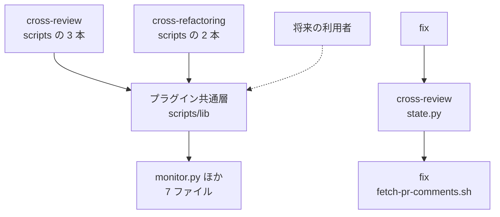

# 285 / 280: 収束ループの共通層を 1 箇所へ寄せる

`cross-review` と `cross-refactoring` が共有する部品が `cross-review` の下にあり、
`cross-refactoring` が Skill の境界をまたいで相対パスで読んでいる（#285）。同じ層にある
完了待ちの仕組みを他の工程が持たない（#280）。この文書は「どう作るか」だけを扱う。全体の
境界と着手の順序は [00-overview.md](00-overview.md) にある。

**モードは `architecture` である。** 複数モジュールにまたがり、配布の経路をどう通すかの
判断を含むためである。

## 用語

| 語 | この文書での意味 |
| --- | --- |
| 共通層 | `cross-review` と `cross-refactoring` が共有する 7 ファイルの置き場所 |
| プラグイン共通層 | `plugins/ndf/scripts/lib/`。Skill に属さず、プラグインルート直下にある |
| プラグインルート | 配布した先で `scripts/` と `skills/` が並ぶディレクトリ |
| 主ディレクトリ | リポジトリを clone したディレクトリ |
| 配布先ランタイム | Skill と scripts を配る先。Claude Code / Codex / Kiro CLI / agy |
| 配布の基準 | `plugins/ndf/manifests/*-skills.txt`。配る Skill の名前だけを持つ |
| シム | 元のパスを保つためだけに残す薄いファイル |
| 完了待ち | 別プロセスが終わったことを、複数の根拠で確かめながら待つこと |
| 監視軸 | 完了待ちが見る根拠の 1 つ。プロセス番号の控え・進捗の停止・上限時間など |
| 実行の参照 | 別のファイルを読み込む・起動する・`sys.path` へ入れる参照。文書のリンクと区別する |

**リポジトリの根にも `scripts/lib/` がある**（`version_pattern.py` を持つ）。この文書で
`scripts/lib/` と書くときは常に `plugins/ndf/` から始まる完全なパスで書く。

## 着手の前提

**担当 D（#216 / #284）はこの担当のマージの後に着手する。** 担当 D が中身を書き換える
`assignment.py` と `models.py` は、この担当が移す 7 ファイルに含まれる。順序は
[00-overview.md](00-overview.md) が定めている。

**この担当はファイルの中身を変えない。** 移動と、移動先を指す参照の書き換えだけを行う。
`monitor.py` の監視軸・`assignment.py` の母集合・`models.py` の解析は、移した後も
移す前と同じ内容である。

## 受け入れ条件

| 番号 | 条件 |
| --- | --- |
| A1 | 共通層の 7 ファイルと README が `plugins/ndf/scripts/lib/` にあり、`plugins/ndf/skills/cross-review/scripts/lib/` は無い |
| A2 | Skill の境界をまたぐ実行の参照が、既知の 2 件（`fix` と `cross-review` の相互の参照）を除いて 0 件である |
| A3 | 4 ランタイムの配置で、`skills/<名前>/scripts/` から `../../../scripts/lib/<名前>` の形で共通層へ届く |
| A4 | Python から共通層を指す経路が `.resolve()` を通り、Kiro CLI の symlink 経由でも解決する |
| A5 | `cross-review/scripts/monitor.py` のシムが、実体の名前空間を従来どおり公開する |
| A6 | `cross-review/scripts/_tmpdir.sh` を読み込むと `tmpdir()` が従来どおり引ける |
| A7 | `wait-review.sh` / `launch-agy.sh` / `cross-refactoring` の `launch-cli.sh` が従来どおり起動する |
| A8 | 既存テストで変わるのは置き場所を指す定数だけで、判定の式は変わらない |
| A9 | 配布の基準・生成・検査を書き換えずに、4 ランタイムすべてへ共通層が届く |
| A10 | `monitor.py` の引数・終了コード・監視軸が移動の前後で同じである |
| A11 | `uv run --with pytest pytest scripts/tests plugins/ndf -q` がリポジトリの根から通る |

対象範囲に含まないもの:

- `monitor.py` の中身。監視軸の追加も、工程をまたぐ抽象化も行わない（決定 6）
- `assignment.py` / `models.py` の内容（担当 D）
- 待ち行列の置き場所。契約だけをこの文書が定め、置くかは担当 C が決める
- `fix` と `cross-review` が互いの `scripts/` を起動する 2 件（範囲外として起票する）
- `external-ai` / `qa-security-scan` の完了待ちの書き方（担当 E の持ち分）

## 現状（実測）

### 共通層の中身

| ファイル | 行数 | 役割 |
| --- | --- | --- |
| `monitor.py` | 945 | 別プロセスの多軸の完了待ち |
| `metrics.py` | 262 | 担当ごとの指標算出と報告の整形 |
| `models.py` | 142 | `--model` の解析、フラグ生成、実測値の突き合わせ |
| `launch-cli.sh` | 111 | ランタイム名で分岐して背景起動する |
| `assignment.py` | 108 | ホスト判定、役割ごとの母集合の確定、担当の輪番 |
| `statefile.py` | 62 | 状態ファイルの読み書きと `KEY=VALUE` 出力 |
| `_tmpdir.sh` | 30 | 一時ディレクトリの解決 |
| `README.md` | 50 | 置いてよいものの基準と移行の段取り |

**ファイルどうしの参照は無い。** 7 ファイルのいずれも、同じディレクトリの別のファイルを
読み込んでいない。移動は 1 つのまとまりとして行える。

```bash
grep -n "SCRIPT_DIR\|^\. \|dirname" plugins/ndf/skills/cross-review/scripts/lib/*.sh
# => launch-cli.sh:53 の mkdir -p "$(dirname "$STEM")" だけ（読み込みではない）
```

### 参照元（全件）

```bash
grep -rn "scripts/lib\|/ \"lib\"\|scripts\" / \"lib\"" plugins/ndf/skills scripts/ \
  --include=*.py --include=*.sh --include=*.md | grep -v __pycache__
```

| 参照元 | 行 | 現在の指し方 |
| --- | --- | --- |
| `cross-refactoring/scripts/launch-cli.sh` | 23 | `cd -- "$SCRIPT_DIR/../../cross-review/scripts/lib" && pwd` |
| `cross-refactoring/scripts/refactor.py` | 41-44 | `sys.path.insert` に `.resolve().parent.parent.parent / "cross-review" / "scripts" / "lib"` |
| `cross-refactoring/SKILL.md` | 30, 191 | `LIB="$SKILL_DIR/../cross-review/scripts/lib"` と、その説明の 1 行 |
| `cross-refactoring/tests/conftest.py` | 21 | `_HERE.parent.parent / "cross-review" / "scripts" / "lib"` |
| `cross-review/scripts/monitor.py` | 20 | `.resolve().parent / "lib" / "monitor.py"`（21 行のシム） |
| `cross-review/scripts/_tmpdir.sh` | 16-17 | `"$(cd -- "$(dirname -- "${BASH_SOURCE[0]}")" && pwd)/lib/_tmpdir.sh"` |
| `cross-review/scripts/launch-agy.sh` | 10, 183 | `"$SCRIPT_DIR/lib/launch-cli.sh"` と、その説明の 1 行 |
| `cross-review/tests/test_launch_agy.py` | 21 | `.parent.parent / "scripts" / "lib"` |
| `cross-review/tests/test_monitor_agy.py` | 12 | 同上 + `monitor.py` |
| `cross-review/tests/test_monitor_generic_stem.py` | 199 | 同上。シムと実体の同一性を見る |
| `cross-review/tests/test_agy_naming.py` | 108 | 消したファイルが無いことを見る |
| `external-ai/references/cli-agy.md` | 131-132 | 説明の中で `scripts/lib/monitor.py` を指す |

`cross-review/scripts/state.py` は共通層を読み込まない（`sys.path` への追加が 1 件も無い）。
`cross-refactoring/docs/` と `cross-refactoring/SKILL.md` の `"$LIB/monitor.py"` は変数
経由のため、`LIB` の定義 1 行を直せば届く。

**テストのディレクトリも配布の対象である。** Codex の cache と agy の導入済みツリーの
どちらにも `skills/cross-review/tests` がある。参照の数え方から外さない。

### 配布の経路

**Skill の名前で絞り込むのは 4 ランタイムのうち 2 つだけである。** 配布の基準に無い Skill が
配布した先に残るかを、実在する欠落（`official-skills-autoloader`）で測った。

| ランタイム | 配布した先 | 基準に無い Skill | 隣の Skill から相対で届くか |
| --- | --- | --- | --- |
| Claude Code | `~/.claude/plugins/cache/ai-plugins/ndf/<版>/` | 残る（34 項目） | 届く |
| Codex | `~/.codex/plugins/cache/ai-plugins/ndf/<版>/` | 残る（34 項目、基準は 31 行） | 届く |
| Kiro CLI | 主ディレクトリへの symlink | `.kiro/skills/` からは消える | **届く**（`..` が主ディレクトリの実体へ抜ける） |
| agy | `~/.gemini/config/plugins/ndf/` | 消える（31 項目） | **届かない** |

```console
$ ls ~/.gemini/config/plugins/ndf/skills/cross-refactoring/scripts/../../official-skills-autoloader/
ls: cannot access '...': No such file or directory

$ ls -d <検証用>/.kiro/skills/cross-refactoring/scripts/../../official-skills-autoloader
<検証用>/.kiro/skills/cross-refactoring/scripts/../../official-skills-autoloader
```

**プラグインルートの `scripts/` は 4 ランタイムすべてへ届く。** 配布の基準は Skill の名前
だけを持ち、`scripts` という語を 1 件も含まない。`scripts/build-runtime-plugins.sh:142` は
`dev.agy/scripts` を `../scripts` へのディレクトリ単位の symlink として固定で生成する。

```console
$ grep -rn "scripts" plugins/ndf/manifests/     # 出力なし

$ for r in ~/.codex/plugins/cache/ai-plugins/ndf/10.1.0 ~/.gemini/config/plugins/ndf; do
>   ls "$r/skills/cross-refactoring/scripts/../../../scripts/lib/" | tr '\n' ' '; echo
> done
lock-common.sh projects-common.sh worktree-common.sh
projects-common.sh worktree-common.sh
```

Kiro CLI は検証用のディレクトリへ導入して測った。`readlink -f` は
`/work/ai-plugins/plugins/ndf/scripts/lib` を返した。

### 相対の指し方は、シェルと Python で逆になる

**バッチ 06 が定めた契約はシェルのものである。** Python でも成り立つかを Kiro CLI の
配置で測ったところ、物理的な解決の要否がシェルと逆になった。

| 言語 | 書き方 | Kiro CLI の配置での結果 |
| --- | --- | --- |
| シェル | `"$DIR/../../../scripts/lib/<名前>"`（文字列のまま） | 届く |
| シェル | `L=$(cd -- "$DIR/../../../scripts/lib" && pwd)` | 届くこともある（後述） |
| Python | `pathlib.Path(__file__).resolve().parents[3] / "scripts" / "lib"` | 届く |
| Python | `pathlib.Path(__file__).parents[3] / "scripts" / "lib"` | 届かない（`.kiro` で止まる） |

**理由は `..` を畳む主体が違うことにある。** シェルの `cd` は与えられたパスを字句で
畳んでから移動するため、symlink の手前へ戻る。Python の `.resolve()` は先に symlink を
解いてから `parents[]` を数えるため、実体の側で階層を数える。

`cd` が届くこともあるのは、字句で畳んだ先が存在しないときに元のパスで再試行するためで
ある。**畳んだ先が存在すれば、そちらが選ばれる。** 検証用のディレクトリへ
`.kiro/scripts/lib/` を作って測った。

```console
$ cd -- "<検証用>/.kiro/skills/cross-refactoring/scripts/../../../scripts/lib" && pwd
<検証用>/.kiro/scripts/lib        # 主ディレクトリの scripts/lib ではない

$ ls "<検証用>/.kiro/skills/cross-refactoring/scripts/../../../scripts/lib/launch-cli.sh"
# 文字列のまま渡すと、カーネルが物理的に解決して主ディレクトリ側へ届く
```

Kiro CLI が作るのは `agents` / `prompts` / `skills` / `steering` の 4 つで、`.kiro/scripts`
は作られない。この条件は将来の導入手順に依るため、文字列のまま指す形を契約にする。

### 完了待ちの現状（#280）

**`monitor.py` の 945 行のうち、一時ファイルの命名とランタイム名から離れている行は
227 行である。** 関数とクラスの合計 775 行を単位に数えた。

| 分類 | 行数 |
| --- | --- |
| 一時ファイルの命名の規約に触れる | 374 |
| ランタイム名（codex / agy / claude / kiro）に触れる | 486 |
| どちらにも触れない | 227 |

**命名の規約は引数で差し替えられる。** 収束ループの外の仕事を模した背景プロセスを、
ランタイム名にない `deploy` という名前で監視させた。

```console
$ python3 monitor.py 99 --agents deploy --tmp-dir "$PWD/mon" \
    --stem-template '{agent}-job{id}' --no-require-result --timeout 60 --poll 2
[deploy] ✅ deploy OK (4s) — process exited; sentinel=False; result_exists=False
exit=0

$ rm -f mon/deploy-job99.pid && python3 monitor.py 99 --agents deploy ...
[deploy] ❓ deploy PIDFILE_BAD (0s) — pidfile not found: .../deploy-job99.pid
exit=6
```

**差し替えられない前提は 2 つある。**

| 前提 | 実測 |
| --- | --- |
| 識別子が整数であること | `monitor.py: error: argument pr: invalid int value: '10.2.0'` |
| プロセス番号の控えがあること | 控えを消すと `PIDFILE_BAD`（終了コード 6） |

一覧に無いランタイム名の進捗停止の既定は 180 秒で、`codex` と同じ値である
（`_agent_stall_default("deploy")` が 180 を返す）。

**他の工程が待つ対象は、この 2 つの前提と噛み合うものと、噛み合わないものに分かれる。**

| Skill | 待つ対象 | 現在の書き方 | 前提と噛み合うか |
| --- | --- | --- | --- |
| `external-ai` | 自分が背景起動した CLI | `until grep -q '^tokens used$' …; do sleep 30; done`（上限なし） | 噛み合う。控えを書けば足りる |
| `qa-security-scan` | 同上 | 同上（`03-report-template.md:129`） | 噛み合う |
| `release` | 配備先が返す状態 | ログの 3 軸の見張り（`completion-check.md`） | 噛み合わない。プロセス番号が無い |
| `quality-gates` | 前面で走るテストとビルド | 待ちの記述を持たない（`grep` の結果 0 件） | 対象が無い |
| `pr-review` | 前面の読み取り | 同上 | 対象が無い |

`release/references/completion-check.md:36` は「再起動・pidfile・結果ファイルの規約は
持たず、ログの読み取りだけを行う」と自ら書いている。

### テストの現状

```console
$ uv run --with pytest pytest plugins/ndf/skills/cross-review/tests \
    plugins/ndf/skills/cross-refactoring/tests -q
744 passed in 28.31s

$ uv run --with pytest pytest scripts/tests plugins/ndf -q
1967 passed in 96.02s (0:01:36)
```

## 構成要素

| 要素 | 責務 |
| --- | --- |
| `plugins/ndf/scripts/lib/` の 7 ファイル | 収束ループの共通層。中身は移動の前後で同じ |
| `plugins/ndf/scripts/lib/README.md` | このディレクトリに置いてよいものの基準 |
| `cross-review/scripts/monitor.py` | 21 行のシム。実体の名前空間をこのモジュールへ展開する |
| `cross-review/scripts/_tmpdir.sh` | 21 行の束ね。`cross-review` の環境変数名と既定の名前を与える |
| `scripts/tests/test_shared_lib_layout.py`（新設） | 置き場所・4 ランタイムの解決・境界をまたぐ実行の参照を検査する |
| `scripts/check-cross-skill-refs.py`（新設） | 境界をまたぐ実行の参照を数える。例外の一覧を持つ |

**`cross-review/scripts/lib/` にシムを残さない。** 残すと、#285 が指している経路が
そのまま使える状態が続き、境界をまたぐ実行の参照の検査も同じ行を拾い続ける。既存の
2 つのシム（`monitor.py` / `_tmpdir.sh`）は `cross-review/scripts/` の側に残り、指し先が
1 階層深くなるだけである。

## 入出力の契約

### 共通層を指す書き方

| 読み込む側の位置 | 言語 | 書き方 |
| --- | --- | --- |
| `<プラグインルート>/skills/<名前>/scripts/` | シェル | `"$DIR/../../../scripts/lib/<名前>"`（`DIR` は `cd $(dirname) && pwd`） |
| 同上 | Python | `pathlib.Path(__file__).resolve().parents[3] / "scripts" / "lib"` |
| `<プラグインルート>/skills/<名前>/scripts/lib/` | シェル | `"$DIR/../../../../scripts/lib/<名前>"`（バッチ 06 の契約） |

**シェルでは `cd` で登ってから `pwd` を取らない。** Python では逆に `.resolve()` を通す。
どちらも「symlink を解いた側で階層を数える」ことを求めているが、シェルの `cd` は字句で
畳むため、同じ目的の書き方が逆になる。

### 移動の前後の対応

| 移動前 | 移動後 |
| --- | --- |
| `plugins/ndf/skills/cross-review/scripts/lib/<名前>` | `plugins/ndf/scripts/lib/<名前>` |
| `cross-refactoring` の `LIB` の値 | `$SKILL_DIR/../../scripts/lib` |
| `cross-refactoring/scripts/launch-cli.sh` の `LIB` | `$SCRIPT_DIR/../../../scripts/lib`（`cd` を通さない） |
| `refactor.py` の `sys.path` の 1 件 | `.resolve().parents[3] / "scripts" / "lib"` |
| `cross-review/scripts/monitor.py` の指し先 | `.resolve().parents[3] / "scripts" / "lib" / "monitor.py"` |
| `cross-review/scripts/_tmpdir.sh` の読み込み | `"$DIR/../../../scripts/lib/_tmpdir.sh"` |
| `launch-agy.sh` の起動 | `"$SCRIPT_DIR/../../../scripts/lib/launch-cli.sh"` |

**ファイル名は変えない。** 名前も同時に変えると、担当 D が `assignment.py` と `models.py`
の中身へ入れる変更を、移動の差分と突き合わせにくくなる。git の rename の検出が働く形に
しておけば、2 つの変更は別々に読める。

### 境界をまたぐ実行の参照の数え方

**文書のリンクは対象にしない。** Skill をまたぐリンクは `../development-workflow/references/`
の形で 20 件あり、いずれも読み手を案内するものである。数えるのは、読み込み・起動・
`sys.path` への追加に現れる参照に限る。

**Skill 名だけを手がかりにすると、数えなくてよい行が入る。** Skill 名には `pr` / `fix` /
`worktree` / `refactoring` のように、コマンドの副命令や語としても現れるものがある。
Python のパス連結を `"<Skill 名>"` だけで拾うと 65 件になり、そのうち 60 件は
`["gh", "pr", "view", …]` のような別の用途である。直後に `"scripts"` が続く形へ絞ると、
拾うのは実行の参照だけになる。

| 数え方 | 件数 |
| --- | --- |
| 相対パスの形（`../<Skill 名>/`）で、文書のリンクではないもの | 4 |
| Python のパス連結で `"<Skill 名>" / "scripts"` の形 | 3 |
| 上の 2 つを合わせた実数（重複を除く） | 7 |

| 時点 | 件数 | 内訳 |
| --- | --- | --- |
| 移動の前 | 7 | `cross-refactoring` → `cross-review` が 5 件、`fix` と `cross-review` の相互が 2 件 |
| 移動の後 | 2 | `fix/SKILL.md:319` と `cross-review/scripts/state.py:1152` |

残る 2 件は例外の一覧へ、起票した課題の番号とともに書く。**例外を書けること自体が、
新しく増えた参照と、既に知っている参照を分ける。**

## 処理の流れ

移動の後に、誰が何を読むかを示す。共通層は Skill に属さないため、2 つの Skill は
どちらもプラグインルートを経由して同じファイルへ届く。



下の 2 本は移動の後も残る Skill どうしの参照で、決定 5 の例外の一覧に載る。

## 決定の記録

### 決定 1: 移動先を `plugins/ndf/scripts/lib/` にする

配布の基準に無い Skill が配布した先から消えるのは agy だけで、そのとき隣の Skill への
相対の参照は届かなくなる（実在の欠落で測った）。プラグインルートの `scripts/` は基準の
対象ではないため、4 ランタイムすべてへ届く。この位置なら、配布先ごとに配る Skill を
絞る判断が入っても共通層は残る。

`cross-review` の下に置いたまま、配布の基準へ「`cross-refactoring` を配るなら
`cross-review` も配る」という決まりを足す形は採らない。基準は Skill の名前だけを持つ
一覧で、依存を書く欄が無い。欄を作ると、Skill を足すたびに 4 本の一覧へ依存を書き足す
作業が生まれる。

共通層のための Skill を新設する形も採らない。`cross-review/scripts/lib/README.md` が
書くとおり、利用者が呼ぶものではないのに初期一覧へ載り、発動の候補に混ざる。

### 決定 2: 下位のディレクトリを作らず、7 ファイルを直接置く

`plugins/ndf/scripts/lib/` には現在 3 つのシェルファイルがある。7 つを足すと 10 になる。
[00-overview.md](00-overview.md) がこの位置を移動先として名指ししており、階層を 1 つ足すと
バッチ 06 が定めた相対の指し方から段数が変わる。

`converge/` のような呼び名で束ねる形は採らない。`monitor.py` は収束ループの外からも
使える（`deploy` という名前で実測）。呼び出し側の都合を名前にすると、後から使う工程が
名前と合わなくなる。

### 決定 3: `cross-review/scripts/` の 2 つのシムを残す

`monitor.py` の 21 行のシムは、実体を `exec` で読み込んで名前空間をこのモジュールへ
展開する。`mock.patch.object(monitor_mod, "_pid_alive", ...)` を使う既存テストが、実体側
モジュールではなくこのモジュールを差し替えるためである。`wait-review.sh:30` も
`"$SCRIPT_DIR/monitor.py"` を起動する。

`_tmpdir.sh` の 21 行は、`CROSS_REVIEW_TMP_DIR` と `.cross_review` という
`cross-review` 固有の値を共通層の `resolve_tmpdir` へ渡す層である。共通層は環境変数名と
ディレクトリ名を引数で受けるため、この束ねが無いと呼び出し側が毎回 2 つの値を書く。

シムを消して呼び出し元とテストを全部書き換える形は採らない。この課題で減らしたいのは
Skill の境界をまたぐ参照であって、Skill の中の層の数ではない。

### 決定 4: シェルは文字列のまま指し、Python は `.resolve()` を通す

Kiro CLI の配置で測ると、シェルの `cd` は `..` を字句で畳んで symlink の手前へ戻り、
Python の `parents[]` は `.resolve()` を通さないと `.kiro` で止まる。**同じ目的に対して、
物理的な解決を「避ける」側と「求める」側が言語で入れ替わる。**

`cd` は畳んだ先が存在しないときに元のパスで再試行するため、現在の配置では届く。
`.kiro/scripts/lib/` を作ると畳んだ先が選ばれることを実測したため、再試行に依存しない形を
契約にする。

プラグインルートを環境変数で受け取る形は採らない。agy はプラグインルートを指す環境変数を
持たない（バッチ 06 の実測）。候補を順に試して探す形も採らない。探す手順は 4 ランタイム分の
候補を並べるもので、分量が読み込みの 1 行より大きくなる。

### 決定 5: 境界をまたぐ実行の参照を検査し、既知の 2 件を例外に置く

`fix` と `cross-review` は互いの `scripts/` を起動する。`fix/SKILL.md:319` が
`cross-review/scripts/state.py` を、`cross-review/scripts/state.py:1152` が
`fix/scripts/fetch-pr-comments.sh` を呼ぶ。どちらも共通層ではなく Skill の本体であり、
移す対象にならない。件数を 0 件にするには 2 つの Skill の側の設計が要るため、この担当では
例外として明示する。

例外を置かず検査そのものを入れない形は採らない。#285 は、境界をまたぐ参照が 1 件だけの
うちは表面化しないことを問題にしている。**増えたときに気づく手段が無い状態は、移動の後も
同じである。**

### 決定 6: `monitor.py` を工程をまたぐ形へ抽象化しない

#280 が挙げた 3 つの工程のうち、`quality-gates` と `pr-review` は背景プロセスを持たない
（待ちの記述が 0 件）。`release` が待つのは配備先が返す状態で、プロセス番号の控えが無い。
`monitor.py` が差し替えられない前提はこの 2 つ（整数の識別子とプロセス番号の控え）であり、
`release` はどちらも満たさない。

`external-ai` と `qa-security-scan` は自分で背景起動しており、前提と噛み合う。両者の
現在の待ちは `until grep -q …; do sleep 30; done` で上限を持たない。**ここは移す先が
決まってから扱う。** 参照の書き換えと待ち方の変更を同じ Pull Request に入れると、
振る舞いが変わる変更と変わらない変更が混ざる。

監視軸を差し替え可能にする形も採らない。`release` に要る軸（レジストリの登録時刻・
配備先が返す版数）は、待つ対象が別プロセスではなく配布先の状態である。同じ枠へ入れると、
プロセス番号を持たない経路のために分岐が増える。

### 決定 7: 配布の基準・生成・検査は書き換えない

`plugins/ndf/manifests/*-skills.txt` の 4 本は Skill の名前だけを持ち、`scripts` という語を
含まない。`scripts/build-runtime-plugins.sh:142` は `dev.agy/scripts` をディレクトリ単位の
symlink として固定で生成する。`plugins/ndf/scripts/lib/` へファイルを 7 つ足しても、
どちらも書き換えを必要としない（バッチ 06 の決定 5 と同じ根拠）。

### 決定 8: 共通層の README を移動先へ移し、対象を広げる

`plugins/ndf/scripts/lib/` に README は無い。移す README は「`cross-review` 配下に置く
理由」を持つため、その節を「プラグインルート直下に置く理由」へ書き直し、既にある 3 つの
シェルファイルも表へ入れる。

`cross-review` 側に README を残す形は採らない。残すと、置いてよいものの基準が 2 箇所に
なる。

## テスト設計

新設する `scripts/tests/test_shared_lib_layout.py` が受け持つ。**リポジトリの根の
`scripts/tests/` へ置くのは、検査の対象が 2 つの Skill と配布の経路にまたがるためである**
（`test_lock_common.py` と同じ理由）。

| 受け入れ条件 | 何で確かめるか |
| --- | --- |
| A1 | 7 ファイルと README が移動先にあり、`cross-review/scripts/lib` が存在しない |
| A2 | 境界をまたぐ実行の参照が、例外の一覧に載る 2 件だけである |
| A3 | 2 通りの配置を一時ディレクトリへ組み立て、`skills/<名前>/scripts/` からシェルの形で共通層のファイルを読み込める |
| A4 | 同じ 2 通りの配置で、`.resolve().parents[3]` が共通層を指す。`.resolve()` を外すと指さない |
| A5 | シムを読み込んだモジュールに `_pid_alive` があり、差し替えが実体側の呼び出しへ届く |
| A6 | `_tmpdir.sh` を読み込んだシェルで `tmpdir` が定義済みとして引ける |
| A7 | 3 本の起動スクリプトを `--help` に相当する引数で起動し、共通層の読み込みで落ちない |
| A8 | 既存テストの差分が、置き場所を指す定数の行だけである（実装時に差分で確認する） |
| A10 | `monitor.py` に `--stem-template` と `--no-require-result` を渡した実行が、移動の前と同じ終了コードを返す |
| A11 | `uv run --with pytest pytest scripts/tests plugins/ndf -q` がリポジトリの根から通る |

A3 と A4 の配置の組み立ては 2 通りで足りる。実測した 4 ランタイムのうち Claude Code /
Codex / agy は同じ形（プラグインルート直下に `scripts/` と `skills/` が並ぶ）で、Kiro CLI
だけが `.kiro/skills/<Skill 名>` を symlink にする。

| 組み立てる配置 | 代表するランタイム |
| --- | --- |
| プラグインルート直下に `scripts/` と `skills/` を並べる | Claude Code / Codex / agy |
| 別の位置の `.kiro/skills/<Skill 名>` を、上の配置の `skills/<Skill 名>` への symlink にする | Kiro CLI |

**A4 は `.resolve()` を外した場合も測る。** 外すと `.kiro` で止まることを実測しており、
契約が守られているかは「届く」ことだけでは見分けられない。

`scripts/check-cross-skill-refs.py` の検査は `scripts/tests/test_cross_skill_refs.py` が
受け持つ。例外の一覧に無い参照を 1 件足した木で、検査が失敗することを確かめる。

## 未確認のまま残ること

| 項目 | 内容 |
| --- | --- |
| agy の導入済みツリーの版 | このホストの `~/.gemini/config/plugins/ndf/` は `lock-common.sh` を持たない古い版である。届くことは `worktree-common.sh` で測った。移動の後に入れ直して測り直す |
| Claude Code の最新版での配置 | このホストの cache に `10.1.0` が無く、`10.0.0` で測った。プラグインルート直下に `scripts/` と `skills/` が並ぶ形は 2 つの版で同じである |
| `cd` の再試行の振る舞い | `bash` 5.3.9 で測った。他のシェルは経路に現れない（起動は 4 ランタイムとも `bash`） |
| `external-ai` / `qa-security-scan` の待ちの置き換え | 前提とは噛み合うことを測ったが、置き換えの設計はこの担当の範囲外である |
| Kiro CLI 以外で Skill だけを絞る配布先 | 現在は agy だけである。増える場合、A3 の組み立てへ 1 つ足す |

## 担当をまたぐ調整

| 相手 | 何を調整するか |
| --- | --- |
| 担当 D | `assignment.py` / `models.py` は移動後のパスで書き換える。**この担当のマージを待つ。** ファイル名は変えないため、git の rename の検出が働く |
| 担当 D | `cross-refactoring/SKILL.md` は、この担当が 30 行目と 191 行目（共通層の位置）だけを触る。母集合の節は担当 D が持つ |
| 担当 C | 待ち行列を共通層へ置く場合の指し方は「共通層を指す書き方」の表に従う。**置くかどうかは担当 C が決める** |
| 担当 B | `lib/` へ新しいモジュールを足す場合は移動先へ置く。この担当は `state.py` に触らない |
| 担当 E | `external-ai/references/cli-agy.md:131-132` が `scripts/lib/monitor.py` を指す。指し先が変わるため、担当 E の変更へ含めるか、この担当が 1 行だけ直すかを決める |

## 範囲外として起票すべき事項

| 見つけたこと | 判断 |
| --- | --- |
| `fix` と `cross-review` が互いの `scripts/` を起動する（`fix/SKILL.md:319` と `cross-review/scripts/state.py:1152`）。agy ではどちらかが配布の基準から外れた時点で届かなくなる。`state.py` と `fetch-pr-comments.sh` は共通層ではないため、この担当の移動では解決しない。`state.py:1152` は取得に失敗すると `die` で中断する | 起票する。決定 5 の例外の一覧に、起票した番号を書く |
| `external-ai/references/cli-codex.md:111` と `qa-security-scan/03-report-template.md:129` の待ちが `until grep -q …; do sleep 30; done` で上限を持たない。`monitor.py` の前提とは噛み合う（実測） | 起票する。#280 の結論（切り出さない）とは別に、上限のない待ちは残る |
| このホストの agy の導入済みツリーが `10.1.0` より古く、`lock-common.sh` を持たない。agy には入れ替えの操作が無く、外してから入れ直す必要がある | 起票しない。導入の手順は `AGENTS.md` に書かれており、実測に使ったホストの状態であって、リポジトリの欠落ではない |

## 参照

- [00-overview.md](00-overview.md) — 境界と着手の順序
- [04-issue-216-284.md](04-issue-216-284.md) — 担当 D。`assignment.py` / `models.py` の中身
- `issues/parallel-batch-06/03-issue-293.md` — 相対の指し方の契約と、4 ランタイムの配置の実測
- `plugins/ndf/skills/cross-review/scripts/lib/README.md` — 置いてよいものの基準（移動の対象）
- `plugins/ndf/skills/release/references/completion-check.md` — 配備の完了の確かめ方
