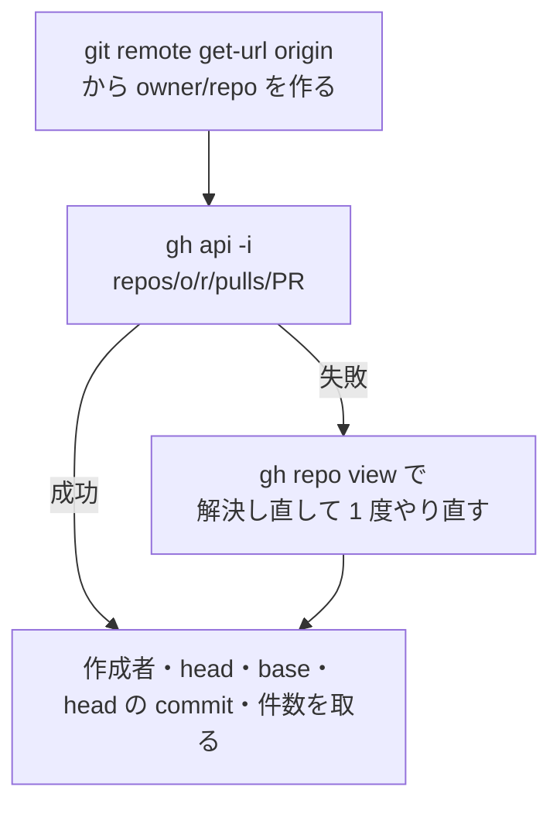
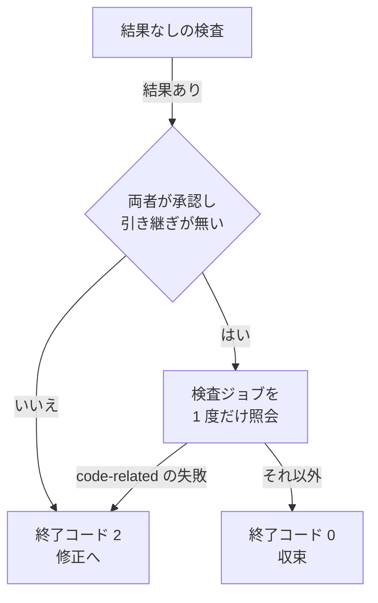

# 担当 B — GitHub の呼び出しを減らし、収束の判定へ継続的統合を入れる（#271 / #327）

- issue: https://github.com/devbasex/ai-plugins/issues/271 / https://github.com/devbasex/ai-plugins/issues/327
- ブランチ: `fix/issue-271-327-github-calls`
- モード: `architecture`

`architecture` のため、この文書は受け入れ条件・設計・決定の記録・テスト設計を持つ。実装は
設計 Pull Request のマージ後に行う。

## 用語

| 語 | この文書での意味 |
| --- | --- |
| 枠 | GitHub が 1 時間ごとに数える利用量の上限。REST と GraphQL で別々に数える |
| 点 | 枠の消費の単位。応答ヘッダの `x-ratelimit-used` が返す値の増分 |
| 検査ジョブ | Pull Request の head の commit に対して GitHub が記録する 1 件の検査。REST の `check_runs` の 1 要素にあたる |
| 照会 | 検査ジョブの状態を GitHub から読み取る操作 |
| 収束 | 2 つの外部 AI の両方が承認し、`cmd_judge` が終了コード 0 を返した状態 |
| 判定 | `cmd_judge`。ラウンドの結果から収束・修正・起動し直しのどれへ進むかを決める |
| 分類 | 失敗した検査ジョブの名前を code-related と meta-only へ振り分ける処理 |
| 進行側 | `cross-review` の手順を回している側。外部 AI と修正の担当を起動する |

**「検査ジョブ」は 1 件の検査を指し、継続的統合の全体を指さない。** 継続的統合は
`00-overview.md` の定義（Pull Request に対して走る GitHub Actions のジョブ群）に従う。

## 何を解決するか

| 課題 | 現在の状態 |
| --- | --- |
| #271 | 収束ループが同じ Pull Request へ何度も問い合わせ、GraphQL 側の枠だけが先に尽きる。REST 側の枠は残ったまま進行が止まる |
| #327 | 収束の判定が 2 つの外部 AI の判定だけを読む。検査ジョブが落ちていても、両者が承認すれば収束する |

**2 件は同じ層に触れる。** #271 の「継続的統合の状態取得を REST へ移す」と、#327 の「判定が
継続的統合を照会する」は、どちらも検査ジョブの状態を読む処理である。**照会の実装は
1 箇所に持つ**（決定 5）。

## 現状（実測）

実測はすべて `develop`（`2fec8d5`）で `gh version 2.100.0` を使って行った。対象は
`devbasex/ai-plugins` のマージ済み Pull Request #320 とその head の commit である。
**投稿の副作用が出る操作は測っていない**（残リスクの節）。

### 1 コマンドあたりの投げ先と回数

`GH_DEBUG=api` の出力から、`Request to https` の行数と `X-Ratelimit-Resource` を数えた。

| コマンド | 投げ先 | リクエスト数 |
| --- | --- | --- |
| `gh pr view 320 --json author` | `POST /graphql` | 1 |
| `gh pr view 320 --json author,headRefName,baseRefName,headRefOid,changedFiles` | `POST /graphql` | 1 |
| `gh repo view --json nameWithOwner` | `POST /graphql` | 1 |
| `gh pr checks 320 --json name,state` | `POST /graphql` | 4 |
| `gh pr comment 999999 --body x`（照合の段だけ。存在しない番号で失敗させた） | `POST /graphql` | 1 |
| `gh pr close 999999`（同上） | `POST /graphql` | 1 |
| `gh api repos/{owner}/{repo}/pulls/320` | `GET`（REST） | 1 |
| `gh api repos/{owner}/{repo}/commits/{sha}/check-runs` | `GET`（REST） | 1 |

**項目を増やしても `gh pr view` は 1 リクエストのままである。** 5 項目をまとめて求めた
呼び出しも 1 リクエストで、`author` / `baseRefName` / `changedFiles` / `headRefName` /
`headRefOid` がすべて返った。現状の 3 回は、同じ Pull Request へ項目ごとに別のコマンドを
投げていることによる。

**`gh pr checks` の 4 リクエストは 4 点を消費する。** 応答ヘッダの `x-ratelimit-used` が
54 → 55 → 56 → 57 と 1 ずつ増えた。ここで扱う問い合わせは 1 リクエスト = 1 点である。

### `gh pr checks` と REST の照会は同じ判断を返す

PR #320 の head（`b87b3ae`）で、名前の集合が一致した。

```console
$ gh pr checks 320 --json name,state | jq -r '.[].name' | sort   # 9 件
$ gh api repos/devbasex/ai-plugins/commits/b87b3ae/check-runs \
    --jq '[.check_runs[].name] | sort'                            # 同じ 9 件
```

#327 が挙げた失敗の commit（`4d9d094`、同じブランチの 1 つ前の head）でも同じ経路で読める。

```console
$ gh api repos/devbasex/ai-plugins/commits/4d9d094/check-runs \
    --jq '{total: .total_count, failed: [.check_runs[]|select(.conclusion=="failure")|.name]}'
{"failed":["pytest"],"total":9}
```

**7 桁に略した commit でも同じ結果が返る。** 状態ファイルの `fix.commit` は略した形で書かれる
ことがあるため、この経路がそのまま使える。

### 併記された状態の照会は、この対象リポジトリでは使えない

#271 は REST 2 回（`check-runs` と `status`）を挙げているが、**`status` は
GitHub Actions だけを使うリポジトリでは保留を返す**。

```console
$ gh api repos/devbasex/ai-plugins/commits/b87b3ae/status \
    --jq '{state, total_count, statuses: (.statuses|length)}'
{"state":"pending","statuses":0,"total_count":0}
```

9 件すべてが成功したこの commit で `state` が `pending` になる。**この値を保留として読むと、
承認されたラウンドが収束しない。** 照会は `check-runs` の 1 回だけにする（決定 4）。

### 収束の判定は検査ジョブを読んでいない

`cmd_judge`（`state.py:1778-1847`）が読むのは `rounds[-1]` の `intent` と引き継いだ指摘だけで、
`ci` の語は現れない。検査ジョブの状態を読むのは `cmd_merge_fix`（`state.py:2133-2162`）で、
そこは修正のラウンドを通ったときにしか走らない。

```console
$ sed -n '1778,1847p' plugins/ndf/skills/cross-review/scripts/state.py | grep -c 'ci_status\|check'
0
```

分類の実装（`state.py:2138-2153`）は `cmd_merge_fix` の中にべた書きされており、判定から
呼べる形になっていない。

### 呼び出しの箇所

`grep -n 'gh api\|gh pr\|gh repo\|graphql'` で洗い出した、進行側が投げる箇所である。

| 箇所 | 呼び出し | 投げ先 | 回数 |
| --- | --- | --- | --- |
| `state.py:1046`（`cmd_init`） | `gh repo view --json nameWithOwner` | GraphQL | 実行ごと 1 |
| `state.py:1118` | `gh api user` | REST | 実行ごと 1 |
| `state.py:1119` / `1126` / `1127` | `gh pr view --json author` / `headRefName` / `baseRefName` | GraphQL | 実行ごと 3 |
| `state.py:668`（`_fetch_changed_files`） | `gh api repos/{repo}/pulls/{pr}/files` | REST | 実行ごと 1 以上 |
| `state.py:307`（`_resolve_head_ref`） | `gh pr view --json headRefName,headRefOid,isCrossRepository` | GraphQL | ラウンドごと 1 |
| `launch-codex.sh:40` | `gh pr view --json headRefOid` | GraphQL | ラウンドごと 1 |
| `launch-agy.sh:34` | 同上（同じ値） | GraphQL | ラウンドごと 1 |
| `docs/02-fix-and-rotation.md:85`（修正の担当へ渡す手順） | `gh pr checks` | GraphQL | ラウンドごと 4 |
| `state.py:1508`（`_fetch_unresolved_threads`） | `gh api graphql --paginate` | GraphQL | 呼び出しごと 1 以上 |
| `state.py:1417` / `1466` | `gh api repos/{repo}/pulls/{pr}/reviews/...` | REST | ラウンドごと 2 |

`refactor.py` には検査ジョブを照会する箇所が無い。

```console
$ grep -c 'ci_status\|check-runs\|pr checks' plugins/ndf/skills/cross-refactoring/scripts/refactor.py
0
```

`refactor.py:982-992` と `refactor.py:1023` は `state.py` と同じ形で作成者・head・base・
リポジトリ名を項目ごとに取っている。

### 残量は、通常の要求の応答ヘッダからしか読めない

#271 が書いた食い違いを追試した。**本文とヘッダの違いではなく、`rate_limit` の応答そのものが
0 を返す。** 同じ時刻の通常の REST 応答は 26 点の消費を返した。

```console
$ gh api -i rate_limit | grep -i '^x-ratelimit-\(used\|remaining\|resource\)'
X-Ratelimit-Remaining: 5000
X-Ratelimit-Resource: core
X-Ratelimit-Used: 0

$ gh api -i repos/devbasex/ai-plugins/pulls/320 | grep -i '^x-ratelimit-\(used\|remaining\)'
X-Ratelimit-Remaining: 4975
X-Ratelimit-Used: 25
```

リセット時刻も別の値（`1788508533` と `1788508178`）で、別の窓を見ている。**原因は未確認である。**

**`gh api -i` は 1 回の呼び出しでヘッダと本文の両方を返す。** 先頭行から空行までがヘッダで、
その後が JSON である（25 個のヘッダと `total_count` を同じ出力から読み取れた）。残量を読む
ために呼び出しを増やす必要は無い。

### テストの現状

```console
$ uv run --with pytest pytest plugins/ndf/skills/cross-review/tests -q
335 passed in 1.20s
```

既存のテストは `monkeypatch.setattr(state_mod, "_fetch_unresolved_threads", ...)` の形で
GitHub を呼ばずに検査している（`test_state_round_guard.py:188`）。

## 受け入れ条件

### 条件 1: 実行ごとの GraphQL の消費を 0 点にする

初期化の経路で GraphQL へ投げない。

| 段 | 現状 | 受け入れ後 |
| --- | --- | --- |
| リポジトリ名の解決 | GraphQL 1 | 0（git の設定から求め、REST の応答で確かめる） |
| 作成者・head・base | GraphQL 3 | 0（REST 1 にまとめる） |
| head の commit | 取っていない | 同じ REST 1 に含める |
| 合計 | GraphQL 4 / REST 2 | GraphQL 0 / REST 3 |

### 条件 2: ラウンドごとの GraphQL の消費を 7 点から 0 点にする

| 箇所 | 現状 | 受け入れ後 |
| --- | --- | --- |
| `_resolve_head_ref` | GraphQL 1 | REST 1 |
| `launch-codex.sh` の head の commit | GraphQL 1 | 0（状態ファイルから読む） |
| `launch-agy.sh` の head の commit | GraphQL 1 | 0（同上） |
| 修正の担当へ渡す検査ジョブの照会 | GraphQL 4 | REST 1 |
| 判定の照会（新設） | 無し | REST 1 |
| 合計 | GraphQL 7 / REST 0 | GraphQL 0 / REST 3 |

**5 ラウンドの実行で、進行側の GraphQL は 39 点から 0 点へ減る**（実行ごと 4 + ラウンドごと
7 × 5）。未解決の指摘の照会と Resolve は GraphQL のまま残るため、実行全体が 0 点になるわけ
ではない。**REST は 5 ラウンドで 17 回から 33 回へ増える**（上限 5,000 に対して 0.7 ポイント分）。

### 条件 3: 検査ジョブが落ちているラウンドを収束させない

`cmd_judge` は、両者が承認し引き継いだ指摘が無いラウンドで、収束を返す前に 1 度だけ照会する。

| 照会の結果 | 終了コード | 状態ファイルへ残すもの |
| --- | --- | --- |
| code-related の失敗が 1 件以上 | 2（修正へ） | `ci.verdict = "code_failure"` と失敗した名前 |
| meta-only の失敗だけ | 0（収束） | `ci.verdict = "meta_only"` と `ci.note` |
| 完了した失敗が無く、未完了が 1 件以上 | 0（収束） | `ci.verdict = "pending"` と未完了の名前 |
| すべて成功 | 0（収束） | `ci.verdict = "success"` |
| 照会できなかった | 0（収束） | `ci.verdict = "unverified"` と理由 |

### 条件 4: 実行中の検査ジョブを失敗として扱わない

`status` が `completed` 以外（`queued` / `in_progress` / `waiting` など）の検査ジョブは、
判定の対象から外す。完了を待たない。**未完了のまま収束したことを、判定の出力と状態ファイルへ
残す。** `/ndf:fix` の手順 7（`plugins/ndf/skills/fix/SKILL.md:227`）と同じ扱いになる。

### 条件 5: 照会できないときに収束を止めない

次のいずれも「照会できなかった」として扱い、収束させる。

- `gh` の実行に失敗した、または終了コードが 0 以外
- head の commit が状態ファイルにも REST の応答にも無い
- 応答が `HTTP 422`（GitHub 側に無い commit。未 push のときに起きる）
- `total_count` が 0（検査ジョブを 1 件も持たないリポジトリを含む）

いずれの場合も判定は終了コード 0 を返し、`ci.verdict = "unverified"` と理由を残す。

### 条件 6: 退行させない

- 既存の 335 件を、期待値を変えずに通す
- `uv run --with pytest pytest scripts/tests plugins/ndf -q` が終了コード 0 で終わる
- `cmd_merge_fix` の分類の結果が変わらない（同じ名前の一覧に対して同じ判断を返す）

## 対象範囲

### 含む

- `state.py` の GitHub 呼び出しの節（`_resolve_head_ref` / `_fetch_changed_files` / `cmd_init`）
- `state.py` の `cmd_judge` と、分類を切り出した関数
- `refactor.py:982-992` / `refactor.py:1023` の同じ形の呼び出し
- `launch-codex.sh` / `launch-agy.sh` の head の commit の取得とプロンプト
- `cross-review/docs/02-fix-and-rotation.md` の継続的統合の手順（手順 3）

### 含まない

| 含まないもの | 理由 |
| --- | --- |
| `state.py` の副コマンドの `help` 文字列 | 担当 E の持ち物（`00-overview.md` の境界） |
| `lib/` のファイルの移動と新設 | 担当 A が移送中。新しいモジュールは足さない（決定 5） |
| 待ち行列と、上限に達したときの待機 | 担当 C の持ち物（決定 8） |
| `rotate-pr.sh` の呼び出し | 境界の外。範囲外として起票する |
| `plugins/ndf/skills/fix/SKILL.md` の検査ジョブの確認 | 境界の外。範囲外として起票する |
| 説明文書の版数 | 版を上げるのは配布の工程 |

## 設計

### 照会の層

新しい関数を `state.py` に 3 つ置く。**`lib/` へ新しいファイルを足さない**（決定 5）。

| 関数 | 責務 | GitHub の呼び出し |
| --- | --- | --- |
| `_gh_rest(path)` | `gh api -i <path>` を 1 回投げ、ヘッダと本文を組で返す。失敗は `None` | REST 1 |
| `_fetch_check_runs(repo, sha)` | 検査ジョブの一覧を返す。照会できなければ `None` | `_gh_rest` 1 回 |
| `_classify_ci(runs)` | 失敗した名前を code-related と meta-only へ振り分け、未完了の名前を別に返す | 0 |

`_gh_rest` は例外を投げず、失敗を `None` で返す。**進行を止めない側へ倒す**という方針を、
戻り値の形で固定する（決定 8）。`x-ratelimit-remaining` と `x-ratelimit-reset` は組の中へ
入れて返し、`cmd_init` が着手前の知らせに使う。

### 初期化の 1 回の照会



**リポジトリ名を git から求める案は、この 1 回の REST がそのまま検証になる。** 求めた名前が
誤っていれば `repos/{owner}/{repo}/pulls/{PR}` が失敗するため、誤った名前のまま進む経路が
できない（決定 2）。

REST の応答 1 件から取れる項目は実測で確かめた。`user.login`（作成者）・`head.ref`・
`head.sha`・`base.ref`・`changed_files`・`head.repo.full_name`（フォークの判別）が
すべて入っている。

### ラウンドごとの照会

`_resolve_head_ref` を REST へ移し、返した `oid` を `rounds[-1]["head_sha"]` へ記録する。
起動スクリプト 2 本はその値を読む。**2 本が同じ値を別々に取っていた分が 0 になる。**

状態ファイルに `head_sha` が無いとき（前の版の状態ファイルから再開したとき）は、
起動スクリプトが従来の `gh pr view` へ落ちる。

### 判定の照会



**照会の位置は、結果なしの検査の後・収束の枝の前である。** 結果なしのラウンドは収束も修正も
決められず、修正へ回るラウンドは修正の担当が自分で照会する（`docs/02` の手順 3）。
**照会は 1 ラウンドにつき最大 1 回になる。** head の commit は `rounds[-1]["head_sha"]` から
読む。承認したレビューが読んだ commit と同じ値であり、追加の呼び出しが要らない。値が無い
ときは `_gh_rest` で `repos/{repo}/pulls/{pr}` を 1 回投げる。

### 分類の共有

`cmd_merge_fix` にべた書きされている振り分けを `_classify_ci(runs)` へ切り出し、
`cmd_merge_fix` と `cmd_judge` の両方が呼ぶ。語の一覧（`state.py:2138-2140`）と、
**分からない名前を code-related へ倒す**扱いは変えない。

`cmd_merge_fix` は修正の担当が申告した `ci_status` / `ci_failed_checks` を読み続ける。そこは
申告を受け取る段であり、進行側が照会し直す段ではない。

## 決定の記録

#271 は 7 つの減らし方を挙げている。採否は次のとおりである。

| #271 の見出し | 採否 | 理由 |
| --- | --- | --- |
| 1 メタデータを 1 回でまとめて取る | 採る | 実行ごと GraphQL 4 → 0、ラウンドごと 2 → 0。REST 1 回で 6 項目が返ることを実測した |
| 2 リポジトリ名を git の設定から求める | 採る | 見出し 1 の REST がそのまま検証になる（決定 2） |
| 3 継続的統合の状態取得を REST へ移す | 採る（1 回にする） | `status` は保留を返すため使わない（決定 4） |
| 4 未解決の指摘の取得をラウンドで 1 回にする | 採らない | 決定 6 |
| 5 外部の AI に呼び出しの決まりを渡す | 採る | 決定 7 |
| 6 上限に達したときに待つ | 採らない | 決定 8。担当 C の層にあたる |
| 7 着手前に残量を確かめる | 採る（形を変える） | 決定 3 |

### 決定 1: 項目をまとめる先を REST にする

`gh pr view` は項目を増やしても 1 リクエストのままであるため、GraphQL のまま 1 回へまとめる
形も成り立つ。**それでも REST へ移すのは、尽きるのが GraphQL 側だからである。** #271 の
事象は GraphQL の枠が尽きて止まったもので、REST 側は 5,000 のうち大半が残っていた。REST 側の
消費は 5 ラウンドで 17 回から 33 回へ増え、上限 5,000 に対して 0.7 ポイント分にあたる。

### 決定 2: リポジトリ名は git から求め、REST の応答で確かめる

`git remote get-url origin` の解析結果をそのまま採ると、フォークを clone した環境で
`gh repo view` と別の名前になる余地がある（**この差は未確認である**。手元の clone には
github.com の remote が 2 つあり、両者は同じ値を返した）。

`repos/{owner}/{repo}/pulls/{PR}` を 1 回投げれば、誤った名前は失敗として現れる。
失敗したときだけ `gh repo view` を 1 回呼んで解決し直す。**確かめる手段が同じ呼び出しに
含まれるため、追加の消費なしで誤りを塞げる。**

### 決定 3: 残量は通常の要求の応答ヘッダから読む

`gh api rate_limit` は、本文もヘッダも消費を反映しなかった（実測の節）。**残量を読むためだけの
呼び出しは置かない。** `_gh_rest` が毎回のヘッダから `x-ratelimit-remaining` を拾い、
`cmd_init` が最初の 1 回の値を着手前の知らせに使う。

読めないときは黙って進める。`worktree` の宣言ファイルと同じ扱いである。

### 決定 4: 照会は `check-runs` だけにする

**併記された状態（`commits/{sha}/status`）は使わない。** 9 件すべてが成功した commit で
`state: "pending"` / `total_count: 0` を返す（実測）。GitHub Actions は検査ジョブを記録し、
commit の状態は記録しないためである。これを保留として読むと、承認されたラウンドが収束しない。

**着手前の想定と食い違った点である。** #271 は REST 2 回を挙げていたが、実測の結果 1 回に
なった。呼び出しが 1 回減る代わりに、**外部の継続的統合が commit の状態だけを書くリポジトリ
では、失敗を拾えない**。その場合は検査ジョブが 0 件になるため、条件 5 の「照会できなかった」
へ倒れて収束を止めない。損失として範囲外の起票に残す。

### 決定 5: 照会の実装は `state.py` の中に 1 箇所だけ持つ

`lib/` へ新しいモジュールを足さない。担当 A が共通層の置き場所を移している最中であり、
足すと移送の対象が増える（`00-overview.md` の境界）。

`refactor.py` は検査ジョブを照会していない（`grep -c` の結果は 0）。共有する相手が現時点で
無いため、共通層へ上げるのは相手ができてからでよい。

### 決定 6: 未解決の指摘の取得はラウンドで 1 回にまとめない

4 つの呼び出し箇所は、**それぞれ別の時点の状態を必要としている**。

| 箇所 | いつ読むか | 何のために読むか |
| --- | --- | --- |
| `state.py:1308` | ラウンドの開始時 | 前のラウンドで Resolve したという申告を確かめる |
| `state.py:1561` | 再開の時点 | 引き継いだ指摘を記録する |
| `state.py:1612` | 修正の途中 | 対応の対象を数え直す |
| `state.py:2275` | 最終スイープの後 | 申告された残件数を GitHub 側の実数と突き合わせる |

ラウンドの開始時の値を最後まで使い回すと、最終スイープの後の突き合わせが**スイープの前の値と
比べる**ことになり、#261 と #245 で入れた確認が意味を失う。1 ラウンドで減るのは最大 1 回で、
失うものの方が大きい。

### 決定 7: 外部の AI へ渡すプロンプトに、読み取りの経路を書く

`launch-codex.sh` / `launch-agy.sh` のプロンプトへ「差分とファイルの内容は作業ツリーから
読む。`gh` は投稿と、投稿の確認にだけ使う」を加える。

**効果は測れない。** 外部の AI が自分で投げた分は進行側の記録に残らないためである
（#271 の未確認の欄）。計測の手立ては範囲外として起票する。

### 決定 8: 上限に達したときの待機は、この担当では形だけを決める

`_gh_rest` は失敗を `None` で返し、例外を投げない。呼び出し側は `None` を「確かめられなかった」
として扱い、進行を止めない。

**待機と再試行、積んで後から流す仕組みは担当 C の層にあたる**（#291）。`00-overview.md` の
調整の表が「担当 B が先に形を決める」と定めているのは、この戻り値の形である。担当 C は
`_gh_rest` の `None` を受け取る位置に待ち行列を挟める。

### 決定 9: 判定は中断せず、修正へ回す

`cmd_merge_fix` は code-related の失敗で `final = error` にして中断する。**判定は中断せず、
終了コード 2 で修正のラウンドへ回す。** 収束の直前は修正の機会が残っている段であり、
そこで中断すると、直せる失敗まで人手へ戻すことになる。

中断は上限のラウンド数・振動の検知・`cmd_merge_fix` が受け持つ。判定が修正へ回した結果、
同じ失敗が続けば上限で止まる。

## テスト設計

置き場所は `plugins/ndf/skills/cross-review/tests/` で、既存のファイルは変更しない。

**GitHub を呼ばずに検査する。** 既存の `test_state_round_guard.py:188` と同じ形で、
`monkeypatch.setattr(state_mod, "_fetch_check_runs", ...)` により照会を差し替える。応答の
形を検査する分は、実測した JSON を縮めた `dict` を関数へ直接渡す。

| 追加するファイル | テスト関数 | 受け入れ条件 |
| --- | --- | --- |
| `test_state_judge_ci.py` | `test_a_code_related_failure_sends_the_round_to_the_fix_step` / `test_a_meta_only_failure_still_converges` / `test_a_running_check_is_not_a_failure` / `test_an_unavailable_query_still_converges` / `test_no_check_run_is_treated_as_unavailable` / `test_the_query_runs_only_on_the_converging_branch` / `test_the_round_records_what_was_checked` | 条件 3〜5 |
| `test_state_ci_classification.py` | `test_the_judge_and_the_merge_share_one_classification` / `test_an_unknown_name_is_treated_as_code_related` | 条件 6 |
| `test_state_rest_metadata.py` | `test_one_rest_response_fills_author_head_and_base` / `test_a_wrong_repository_name_falls_back_to_gh_repo_view` / `test_the_rate_limit_is_read_from_the_response_header` | 条件 1 |
| `test_launch_head_sha.py` | `test_the_launcher_reads_the_head_commit_from_the_state_file` / `test_the_launcher_falls_back_when_the_state_has_no_head_commit` | 条件 2 |

**照会の位置は呼び出し回数で検査する。** `_fetch_check_runs` を呼び出し回数を数える関数へ
差し替え、修正へ回るラウンドで 0 回、収束するラウンドで 1 回であることを確かめる。

**応答を組み立てる検査には、実測した値を使う。** `check-runs` の 9 件のうち `pytest` だけが
`conclusion: "failure"` である `4d9d094` の形を固定値として置く。呼び出しの数は、実装の後に
`GH_DEBUG=api` で 1 ラウンドを回して確かめ、条件 1 と条件 2 の表を実測値で置き換える。

## 担当をまたぐ調整

| 相手 | 何を調整するか |
| --- | --- |
| 担当 A | `lib/` へファイルを足さない（決定 5）。照会は `state.py` の中に置くため、移送の対象は増えない |
| 担当 C | `_gh_rest` が失敗を `None` で返す形を、待ち行列を挟む位置として渡す（決定 8）。担当 C はこの担当のマージ後に起点を取り込む |
| 担当 E | `state.py` の副コマンドの `help` 文字列に触れない。`cmd_judge` の docstring は判定の出口が 1 つ増えるため書き換える |
| 担当 F | `docs/02-fix-and-rotation.md` のうち、手順 3 の検査ジョブの照会だけを書き換える。検証コマンドの節には触れない |

**担当 C が待ち行列を載せる位置は `_gh_rest` の呼び出し側である。** `_gh_rest` は 1 回の要求を
投げて結果を返すところまでを受け持ち、積む・待つ・流すは持たない。

## 完了条件

- [ ] 受け入れ条件 1〜6 を満たす
- [ ] 既存の 335 件を期待値を変えずに通す
- [ ] `uv run --with pytest pytest scripts/tests plugins/ndf -q` が終了コード 0 で終わる
- [ ] `GH_DEBUG=api` で 1 ラウンドを回し、条件 1 と条件 2 の表を実測値へ置き換える
- [ ] `bash scripts/build-runtime-plugins.sh` を実行し、生成物を同じ Pull Request に載せる
- [ ] 担当 C / E / F の持ち物へ触れていない
- [ ] 範囲外と判断した課題が issue になっている

## 範囲外として起票すべき事項

| 見つけたこと | どこで | 判断 |
| --- | --- | --- |
| `plugins/ndf/skills/fix/SKILL.md:221` の検査ジョブの確認が `gh pr checks`（GraphQL 4）のまま。`/ndf:fix` を直接呼ぶ経路では減らない | `fix` の SKILL.md | 起票する（担当 B の境界の外） |
| `rotate-pr.sh` が `gh pr view` を 3 箇所、`gh pr comment` / `gh pr close` / `gh pr create` を各 1 箇所で呼ぶ。巻き直しのたびに GraphQL を 5 点以上使う | `rotate-pr.sh:75` / `162` / `163` / `176` / `211` / `228` | 起票する（担当の割り当てが無い） |
| 外部の AI（codex / agy）が自分で投げる呼び出しを数える手立てが無い。`GH_DEBUG=api` の出力を集める仕掛けが要る | `launch-codex.sh` / `launch-agy.sh` | 起票する（#271 の未確認の欄をそのまま引き継ぐ） |
| commit の状態だけを書く継続的統合（`commits/{sha}/status` にしか現れないもの）を使うリポジトリでは、失敗を拾えない | 決定 4 | 起票する（#292 の対象リポジトリの非対称と同じ系統） |
| `gh api rate_limit` が消費を反映しない原因が分からない | 実測の節 | 起票しない（残量を通常の要求のヘッダから読む形にすれば、原因が分からなくても実装できるため） |

## 未確認・残リスク

- **投稿の副作用が出る操作は測っていない。** `gh pr comment` / `gh pr close` は存在しない
  番号で失敗させ、照合の段が GraphQL 1 リクエストであることまでを確かめた。投稿そのものが
  どちらの枠を使うかは未確認である。`gh pr create` は `--dry-run` が「git の変更を push する
  ことがある」と書いているため実行していない
- **Resolve（`resolveReviewThread`）の消費は未計測。** `gh api graphql` を使うため GraphQL 側
  であることは確かだが、点数は測っていない
- **1 回の実行あたりの合計は測っていない。** 上の表は静的な読み取りと 1 コマンドあたりの実測から
  導いた値である。実測での置き換えは完了条件に入れた
- **フォークを clone した環境での `gh repo view` と `git remote get-url origin` の差は未確認。**
  手元の clone では両者が同じ値を返した。決定 2 の検証の段がこの差を吸収する
- **未完了の検査ジョブの状態の値は、`completed` の形しか実測していない。** `queued` /
  `in_progress` は GitHub の仕様に基づいて扱いを決めており、実機では確かめていない

## 参照

- [00-overview.md](00-overview.md) — バッチ 07 の境界と順序
- `plugins/ndf/skills/cross-review/scripts/state.py` — 収束ループの本体（2451 行）
- `plugins/ndf/skills/cross-review/docs/02-fix-and-rotation.md` — 修正の担当へ渡す手順
- [../parallel-batch-06/01-issue-201-197.md](../parallel-batch-06/01-issue-201-197.md) — 担当指示書の構成
- [REST の上限](https://docs.github.com/en/rest/using-the-rest-api/rate-limits-for-the-rest-api) / [GraphQL の上限](https://docs.github.com/en/graphql/overview/rate-limits-and-node-limits-for-the-graphql-api)
