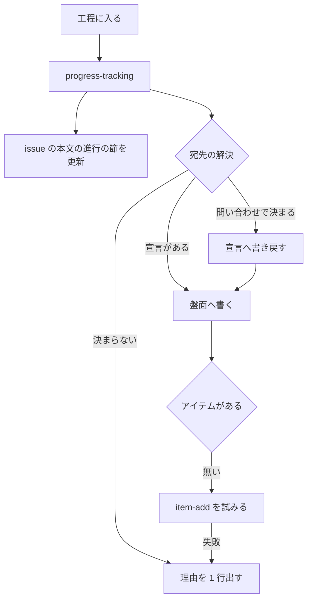

# 243 / 282 / 281 / 287: 進行の記録を 1 つの Skill へ集める

工程の進行を記録する手順が 15 個の `SKILL.md` に散り、記録の中身も決まっていない（#243）。
その手順が参照する `$SCRIPTS` の解決は盤面の説明文書の中にあり（#282）、候補の並びが開発中の
リポジトリより配布済みの控えを先に採る（#281）。盤面にアイテムの無い課題は、記録が黙って
捨てられる（#287）。全体の境界と着手の順序は [00-overview.md](00-overview.md) にある。

## 受け入れ条件

- [ ] 進行を記録する手順を持つ Skill が 1 つあり、15 本の `SKILL.md` はそれを指す 1 行だけを持つ
- [ ] 盤面の宣言が無いリポジトリでも、issue へ進行が残る
- [ ] 記録の中身（工程名・時刻・成果物・次の工程）が決まっている
- [ ] `$SCRIPTS` の解決手順が盤面の説明から独立し、シェルをまたぐ扱いが書かれている
- [ ] 開発中のリポジトリで実行したとき、手元の `plugins/ndf/scripts` が採られる
- [ ] 盤面にアイテムの無い課題で、追加を試み、できないときは 1 行知らせる
- [ ] 解決した識別子を控え、記録のたびに盤面の全件を読まない
- [ ] 問い合わせの上限に達したときに、黙って抜けずに 1 行知らせる
- [ ] 工程名の一覧は工程表が唯一の基準のままである
- [ ] 4 つの manifest に載り、Skill の数を記した説明文書が更新されている

## 用語

| 語 | この文書での意味 |
| --- | --- |
| 盤面 | GitHub Projects v2 のプロジェクト 1 つ |
| アイテム | 盤面に載る 1 行。1 つの issue に対応する |
| 宣言 | リポジトリの `.ndf/projects.json` |
| 宛先 | 進行を書き込む盤面。宣言か問い合わせで決まる |
| 進行の節 | issue の本文に置く `## 進行` の見出しとその中身 |

## 構成要素

| 要素 | 責務 |
| --- | --- |
| `skills/progress-tracking/SKILL.md`（新設） | 工程に入った時点で呼ばれ、記録の手順を持つ |
| `progress-tracking/references/board.md`（新設） | 盤面の宛先の解決・アイテムの追加・盤面の作成 |
| `development-workflow/references/scripts-lookup.md`（新設） | `$SCRIPTS` の解決手順。盤面から独立させる |
| `development-workflow/references/projects-tracking.md` | 盤面の設定の説明だけを残し、手順は新しい Skill へ移す |
| `scripts/progress-record.sh`（新設） | issue の本文の進行の節を書き換える |
| `scripts/projects-sync.sh` | 宛先の解決とアイテムの追加を足す。アイテムが無いときに 1 行出す |
| `scripts/lib/projects-common.sh` | 宛先の解決の判定を持つ |
| 15 本の `SKILL.md` | 定型文を 1 行へ置き換える |

## 入出力の契約

### `/ndf:progress-tracking <issue番号> <工程名>`

| 項目 | 内容 |
| --- | --- |
| 入力 | issue 番号と工程名（工程表の行名） |
| 出力 | 書き込んだ先（issue / 盤面）と、書き込まなかった理由 |
| 失敗の形 | 工程名が工程表に無いときだけ終了コード 2。それ以外は 0 |
| 互換性 | 新しい Skill。既存の `projects-sync.sh` の呼び方は残る |

**進行管理が理由で開発を止めない**という既存の方針は変えない。issue へも盤面へも書けなかった
場合、理由を 1 行出して終了コード 0 で終わる。

### `scripts/progress-record.sh <issue番号> <工程名> [--mode M] [--worktree P] [--plan P]`

| 項目 | 内容 |
| --- | --- |
| 入力 | issue 番号・工程名・任意の付随情報 |
| 出力 | 更新した節の行 |
| 失敗の形 | `gh` が無い、issue を取得できない場合は終了コード 0（何もしない） |

### issue の本文の進行の節

```markdown
## 進行

モード: standard / 作業ツリー: `.worktrees/feat/issue-243`

- [x] 作業場所の用意 — 2026-09-04 06:12
- [x] 要求と受け入れ条件 — 2026-09-04 06:40 / `issues/parallel-batch-08/03-....md`
- [ ] 設計
- [ ] 設計レビュー
```

| 項目 | 決め方 |
| --- | --- |
| 並び | 工程表のうち、そのモードが通る行だけを順に並べる |
| 印 | 済んだ工程に `[x]` を付ける。**飛ばした工程は空欄のまま残る** |
| 時刻 | 記録した時刻。日付と時分まで |
| 成果物 | 計画ファイルのパス・Pull Request の番号・コミット。無ければ書かない |
| 次の工程 | 一覧の次の空欄がそれにあたるため、別に書かない |

**節の外は書き換えない。** 更新のたびに本文を取得し、`## 進行` の見出しから次の見出しまでを
差し替える。節が無ければ本文の末尾へ足す。人が本文を直した内容が消えないようにする。

### 盤面の宛先の解決

**先に当たったものを採る。**

| 順 | 経路 | 決め方 |
| --- | --- | --- |
| 1 | 宣言 | `.ndf/projects.json` の `owner` と `number` |
| 2 | その issue が載っている盤面 | GraphQL の `issue.projectItems.nodes.project` |
| 3 | リポジトリにリンクされた盤面 | GraphQL の `repository.projectsV2` |
| 4 | 所有者の盤面が 1 つだけ | `gh project list --owner <owner>` |
| 5 | 見つからない | 盤面へは書かず、issue の側だけに残す |

**2 で宣言と食い違ったときは、issue が実際に載っている盤面を採る。** 宣言が古い可能性がある
ためで、食い違いを 1 行知らせる。

**2〜4 で決まった宛先は `.ndf/projects.json` へ書き戻す。** 次回からは 1 の経路で決まり、
問い合わせが要らなくなる。書き戻しは作業ツリーの中で行い、その変更の Pull Request に載せる。

### `$SCRIPTS` の候補の並び

| 順 | 候補 | 何を指すか |
| --- | --- | --- |
| 1 | 現在地の git のトップの `plugins/ndf/scripts` | **開発中のリポジトリ**。手元の変更が効く |
| 2 | `$PLUGIN_ROOT/scripts` | Claude Code が渡すプラグインルート |
| 3 | `$KIRO_ROOT/scripts` | `.kiro/skills/` の symlink からたどるプラグインルート |
| 4 | `~/.codex/.tmp/marketplaces/*/plugins/ndf/scripts` | Codex のマーケットプレイスの控え |
| 5 | `~/.codex/marketplaces/*/plugins/ndf/scripts` | 同上（`.tmp` を持たない配置） |
| 6 | `~/.gemini/config/plugins/ndf/scripts` | agy が複製した実体 |
| 7 | `plugins/ndf/scripts` | 現在地からの相対 |

**1 の判定は `git rev-parse --show-toplevel` の直下に `plugins/ndf/scripts/projects-sync.sh`
があるかで行う。** 配布物を使う利用者の側では当たらないため、順序が変わるのは開発者だけである。

## 処理の流れ



## 決定の記録

### 決定 1: `$SCRIPTS` の解決を盤面から独立した参照へ移す

`$SCRIPTS` を使うのは盤面の記録だけではない。`worktree` は `worktree-setup.sh` /
`worktree-localenv.sh` / `worktree-testenv.sh` の 3 本を呼ぶ。新しい Skill の中へ入れると、
盤面と無関係な読み手がその Skill を開くことになり、いま起きている状態が場所を変えて再現する。

`development-workflow/references/scripts-lookup.md` に置き、`progress-tracking` と `worktree` が
指す。手順の実体は 1 箇所のままである。

### 決定 2: 開発中のリポジトリを候補の先頭に置く

ai-plugins 自身を開発するとき、手元で直したスクリプトが実行されない状態を無くす。**直した
はずの不具合が再現するが、実行しているのが配布済みの版であることは出力からは分からない。**

判定を「現在地が `plugins/ndf/scripts` を持つ git のトップかどうか」に置くため、配布物を使う
利用者の側では当たらない。

### 決定 3: Codex の導入した実体を候補へ足さない

実体は `~/.codex/plugins/cache/<取得元>/ndf/<版>/scripts` のように版ごとに分かれる。glob で
受けると辞書順になり、`10.10.0` が `10.2.0` より前に来る。版の比較を解決手順の bash へ持ち
込むと、手順そのものが読めない長さになる。控えは版を持たない 1 つのパスであり、開発中の
リポジトリを先頭へ置いたことで、控えが採られるのは配布物を使う場面だけになる。

### 決定 4: 記録先を issue の本文にし、コメントを増やさない

工程の完了ごとにコメントを足すと、`architecture` では 15 件近くが並び、要望と議論が埋もれる。
本文のチェックリストなら、飛ばした工程が空欄として見える。issue の内容を更新するときは本文を
書き直す運用と揃う。

判断を伴う場面（モードを途中で上げた・工程を意図して飛ばした・受け入れ条件を変えた）だけは
コメントを残す。本文を見ても理由が分からない項目である。

### 決定 5: 節の外を書き換えない

本文全体を組み直すと、記録の間に人が直した内容が消える。`## 進行` の見出しから次の見出しまで
だけを差し替える。

### 決定 6: アイテムの追加を自動で行い、盤面の作成は承認を得る

アイテムの追加は 1 つの issue を 1 つの盤面へ載せる操作で、取り消しも 1 コマンドである。盤面の
作成は組織から見える資産を増やし、誰がいつ消すかが決まらない。**この 2 つを同じ扱いにしない。**

追加に失敗しても終了コード 0 で終わる。#287 が挙げた `unknown owner type` は、組織が所有する
盤面へ組織のログイン名を渡す形では起きなかった（下の「実測」）。

### 決定 7: アイテムの識別子を控え、記録のたびに盤面を全件読まない

`projects-sync.sh` は 1 回の記録ごとに `gh project item-list --limit 1000` を呼ぶ。この
問い合わせは GraphQL であり、**取得の点数が REST とは別の上限を持つ**（#271）。

2026-09-04 の実測では、10 件の課題へ 2 つのキーを書こうとした時点で
`API rate limit exceeded` に達し、以後の記録がすべて捨てられた。終了コードは 0 のままで、
出力も無い。**書き込んだつもりで何も残らない状態が、上限に達したことによっても起きる。**

| 呼び出し | 1 回あたりの取得 | 10 件 × 2 キーで |
| --- | --- | --- |
| `project view` | 盤面 1 つ | 20 回 |
| `project item-list --limit 1000` | **アイテム 1000 件** | 20 回 |
| `project field-list` | フィールド 17 個 | 20 回 |

解決した識別子（盤面・アイテム・フィールド・選択肢）を課題ごとに控え、次回からは
`item-edit` だけを呼ぶ。**アイテムの識別子は issue と盤面の組で決まり、工程が進んでも
変わらない。**

控えの位置は `git rev-parse --git-common-dir` が返すディレクトリの下に置く
（`<共通の git ディレクトリ>/ndf/`）。**作業ツリーでは `.git` がファイルである**ため、
`.git/ndf/` を作ろうとすると失敗する。共通の git ディレクトリなら、作業ツリーを消しても
控えが残り、同じリポジトリの複数の作業ツリーで 1 つの控えを共有できる。`worktree` の台帳
（`worktree-registry.json`）と同じ置き方である。

上限に達したことは、黙って抜けずに 1 行知らせる。アイテムが無いときと同じ扱いにする。

### 決定 8: 工程名の一覧は工程表が持ち続ける

新しい Skill は工程名の一覧を持たない。`projects-common.sh` の `PJ_STAGES` が引き続き
工程表と突き合わされる（#231 の検査）。記録の手順を移しても、基準は 1 つのままである。

### 決定 9: 判定の入力にはしない

工程の飛ばしの検知は #221 が置いた通過工程の控えが担う。この記録は**人がセッションの外から
現在地と成果物の所在をたどるためのもの**であり、機械の判定は読まない。

## テスト設計

| 受け入れ条件 | 何で確かめるか |
| --- | --- |
| 15 本が 1 行を指す | `grep -rl "projects-sync.sh" skills/*/SKILL.md` が 0 件になることを検査するテスト |
| 盤面が無くても issue へ残る | 宣言の無いリポジトリを模して `progress-record.sh` が本文を更新する単体テスト |
| 節の外を書き換えない | 前後に別の節を持つ本文で、進行の節だけが変わる単体テスト |
| 解決手順が独立する | `scripts-lookup.md` の bash を読み出す既存の 2 つのテストが、新しい位置を指して通る |
| 開発中のリポジトリが先に当たる | `plugins/ndf/scripts` を持つ git のトップと、Codex の控えの両方を作った上で前者が採られる単体テスト |
| シェルをまたぐ扱い | 解決手順の側に注意書きがあることを検査するテスト |
| アイテムが無いときに知らせる | `item-add` が失敗する状況を模し、標準エラーへ 1 行出て終了コードが 0 である単体テスト |
| 識別子を控える | 2 回目の記録で `item-list` を呼ばないことを、呼び出しを数える単体テスト |
| 上限に達したときに知らせる | 問い合わせが `rate limit exceeded` を返す状況を模し、標準エラーへ 1 行出る単体テスト |
| 工程名の一覧が 1 つ | #231 の突き合わせの検査が通る |
| 配布と frontmatter | 4 つの manifest に載り、`check-skill-frontmatter.py` と `validate-runtime-plugins.sh` が通る |
| 説明文書 | Skill の数を記した箇所が 34 になり、`check-doc-staleness.py` が通る |

## 未確認のまま残ること

| 項目 | 内容 |
| --- | --- |
| 本文の更新の頻度 | `architecture` では 15 回の書き換えが起きる。GitHub の作成の制限に当たるかは記録が貯まってから見直す |
| 宛先の書き戻しの衝突 | 複数の担当が同時に宣言へ書き戻す場面はまだ無い |
| 控えの置き場所 | 共通の git ディレクトリへ置いた識別子が、盤面の側でアイテムを消したときに古くなる。消えた識別子を引いたときの作り直しは実装で決める |

## 実測

**`gh project item-add` は組織が所有する盤面で成功する。** #287 が挙げた
`unknown owner type` は、`--owner` に組織のログイン名を渡す形では起きなかった。

```console
$ gh project item-add 1 --owner devbasex --url https://github.com/devbasex/ai-plugins/issues/372
PVTI_lADOEIyqkc4Bh-5Mzg5eaBA
```

盤面の所有者の種別は `gh project view --format json` の `.owner.type` が返す（この盤面は
`Organization`）。利用者が所有する盤面での挙動は確かめていない。

**`unknown owner type` は、所有者の種別が原因とは限らない。** 同じ盤面に対して、GraphQL の
上限に達した状態で `item-list` を呼ぶと、この文言が返る。

```console
$ gh api graphql -f query='{viewer{login}}'
{"errors":[{"type":"RATE_LIMIT","code":"graphql_rate_limit",
 "message":"API rate limit already exceeded for user ID ..."}]}

$ gh project item-list 1 --owner devbasex --limit 3 --format json
unknown owner type
```

`gh` は所有者の種別を GraphQL で問い合わせてから盤面の操作を組み立てる。**問い合わせが
失敗すると、種別が決まらなかったこととして同じ文言を出す。** #287 がこの文言を所有者の
種別の問題として挙げていたのは、上限に達した状態を観測していた可能性がある。

したがって、この文言を見たときは種別ではなく**上限を先に疑う**。手順にはその順序で書く。
