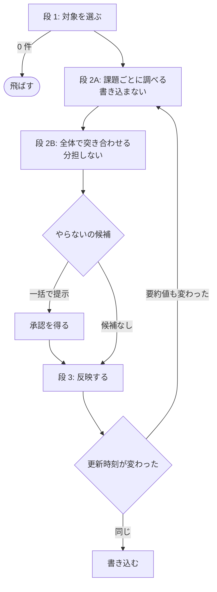

# 331: 課題の一覧を手入れする手順を作る

蓄積した課題の一覧を手入れする手順がどこにも無い。2026-09-04 に open 43 件を実物と突き合わせた
ところ、24 件（56%）の本文が現状と食い違っていた。全体の境界と着手の順序は
[00-overview.md](00-overview.md) にある。

**この課題の本文は、手順・判定表・受け入れ条件をすでに詳細に持つ。** この文書は「どう作るか」
だけを扱い、決めた内容は課題の本文を正として写さない。受け入れ条件は
[#331](https://github.com/devbasex/ai-plugins/issues/331) の「受け入れ条件」にある 20 項目である。

## 用語

| 語 | この文書での意味 |
| --- | --- |
| まとまり | 1 度にマージする Pull Request の集合。`release` が版を上げる単位 |
| 手入れ | 既存の課題の本文・マイルストーン・ラベルを現状に合わせること |
| 判定 | 課題ごとに決める 7 つの区分 |
| やらない | 課題そのものは成り立つが、抱える費用が直す費用を下回ると決めること |
| 再燃の条件 | 「やらない」で閉じた課題を、再び考える条件 |

## 構成要素

| 要素 | 責務 |
| --- | --- |
| `skills/issue-upkeep/SKILL.md`（新設） | 4 段の手順と 7 つの判定を持つ |
| `issue-upkeep/references/no-work.md`（新設） | 「やらない」の 2 つの必要条件と再燃の条件の書き方 |
| `issue-upkeep/references/milestones.md`（新設） | マイルストーンの決め方・新設・順序の直し方 |
| `retrospective/SKILL.md` | 最後にこの Skill を呼ぶ 1 行 |
| `release/SKILL.md` | 振り返りが無いときにこの Skill を呼ぶ 1 行 |
| `out-of-scope/SKILL.md` | 境界の表へ 1 行 |
| `manifests/*-skills.txt` | 4 本へ追加 |

**参照を 2 本に分けるのは、読ませる分量を絞るためである。** 段 1 と段 2A では「やらない」の
判断もマイルストーンの設定も起きない。手順の本体からその 2 つを外すと、対象を選んで調べる
段では読み込まれない。

## 入出力の契約

### `/ndf:issue-upkeep [--all] [--repo <owner/repo>]`

| 項目 | 内容 |
| --- | --- |
| 入力 | 省略可の 2 つ。`--all` は対象を open の全件へ広げる。`--repo` は対象のリポジトリ |
| 出力 | 段ごとの件数、判定の内訳、反映した件数、未設定のまま残った件数と理由 |
| 失敗の形 | `gh` が無い、または課題を取得できないときは終了コード 1 |
| 互換性 | 新しい Skill |

**対象が 0 件ならそこで飛ばす。** `release` が「配布物に差分が無ければ飛ばす」のと同じ形に
する。飛ばしたことを報告へ残す。

### 判定の値

7 つに限る。**手順・受け入れ条件・報告の書式で同じ並びを使う。**

| 値 | 段 3 での対応 |
| --- | --- |
| そのまま | 何もしない |
| 追記が要る | 該当箇所だけを直す |
| 書き直しが要る | 主旨を変えずに前提を書き直す |
| 閉じてよい | 実行結果を添えて閉じる |
| やらない | `wontfix` を付け、理由と再燃の条件を本文の末尾へ足して閉じる |
| 重複 | 段 2B で正本を決める |
| 要判断 | 人へ返す。反映しない |

### 段 2A が控える値

| 項目 | 使い道 |
| --- | --- |
| 番号 | 対象の識別 |
| `updated_at` | 段 3 の照合 |
| 本文の要約値 | 段 3 の照合（`updated_at` が変わっていたときだけ見る） |
| 判定と根拠 | 実行したコマンドと出力 |
| 反映で行う変更 | 段 3 の入力 |
| 依存する課題の番号 | 段 2B と反映の順序 |

## 処理の流れ

## 決定の記録

### 決定 1: 判定と反映の間に切れ目を置く

段 2A で「書き直しが要る」と判定した課題を精査した結果、本文の主張自体が成り立たず、正しい
対応が「閉じる」に変わった例がある（#324）。混ぜて進めると、閉じるべき課題の本文を書き直す
作業をすることになる。

### 決定 2: 段 2B を分担しない

重複の判定・正本の決定・関連する課題の状態・マイルストーンの完了・同じ前提の変化を受けた課題群
の書き換えは、いずれも課題をまたいで決まる。件数で割ると、担当 A が「#10 は #20 の重複」、
担当 B が「#20 は #10 の重複」と判定しうる。

### 決定 3: 「やらない」と「閉じてよい」を別の判定にする

前者は成り立つ課題を、後者は成り立たなくなった課題を閉じる。後から検索したときに区別が要る。

### 決定 4: 価値の判断を棚卸へ置き、入口の 3 択を変えない

発見の瞬間には、指摘の周辺しか見えていない。同じ原因の課題がほかにあるか、抱える費用が直す
費用を下回るかは、一覧を見る棚卸でしか分からない。`out-of-scope` の「迷ったら起票する側へ
倒す」はそのまま残す。

### 決定 5: 着手の直前ではなく、変更の完了後に置く

着手の直前は判断が歪む場所である。実装を担う側には締め切りがあり、そこで「この課題は成り
立たない」と気づいても、止める判断は自分の作業を遅らせる。判断を下す人が、その判断で損をする
立場にある。

### 決定 6: 名前を `issue-upkeep` にする

`triage` は新着の振り分け、`refinement` は詳細化を指し、どちらもこの手順が扱う範囲と違う。
`upkeep`（手入れして現状に保つ）が動作を最も近く表す。

### 決定 7: `light` も対象にする

外部コマンドの版・説明文書のパス・設定値の変更はいずれも `light` に分類されうる。除外の
仕組みを工程の側に置くと、判定の基準が 2 か所に分かれる。

### 決定 8: 早める方向だけを自動で反映する

早める判断は実害の記述が根拠になる。遅らせる判断は「今やらなくてよい」という価値の判断であり、
それは「やらない」の 2 つの必要条件で決める。後ろへ動かして着手を先送りする形は、判断の根拠を
残さない。

### 決定 9: 外部への書き込みで待つ長さを応答から取る

課題の作成と本文の更新を続けると、GitHub がコンテンツの作成を拒む。実測では 60 秒の間隔で
13 回待った例がある。固定の間隔で待つと、回復済みでも待ち続けるか、回復前に再び当たる。

### 決定 10: 反映を、同じ操作を 2 度行っても結果が変わらない形にする

済んだ課題を控えへ記録してやり直しのときは飛ばし、変える内容が無いときは書き込みを行わない。
途中で止まった実行を、最初からやり直せる。

## テスト設計

| 検査 | 何を確かめるか |
| --- | --- |
| 配布と frontmatter | 4 つの manifest に載り、`check-skill-frontmatter.py` と `validate-runtime-plugins.sh` が通る |
| 説明文書 | Skill の数を記した箇所が 35 になり、`check-doc-staleness.py` が通る |
| 呼び出しの配線 | `retrospective/SKILL.md` と `release/SKILL.md` の両方がこの Skill を指す |
| 判定の一覧 | 7 つの判定の値が、手順・受け入れ条件・報告の書式で同じ並びである |
| 「やらない」の参照 | 判定表から `references/no-work.md` を指し、その文書が 2 つの必要条件を持つ |
| リポジトリを仮定しない | `check-skill-repo-assumptions.py` が通る |

## 未確認のまま残ること

課題の本文の「未確認のまま残ること」にある 6 項目をそのまま引き継ぐ。実装で新たに決めるのは
次の 1 つである。

| 項目 | 内容 |
| --- | --- |
| 本文の要約値の取り方 | 改行の扱いで値が食い違う。`updated_at` が一致するのに要約値だけが違う例が 5 件出た。取り方は実装で決め、決めた形を手順へ書く |
