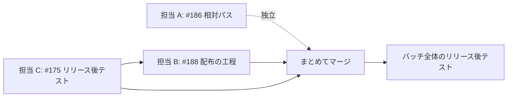

# 並行開発 バッチ 02 — 全体指示

4 件の課題（#175 / #176 / #186 / #188）を対象に、同時に進められるものを並行させる。
この文書は、担当どうしが同じ行を書き換えないための境界と、着手の順序を定める。

## 用語

| 語 | この文書での意味 |
| --- | --- |
| 担当 | 1 件の課題を最後まで進める実行主体。1 担当 = 1 作業ツリー = 1 Pull Request |
| 工程表 | `plugins/ndf/skills/development-workflow/SKILL.md` の「モードごとに起動する Skill」の表 |
| 配布 | プラグインの版を上げ、利用者が取得できる状態にすること |
| まとまり | 1 度にマージする Pull Request の集合。単独の変更では 1 件 |

## 担当と課題

| 担当 | 課題 | モード | ブランチ |
| --- | --- | --- | --- |
| A | 作業ツリーで相対パス編集すると主ディレクトリ向けの案内が出る（#186） | `standard` | `fix/issue-186-relative-write-target` |
| B | まとめてマージした後の版上げの担い手と時期を決める（#188） | `architecture` | `feature/issue-188-release-step` |
| C | #175 の残りのリリース後テストを実施する | 工程の残りのみ | 作業ツリー不要 |
| — | 進行管理に GitHub Projects を使う（#176） | 着手条件を満たさない | — |

## 判定の根拠

```text
#186  mode: standard
根拠: worktree-guard の書き込み先の判定という本番の振る舞いを直す。対象に既存テストがある
#188  mode: architecture
根拠: 工程表へ配布の工程を足す。複数の Skill にまたがり、公開される Skill が 1 個増える
```

担当 C は新しい判定を伴わない。#175 は `architecture` として PR #177 で実装済みであり、
残っているのは完了の定義のうち「版の配布後にリリース後テストを実施し、結果を記録する」
の 1 項目だけである。受け入れ条件 15 件と振り返りは満たされている。

| #175 の完了の定義 | 状態 | 根拠 |
| --- | --- | --- |
| 受け入れ条件 1〜15 | 満たす | 3 Skill が実在し、`manifests/*-skills.txt` の 3 ファイルすべてに載る。呼び出し元 6 Skill に案内がある |
| `architecture` の検証の段階 1〜4 | 満たす | PR #177 で実施 |
| リリース後テストの実施と記録 | **未実施** | 担当 C の範囲 |
| 振り返りを `docs/development-history/` へ残す | 満たす | `04-2026-08-31.md` |

## #176 を着手対象から外した理由

Projects の読み書きには `read:project`（書き込みは `project`）スコープが要る。現在の
トークンには含まれていない。

```console
$ gh auth status
  ✓ Logged in to github.com account takemi-ohama (GH_TOKEN)
  - Token scopes: 'gist', 'read:org', 'repo', 'workflow'
```

issue #176 の「決めること」8 件のうち、5 件（Projects をどの単位で持つか / フィールドを誰が
更新するか / 認証スコープをどう配るか / 使えない環境での動作 / 既存 issue を遡って登録するか）
は、実際に Projects を読める状態でないと決められない。スコープを足した後に着手する。

**スコープを足さずに書ける範囲**（工程表のどこへ結ぶか、`worktree` と同じ宣言ファイル方式に
できるか）は担当 B の工程表の変更と同じ行を触るため、B のマージ後に回す。

## 担当どうしの境界

| 担当 | 書き換えてよいパス | 他の担当が触るため書き換えないパス |
| --- | --- | --- |
| A | `plugins/ndf/scripts/lib/worktree-common.sh` / `plugins/ndf/scripts/worktree-guard.sh` / `plugins/ndf/skills/worktree/` | `plugins/ndf/skills/development-workflow/` / `merged/` / `release-verification/` / `manifests/` / `README.md` |
| B | `plugins/ndf/skills/development-workflow/` / `merged/` / `release-verification/` / `pr/` / 新設する Skill / `manifests/` / `README.md` / `CLAUDE.md` / `AGENTS.md` | `plugins/ndf/scripts/` 配下すべて / `plugins/ndf/skills/worktree/` |
| C | `docs/development-history/` / `issues/issue-175-release-verification-retrospective.md` | 上記すべて |

**担当 A は配布 Skill の数を変えない。** 担当 B は 1 個増やすため、`README.md` の公開 Skill 数と
`plugins/ndf/README.md` の記載を動かす。両方が数を触ると、#178 で入れた検査
（`scripts/check-doc-staleness.py`）が互いの Pull Request で落ちる。

生成物の同期（`bash scripts/build-runtime-plugins.sh`）は各担当が自分の Pull Request の中で
実行する。

## 着手の順序



- **担当 C を担当 B より先に始める。** C の対象は配布済みの v9.4.0 である。B がマージされて
  版が上がると、C が確かめる対象が入れ替わる
- **担当 A は独立している。** 触るパスが A と B/C で重ならないため、いつ始めてもよい
- **#176 は B のマージ後**。工程表の同じ行を触る

## このバッチに入れなかった課題と、その理由

| 課題 | 理由 | 着手できる時期 |
| --- | --- | --- |
| #176 進行管理に GitHub Projects を使う | `read:project` スコープが無く、決めることの過半が確かめられない | スコープの追加後、かつ担当 B のマージ後 |
| #116 / #144 / #161 | いずれも配布 Skill の数を動かす。担当 B と同じ値を突き合わせる検査が落ちる | 担当 B のマージ後 |
| #113 / #156 / #158 / #159 | いずれも規模が大きく、単独でバッチ 1 本にあたる | 個別に判断 |
| #181 / #182 | バッチ 01 の担当が継続中 | 現行の担当に任せる |

## 完了条件（バッチ全体）

- [ ] 担当 A / B の Pull Request がいずれもマージされている
- [ ] 担当 C のリリース後テストの結果が記録されている
- [ ] `uv run --with pytest pytest scripts/tests plugins/ndf -q` が通る
- [ ] `bash scripts/validate-runtime-plugins.sh` が終了コード 0 で終わる
- [ ] `python3 scripts/check-doc-staleness.py` が終了コード 0 で終わる
- [ ] 範囲外と判断した課題が `out-of-scope` で issue になっている

## 共通の進め方

### 作業ツリーを用意する

開発の変更は clone したディレクトリではなく作業ツリーの中で行う。担当ごとに 1 本作る。

```bash
. plugins/ndf/scripts/lib/worktree-common.sh
main_dir=$(wt_main_dir)
git -C "$main_dir" fetch origin
git -C "$main_dir" worktree add -b "<ブランチ名>" \
  "$main_dir/.worktrees/<ブランチ名>" origin/main
cd "$main_dir/.worktrees/<ブランチ名>"
```

`issues/` と `docs/` は clone したディレクトリで編集してよい。担当 C の出力物は
どちらにも収まるため、作業ツリーを作らない。

### テストを動かす

システムの `python3` に `pytest` は入っていない。`uv` の仮想環境で動かす。

```bash
uv run --with pytest pytest scripts/tests plugins/ndf -q
```

### 範囲外の課題を見つけたとき

`out-of-scope` を使い、**見つけたその場で** issue にする。判断は 3 択（起票する /
範囲内へ入れる / 起票しない）に限り、3 つ目も理由を 1 行残す。

## 参照

- [issues/old/parallel-batch-01/00-overview.md](../old/parallel-batch-01/00-overview.md) — 前回のバッチ
- [issues/issue-175-release-verification-retrospective.md](../issue-175-release-verification-retrospective.md) — #175 の実装計画
- `plugins/ndf/skills/development-workflow/SKILL.md` — 工程の振り分けの基準
