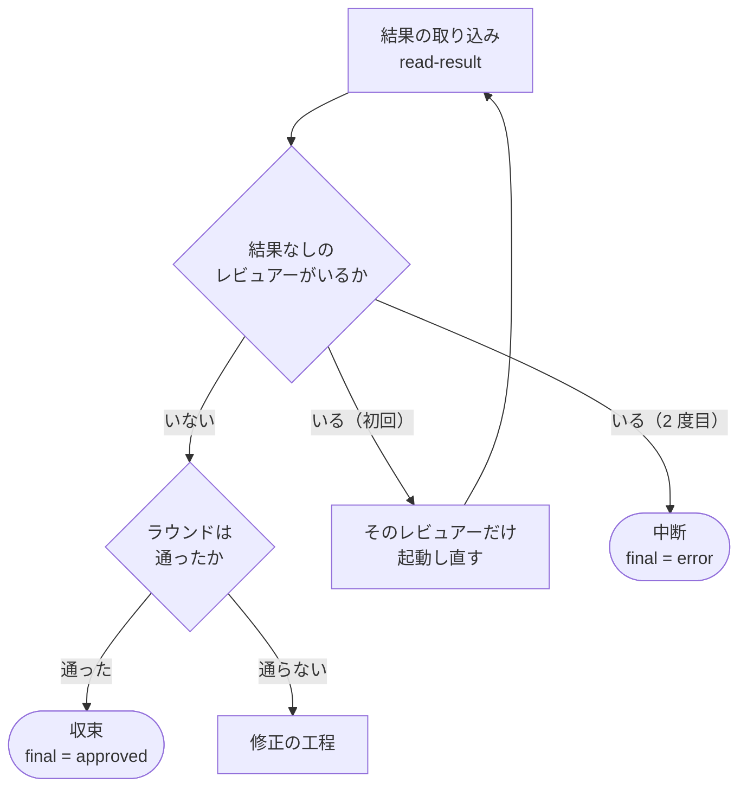

# 担当 B — 結果を残さないレビューを収束と判定しない（#196）

- issue: https://github.com/devbasex/ai-plugins/issues/196
- ブランチ: `fix/issue-196-no-result-not-approve`
- モード: `standard`

この文書は仕様と設計の両方を持つ。`standard` のため設計は独立したファイルにせず、
同じファイルの別の節として置く（`design` の規約）。

## 用語

| 語 | この文書での意味 |
| --- | --- |
| レビュアー | レビューを実行する側の AI。`codex` と `gemini` の 2 つ |
| 担当 | 並行開発バッチの担当（担当 A / B / C / D）。レビュアーは指さない |
| ラウンド | レビュアーを 1 巡させる単位。状態ファイルの `rounds` の 1 要素 |
| 判定 | ラウンドの結果を収束・修正のどちらへ進めるか決める処理（`state.py judge`） |
| 結果ファイル | レビュアーが書き出す `<レビュアー>-review-pr<PR>-result.json` |
| 結果なし | 起動したのに、使える結果ファイルが残らなかったこと |
| 指定によるスキップ | `--only` の指定によって、もう一方のレビュアーを起動しなかったこと |
| 収束 | 判定が承認になり、ループを終えること（`final = approved`） |
| 引き継いだ指摘 | 再開の時点で残っていた未解決の指摘。v9.4.0 で判定へ入れた |

**「担当」と「レビュアー」を分ける。** 参照するコードと issue 本文は codex / gemini を
「担当」と書いているが、この文書では並行開発の担当と重なるため、レビュアーと呼ぶ。

## 何を解決するか

判定は、結果ファイルを残さなかったレビュアーを、指定によるスキップと同じ値として扱う。
もう一方が承認していれば、ラウンド全体が収束する。**レビューが行われていないのに、
行われて承認されたのと同じ出口へ進む。**

PR #191 の round 4 で観測された。gemini が 420 秒で打ち切られ、結果ファイルが無いまま
判定が「両方 APPROVE。収束。」を返した。同じラウンドで gemini だけを起動し直すと、
270 秒で完了し、変更要求と指摘 2 件が返った。収束を採っていれば、この 2 件は修正の工程を
通らないままマージへ進んでいた。

**レビューが落ちるほど収束しやすくなる。** 打ち切りは負荷が高いときや対象が大きいときに
起きやすく、レビューが最も要る場面で承認が水増しされる。

v9.4.0 で塞いだ「引き継いだ指摘を判定へ入れる」（#33 / #37）と同じ系統にあたる。どちらも、
判定がそのラウンドの結果ファイルだけを見ていたことによる。

## 現状（実測）

### 通る扱いの値に `SKIP` が入っている

```python
# plugins/ndf/skills/cross-review/scripts/state.py:1005
def _is_pass(intent: str | None, severity: dict[str, int] | None) -> bool:
    if intent in ("APPROVE", "SKIP"):
        return True
```

### 項目が無いときの既定値が `SKIP` になっている

```python
# plugins/ndf/skills/cross-review/scripts/state.py:1025
    codex_pass = (only == "gemini") or _is_pass(codex.get("intent", "SKIP"), codex.get("by_severity"))
    gemini_pass = (only == "codex") or _is_pass(gemini.get("intent", "SKIP"), gemini.get("by_severity"))
```

`cmd_judge` も同じ既定値を使う（1408 行 / 1409 行）。

### `SKIP` を書き込む側はいない

```console
$ grep -rn "SKIP" plugins/ndf/skills/cross-review/ plugins/ndf/skills/pr-review/ \
    | grep -v __pycache__ | cut -d: -f1,2
plugins/ndf/skills/cross-review/SKILL.md:169
plugins/ndf/skills/cross-review/docs/01-state-and-review.md:356
plugins/ndf/skills/cross-review/docs/01-state-and-review.md:358
plugins/ndf/skills/cross-review/scripts/state.py:1008
plugins/ndf/skills/cross-review/scripts/state.py:1010
plugins/ndf/skills/cross-review/scripts/state.py:1025
plugins/ndf/skills/cross-review/scripts/state.py:1026
plugins/ndf/skills/cross-review/scripts/state.py:1408
plugins/ndf/skills/cross-review/scripts/state.py:1409
```

該当は読み取る側（`state.py` の 1010 / 1025 / 1026 / 1408 / 1409 行）と説明だけで、
レビュアーが `SKIP` を書き出す経路は無い。**現在の `SKIP` は「そのラウンドの記録に
レビュアーの項目が無い」ことだけを表す。**

### 指定によるスキップは、既に別経路で扱われている

`--only` の値は状態ファイルの `only` に入り（966 行）、`_round_passes` は `only` を見て
短絡する（1025 行 / 1026 行）。**指定で外したレビュアーは `_is_pass` に届かない。**
そのため `_is_pass` の `SKIP` は、結果なしのときにだけ効いている。

### 結果ファイルが無いとき、ラウンドには何も残らない

```python
# plugins/ndf/skills/cross-review/scripts/state.py:1331
    if not rfile.exists() or rfile.stat().st_size == 0:
        die(f"{agent}: result 未生成 ({rfile})")
```

状態ファイルを読む前に終了するため、そのレビュアーの項目は書かれない。判定は既定値の
`SKIP` を読む。

### 監視は結果なしを終了コードで区別できている

`scripts/lib/monitor.py` の 46〜53 行に終了コードの一覧がある。`2` が打ち切り、
`3` が「プロセスは終了したが結果ファイルが無い」で、レビュアーごとの状態を JSON で
1 行ずつ標準出力へ書く。**判定へ渡す経路が無いだけで、情報は既に作られている。**

### 監視の失敗を受け取る側が存在しない

```console
$ grep -rn "handle_review_failure" plugins/ndf/skills/cross-review/
plugins/ndf/skills/cross-review/SKILL.md:230:  "$SCRIPTS/monitor.py" "$STATE_PR" "${ONLY:-both}" || handle_review_failure $?
```

呼び出しは骨組みに 1 箇所あるが、定義はどこにも無い。**監視が失敗を返しても、骨組みは
そのまま次の行へ進む。**

### 全体フローの図が、結果なしを承認と同じ出口に置いている

```console
$ sed -n '169p' plugins/ndf/skills/cross-review/SKILL.md
    Decide -->|両方 APPROVE / SKIP| Approved([final = approved]):::ok
```

### 同じラウンドで起動し直しても、前の実行の残骸は混ざらない

`launch-gemini.sh` の 41〜43 行が、起動の前に結果ファイルと払い出し用の JSON を消す。
標準出力と標準エラーのログは `>` で切り詰められ、pid ファイルは上書きされる。
`launch-codex.sh` も同じ形である。監視の経過時間は起動ごとに数え直す
（`scripts/lib/monitor.py:634` の `started = time.monotonic()`）。

issue に記録された手作業の起動し直し（`launch-gemini.sh 191 4` → `monitor.py 191 gemini`）が
成立したのは、この後始末があるためである。

### 既存のテスト

```console
$ uv run --with pytest pytest plugins/ndf/skills/cross-review/tests -q
199 passed in 0.12s
```

## 受け入れ条件

| # | 条件 | 確かめ方 |
| --- | --- | --- |
| 1 | 片方が承認し、もう片方が結果を残さなかったラウンドで判定すると、収束しない | 単体テスト。`final` が `approved` にならず、終了コードが 0 以外 |
| 2 | `--only codex` を指定したラウンドで codex が承認したとき、収束する | 単体テスト。終了コード 0、`final` が `approved` |
| 3 | 判定の出力が、指定によるスキップと結果なしを別の値で示す | 単体テスト。`--only codex` のとき `GEMINI_INTENT=SKIP`、指定なしで項目が無いとき `GEMINI_INTENT=NO_RESULT` |
| 4 | 結果ファイルが無い・読めない・判定の値を持たないとき、結果なしがラウンドへ残る | 単体テスト。`rounds[-1][<レビュアー>]["intent"]` が `NO_RESULT` |
| 5 | 結果なしのレビュアーがいて、そのラウンドでまだ起動し直していないとき、判定は起動し直す相手を返す | 単体テスト。終了コード 7、出力に `RELAUNCH_AGENTS` と `RELAUNCH_TARGET` |
| 6 | 起動し直した後も結果なしのとき、中断する | 単体テスト。終了コード 1、`final` が `error` |
| 7 | 骨組みが起動し直しの指示を読み落としても、そのラウンドは収束しない | 単体テスト。終了コード 7 のとき `final` は `None` のまま、`rounds[-1]["verdict"]` が `no_result` |
| 8 | 結果なしのラウンドの次を開始するとき、修正の記録を求められない | 単体テスト。`cmd_start_round` が終了コード 5 で止まらない |
| 9 | 判定の結果を持たない古い状態ファイルでも、項目が欠けたラウンドの次を開始できる | 単体テスト。同上 |
| 10 | ラウンドサマリに結果なしが出る | 単体テスト。`cmd_report` の出力に `NO_RESULT` |
| 11 | 全体フローの図と判定の説明が、結果なしの扱いを示す | `SKILL.md` と `docs/01-state-and-review.md` を読む |
| 12 | 既存の 199 件のテストが通る | `uv run --with pytest pytest plugins/ndf/skills/cross-review/tests -q` |

## 対象範囲

### 含む

| パス | 何を変えるか |
| --- | --- |
| `scripts/state.py` の `_is_pass`（1005 行） | 通る扱いの値から `SKIP` を外す |
| `scripts/state.py` の `_round_passes`（1018 行） | 項目が無いときの既定値を `NO_RESULT` にする |
| `scripts/state.py` の `cmd_judge`（1396 行） | 出口を 4 つにする。表示の値を分ける |
| `scripts/state.py` の `cmd_read_result`（1326 行） | 使える結果が無いとき、結果なしをラウンドへ残してから終了する |
| `scripts/state.py` の `_guard_previous_round`（1053 行） | 判定の結果を持たないラウンドの読み直しに、結果なしを足す |
| `tests/` | テストを追加し、既存の 2 件の主張を更新する |
| `SKILL.md` | 全体フローの図、Step 2 の監視の行（230 行）、Step 3 の判定の行 |
| `docs/01-state-and-review.md` | Step 3 の判定の節 |
| 配布物 | `bash scripts/build-runtime-plugins.sh` の実行結果 |

パスはすべて `plugins/ndf/skills/cross-review/` からの相対である。

### 含まない

| 対象 | 理由 |
| --- | --- |
| `cmd_start_round` の本体 / `_sync_worktree` | 担当 C が触る |
| `SKILL.md` の作業ツリーの同期の説明 | 担当 C が触る |
| `scripts/lib/` | `cross-refactoring` と共有する層。監視は既に結果なしを終了コードで区別しており、変更を要しない |
| `monitor.py` の失敗種別の扱い | 判定側で受け取るため、監視側の変更は要らない |
| `.github/` / リポジトリ直下の `scripts/` / `README.md` / `AGENTS.md` | 担当 A と D が触る |
| `plugin.json` の版数 | 版を上げるのはバッチ全体のマージ後 |

## 設計

### 構成要素

| 要素 | 責務 |
| --- | --- |
| `_is_pass` | 1 レビュアー分の判定が通ったかを返す。通るのは `APPROVE` と、重大な指摘が無い `COMMENT` だけにする |
| `_round_passes` | ラウンドが通ったかを返す。指定によるスキップだけを通す扱いにし、項目が無いことは通らないものとして読む |
| `cmd_read_result` | 使える結果が無いとき、`NO_RESULT` と理由をラウンドへ残してから終了する |
| `cmd_judge` | 収束・起動し直し・中断・修正の 4 つへ振り分ける。起動し直す相手を出力へ書き、ラウンドへ記録する |
| `_guard_previous_round` | 結果なしのラウンドには修正の記録を求めない |
| `SKILL.md` の骨組み | 判定の終了コードで分岐し、起動し直しを 1 度だけ行う |

### 触る領域

永続データを持たず、呼び出される約束と画面も変えない。触るのは
**判定の分岐と、状態ファイルに残す値**である。そのためデータ構造と入出力の契約の節は作らない。

状態ファイルに増える値は次の 3 つで、いずれも省略可能である。**古い状態ファイルを読めなく
する変更は行わない。**

| 値 | 置き場所 | 意味 |
| --- | --- | --- |
| `intent` の `NO_RESULT` | `rounds[].<レビュアー>` | 起動したが使える結果が残らなかった |
| `no_result_reason` | `rounds[].<レビュアー>` | `missing` / `unparsable` / `no_verdict` のいずれか |
| `relaunched` | `rounds[]` | そのラウンドで起動し直したレビュアーの一覧 |

`verdict` は既存の値に `no_result` を足す。

### 処理の流れ



引き継いだ指摘の判定は、図の「通った」の後ろに現行のまま残る。結果なしの検査は
その手前に置く。**結果を取り込めていないラウンドは、収束も修正も決められない。**

### 判定の出口と終了コード

| ラウンドの状態 | 出口 | 終了コード | `verdict` |
| --- | --- | --- | --- |
| 結果なしがあり、そのレビュアーをまだ起動し直していない | 起動し直す | 7 | `no_result` |
| 結果なしがあり、既に起動し直している | 中断（`final = error`） | 1 | `no_result` |
| 通った、かつ引き継いだ指摘なし | 収束（`final = approved`） | 0 | `approved` |
| それ以外 | 修正へ | 2 | `changes_requested` |

`7` は未使用である。現在使われているのは `1` から `6` までで、`state.py` の全体を
`grep -n "code=[0-9]\|sys.exit([0-9])"` で数えて確認した。

判定は終了コード 7 のとき、次の 2 行を追加で出力する。

```text
RELAUNCH_AGENTS='gemini'
RELAUNCH_TARGET=gemini
```

`RELAUNCH_TARGET` は `codex` / `gemini` / `both` のいずれかで、監視スクリプトへそのまま渡せる
値にする。判定は出力と同時に、対象のレビュアーを `rounds[-1]["relaunched"]` へ記録する。
**2 度目の判定は記録を見て中断へ回る。**

### 骨組みの分岐

```bash
  # Step 3: 判定
  #   コマンド置換の終了コードは変数で受けてから読む。
  #   `eval "$(...)"` の形は置換の終了コードを飲む（v9.4.0 で同じ形を直した）。
  JUDGE_VARS=$("$SCRIPTS/state.py" judge "$STATE_PR"); JUDGE_RC=$?
  eval "$JUDGE_VARS"
  if [ "$JUDGE_RC" -eq 7 ]; then
    # 結果なし — 名前の出たレビュアーだけを、同じラウンドで 1 度起動し直す
    for a in $RELAUNCH_AGENTS; do "$SCRIPTS/launch-$a.sh" "$STATE_PR" "$ROUND"; done
    "$SCRIPTS/monitor.py" "$STATE_PR" "$RELAUNCH_TARGET" || true
    for a in $RELAUNCH_AGENTS; do "$SCRIPTS/state.py" read-result "$STATE_PR" "$a" || true; done
    JUDGE_VARS=$("$SCRIPTS/state.py" judge "$STATE_PR"); JUDGE_RC=$?
    eval "$JUDGE_VARS"
  fi
  case $JUDGE_RC in
    0) break ;;   # 収束
    2) : ;;       # 修正へ
    *) exit "$JUDGE_RC" ;;
  esac
```

Step 2 の監視の行（230 行）からは、定義の無い `handle_review_failure` の呼び出しを外す。
監視の失敗は判定が受け取るため、監視の終了コードは人が読むための表示に使う。

## 決定の記録

### 決定 1: 結果なしのときは、同じラウンドで 1 度だけ起動し直してから判定する

打ち切りは一時的な事象として起きる。観測された 1 件は、420 秒で打ち切られた後、
起動し直すと 270 秒で完了し、指摘 2 件を返した。起動し直しはラウンドの中で完結するため、
**ラウンドの数え方と上限の意味は変わらない。** ラウンドは引き続き「レビューを何巡したか」を
表す。回数を 1 度に限るのは、待ち時間の上限をラウンドあたり 2 回分に収めるためである。

修正の工程へ回す案は採らない。修正すべき指摘が無い状態で修正の工程を起動し、ラウンドを
1 つ消費する。同じレビュアーが毎回落ちる環境では、上限に達するまでこれを繰り返す。

ラウンドを無効にして数え直す案も採らない。ラウンド番号が飛ぶため、同じ Pull Request 内の
ラウンドを 2 つ並べる振動検知（`cmd_check_oscillation`）と、前のラウンドを読む後始末の
検査（`_guard_previous_round`）が、参照する位置を取り違える。

### 決定 2: 起動し直しても結果が残らないときは中断する

2 度続けて結果が残らないのは、対象や負荷ではなく実行環境の側の事象である。次のラウンドへ
回すと、上限に達するまで同じ起動を繰り返す。片方のレビュアーだけで回す運用は `--only` が
受け持つため、判定が暗黙にその状態を作らない。

中断は `final = error` で、既存の中断（コード関連の継続的統合の失敗）と同じ出口である。
最終スイープを通ってから完了報告へ進む経路が既にある。

### 決定 3: 指定によるスキップと結果なしを別の値で持つ

`--only` で外したレビュアーは `SKIP`、結果が残らなかったレビュアーは `NO_RESULT` とする。
判定の出力を読むだけで、レビューが行われなかった理由が分かる。

通る扱いの値から `SKIP` を外しても `--only` の運用は変わらない。指定で外したレビュアーは
`_round_passes` が `only` を見て短絡するため、通るかどうかの判定へ届かない。

### 決定 4: 結果なしは、結果の取り込みが記録し、記録が無いことも結果なしとして読む

`cmd_read_result` が `NO_RESULT` を書き込み、あわせて項目が無いときの既定値も `NO_RESULT` に
する。**骨組みが取り込みを呼び忘れても、判定は収束しない。**

記録専用のサブコマンドを足す案は採らない。骨組みからの呼び出しが 1 つ増え、呼び忘れると
記録が残らない。結果の取り込みは、指定で外していないレビュアーについて必ず呼ばれる。

### 決定 5: 起動し直す指示は判定が出す

判定が対象のレビュアーを決めて出力し、記録する。骨組みは名前を受け取って起動するだけにする。

監視の終了コードで骨組みが判断する案は採らない。受け手（`handle_review_failure`）は現在
定義されておらず、監視の失敗はそのまま次の行へ流れている。判断を判定へ集めれば、骨組みが
終了コードを読み落としても収束はしない。

## テスト設計

追加先は `plugins/ndf/skills/cross-review/tests/test_state_no_result.py` とする。GitHub への
問い合わせは行わず、既存のテストと同じく `conftest.py` の足場と `CROSS_REVIEW_TMP_DIR` の
差し替えで組む。

| 受け入れ条件 | テスト | 何を確かめるか |
| --- | --- | --- |
| 1 | `test_a_round_with_a_missing_result_does_not_converge` | codex が承認、gemini の項目なし → 終了コードが 0 以外、`final` は `approved` にならない |
| 2 | `test_only_codex_converges_on_a_codex_approval` | `only="codex"`、gemini の項目なし → 終了コード 0、`final="approved"` |
| 3 | `test_the_output_separates_a_requested_skip_from_a_missing_result` | `only="codex"` で `GEMINI_INTENT=SKIP`、指定なしで `GEMINI_INTENT=NO_RESULT` |
| 4 | `test_a_missing_result_file_is_recorded_on_the_round` | 結果ファイルが無い → `intent="NO_RESULT"`、`no_result_reason="missing"` |
| 4 | `test_an_unreadable_result_file_is_recorded_on_the_round` | JSON として読めない / dict でない → `no_result_reason="unparsable"` |
| 4 | `test_a_result_without_a_verdict_is_recorded_on_the_round` | `event` も `intent` も無い → `no_result_reason="no_verdict"` |
| 5 | `test_the_first_missing_result_asks_for_one_relaunch` | 終了コード 7、`RELAUNCH_AGENTS='gemini'`、`RELAUNCH_TARGET=gemini`、`relaunched` に記録 |
| 5 | `test_both_missing_results_ask_for_both` | 両方欠けたとき `RELAUNCH_TARGET=both` |
| 6 | `test_a_missing_result_after_the_relaunch_stops_the_review` | `relaunched` に記録済み → 終了コード 1、`final="error"` |
| 7 | `test_the_round_stays_unconverged_when_the_relaunch_is_ignored` | 終了コード 7 のとき `final` は `None`、`verdict="no_result"` |
| 8 | `test_a_no_result_round_needs_no_fix_record` | 直前が `verdict="no_result"` → `cmd_start_round` が終了コード 5 で止まらない |
| 9 | `test_a_round_without_a_verdict_and_a_missing_agent_can_be_followed` | `verdict` を持たず項目も欠けたラウンドの次を開始できる |
| 10 | `test_the_round_summary_shows_the_missing_result` | `cmd_report` の出力に `NO_RESULT` |

### 既存テストで主張が変わるもの

`cmd_read_result` が終了の前に記録を残すため、次の 2 件は「状態ファイルは変わらない」から
「結果なしが記録される」へ主張を変える。終了コード（1 と 3）は変えない。

| ファイル | テスト | 現在の主張 |
| --- | --- | --- |
| `tests/test_state_read_result.py` | `test_missing_event_and_intent_dies`（95 行） | `AGENT not in st["rounds"][-1]` |
| `tests/test_state_read_result.py` | `test_non_dict_result_json_dies`（128 行） | `AGENT not in st["rounds"][-1]` |

### 実行

```bash
uv run --with pytest pytest plugins/ndf/skills/cross-review/tests -q
uv run --with pytest pytest scripts/tests plugins/ndf -q
```

## 未確認のまま残ること

| 項目 | 内容 |
| --- | --- |
| 実機での起動し直し | 単体テストは判定の分岐までを確かめる。実際に打ち切られたレビューを起動し直す経路は、この Pull Request のレビュー自身で `/ndf:cross-review` を回して確かめる |
| 待ち時間 | 起動し直しが起きたラウンドは、監視の上限（既定 7 分）の分だけ長くなる。上限を変える必要があるかは実測を待つ |

## 完了条件

- [ ] 片方が結果を残さなかったラウンドが収束しない
- [ ] `--only` を指定したラウンドの収束が、現行と変わらない
- [ ] 判定の出力が、指定によるスキップと結果なしを別の値で示す
- [ ] 使える結果が無いとき、結果なしと理由がラウンドへ残る
- [ ] 結果なしのとき、判定が起動し直す相手を出力し、記録する
- [ ] 起動し直した後も結果なしなら、`final = error` で中断する
- [ ] 起動し直しの指示を読み落としても、そのラウンドは収束しない
- [ ] 結果なしのラウンドの次を開始するとき、修正の記録を求められない
- [ ] 骨組みが判定の終了コードで分岐し、`handle_review_failure` の呼び出しが残っていない
- [ ] 全体フローの図と `docs/01-state-and-review.md` が、結果なしの扱いを示す
- [ ] 追加したテストが通り、既存の 199 件も通る
- [ ] `bash scripts/build-runtime-plugins.sh` を実行し、配布物の差分を同じ Pull Request に含めた
- [ ] `bash scripts/validate-runtime-plugins.sh` が終了コード 0 で終わる
- [ ] 範囲外と判断した課題を `out-of-scope` でその場で起票した

## 参照

- `plugins/ndf/skills/cross-review/scripts/state.py` — 判定（`cmd_judge`）と結果の取り込み（`cmd_read_result`）
- `plugins/ndf/skills/cross-review/scripts/lib/monitor.py` — 失敗種別と終了コード（46〜53 行）
- `plugins/ndf/skills/cross-review/docs/01-state-and-review.md` — Step 2 の監視と Step 3 の判定
- `issues/old/parallel-batch-01/02-issue-33-37.md` — 引き継いだ指摘を判定へ入れたときの指示書
