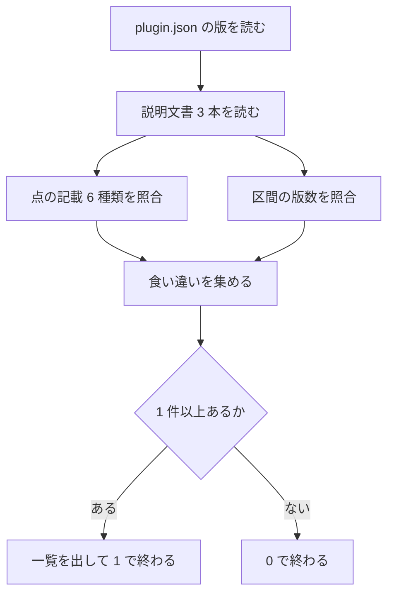

# 担当 D — 説明文書の本文に書かれた版数を検査の対象へ入れる（#209）

- issue: https://github.com/devbasex/ai-plugins/issues/209
- ブランチ: `feature/issue-209-version-staleness`
- モード: `standard`
- Pull Request の宛先: `main`

## 用語

| 語 | この文書での意味 |
| --- | --- |
| 検査 | `scripts/check-doc-staleness.py` が行う機械的な突き合わせ。値が食い違えば 0 以外の終了コードで終わる |
| 現行版 | `plugins/ndf/.claude-plugin/plugin.json` の `version`。版を決める唯一の値 |
| 説明文書 | 利用者が読む入口の Markdown。ここでは `README.md` / `AGENTS.md` / `plugins/ndf/README.md` の 3 本 |
| 版数の記載 | 説明文書の中に書かれた `9.6.0` や `v9.6.0` のような文字列 |
| 現行版を指す記載 | 現行版と一致していなければ読み手を誤らせる版数の記載。概要の版数、期待出力、キャッシュパスの例など |
| 点の検査 | 周囲の固定の語で位置を決め、その 1 箇所の版数を現行版と照合する形 |
| 区間の検査 | 見出しで区切った範囲を走査し、その中の版数がすべて規則を満たすことを求める形 |
| 基底 | 版数から接尾辞を除いた数字 3 つ。`9.6.0-dev.1` の基底は `9.6.0` |

## 何を解決するか

版を上げても、説明文書の本文に書かれた版数は古いまま残る。検査は通る。

検査が突き合わせているのは 2 組だけである。説明文書に書かれた Skill の数と、
`plugins/ndf/README.md` の更新案内の見出しの版数（`## v9.6.0 へ更新するとき`）である。
**本文中の版数は対象に入っていない。**

残った版数はいずれも利用者が読む入口にある。

| 記載 | 古いまま残ると何が起きるか |
| --- | --- |
| `**NDFプラグイン v9.5.0** は、` | 現行版を誤って伝える |
| `~/.codex/plugins/cache/ai-plugins/ndf/9.5.0/skills/deploy/SKILL.md` | 書かれたとおりに実行すると、存在しないパスを指す |
| `# => ndf@ai-plugins  installed, enabled  9.5.0` | 期待出力が実機の出力と食い違う |

v9.5.0 の配布（PR #208）でこの状態になり、指摘を受けてから 6 箇所を手で直した。
仕組みは残っているため、同じことが版を上げるたびに起こりうる。

**難しいのは、すべての版数を現行版へ揃えてはならない点である。** 変更履歴・実施記録・
意図的に前の版を指す文は、前の版のまま残すのが正しい。現行版を指しているかどうかは
文脈で決まる。

## 現状（実測）

### 現行版と、現行版を指す記載

現行版は `9.6.0` である。

```console
$ python3 -c "import json;print(json.load(open('plugins/ndf/.claude-plugin/plugin.json'))['version'])"
9.6.0
```

現行版を指す記載は 3 本の説明文書に 7 種類ある。`AGENTS.md` の
「検査に載らず、手で直す箇所」の表に挙がっているものと一致する。

```console
$ grep -no 'NDFプラグイン v[0-9.]*' README.md
9:NDFプラグイン v9.6.0

$ grep -no '^| \*\*[a-z-]*\*\* | [0-9.]*' README.md
187:| **ndf** | 9.6.0
188:| **playwright-kit** | 2.0.1

$ grep -no '主要プラグインです（v[0-9.]*）' AGENTS.md
248:主要プラグインです（v9.6.0）

$ grep -no 'Kiro CLI用 / v[0-9.]*\|ai-plugins/ndf/[0-9.]*\|enabled  [0-9.]*' plugins/ndf/README.md
86:Kiro CLI用 / v9.6.0
246:ai-plugins/ndf/9.6.0
268:ai-plugins/ndf/9.6.0
275:enabled  9.6.0

$ grep -no '^## v[0-9.]* へ更新するとき' plugins/ndf/README.md
89:## v9.6.0 へ更新するとき
```

`AGENTS.md` の接尾辞の例は、現行版を基にした例が 1 つの節へまとまっている。

```console
$ sed -n '105,115p' AGENTS.md
| 版 | 形 | 意味 |
| --- | --- | --- |
| 正式版 | `9.6.0` | 利用者が常用してよい |
| 開発版 | `9.6.0-dev.1` | 検証中。入れたくない利用者は取得を控えられる |
| 公開前の確認版 | `9.6.0-rc.1` | 正式版の候補。残るのは確認だけ |

- 接尾辞は**次に出す正式版の版数へ付ける**。`9.6.0` の次を開発するなら `9.7.0-dev.1`
- 連番は開発版を出すたびに増やす。**同じ版数で中身を差し替えない**。差し替えると、利用者の
  手元にある版と `main` の版が同じ番号で別物になり、何を確かめたのかが分からなくなる
- **正式版を出すときは接尾辞を外す。** `9.6.0-dev.3` の次は `9.6.0`
- 順序は semver に従い `9.6.0-dev.1` < `9.6.0-rc.1` < `9.6.0` になる
```

**いま古いまま残っている記載は 0 件である。** 直前の版上げ（`73bd3e4`）で 8 箇所を
手で直したためである。検査が見ていたのは、そのうち更新案内の見出し 1 箇所だけである。

```console
$ git show 73bd3e4 --stat --format= | head -8
 .claude-plugin/marketplace.json        |  2 +-
 AGENTS.md                              |  4 +-
 CLAUDE.md                              |  8 +++-
 README.md                              |  4 +-
 plugins/ndf/.claude-plugin/plugin.json |  4 +-
 plugins/ndf/.codex-plugin/plugin.json  |  4 +-
 plugins/ndf/README.md                  | 70 ++++++++++------------------------
```

| 手で直した記載 | 検査が見ていたか |
| --- | --- |
| `README.md` の概要 | 見ていない |
| `README.md` のプラグイン一覧表の `ndf` の行 | 見ていない |
| `AGENTS.md` の「主要プラグインです（v9.6.0）」 | 見ていない |
| `AGENTS.md` の接尾辞の例（1 行） | 見ていない |
| `plugins/ndf/README.md` の Kiro の確認例 | 見ていない |
| `plugins/ndf/README.md` の Codex のキャッシュパスの例（2 箇所） | 見ていない |
| `plugins/ndf/README.md` の `codex plugin list` の出力例 | 見ていない |
| `plugins/ndf/README.md` の更新案内の見出し | 見ていた |

### 現行版と一致していないほうが正しい記載

同じ 3 本と `KIRO.md` には、現行版以外の版数が 62 件ある。行にすると 54 行である。

```console
$ python3 - <<'PY'
import re
from pathlib import Path
cur = "9.6.0"
token = re.compile(r'(?<![\w.])v?(\d+\.\d+\.\d+(?:-[0-9A-Za-z.]+)?)(?![\w.])')
for f in ["README.md", "AGENTS.md", "plugins/ndf/README.md", "KIRO.md"]:
    lines = Path(f).read_text(encoding="utf-8").splitlines()
    other = [m.group(1) for l in lines for m in token.finditer(l) if m.group(1) != cur]
    rows = {i for i, l in enumerate(lines, 1) for m in token.finditer(l) if m.group(1) != cur}
    print(f"{f}: 現行版以外 {len(other)} 件 / {len(rows)} 行")
PY
README.md: 現行版以外 41 件 / 34 行
AGENTS.md: 現行版以外 8 件 / 7 行
plugins/ndf/README.md: 現行版以外 12 件 / 12 行
KIRO.md: 現行版以外 1 件 / 1 行
```

内訳は次のとおりで、**いずれも現行版へ揃えると誤りになる**。

| 種類 | 件数 | 例 |
| --- | --- | --- |
| 変更履歴の節の見出しと本文（`README.md`） | 27 | `### NDF v8.5.4 の主な変更` |
| 履歴・由来の説明（「vX.Y.Z で〜した」） | 11 | `v4.0.0 で Codex MCP サーバは廃止` |
| 意図的に前の版を指す記載 | 3 | `それより前の版（9.4.0 以前）はタグを打っていない` |
| 他のソフトウェアの版数 | 6 | `codex-cli 0.146.1` / `kiro-cli 2.16.1` |
| 版数の付け方の一般的な例 | 8 | `1.0.0 → 1.0.1: バグ修正` |
| 現行版を基にした接尾辞の例 | 6 | `9.6.0-dev.1` / `9.7.0-dev.1` |
| 別のプラグインの現行版 | 1 | `playwright-kit` の `2.0.1` |

`KIRO.md` にある版数は 1 件だけで、`v4.0.0` の由来説明である。**現行版を指す記載は無い。**

### 検査の現在の作り

`scripts/check-doc-staleness.py`（361 行）は、記載 1 種類を `Claim` にまとめ、
`verify()` が「読み取れないこと」と「値が食い違うこと」の両方を失敗として扱う。
呼び出し元は `scripts/validate-runtime-plugins.sh` の 400 行目である。

```python
@dataclass(frozen=True)
class Claim:
    path: str
    subject: str
    wording: str
    described: list[int]
    expected: int | None
    source: str
```

版数を扱う既存の検査は `check_upgrade_heading()` 1 つで、`UPGRADE_HEADING` の
正規表現で見出しの位置を決め、現行版と文字列で比べている。**この形をそのまま広げる。**

テストは一時ディレクトリへ最小の木を作って検査を実行する形である
（`scripts/tests/doc_staleness_helpers.py` の `build_tree()`）。実物の説明文書は
読むだけで書き換えない。

## 受け入れ条件

| # | 条件 | 確かめ方 |
| --- | --- | --- |
| 1 | 現行版を指す記載 7 種類のうち 1 つを前の版へ書き換えると、検査が 0 以外の終了コードで終わる | 一時の木で 1 箇所ずつ書き換えて `python3 scripts/check-doc-staleness.py --root <木>` |
| 2 | 現行版を指す記載を削除すると、検査が 0 以外の終了コードで終わる | 同上。記載を消して検査を通せる状態にしない |
| 3 | `plugin.json` の版だけを上げると、検査が 7 種類すべてを挙げる | 一時の木の `version` を上げて実行し、出力に 7 種類の識別が並ぶことを見る |
| 4 | 失敗の出力に、パス・記載の識別・行番号・記載の値・現行版が入る | 出力の文字列を突き合わせる |
| 5 | 変更履歴・実施記録・意図的に前の版を指す記載では失敗しない | `python3 scripts/check-doc-staleness.py --root .` が終了コード 0 で終わる（実測 62 件がそのまま残る） |
| 6 | 別のプラグインの版数は、そのプラグインの `plugin.json` と突き合わせる | `README.md` の一覧表の `playwright-kit` の行を崩すと失敗する |
| 7 | 現在のリポジトリで、現行版を指す記載に古い値が残っていない | 検査が終了コード 0 で終わる。実装の時点で残っていれば直す |
| 8 | 版を上げるときに読む文書が、検査が見る箇所と手で直す箇所を正しく書いている | `AGENTS.md` の 2 つの節と `docs/plugin-development-guide.md` の該当箇所を読む |
| 9 | 追加した検査に対応する自動テストがある | `uv run --with pytest pytest scripts/tests -q` が通る |
| 10 | 既存の検査が壊れていない | `bash scripts/validate-runtime-plugins.sh` と `claude plugin validate` が通る |

## 対象範囲

### 含む

| パス | 何をするか |
| --- | --- |
| `scripts/check-doc-staleness.py` | 版数の検査を足す |
| `scripts/tests/doc_staleness_helpers.py` | 一時の木の説明文書へ版数の記載を足す |
| `scripts/tests/test_doc_staleness.py` | 追加のテスト |
| `AGENTS.md` | 「検査が突き合わせる 6 箇所」と「検査に載らず、手で直す箇所」の 2 節を書き直す |
| `docs/plugin-development-guide.md` | 「検査が突き合わせるのは見出しの版数まで」の記載を書き直す |
| `README.md` / `plugins/ndf/README.md` | 古い記載が残っていれば直す（実測では 0 件） |

`docs/plugin-development-guide.md` は担当 A / B / C のいずれも触らない。検査の範囲を
広げると、この節の記述が現状と食い違うため、同じ Pull Request で書き直す。

### 含まない

| 対象 | 理由 |
| --- | --- |
| `CLAUDE.md` / `docs/development-history/` / `issues/` | 版ごとの記録であり、前の版を指したまま残すのが正しい |
| `.github/` | 担当 A が触る |
| `plugins/ndf/skills/` | 担当 B / C が触る |
| `KIRO.md` | 現行版を指す記載が無い（版数の記載は履歴の 1 件だけ） |
| `plugins/ndf/.claude-plugin/plugin.json` の版数 | 版を上げるのはバッチ全体のマージ後で、担い手は最後のマージを行った側である |
| 定義ファイルどうしの版数の一致 | `scripts/validate-runtime-plugins.sh` がすでに突き合わせている |
| 更新案内の本文がその版の変更を説明しているか | 機械では判定できない。版を上げる手順が人の読み直しの機会を作る |

## 設計

### 構成要素

| 構成要素 | 置き場所 | 役割 |
| --- | --- | --- |
| 版数の基準 | 既存の `plugin_version()` | `plugins/ndf/.claude-plugin/plugin.json` の `version` を読む |
| プラグインごとの版数 | 新設の関数 | `plugins/<名前>/.claude-plugin/plugin.json` の `version` を読む。一覧表の行ごとに使う |
| 点の記載の定義 | 新設の定数（正規表現） | 記載 1 種類につき 1 つ。周囲の固定の語で位置を決める |
| 区間の記載の定義 | 新設の定数（見出しの文字列） | 走査する範囲の始まりを決める |
| 版数の照合 | 既存の `Claim` / `verify()` | 出力の形を既存の数の検査と揃える |
| 行番号 | `Claim` へ足す任意の項目 | 失敗の出力に `L<行>` を添える |

`Claim` の `described` と `expected` は現在 `int` を受け取る。版数は文字列であるため、
`int | str` を受け取れる形へ広げる。`verify()` の比較は等値のままでよい。行番号は
`described` と同じ並びの `lines` として持ち、渡されなかったときは出力を変えない。
**既存の数の検査は呼び出しを変えずに済み、出力も変わらない。** これは既存のテストが守る。

### 触る領域

この変更が触るのは検査スクリプトと、その規約を書いた説明文書である。
永続データ・外部との契約・画面のいずれも持たない。

| 領域 | 触るか | 内容 |
| --- | --- | --- |
| データ構造 | 触る | `Claim` の項目の型を広げ、行番号を足す |
| 実行の入口 | 触らない | `--root <ディレクトリ>` と終了コードは現状のまま |
| 呼び出し元 | 触らない | `scripts/validate-runtime-plugins.sh` の 400 行目はそのまま |
| 説明文書の規約 | 触る | 検査が見る箇所と手で直す箇所の書き分け |

### 検査する記載

現行版を指す記載を 7 種類として定義する。記号は受け入れ条件とテストで使う。

| 記号 | パス | 記載 | 位置の決め方 | 突き合わせ先 |
| --- | --- | --- | --- | --- |
| G | `README.md` | 概要の版数 | `**NDFプラグイン v<版>**` | `ndf` の `plugin.json` |
| H | `README.md` | プラグイン一覧表の版数の列 | 行頭の <code>&#124; \*\*&lt;名前&gt;\*\* &#124; &lt;版&gt; &#124;</code> | `plugins/<名前>/.claude-plugin/plugin.json` |
| I | `AGENTS.md` | 「主要プラグインです（v&lt;版&gt;）」 | 同じ語 | `ndf` の `plugin.json` |
| J | `AGENTS.md` | 「版の付け方と開発版の配布」節の版数の例 | 見出しから次の `###` の直前まで（区間の検査） | `ndf` の `plugin.json`（基底の比較） |
| K | `plugins/ndf/README.md` | Kiro の確認例の期待出力 | `Kiro CLI用 / v<版>）` | `ndf` の `plugin.json` |
| L | `plugins/ndf/README.md` | Codex のキャッシュパスの例（2 箇所） | `plugins/cache/ai-plugins/ndf/<版>/skills/` | `ndf` の `plugin.json` |
| M | `plugins/ndf/README.md` | `codex plugin list` の出力例 | `ndf@ai-plugins  installed, enabled  <版>` | `ndf` の `plugin.json` |

G・I・K・L・M は文字列として現行版と完全に一致することを求める。L は同じ書き方が
2 箇所にあり、どちらも拾う（既存の `numbers_of()` と同じ扱い）。

H は名前と版数を対にして読み、名前から `plugins/<名前>/.claude-plugin/plugin.json` を
引く。突き合わせ先が無ければ、その行そのものを食い違いとして扱う。

### 版数の拾い方

版数は次の形で拾う。

```python
VERSION = r"(\d+\.\d+\.\d+(?:-[0-9A-Za-z.]+)?)"
```

| 決めたこと | 理由 |
| --- | --- |
| `v` の接頭辞は任意 | 本文は `v9.6.0`、コードブロックとパスは `9.6.0` で書かれている |
| 接尾辞を 1 つの版数として含める | `9.6.0-dev.1` を `9.6.0` と `1` に割らない |
| 区間の検査では前後を `(?<![\w.])` と `(?![\w.])` で塞ぐ | `0.146.1` のような他のソフトの版数を、区切りの無い位置から半端に拾わない |

区間の検査（J）だけは、現行版との完全一致ではなく**基底の比較**を使う。

- 基底が現行版の基底より小さければ失敗する
- 基底が等しいか大きければ通る

この節には `9.6.0-dev.1` のように接尾辞の付いた例が並ぶ。semver の順序では
`9.6.0-dev.1` は `9.6.0` より小さいため、順序で比べると節の内容がそのまま失敗になる。
基底で比べると、現行版そのものの例（`9.6.0`）と、次の版を指す例（`9.7.0-dev.1`）の
両方が通り、版を上げた時点で前の版の例だけが残らない。**実測では、この節の 10 個の
版数はすべてこの規則を満たす。**

### 失敗の出力

既存の数の検査と同じ 1 行の形にし、行番号を添える。

```console
ERROR: README.md: 概要の版数が食い違う（記載: 9.5.0（L9） / plugins/ndf/.claude-plugin/plugin.json: 9.6.0）
ERROR: AGENTS.md: 版の付け方の節の版数が現行版より古い（記載: 9.5.0-dev.1（L108） / plugins/ndf/.claude-plugin/plugin.json: 9.6.0）
```

食い違いは 1 件目で止めずに集めて出す。版を上げた直後は複数箇所が同時に古くなるため、
1 つずつ直して実行し直す形にしない（既存の `Report` の方針をそのまま使う）。

### 処理の流れ



## 決定の記録

### 検査の対象パス

**`README.md` / `AGENTS.md` / `plugins/ndf/README.md` の 3 本にする。**

理由は、現行版を指す記載がこの 3 本にしか無いためである。`KIRO.md` の版数は履歴の
1 件だけで、照合する相手が無い。`CLAUDE.md`・`docs/development-history/`・`issues/` は
版ごとの記録であり、前の版を指したまま残すのが正しい。

`KIRO.md` を対象へ入れる形も検討した。書き換えてよいパスには含まれるが、拾う記載が
無いため検査としては何も行わない。将来この文書へ現行版を指す記載が入ったときに、
記載と一緒に対象へ足す。

### 何を現行版と突き合わせるか

**周囲の固定の語で位置を決めた 7 種類だけを突き合わせる。**

理由は、文書内の版数のうち現行版を指すものが 7 種類（16 個）で、残る 62 件は前の版を
指したまま残すのが正しいためである。位置を決めてから照合すれば、残る 62 件は最初から
走査に入らない。既存の更新案内の見出しの検査（`UPGRADE_HEADING`）と同じ形になる。

**印の無い行を失敗させる形は採らない。** 実測では、現行版以外の版数が 62 件・54 行
ある。この形では 54 行へ印を置くことになり、以後は履歴を 1 行書き足すたびに印が要る。
変更履歴の節（27 件）を除外しても 27 件が残るため、除外の範囲を広げても件数は
1 桁にならない。

### 除外の仕組み

**印は置かない。位置を決める形そのものが除外になる。**

理由は 2 つある。文書に印が増えないこと、そして記載を消して検査を通せる状態にしない
ことである。位置を決める語が見つからなければ、既存の `verify()` が「読み取れない」と
して失敗させる。印を置く形では、印を消すと検査も静かに消える。

印を置く形（`<!-- version-pin -->` のような記法）も検討した。検査を書き換えずに対象を
足せる利点がある一方で、印が付いた行を後から検算する手立てが無い。印の数を固定すると
文書の増減で落ちるようになり、固定しなければ印の消し忘れに気づけない。**この課題は
「印を置き忘れる」ことで起きているため、置き忘れが検出できない形は目的に届かない。**

### 接尾辞の例の扱い

**`AGENTS.md` の「版の付け方と開発版の配布」節は、区間の検査で基底を比べる。**

理由は、この節の版数が 1 つの値ではなく、現行版を基にした例の集まりであるためである。
実測で 10 個あり、現行版そのもの（4 個）・現行版に接尾辞を付けたもの（5 個）・次の版を
指すもの（1 個）が混ざる。1 つずつ点で照合するには、本文の言い回しへ正規表現を
結び付けることになり、文を書き換えるたびに検査も書き換えることになる。

区間の規則にすると、節に例を足しても検査を書き換えずに済み、版を上げた時点で前の版の
例だけが残らない。**実測では、いまの 10 個すべてがこの規則を満たす（誤検出 0 件）。**

節そのものを対象から外す形も検討した。この節は `AGENTS.md` が「版を上げるたびに
読み直す」と定めている箇所であり、v9.5.0 の配布でも実際に古いまま残った 1 行がある。
対象から外すと、その 1 行は次も残る。

### 失敗の出力

**どのファイルの何行目に何が書かれているかを出す。**

理由は、区間の検査が同じ節の複数の行を挙げうるためである。記載の識別だけでは、
節のどの行を直すのかが読み手に決められない。点の検査でも同じ形にして、出力の見え方を
1 つに揃える。

行番号を持たない既存の数の検査は、そのままの出力を保つ。行番号を必須にすると、
数の検査 6 種類の呼び出しをすべて書き換えることになり、この課題と関わらない差分が
増える。

## テスト設計

追加は `scripts/tests/test_doc_staleness.py` へ置く。一時の木の説明文書
（`scripts/tests/doc_staleness_helpers.py` の `ROOT_README` / `PLUGIN_README`）へ
記載 G〜M を足し、`AGENTS.md` にあたる文書を新しく足す。木の版数は既存の `9.3.0` を
使い、実物の版数（`9.6.0`）と重ならない値のままにする。

| # | テスト | 何を確かめるか |
| --- | --- | --- |
| 1 | 一致した木で終了コード 0 | 記載を足しても木が通る（既存の `test_consistent_tree_passes` の拡張） |
| 2 | 実物のリポジトリで終了コード 0 | 検査を入れた時点で落ちる状態を作らない（既存の `test_real_repository_passes`） |
| 3 | G・I・K・M を前の版へ書き換えると失敗 | 点の検査が 1 箇所ずつ働く |
| 4 | L の 2 箇所のうち片方だけを書き換えると失敗 | 同じ書き方が複数あるとき、すべてを見る |
| 5 | G・I・K・L・M の記載を消すと失敗 | 記載を消して検査を通せる状態にしない |
| 6 | H の `ndf` の行の版数を書き換えると失敗 | 一覧表の版数が突き合わされる |
| 7 | H の別プラグインの行の版数を書き換えると失敗 | 行ごとに、その名前の `plugin.json` と突き合わせる |
| 8 | H の行に載る名前の `plugin.json` が無いと失敗 | 突き合わせ先が無いことを一致とみなさない |
| 9 | H の行を消すと失敗 | 一覧表から行を消して検査を通せる状態にしない |
| 10 | J の節へ現行版より古い基底の版数を足すと失敗 | 区間の検査が働く |
| 11 | J の節へ現行版より新しい基底の版数（`9.4.0-dev.1`）を足しても通る | 次の版を指す例を誤検出しない |
| 12 | J の節の接尾辞付きの現行版（`9.3.0-dev.1`）で通る | semver の順序ではなく基底で比べている |
| 13 | J の節の見出しが無いと失敗 | 節を消して検査を通せる状態にしない |
| 14 | 区間の外にある古い版数では失敗しない | 変更履歴・履歴の説明を誤検出しない |
| 15 | `plugin.json` の版だけを上げると G〜M のすべてが挙がる | 版を上げたときの取りこぼしが 0 になる（この課題の再現） |
| 16 | 失敗の出力にパス・記載の識別・行番号・両方の値が入る | 直す場所が出力だけで決まる |
| 17 | 数の検査の失敗の出力が変わっていない | `Claim` を広げても既存の出力が保たれる |

テスト 14 は、実物の `README.md` の変更履歴と同じ形の見出しを木の文書へ置いて確かめる。
**誤検出しないことを、実測ではなくテストとして固定する。**

テスト 15 は、木の `plugin.json` の版だけを書き換えて実行し、出力に含まれる記載の
識別を数える。この課題が起きた経路そのものである。

## 完了条件

- [ ] 記載 G〜M のいずれか 1 つを前の版へ書き換えると、検査が 0 以外の終了コードで終わる
- [ ] 記載 G〜M のいずれか 1 つを削除すると、検査が 0 以外の終了コードで終わる
- [ ] `plugin.json` の版だけを上げると、検査が G〜M のすべてを挙げる
- [ ] `AGENTS.md` の「版の付け方と開発版の配布」節へ現行版より古い基底の版数を足すと失敗し、行番号が出力に入る
- [ ] 変更履歴・履歴の説明・意図的に前の版を指す記載（実測 62 件）では失敗しない
- [ ] 失敗の出力に、パス・記載の識別・行番号・記載の値・現行版が入る
- [ ] 現在のリポジトリで `python3 scripts/check-doc-staleness.py --root .` が終了コード 0 で終わる
- [ ] 現行版を指す記載に古い値が残っていない（実測では 0 件。実装の時点で残っていれば直す）
- [ ] `AGENTS.md` の「検査が突き合わせる〜箇所」と「検査に載らず、手で直す箇所」が、広げた後の範囲を書いている
- [ ] `docs/plugin-development-guide.md` の「検査が突き合わせるのは見出しの版数まで」の記載が、広げた後の範囲を書いている
- [ ] テスト設計の 17 件が `scripts/tests/` にあり、`uv run --with pytest pytest scripts/tests -q` が通る
- [ ] `bash scripts/validate-runtime-plugins.sh` が終了コード 0 で終わる
- [ ] `claude plugin validate` が通る
- [ ] 範囲外と判断した課題が `out-of-scope` で issue になっている

## 参照

- `scripts/check-doc-staleness.py` — 既存の検査。`Claim` / `verify()` / `check_upgrade_heading()`
- `scripts/tests/doc_staleness_helpers.py` — 一時の木の作り方
- `scripts/validate-runtime-plugins.sh` の 400 行目 — 検査の呼び出し元
- `AGENTS.md` の「版の付け方と開発版の配布」 — 版数を持つ箇所の一覧
- `docs/plugin-development-guide.md` の「バージョン管理」 — 版を上げる手順
- `issues/old/issue-178-doc-staleness-checks.md` — この検査を入れた変更
