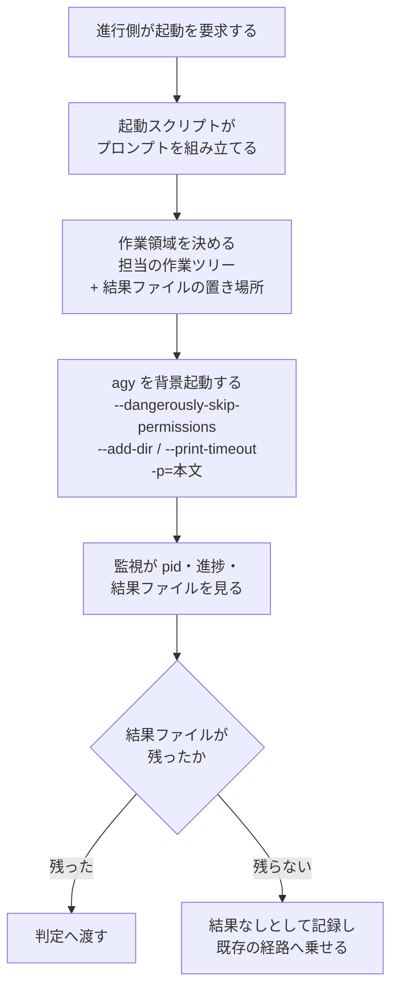

# 担当 A — 委譲先の CLI を gemini から agy へ移す（#214）

- issue: [#214](https://github.com/devbasex/ai-plugins/issues/214)
- ブランチ: `feature/issue-214-agy-cli`
- モード: `architecture`

この文書は受け入れ条件・設計・決定の記録・テスト設計の 4 つを持つ。`architecture` の
設計文書は独立したファイルにする規約（`design` の「モードごとの成果物」）で、この 1 本が
それにあたる。

## 用語

| 語 | この文書での意味 |
| --- | --- |
| 参加 CLI | 外部 AI として委譲する先のコマンド。`claude` / `codex` / `agy` / `kiro-cli` |
| 配布先ランタイム | NDF の Skill・エージェント・hook を配る先。この文書では扱わない（#215） |
| 作業領域 | agy が読み書きしてよいと宣言されたディレクトリ。`--add-dir` が決める |
| 作業ツリー | git の worktree。担当ごとに 1 つ用意される実体のディレクトリ |
| 進行側 | 収束ループを進める側。起動・監視・判定を行う |
| 起動スクリプト | 参加 CLI を非対話で背景起動する shell スクリプト |
| 監視 | `lib/monitor.py`。pid・進捗・結果ファイルから完了と中断を判定する |
| 結果ファイル | 参加 CLI が書き出す `<骨格>-result.json` |
| 母集合 | 役割ごとの参加候補の集合。提案・レビューと適用で別々に定義される |
| モデル | `--model` で指定する言語モデル。データの構造は指さない |

## 何を解決するか

| いまの状態 | 移した後 |
| --- | --- |
| 委譲先が `gemini` で、Google AI Pro / Ultra と無料枠向けの提供が止まっている | 委譲先が `agy` になる |
| 起動前に作業ツリーの設定ファイルを退避・復元している | 退避も復元もしない |
| 作業ツリーが現在地であることに依存して起動している | 作業領域を `--add-dir` で明示して起動する |
| CLI 側の実行時間の上限が既定のまま（agy では 5 分） | フェーズごとの監視の上限に合わせて明示する |

## 現状（実測）

作業環境で確認した。agy は 1.1.23（issue 本文の対応表は 1.1.22 で取ったもので、下の
6 項目はいずれも 1.1.23 でも同じだった）。

### 起動オプションは issue の対応表どおりに揃っている

```console
$ agy --version
1.1.23
$ agy --help | grep -cE -- '--(add-dir|dangerously-skip-permissions|model|output-format|print-timeout|mode|json-schema)'
7
```

### プロンプトは標準入力から渡せない

```console
$ agy --output-format text -p="" < p.md
Error: Error: empty prompt. Usage: agy --print "your prompt here"
$ agy --output-format text -p="$(cat p.md)"
2
```

`gemini` は `-p ""` と標準入力の組で渡していた。agy はプロンプトを `-p` の値として取る。

```console
$ agy -p --dangerously-skip-permissions "1+1は？"
Error: -p took "--dangerously-skip-permissions" as its prompt, so the intended prompt was
left as an argument and ignored.
```

### 作業領域の外への書き込みは、どのフラグでも通る

`--add-dir` で `workA` だけを宣言し、`--dangerously-skip-permissions` を付けずに実行した。

```console
$ agy --output-format text --add-dir "$D/workA" -p="作業領域に hello.txt を…／$D/outside/ng.txt にも…"
$ ls "$D/workA" "$D/outside"
hello.txt
ng.txt
```

`--sandbox` を付けた 2 回目の実行でも、作業領域の外の `ng2.txt` が作られた。
一方 `--mode plan` では書き込み自体が止まる。

```console
$ agy --output-format text --mode plan --add-dir "$D/workA" -p="作業領域に plan.txt を作り…"
jetski: no output produced — a tool required the "write_file" permission that headless
mode cannot prompt for, so it was auto-denied.
```

### 起動前の設定整形は要らない

除外設定の中に置いた手順書を、追加の設定なしで読めた。

```console
$ printf '*\n' > .agyskills/.gitignore   # 中の SKILL.md に合言葉を書いてある
$ agy --output-format text --add-dir "$D" -p="$D/.agyskills/refactoring/SKILL.md を読み、合言葉だけを答えて"
ZUMBA-7788
```

信頼済みディレクトリの登録も増えなかった。上の実行はいずれも一時ディレクトリで行った。

```console
$ cat ~/.gemini/antigravity-cli/settings.json
{ "colorScheme": "light", "trustedWorkspaces": [ "/work/ai-plugins" ] }
```

### 実行時間の上限が、監視の上限より短い

| フェーズ | 監視の上限 | agy の既定 |
| --- | --- | --- |
| `cross-review` のレビュー | 420 秒 | 300 秒 |
| `cross-refactoring` の提案・レビュー | 900 秒 | 300 秒 |
| `cross-refactoring` の適用・修正 | 3600 秒 | 300 秒 |

### 認証の確認に使える副コマンドがある

```console
$ agy models > /dev/null; echo $?
0
```

`gemini` には認証確認の副コマンドが無く、最小のプロンプトで疎通を見ていた。

### 実際に動いたモデル名は出力に載らない

```console
$ agy --output-format json -p="1+1は？数字だけ答えて"
{"conversation_id":"…","status":"SUCCESS","response":"2\n","duration_seconds":1.54,
 "num_turns":1,"usage":{…}}
```

## 受け入れ条件

### 起動の約束

1. `cross-review` のレビュー起動が `agy` を実行する
2. `cross-refactoring` の 4 フェーズ（提案・適用・レビュー・修正）が `agy` を実行する
3. 起動のコマンド行に `--add-dir <担当の作業ツリー>` が入る
4. 結果ファイルの置き場所が担当の作業ツリーの外にあるとき、その場所も `--add-dir` で入る
5. `--add-dir` に渡るのは 3 と 4 の 2 つだけである
6. プロンプトは `-p=<本文>` の形で渡り、`-p` より後ろに別のフラグが並ばない
7. `--dangerously-skip-permissions` が `-p` より前に入る
8. `--output-format text` が入る
9. モデルの指定があるとき `--model <名前>` が入り、無いときは入らない
10. `--print-timeout` が入り、その値がそのフェーズの監視の上限以上である

### 母集合と輪番

11. 参加 CLI の一覧が `claude` / `codex` / `agy` / `kiro` になる
12. 適用の母集合が `claude` / `codex` / `kiro` のままである
13. ラウンド番号ごとの担当の割り当てが、変更前の `gemini` を `agy` と読み替えた結果と一致する

### 設定整形の撤去

14. `lib/_gemini-env.sh` が無く、どのスクリプトからも読み込まれない
15. 起動スクリプトが作業ツリーの設定ファイルを退避・復元しない
16. `cross-refactoring` の作業ツリーの準備が `.gemini/settings.json` を書かない

### 疎通と監視

17. 認証の確認が `agy models` を実行し、終了コードと出力の語で判定する
18. 監視の対象名に `agy` を渡せる。`gemini` を渡すと引数の誤りとして落ちる
19. `agy` の無進捗の許容時間に既定値がある
20. gemini 固有の早期エラーの判定（承認モードの降格、`Error in: mcpServers.`）が無くなる

### 名前と記述

21. 状態ファイルのレビュアーの鍵が `agy` になり、判定の出力が `AGY_INTENT=` を出す
22. 一時ファイルの骨格が `agy-review-pr<番号>-…` になる
23. `cross-review` のレビュー起動のスクリプト名が `launch-agy.sh` になる
24. `external-ai` の参照が `references/cli-agy.md` になり、`cli-gemini.md` が無くなる
25. `pr-review` の第 2 引数の選択肢が `codex` / `agy` になる
26. 担当が触る範囲に残る `gemini` の語が、過去のレビューの出所を示すコメント
    （`gemini round N 指摘` の形）だけになる

### 全体

27. `uv run --with pytest pytest scripts/tests plugins/ndf -q` が通る
28. `python3 scripts/check-skill-frontmatter.py` が終了コード 0 で終わる
29. `bash scripts/build-runtime-plugins.sh` の結果をコミットしている

## 対象範囲

### 含む

- `plugins/ndf/skills/cross-review/`（手順書・参照・起動スクリプト・共通層・テスト）
- `plugins/ndf/skills/cross-refactoring/`（手順書・参照・スクリプト・テスト）
- `plugins/ndf/skills/external-ai/`（`SKILL.md` と CLI 別の参照）
- `plugins/ndf/skills/pr-review/SKILL.md` / `fix/SKILL.md` / `issue-plan-strategy/SKILL.md`
- `plugins/ndf/skills/worktree/` の `gemini` の記述と、対応するテスト
- `plugins/ndf/scripts/lib/worktree-common.sh` / `plugins/ndf/scripts/worktree-guard.sh` の
  `gemini` の記述
- `.ndf/worktree.json`

### 含まない

- 説明文書とプラグイン定義（担当 B が持つ）。書き換える箇所は「担当 B へ引き渡す記述」に残す
- `scripts/` 配下の検査（担当 B が持つ）
- `plugins/ndf/skills/worktree/` の `$NDF_SCRIPTS` の行（担当 F が持つ）
- 配布先ランタイムとしての agy（#215）
- 適用の母集合の見直し（#216）
- 作業領域の外への書き込みを検知する hook（#215）
- `issues/` `docs/development-history/` `docs/external-reviews/` `docs/presentations/` の記録

## 設計

### 構成要素

| 要素 | 責務 |
| --- | --- |
| `cross-review/scripts/launch-agy.sh` | レビュー担当としての起動。プロンプトの組み立てと背景起動 |
| `cross-review/scripts/lib/launch-cli.sh` | 参加 CLI 共通の背景起動。ランタイム名で分岐する |
| `cross-review/scripts/lib/assignment.py` | 参加 CLI の一覧と役割ごとの母集合、輪番 |
| `cross-review/scripts/lib/models.py` | モデル指定の受け渡しと実測値の突き合わせ |
| `cross-review/scripts/lib/monitor.py` | 完了と中断の判定。ランタイム別の無進捗の許容時間 |
| `cross-review/scripts/state.py` | 状態ファイルの読み書きと収束の判定 |
| `cross-refactoring/scripts/launch-cli.sh` | フェーズごとのプロンプトの組み立て |
| `cross-refactoring/scripts/prepare-worktrees.sh` | 担当ごとの作業ツリーと手順書の配置 |
| `cross-refactoring/scripts/refactor.py` | 疎通の確認と母集合の確定 |
| `external-ai/references/cli-agy.md` | 委譲先としての呼び出し方 |

`lib/_gemini-env.sh` は無くなる。信頼済みディレクトリの明示と設定の整形が、どちらも
要らなくなるためである（「現状（実測）」の 3 番目と 4 番目）。

### 入出力の契約

参加 CLI の呼び出しはコマンドの約束であり、仕様記述形式の標準が無い。
`design` の `interface-api.md` が定める 5 項目で書く。

| 項目 | 内容 |
| --- | --- |
| 名前 | `agy` |
| 入力 | 下の表のフラグ。プロンプトは `-p` の値として渡す |
| 出力 | 標準出力に最終応答の本文。結果ファイルは CLI が書く（プロンプトで指示する） |
| 失敗の形 | 終了コードが 0 以外。結果ファイルが残らないときは監視が「結果なし」として記録する |
| 互換性 | `gemini` を宛先にした起動は無くなる。進行中の状態ファイルは読み替えず、`init` からやり直す |

起動のコマンド行は次の順で組み立てる。**`-p` は末尾に置く。**

| 位置 | フラグ | 値 |
| --- | --- | --- |
| 1 | `--dangerously-skip-permissions` | なし |
| 2 | `--output-format` | `text` |
| 3 | `--print-timeout` | 呼び出し側が渡す。既定はフェーズの監視の上限より大きい値 |
| 4 | `--model` | 指定があるときだけ |
| 5 | `--add-dir` | 担当の作業ツリー。結果ファイルの置き場所が外にあれば繰り返して足す |
| 6 | `-p=<本文>` | プロンプト本文 |

`gemini` から引き継がない項目は次の 3 つである。

| gemini で渡していたもの | agy での扱い |
| --- | --- |
| `--skip-trust` と `GEMINI_CLI_TRUST_WORKSPACE=true` | 渡さない。信頼済みディレクトリの登録は増えない |
| `--include-directories` | `--add-dir` が担う |
| 標準入力からのプロンプト | `-p=<本文>` で渡す |

### データ構造

状態ファイルのレビュアーの鍵が変わる。**保存の形は変えず、鍵の値だけを移す。**

| 位置 | いま | 移した後 |
| --- | --- | --- |
| `cross-review` の状態ファイルのラウンド | `rounds[].gemini` | `rounds[].agy` |
| 判定の出力 | `GEMINI_INTENT=` | `AGY_INTENT=` |
| 一時ファイルの骨格 | `gemini-review-pr<番号>-…` | `agy-review-pr<番号>-…` |
| `cross-refactoring` の状態ファイルのモデル | `models.gemini` | `models.agy` |

**古い鍵を読み替える経路は置かない。** 状態ファイルは Pull Request ごとの一時ディレクトリ
にあり、`init` からやり直せる。読み替えを置くと、鍵が 2 通りある状態が版をまたいで残る。

### 処理の流れ



### 担当 B へ引き渡す記述

説明文書とプラグイン定義に残る `gemini` の記述である。**担当 A は触らない。**
担当 B が 4 ランタイム構成への書き直し（#215）とまとめて直す。

| ファイル | 行 | いまの記述 |
| --- | --- | --- |
| `README.md` | 23 | 外部 AI 委譲の説明に `Codex / Gemini CLI` |
| `README.md` | 24 | `codex/gemini 両方に PR レビューを委譲` と `Gemini の進捗 heartbeat` |
| `README.md` | 300 | `gemini が配置した手順書を読めない` の対処 |
| `README.md` | 322 | 適用の母集合の説明に `全ランタイム − gemini` |
| `AGENTS.md` | 302 | 外部 AI 委譲の説明に `Codex / Gemini CLI` |
| `CLAUDE.md` | 147 | `cross-refactoring` の参加 CLI の並び |
| `CLAUDE.md` | 166 / 175 | `cross-review` の委譲先と、観点の受け渡し先 |
| `plugins/ndf/README.md` | 141 | 振動の検知の説明に `codex / gemini` |
| `plugins/ndf/README.md` | 248 | 主ディレクトリで編集してよいパスの既定に `.gemini/` |
| `plugins/ndf/README.md` | 295〜300 | Gemini CLI の導入とログインの手順 |
| `.claude-plugin/marketplace.json` | 12 | `description` の `external AI delegation (Codex/Gemini)` |
| `plugins/ndf/.claude-plugin/plugin.json` | 4 | 同上 |
| `plugins/ndf/.codex-plugin/plugin.json` | 4 | 同上 |
| `plugins/ndf/skills/README.md` | 84 | frontmatter の規約の例に `(Codex/Gemini)` |
| `docs/specifications/ndf-skill-inventory.md` | 65 / 484 | 統合元の Skill 名と、適用の母集合の説明 |

**`plugins/ndf/README.md` の 248 行は、担当 A が `.ndf/worktree.json` から `.gemini/` を
外すことに対応する。** 担当 A のマージ後に直す。

## 決定の記録

### 決定 1: 参加 CLI の母集合から gemini を外し、agy を同じ位置へ置く

一覧の並びは輪番の添字を決めるため、`gemini` があった位置へ `agy` を入れる。
並べ替えると、同じラウンド番号でも担当の割り当てが変わり、これまでの記録と突き合わせられ
なくなる。適用の母集合から外す扱いも `agy` へそのまま引き継ぐ（見直しは #216 が行う）。

両方を母集合へ残す形は採らない。提案・レビューの母集合が 4 者になり、輪番の式が前提と
している「常に 3 者」が崩れる。起動の回数もラウンドあたり 1 回増える。

### 決定 2: `_gemini-env.sh` を削除する

この共通層は 2 つの事情のために置かれていた。作業ツリーのような新しいパスで承認モードが
降格することと、設定ファイルの `disabled` キーが警告を出すことである。agy では、一時
ディレクトリでの実行が信頼済みディレクトリの登録を増やさずに完了し、`agy mcp disable` が
`disabled` キーを自分で書く。どちらの事情も残らない。

空のまま残す形は採らない。読み込む側から見て、何もしない関数を呼ぶ理由が読み取れなくなる。
agy 用に書き換える形も採らない。移す中身が無い。

### 決定 3: `--add-dir` には担当の作業ツリーと、結果ファイルの置き場所だけを渡す

agy は現在地を作業領域にしないため、渡さないと利用者の見えない場所で作業する（issue 本文の
実測）。渡す範囲を 2 つに限るのは、作業領域が担当ごとに分かれていることが、提案・適用・
レビューを別々の担当に行わせる構造の前提になっているためである。

`cross-refactoring` は担当ごとに読み取り用の作業ツリーを用意しており、そのまま `--add-dir`
へ渡せる。`cross-review` はレビュー担当が 1 つの作業ツリーを共有するため、その作業ツリーを
渡す。結果ファイルは作業ツリーの中の `.cross_review/` に置かれるため、多くの場合 2 つ目は
要らない。

### 決定 4: `--print-timeout` をフェーズごとに明示する

既定の 300 秒は、`cross-review` の 420 秒、`cross-refactoring` の 900 秒と 3600 秒の
いずれよりも短い。CLI が先に打ち切ると結果ファイルが残らず、監視からは「起動したのに結果が
残らなかった」場合と区別が付かない。打ち切りの判断を監視の側へ一本化する。

値は呼び出し側が渡し、共通層は受け取った値をそのまま `--print-timeout` へ載せる。渡されな
かったときは、いちばん長いフェーズを覆う値を既定にする。共通層がフェーズを知る形は採らない。
フェーズの定義は Skill ごとに違う。

### 決定 5: 起動スクリプトを `launch-agy.sh` へ改名する

`cross-review` は、レビュー担当の名前で一時ファイルの骨格・状態ファイルの鍵・監視の対象名を
揃えている。スクリプト名だけ `launch-gemini.sh` のままにすると、どの担当を起動するのかが
名前から読めなくなる。

古い名前を残して中で新しい名前を呼ぶ形は採らない。呼び出し元は手順書と参照の 6 箇所で、
すべてこの変更に含まれる。

### 決定 6: 作業領域の外への書き込みは、CLI 側では抑えない

実測では、`--dangerously-skip-permissions` を付けなくても、`--sandbox` を付けても、作業領域
の外のファイルが作られた。`--mode plan` は書き込みを止めるが、レビュー担当は結果ファイルの
書き出しと `gh api` の実行が要るため、このモードでは役割を果たせない。

抑止の代わりに次の 3 つを置く。

| 層 | 何をするか |
| --- | --- |
| 宣言 | `--add-dir` に渡す範囲を、担当の作業ツリーと結果ファイルの置き場所に限る |
| 指示 | プロンプトの「作業ツリーの外は触らない」「リポジトリ編集禁止」をそのまま残す |
| 検知 | 主ディレクトリの編集を検知する hook（#215 が扱う） |

**この 3 つは書き込みを止めない。** issue 本文も、作業ツリーの外を書き換えられる前提で
hook を入れると書いている。残リスクとして下に残す。

### 決定 7: 一時ファイルの置き場所を変えない

`<作業ツリー>/.cross_review/` に置いているのは、gemini が作業領域の外への書き込みを拒む
ためだった。agy ではその制約が無いが、置き場所は変えない。監視の `--stem-template`、状態
ファイルのパス、手順書の 3 つが同じ前提を共有しており、動かすと 3 つとも書き換えになる。
置く理由の記述だけを「`--add-dir` に渡す作業領域を 1 つに保つため」へ直す。

### 決定 8: 認証の確認に `agy models` を使う

`gemini` には認証確認の副コマンドが無く、最小のプロンプトを投げて疎通を見ていた。agy は
`models` を持ち、認証を通ったときだけ一覧を返す。プロンプトを投げる形より短く終わり、
モデルの呼び出しを 1 回消費しない。

### 決定 9: 過去のレビューの出所を示すコメントは残す

`rotate-pr.sh` や `state.py` には `gemini round 4 指摘` の形のコメントがある。これは実行時
の呼び出し先ではなく、その行がそう書かれている理由の出所である。`issues/` と
`docs/development-history/` を書き換えないのと同じ扱いにする。

### 決定 10: `.ndf/worktree.json` の許可パスから `.gemini/` を外す

この一覧は、主ディレクトリで編集しても案内を出さないパスである。agy が作業領域の中で読む
設定は `.agents/` 配下で、これは一覧に既にある。

```console
$ grep -a -o -E ".{25}/\.agents/skills/.{25}" ~/.local/bin/agy | head -1
gentScript=%v){workspace}/.agents/skills/{skill_name}/SKILL.md
```

リポジトリの中の `.gemini/` を読む経路は、同じ走査では見つからなかった（見つかったのは
`~/.gemini/config/skills/` で、これは利用者の home の下にある）。

### 決定 11: 編集系の tool 名の一覧はそのまま残す

`worktree-common.sh` の一覧には gemini の `replace` と `run_shell_command` が入っている。
agy が書き込みに使う名前は `write_file` で、これは既に一覧にある（`--mode plan` の実行が
返した拒否の理由が `write_file` だった）。使われない名前が一覧に残っても、その名前の tool が
動かない限り一致しない。注釈だけを直し、agy の残りの名乗りは担当 B が足す。

## テスト設計

| 受け入れ条件 | 何で確かめるか |
| --- | --- |
| 1 / 2（agy を実行する） | PATH へ引数を書き出す実行ファイルを置き、起動スクリプトを走らせて記録を読む |
| 3 / 4 / 5（`--add-dir` の範囲） | 同上。記録された引数から `--add-dir` の値を数える |
| 6（`-p=` の形と位置） | 同上。`-p` が末尾にあり、値が本文と一致すること |
| 7 / 8（承認と出力形式） | 同上 |
| 9（モデル指定） | 同上。指定あり・なしの 2 通り |
| 10（実行時間の上限） | 同上。値がフェーズの監視の上限以上であること |
| 11 / 12（母集合） | 母集合の関数を直に呼ぶ既存のテストへ、`agy` を含む期待値を置く |
| 13（輪番） | ラウンド番号ごとの割り当てを、読み替えた期待値と突き合わせる |
| 14（共通層の削除） | ファイルが無いこと。`_gemini-env` を読む行がスクリプトに無いこと |
| 15（退避・復元をしない） | 起動の後に作業ツリーの設定ファイルが変わっていないこと |
| 16（設定を書かない） | 作業ツリーの準備を走らせ、`.gemini/settings.json` が作られないこと |
| 17（疎通の確認） | 疎通の確認の表に `agy models` が入っていること |
| 18（監視の対象名） | `agy` を渡すと受け付け、`gemini` を渡すと引数の誤りで落ちること |
| 19（無進捗の許容時間） | ランタイム別の既定の表に `agy` の項目があること |
| 20（早期エラーの判定） | gemini 固有の 2 つのパターンで中断しないこと |
| 21 / 22（状態ファイルの鍵と骨格） | 結果ファイルの取り込みと判定の既存のテストを `agy` の鍵で通す |
| 23（スクリプト名） | 手順書と参照から `launch-agy.sh` を指していること |
| 24 / 25（参照と引数） | 参照のファイルが存在し、`pr-review` の引数の説明が `codex` / `agy` であること |
| 26（残る語） | `plugins/` と `.ndf/` を走査し、残る `gemini` が出所のコメントだけであること |
| 27〜29（全体） | テストの一括実行、frontmatter の検査、生成物の同期 |

テストの置き場所は既存の一覧から選ぶ。起動の引数を見るテストは
`cross-refactoring/tests/test_launch_cli.py` が使っている PATH の差し替えと同じ形にする。
GitHub と agy への通信は行わない。

## 未確認のまま残ること

| 項目 | 内容 |
| --- | --- |
| 作業領域の外への書き込み | 止める手段は未確認。設定の項目名は実行ファイルの中に見えるが、公開された説明との対応は未確認 |
| レビューの所要時間 | `cross-review` の 420 秒で足りるかを、実機のレビュー 1 巡で確認していない |
| 進捗の記録 | 1 手ごとの追記は issue 本文で確認済み。無進捗の許容時間の既定値は、実機の巡回を見てから決め直す |
| agy の hook の入力の形 | 主ディレクトリの編集を検知する経路（#215 が扱う） |
| 除外設定と読み取り | 除外の中の手順書を読めることは確認した。`.antigravityignore` を置いたときの振る舞いは未確認 |

## 範囲外として見つけたこと

| 見つけた場所 | 内容 | 判断 |
| --- | --- | --- |
| `plugins/ndf/skills/cross-review/scripts/lib/models.py` の `observed_model` | 実際に動いたモデル名を取れるのは claude だけである。agy の `--output-format json` にもモデル名は載らない（実測）。計測の目的に対して、4 CLI 中 1 つしか実測値を持てない | 起票する |
| `plugins/ndf/skills/cross-review/scripts/lib/assignment.py` の置き場所 | 収束ループの共通層が `cross-review` の下にあり、`cross-refactoring` が相対パスで登っている（`launch-cli.sh` の 23 行）。Skill をまたぐ参照が片方向に固定される | 起票する |
| `plugins/ndf/skills/pr-review/SKILL.md` の委譲の手順 | 同梱されていないランタイム向けの要点が、`external-ai` の参照と別に書かれており、2 箇所で同じ起動の約束を持つ | 起票する |

起票はこの設計のレビューを通した後に行う（`out-of-scope` の手順で、見つけた場所と理由を
そのまま移す）。

## 完了条件

- [ ] 受け入れ条件 29 件をすべて満たしている
- [ ] `uv run --with pytest pytest scripts/tests plugins/ndf -q` が通る
- [ ] `python3 scripts/check-skill-frontmatter.py` が終了コード 0 で終わる
- [ ] `bash scripts/validate-runtime-plugins.sh` が終了コード 0 で終わる
- [ ] `bash scripts/build-runtime-plugins.sh` の結果をコミットしている
- [ ] 担当 F のマージ後に起点を取り込んでから `worktree/` に手を付けている
- [ ] `cross-review` が収束している
- [ ] `--base develop` を付けた Pull Request がマージされている
- [ ] マージ後に issue #214 を閉じている

## 参照

- [00-overview.md](00-overview.md) — バッチ全体の境界と順序
- `plugins/ndf/skills/cross-review/SKILL.md` — レビューの手順書
- `plugins/ndf/skills/cross-refactoring/SKILL.md` — 構造改善の手順書
- `plugins/ndf/skills/external-ai/SKILL.md` — 委譲の共通手順
- `~/.gemini/antigravity-cli/builtin/skills/antigravity_guide/` — agy に同梱された説明
