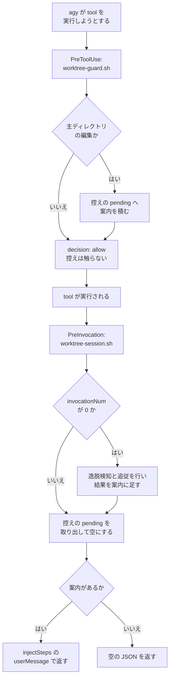

# 215: 配布先ランタイムへ agy を加える

Skill・エージェント・hook を配る先を Claude Code / Codex / Kiro CLI の 3 つから 4 つへ広げ、
Antigravity CLI（コマンド名 `agy`）を加える。この文書は受け入れ条件と、どう作るかを扱う。

## 用語

| 語 | この文書での意味 |
| --- | --- |
| 配布先ランタイム | Skill・エージェント・hook を配る先。Claude Code / Codex / Kiro CLI / agy |
| 参加 CLI | 外部 AI として委譲する先の CLI。#214（担当 A）が扱う別の概念 |
| 主ディレクトリ | リポジトリを clone したディレクトリ。作業ツリーの親 |
| 誘導 | 主ディレクトリを編集したときに、作業ツリーで作業する旨を伝える案内 |
| 配布の基準 | どの Skill をどの配布先へ渡すかを決めるファイル。`plugins/ndf/manifests/*-skills.txt` |

## 設計の前提となる実測

agy 1.1.24 / codex-cli 0.151.0 で確かめた。課題 #215 の本文は agy 1.1.22 時点の記録で、
次の 5 件はこの設計の分岐点にあたるため測り直した。

| 測ったこと | 結果 |
| --- | --- |
| プラグインの目印の位置 | ディレクトリ直下の `plugin.json`。`plugins/ndf` には無いため `agy plugin validate` が終了コード 1 で終わる。`plugins/playwright-kit` は 0 で終わる |
| `plugin.json` の `skills` 配列 | agy は読まない。`skills: ["./skills/alpha"]` を書いても `skills : 2 processed` になる |
| プラグイン内の Skill の絞り込み | `plugins.json` の `include_only` は**プラグインのディレクトリ名**に掛かる。プラグインが同梱する Skill は全件が読み込まれる（2 個入りのプラグインで合言葉が 2 つとも返った） |
| Codex とルートの `plugin.json` | ルートに `plugin.json` を置くと Codex の配布 Skill が `.codex-plugin/plugin.json` の `skills` 配列ではなく `skills/` の実体になる。置く前は `probe:alpha` だけ、置いた後は `probe:alpha` と `probe:beta` の両方が一覧に出た |
| `skills.json` の `include_only` | Skill のディレクトリ名で絞り込める。2 個のうち 1 個だけを登録すると、もう 1 個の合言葉は返らない |

hook についても測り直した。

| 測ったこと | 結果 |
| --- | --- |
| `hooks.json` の位置 | プラグイン直下。`hooks : 1 processed` になる |
| 実行時の作業ディレクトリ | `hooks.json` を置いたディレクトリ。`./scripts/<名前>.sh` の形で届く |
| プラグインルートの環境変数 | `PLUGIN_ROOT` も `CLAUDE_PLUGIN_ROOT` も設定されない |
| `matcher` | 全体一致の正規表現。`replace_.*` は `replace_file_content` に当たる。`replace` 単独では当たらない |
| `PreInvocation` の構造 | 平坦（`matcher` と `hooks` の入れ子を持たない）。モデル呼び出しのたびに発火し、`invocationNum` が 0 から増える |
| `PreToolUse` の `decision: allow` と `reason` | `reason` はモデルへ届かない（合言葉を載せて 1 回試し、応答に出なかった） |
| `PreInvocation` の `injectSteps` | `userMessage` はモデルへ届き、指示どおりの応答になった。`ephemeralMessage` は最初のモデル呼び出しでは届き、tool 実行の後の呼び出しでは応答に反映されなかった（2 回試行） |
| `agy plugin install` | ディレクトリ全体を `~/.gemini/config/plugins/<plugin.json の name>/` へ複製する。**symlink は実体へ解決して複製する**。`skills/` 以外の `hooks.json` / `scripts/` / `rules/` も複製される |
| `agy plugin list` | 導入が 1 件以上あるとき、標準出力は JSON になる。`imports[]` の各項目が `name` / `source` / `importedAt` / `components` を持ち、`components` は文字列の配列である。skills / agents / hooks を持つプラグインでは `skills` / `agents` / `hooks` の 3 つが並んだ。版数のフィールドは持たない。導入が 0 件のときは `No imported plugins.` という平文を返すため、その状態では JSON として読めない |

## 受け入れ条件

| 番号 | 条件 |
| --- | --- |
| A1 | `agy plugin validate plugins/ndf/dev.agy` が終了コード 0 で終わり、処理した Skill 数が `manifests/agy-skills.txt` の行数と一致し、hook が 1 件処理される |
| A2 | `agy plugin install plugins/ndf/dev.agy` の後、`agy plugin list` に名前 `ndf` が出て、`components` に `skills` と `agents` と `hooks` が並ぶ |
| A3 | 導入した環境で agy に Skill 名を列挙させると、`agy-skills.txt` に載る名前が返る |
| A4 | 主ディレクトリで編集系の tool を使うと、次のモデル呼び出しで誘導がモデルへ届く |
| A5 | 作業ツリーの中で同じ編集を行っても誘導は出ない |
| A6 | `.ndf/worktree.json` を持たないリポジトリでは、hook が何も出力せず終了コード 0 で終わる |
| A7 | `bash scripts/runtime-smoke-test.sh --runtime agy` が終了コード 0 で終わる |
| A8 | `bash scripts/build-runtime-plugins.sh --check` が終了コード 0 で終わり、`dev.agy/skills/` の内容が `agy-skills.txt` と食い違うときは非 0 で終わる |
| A9 | `bash scripts/validate-runtime-plugins.sh` が終了コード 0 で終わる |
| A10 | `python3 scripts/check-skill-frontmatter.py` が agy の初期一覧の合計を予算と突き合わせる |
| A11 | `python3 scripts/check-doc-staleness.py --root .` が 4 ランタイム分の Skill 数と 15 箇所の版数を突き合わせる |
| A12 | Claude Code 33 個・Codex 31 個・Kiro CLI 32 個という配布数が変わらない |
| A13 | `README.md` と `plugins/ndf/README.md` に agy の導入手順があり、そこに書いたコマンドを実行して同じ結果になる |

対象範囲に含まないもの:

- 参加 CLI としての agy（#214、担当 A が持つ）
- `plugins/ndf/skills/<Skill 名>/` の本文（他の担当が持つ）
- agy 向けの取得元の登録。登録の手段が見当たらないため、clone と `agy plugin install` で案内する

## 構成要素

| 要素 | 責務 |
| --- | --- |
| `plugins/ndf/dev.agy/plugin.json` | ディレクトリを agy のプラグインと宣言する。`name` / `version` / `description` を持つ |
| `plugins/ndf/dev.agy/hooks.json` | agy 書式の hook 定義。`PreToolUse` と `PreInvocation` を結ぶ |
| `plugins/ndf/dev.agy/skills/<Skill 名>` | `manifests/agy-skills.txt` が選んだ Skill への symlink。生成物 |
| `plugins/ndf/dev.agy/agents` | `plugins/ndf/agents` への symlink |
| `plugins/ndf/dev.agy/scripts` | `plugins/ndf/scripts` への symlink。hook の相対パスの届き先 |
| `plugins/ndf/manifests/agy-skills.txt` | agy へ配る Skill の基準 |
| `plugins/ndf/scripts/worktree-guard.sh` | agy の `PreToolUse` の入力を読み、誘導の対象を控えへ書く経路を足す |
| `plugins/ndf/scripts/worktree-session.sh` | agy の `PreInvocation` の入力を読み、`injectSteps` で出力する経路を足す |
| `plugins/ndf/scripts/lib/worktree-common.sh` | `WT_EDIT_TOOLS` へ agy の tool 名を足す |
| `scripts/build-runtime-plugins.sh` | `dev.agy/skills/` の symlink を生成し、`--check` で食い違いを検出する |
| `scripts/validate-runtime-plugins.sh` | `agy plugin validate` を検査へ入れ、`dev.agy/plugin.json` の版数と Skill 数を突き合わせる |
| `scripts/check-skill-frontmatter.py` | agy の初期一覧の予算を判定する |
| `scripts/check-doc-staleness.py` | 説明文書の 4 ランタイム分の数と、15 箇所の版数を突き合わせる |
| `scripts/runtime-smoke-test.sh` / `tests/runtime-smoke/` | `--runtime agy` の実機確認を足す |
| `.agents/plugins.json` | このリポジトリで開発するとき、clone したまま agy が `dev.agy` を見つけられるようにする |
| 説明文書 | `README.md` / `AGENTS.md` / `plugins/ndf/README.md` / `docs/specifications/runtime-plugin-distribution.md` / `docs/plugin-development-guide.md` / `docs/specifications/ndf-skill-inventory.md` / `plugins/ndf/skills/README.md` / `.claude-plugin/marketplace.json` |

### 着手の順序

`plugins/ndf/scripts/lib/worktree-common.sh` は #214（担当 A）が同じ期間に書き換える。
**担当 A の Pull Request がマージされた後に、起点を取り込んでからこのファイルへ触る。**
それまでの間は、共通ライブラリに依存しない要素（生成・検査・説明文書・`dev.agy` の
ファイル一式）から進める。

## データ構造

セッションの控え（`${TMPDIR:-/tmp}/ndf-worktree-<セッション識別子>.json`）に項目を 1 つ足す。

| 項目 | 型 | 意味 |
| --- | --- | --- |
| `pending` | 文字列の配列 | 次のモデル呼び出しで渡す案内。`PreToolUse` が積み、`PreInvocation` が取り出して空にする |

既存の項目（`main_dir` / `resolved_from` / `in_worktree` / `has_declaration` /
`declaration_stamp` / `allow_paths` / `notified` / `computed_at`）は変えない。`pending` を
持たない既存の控えは空配列として読む。

**この控えを agy でも使うのは、案内を作る時点と渡せる時点が離れているためである。** agy は
tool の実行前に案内を返す口を持たない（後述の決定 4）。控えの鍵になるセッション識別子は、
agy では `conversationId` を使う。

`notified` は既存のとおり、同じパスへの案内を 1 セッションで繰り返さないために使う。

## 入出力の契約

### agy の hook が受け取るもの・返すもの

| 事象 | 入力の主な項目 | 返すもの |
| --- | --- | --- |
| `PreToolUse` | `toolCall.name`、`toolCall.args`、`workspacePaths`、`conversationId`、`stepIdx` | `{"decision": "allow"}` |
| `PreInvocation` | `invocationNum`、`initialNumSteps`、`workspacePaths`、`conversationId` | `{"injectSteps": [{"userMessage": "…"}]}` または `{}` |

`toolCall.args` のうち、編集先を持つ項目は tool ごとに違う。

| tool 名 | 項目 | 意味 |
| --- | --- | --- |
| `write_to_file` | `TargetFile` | 作成・上書きの対象（絶対パス） |
| `replace_file_content` | `TargetFile` | 部分置換の対象（絶対パス） |
| `view_file` | `AbsolutePath` | 読み取りの対象。誘導の対象にしない |
| `run_command` | `CommandLine`、`Cwd` | 実行するコマンドと、その実行ディレクトリ |

### 既存の 2 ランタイムとの対応

| 項目 | Claude Code / Codex（`hooks/*.json`） | agy（`dev.agy/hooks.json`） |
| --- | --- | --- |
| 最上位の構造 | `{"hooks": {事象名: […]}}` | `{hook 名: {事象名: […]}}` |
| キーの書き方 | snake_case | camelCase |
| 事象名の受け取り | `hook_event_name` | 持たない。入力の形で判別する |
| tool 名 | `tool_name` | `toolCall.name` |
| 編集先 | `tool_input.file_path`（Codex はパッチ本文） | `toolCall.args.TargetFile` |
| シェルのコマンド | `tool_input.command` | `toolCall.args.CommandLine` |
| 実行ディレクトリ | `cwd` | `workspacePaths[0]`。`run_command` は `toolCall.args.Cwd` |
| セッションの識別子 | `session_id` | `conversationId` |
| 案内の渡し方 | `hookSpecificOutput.additionalContext` | `PreInvocation` の `injectSteps[].userMessage` |
| プラグインルート | `${CLAUDE_PLUGIN_ROOT}` / `$PLUGIN_ROOT` | 環境変数を持たない。作業ディレクトリが `hooks.json` の位置 |
| 開始時の処理 | `SessionStart` | `PreInvocation` で `invocationNum` が 0 のとき |
| 無効化 | 定義を外す | hook 名の下に `"enabled": false` |

**`matcher` は 1 箇所から作る。** 対象になる tool 名は `worktree-common.sh` の
`WT_EDIT_TOOLS` / `WT_PATCH_TOOLS` / `WT_SHELL_TOOLS` が持ち、`wt_tool_matcher` が
連結した文字列を返す。agy 向けにも同じ文字列を `matcher` へ書く。agy の照合は全体一致の
正規表現であるため、他のランタイムの tool 名が混ざっていても当たらないだけで済む。

`WT_EDIT_TOOLS` へ足すのは `write_to_file` と `replace_file_content` の 2 つである
（`edit_file` と `run_command` は既に含まれる）。

### 説明文書が持つ約束

| 文書 | 足す記述 |
| --- | --- |
| `README.md` | 公開 Skill の行へ「agy向け core <数>個」を足す。プラグイン一覧表の説明を 4 ランタイムにする |
| `plugins/ndf/README.md` | 配布先の表へ `| agy | <数> 個 | dev.agy/plugin.json |` を足す。レイアウト図へ `dev.agy/` を足す。導入手順を足す |
| `AGENTS.md` | 「NDFプラグインについて」を 4 ランタイムにする。版数を持つ箇所の表を 15 箇所にする |
| `.claude-plugin/marketplace.json` | 該当項目の `description` を 4 ランタイムに合わせる |

導入手順は取得元の登録を経ない。

```bash
git clone https://github.com/devbasex/ai-plugins
agy plugin install ai-plugins/plugins/ndf/dev.agy
agy plugin list
```

## 処理の流れ



`worktree-guard.sh` と `worktree-session.sh` は、いまも 3 ランタイム分の入力を 1 つの判定へ
正規化している。agy の経路も同じ 2 本へ足す。判定は共通ライブラリが持ち、入口のスクリプトは
入力の受け取りと出力の整形だけを行う（既存の設計方針）。

## 決定の記録

### 決定 1: agy 向けのプラグイン定義を `plugins/ndf/dev.agy/` へ置く

`plugins/ndf/plugin.json` を新設すると、Codex の配布 Skill が 31 個から `skills/` の実体
33 個へ変わる。実測で確かめた（前掲の表）。増える 2 個のうち `official-skills-autoloader` は
`~/.claude/skills/` へ書き込む Claude Code 向けの Skill で、`statusline` も Claude Code の
設定を扱う。どちらも Codex では動かす対象にならない。受け入れ条件 A12 はこの回帰を防ぐ。

ルートの `plugin.json` に `skills` 配列を書いても Codex の配布数は変わらない。これも実測で
確かめた。したがって「ルートへ置いて絞り込みも書く」という形は成り立たない。

`plugins/ndf/dev.agy/` は Agent Plugins 1.0.0 §8.2 のクライアント拡張ディレクトリにあたる。
Kiro CLI 向けの `dev.kiro/` が同じ位置づけで先にあり、`dev.<クライアント>` の形はこの
リポジトリで通っている。この位置なら `plugins/*/manifests` で配布物の一群を数える既存の検出にも、
`plugins/<family>/plugin.json` を見る既存の検査にも掛からない。

ディレクトリ名に agy を使うのは、配布の基準（`agy-skills.txt`）・実機確認の選択肢
（`--runtime agy`）・説明文書のすべてでこのランタイムを `agy` と呼ぶためである。同じ対象に
2 つの名前を与えると、読み手がどちらか一方しか知らないまま読み進めることになる。

### 決定 2: 配る Skill の基準は `manifests/agy-skills.txt` だけが持つ

`skills.json` / `plugins.json` の `include_only` と `exclude` は、**利用者側の設定ディレクトリ**
（`.agents/` または `~/.gemini/config/`）に置くもので、こちらが配る成果物には含まれない。
さらに `plugins.json` の絞り込みはプラグインのディレクトリ名に掛かり、プラグインが同梱する
Skill には届かない。実測で、2 個入りのプラグインは 2 個とも読み込まれた。

したがって絞り込みは、`dev.agy/skills/` へ何を並べるかで表す。並べる内容は
`agy-skills.txt` が決め、`build-runtime-plugins.sh` が symlink を生成する。他の 3 ランタイムと
同じく、配布の基準は `manifests/` の 1 箇所にある。

`skills.json` の `include_only` は Skill のディレクトリ名で絞り込める（実測）。ただし
これが効くのは、利用者が自分の `.agents/skills.json` を書く場合に限られる。`plugins/ndf` を
Skill の置き場所として登録すれば、プラグインを入れずに一部の Skill だけを使うこともできる。
これは配布の経路ではないため、説明文書には書かない。

### 決定 3: agy へ配る Skill は `codex-skills.txt` と同じ 31 個から始める

Claude Code だけで動く 2 個（`official-skills-autoloader` / `statusline`）を外した集合である。
Kiro CLI 向けの 32 個との差は `statusline` の 1 個で、これは Claude Code の表示設定を扱うため
agy では動かす対象にならない。

`ndf-policies` は Codex と同じく Skill として配る。agy は `rules/AGENTS.md` を常時効く指示と
して読む仕組みを持ち、Kiro CLI の `.kiro/steering/ndf-policies.md` と同じ位置づけにできるが、
この設計では採らない。常時注入は文脈を消費し続けるため、効果と費用を測ってから決める。測る前に
入れると、後で外すときに「入れたから良くなった」と「入れても変わらなかった」を区別できない。

### 決定 4: 誘導は `PreToolUse` で作り、次の `PreInvocation` で渡す

agy の `PreToolUse` がモデルへ文言を返す口は `reason` だが、`decision` が `allow` のときは
モデルへ届かなかった（実測）。届くのは `deny` のときで、そのときは tool の実行が止まる。
NDF の誘導は操作を止めない方針であるため、`deny` は使わない。

`PreInvocation` の `injectSteps` は届く。`userMessage` を使うと、tool 実行の後の呼び出しでも
モデルが指示どおりに応答した（実測）。`ephemeralMessage` は最初の呼び出しでは届いたが、
tool 実行の後の呼び出しでは応答へ反映されなかった（2 回試行）。したがって `userMessage` を使う。

案内を積む先は既存のセッションの控えで、`PreToolUse` が積み、`PreInvocation` が取り出す。

### 決定 5: セッション開始時の処理は `invocationNum` が 0 のときに行う

agy に `SessionStart` にあたる事象は無い。`PreInvocation` はモデル呼び出しのたびに発火し、
入力の `invocationNum` が 0 から増える（実測）。この値が 0 のときだけ、逸脱検知と
ブランチの追従を行う。

状態を別のファイルへ持たないのは、判定に必要な値が入力に含まれるためである。控えの
ファイルで「1 度実行した」を表すと、控えが消えた場合や別の会話が同じ鍵を使った場合に、
実行する・しないの判定が入力から読めなくなる。

Claude Code の `SessionStart` に結んでいる 3 つのうち、agy で行うのは
`worktree-session.sh` だけである。`ensure-retention.sh` は `~/.claude/settings.json` を、
`statusline-switch.sh` は Claude Code の表示設定を扱うため、agy に対応するものが無い。

### 決定 6: hook の実体は Claude Code / Codex 版と共有する

`dev.agy/scripts` を `plugins/ndf/scripts` への symlink にする。`agy plugin install` は
symlink を実体へ解決して複製するため、導入した先では独立したファイルとして届く（実測）。

分けない理由は、判定が 1 つだからである。「主ディレクトリの、許可されていないパスを
編集しようとしている」という判定はランタイムによらない。分けると、`.ndf/worktree.json` の
読み方や許可パスの扱いを 2 箇所で直すことになる。

ランタイムごとに違うのは入力の形と出力の形だけで、そこは既存の 2 本のスクリプトが
すでに 3 ランタイム分を扱っている。同じ場所へ 4 つ目を足す。

### 決定 7: `dev.agy/plugin.json` にも版数を持たせ、検査の対象へ入れる

版数を持つ箇所は 13 から 15 になる（`version` と `description` の 2 つ）。agy の
マニフェストの仕様は `name` と `disabled` だけを定めるが、追加の項目があっても
`agy plugin validate` は通る（実測）。

持たせるのは、利用者が手元のディレクトリを見て版を判断できるようにするためである。agy には
取得元の登録が無く、`agy plugin list` も版数を出さないため、clone した中身以外に手がかりが無い。

**記載を消して検査を通せない形にする。** `validate-runtime-plugins.sh` の既存の
`check_description` を使い、Claude 版 `plugin.json` の `version` を基準に照合し、
Skill 数は `agy-skills.txt` の行数と突き合わせる。

## テスト設計

| 受け入れ条件 | 何で確かめるか |
| --- | --- |
| A1 | `agy plugin validate plugins/ndf/dev.agy` を `validate-runtime-plugins.sh` から実行する。agy が無い環境では読み飛ばし、その旨を出力する（`claude plugin validate` と同じ扱い） |
| A2 | `tests/runtime-smoke/adapters/agy.sh` が `agy plugin install` と `agy plugin list` を実行し、`assert-plugin-files.sh` の `agy` の枝が導入先の `plugin.json` / `skills/*/SKILL.md` / `hooks.json` の存在を見る。あわせて `agy plugin list` の標準出力を JSON として読み、`.imports[] | select(.name == "ndf") | .components` が `agents` / `hooks` / `skills` の 3 つであることを固定する。ファイルの存在だけでは、agy がどの要素を取り込んだかを確かめられないためである。実測では `skills` / `agents` / `hooks` の順で出たが、並びが保たれることは確かめていないため、並べ替えてから比べる |
| A3 | 同じアダプタで、`agy-skills.txt` の名前が導入先に揃っていることを確かめる。Skill 一覧の取得は認証を要するため、認証付きの実機確認（`assert-authenticated-smoke.sh`）の側に置く |
| A4 | `plugins/ndf/skills/worktree/tests/` へ pytest を足す。agy の `PreToolUse` の入力を `worktree-guard.sh` へ流し、控えの `pending` に相対パスが積まれることを見る。続けて `PreInvocation` の入力を `worktree-session.sh` へ流し、`injectSteps[].userMessage` にそのパスが出ることを見る |
| A5 | 同じテストで、作業ツリーの中を起点にした入力では `pending` が空のままであることを見る |
| A6 | 同じテストで、`.ndf/worktree.json` を置かないリポジトリでは出力が空で終了コードが 0 であることを見る |
| A7 | `bash scripts/runtime-smoke-test.sh --runtime agy`。`tests/runtime-smoke/Containerfile.agy` を足し、`RUNTIMES` の既定（`all`）へ agy を入れる |
| A8 | `bash scripts/build-runtime-plugins.sh --check`。symlink を 1 本消した状態と、`agy-skills.txt` に無い名前の symlink を足した状態の両方で非 0 になることを pytest で見る |
| A9 | `bash scripts/validate-runtime-plugins.sh` |
| A10 | `python3 scripts/check-skill-frontmatter.py --report` の出力に agy の行が出ること。`scripts/tests/` へ、agy の manifest がある木で予算の判定が行われることを見るテストを足す |
| A11 | `scripts/tests/test_doc_staleness.py` へ、agy の数を書き換えた木・記載を消した木で失敗することを見るテストを足す。版数は `dev.agy/plugin.json` の 2 箇所について、古い値と欠落の両方で失敗することを見る |
| A12 | `scripts/tests/` へ、`plugins/ndf/plugin.json` が存在しないことを見るテストを足す。存在すると Codex の配布数が変わるため、置かないこと自体を固定する |
| A13 | 説明文書に書いたコマンドを実行し、出力が記載と一致することを確かめる。`agy plugin install` は導入先を書き換えるため、実機確認の容器の中で行う |

`WT_EDIT_TOOLS` へ tool 名を足す変更は、既存の `test_hook_wiring.py` が守る。`matcher` と
`wt_tool_matcher` の一致を見る検査へ agy の枝を足し、`dev.agy/hooks.json` の
`PreToolUse` の `matcher` が同じ文字列であることを見る。

テストは `uv run --with pytest pytest scripts/tests plugins/ndf -q` で回す。

## 未確認のまま残ること

| 項目 | 内容 |
| --- | --- |
| 初期一覧の予算 | agy の公式ドキュメントに規定が無い。`agy models` は各モデルのコンテキスト長を出さず、`/context` にあたる手段も見当たらない。既定のモデルは Gemini 3.x Flash 系で、Kiro CLI と同じくコンテキスト長 1,000,000 を前提に Claude Code の 1% を借りる形で置き、借りたことを `check-skill-frontmatter.py` の注記へ残す |
| 初期一覧にパスが載るか | 公式の記述が無い。多い側（載る）で見積もる。Kiro CLI と同じ扱い |
| `invocationNum` の起点 | 1 回の実行では 0 から増えることを確かめた。`--continue` で会話を再開したときに 0 へ戻るかは未確認。戻る場合は逸脱検知が再開のたびに動くが、案内が重ねて出るだけで操作は止まらない |
| agy が読むエージェントの形式 | `agents : 8 processed` として受け付けることは確かめた。Claude Code 向けに書いた frontmatter が agy でどう解釈されるかは未確認 |
| `browser_*` などの tool 名 | 実測で観測できたのは `write_to_file` / `replace_file_content` / `view_file` / `run_command` の 4 つ。ドキュメントには `edit_file` と `browser_*` の記載がある。編集を伴う tool を取りこぼした場合、その操作では誘導が出ない |
| `PreToolUse` の `reason` | `decision: allow` のときにモデルへ届かないことを 1 回の試行で確かめた。試行回数が少ないため、`deny` を使わない判断の根拠としては決定 4 の `injectSteps` の実測に依る |

## 範囲外として見つけたこと

| 見つけたもの | どこで | 判断 |
| --- | --- | --- |
| `docs/specifications/runtime-plugin-distribution.md` の配布 Skill 数が「Claude Code 27 / Codex 25」のままで、現在の 33 / 31 と食い違う。`check-doc-staleness.py` の対象は `README.md` / `AGENTS.md` / `plugins/ndf/README.md` の 3 本で、仕様書は入っていない | `docs/specifications/runtime-plugin-distribution.md` の「NDF Plugin 配布仕様」と「採らなかった点」 | 起票する。この設計で同じ文書へ agy の記述を足すため近接するが、数の検査の対象を広げるかどうかは別の判断になる |
| `plugins/ndf/skills/README.md` が「3 ランタイム」を前提に書かれた箇所を 10 箇所以上持つ。frontmatter の規約そのものは 4 ランタイムでも変わらない | `plugins/ndf/skills/README.md` の冒頭・上限値・換算比の節 | 範囲内へ入れる。#215 の対象範囲に「Skill の規約」として挙がっており、agy の予算を足す作業と同じ箇所を触る |
| `agy plugin install` で導入した実体を、こちらから更新する手段が見当たらない。`agy plugin uninstall` と `install` の組み合わせになる | `agy plugin --help` の一覧 | 起票する。利用者が新しい版を受け取る手順の問題で、配布の入口（決定 1）とは別に決める必要がある |
| `tests/runtime-smoke/assertions/assert-plugin-files.sh` が runtime ごとに枝を持ち、ランタイムを足すたびに 3 つの assertion スクリプトへ枝が増える | `tests/runtime-smoke/assertions/` の 3 本 | 起票しない。枝は 1 ランタイムあたり数行で、共通化しても読む量が減らない |
