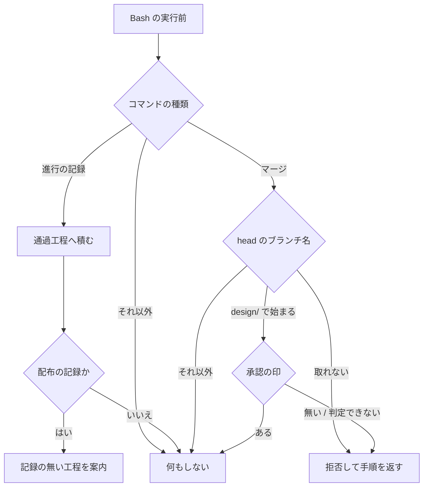

# 担当 C — 工程の飛ばしを検知し、設計 Pull Request のマージを承認に縛る（#221 / #266）

- issue: [#221](https://github.com/devbasex/ai-plugins/issues/221) / [#266](https://github.com/devbasex/ai-plugins/issues/266)
- ブランチ: `feature/issue-221-266-stage-guard`
- モード: `architecture`

この文書は受け入れ条件と設計の両方を持つ。`architecture` のため設計は独立した節として
すべて埋める（`design` の規約）。

**2 件は 1 つの仕組みの上に乗る。** #221 が「必須の工程を通らずに進んだことに気づけない」
全般を扱い、#266 が「設計 Pull Request のマージ」という 1 点を機械で止める。どちらも
tool 実行前の hook が同じコマンドの本文を読んで判定するため、入口を 1 つにする。

## 用語

| 語 | この文書での意味 |
| --- | --- |
| 工程表 | `development-workflow` の「モードごとに起動する Skill」の表 |
| 盤面 | 進行を記録する GitHub Projects のプロジェクト 1 つ |
| 進行の記録 | `plugins/ndf/scripts/projects-sync.sh` の呼び出し 1 回 |
| 通過工程 | ある課題について、進行の記録が実際に書かれた工程の集合 |
| 会話の単位 | Claude Code の 1 起動。`session_id` で識別される範囲 |
| 進行する AI | 工程を続けて通している側。`/goal` で動いているものを含む |
| 承認の印 | 人間が設計を承認したことを表す、Pull Request に付くラベル |
| 通す / 拒否 | tool の実行を許すこと / `permissionDecision` で止めること |

## 何を解決するか

| 課題 | 現在の状態 |
| --- | --- |
| #221 | 必須の工程を通らずに配布まで進んでも、それに気づく出力がどこにも出ない |
| #266 | 設計 Pull Request のマージが、人間の承認を経ずに実行できる |

## 現状（実測）

### 盤面は工程の履歴を持たない

盤面から読み返せるのは各フィールドの**現在の値**だけである。

```console
$ gh project item-list 1 --owner devbasex --limit 30 --format json \
    | jq -c '.items[] | select(.content.number==161) | {"進行": .["___行"]}'
{"進行":"振り返り"}
```

課題の時系列に残るのは `Status`（`Todo` / `In Progress` / `Done`）の変化だけで、
単一選択の独自フィールドの変化は残らない。#161 は工程を 11 回書き込んでいるが、
時系列に残った変化は 2 件である。

```console
$ gh api graphql -f query='{repository(owner:"devbasex",name:"ai-plugins"){
    issue(number:161){timelineItems(first:100,itemTypes:[
      PROJECT_V2_ITEM_STATUS_CHANGED_EVENT, ISSUE_FIELD_CHANGED_EVENT,
      ADDED_TO_PROJECT_V2_EVENT]){totalCount nodes{__typename}}}}}'
{"totalCount":3,"nodes":[{"__typename":"AddedToProjectV2Event"},
 {"__typename":"ProjectV2ItemStatusChangedEvent"},{"__typename":"ProjectV2ItemStatusChangedEvent"}]}
```

### 盤面に載っていない課題では、進行の記録が何も残らない

`projects-sync.sh` は対象のアイテムが無いとき、何も出力せず終了コード 0 で終わる。このバッチの
課題のうち #221 は盤面に載っているが、#266 / #242 / #229 / #228 は載っていない（4 件とも記録の
呼び出しが何も書かずに終わった）。**盤面を唯一の根拠にすると、これらの課題では検知が働かない。**

### 工程は前後する

#161 の進行の記録は次の順で動いた（issue #221 の本文）。

```text
作業場所の用意 → 要求と受け入れ条件 → 設計 → レビュー → 後片付け → 計画 → 完了判定
→ レビュー → 後片付け → 配布 → 振り返り
```

`レビュー` と `後片付け` が 2 回ずつ現れる。設計レビューの工程が `pr` → `cross-review` →
`merged` を呼ぶためで、これは工程表どおりの動きである。抜けているのは `確定仕様化` の 1 つだけである。

### 設計 Pull Request の見分けに使える値

過去の設計 Pull Request 3 本と、設計ではない Pull Request を突き合わせた。

| Pull Request | 内容 | head のブランチ | 変更したパス |
| --- | --- | --- | --- |
| #268 | 設計 | `design/parallel-batch-04` | `issues/` だけ |
| #230 | 設計 | `docs/parallel-batch-03-design` | `issues/` だけ |
| #212 | 設計 | `feature/issue-161-design-phase-skill` | `issues/` だけ |
| #267 | 全体指示 | `docs/parallel-batch-04` | `issues/` だけ |
| #218 | 実装 | `feature/issue-161-design-skill-impl` | `plugins/` ほか |

変更したパスは設計 3 本すべてを拾うが、設計ではない #267 も拾う。

### 承認の印に使える値

このリポジトリに独自のラベルは無く、`design-approved` も定義されていない。

```console
$ gh api /repos/devbasex/ai-plugins/labels/design-approved --jq '.name'
gh: Not Found (HTTP 404)
$ gh api /repos/devbasex/ai-plugins/pulls/265 --jq '[.labels[].name]'
[]
```

GitHub のレビュー承認は使えない。Pull Request の作成者と実行者が同じアカウントであるため、
`APPROVE` は `HTTP 422` になる（`cross-review` が `COMMENT` へ倒しているのと同じ理由）。

### 取得は REST が残り、番号はブランチ名から引ける

この設計を書いている間に GraphQL が利用上限へ達し、`gh pr view --json` が落ちた。同じ値は REST で
1.0 秒で取れた。番号を書かない `gh pr merge` に備え、ブランチ名から引く経路も測った。**1 回の応答
で番号とラベルの両方が返る（0.46 秒）。ただしブランチ名は detached HEAD の作業ツリーでは取れない。**

```console
$ gh pr view 268 --json headRefName
GraphQL: API rate limit already exceeded for user ID 10234200.
$ gh api /repos/devbasex/ai-plugins/pulls/268 --jq '[.state, .head.ref] | @tsv'
closed	design/parallel-batch-04
$ gh api "/repos/devbasex/ai-plugins/pulls?head=devbasex:design/parallel-batch-05" \
    --jq '.[] | {number, head: .head.ref, labels: [.labels[].name]}'
{"head":"design/parallel-batch-05","labels":[],"number":290}
$ git branch --show-current   # cross-review の作業ツリー。detached HEAD のため出力は空
```

マージそのものも REST で行われることがある。バッチ 04 では上限に当たった後、
Pull Request の作成とマージをすべて REST で行った（`docs/development-history/10-2026-09-02.md`）。

### frontmatter に `hooks` を足すと、いまの検査は落ちる

```console
$ python3 scripts/check-skill-frontmatter.py --skills-dir <hooks を足した複製>
ERROR [ops/unknown-key] development-workflow: 未知の項目名: hooks
```

## 受け入れ条件

### #221 工程の飛ばしを検知する

1. 必須の工程の進行の記録が無いまま配布の記録へ進んだとき、記録の無い工程の名前が出力に現れる
2. 後片付けの完了報告に、通過工程と記録の無い必須の工程が**スクリプトの出力として**載る。進行する AI が記憶から書く形にしない
3. 工程が前後しても、記録の無い必須の工程が無ければ何も出ない（#161 の並びで誤検知しない）
4. 進行の記録が 1 件も無い課題では「記録が無い」とだけ出し、すべての工程を欠落として並べない
5. 必須の工程の一覧は工程表から機械で導け、工程表を変えたときに食い違いを検査が拾う
6. 進行の記録を書く手順（`projects-sync.sh` の呼び出し方）は変わらない
7. 盤面に載っていない課題でも 1〜4 が働く

### #266 設計 Pull Request のマージを承認に縛る

1. head のブランチが `design/` で始まる Pull Request のマージは、承認の印が無ければ拒否される
2. 拒否は `gh pr merge`（番号あり・番号なし）と REST（`PUT …/pulls/{番号}/merge`）の両方で起きる
3. 承認の印が付いているときは通る
4. `design/` で始まらない Pull Request のマージは通る
5. 承認の印がリポジトリに定義されていないことを**問い合わせで確かめられた**ときは通す
6. 承認の印が付いているかを確かめられないときは拒否する（問い合わせの失敗・利用上限・
   判定に要るコマンドが無い場合・Pull Request を特定できない場合を含む）
7. すべての tool を自動で通す設定（`bypassPermissions` / `--dangerously-skip-permissions`）でも拒否が効く
8. 拒否の理由に、**通すために何をするか**が含まれる。6 では確かめられなかった値も出す
9. `hooks` を持つ `SKILL.md` を Codex と Kiro が読み込んでも、Skill の読み込みが失敗しない

## 構成要素

| 要素 | 責務 |
| --- | --- |
| `development-workflow` の frontmatter の `hooks` | この Skill が呼ばれた時点で、tool 実行前の判定を会話の単位へ登録する |
| `development-workflow/scripts/workflow-guard.sh`（新設） | hook の入口。入力を読み、2 つの判定へ振り分け、出力を整形する |
| `development-workflow/scripts/stage-check.sh`（新設） | 人と Skill が呼ぶ入口。通過工程の記録と報告を行う |
| `development-workflow/scripts/lib/workflow-common.sh`（新設） | 判定のすべて。コマンドの読み取り・必須の工程・設計 Pull Request の見分け・承認の印 |
| 通過工程の控え | 課題ごとの記録。会話の単位をまたいで残る |
| `development-workflow/references/stage-completeness.md`（新設） | 控えの場所と読み方、報告の出し方、承認の印の作り方 |
| `merged` の完了報告 | `stage-check.sh report` の出力を載せる |
| `development-workflow/tests/`（追加） | 判定関数の単体テスト。通信しない |

**判定はすべて共通ライブラリが持ち、入口のスクリプトは入出力の整形だけを行う。**
`worktree` と進行の記録が採っている構造をそのまま使う。

## データ構造

この変更が持つ永続データは通過工程の控えだけである。課題ごとに 1 ファイル置く。

```json
{"version": 1, "repo": "devbasex/ai-plugins", "issue": 221,
 "mode": "architecture",
 "stages": ["作業場所の用意", "要求と受け入れ条件", "設計", "設計レビュー"],
 "updated_at": "2026-09-03T00:00:00Z"}
```

| 項目 | 内容 |
| --- | --- |
| 保存する形 | 課題 1 件 = 1 ファイル。一意性の条件はリポジトリと課題番号の組 |
| 名前と意味 | `stages` は進行の記録が書かれた工程の並び。**工程を通ったことではなく、記録が書かれたことを表す。** 空の配列は「記録が 1 件も無い」を表し、ファイルが無い状態と同じ意味になる |
| 時系列の扱い | 事象の記録を採る。工程の値を追加するだけで、既にある値を書き換えない。同じ値が 2 回来ても両方残す |
| 移行 | 既存のデータは無い。`version` が `1` 以外のファイルは読まず、記録が無いものとして扱う |
| 検査の手段 | `stage-check.sh report` の出力を単体テストで固定する。`stages` の値が工程表の行名に含まれることを検査する |

**上書きの形を採らない。** 工程は前後するため（#161 の実測）、最後の値だけを持つと
何を通ったかが復元できない。

置き場所は次の順で決める。リポジトリの中には置かない（変更として Pull Request に載るため）。

```text
${CLAUDE_PLUGIN_DATA}/stages/            # 与えられていればここ
${XDG_STATE_HOME:-$HOME/.local/state}/ndf/stages/
${TMPDIR:-/tmp}/ndf-stages/              # どちらも作れないとき
```

ファイル名は `<所有者>__<リポジトリ>__<課題番号>.json` とする。所有者とリポジトリは
`git config --get remote.origin.url` から取り、通信しない。

## 入出力の契約

### tool 実行前の hook

入力は標準入力の JSON である。読む値は 4 つに限る。

| 値 | 使い道 | 取れないとき |
| --- | --- | --- |
| `hook_event_name` | `PreToolUse` 以外は扱わない | 何もしない |
| `tool_name` | `Bash` 以外は扱わない | 何もしない |
| `tool_input.command` | 判定の対象。コマンドの本文 | 何もしない |
| `cwd` | リポジトリの所有者と名前を `git config --get remote.origin.url` から取る起点 | 控えを書かない |

出力は 3 通りである。いずれも終了コード 0 で返す。

```json
{"hookSpecificOutput": {"hookEventName": "PreToolUse",
  "permissionDecision": "deny", "permissionDecisionReason": "…"}}
```

```json
{"systemMessage": "…",
 "hookSpecificOutput": {"hookEventName": "PreToolUse", "additionalContext": "…"}}
```

3 つ目は**何も出力しない**である。判定の対象でないコマンド、条件を満たした場合、#221 の判定に
要る値を取得できなかった場合がここへ入る。#266 の判定に要る値を取得できないときは拒否へ回る（決定 8）。

`permissionDecisionReason` は進行する AI へ渡る。理由だけでは次の一手が決まらないため、通すための
操作をそのまま書く。対象を特定できないときは、番号を書いて実行し直す手順を返す。

```text
設計 Pull Request #268 は承認の印（ラベル design-approved）が付いていないためマージしません。
人間の承認を得て、GitHub の画面で design-approved を付けてください。付けば同じコマンドが通ります。
設計 Pull Request でない場合は、head のブランチ名を design/ 以外へ変えてください。

マージの対象の Pull Request を特定できないためマージしません（現在のブランチ名を取得できず）。
`gh pr merge <番号>` のように番号を書いて実行し直してください。
```

### 判定に使う値

| 何を見るか | どこから取るか | 取れないときの扱い |
| --- | --- | --- |
| マージの対象の番号 | コマンドの本文（`gh pr merge <番号>` / REST の経路の番号） | 現在のブランチ名から引く（下の行） |
| head のブランチ名 | 番号があるとき `GET /repos/{所有者}/{リポジトリ}/pulls/{番号}` の `.head.ref`。番号が無いとき `git branch --show-current` | 拒否する。番号を書いて実行し直す手順を返す |
| 番号（番号が本文に無いとき） | `GET /repos/{所有者}/{リポジトリ}/pulls?head={所有者}:{ブランチ名}` の先頭の要素の `.number` | 一致が 0 件のときも拒否する |
| 承認の印 | 番号で引いた応答、またはブランチ名で引いた要素の `.labels[].name` に `design-approved` があるか | 拒否する |
| 印の定義の有無 | `GET /repos/{所有者}/{リポジトリ}/labels/design-approved` | 拒否する。定義が**無いことを確かめられた**ときだけ通す |
| 工程の値 | 進行の記録のコマンドの 3 番目の引数 | 控えへ書かない |
| モード | 同じコマンドの `mode` の値 | 必須の工程を判定しない |

**問い合わせは REST に限る。** 番号が本文にあるときは `pulls/{番号}` を 1 回、無いときは
`pulls?head=…` を 1 回で、どちらも番号・ブランチ名・ラベルが同じ応答で返る。印が無いときだけ
定義の確認でもう 1 回増える。判定の対象でないコマンドと、`design/` 以外のブランチでは呼ばない。

### 通過工程の控え

```bash
stage-check.sh record <課題番号> <キー: stage|mode> <値>   # hook から呼ぶ
stage-check.sh report <課題番号>                            # merged の完了報告から呼ぶ
```

| 呼び方 | 出力 | 終了コード |
| --- | --- | --- |
| `record` | 無し | 0 |
| `report`（記録が無い） | 記録が無い旨の 1 行 | 0 |
| `report`（欠落が無い） | 通過工程の一覧 | 0 |
| `report`（欠落がある） | 通過工程の一覧と、記録の無い必須の工程 | 0 |
| 引数の誤り | 標準エラーへ 1 行 | 2 |

**終了コードで工程を止めない。** 呼び出し側の誤りだけを 2 で返すのは、
`projects-sync.sh` が採っている扱いと同じである。控えの形と置き場所は「データ構造」にある。

### 報告の書式

`report` の出力はそのまま完了報告へ貼れる形にする。

```text
#161 の通過工程（architecture）
  記録あり: 作業場所の用意 / 要求と受け入れ条件 / 設計 / 設計レビュー / 計画 / 実装 /
            構造改善 / レビュー / 完了判定 / Pull Request / 後片付け
  記録なし: 確定仕様化
  条件付き: リリース後テスト（マージ前に実施できなかった受け入れ条件があるとき）
実施済みであれば、記録してから先へ進んでください。
  bash "$SCRIPTS/projects-sync.sh" 161 stage "確定仕様化"
```

**「実施していない」ではなく「記録が無い」と書く。** 控えに残るのは進行の記録が書かれた
工程だけで、工程を通ったかどうかそのものではない。

## 処理の流れ



## 決定の記録

### 決定 1: 工程の飛ばしは、盤面を読み返さずに、記録を書くコマンドを観測して積む

盤面は各フィールドの現在の値だけを持ち、独自フィールドの変化は課題の時系列にも残らない
（#161 は 11 回の書き込みに対して時系列の変化が 2 件）。さらに、盤面に載っていない課題では
`projects-sync.sh` が何も書かないため、記録そのものが生まれない（このバッチで 4 件）。記録を書く
**コマンド**は盤面の有無にかかわらず発行されるため、そちらを観測すると両方の制約を受けない。

盤面の遷移を読む案と、完了報告へ進行する AI が通過工程を書く案は採らない。前者は履歴が無く、
後者は #266 が挙げた限界（手順に従うかは保証されない）と同じ性質を持つ。

### 決定 2: 判定は工程の集合で行い、並びは見ない

#161 の実測で 2 回ずつ現れる `レビュー` と `後片付け`（「工程は前後する」）は、隣り合う 2 つの値を
比べる判定にすると毎回ひっかかる。集合で見れば、抜けた `確定仕様化` だけが残る。

### 決定 3: 記録の無い工程は拒否せず案内として出す

必須の工程が記録されていないことは、その工程を通っていないことと同じではない。記録の側が遅れて
いるだけの状態でマージや配布が止まると、正当な操作が止まる。`worktree` の hook と同じ扱いにする。

### 決定 4: 設計 Pull Request は head のブランチ名の接頭辞 `design/` で見分ける

見分けの基準は、書き手が意図して選べる値にする。ブランチ名は Pull Request を出す前に決まり、
判定の対象が 1 つの文字列で済む。過去の設計 Pull Request 3 本のうち `design/` を使っていたのは
1 本のため、**接頭辞を規約として `development-workflow` の設計レビューの節に書く**。

変更したパスで見る案は採らない。設計 3 本はすべて `issues/` だけを変えていたが、設計ではない
#267（全体指示）も `issues/` だけを変えている。本文の印で見る案も採らない。印を書くのは
Pull Request を作る工程であり、この担当の範囲の外にある。見分けをラベルで行う案は、見分けと
承認の印が同じ種類の値になり、片方だけが付いた状態を区別できなくなる。

### 決定 5: 承認の印はラベル `design-approved` とする

GitHub のレビュー承認は使えない。作成者と実行者が同じアカウントであるため `APPROVE` は
`HTTP 422` になる。`.ndf/` 配下のファイルを印にする案は、印を足すコミットとマージが同じ変更の中で
完結する。ラベルは Pull Request の履歴へ実行者付きで残り、マージの副産物としては付かない。

**印を偽装できないことは求めない。** 進行する AI も同じ資格情報を持つため、どの印も機械的には
付けられる。この仕組みが止めるのは、承認を求めずに工程を続けてしまうことである。

### 決定 6: 宣言はラベルの定義の有無で兼ねる

新しい宣言ファイルは置かない。宣言があるのにラベルが定義されていない状態が作れてしまい、
そのとき人間は承認できないのに拒否だけが起きる。ラベルの定義そのものを宣言にすれば、
**承認の手段と有効化が同じ 1 つの対象になる**ため、この食い違いが生まれない。

有効にする操作は 1 回だけである。

```bash
gh label create design-approved --description "設計レビューを人間が承認した" --color 0e8a16
```

### 決定 7: 対象は設計 Pull Request のマージだけとし、本番への配布は含めない

本番への配布の承認は `release` が持つ（工程表と `development-workflow` の本文）。この担当の
範囲は `development-workflow` と `merged` であるため、承認の所在を 2 つに分けない。`main` 宛の
Pull Request は `scripts/check-pr-base.sh` が継続的統合で塞いでおり、別の仕組みとして働き続ける。

### 決定 8: 設計 Pull Request のマージに限り、案内ではなく拒否へ踏み込む

`worktree` の hook が案内にとどまるのは、引き金が「主ディレクトリのファイルを編集した」で
あり、正当な編集と区別できない場合があるためである。こちらの引き金は、接頭辞と承認の印の
2 つがそろったときに限られ、承認の印が付けば同じコマンドがそのまま通る。

取り返しの効き方も違う。編集は続けても元へ戻せるが、マージは戻せない。設計を実装より先に
確定させる工程は、マージが済んだ時点で意味を失う。

**手順の記述だけでは止まらない場合があることは、#266 が挙げている。** 手順を書いた
[#265](https://github.com/devbasex/ai-plugins/pull/265) の後に飛ばされた実測はこの時点では
無く、拒否へ踏み込む根拠は上の 2 つに置く。

**判定できないときも拒否する。判定に要るコマンドが無い場合も含む。** `curl` で REST を呼ぶ経路は
`gh` が無くても成立し、通せば判定だけが抜けてマージが動く。問い合わせが失敗する場合も同じである。
**判定できないことを通す理由にするのは #221 の報告だけにする。**

### 決定 9: 問い合わせは REST で行う

`gh pr view --json` は GraphQL を使い、利用上限に達すると落ちる（この設計を書いている間に
発生した）。同じ値は REST で取れ、番号からもブランチ名からも 1 回で返る。マージそのものも REST で
行われることがあるため、判定の対象とするコマンドの形も 2 つ拾う。

### 決定 10: hook は Skill の frontmatter で登録する

`development-workflow` は工程の入口であり、この Skill が呼ばれた会話の単位が、工程を通している
範囲とほぼ重なる。プラグイン全体の hook の定義（`plugins/ndf/hooks/`）へ置く案は、そのプラグインを
入れたすべての会話の単位に tool 実行前の判定を 1 つ増やし、工程を通していない場面でも走る。

代償として、`development-workflow` を呼ばない会話の単位では働かない。**通す側へ倒す。**
拒否が働かない状態は #266 の前と同じであるのに対し、判定が広く走る状態は新しい停止を生む。

**`hooks` は 3 ランタイムが読む同じ `SKILL.md` に載る。** Codex と Kiro が未知の項目を
読み飛ばすかは、実装に入る前に実測で確かめる（受け入れ条件 9）。読み飛ばされないときも配布の
対象からは外さない。3 ランタイムとも `development-workflow` を配っており、外すとモード判定を
失う。退避先は `plugins/ndf/hooks/` で、控えが無いときに即座に終わる形にして走る費用を抑える。

### 決定 11: 控えはリポジトリの外に置く

リポジトリの中へ置くと、変更として Pull Request に載る。`.gitignore` へ足す案は、
控えの有無がリポジトリの設定に依存する形になる。利用者ごとの場所へ置けば、作業ツリーを
消しても、会話の単位が変わっても残る。

## 誤検知で正当な操作が止まらないための担保

**通す側へ倒すのは #221 の報告の経路だけである。** #266 のマージでは、判定できないことを
通す理由にしない（決定 8）。

| 起きうること | #221 の報告 | #266 のマージ |
| --- | --- | --- |
| `gh` / `jq` / `git` が無い | 何も出力せず通す | 拒否する。`curl` の REST は `gh` が無くても通るため |
| 問い合わせが失敗する（通信・権限・利用上限） | 通す | 拒否する |
| Pull Request の番号を取れない | 判定に入らない | 現在のブランチ名から引く。ブランチ名が空（detached HEAD）のときと、一致が 0 件のときは拒否し、番号を書いて実行し直す手順を返す |
| 承認の印がリポジトリに定義されていない | 判定に入らない | 通す（決定 6 の宣言にあたる） |
| `design/` で始まるが設計ではない Pull Request | 判定に入らない | 拒否する。理由にブランチ名を変える手順を書く |
| 控えが読めない・壊れている | 記録が無いものとして扱い、欠落を並べない | 判定に入らない |
| 進行の記録を書かずに工程を通した | 「記録が無い」として案内する。実施済みなら記録を書けば消える | 判定に入らない |
| 判定に時間がかかる | — | hook の制限時間を 10 秒とし、判定の対象でないコマンドでは問い合わせない |

## テスト設計

判定は共通ライブラリに集めるため、単体テストはその層に対して書く。通信は行わない。
既存の `development-workflow/tests/` と同じ形（bash の関数を pytest から呼ぶ）にする。

| 受け入れ条件 | 何で確かめるか |
| --- | --- |
| #221-1 | 配布の記録のコマンドを与え、必須の工程を欠いた控えに対して案内が出ることを単体テストで確かめる |
| #221-2 | `stage-check.sh report` の出力の書式を単体テストで固定する |
| #221-3 | #161 の実測の並びをそのまま与え、`確定仕様化` だけが記録の無い工程として出ることを確かめる |
| #221-4 | 控えが無い課題で「記録が無い」の 1 行だけが出ることを確かめる |
| #221-5 | 工程表の表から必須・条件付き・対象外を読み取り、共通ライブラリの一覧と一致することを確かめる（`test_stage_values.py` と同じ形） |
| #221-6 | `projects-sync.sh` と `references/projects-tracking.md` に差分が無いことを確かめる |
| #221-7 | 盤面の宣言が無い作業ツリーで `record` と `report` が働くことを確かめる |
| #266-1 | `gh pr merge 268 --squash` の本文に対し、印の無い応答を与えて拒否が返ることを確かめる |
| #266-2 | REST の書き方（`gh api --method PUT …/pulls/268/merge`）と、番号を書かない `gh pr merge` でも同じ判定になることを確かめる。後者はブランチ名で引いた応答を与える |
| #266-3 | 印のある応答で何も出力しないことを確かめる |
| #266-4 | `feature/` で始まるブランチで何も出力しないことを確かめる |
| #266-5 | 印の定義の問い合わせが 404 のとき、何も出力しないことを確かめる |
| #266-6 | 問い合わせを失敗させたとき、判定に要るコマンドが無いとき、ブランチ名が空のとき、ブランチ名の一致が 0 件のときに拒否が返ることを確かめる |
| #266-7 | 実機確認（下記） |
| #266-8 | 拒否の出力に、ラベルを付ける手順とブランチ名を変える手順の両方が含まれることを確かめる |

**単体テストで確かめられないものを実機確認に分ける。** hook が登録されること、
権限の設定を越えて拒否が効くことは、実際に Claude Code を動かさないと確かめられない。

| 実機確認の項目 | 手順 |
| --- | --- |
| hook が登録される | `development-workflow` を呼んだ後、`design/` のブランチでマージを試みて拒否を確認する |
| 権限の設定を越える | `--dangerously-skip-permissions` を付けた起動で同じ操作を行い、拒否を確認する |
| 理由が進行する AI へ渡る | 拒否の後、次の応答が理由の内容を踏まえていることを確認する |
| 承認の印で通る | ラベルを付けた後、同じコマンドが通ることを確認する |
| 記録の案内が出る | 必須の工程を欠いた控えを作り、配布の記録のコマンドで案内が出ることを確認する |
| Codex / Kiro が読み飛ばす | `hooks` を足した `SKILL.md` を両ランタイムへ配り、Skill が一覧に出ることを確認する（受け入れ条件 9） |

`bash scripts/build-runtime-plugins.sh` / `python3 scripts/check-skill-frontmatter.py` /
`bash scripts/validate-runtime-plugins.sh` / `uv run --with pytest pytest -q` を完了判定の証跡にする。

## 担当をまたぐ調整

| 相手 | 何を調整するか |
| --- | --- |
| 担当 B（#215） | `scripts/check-skill-frontmatter.py` を両者が触る。許可する項目名への `hooks` の追加は**担当 C が同じ Pull Request で行う**（境界表の例外）。対応ランタイムの一覧と agy の予算は担当 B が持つ。**`hooks` の追加が無いと検査が落ちる**（実測済み） |
| 担当 F（#193） | Skill が持つスクリプトの位置の決め方。`merged` はいま `$SCRIPTS/../skills/merged/scripts/` の形で辿っている |

### 担当 F との突き合わせ結果

**`development-workflow/references/projects-tracking.md` の「`$SCRIPTS` を決める」の本文は
動かさない。** 担当 F は既存の節をそのまま指す設計を採り、この設計もその前提で書いている
（`00-overview.md` の「設計で確定したこと」）。tool 実行前の hook はこの解決手順を通らない。

## 未確認のまま残ること

| 項目 | 内容 |
| --- | --- |
| frontmatter の書式 | Skill の frontmatter に `hooks` を書けること、拒否が権限の設定を越えることは公式ドキュメントで確認した。入れ子の書式そのものを示す節（"Hooks in skills and agents"）は未取得である。実装の前に取得して合わせる |
| `${CLAUDE_PLUGIN_DATA}` | hook のコマンドの中で展開されるかは未確認。展開されない場合に備えて置き場所を 3 段に持つ |
| 会話の単位をまたぐ場合 | `development-workflow` を呼ばずにマージだけを行う会話の単位では拒否が働かない。通す側へ倒した結果である |

## 範囲外として見つけたこと

| 見つけたこと | なぜこの変更の範囲外か | 扱い |
| --- | --- | --- |
| `gh project item-list --format json` は日本語のフィールド名の先頭 1 文字を壊す。読み返しに使えないことが `references/projects-tracking.md` に既知の制約として書かれている | この変更は盤面を読み返さない設計を採るため、制約に触れない | 起票しない。既に記録がある |
| このバッチの課題のうち少なくとも 4 件が盤面に載っていない。盤面へ載せる手順を持つ Skill が無い | 進行の記録の抜けは #221 の対象だが、盤面へアイテムを追加する操作はどの Skill の手順にも無く、別の変更になる | 起票済み（#287） |
| `gh pr view --json` を使う手順が複数の Skill にあり、GraphQL の利用上限で落ちる。REST で代替できる操作を先に試す方針は #271 が扱う | 既に起票されている | 起票しない。#271 に含まれる |
