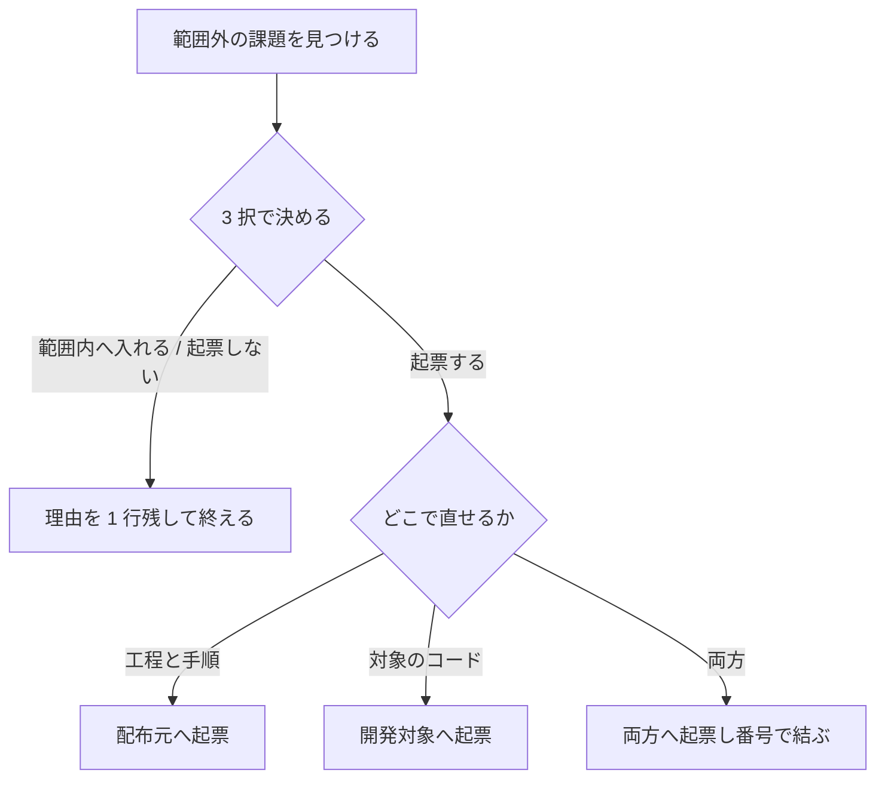

# 担当 D — 振り返りの記録先と、起票先の判断（#242 / #229）

- issue: [#242](https://github.com/devbasex/ai-plugins/issues/242) / [#229](https://github.com/devbasex/ai-plugins/issues/229)
- ブランチ: `feature/issue-242-229-retrospective`
- モード: `standard`

この文書は仕様と設計の両方を持つ。`standard` のため設計は独立したファイルにせず、同じ
ファイルの別の節として置く（`design` の規約）。

## 用語

| 語 | この文書での意味 |
| --- | --- |
| 配布元のリポジトリ | NDF の Skill の実体を持つリポジトリ。現在は `devbasex/ai-plugins` |
| 開発対象のリポジトリ | NDF を使って開発している側のリポジトリ。`gh repo view` が返すもの |
| 記録 | `retrospective` が残す振り返りの本体（何が起きたか / 次に変えること / 途中で起票した課題） |
| 起票先 | `gh issue create` が issue を作るリポジトリ |
| 判断表 | 課題の性質から起票先を決める表 |
| まとまり | 1 度の配布でまとめて進める複数の課題（並行開発バッチ） |
| 束 | 1 つの `tests/` ディレクトリにまとまったテストの集まり |

## 何を解決するか

| 課題 | 現在の状態 |
| --- | --- |
| #242 | 振り返りの記録に Pull Request が 1 本要る。記録先のディレクトリは開発対象のリポジトリに無い |
| #229 | 起票先を決める記述がどちらの Skill にも無く、配布元で直す課題が開発対象のリポジトリへ残る |

**2 件は同じ 2 つの Skill の、隣り合う節に触れる。** どちらも「その変更で得たものを、どこへ
置くか」を扱う。片方だけを直すと、記録先は決まって起票先は決まらない状態になる。

## 現状（実測）

### 振り返りの記録のために Pull Request が 7 本作られている

`docs/development-history/` は 10 ファイルある。うち 01〜03 は `retrospective` が入る前の
記録で、04〜10 の 7 ファイルがこの工程の成果物である。

```console
$ for f in docs/development-history/*.md; do
>   echo "$f <- $(git log --diff-filter=A --format='%h %s' -- $f | tail -1)"
> done
docs/development-history/04-2026-08-31.md <- 23a748b Docs: issue #175 の振り返りを開発履歴へ残す (#175)
docs/development-history/05-2026-08-31.md <- d8e7861 Docs: 並行開発バッチ 01 の振り返りを開発履歴へ残す (#178 #33 #37 #81)
docs/development-history/06-2026-09-01.md <- 6417eb6 Docs: バッチ 02 のリリース後テストと振り返りを記録する
docs/development-history/07-2026-09-01.md <- cf357b7 Docs: issue #161 の振り返りを記録する
docs/development-history/08-2026-09-01.md <- 167e72e Docs: issue #202 のリリース後テストと振り返りを記録する
docs/development-history/09-2026-09-02.md <- 6ca38f4 Docs: 並行開発バッチ 03 の振り返りを残す
docs/development-history/10-2026-09-02.md <- d8dc831 Docs: 並行開発バッチ 04 の振り返りを残す
```

7 ファイルはいずれも、記録のためだけに切ったブランチから入っている。

| ファイル | Pull Request | ブランチ |
| --- | --- | --- |
| 04 | #179 | `docs/retrospective-issue-175` |
| 05 | #189 | `docs/retrospective-batch-01` |
| 06 | #210 | `docs/batch-02-retrospective` |
| 07 | #222 | `docs/retrospective-161` |
| 08 | #225 | `docs/issue-202-retrospective` |
| 09 | #262 | `docs/retrospective-batch-03` |
| 10 | #278 | `docs/retrospective-batch-04` |

issue #242 の本文は「振り返りだけを載せたコミットが 4 件」としている。**その後に 3 件増え、
Pull Request の単位では 7 本である。** 記録以外のファイルを同じコミットに含むものが 3 件
あるが（`AGENTS.md` 1 ファイル、直前のまとまりの記録の移動 5 ファイルなど）、どの
Pull Request も記録を出すために作られている。

### 記録先のディレクトリは開発対象のリポジトリに無い

`docs/development-history/` と連番の規約はこのリポジトリだけの取り決めで、`AGENTS.md` の
ドキュメント表が説明している（`AGENTS.md:292`）。開発対象のリポジトリで振り返りを行うと、
現行の手順はディレクトリと連番の規約をそこへ 1 つ足すことを求める。

### 起票先を決める記述がどちらの Skill にも無い

```console
$ grep -nE "リポジトリ|起票先|ai-plugins" plugins/ndf/skills/out-of-scope/SKILL.md
（該当なし）
$ grep -nE "リポジトリ|起票先|ai-plugins" plugins/ndf/skills/retrospective/SKILL.md
（該当なし）
```

`retrospective` の落とし先の表（`SKILL.md:80-84`）は `Skill の手順の変更` を挙げている。
**その Skill の実体がどのリポジトリにあるかは、表にも本文にも無い。**

### 閉じた issue にもコメントは投稿できる

GitHub は issue が閉じていてもコメントを受け付ける。拒むのは locked のときだけである。
このリポジトリに実例がある。

```console
$ gh api /repos/devbasex/ai-plugins/issues/161 --jq '{closed_at,comments}'
{"closed_at":"2026-09-01T16:42:10Z","comments":4}
$ gh api /repos/devbasex/ai-plugins/issues/161/comments \
>   --jq '.[] | {created_at, body: (.body[0:20])}'
{"body":"## 進行の記録（2026-09-01","created_at":"2026-09-01T16:27:41Z"}
{"body":"## リリース後テスト\n\n対象の版: v9","created_at":"2026-09-01T16:39:45Z"}
{"body":"## 完了\n\n| 工程 | 結果 |\n","created_at":"2026-09-01T16:42:36Z"}
{"body":"## リリース後テスト（保留分）\n\n| 受","created_at":"2026-09-01T16:44:26Z"}
```

#161 は閉じた 26 秒後と 2 分 16 秒後にコメントを受け付けている。**この issue には進行の記録・
リリース後テスト・完了報告がすでにコメントとして残っている。** 振り返りだけがファイルへ
分かれている。

REST の経路で読めるため、GraphQL の利用上限に達している状態でも同じ事実を確かめられる。

### 記録の分量はコメントの上限に収まる

まとまりの記録で最も長いものは 8543 バイト（`10-2026-09-02.md`、128 行）である。GitHub の
コメント本文の上限は 65536 文字で、8 倍の余裕がある。

### 配布元のリポジトリは取得元の clone から読める

```console
$ git -C ~/.claude/plugins/marketplaces/ai-plugins config --get remote.origin.url
https://github.com/devbasex/ai-plugins.git
$ git -C ~/.codex/.tmp/marketplaces/ai-plugins config --get remote.origin.url
https://github.com/devbasex/ai-plugins.git
```

**版ごとの配置（`~/.claude/plugins/cache/<取得元>/ndf/<版>/`）は git の作業ツリーではない。**

```console
$ find ~/.claude/plugins/cache/ai-plugins -maxdepth 3 -name .git
（出力なし）
```

### 消えたブランチからでも、マージのコミットから Pull Request を引ける

`retrospective` は `merged` の後に来るため、ブランチも作業ツリーも残っていない。コミットから
引く経路を実測した。1 回の応答で 0.5 秒である。

```console
$ git ls-remote --heads origin release/v9.7.0 | wc -l
0
$ gh api "/repos/devbasex/ai-plugins/commits/$(git rev-parse origin/main)/pulls" \
    --jq '.[] | "#\(.number) \(.base.ref) <- \(.head.ref)"'
#264 develop <- release/v9.7.0
```

**2 件以上返ることがある。** そのコミットを含む未マージの枝の Pull Request も返るためである。
`origin/develop` の先頭では #278（マージ済み）と #290（未マージ）の 2 件が返った。`merged_at`
を持つものへ絞ると 1 件になり、その `merge_commit_sha` が渡したコミットと一致する。

## 受け入れ条件

### 振り返りの記録先（#242）

1. `retrospective` の「記録を残す」が、`docs/development-history/` へのファイルの新規作成を
   求めていない
2. 記録の投稿先を決める規則があり、3 つの状況（起点が 1 件の issue / 起点が複数の issue /
   起点の issue を持たない変更）をすべて網羅する
3. 投稿の手順が、実行できるコマンドとして載っている（`gh issue comment` と `gh pr comment`）
4. 投稿した後、対象の issue の本文末尾へ `振り返り: <URL>` の 1 行を足す手順がある
5. 記録に書く内容の雛形（何が起きたか / 次に変えること / 途中で起票した課題）が残っている
6. `docs/development-history/` の既存 10 ファイルは、この変更で削除も移動もされない
7. `AGENTS.md` のドキュメント表の該当行が、既存の記録の範囲と以降の記録先を示す
8. Pull Request へ投稿する 2 つの場合に、**番号を特定する手順が載っている**。ブランチが消えた
   後でも使える経路であり（`commits/{sha}/pulls`）、`merged_at` を持つものへ絞る。1 件に
   決まらないときは推測で投稿せず、番号を利用者に聞く
9. `python3 scripts/check-markdown-links.py --root .` が終了コード 0 で終わる

### 起票先の判断（#229）

10. 判断表が `out-of-scope` にあり、3 つの分類（工程と Skill の手順そのもの / 開発対象の
    コード・データ・設定・運用 / 両方）と、それぞれの起票先を持つ
11. 判断表はこのリポジトリの中で 1 か所にしかない。`retrospective` は参照だけを持つ
12. `retrospective` の落とし先の表の直後に、判断表への参照が 1 行ある
13. `out-of-scope` の手順に「起票先を決める」の段があり、「3 択で決める」の直後に来る
14. 重複の確認と起票が、決めた起票先に対して行われる（`gh` の呼び出しに `--repo` が付く）
15. 起票先のリポジトリの決め方が 3 段（環境変数 / 取得元の clone / 利用者に聞く）で書かれ、
    3 段目に達したときは推測で起票せずに止まる
16. 起票の前に同意を取る提示へ、起票先が含まれる
17. 両方にまたがる課題で、双方の番号が互いから辿れる手順がある
18. `uv run --with pytest pytest scripts/tests plugins/ndf -q` が通る

## 設計

### 構成要素

| 要素 | 責務 |
| --- | --- |
| `retrospective/SKILL.md` の「記録を残す」 | 投稿先を決め、その番号を特定し、コメントとして投稿し、本文へ 1 行を足す |
| `retrospective/SKILL.md` の落とし先の表の直後 | 判断表への参照 1 行 |
| `out-of-scope/SKILL.md` の「起票先を決める」 | 判断表を引き、起票先のリポジトリを解決する |
| `out-of-scope/references/issue-target.md` | 判断表と、リポジトリの解決の 3 段 |
| `out-of-scope/tests/` | 判断表が 1 か所にあること、手順の並びを固定する |
| `retrospective/tests/` | 記録先の記述と、参照の張り先を固定する |
| `AGENTS.md` のドキュメント表の 1 行 | 既存の記録の範囲と、以降の記録先を示す |

**参照ファイルを新しく作るのは `out-of-scope` の側だけである。** 判断表とリポジトリの解決の
手順を SKILL.md へ直接書くと、起票のたびに読む分量が増える。判断表は「起票する」を選んだ
ときだけ要る。

### 触る領域

| 領域 | 該当するか |
| --- | --- |
| 永続データを持つ、またはスキーマを変える | 該当しない。保存する形を持たない |
| 呼び出される約束（API・イベント・コマンド）を変える | 該当しない。手順書の記述だけで、実行するのは `gh` の既存のコマンドである |
| 画面を追加・変更する | 該当しない |

該当する領域が無いため、「データ構造」と「入出力の契約」の節は作らない。

### 処理の流れ



### 記録の投稿先

| 起点 | 記録の本体を置く場所 | 辿る経路 |
| --- | --- | --- |
| 1 件の issue | その issue へのコメント | その issue の本文末尾へ 1 行 |
| 複数の issue（まとまり） | そのまとまりを配布した Pull Request へのコメント | 対象のすべての issue の本文末尾へ 1 行 |
| 起点の issue を持たない | その変更の Pull Request へのコメント | 追加の 1 行は要らない |

**本体は 1 件だけ置く。** 同じ内容を複数の場所へ投稿すると、後から直したときに片方が古くなる。

### 投稿先の番号を特定する

起点が 1 件の issue の場合、番号はその issue のものがそのまま使える。**残る 2 つの場合だけ、
Pull Request の番号を引く。** `retrospective` は `merged` の後に来るため、ブランチも作業
ツリーも残っていない（決定 1）。番号はコミットから引く。

| 場合 | 起点にするコミット | 引き方 |
| --- | --- | --- |
| 起点の issue を持たない変更 | その変更をマージした先（`base_branch`）の先頭 | `gh api /repos/{owner}/{repo}/commits/{sha}/pulls` |
| まとまり | そのまとまりを配布した先（`main`）の先頭 | 同上 |

**返った中から `merged_at` を持つものだけを採る。** そのコミットを含む未マージの枝の
Pull Request も返るため、絞らないと 2 件以上になる（実測）。絞った結果が 1 件でないときは
**推測で投稿せず、番号を利用者に聞いて止まる。** 起票先の解決の段 3 と同じ扱いである。

## 決定の記録

### 決定 1: 振り返りの記録先を、起点の issue へのコメント 1 件にする

記録のためにブランチと Pull Request を作る費用が、記録の価値を上回っている。実測では 7 本の
Pull Request がこの用途だけで作られた。`merged` がその変更の作業ツリーとブランチを消した後の
工程であるため、ファイルとして書くなら `worktree` からやり直すことになる。

ファイルとして残す案は、通読できる形を保つ。通読の経路は版ごとの説明（`CLAUDE.md` の段落）と
`docs/specifications/` に任せ、振り返り自体は変更に閉じた記録として扱う。

### 決定 2: 起点の issue を持たない変更では、その変更の Pull Request へ投稿する

配布と後片付けが終わった時点で確実に残っている場所は、その変更の Pull Request である。
記録を置く先が無いことを理由に工程を飛ばす経路を残さない。

作業メモやリリースノートへ書く案は、置き場所がリポジトリごとに違うため採らない。

### 決定 3: 記録の本体は 1 か所に置き、辿る経路は本文末尾の 1 行で作る

同じ本文を複数の場所へ投稿すると、直したときに片方が古くなる。本文末尾の
`振り返り: <URL>` は 1 行で、内容を持たないため古くならない。

各 issue へ全文を投稿する案は、まとまりの記録が 12 件へ複製されることになるため採らない。

### 決定 4: まとまりの振り返りは、配布した Pull Request へ 1 件だけ投稿する

まとまりは 1 度の配布を単位とし、その配布の Pull Request が全体を指す唯一の場所である。
バッチ 04 は 12 件を 1 本の記録にまとめており、この形はコメント 1 件でそのまま表せる。
対象の issue には本文末尾の 1 行だけを足す（12 件なら 12 行、いずれも同じ URL を指す）。

代表の issue を 1 件選ぶ案は、選び方の基準を新しく作ることになるため採らない。

### 決定 5: `docs/development-history/` の既存 10 ファイルは残す

過去の記録の URL とリンクは、`AGENTS.md` と各記録の相互参照から張られている。移すと参照が
切れ、得られるものは規約の統一だけである。新しい記録を足さないことと、既存を消すことは別の
判断である。

コメントへ移す案は、10 ファイル分の投稿先を後から決め直すことになるため採らない。

### 決定 6: このリポジトリ自身の振り返りもコメントへ移す

規則を 1 つにする。このリポジトリを例外にすると、`retrospective` は 2 つの記録先を持ち、
どちらを使うかの判断を新しく足すことになる。**費用の内訳はこのリポジトリでも同じで、実測の
Pull Request 7 本はすべてここで作られたものである。**

このリポジトリだけファイルを続ける案は、通読の要求を満たすが、上の 2 つを引き受ける。

### 決定 7: 判断表は `out-of-scope` に置き、`retrospective` は参照だけを持つ

`gh issue create` を実行するのは `out-of-scope` だけで、`retrospective` は取りこぼしを見つけた
ときにその Skill を呼ぶ側である。判定の基準を持つ場所を 1 つにする考え方は
`development-workflow` のモード判定と同じである。

`retrospective` の落とし先の表へ起票先の列を足す案は、同じ分類が 2 か所に並ぶため採らない。

### 決定 8: 起票先を決める段は、3 択の直後に置く

起票先が要るのは「起票する」を選んだときだけである。3 択より前に置くと、起票しない課題にも
リポジトリの解決を求めることになる。重複の確認（`gh issue list`）も起票先のリポジトリに対して
行うため、その前に決まっている必要がある。

手順の番号は、現行の 3 以降を 1 つずつ繰り下げる。

### 決定 9: 起票先のリポジトリは 3 段で解決し、どの段で決まっても提示に含める

| 段 | 何を見るか | 決まらないとき |
| --- | --- | --- |
| 1 | 環境変数 `NDF_SKILL_REPO`（`<owner>/<名前>`） | 段 2 へ |
| 2 | 取得元の clone の `remote.origin.url` | 段 3 へ |
| 3 | 利用者に聞く | 推測で `--repo` を渡さず止まる |

段 2 の位置はランタイムで違う。Claude Code は `~/.claude/plugins/marketplaces/<取得元>`、
Codex は `~/.codex/.tmp/marketplaces/<取得元>`、Kiro は clone した作業ディレクトリである。
**版ごとの配置は git の作業ツリーではないため、そちらからは読めない**（実測は「現状」の節）。

`devbasex/ai-plugins` を定数として書く案は、取得元を分けた利用者と fork した利用者で外れる。
段 1 と段 2 で決まっても提示に含めるのは、外れた場合に起票の前に気づけるようにするためである。

### 決定 10: 両方にまたがる課題は、配布元を先に起票する

配布元の番号が先に決まれば、開発対象の側の本文へその番号を書ける。逆順にすると、どちらの
本文にも相手の番号が無い状態が一度できる。配布元の側へは、開発対象の番号をコメントで足す。

同時に 2 件作って後から両方を編集する案は、編集を忘れると相互の参照が片方だけ残るため
採らない。

## テスト設計

置き場所は `plugins/ndf/skills/out-of-scope/tests/` と
`plugins/ndf/skills/retrospective/tests/` である。**`scripts/` は担当 D の範囲外のため、
検査は Skill の束として置く。** 補助を共有する場合は、`conftest.py` ではなく固有名の
モジュールへ置く（束を同時に実行したときのモジュール名の衝突を避けるため）。

外部コマンドを使わないため、根の `conftest.py` の `REQUIRED_COMMANDS` への追加は要らない。

| 受け入れ条件 | 何で確かめるか |
| --- | --- |
| 1 | `retrospective/SKILL.md` に文字列 `docs/development-history/` が現れないことを見るテスト |
| 2 | 投稿先の表の 1 列目が 3 つの状況を網羅することを見るテスト。表を読み取れないことも失敗とする |
| 3 | `retrospective/SKILL.md` に `gh issue comment` と `gh pr comment` の呼び出しがあることを見るテスト |
| 4 | `振り返り: ` で始まる 1 行の書式が SKILL.md にあることを見るテスト |
| 5 | 雛形のコードブロックに 3 つの見出しが残ることを見るテスト |
| 6 | Pull Request の差分に `docs/development-history/` の削除・改名が無いこと（レビューで読む） |
| 7 | `AGENTS.md` のドキュメント表の該当行を読む（レビューで読む） |
| 8 | `retrospective/SKILL.md` に `commits/` と `/pulls` を含む呼び出しがあり、その近傍に `merged_at` の語があることを見るテスト。1 件に決まらないときに止まることはレビューで読む |
| 9 | `python3 scripts/check-markdown-links.py --root .` |
| 10 | 判断表の 1 列目が 3 種、2 列目が起票先であることを見るテスト |
| 11 | 判断表の 1 列目の値が `retrospective/SKILL.md` に現れないことを見るテスト |
| 12 | 落とし先の表の直後の行が `issue-target.md` への相対リンクを持ち、その先が実在することを見るテスト |
| 13 | `out-of-scope/SKILL.md` の手順の見出しの並びを固定するテスト |
| 14 | 判断表の参照の中の `gh issue list` と `gh issue create` に `--repo` が付くことを見るテスト |
| 15 | 3 段の表の行数と 1 列目を固定するテスト。段 3 の行に「止まる」ことが書かれているかはレビューで読む |
| 16 | 同意を取る提示の項目に「起票先」が含まれることを見るテスト |
| 17 | 両方にまたがる場合の手順の順序をレビューで読む |
| 18 | `uv run --with pytest pytest scripts/tests plugins/ndf -q` |

**表を読み取れないこと自体を失敗として扱う。** 素通りさせると、表の書き方を変えるだけで
これらの検査を無効にできる（`development-workflow` の `test_stage_values.py` と同じ扱い）。

### 機械では確かめられないもの

| 項目 | 確かめ方 |
| --- | --- |
| 記録の内容がその変更を説明しているか | レビューで読む |
| 起票先の判断が課題の性質に合っているか | 起票の前の提示で利用者が見る |
| 段 2 の解決が 3 ランタイムで動くか | このバッチのリリース後テストで実機で確かめる |

## 担当 C へ引き渡す

| 項目 | 現在の状態 |
| --- | --- |
| `development-workflow` に振り返りの記録先の記述があるか | **無い。** `docs/development-history` の検索は 0 件（`grep -rn "development-history" plugins/ndf/skills/development-workflow/`）。#242 の影響範囲の 1 行はこの確認で閉じる |
| `development-workflow/SKILL.md` の「範囲外の課題を見つけたとき」の節 | 3 択の要約がある（`SKILL.md:161-178`）。起票先の 1 行を足すかは担当 C が決める。担当 D は判断表を `out-of-scope` にだけ置く |
| `merged` が閉じる issue の範囲 | 起票先が配布元になった課題は開発対象のリポジトリの `merged` からは閉じられない。扱いは担当 C の範囲 |

**3 行目は担当 C が受け取った。** `merged` が閉じる先を閉じる語の書き方から決める設計が
[03-issue-221-266.md](03-issue-221-266.md) の受け入れ条件「#229 から引き継ぐ」に入っている。
決定 10 が配布元と開発対象の両方へ起票するため、閉じる先も 2 つになる。**担当 D はこの経路を
実装しない。**

## 触らないもの

`development-workflow/` / `release/` / `scripts/` / `AGENTS.md` のドキュメント表以外の節。
`AGENTS.md:196` の `docs/development-history/` は版数の走査の対象から外す説明で、
「版の付け方と開発版の配布」の節にある。**この行は担当 B の範囲であり、記録先の変更でも
書き換えない**（走査から外す扱いは変わらないため）。

## 未確認のまま残ること

| 項目 | 内容 |
| --- | --- |
| locked な issue への投稿 | GitHub は locked の issue でコメントを拒む。このリポジトリに locked の issue が無いため実測していない。段 3 と同じく、失敗したら止まる形にする |
| 本文末尾へ 1 行を足す操作を 12 件へ回した実績 | `gh issue edit --body` は本文を全文で書き直す。件数が多いときの取り違えは実測していない |
| 段 2 の Kiro の位置 | clone した作業ディレクトリの origin を読む。Claude Code と Codex は実測済みで、Kiro はこのバッチのリリース後テストで確かめる |

## 範囲外として見つけたこと

| 見つけたもの | 判断 | 理由 |
| --- | --- | --- |
| 配布元のリポジトリの解決が、`development-workflow/references/projects-tracking.md` の `$SCRIPTS` の解決と同じ手がかり（取得元の位置）を使う | 起票しない | [#193](https://github.com/devbasex/ai-plugins/issues/193)（担当 F）が共通の置き場所を作る。そこへ寄せられるかは #193 のマージ後に見る |
| `quality-gates` / `fix` / `pr-review` / `tdd-cycle` / `refactoring` / `problem-solving` の `out-of-scope` の案内 1 行に、起票先の言及が無い | 起票済み（#283） | 6 Skill は担当 D の範囲外である。参照だけで足りるかを実運用で見た上で、足りなければ 1 行ずつ足す |
| `docs/development-history/` の 01〜03 は `retrospective` の成果物ではない（初期コミットと plan の振り分けで入った） | 起票しない | ドキュメント表の 1 行で範囲を示せば読み分けられる。ファイルを分ける価値が現時点で無い |
