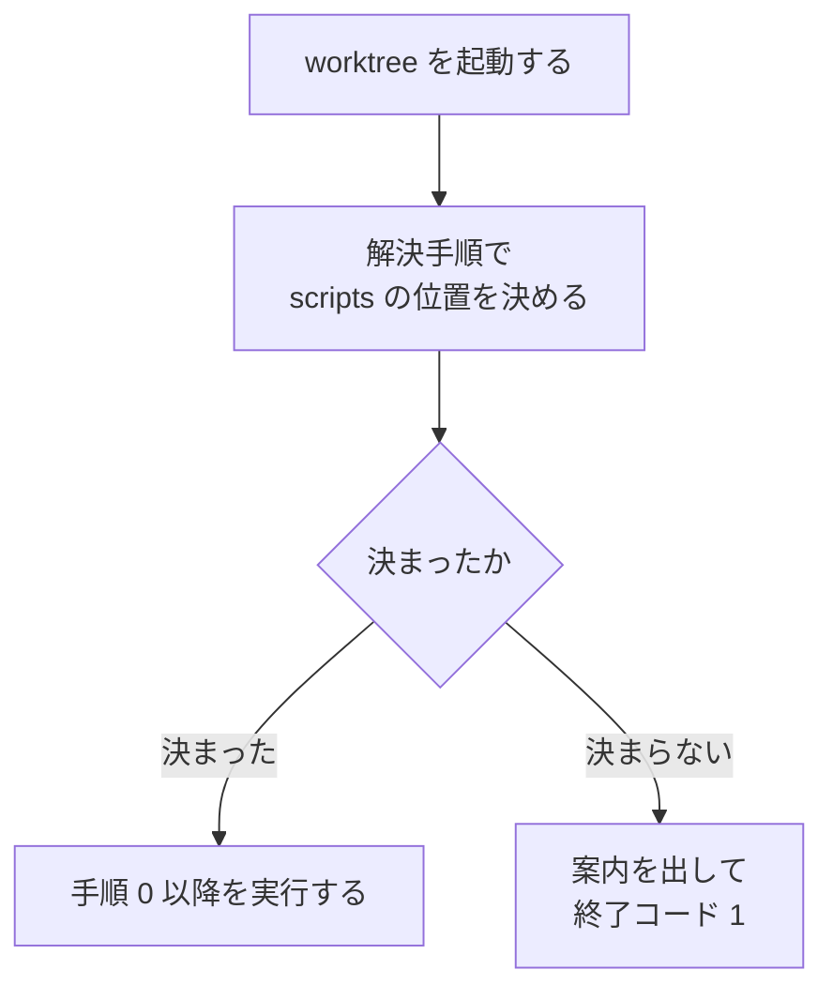

# 担当 F — `worktree` の手順が読むスクリプトの場所を決める（#193）

- issue: https://github.com/devbasex/ai-plugins/issues/193
- ブランチ: `fix/issue-193-ndf-scripts`
- モード: `standard`

`standard` のため、この文書は受け入れ条件・設計・決定の記録・テスト設計を持つ。実装は
設計 Pull Request のマージ後に行う。

## 用語

| 語 | この文書での意味 |
| --- | --- |
| 配布物 | プラグインとして配布先ランタイムへ配られたファイル一式 |
| プラグインルート | 配布物の根。`skills/` と `scripts/` を直下に持つ |
| 解決 | 実行の時点で、プラグインルート配下の `scripts/` の絶対パスを決めること |
| 解決手順 | 解決の方法を書いた bash。`development-workflow/references/projects-tracking.md` の「`$SCRIPTS` を決める」節が持つ |
| 配布先ランタイム | Skill を配る先。Claude Code / Codex / Kiro CLI |
| 呼び出し側 | 手順書を読んでコマンドを実行する人または AI |
| 手順書 | `worktree` の `SKILL.md` と `references/` の 4 ファイル |

**「解決手順」と「手順書」を分けて書く。** 前者は 1 か所にある bash で、後者はそれを読む側の
文書である。

## 何を解決するか

`worktree` の手順書は、プラグイン配下のスクリプトを `$NDF_SCRIPTS` 経由で呼ぶよう書いている。
この変数を代入する箇所は、リポジトリにも実行環境にも無い。**書かれたとおりに実行すると
コマンドが動かない。**

同じ役割を果たす解決手順は、`development-workflow` の参照に既にある。`design` /
`requirements-design` / `worktree` の 3 つがそこを指して `$SCRIPTS` を決めている。

## 現状（実測）

### 代入は 1 件も無い

```console
$ grep -rn 'NDF_SCRIPTS=' plugins/ scripts/
（出力なし）

$ env | grep '^NDF'
NDF_CODEX_SLACK_NOTIFY=true
```

### 実行すると 2 通りに失敗する

```console
$ bash -c 'set -u; bash "$NDF_SCRIPTS/worktree-setup.sh" init'
bash: line 1: NDF_SCRIPTS: unbound variable

$ bash -c 'bash "$NDF_SCRIPTS/worktree-setup.sh" init'
bash: /worktree-setup.sh: No such file or directory
```

### 対象は 4 ファイル・20 行である

issue の本文が挙げているのは 6 行で、`test-execution.md` は挙がっていない。

| ファイル | 出現行数 |
| --- | --- |
| `plugins/ndf/skills/worktree/SKILL.md` | 6（うち 1 行は散文） |
| `plugins/ndf/skills/worktree/references/test-execution.md` | 7 |
| `plugins/ndf/skills/worktree/references/local-environment.md` | 4 |
| `plugins/ndf/skills/worktree/references/declaration.md` | 3 |

`docs/development-history/` と `issues/` にも語は残るが、そちらは当時の記録である。

### 解決手順は既にあり、テストも付いている

`development-workflow/references/projects-tracking.md` の「`$SCRIPTS` を決める」節が、候補を
順に試して最初に当たったものを絶対パスで採る。`development-workflow/tests/
test_projects_scripts_lookup.py` が**その節の bash を読み出して実行する**ため、写しではなく
配布される手順そのものが検証されている。

```console
$ grep -rln '### `\$SCRIPTS` を決める' plugins/ndf/skills/
plugins/ndf/skills/development-workflow/references/projects-tracking.md
plugins/ndf/skills/development-workflow/tests/test_projects_scripts_lookup.py
```

`development-workflow` は 3 ランタイムすべての manifest に載っているため、`worktree` から
この参照を指しても、配布先で参照が欠けることはない。

```console
$ grep -c 'development-workflow' plugins/ndf/manifests/claude-skills.txt \
    plugins/ndf/manifests/codex-skills.txt plugins/ndf/manifests/kiro-skills.txt
plugins/ndf/manifests/claude-skills.txt:1
plugins/ndf/manifests/codex-skills.txt:1
plugins/ndf/manifests/kiro-skills.txt:1
```

### 3 ランタイムで解決される先

手元の導入物で確かめた値である。Kiro CLI はこの機械へ導入されていないため、実測できたのは
2 ランタイムと、リポジトリの中から実行した場合の 3 通りになる。

| 経路 | 手元での値 | 確かめ方 |
| --- | --- | --- |
| Claude Code | `~/.claude/plugins/cache/ai-plugins/ndf/9.7.0/scripts` | `${CLAUDE_PLUGIN_ROOT}` が絶対パスへ置き換わる |
| Codex（マーケットプレイスの控え） | `~/.codex/.tmp/marketplaces/ai-plugins/plugins/ndf/scripts` | `ls` で存在を確認。中身は `main` の 9.7.0 |
| Codex（導入した実体） | `~/.codex/plugins/cache/ai-plugins/ndf/9.7.0/scripts` | 解決手順の候補には入っていない |
| Kiro CLI | 未確認（`~/.kiro/skills` と `.kiro/skills` のどちらも無い） | 導入されていない |
| リポジトリの中 | `plugins/ndf/scripts` | 候補の最後に置かれている |

```console
$ ls -d ~/.claude/plugins/cache/ai-plugins/ndf/9.7.0/scripts \
       ~/.codex/.tmp/marketplaces/ai-plugins/plugins/ndf/scripts
/home/ubuntu/.claude/plugins/cache/ai-plugins/ndf/9.7.0/scripts
/home/ubuntu/.codex/.tmp/marketplaces/ai-plugins/plugins/ndf/scripts

$ ls ~/.kiro/skills /work/ai-plugins/.kiro/skills
ls: cannot access '/home/ubuntu/.kiro/skills': No such file or directory
ls: cannot access '/work/ai-plugins/.kiro/skills': No such file or directory
```

### 解決手順をこのリポジトリで実行した結果

節の bash を取り出し、リポジトリの根で実行した。

```console
$ bash -c 'set -uo pipefail; source snippet.sh; echo "$SCRIPTS"'
/home/ubuntu/.codex/.tmp/marketplaces/ai-plugins/plugins/ndf/scripts
```

Codex を導入した機械では、リポジトリの `plugins/ndf/scripts` より Codex の控えが先に当たる。
候補の並びは配布物を使う利用者に合わせてあり、`plugins/ndf/scripts` は最後に置かれている。
**この並びの見直しは解決手順の側の判断であり、担当 C の持ち物である**（#281 として
起票済み）。

## 受け入れ条件

### 参照の解決

- [ ] 条件 1: `plugins/ndf/skills/worktree/` 配下に `NDF_SCRIPTS` の出現が 0 件である
- [ ] 条件 2: 手順書の bash と console のブロックが使う変数は、**同じ文書の中で代入されている
      か、その文書の「この文書が受け取る値」の表に載っている**。どちらでもない変数があれば失敗する。
      **シェルの組み込み変数と特殊変数は使用から外す**（決定 7）
- [ ] 条件 3: 「`$SCRIPTS` を決める」の見出しは `plugins/ndf/skills/` 配下に 1 つだけである
      （手順が 2 か所へ増えていない）
- [ ] 条件 4: 3 ランタイムの配置を作って解決手順を実行すると、`worktree-setup.sh` を持つ
      ディレクトリの絶対パスが返る
- [ ] 条件 5: 解決できないとき、`worktree` の手順は終了コード 1 と案内で止まる。盤面への記録
      （`projects-sync.sh`）の呼び出しだけは、これまでどおり飛ばす

- [ ] 条件 6: 4 文書すべての「この文書が受け取る値」の表の直後に、続けて実行するコマンドを
      1 つの bash ブロックへまとめる推奨が 1 行ある

条件 2 が「手順をそのまま実行して動く」を機械で確かめる形にあたる。**未定義の変数を含む
コマンドが手順書に残っていれば、テストが落ちる。**

### 全体

- [ ] `uv run --with pytest pytest scripts/tests plugins/ndf -q` が通る
- [ ] `python3 scripts/check-markdown-links.py` が終了コード 0 で終わる
- [ ] `bash scripts/validate-runtime-plugins.sh` が終了コード 0 で終わる
- [ ] `python3 scripts/check-doc-staleness.py --root .` が終了コード 0 で終わる

## 対象範囲

### 含む

| 対象 | 内容 |
| --- | --- |
| `worktree/SKILL.md` | `$NDF_SCRIPTS` の 6 行。手順 0 に解決の参照と停止条件を置く |
| `worktree/references/declaration.md` | `$NDF_SCRIPTS` の 3 行。受け取る値の表を足す |
| `worktree/references/local-environment.md` | `$NDF_SCRIPTS` の 4 行。受け取る値の表を足す |
| `worktree/references/test-execution.md` | `$NDF_SCRIPTS` の 7 行。受け取る値の表を足す |
| `worktree/tests/test_scripts_reference.py` | 新設。条件 1〜5 を検査する |

### 含まない

| 対象外 | 理由 |
| --- | --- |
| `development-workflow/references/projects-tracking.md` | 担当 C の持ち物。解決手順は指すだけで書き換えない |
| `worktree/` の `gemini` の記述 | 担当 A の持ち物（#214） |
| `merged/` | 担当 C の持ち物 |
| `scripts/` と説明文書 | 担当 B が説明文書を独占する。検査の追加は Skill 側のテストで足りる |
| 候補の並びの見直し | 解決手順の側の判断。#281 として起票済み |
| `docs/development-history/` と `issues/` の `NDF_SCRIPTS` | 当時の記録であり、現行の手順を指していない |

## 設計

### 構成要素

| 要素 | 責務 |
| --- | --- |
| 「`$SCRIPTS` を決める」節（既存） | 解決手順の本体。3 ランタイムとリポジトリの配置を順に試す |
| `worktree/SKILL.md` の手順 0 | 解決手順を指し、決まらなければ案内を出して止める |
| 各 reference の「この文書が受け取る値」 | 文書の外から与えられる変数の一覧。読み手と検査の両方が使う |
| `worktree/tests/test_scripts_reference.py` | 手順書と解決手順の対応を機械で突き合わせる |

### 触る領域: 呼び出される約束

`worktree` の手順書が呼び出し側へ求める約束を、次の 3 点で確定させる。

| 項目 | 決めた内容 |
| --- | --- |
| 変数名 | `$SCRIPTS`。既にある解決手順が置く名前をそのまま使う |
| 決め方 | `development-workflow/references/projects-tracking.md` の「`$SCRIPTS` を決める」 |
| 決まらないとき | 案内を出して終了コード 1 で止まる |

手順 0 に置く記述は次の形になる。

```bash
# 「$SCRIPTS を決める」の手順でパスを決めてから実行する。
[ -n "${SCRIPTS:-}" ] || { echo "NDF の scripts/ を解決できない" >&2; exit 1; }
bash "$SCRIPTS/worktree-setup.sh" init
```

`${SCRIPTS:-}` と書くのは、解決手順を実行していないシェルで `set -u` の下でも、未定義変数の
エラーではなくこちらの案内が出るようにするためである。

### シェルをまたぐときの扱い

**コマンドの実行ごとにシェルが分かれる場合、`$SCRIPTS` の値は持ち越されない。** 手順書の
各文書の冒頭に、値の出所と決め直しの案内を 1 行ずつ置く。

```markdown
## この文書が受け取る値

| 変数 | 値 | 決め方 |
| --- | --- | --- |
| `$SCRIPTS` | プラグインの `scripts/` の絶対パス | SKILL.md の手順 0。シェルが変わったら決め直す |
| `$WT` | 対象の作業ツリーの絶対パス | 呼び出し側が決める |
```

**決め直しの回数は、まとめ方で減らせる。** 続けて実行するコマンドを 1 つの bash ブロックへ
入れれば、`$SCRIPTS` を決めるのはブロックの先頭の 1 回で済む。同じ表の直後に、この推奨を
1 行と例で置く。

```bash
# 続けて実行するときは 1 つのブロックにまとめる（$SCRIPTS の決め直しが 1 回で済む）
SCRIPTS=…                                   # SKILL.md の手順 0
bash "$SCRIPTS/worktree-setup.sh" init
bash "$SCRIPTS/worktree-setup.sh" status
```

**推奨であって、必須にはしない。** 1 コマンドずつ実行しても、決め直せば手順は成立する。
必須にすると、実行を分けたい場面（出力を見てから次を決める）で手順の側が邪魔になる。

手順書ごとに宣言する変数は次のとおりである。いずれも現状の bash が文書の外から受け取って
いるもので、実測で洗い出した。

| 文書 | 宣言する変数 |
| --- | --- |
| `SKILL.md` | `$SCRIPTS` |
| `declaration.md` | `$SCRIPTS` / `$main_dir` |
| `local-environment.md` | `$SCRIPTS` / `$APP_SERVICE` / `$SRC_TARGET` |
| `test-execution.md` | `$SCRIPTS` / `$WT` |

**代入の位置は問わない。** `local-environment.md` の `$WT` のように、使う行より後ろで
代入される変数がある。検査は文書 1 つを 1 つの範囲として数え、代入が同じ文書にあれば足りる
ものとする。

### 処理の流れ



## 決定の記録

### 決定 1: 解決手順は 1 本に保ち、既にある節をそのまま指す

`design` / `requirements-design` / `worktree` の 3 つが、同じ節を指して `$SCRIPTS` を決めて
いる。`worktree` の残りの箇所も同じ指し方に揃えれば、手順は 1 本のままで済む。手順が複数
あると、片方だけが直った状態を検知できない。

各 SKILL.md へ展開する案は採らない。同じ bash が 5 か所へ増え、`development-workflow` が
「判定基準を持つのはこの Skill だけ」としているのと同じ理由で、正がどれか決まらなくなる。

### 決定 2: 共通の置き場所は新しく作らない

解決手順を `worktree/references/` へ写す案と、Skill をまたぐ共通のディレクトリを新設する案の
どちらも採らない。前者は手順を 2 本にする。後者は、配布が
`plugins/ndf/manifests/*-skills.txt` の Skill 単位で決まるため、Skill ではないディレクトリを
3 ランタイムへ配る仕組みから作ることになる。

`development-workflow` は 3 ランタイムすべてに配られ、`worktree` からの相対パスは Kiro CLI の
symlink 経由でも届く（`cross-refactoring` が同じ形で隣の Skill を参照している）。

**節の置き場所は動かさない。** 担当 C と突き合わせた結果である（後述）。

### 決定 3: 変数名は `$SCRIPTS` にする

`NDF_SCRIPTS` を実際に代入する案は採らない。解決手順が置く名前は `$SCRIPTS` であり、別名を
足すと同じ値に 2 つの名前ができる。名前を `NDF_SCRIPTS` へ変えるには解決手順とそのテストの
書き換えが要り、いずれも担当 C の領分にあたる。

`$SCRIPTS` は指す対象が読み手によって変わりうる名前のため、手順書ごとに「この文書が受け取る
値」の表で意味を与える（`markdown-writing` のルール 2）。

### 決定 4: 解決できないときは止める

盤面への記録は、決まらなければ飛ばす。`worktree` の手順 0 は作業ツリー運用の入口を作る操作
であり、飛ばすと以降の手順が土台のないまま進む。案内を出して終了コード 1 で止める。

`cross-refactoring` も、Skill のディレクトリを解決できないときに終了コード 1 で止めている。

### 決定 5: 文書の外から受け取る変数を表で宣言する

未定義変数の混入を機械で検知するには、「文書の中で代入されている変数」と「呼び出し側が
与える変数」を区別できる形が要る。表を置けば、読み手には値の出所が伝わり、テストには
許可の一覧として使える。

代入を各コードブロックへ書き足す案は採らない。`$WT` のように呼び出し側が決める値へ仮の値を
書くと、その値をそのまま実行される。

### 決定 6: 記録に残る `NDF_SCRIPTS` は書き換えない

`docs/development-history/` と `issues/` に残る語は、その時点の状態を書いた記録である。
検査の対象は `plugins/ndf/skills/worktree/` に限る。

### 決定 7: シェルの組み込み変数と特殊変数は使用から外す

`$?` のような変数は、文書の中で代入されることも、受け取る値の表へ載ることもない。外さないと、
**代入も宣言も無い使用として必ず失敗する**。外す範囲は実測で決める。

`worktree/` の 4 文書を走査すると、この種の変数は `$?` の 3 件だけだった。`plugins/ndf/skills/`
全体まで広げると 9 種になる。

| 変数 | `worktree/` の 4 文書 | `skills/` 全体 |
| --- | --- | --- |
| `$?` | 3 | 29 |
| `$HOME` | 0 | 14 |
| `$PWD` | 0 | 5 |
| `$!` | 0 | 5 |
| `$USER` | 0 | 4 |
| `$$` | 0 | 4 |
| `$@` | 0 | 2 |
| `$1` | 0 | 2 |
| `$EDITOR` | 0 | 1 |

外し方は 2 通りに分ける。**位置引数と特殊変数は名前の規則で外す。** `$` の直後が数字か
`? @ * # $ ! - _` の 1 文字である形を指し、いずれも変数名に使えない文字であるため、文書ごとの
宣言と取り違えない。**環境が与える変数は名前の一覧で外す。** 一覧は上の実測で出た 4 つ
（`$HOME` / `$PWD` / `$USER` / `$EDITOR`）に限る。

**一覧を実測より先へ広げない。** 検査の対象は `worktree/` の 4 文書であり、そこに出ていない
名前（`$SECONDS` など）を先回りで載せると、載せた理由をたどれない一覧になる。新しい名前が
文書へ入ったときは同じ走査で確かめてから足す。

## テスト設計

新設する `plugins/ndf/skills/worktree/tests/test_scripts_reference.py` が受け持つ。解決手順の
bash は `development-workflow` の参照から読み出す（写しを持たない）。

| 受け入れ条件 | 何で確かめるか |
| --- | --- |
| 条件 1（`NDF_SCRIPTS` が 0 件） | `worktree/` 配下の Markdown を走査し、出現数が 0 であることを検査する |
| 条件 2（未定義変数が無い） | 各文書の bash と console のブロックから変数の使用と代入を取り出し、使用のうち代入にも受け取る値の表にも無いものが 0 件であることを検査する。位置引数・特殊変数と、決定 7 の一覧にある環境の変数は使用から除く |
| 条件 2（組み込みを外す） | `$?` を含む bash のブロックを持つ一時ファイルを与え、失敗しないことを検査する。除外の一覧が決定 7 の 4 つと一致することも見る |
| 条件 2（表の形式） | 4 文書すべてに「この文書が受け取る値」の表があり、`$SCRIPTS` を含むことを検査する |
| 条件 3（手順が 1 本） | `plugins/ndf/skills/` 配下で「`$SCRIPTS` を決める」の見出しを持つ Markdown が 1 つだけであることを検査する |
| 条件 4（3 ランタイムで解決する） | `tmp_path` に Claude Code / Codex / Kiro CLI の配置を作り、解決手順を実行して `$SCRIPTS/worktree-setup.sh` が存在することを検査する |
| 条件 5（止まる） | SKILL.md の手順 0 から停止の行を取り出し、`SCRIPTS` が空のときに終了コード 1 と案内が出ることを検査する |
| 条件 5（盤面は飛ばす） | 解決手順の末尾が、決まらないときに空の値を残すことを検査する |
| 条件 6（まとめる推奨） | 4 文書それぞれで、受け取る値の表の直後の行が、1 つの bash ブロックへまとめる推奨であることを検査する。表を読み取れないことも失敗として扱う |
| 全体 | `uv run --with pytest pytest scripts/tests plugins/ndf -q` |
| 全体（参照の到達） | `python3 scripts/check-markdown-links.py` |

条件 4 の配置の作り方は `development-workflow/tests/test_projects_scripts_lookup.py` に
そろっている。同じ形で組み立て、確かめる対象を `worktree-setup.sh` にする。

**console のブロックも走査の対象へ入れる。** 手順書は実行例を console で書く箇所があり、
そこにも `$NDF_SCRIPTS` が含まれていた。

## 担当 C と突き合わせた結果

`development-workflow/references/projects-tracking.md` は担当 C（#221 / #266）の持ち物である。
次の 3 点を設計 Pull Request の時点で突き合わせ、**いずれも担当 F の前提のまま残ることを
確かめた**（`00-overview.md` の「「`$SCRIPTS` を決める」節は動かさない」）。

| 項目 | 担当 F の前提（突き合わせ済み） | 崩れたときの影響 |
| --- | --- | --- |
| 「`$SCRIPTS` を決める」節の位置と見出し | 現在のファイル・現在の見出しのまま残る | `worktree` の参照と条件 3 の検査が外れる |
| 解決手順が置く変数名 | `SCRIPTS` のまま | 条件 2 の許可一覧と手順書の記述を直す |
| 決まらないときの末尾の扱い | 空の値を残す（止めない） | `worktree` 側の停止の行を書き直す |

実装の途中でこの前提が変わり、担当 C が節を別のファイルへ移す場合は、`worktree` からの参照先と
検査の対象を移動先へ合わせる。**移動そのものは担当 C が行い、担当 F は参照の側だけを直す。**

## 完了条件

- [ ] 受け入れ条件 1〜6 を満たす
- [ ] 全体の検査 4 つが終了コード 0 で終わる
- [ ] `bash scripts/build-runtime-plugins.sh` を実行し、生成物を同じ Pull Request に載せる
- [ ] 突き合わせ済みの 3 項目が、実装の時点でも変わっていない
- [ ] 範囲外と判断した課題が issue になっている

## 範囲外として見つけたこと

| 見つけたこと | どこで | 判断 |
| --- | --- | --- |
| 解決手順が Codex の控えをリポジトリより先に採る。ai-plugins 自身を開発する機械では、手元の変更ではなく配布済みの版のスクリプトが動く（実測: `~/.codex/.tmp/marketplaces/ai-plugins/plugins/ndf/scripts`、中身は 9.7.0） | 「`$SCRIPTS` を決める」節の候補の並び | 起票済み（#281。担当 C の領分） |
| `$SCRIPTS` の値がシェルをまたいで持ち越されないことが、解決手順の側に書かれていない。`design` と `requirements-design` も同じ形で参照している | 同上 | 起票済み（#282。担当 C の領分） |
| 4 つの Skill が参照する解決手順が、盤面への記録を説明する文書の中にある | 同上 | 起票済み（#282。決定 2 のとおりこの変更では動かさない） |
| Codex が導入した実体（`~/.codex/plugins/cache/<取得元>/ndf/<版>/scripts`）は候補に入っていない。当たるのはマーケットプレイスの控えの側である | 同上 | 起票済み（#281 にまとめた） |
| issue #193 が挙げた箇所は 6 で、実際は 4 ファイル・20 行である（`test-execution.md` が挙がっていない） | `worktree/references/test-execution.md` | 範囲内へ入れる |

## 参照

- [00-overview.md](00-overview.md) — バッチ 05 の境界と順序
- `plugins/ndf/skills/development-workflow/references/projects-tracking.md` — 解決手順の本体
- `plugins/ndf/skills/development-workflow/tests/test_projects_scripts_lookup.py` — 解決手順のテスト
- `plugins/ndf/skills/cross-refactoring/SKILL.md` — Skill のディレクトリを解決する同じ形の手順
