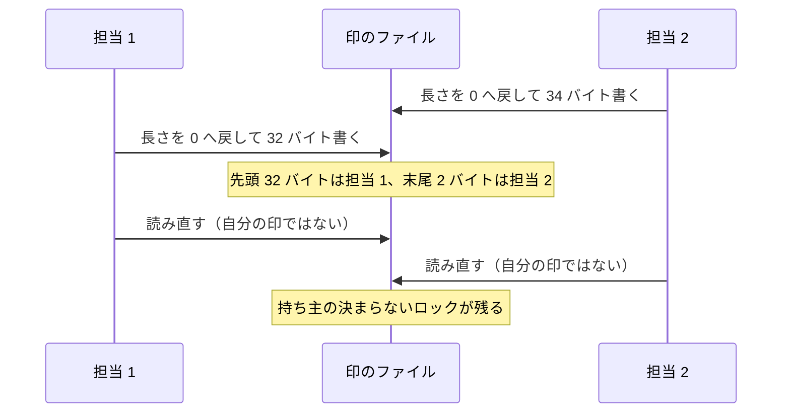
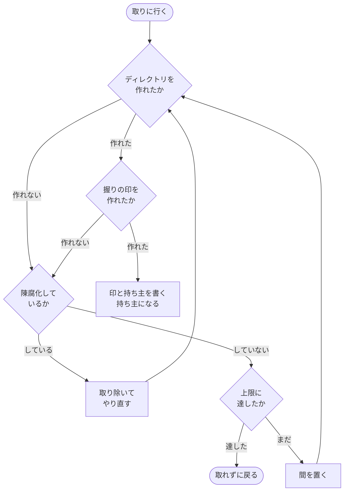

# 担当 B — ディレクトリの作成だけで持ち主を決める排他を直す（#297 / #308）

- issue: [#297](https://github.com/devbasex/ai-plugins/issues/297) / [#308](https://github.com/devbasex/ai-plugins/issues/308)
- ブランチ: `fix/issue-297-308-lock`
- モード: `standard`

この文書は受け入れ条件・設計・決定の記録・テスト設計を持つ。実装はこの文書のマージ後に行う。

**2 件は 1 つの関門の上に乗る。** #297 が「ディレクトリの作成に複数が成功する」ことを扱い、
#308 が「その回避策として入れた手が、持ち主のいないロックを残す」ことを扱う。どちらも
`wt_lock_acquire` と、その写しである `wf_lock_acquire` の同じ数行が原因である。

## 用語

| 語 | この文書での意味 |
| --- | --- |
| 関門 | 同時に走る複数の担当のうち 1 つだけを通す仕組み |
| 持ち主 | 関門を通り、臨界区間を実行してよいと決まった 1 つのプロセス |
| 臨界区間 | 持ち主だけが実行してよい区間。読み込み・変更・書き出しの 3 つをまとめた範囲 |
| 印 | ロックの中に書く識別子。`token` ファイルの内容 |
| 台帳 | 作業ツリーの割り当てを記録する `.git/ndf/worktree-registry.json` |
| 控え | 通過工程を記録するファイル。`development-workflow` が持つ |
| 読み直し | 印を書いた後に同じファイルを読み、自分の印が残っているかを見る手 |
| 上限 | 関門を通れないまま待つことを諦めるまでの実時間 |
| 陳腐化 | 持ち主が消えたまま残ったロックを、捨ててよいと判定すること |

**「ディレクトリの作成」は 2 つの意味を持ちうる。** この文書では、`mkdir` コマンドの実行と、
`mkdir(2)` システムコールの呼び出しを区別して書く。#297 の主題はこの 2 つの食い違いである。

## 何を解決するか

| 課題 | 現在の状態 |
| --- | --- |
| #297 | ディレクトリの作成に複数のプロセスが成功し、同時に臨界区間へ入る |
| #308 | 印の読み直しが、どの担当の印とも一致しないロックを残し、以後だれも取れなくなる |

## 現状（実測）

### このホストの条件

| 項目 | 値 |
| --- | --- |
| `/tmp` のファイルシステム | `overlayfs`（`stat -f -c %T /tmp`） |
| リポジトリのファイルシステム | `ext2/ext3`（`stat -f -c %T /work/ai-plugins`。ext4 をこの名前で返す） |
| `mkdir` の実体 | `/usr/bin/mkdir -> ../lib/cargo/bin/coreutils/mkdir`。uutils coreutils 0.8.0 |
| CPU 数 | 9 |

### 関門にならないのはファイルシステムではなく `mkdir` コマンドである

同じ名前へ 6 プロセスが同時にディレクトリを作り、成功した数を数えた。**システムコールを
直接呼ぶ経路では複数成功が 1 件も出ず、`mkdir` コマンドを起動する経路では出る。**

| 呼び方 | overlayfs（`/tmp`） | ext4（リポジトリ側） |
| --- | --- | --- |
| `os.mkdir`（システムコール。200 試行 × 6 並列） | 複数成功 0 件。失敗 1000 件はすべて `EEXIST` | 複数成功 0 件。同上 |
| `/bin/mkdir`（コマンド。200 試行 × 6 並列） | 複数成功 34 件 | 複数成功 6 件 |

**overlayfs だけの事象ではない。** #297 の本文は overlayfs を条件として挙げているが、上の
実測では ext4 でも複数成功が出た。条件は uutils coreutils の `mkdir` を使うことである。
逐次に 2 回呼べば 2 回目は `mkdir: /tmp/t1: File exists` を返して終了コード 1 になるため、
検査で気づける形になっていない。

シェル自身の `open(O_CREAT|O_EXCL)` にあたる `set -C`（noclobber）を同じ条件で測ると、
両方のファイルシステムで複数成功が出ない。外部コマンドを起動しないため、`mkdir` の実装に
左右されない。

| 関門 | 試行 | 並列 | 複数成功 |
| --- | --- | --- | --- |
| noclobber（overlayfs） | 200 | 6 | 0 件 |
| noclobber（ext4） | 200 | 6 | 0 件 |
| noclobber（overlayfs） | 100 | 12 | 0 件 |

### 現行の `wt_lock_acquire` は 4 つを同時に通した

6 プロセスが同じロックを取りに行き、取得できた時刻と、そのとき読めた印を記録した。

```text
3 取得 1788453381.347421 token=36823-1788453381-31176 pid=36823
2 取得 1788453381.461212 token=36825-1788453381-5818  pid=36826
4 取得 1788453381.462181 token=36825-1788453381-5818  pid=36826
5 取得 1788453381.462546 token=36825-1788453381-5818  pid=36826
6 取得 1788453381.464221 token=36825-1788453381-5818  pid=36826
```

**4 つが同じ 3 ミリ秒の中で取得に成功し、同じ印を読んでいる。** 先に取った 1 つが離した
直後に待ち側が一斉に作りに行くため、`mkdir` の取りこぼしが重なりやすい。

### 印の読み直しは、どの担当の印とも一致しないロックを残す

写しの側（`wf_lock_acquire`）は、ディレクトリの作成後に印を書き、0.1 秒おいて読み直す。
6 プロセスで 25 試行を行い、取得に失敗した側からロックの中身を書き出した。

```text
=== 取得に失敗 ===
token=[76828-1788454053-823-3185083395
9] pid=[]
中身: . .. token
```

**印のファイルに 2 つの書き込みが混ざっている。** `printf '%s\n' "$token" >"$dir/token"` は
書き込みの前に長さを 0 へ戻すため、長い印を書いた側の後に短い印を書いた側が続くと、長い側の
末尾が残る。印の長さは `od -An -N4 -tu4 /dev/urandom | tr -dc '0-9'` の桁数で 1 桁から 10 桁まで
変わるため、長さの食い違いが起きやすい。



混ざった印はどの担当のものとも一致しないため、作成に成功した全員が競り負ける。残るのは
**印があり `pid` が無いロック**である。陳腐化の判定は `pid` が空で更新時刻が新しいものを
捨ててよいと見なさないため、以後 `WF_LOCK_STALE_MINUTES`（5 分）のあいだだれも取れない。

### 排他としての振る舞い（30 試行、臨界区間の重なりで測る）

見張りのファイルへ入って出る区間を臨界区間とし、2 つ以上が同時に入った試行を数えた。
上限は 6 秒とした。

| 実装 | 並列 | 臨界区間が重なった試行 | 上限で取れなかった回数 |
| --- | --- | --- | --- |
| 現行 `wt_lock_acquire` | 6 | 3 | 0 |
| 現行 `wt_lock_acquire` | 12 | 12 | 0 |
| 現行 `wf_lock_acquire` | 6 | 0 | 18 |
| 現行 `wf_lock_acquire` | 12 | 0 | 23 |
| 印の長さを固定した版 | 6 / 12 | 0 / 0 | 0 / 0 |
| noclobber だけを関門にした版 | 6 / 12 | 0 / 0 | 0 / 0 |
| ディレクトリの作成に noclobber を重ねた版 | 6 / 12 | 0 / 0 | 0 / 0 |

### 台帳と控えに現れる影響

作業ツリーを 6 つ同時に登録し、有効な行の数と番号の重なりを数えた。

| 実装 | 試行 | 番号が重なった試行 | 登録が欠けた試行 |
| --- | --- | --- | --- |
| 現行 `wt_slot_acquire` | 20 | 0 | 17 |
| ディレクトリの作成に noclobber を重ねた版 | 20 | 0 | 0 |

番号の重なりが 0 件なのは、後から書いた側が相手の行ごと消すためである。**重複ではなく欠落
として現れる。**

### #308 の再現

**再現した。** `test_two_records_at_once_keep_both_stages` を続けて実行した。

| 条件 | 実行回数 | 失敗回数 |
| --- | --- | --- |
| 単独実行、負荷なし | 15 | 0 |
| 単独実行、CPU を占有する 16 プロセスと同時 | 20 | 0 |
| 単独実行、負荷なし | 60 | 3 |

失敗したときの内訳は、記録された工程が 1 件・2 件・0 件（控えのファイルそのものが無い）で
あった。

```text
E  AssertionError: assert ['実装'] == ['レビュー', '実装', '計画', '設計']
E  AssertionError: assert ['レビュー', '設計'] == ['レビュー', '実装', '計画', '設計']
E  FileNotFoundError: ... /state/stages/devbasex__ai-plugins__221.json
```

テストの起動を挟まずに同じことを繰り返すと、再現の率が上がる。`stage-check.sh record` を
4 つ同時に起動し、上限を 20 秒（テストと同じ値）にして 60 試行を行った。

| 実装 | 試行 | 揃わなかった試行 | 欠けた工程 | うち「控えが使用中」で飛ばした数 |
| --- | --- | --- | --- | --- |
| 現行 | 60 | 5 | 14 | 14 |
| ディレクトリの作成に noclobber を重ねた版 | 60 | 0 | 0 | 0 |

**欠けた工程はすべて、上限に達して排他を取れなかったものである。** 書き込みが重なって
消えたものは 0 件だった。#308 の本文が挙げた 2 つの見立てのうち、負荷起因の揺れではなく、
また `mkdir` の取りこぼしそのものでもない。**印の読み直しが持ち主のいないロックを作り、
それを陳腐化と判定できないために上限まで待って諦めている。**

CPU を占有した状態で失敗が出なかったのは、負荷が担当どうしの起動時刻をばらつかせ、印の
書き込みが重なりにくくなるためと読める（未確認。内訳の記録は取っていない）。

## 受け入れ条件

### #297 ディレクトリの作成だけで持ち主を決めない

1. 6 プロセスが同じロックを同時に取りに行く試行を 30 回行い、**臨界区間が 2 つ以上重なった
   試行が 0 件**になる。現在は 3 件
2. 同じ測定を 12 プロセスで 30 回行い、**重なった試行が 0 件**になる。現在は 12 件
3. 上の 2 つで、**上限に達して取れなかった回数が 0 回**になる
4. 作業ツリーを 6 つ同時に登録する試行を 20 回行い、**有効な行が 6 件そろわなかった試行が
   0 件**になる。現在は 17 件。同じ番号が 2 つ以上へ配られた試行も 0 件を保つ
5. 既存のロックの単体テスト 8 件（`test_testenv.py` の `test_lock_*` /
   `test_stale_lock_is_taken_over` / `test_held_lock_is_reported` /
   `test_old_lock_without_a_pid_is_taken` / `test_takeover_does_not_break_a_fresh_lock`）が
   変更なしで通る
6. `wt_lock_acquire` と `wf_lock_acquire` の本体が同じ手順になる。片方だけに残る手を作らない

### #308 通過工程の控えが同時の記録で欠けない

1. `test_two_records_at_once_keep_both_stages` を**続けて 60 回**実行し、失敗が 0 回になる。
   現在は 3 回
2. `stage-check.sh record` を 4 つ同時に起動する試行を、上限 20 秒で **60 回**行い、4 件の
   工程がそろわなかった試行が 0 件になる。現在は 5 件
3. 同じ測定で、標準エラーへ「控えが使用中」を出して飛ばした記録が 0 件になる。現在は 14 件
4. 排他を取れなかったときの振る舞いは変えない。書き込みを行わず、標準エラーへ 1 行残し、
   終了コード 0 で終わる（#221 の受け入れ条件 8）
5. 持ち主の決まらないロックが残らない。印のファイルへ書き込むのは持ち主だけになる

## 構成要素

| 要素 | 責務 |
| --- | --- |
| `plugins/ndf/scripts/lib/worktree-common.sh` の排他の節 | 関門・陳腐化の判定・待ちの上限。`_wt_lock_sleep` から `wt_lock_is_held` まで |
| `plugins/ndf/skills/development-workflow/scripts/lib/workflow-common.sh` の排他の節 | 上の写し。同じ手順にそろえる |
| `plugins/ndf/skills/worktree/tests/test_registry.py` | 同時に登録したときの台帳の検査（追加） |
| `plugins/ndf/skills/development-workflow/tests/test_stage_check.py` | 同時に記録したときの控えの検査（強化） |

**触らないもの**: 走査の節、控えの節（`wf_record` 以降）、`worktree-testenv.sh`、説明文書。

## 処理の流れ

関門を 2 段にする。1 段目はこれまでどおりディレクトリの作成で、2 段目はシェル自身の
`open(O_CREAT|O_EXCL)` である。**2 段目は外部コマンドを起動しないため、`mkdir` の実装に
左右されない。**



書く順序は、握りの印 → ロックの印 → 持ち主の番号とする。握りの印を作れた 1 つだけが
その後の書き込みを行うため、**印のファイルへ同時に書き込む担当はいなくなる**。

## 排他の関門が満たすべき性質

| 性質 | 内容 | どう確かめるか |
| --- | --- | --- |
| 一意性 | 同時に臨界区間へ入るのは 1 つに限る | 見張りのファイルで重なりを数える（受け入れ条件 #297-1 / 2） |
| 判定が時間に依らない | 持ち主を決める判断に、待ち時間・処理の速さ・並列数が影響しない | 並列数を 6 と 12 に変えて同じ結果になる |
| 進行性 | 持ち主が離せば、待っている担当のいずれかが必ず取れる | 上限で取れなかった回数を数える（受け入れ条件 #297-3） |
| 落ちた持ち主から回復する | 持ち主が消えたロックは、待ち側が捨てて取り直せる | 既存の陳腐化のテスト 3 件がそのまま通る |
| 競り負けが壊さない | 関門を通れなかった側は、持ち主のロックを取り除かない | 既存の `test_takeover_does_not_break_a_fresh_lock` が通る |

## 決定の記録

### 決定 1: 写しの側が持つ「印を書いて読み直す」手は持ち込まない

#297 の本文はこの手を写し元へ足すことを挙げているが、**この手そのものが #308 の原因である**
（「印の読み直しは、どの担当の印とも一致しないロックを残す」）。写し元へ足すと、いま控えで
起きていることが台帳でも起きる。

読み直しは持ち主の決定を時間に委ねる。書いてから読むまでの間隔が、複数がディレクトリの
作成に成功しうる幅より短ければ、2 つとも自分の印を読んで両方が持ち主になる。その幅に上限は
無いため、間隔をどれだけ延ばしても一意性は約束できない。

### 決定 2: 関門はシェル自身の `open(O_CREAT|O_EXCL)` にする

`set -C` を有効にした `: >"$dir/held"` は、シェルが自分で開くため外部コマンドを起動しない。
実測で 500 試行（overlayfs 300・ext4 200、並列 6 と 12）にわたり複数成功が 0 件だった。

**`flock` は使わない。** 持たないホストがあり、有無で仕組みが分かれると互いを見落とす
（既存の注記のとおり）。`set -C` は POSIX のシェルが持つため、この問題が起きない。

### 決定 3: ディレクトリの作成を 1 段目として残す

関門を握りの印だけにすると、ロックのディレクトリが「持ち主がいる」ことを表さなくなり、
既存のテスト 2 件（印が無いロックをすぐには奪わない / 生きている持ち主のロックを壊さない）
が成り立たなくなる。実測でも、握りの印だけにした版はこの 2 件を通らない。

1 段目を残した版で既存の 8 件を確かめたところ、すべて期待どおりの結果になった。

| 検査 | 期待 | 結果 |
| --- | --- | --- |
| 同じロックは 2 度取れない | `first=0` `second=1` | 一致 |
| 離せば取り直せる | `again=0` | 一致 |
| 持ち主が消えたロックは奪う | `rc=0` | 一致 |
| 握っていれば held を返す | `held=0` | 一致 |
| ディレクトリ以外は置き換える | `rc=0` | 一致 |
| 印が無いロックはすぐには奪わない | `rc=1` | 一致 |
| 印が無いまま古いロックは奪う | `rc=0` | 一致 |
| 生きている持ち主のロックは壊さない | `rc=1`・上限 2 秒以内 | 一致（2 秒） |

### 決定 4: 印の長さを固定する案は採らない

印の長さをそろえれば書き込みの混ざりは消える。実測でも重なり 0 件・上限到達 0 件だった。
それでも採らないのは、**一意性が読み直しの間隔に依ったままだから**である。混ざりが消えても、
決定 1 に書いた「両方が自分の印を読む」経路は残る。

### 決定 5: 読み直しの前に置く間隔は無くす。0.1 秒に根拠は無い

写しの側は `_wf_lock_sleep`（0.1 秒）を挟んでいる。**この値を測って決めた記録はリポジトリに
無い。**

```console
$ grep -rn "0\.1 秒|_wf_lock_sleep|読み直しの前に間を置く" issues/ docs/ plugins/
plugins/ndf/skills/development-workflow/scripts/lib/workflow-common.sh:245:_wf_lock_sleep() { sleep 0.1 ... }
plugins/ndf/skills/development-workflow/scripts/lib/workflow-common.sh:283:      _wf_lock_sleep
plugins/ndf/scripts/lib/worktree-common.sh:1835:  # 上限は実時間で測る。刻みが 0.1 秒か 1 秒かで...
```

出てくるのは待ちの刻みとしての 0.1 秒だけで、読み直しの間隔として選んだ理由の記録は無い。
待ちの刻みをそのまま使った形になっている。読み直しを持たない設計にするため、この値を選び
直す判断そのものが要らなくなる。**待ちの刻み（`_wt_lock_sleep` / `_wf_lock_sleep`）は
そのまま残す。** こちらは持ち主の決定に関わらない。

### 決定 6: 関門を通れなかった側はロックを取り除かない

握りの印を作れなかったということは、別の担当がそれを持っているということである。取り除けば
その担当の臨界区間が守られなくなる。競り負けた側は待ち側へ回り、次の刻みでやり直す。写しの
側が既に採っている扱いと同じで、そのまま引き継ぐ。

### 決定 7: 時間に依存する判定のうち、待ちの上限だけを残す

**持ち主を決める判断からは時間を外し、待ちを諦める判断には残す。** 前者は正しさに関わり、
後者は進行性に関わる。上限が無いと、持ち主が落ちて陳腐化にも当たらないときに呼び出し側が
戻らなくなる。値は現状のまま（台帳 5 秒、控えは `NDF_STAGE_LOCK_TIMEOUT` の既定 5 秒）で、
延ばさない。**上限を延ばす案は採らない。** #308 は上限に達したことが症状であって原因では
ないため、延ばしても持ち主のいないロックは 5 分残る。

### 決定 8: 印は識別のためだけに残し、生成の形を 2 箇所でそろえる

印は陳腐化の取り除き（`_wt_lock_discard`）が「判定したものと同じロックか」を確かめるために
使う。持ち主の決定には使わないため、長さの偏りは問題にならない。写しの側が足した
`/dev/urandom` の桁は外し、両方を `$$-<秒>-$RANDOM` にそろえる。書くのは持ち主だけになる
ため、同時に書き込まれることが無くなる。

### 決定 9: 切り出しやすさのための構造の変更は行わない

[#293](https://github.com/devbasex/ai-plugins/issues/293)（担当 C）が排他の実装を
`plugins/ndf/scripts/lib/lock-common.sh` へ切り出す。**この直しは切り出しの前に入る**
（`00-overview.md` の「担当 C は担当 B のマージを待つ」）。

**担当 B が扱うのは振る舞いの正しさだけである。** 関数をどのファイルへ置くか、写しを 1 つに
するか、配布の経路をどう通すかは担当 C の領分であり、この文書では決めない。切り出しやすさを
理由に関数の分け方や引数の形を変えることもしない。2 箇所へ同じ手順を置いたまま渡す。

## 取り違えで正当な操作が止まらないための担保

| 起きうること | 振る舞い |
| --- | --- |
| 握りの印を作れない理由が競り合いではない（書き込めない置き場所など） | 上限まで待って取れずに戻る。呼び出し側の扱いは変わらない |
| 持ち主が握りの印を作った直後に落ちる | ロックに持ち主の番号が無く更新時刻が新しいため、5 分は待ち側へ回る。現状と同じ扱い |
| ロックの位置にディレクトリ以外がある | これまでどおり取り除いてから作る |
| `set -C` を持たないシェルで読み込まれる | 未確認。実装の前に配布先 4 ランタイムが使うシェルで確かめる |

## テスト設計

排他は関数の層に対して検査する。通信は行わない。**同時に起動したときの振る舞いは、繰り返した
うえで件数で見る。** 1 回の実行では、取りこぼしがあっても通ることがある（#308 の単独実行が
15 回続けて通った）。

| 受け入れ条件 | 何で確かめるか | 置き場所 |
| --- | --- | --- |
| #297-1 / 2 / 3 | 同じロックを 6 つ・12 のプロセスで取りに行き、臨界区間の重なりと上限到達を数える。試行 30 回 | `worktree/tests/test_registry.py` |
| #297-4 | 作業ツリーを 6 つ同時に登録し、有効な行の数と番号の重なりを見る。試行 20 回 | `worktree/tests/test_registry.py` |
| #297-5 | 既存の 8 件をそのまま実行する（変更しない） | `worktree/tests/test_testenv.py` |
| #297-6 | 2 つのファイルの排他の節から関数の本体を取り出し、空白を除いて一致することを見る | `worktree/tests/test_registry.py` |
| #308-1 | 既存の `test_two_records_at_once_keep_both_stages` をそのまま残す | `development-workflow/tests/test_stage_check.py` |
| #308-2 / 3 | `record` を 4 つ同時に起動する試行を繰り返し、工程がそろうことと標準エラーが空であることを見る | 同上 |
| #308-4 | 既存の `test_a_record_that_cannot_take_the_lock_changes_nothing` をそのまま残す | 同上 |
| #308-5 | 6 つ同時に取りに行った後、ロックが残っていれば持ち主の番号を持つことを見る | `worktree/tests/test_registry.py` |

**繰り返しの回数は、テスト一式の実行時間との釣り合いで決める。** 受け入れ条件が求める
60 回はテストの中では行わず、実装の完了判定として手元で 1 度回す。テストへ入れる回数は、
1 件あたり 5 秒を上限として実装のときに決める。

完了判定の証跡は次の 3 つとする。

```bash
uv run --with pytest pytest scripts/tests plugins/ndf -q
uv run --with pytest pytest plugins/ndf/skills/development-workflow/tests/test_stage_check.py -q   # 60 回繰り返す
bash plugins/ndf/dev.kiro/install.sh --project <検証用ディレクトリ> --yes
```

## 担当をまたぐ調整

| 相手 | 何を調整するか |
| --- | --- |
| 担当 A（#201 / #197） | 同じファイルの別の節を持つ。行が 300 行以上離れるため、どちらが先にマージされてもよい（`00-overview.md`） |
| 担当 C（#293） | 振る舞いの正しさは担当 B、置き場所と配布の経路は担当 C（決定 9）。担当 C は 2 箇所が同じ手順になった状態を受け取る |
| 境界の追記 | ロックの単体テスト 8 件は `test_testenv.py` にあり、担当 B の書き換えてよいパスに入っていない。**8 件は変更せずに通ることを確かめたため、境界は動かさない**（決定 3）。新しく足す検査は `test_registry.py` へ置く |

## 未確認のまま残ること

| 項目 | 内容 |
| --- | --- |
| `set -C` の対応 | 配布先 4 ランタイムが hook とスクリプトの実行に使うシェルで `set -C` が効くかは未確認。実装の前に確かめる |
| 負荷と再現の関係 | CPU を占有した状態で #308 が再現しなかった理由は未確認。起動時刻がばらつくためと読めるが、内訳の記録は取っていない |
| 持ち主が握りの印の直後に落ちた場合 | 5 分は待ち側へ回る扱いを変えていない。この待ちを短くするかは、実際に起きた記録が出てから判断する |
| uutils の `mkdir` が複数成功する条件 | 実装の中のどの経路かは追っていない。関門として使わない設計にするため、この直しの判断には要らない |

## 範囲外として見つけたこと

| 見つけたこと | なぜこの変更の範囲外か | 扱い |
| --- | --- | --- |
| `_wt_lock_discard` は取り除きに失敗したとき `$dir.stale.<印>` を残す。取り除いた側が落ちると残り続ける | 陳腐化の取り除きの経路であり、#297 / #308 が扱う関門の一意性とは別の課題である | #314 として起票した |
| `wt_registry_update` は排他を取れないとき終了コード 1 を返すが、呼び出し元の `do_up` は戻り値を見ずに次へ進む。`worktree-testenv.sh` は `set -uo pipefail` で、`-e` を持たない | 呼び出し元は `worktree-testenv.sh` にあり、担当 B の書き換えてよいパスの外にある | #315 として起票した |
| `stat -f -c %T` は ext4 を `ext2/ext3` と返すため、記録に残す値としてファイルシステムの種別を取り違えやすい | 実測の記録の書き方の問題で、コードの課題ではない | 起票しない。この文書に実際の種別を併記した |

**`mkdir` を関門として使っている箇所は、直す 2 つの関数に限られる。** 置き場所を用意する
`mkdir -p` は関門ではないため、検索から外した。

```console
$ grep -rn 'if mkdir |mkdir .* &&|mkdir "' --include=*.sh plugins/ndf/scripts/ \
    plugins/ndf/skills/development-workflow/scripts/ | grep -v 'mkdir -p'
plugins/ndf/skills/development-workflow/scripts/lib/workflow-common.sh:277:    if mkdir "$dir" 2>/dev/null; then
plugins/ndf/scripts/lib/worktree-common.sh:1839:  while ! mkdir "$dir" 2>/dev/null; do
```
