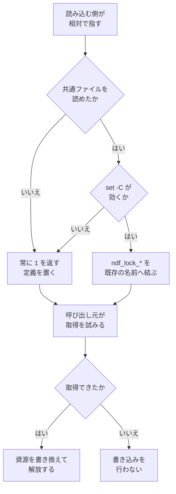

# 293: 排他の実装を 1 箇所へ寄せる

ロックのディレクトリを関門にした排他の実装が `plugins/ndf/scripts/lib/worktree-common.sh` と
`plugins/ndf/skills/development-workflow/scripts/lib/workflow-common.sh` の 2 箇所にある。
この文書は「どう作るか」だけを扱う。全体の境界と着手の順序は
[00-overview.md](00-overview.md) にある。

**モードは `architecture` である。** 複数モジュールにまたがり、配布の経路をどう通すかの
判断を含むためである。

## 用語

| 語 | この文書での意味 |
| --- | --- |
| 排他 | 同じ資源を同時に書き換えないための仕組み。ここでは 2 段の関門を通ったものを持ち主とする |
| 持ち主 | ロックを取得した 1 つのプロセス。`mkdir` に成功したプロセスと同義ではない |
| 印 | ロックのディレクトリへ書く `token` の内容。識別に使う |
| 握りの印 | 2 段目の関門が作る `held` ファイル。作れた 1 つが持ち主になる |
| 写し | 同じ内容の実装が 2 箇所にある状態 |
| 配布先ランタイム | Skill と scripts を配る先。Claude Code / Codex / Kiro CLI / agy |
| プラグインルート | 配布した先で `scripts/` と `skills/` が並ぶディレクトリ |
| 主ディレクトリ | リポジトリを clone したディレクトリ |
| 台帳 | 作業ツリーの割り当てを記録する `.git/ndf/worktree-registry.json` |
| 控え | 通過工程を記録するファイル。`development-workflow` が持つ |

## 着手の前提

**担当 B（#297 / #308）のマージの後に着手する。** 排他になっていない実装を先に切り出すと、
切り出した先が同じ欠陥を持ったまま 2 箇所から使われる。担当 B が決めた形は
[02-issue-297-308.md](02-issue-297-308.md) にあり、要点は次の 5 つである。

| 項目 | 担当 B の結論 |
| --- | --- |
| 関門 | 2 段。1 段目は `mkdir`、2 段目は `set -C` を有効にした `: >"$dir/held"` |
| 排他が成り立たない原因 | ファイルシステムではなく `mkdir` コマンドの実装（uutils coreutils 0.8.0）。ext4 でも複数成功が出る |
| 印（`token`）の役割 | 識別だけ。持ち主の決定には使わない。書くのは持ち主だけになる |
| 印の値の作り方 | 2 箇所とも `$$-<秒>-$RANDOM`。`/dev/urandom` の桁は持たない |
| 書き込みの前の間隔 | 持たない。待ちの刻み（`_wt_lock_sleep`）は残る |

**印を書いて読み直し、自分の印が残るときだけ持ち主とする手は入らない。** その手が #308 の
原因だったためである。長さの違う印が同じファイルへ同時に書かれると、長い側の末尾が短い側の
後に残り、どの担当の印とも一致しないロックができる。作成に成功した全員が競り負け、持ち主の
いないロックが 5 分のあいだだれにも取れなくなる。

**担当 B は振る舞いの正しさだけを扱う**（担当 B の決定 9）。関数の分け方・引数の形・置き場所は
変えず、2 箇所へ同じ手順を置いたまま渡す。**この文書が設計の対象にするのは、その状態から
先である。**

## 受け入れ条件

| 番号 | 条件 |
| --- | --- |
| A1 | 2 段の関門を持つ取得の手順が、リポジトリの中に 1 箇所だけある |
| A2 | `worktree-common.sh` を読み込んだシェルで `wt_lock_acquire` / `wt_lock_release` / `wt_lock_is_held` が従来どおり呼べる |
| A3 | `workflow-common.sh` を読み込んだシェルで `wf_lock_acquire` / `wf_lock_release` が従来どおり呼べる |
| A4 | `NDF_STAGE_LOCK_TIMEOUT` による待ち時間の上書きが、従来どおり `wf_lock_acquire` にだけ効く |
| A5 | 4 つの配布先ランタイムそれぞれの配置で、`workflow-common.sh` から共通ファイルを読み込める |
| A6 | 共通ファイルを読み込めないとき、控えへの書き込みは行わず、終了コード 0 で工程を続ける |
| A7 | 同時に走らせた 6 つのうち、ロックを持ち主として取得するのは 1 つだけである |
| A8 | `ndf_lock_acquire` を呼んだ後、呼び出し側のシェルの `$-` に `C` が残らない |
| A9 | 既存の `test_testenv.py` と `test_stage_check.py` を書き換えずに通る |
| A10 | `uv run --with pytest pytest scripts/tests plugins/ndf -q` がリポジトリの根から通る |

対象範囲に含まないもの:

- 関門の 2 段の手順と陳腐化の判定そのもの（担当 B が持つ）
- 書き込み先の走査（担当 A が持つ）
- 控えの読み書き（`wf_state_read` / `wf_record`）の判定
- 説明文書のうち版数を持つ箇所

## 現状（実測）

### 2 箇所の実装の差分

**この値は担当 B のマージ（PR #320）の後に測り直したものである。** 設計を書いた時点の値は
担当 B の変更の前のもので、着手の時点では合わなくなっていた。基準は `develop` の `2dbd45a`
である。関数名の接頭辞（`wt_` / `wf_`）を揃えたうえで差分を取った。

```bash
sed -n '1943,2056p' plugins/ndf/scripts/lib/worktree-common.sh \
  | sed 's/\bwt_/LOCK_/g; s/\b_wt_/_LOCK_/g; s/WT_LOCK_STALE/LOCK_STALE/g' > a.sh
sed -n '244,319p' plugins/ndf/skills/development-workflow/scripts/lib/workflow-common.sh \
  | sed 's/\bwf_/LOCK_/g; s/\b_wf_/_LOCK_/g; s/WF_LOCK_STALE/LOCK_STALE/g' > b.sh
diff -u a.sh b.sh
```

| 測ったもの | 作業ツリー側（`wt_`） | 工程の控え側（`wf_`） |
| --- | --- | --- |
| 節の行数（コメントと空行を含む） | 114 行 | 76 行 |
| コード行（コメントと空行を除く） | 64 行 | 56 行 |
| 同じ内容のコード行 | 53 行 | 53 行 |

**担当 B のマージで、設計の時点の 4 点のうち 2 点が解消した。**

| 要素 | 作業ツリー側（`wt_`） | 工程の控え側（`wf_`） | 担当 B のマージ後 |
| --- | --- | --- | --- |
| 捨ててよいと見なす分数 | 5 | 5 | 一致する |
| 捨ててよい状態かの判定 | `pid` の生存、無ければ更新時刻 | 同じ | 一致する |
| 解放 | `rm -rf` | 同じ | 一致する |
| 印の値の作り方 | プロセス番号・秒・`RANDOM` | 同じ | **一致した**（短い側へそろった） |
| `mkdir` に成功した後 | 2 段目の関門を通った 1 つだけが持ち主になる | 同じ | **一致した** |
| 同じロックかを確かめて取り除く手順 | ロックの中に関門を置いて `token` を照合 | 同じ | **一致した**（名前の付け替えはやめた） |
| 待ちの刻みの書き方 | 3 行の関数定義 | 1 行の関数定義 | **食い違ったまま**（中身は同じ） |
| 待ちの上限の既定 | 引数の既定値 `5` | `NDF_STAGE_LOCK_TIMEOUT` で上書きできる `5` | **食い違ったまま** |
| 生きている持ち主がいるかを返す関数 | ある（`wt_lock_is_held`） | 無い | **食い違ったまま** |

**同じ内容のコード行が 53 行あり、食い違うのは 3 点である。** 設計の時点は 46 行・4 点で、
どちらも増えている。行が増えたのは、担当 B が陳腐化の取り除きへ関門を足し、その関門を
両側へ同じ形で置いたためである（`( set -C; : >"$dir/discard" )`）。**寄せる対象は、
設計の時点より大きくなっている。**

食い違いの 3 点のうち、待ちの刻みの書き方は中身が同じで、寄せれば消える。残る 2 点は
「入出力の契約」の「既存の名前との対応」が扱う。

### 呼び出し元

| 関数 | 呼び出し元 |
| --- | --- |
| `wt_lock_acquire` / `wt_lock_release` | `plugins/ndf/scripts/worktree-testenv.sh:381,387` / `worktree-common.sh` の台帳の更新 |
| `wt_lock_is_held` | `plugins/ndf/scripts/worktree-testenv.sh:539` |
| `wf_lock_acquire` / `wf_lock_release` | `workflow-common.sh:326,339,346`（控えへ 1 件積む処理） |

呼び出し元は 2 つのファイルとテストだけである。

```bash
grep -rn "wt_lock_acquire\|wt_lock_release\|wt_lock_is_held\|wf_lock_acquire\|wf_lock_release" \
  plugins/ scripts/ --include=*.sh --include=*.py
```

### 配布の経路

**この課題の主題である。** 課題の本文は「切り出しただけでは共有できない」と書いている。
配布した後に、Skill のディレクトリからプラグインルートの `scripts/` へ相対でたどれるかを
4 ランタイムで測った。基準にした相対の位置は
`skills/development-workflow/scripts/lib/` から `../../../../scripts/lib/` である。

| ランタイム | 配布した先の位置 | `scripts/` の在り方 | 相対でたどれるか |
| --- | --- | --- | --- |
| Claude Code | `~/.claude/plugins/cache/ai-plugins/ndf/10.0.0/` | プラグインルート直下に実体がある | たどれる |
| Codex | `~/.codex/plugins/cache/ai-plugins/ndf/10.0.0/` | 同上 | たどれる |
| agy | `~/.gemini/config/plugins/ndf/` | `dev.agy/scripts` の symlink を実体へ解決して複製する | たどれる |
| Kiro CLI | 主ディレクトリの `plugins/ndf/`（複製しない） | 主ディレクトリに残る | たどれる |

Claude Code / Codex / agy は次のコマンドで確かめた。いずれも `worktree-common.sh` が
返った。

```bash
ls ~/.claude/plugins/cache/ai-plugins/ndf/10.0.0/skills/development-workflow/scripts/lib/../../../../scripts/lib/worktree-common.sh
ls ~/.codex/plugins/cache/ai-plugins/ndf/10.0.0/skills/development-workflow/scripts/lib/../../../../scripts/lib/worktree-common.sh
ls ~/.gemini/config/plugins/ndf/skills/development-workflow/scripts/lib/../../../../scripts/lib/worktree-common.sh
```

**Kiro CLI だけが Skill を複製する。** `dev.kiro/install.sh:180` は
`ln -sfn "$PLUGIN_SKILLS_DIR/$skill_name" "$SKILLS_DIR/$skill_name"` で
`.kiro/skills/<Skill 名>` を主ディレクトリの `plugins/ndf/skills/<Skill 名>` への symlink に
する。`.kiro/` の下に `scripts/` は作られない（作られるのは `agents` / `prompts` /
`skills` / `steering` の 4 つ）。それでも `..` はカーネルが物理的に解決するため、
symlink を経由した経路からプラグインルートへ戻れる。検証用のディレクトリへ導入して測った。

```bash
readlink -f <検証用>/.kiro/skills/development-workflow/scripts/lib/../../../../scripts/lib/worktree-common.sh
# => /work/ai-plugins/.worktrees/design/parallel-batch-06/plugins/ndf/scripts/lib/worktree-common.sh
```

**たどり方によって結果が変わる。** 同じ 4 階層でも、`cd` で戻ってから `pwd` を取る書き方は
Kiro の配置で外れる。`cd` は `..` を論理パスに対して字句で畳むため、symlink の手前へ戻る。

| 書き方 | 主ディレクトリと 3 ランタイム | Kiro の symlink 経由 |
| --- | --- | --- |
| `. "$DIR/../../../../scripts/lib/<名前>"`（`DIR` は `cd $(dirname) && pwd`） | 読み込める | 読み込める |
| `. "$DIR/../../../../scripts/lib/<名前>"`（`DIR` は `pwd -P`） | 読み込める | 読み込める |
| `ROOT=$(cd "$(dirname …)/../../../.." && pwd)` の後に `. "$ROOT/scripts/lib/<名前>"` | 読み込める | 読み込めない |

**配布の基準は Skill の名前だけを持つ。** `plugins/ndf/manifests/*-skills.txt` の 4 本は
いずれも Skill 名の一覧で、`scripts` という語を 1 件も含まない。

```bash
grep -rn "scripts" plugins/ndf/manifests/   # 出力なし
```

`scripts/build-runtime-plugins.sh:142` は `dev.agy/scripts` を `../scripts` への symlink として
固定で生成する。ファイル単位の登録は無いため、`scripts/lib/` へファイルを 1 つ足しても
配布の基準・生成・検査のいずれも書き換えを必要としない。

### hook が使うシェルと `set -C`

担当 B の 2 段目の関門は `set -C`（noclobber）に依る。**配布先 4 ランタイムのすべてで、
hook はスクリプトを `bash` で起動する。**

| ランタイム | hook が起動するコマンド | 出所 |
| --- | --- | --- |
| Claude Code | `bash ${PLUGIN_ROOT:-${CLAUDE_PLUGIN_ROOT}}/scripts/worktree-guard.sh` | `plugins/ndf/hooks/claude.json:10` |
| Claude Code（工程の hook） | `bash "${CLAUDE_PLUGIN_ROOT}/skills/development-workflow/scripts/workflow-guard.sh"` | `development-workflow/SKILL.md:9` |
| Codex | `sh -c 'if [ -n "$PLUGIN_ROOT" ]; then bash "$PLUGIN_ROOT/scripts/worktree-guard.sh"; fi; exit 0'` | `plugins/ndf/hooks/codex.json:9` |
| agy | `bash ./scripts/worktree-guard.sh` | `plugins/ndf/dev.agy/hooks.json:9` |
| Kiro CLI | `bash <プラグイン>/scripts/worktree-guard.sh` | `dev.kiro/install.sh:373,379` |

Codex は外側を `sh` で包むが、共通ファイルを読み込むのは内側の `bash` である。共通ファイルを
読み込む 5 本のスクリプトはいずれも `#!/usr/bin/env bash` を持つ。

**`bash` と `dash` の両方で、既存ファイルへの書き込みが失敗する。** このホストの `/bin/sh` は
`dash` である（`ls -l /bin/sh` が `dash` を返す）。終了コードはシェルで違うため、値ではなく
成否で見る。

| シェル | 既存ファイルへ | 新規ファイルへ | 既存ファイルの中身 |
| --- | --- | --- | --- |
| `bash` 5.3.9 | 失敗（終了コード 1） | 成功 | 残る |
| `dash`（`/bin/sh`） | 失敗（終了コード 2） | 成功 | 残る |

**`set -C` を裸で書くと、呼び出し側のシェルの状態が変わる。** `bash` と `dash` の両方で、
実行の後も `$-` に `C` が残った。部分シェルで囲むと、両方とも残らない。

| 書き方 | 既存ファイルへの結果 | 呼び出し側の `$-` |
| --- | --- | --- |
| `set -C; : >"$dir/held"` | 失敗する | `C` が残る |
| `( set -C; : >"$dir/held" ) 2>/dev/null` | 失敗する | `C` は残らない |

部分シェルは 1 回あたり fork を 1 つ増やす。1000 回の実測で 405 ミリ秒で、同じ回数の
`mkdir` コマンド（1228 ミリ秒）より短い。1 段目が既に外部コマンドを起動するため、
2 段目を部分シェルにしても取得 1 回あたりの費用は増えない。

**`set -C` が効いたかは実行時に見分けられる。** `bash` と `dash` のどちらでも、
`( set -C; case "$-" in *C*) … )` が `C` を含む値を返した。

## 構成要素

| 要素 | 責務 |
| --- | --- |
| `plugins/ndf/scripts/lib/lock-common.sh`（新設） | 2 段の関門・陳腐化の判定・待ちの上限を持つ唯一の実装 |
| `worktree-common.sh` の排他の節 | `lock-common.sh` を読み込み、`wt_` の名前で呼べるようにする |
| `workflow-common.sh` の排他の節 | 同上。`wf_` の名前と、待ち時間の既定の上書きを重ねる |
| `scripts/tests/test_lock_common.py`（新設） | 取得の排他性と、4 ランタイムの配置での読み込みを検査する |

**新しい入口のスクリプトは作らない。** `lock-common.sh` は読み込まれるだけで、単独では
実行しない。

**呼び出し元とテストは書き換えない。** 既存の名前を残すのは、`worktree-testenv.sh` と
`test_testenv.py` / `test_stage_check.py` が担当 A・担当 B の境界にあるためである。

## データ構造

ロックはディレクトリ 1 つと、その中の 3 ファイルで表す。作る順序に意味がある。

| 位置 | 内容 | いつ作るか | 何に使うか |
| --- | --- | --- | --- |
| `<資源のパス>.lockdir` | ディレクトリそのもの | 1 段目の関門として `mkdir` で作る | 陳腐化の判定が見る単位。取り除くときもこの単位 |
| `<…>.lockdir/held` | 中身の無いファイル | 2 段目の関門として `set -C` のもとで作る | **持ち主を 1 つに決める関門。作れた 1 つだけが持ち主になる** |
| `<…>.lockdir/token` | 取得を試みた 1 回ごとに変わる値 | 握りの印を作れた後 | 捨ててよいロックの取り違え防止。判定したものと同じロックかを確かめる |
| `<…>.lockdir/pid` | 持ち主のプロセス番号 | 印を書いた後 | 持ち主の生存確認 |
| `<…>.lockdir.stale.<token>` | 捨てる途中のロック（一時的） | 陳腐化したロックを名前で付け替えるとき | 取り除く対象を 1 つに絞る関門 |

**書く順序は、握りの印 → 印 → 持ち主の番号である。** 握りの印を作れた 1 つだけがその後の
書き込みを行うため、`token` と `pid` へ同時に書き込む担当はいなくなる。順序は担当 B が
決める（#297 / #308）。この文書は順序を変えない。

**`token` は持ち主の決定に使わない。** 使うのは陳腐化の取り除きだけで、「捨ててよいと判定した
ものと、いま取り除こうとしているものが同じロックか」を確かめる。持ち主を決めるのは
`held` を作れたかどうかである。

**`pid` があることが「持ち主が確定した」ことを表す。** `pid` が無く更新時刻が古いロックは
捨ててよい状態として扱う。

**印の値は 2 箇所とも `$$-<秒>-$RANDOM` にそろえる。** 持ち主の決定に使わないため、長さの
偏りは取り違えの原因にならない。長さの違う値が同じファイルへ同時に書かれると、長い側の
末尾が短い側の後に残る。書き込む担当が 1 つになった後もそろえるのは、写しを 1 つへ寄せる
この課題で、2 箇所の値の作り方が違う理由が無くなるためである。

**過去の取得の記録は残さない。** ロックは解放と同時に消える。誰がいつ取得したかを
後から集計する要件は無く、記録を残すと解放のたびに書き込みが増える。

## 入出力の契約

### 共通ファイルが公開するもの

| 名前 | 引数 | 戻り値 | 意味 |
| --- | --- | --- | --- |
| `ndf_lock_acquire` | 第 1: ロックのパス（必須） / 第 2: 待ちの上限秒（既定 5） | 0 = 取得した / 1 = 取得しなかった | 持ち主になるまで待つ。上限を実時間で測る |
| `ndf_lock_release` | 第 1: ロックのパス | 常に 0 | 取り除く。パスが空でも 0 を返す |
| `ndf_lock_is_held` | 第 1: ロックのパス | 0 = 生きている持ち主がいる / 1 = いない | 取得を試みずに状態だけ見る |
| `NDF_LOCK_STALE_MINUTES` | — | — | 印の無いロックを捨ててよいと見なすまでの分数（5） |

内部の 4 つ（`_ndf_lock_sleep` / `_ndf_lock_discard` / `_ndf_lock_is_stale` /
`_ndf_lock_hold`）は接頭辞に `_` を付け、呼び出し元から使わない。

**標準出力へは何も書かない。** 呼び出し元の 2 つは、いずれも hook かコマンド置換の中で
動く。出力を持つと hook の返す JSON へ混ざる。

### 呼び出し側のシェルの状態を変えない

**2 段目の関門は部分シェルの中で張り、元へ戻す責務を共通ファイルが引き受ける。**
`( set -C; : >"$dir/held" ) 2>/dev/null` の形にすると、`set -C` は部分シェルの中でだけ
有効になり、呼び出し側の `$-` には残らない（`bash` と `dash` の両方で実測）。

| 決めること | この設計での扱い |
| --- | --- |
| `set -C` を有効にする範囲 | 共通ファイルの中の部分シェル 1 つ |
| 元へ戻す責務 | 共通ファイル。呼び出し側は何もしない |
| 呼び出し側が `set -C` を使っていた場合 | 影響を受けない。部分シェルの外の状態は読み書きしない |
| 標準エラーへの出力 | 部分シェルの外で `2>/dev/null` へ捨てる。既存ファイルへの書き込みの失敗は正常な経路である |
| 成否の見方 | 終了コードの値ではなく成否で見る（`bash` は 1、`dash` は 2 を返す） |

**元の状態を保存して後で戻す形は採らない。** 保存と復元の間で呼び出し元が戻ると、
`set -C` を有効にしたまま制御が戻る。部分シェルは戻す処理を書かずに同じ結果になり、
1000 回で 405 ミリ秒（1 段目の `mkdir` コマンドの 1228 ミリ秒より短い）で済む。

**`set -C` が効かないシェルで読み込まれたときは、取得できなかったものとして扱う。**
`( set -C; case "$-" in *C*) )` で効いたかを見分けられる（実測）。効かないときは 2 段目の
関門が張れず、1 段目だけでは持ち主を 1 つに絞れない。**排他が成り立たないまま書き込みへ
進める代わりに、書き込みを行わない側へ倒す。**

### 読み込む側の契約

読み込む側は、自分の位置からの相対で共通ファイルを指す。**`cd` で戻ってから `pwd` を
取る書き方は使わない**（Kiro の配置で外れる。「配布の経路」の実測）。

| 読み込む側 | 自分の位置 | 共通ファイルの指し方 |
| --- | --- | --- |
| `worktree-common.sh` | `<プラグインルート>/scripts/lib/` | `"$(dirname "${BASH_SOURCE[0]}")/lock-common.sh"` |
| `workflow-common.sh` | `<プラグインルート>/skills/development-workflow/scripts/lib/` | `"$(dirname "${BASH_SOURCE[0]}")/../../../../scripts/lib/lock-common.sh"` |

### 既存の名前との対応

呼び出し元とテストを書き換えないため、既存の名前を残す。

| 既存の名前 | 置き換え後の中身 |
| --- | --- |
| `wt_lock_acquire` / `wt_lock_release` / `wt_lock_is_held` | 引数をそのまま `ndf_lock_*` へ渡す |
| `WT_LOCK_STALE_MINUTES` | `NDF_LOCK_STALE_MINUTES` と同じ値を指す |
| `wf_lock_acquire` | 第 2 引数が無いとき `$WF_LOCK_TIMEOUT` を補って `ndf_lock_acquire` へ渡す |
| `wf_lock_release` | 引数をそのまま `ndf_lock_release` へ渡す |
| `WF_LOCK_TIMEOUT` | `${NDF_STAGE_LOCK_TIMEOUT:-5}`。現状のまま `workflow-common.sh` が持つ |
| `_wt_lock_discard` / `_wt_lock_is_stale` / `_wf_lock_discard` / `_wf_lock_is_stale` | 引数をそのまま `_ndf_lock_*` へ渡す |

**接頭辞に `_` を付けた 4 つも残す。** 既存の 2 つのテスト（`test_registry.py` /
`test_testenv.py`）が、判定と取り除きをこの名前で直接呼ぶ。呼び出し元から使わない名前で
あっても、**テストを書き換えないという条件（A9）はこちらが満たす側にある。**

**待ち時間の上書きは工程の控えの側だけに残す。** `NDF_STAGE_LOCK_TIMEOUT` は
`development-workflow` のテストが待ち時間を 1 秒へ縮めるために使う
（`workflow_helpers.py:30`）。作業ツリーの側へ広げると、名前が指す対象と実際に効く範囲が
食い違う。

### 関門を張れなかったときの振る舞い

**関門を張れない理由は 2 つあり、どちらも「取得できなかった」へ合流させる。** 共通ファイルを
読み込めないときは、読み込む側が `ndf_lock_acquire` を「常に 1 を返す」形で定義する。
`set -C` が効かないときは、共通ファイル自身が同じ形へ差し替える。

| 呼び出し元 | 取得できなかったときの既存の動き |
| --- | --- |
| 控えへ 1 件積む処理 | 書き込みを行わず 0 で返る。飛ばした工程は報告の「記録なし」に含まれる |
| 台帳の更新 | 1 で返る。呼び出し元が案内を出す |
| テスト環境の起動 | 1 で返り、待ちの案内を出す |

**排他を取れないことと、排他なしで書くことは別である。** 関門を張れないことを素通りさせて
書き込みへ進むと、共有ファイルを守るものが無いまま同時に書く。既存の 3 つの呼び出し元は
いずれも「取得できなかった」を安全側の分岐として持っているため、そこへ合流させる。

## 処理の流れ

この図が扱うのは、共通ファイルを結ぶところと、関門を張れないときの合流である。関門そのものの
2 段の流れは担当 B の文書にある。



## 決定の記録

### 決定 1: 共通ファイルを新設し、2 つの読み込む側がどちらも相対で指す

4 つの配布先ランタイムのすべてで、Skill のディレクトリからプラグインルートの `scripts/`
へ相対でたどれることを実測した。Skill だけを複製する Kiro CLI でも、複製の実体が
主ディレクトリへの symlink であるため、`..` はカーネルが物理的に解決してプラグインルートへ
戻る。プラグインルートを指す環境変数は agy が持たないが、環境変数を使わない相対の指し方で
足りる。

写しを残して同一性を機械で照合する形は採らない。照合は食い違いを見つけるだけで、
どちらが正しいかは決めない。**片方だけを直したときに、検査が落ちることと、挙動が
分かれることの両方が起きる。** 読み込む側が自力で共通ファイルを探す形も採らない。
探す手順は 4 ランタイム分の候補を順に試すもので（`development-workflow` の
「`$SCRIPTS` を決める」）、分量は排他の実装より大きくなる。

### 決定 2: 共通ファイルの名前を `ndf_lock_*` にし、既存の名前を残す

`wt_` と `wf_` はどちらも読み込む側の都合で付いた接頭辞で、共通の層に置く名前としては
どちらも合わない。呼び出し元とテストを書き換えないのは、`worktree-testenv.sh` と
`test_testenv.py` / `test_stage_check.py` が担当 A・担当 B の境界にあるためである。

名前を 1 つへ寄せて呼び出し元を全部書き換える形は採らない。この課題で減らしたいのは
実装の写しであって、名前の数ではない。

### 決定 3: 関門を張れないときは、常に取得できないものとして定義する

共通ファイルを読み込めないときと、`set -C` が効かないときの 2 つを 1 つの扱いへまとめる。
既存の 3 つの呼び出し元は、いずれも「取得できなかった」ときの分岐を持ち、そこでは共有
ファイルへ書かない。この分岐へ合流させれば、工程は止まらず、守られていない書き込みも
起きない。

読み込みの失敗でスクリプト全体を終える形は採らない。`workflow-guard.sh:16` と
`stage-check.sh:14` は共通ライブラリを読めないとき終了コード 0 で抜ける作りで、
そこへ排他の読み込みの失敗を重ねると、案内も判定も出ないまま黙って抜ける範囲が広がる。

1 段目のディレクトリの作成だけで続ける形も採らない。`mkdir` コマンドは同じ名前の作成に
複数が成功するため（担当 B の実測。ext4 で 200 試行のうち 6 件）、1 段目だけでは持ち主が
1 つに決まらない。

### 決定 4: 2 段目の関門を部分シェルの中に閉じる

`set -C` は呼び出し側のシェルの状態を変える。裸で書くと、実行の後も `$-` に `C` が残った
（`bash` と `dash` の両方で実測）。共通ファイルは読み込まれる側であり、読み込んだ側の
シェルの状態を変えたまま戻ると、呼び出し元の後続の書き込みが `set -C` のもとで動く。
**この責務は担当 B の 2 つのファイルが先に負い、共通ファイルが契約として引き継ぐ。**

保存して後で戻す形は採らない。保存と復元の間で呼び出し元が戻ると状態が残り、戻す処理を
書き足す分だけ手数が増える。部分シェルは同じ結果を戻す処理なしで得られ、1000 回で
405 ミリ秒（1 段目の `mkdir` コマンドの 1228 ミリ秒より短い）である。

### 決定 5: 配布の基準・生成・検査は書き換えない

`plugins/ndf/manifests/*-skills.txt` の 4 本は Skill の名前だけを持ち、`scripts` という語を
含まない。`scripts/build-runtime-plugins.sh` は `dev.agy/scripts` をディレクトリ単位の
symlink として固定で生成する。`scripts/lib/` へファイルを 1 つ足しても、どちらも
書き換えを必要としない。

ファイル単位の登録を新しく設ける形は採らない。登録が増えると、ファイルを足すたびに
4 ランタイム分の記述を揃える作業が生まれる。

### 決定 6: 配布の経路が成立することを、テストで固定する

相対でたどれることは配置に依存する。**この設計が成り立つ根拠は実測であり、実測は
配置が変われば変わる。** 4 ランタイムの配置を一時ディレクトリへ組み立て、読み込みが
成立することを検査する。

説明文書だけに残す形は採らない。配置を変える改修は説明文書を読まずに進むことがある。

## テスト設計

新設する `scripts/tests/test_lock_common.py` が受け持つ。**リポジトリの根の
`scripts/tests/` へ置くのは、検査の対象が 2 つの Skill と配布の経路にまたがるためである。**
既存の `test_testenv.py` と `test_stage_check.py` は担当 A・担当 B の境界にあり、
書き換えない。

| 受け入れ条件 | 何で確かめるか |
| --- | --- |
| A1 | `mkdir "$dir"` と `set -C` を含む取得の本体が、`plugins/ndf/` の中で `lock-common.sh` の 1 ファイルにだけ現れる |
| A2 | `worktree-common.sh` を読み込んだシェルで、3 つの関数が定義済みとして引ける |
| A3 | `workflow-common.sh` を読み込んだシェルで、2 つの関数が定義済みとして引ける |
| A4 | `NDF_STAGE_LOCK_TIMEOUT=1` を与えたときだけ `wf_lock_acquire` の待ちが 1 秒で切れ、`wt_lock_acquire` の既定は 5 秒のまま |
| A5 | 4 ランタイムの配置を一時ディレクトリへ組み立て、それぞれで `workflow-common.sh` を読み込んで `wf_lock_acquire` が引ける |
| A6 | `lock-common.sh` を退避した木で控えへ積む処理を呼ぶと、終了コード 0 で返り、控えのファイルが増えない |
| A7 | 同じロックのパスへ 6 つの実行を同時に投げ、握りの印を持つロックが 1 つだけ残る |
| A8 | 取得に成功した後と失敗した後の両方で、呼び出し側の `$-` を読み、`C` が含まれない |
| A9 | 既存の 2 つのテストファイルを書き換えずに通る |
| A10 | `uv run --with pytest pytest scripts/tests plugins/ndf -q` がリポジトリの根から通る |

A5 の配置の組み立ては 2 通りで足りる。実測した 4 ランタイムのうち Claude Code / Codex /
agy は同じ形（プラグインルート直下に `scripts/` と `skills/` が並ぶ）であり、Kiro CLI だけが
`.kiro/skills/<Skill 名>` を symlink にする。

| 組み立てる配置 | 代表するランタイム |
| --- | --- |
| プラグインルート直下に `scripts/` と `skills/` を並べる | Claude Code / Codex / agy |
| 別の位置の `.kiro/skills/<Skill 名>` を、上の配置の `skills/<Skill 名>` への symlink にする | Kiro CLI |

A7 は `mkdir` コマンドが同じ名前の作成に複数を通す実測（#297）を受けた条件である。担当 B が
`test_registry.py` へ同じ条件を置くため、この文書の側は共通ファイルを直接呼ぶ形に絞り、
重複した検査にしない。

A8 は担当 B から引き継ぐ条件である。担当 B の 2 つのファイルも呼び出し元のシェルの中で
関門を張るため、状態を残さない責務は担当 B の時点で生まれる。共通ファイルはそれを契約として持つ。

## 未確認のまま残ること

| 項目 | 内容 |
| --- | --- |
| 2 段の関門の一意性 | 6 並列と 12 並列で臨界区間が重ならないことは、担当 B が #297 / #308 で確かめる。この文書は同じ条件を共通ファイルに対して 1 件だけ置き、結果を先取りしない |
| `bash` と `dash` 以外のシェル | `set -C` を測ったのはこの 2 つである。4 ランタイムはいずれも `bash` でスクリプトを起動するため、他のシェルは経路に現れない。利用者が別のシェルから直接読み込む場合は、効かないときの分岐（決定 3）へ落ちる |
| `worktree-common.sh` の行番号 | 排他の節が 70 行ほど縮むため、担当 A・担当 B の指示書が書いた行の範囲は着手の時点でずれる。範囲ではなく関数名で対象を指す |
| Kiro CLI 以外で Skill だけを複製する配布先 | 現在の 4 ランタイムには無い。将来そうした配布先を加える場合、A5 の組み立てへ 1 つ足す |

## 範囲外として見つけたこと

| 見つけたこと | 判断 |
| --- | --- |
| `wt_lock_is_held` は `pid` が無いロックに対して 0（持ち主がいる）を返し、捨ててよい状態かの判定（`_wt_lock_is_stale` の 5 分の規則）を見ない。`worktree-testenv.sh:539` はこの戻り値でテスト環境を停止の対象から外すため、握りの印を作った直後に落ちて `pid` の無いロックが残ると、そのテスト環境は停止の対象へ戻らない | #312 として起票した。#297 が扱うのは取得の側で、停止の対象から外れ続ける振る舞いはその範囲の外にある |
| agy へ配る `scripts/` には、agy が読み込まない `statusline.sh` / `codex-slack-notify.js` などが複製される（`~/.gemini/config/plugins/ndf/scripts/` で確認） | 起票しない。読み込まれないため動作へ影響せず、`scripts/` をディレクトリ単位で配ることはこの設計が前提にしている |

**#293 の本文が前提に置いた「切り出しただけでは共有できない」は、4 ランタイムの配置を
測った結果とは違う値になった。** 課題の本文は着手前の見込みとして書かれており、実測は
この文書の「配布の経路」にある。課題の本文は書き換えず、結論はこの文書が持つ。

## 参照

- [00-overview.md](00-overview.md) — 境界と着手の順序
- [02-issue-297-308.md](02-issue-297-308.md) — 担当 B。2 段の関門と陳腐化の判定
- `issues/parallel-batch-05/02-issue-215.md` — agy を配布先へ加えたときの実測
- `issues/parallel-batch-05/03-issue-221-266.md` — 控えの同時の書き込み
