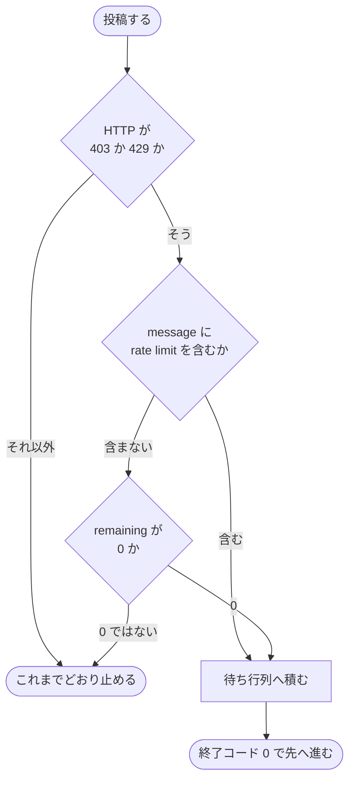

# 担当 C — GitHub が使えない間も収束ループを進める（#291）

- issue: [#291](https://github.com/devbasex/ai-plugins/issues/291)
- ブランチ: `feat/issue-291-offline-queue`
- モード: `architecture`

この文書は受け入れ条件・設計・決定の記録・テスト設計を持つ。実装はこの文書のマージと、
**担当 B（#271 / #327）のマージ**の後に行う。

## 用語

| 語 | この文書での意味 |
| --- | --- |
| 控え | 一度取った値を状態ファイルへ持ち、以降は通信せずにそこから読むこと |
| 待ち行列 | 投稿できないときに、投稿する内容を順序付きでローカルへ積む仕組み |
| 積む | 待ち行列へ項目を 1 件足すこと |
| 流す | 待ち行列の項目を順に GitHub へ送り、送れたものを消すこと |
| 進行側 | 収束ループを回すスクリプト（`state.py` / `refactor.py` / `rotate-pr.sh`） |
| 起動された AI | 進行側が CLI プロセスとして起動する codex / agy |
| メインの文脈 | 進行側を呼び出している会話。ここへ載った文字列は以後のすべての応答に残る |
| 上限 | GitHub の利用回数の上限。一次（毎時の総数）と二次（短時間の集中）を区別する |
| 取得 | GitHub から値を読む呼び出し |
| 投稿 | GitHub の状態を変える呼び出し（レビュー・コメント・返信・解決・close・create） |

**「上限」は待ちの上限ではない。** この文書では GitHub の利用回数の上限だけを指す。待ちの
時間の上限は「待ちの上限」と書き分ける。

## 何を解決するか

| 課題 | 現在の状態 |
| --- | --- |
| 入口で止まる | 上限に達すると `init` の 1 本目の取得で終了コード 1 になり、レビューを 1 巡も進められない |
| 投稿の失敗が結果なしになる | 上限で投稿できなかったレビューは `post_error` として結果なしに落ち、起動し直しても同じ上限に当たる |
| 上限とほかの失敗を区別していない | 権限の誤りも存在しない対象も上限も、同じ「コマンドが失敗しました」で止まる |

## 現状（実測）

### 状態ファイルは新しい値を持てる形になっている

`gh` を模したスクリプトを `PATH` の先頭へ置き、`state.py init 291` を実行して作られた
状態ファイルのキーを読み出した。**待ち行列に関わるキーは 1 つも無い。**

```console
$ python3 state.py init 291 --worktree "$S/wt"   # gh は模したもの
✅ state 初期化: …/wt/.cross_review/cross-review-pr291-state.json
$ python3 -c 'import json;[print(k) for k in json.load(open(P))]'
started_at  max_rounds  rotate_after  only  current_pr  worktree_path  tmp_dir
repo  head_branch  base_branch  pr_author  is_own_pr  event_downgrade
changed_files  auto_review_categories  auto_review_instructions
manual_extra_review_instructions  extra_review_instructions  review_instructions
pr_history  rounds  deferred_nits  carried_over  final
```

24 キーのうち、GitHub から取った値は `repo` / `head_branch` / `base_branch` / `pr_author` /
`changed_files` の 5 つである。**このうち 4 つは既に控えになっている。** ラウンドごとに
読み直しているのは `head_branch`（`_sync_worktree` が `headRefOid` とともに取る）だけである。

`cross-refactoring` 側（`refactor.py` の `cmd_init`）は 31 キーを持ち、GitHub から取った値は
`repo` / `base_branch` / `head_branch` と、作成者から導いた `review_post_note` である。

### 取得と投稿の呼び出しの内訳

`grep -rn 'gh api\|gh pr \|gh repo \|resolveReviewThread'` の結果から、テストと説明文を
除いて数えた。**投稿の 6 件のうち、進行側が行うのは 4 件である。**

| 呼び出し | 種別 | 誰が行うか | 置き場所 |
| --- | --- | --- | --- |
| `gh repo view --json nameWithOwner` | 取得 | 進行側 | `state.py:1046` / `refactor.py:1023` |
| `gh api user --jq .login` | 取得 | 進行側 | `state.py:1118` / `refactor.py:982` |
| `gh pr view --json author` | 取得 | 進行側 | `state.py:1119` / `refactor.py:984` |
| `gh pr view --json headRefName,baseRefName` | 取得 | 進行側 | `state.py:1126-1127` / `refactor.py:988-991` |
| `gh pr view --json headRefOid,isCrossRepository` | 取得 | 進行側 | `state.py:308` |
| `gh api repos/{リポジトリ}/pulls/{番号}/files` | 取得 | 進行側 | `state.py:668` |
| `gh api graphql`（未解決スレッド） | 取得 | 進行側 | `state.py:1508` / `refactor.py:2919` |
| `gh api …/reviews/{識別子}` の照会 | 取得 | 進行側 | `state.py:1417` / `state.py:1466` / `refactor.py:711` |
| `gh pr checkout --detach` | 取得 | 進行側 | `state.py:255` / `state.py:515` |
| レビューの投稿 | 投稿 | **起動された AI** | `launch-codex.sh:69` / `launch-agy.sh:72` の指示 |
| 指摘への返信 | 投稿 | **`fix` のサブエージェント** | `fix` の手順 |
| スレッドの解決 | 投稿 | **`fix` のサブエージェント** | 同上 |
| `gh pr comment` | 投稿 | 進行側 | `rotate-pr.sh:162` / `rotate-pr.sh:262` |
| `gh pr close` | 投稿 | 進行側 | `rotate-pr.sh:163` / `rotate-pr.sh:263` |
| `gh pr create` | 投稿 | 進行側 | `rotate-pr.sh:176` / `rotate-pr.sh:283` |
| `gh pr reopen` | 投稿 | 進行側 | `rotate-pr.sh:53` |

### 失敗の形（gh 2.100.0）

存在しない対象を読ませて、終了コード・標準出力・標準エラーの形を測った。

```console
$ gh api repos/devbasex/ai-plugins/pulls/999999 2>/tmp/e; echo "exit=$?"
exit=1
$ cat /tmp/e
gh: Not Found (HTTP 404)
$ # 標準出力には本文がそのまま出る
{"message":"Not Found","documentation_url":"…","status":"404"}
```

**HTTP の状態は標準エラーの 1 行に `(HTTP <番号>)` の形で出る。** 本文は標準出力へ JSON で
出るため、`message` を読める。応答ヘッダは `-i` を付けたときだけ標準出力の先頭に付く。

```console
$ gh api -i repos/devbasex/ai-plugins | grep -i '^x-ratelimit\|^HTTP'
HTTP/2.0 200 OK
X-Ratelimit-Limit: 5000
X-Ratelimit-Remaining: 4993
X-Ratelimit-Reset: 1788511843
X-Ratelimit-Resource: core
X-Ratelimit-Used: 7
```

**残り回数の照会そのものは上限を消費しない。** 1 度も呼び出していない状態で `used` が 0 を
返した。

```console
$ gh api rate_limit --jq '.resources | {core, graphql}'
{"core":{"limit":5000,"remaining":5000,"reset":1788508290,"used":0},
 "graphql":{"limit":5000,"remaining":5000,"reset":1788508290,"used":0}}
```

GraphQL は上限に達しても HTTP 200 を返し、本文の `errors[].type` に `RATE_LIMITED` を置く
経路がある。**この形は未確認である**（上限に達させていない）。判別は `message` の文字列と
併せて行う。

### #261 の実装が置かれている位置

投稿が届いたことを確かめる検査は 3 段になっている。

| 検査 | 置き場所 | 届いていないときの扱い |
| --- | --- | --- |
| 結果ファイルの `post_error` | `state.py:1724` | 結果なしとして記録し、止める |
| `review_url` の指すレビューの存在（`_review_exists`） | `state.py:1449` / 呼び出しは `1733` | 存在しなければ結果なし。**取得できないときは申告を採用** |
| 申告したコメント数と実数の突き合わせ（`_posted_comment_count`） | `state.py:1401` / 呼び出しは `1754` | 実数が少なければ止める。取得できないときは申告を採用 |

結果なしは `cmd_judge` の終了コード 7（同じラウンドで 1 度だけ起動し直す）へつながり、
2 度目も結果が残らなければ `final = error` になる（`state.py:1804-1828`）。

**上限のもとでは、この経路が 2 回とも同じ上限に当たる。** 起動し直しても投稿できないため、
`final = error` で終わる。

## 受け入れ条件

### 取得を控えの内側へ入れる

1. 状態ファイルがある状態で `init` を実行したとき、`gh` の取得の呼び出しが **0 回**になる。
   現在は再開の経路でも `gh repo view` が 1 回走る（`state.py:1046`）
2. 所有者と名前は `git config --get remote.origin.url` から解決し、`gh` を呼ばない。
   解決できないときだけ `gh repo view` へ落とす
3. 上の 2 つを、`gh` を置き換えたスクリプトで呼び出しを記録して数える

### 上限を検知して待ち行列へ倒す

4. 上限の応答（HTTP 403 で `message` に `rate limit` を含む / HTTP 429）を模したとき、
   進行側の投稿が待ち行列へ積まれ、終了コードが 0 になる
5. 権限の誤り（HTTP 403 で `message` が `Resource not accessible by integration`）と、
   存在しない対象（HTTP 404）を模したとき、**待ち行列へ積まず**現在どおり止まる
6. 判別は標準エラーの `(HTTP <番号>)` と標準出力の `message` の両方を読む。片方だけで
   決めない

### 待ち行列

7. 積んだ項目は `<作業ツリー>/.cross_review/pending/` に 1 項目 1 ファイルで残り、
   名前の連番の順に流れる
8. 同じ内容を 2 度流しても、GitHub 側に 2 件目が作られない。種別ごとの照会で確かめる
9. 流し終えた項目はファイルごと消える。流せなかった項目は `attempts` と `last_error` を
   増やして残る
10. `state.py flush <番号>` を明示で呼べる。進行側の各コマンドの入口でも自動で流れる

### 収束の判定

11. 待ち行列が空でない間は `final = approved` を出さない。終了コードは新設の 8 を返す
12. 待ち行列を流し切った直後に `_review_exists` を 1 度実行し、届いたことを確かめてから
    収束する（#261 の決まりを保つ）
13. 待ち行列へ積んだ投稿は、積んだ時点では `post_error` の検査に掛からない。掛けると
    結果なしになり、起動し直しで同じ内容が二重に積まれる

## 範囲

**この変更で入れるのは、進行側が行う取得と投稿だけである。** 起動された AI と `fix` の
サブエージェントが行う投稿は、この変更では移さない。

| 対象 | この変更で扱うか |
| --- | --- |
| 進行側の取得 9 種 | 扱う。控えの内側へ入れる |
| 進行側の投稿 4 種（`rotate-pr.sh`） | 扱う。待ち行列を通す |
| 待ち行列の仕組みそのもの | 扱う。共通層のモジュールとして作る |
| 収束の判定への組み込み | 扱う |
| 起動された AI が行うレビューの投稿 | 扱わない。受け皿を作ったうえで次の変更で移す |
| `fix` のサブエージェントの返信と解決 | 扱わない。同上 |

**受け皿を先に作る理由は、積む先が無い状態で投稿の責務だけを移すと、上限のときに投稿が
失われるためである。** 待ち行列・冪等の照会・上限の検知が揃ってから責務を移す。

## 設計

### 取得を控えの内側へ入れる

値を 2 つに分ける。

| 区分 | 値 | 扱い |
| --- | --- | --- |
| 変わらない | 所有者と名前 | `git config --get remote.origin.url` から解決する。通信しない |
| 変わらない | 自分のログイン名・作成者・`base_branch` | 一度取って状態ファイルへ持つ。以降は読まない |
| ラウンドごとに変わる | `head_branch` / `headRefOid` / 変更ファイル / 未解決スレッド | 取れなければ**前回の値で続ける**。値が無ければそのラウンドを保留にする |

前回の値で続けるのは、取れないことと値が変わったことを区別できないためである。**古い値で
続けたことは出力へ 1 行残す。** 残さないと、レビューの対象が 1 ラウンド前のものであることに
気づく手がかりが無くなる。

### 待ち行列の置き場所と形

置き場所は状態ファイルと同じ `<作業ツリー>/.cross_review/pending/` とする。1 項目 1 ファイルの
JSON で、名前は `<連番 4 桁>-<種別>-<識別子>.json` である。

```text
<作業ツリー>/.cross_review/
├── cross-review-pr291-state.json
└── pending/
    ├── 0001-pr-comment-291.json
    ├── 0002-pr-close-291.json
    └── 0003-pr-create-291.json
```

| 項目のキー | 意味 |
| --- | --- |
| `seq` | 連番。既存の最大値 + 1。順序はこの値だけが決める |
| `kind` | 種別。冪等の照会をどれにするかを決める |
| `repo` / `pr` | 宛先 |
| `created_at` / `attempts` / `last_error` | 積んだ時刻と、流そうとした回数と、最後の失敗 |
| `request` | `gh api` へ渡す引数。`method` / `path` / `fields` |

連番は `os.open` に `O_CREAT | O_EXCL` を渡して確保する。積むのは進行側の 1 プロセスだけで
あるため関門は要らないが、中断して再開したときに番号が重ならないようにする。

### 流すきっかけ

**自動と明示の両方を持つ。**

| きっかけ | どこで | 流せなかったとき |
| --- | --- | --- |
| 自動 | 進行側の各コマンド（`init` / `start-round` / `read-result` / `judge`）の入口 | 積んだまま先へ進む。工程は止めない |
| 明示 | `state.py flush <番号>` | 残った件数を出力し、終了コードは 0 |

自動だけにすると、上限の回復を待つあいだ何もコマンドを実行していない場合に流れない。明示
だけにすると、進行側が忘れたときに待ち行列が残ったまま収束の判定へ進む。

### 冪等の担保

**流す前に、同じ内容が既に GitHub 側にあるかを種別ごとの照会で確かめる。**

| 種別 | 照会 | 同じとみなす条件 |
| --- | --- | --- |
| Pull Request のコメント | `gh api repos/{リポジトリ}/issues/{番号}/comments --paginate` | 投稿者が自分で、本文が一致 |
| レビューの投稿 | `gh api repos/{リポジトリ}/pulls/{番号}/reviews --paginate` | 投稿者・判定・本文の先頭 80 文字が一致 |
| 指摘への返信 | `gh api repos/{リポジトリ}/pulls/{番号}/comments --paginate` | `in_reply_to_id` と本文が一致 |
| スレッドの解決 | `_fetch_unresolved_threads`（既存） | 識別子が未解決の一覧に無い |
| Pull Request の close | `gh api repos/{リポジトリ}/pulls/{番号} --jq .state` | `closed` である |

本文の先頭 80 文字で比べるのは、`cmd_check_oscillation` が指摘の同一性を測るときと同じ幅で
ある（`OSCILLATION_BODY_CHARS`）。同じ判断に別々の値を持たない。

**Pull Request の作成は待ち行列へ積まない。** 作成が終わるまで新しい番号が決まらず、番号が
決まらないと以降のすべての項目の宛先が決まらない。巻き直しは上限のときに回復を待つ。待つ
あいだラウンドは進まないが、巻き直しは 8 ラウンドに 1 度しか起きない。

### 上限の検知と、ほかの失敗との見分け

判別は 3 つの材料で行う。

| 材料 | 上限のとき | 権限の誤りのとき | 存在しない対象のとき |
| --- | --- | --- | --- |
| 標準エラーの `(HTTP <番号>)` | 403 または 429 | 403 | 404 |
| 標準出力の `message` | `rate limit` を含む | `Resource not accessible` など | `Not Found` |
| `gh api rate_limit` の `remaining` | 0 | 0 ではない | 0 ではない |

**403 だけでは上限と権限の誤りを分けられない。** そのため `message` を併せて読み、なお
決まらないときは `gh api rate_limit` を引く。この照会は上限を消費しない（実測: `used` が 0）。



### 待ち行列が空になるまで収束させない

`cmd_judge` の収束の出口へ、待ち行列が空であることを足す。

| 条件 | 現在の出口 | 変更後の出口 |
| --- | --- | --- |
| ラウンドが通り、引き継ぎが無い | 0（収束） | 待ち行列が空なら 0、空でなければ 8 |
| ラウンドが通らない | 2（修正へ） | 変えない |
| 結果なし | 7（起動し直す） | 変えない |

終了コード 8 を 2 と分けるのは、修正するものが無い状態で修正の工程を起動すると空回りする
ためである。呼び出し側は 8 を受けたら `flush` を試し、流し切れたら判定をもう一度実行する。

### #261 の決まりとの関係

**#261 は「投稿が届いたことを確かめてから収束する」ことを求めている。** 待ち行列は、
確かめる時点を投稿の直後から流した直後へ移す。決まりそのものは変えない。

| 段階 | #261 の検査 | 待ち行列を入れた後 |
| --- | --- | --- |
| 結果を取り込む | `post_error` があれば結果なし | 待ち行列へ積んだ投稿は `queued` が真になり、この検査を通す |
| 結果を取り込む | `review_url` の存在を照会 | `queued` が真のときは照会しない（識別子がまだ無い） |
| 流した直後 | — | `review_url` を書き戻し、`_review_exists` を 1 度実行する |
| 判定 | 結果なしなら起動し直す | 変えない |
| 判定 | 収束 | 待ち行列が空で、かつ `_review_exists` が真のときだけ |

`queued` が真のときに照会しないのは、照会すると結果なしになり、起動し直しで同じ内容が
二重に積まれるためである（受け入れ条件 13）。

### `cross-refactoring` への広げ方

待ち行列は共通層のモジュール 1 本（`queue.py`）として作り、`cross-review` と
`cross-refactoring` の両方が読み込む。**置き場所と相対の指し方の契約は担当 A が定める。**

`cross-refactoring` 側で同じ版に入れるのは 2 箇所に限る。

| 箇所 | 何を変えるか |
| --- | --- |
| `refactor.py` の `cmd_init` | 所有者と名前を git から解決し、作成者と枝名を控えにする |
| `refactor.py` の `cmd_judge_review` | 収束の出口へ待ち行列が空であることを足す |

`refactor.py` が持つ投稿は、起動された AI が行うレビューだけである（`launch-cli.sh:141` の
指示）。**進行側が行う投稿は無いため、待ち行列へ積む対象がこの版では発生しない。**

## 「決めること」への答え

| 決めること | 答え |
| --- | --- |
| 投稿を誰が行うか | 進行側が行う形へ移す。`gh` のラッパを `PATH` へ置く形は採らない |
| 進行側が本文を持つことと設計方針の関係 | 本文を読むのは**進行側のスクリプト**であり、メインの文脈へは載せない。判定に使うのは結果ファイルの判定と重要度だけで、これは現在も進行側が読んでいる |
| 待ち行列の置き場所 | 状態ファイルと同じ `<作業ツリー>/.cross_review/pending/` |
| 流すきっかけ | 自動と明示の両方 |
| 上限の待ち方 | 積んで先へ進む。巻き直しだけは回復を待つ |
| `cross-refactoring` の扱い | 共通層のモジュールを両方が読み込む。置き場所は担当 A の契約に従う |

## 決定の記録

### 決定 1: `gh` のラッパを `PATH` へ置く形は採らない

横取りは `gh` を経由した投稿だけに効く。起動された AI が `curl` や MCP で投稿すると素通り
する。また、`PATH` の渡り方はランタイムごとに違う（`launch-agy.sh` は `--add-dir` で作業
ツリーを渡し、現在地を作業領域にしない）。**4 ランタイムそれぞれで `PATH` が届くことを
確かめ続ける必要が生じる。**

投稿の入口を進行側へ 1 本化すれば、経由する経路が 1 つに決まる。指示ではなくコードで
担保できる。

### 決定 2: 投稿の責務の移管は、この変更では行わない

移管には `launch-codex.sh` / `launch-agy.sh` のプロンプトの書き換え、結果ファイルの
スキーマの変更、`fix` の手順の書き換えが要る。受け皿（待ち行列・冪等の照会・上限の検知）と
同じ Pull Request へ入れると、変更が 2 つの層にまたがる。

**受け皿だけでも 2026-09-03 に起きた事象は解決する。** あの事象は `init` の 1 本目の
取得で止まったものであり、控え化と上限の検知が対象である。

### 決定 3: 待ち行列は作業ツリーの中へ置く

利用者ごとの領域へ置くと、別のリポジトリ・別の Pull Request の項目が同じディレクトリへ
混ざる。どれを流してよいかを決めるために、項目ごとに宛先のリポジトリを照合することになる。

作業ツリーの中へ置けば、巻き直しで作業ツリーを捨てるときに待ち行列も一緒に捨てられる。
**捨ててよいのは、巻き直しが close と create を待ち行列へ積まないためである**（積む対象は
その Pull Request 宛のコメントだけで、Pull Request ごと捨てるなら宛先も無くなる）。

### 決定 4: 上限のときは進行を止めない

このリポジトリの方針であり、`_fetch_unresolved_threads` と `_review_exists` が既に採って
いる扱いと同じである（取得できないことと 0 件を区別し、取得できないときは進む）。待ち行列は
この扱いを投稿の側へ広げる。

### 決定 5: 収束の出口だけを塞ぐ

止めるのは `final = approved` を出すところだけとする。レビューも修正もローカルで進み、
判定も記録される。**未反映のまま「両方が承認した」と記録しないことが、この課題で守る
一線である。**

### 決定 6: 上限の判別に応答ヘッダを使わない

`x-ratelimit-remaining` は `gh api -i` を付けたときだけ得られ、`gh pr` の系列には `-i` が
無い（`gh pr comment` / `gh pr close` / `gh pr create`）。ヘッダを判別の材料にすると、
`gh api` を通る呼び出しだけが正しく判別され、`gh pr` の系列が判別できない。

標準エラーの `(HTTP <番号>)` と標準出力の `message` は、どちらの系列でも同じ形で得られる。

## テスト設計

**GitHub は呼ばない。** `gh` を置き換えたスクリプトを `PATH` の先頭へ置き、応答を模す。
既存のテストが同じ手を採っている（`test_state_not_posted.py` / `test_state_sync_worktree.py`）。

### 上限の応答を模す形

```bash
cat >"$FAKE/gh" <<'EOS'
#!/usr/bin/env bash
case "${GH_FAKE_MODE:-ok}" in
  rate_limit)
    echo '{"message":"API rate limit exceeded for user ID 10234200.","status":"403"}'
    echo "gh: API rate limit exceeded for user ID 10234200. (HTTP 403)" >&2
    exit 1 ;;
  secondary)
    echo '{"message":"You have exceeded a secondary rate limit.","status":"403"}'
    echo "gh: You have exceeded a secondary rate limit. (HTTP 403)" >&2
    exit 1 ;;
  forbidden)
    echo '{"message":"Resource not accessible by integration","status":"403"}'
    echo "gh: Resource not accessible by integration (HTTP 403)" >&2
    exit 1 ;;
  not_found)
    echo '{"message":"Not Found","status":"404"}'
    echo "gh: Not Found (HTTP 404)" >&2
    exit 1 ;;
  *) echo "[]" ;;
esac
EOS
```

終了コード・標準出力・標準エラーの形は実測に合わせた（「失敗の形」の節）。

### 検査の一覧

| 受け入れ条件 | 何で確かめるか | 置き場所 |
| --- | --- | --- |
| 1 / 2 / 3 | 模した `gh` の呼び出しを記録し、再開の `init` で 0 回であることを見る | `tests/test_state_offline_fetch.py` |
| 4 | `rate_limit` と `secondary` の 2 つで、待ち行列へ 1 件積まれ終了コードが 0 になる | `tests/test_state_queue.py` |
| 5 | `forbidden` と `not_found` で、待ち行列が空のまま終了コードが 1 になる | 同上 |
| 6 | HTTP の番号だけが 403 で `message` が上限を指さない応答で、積まれないことを見る | 同上 |
| 7 | 3 件を積み、ファイル名の連番の順に流れることを見る | 同上 |
| 8 | 同じ内容を 2 度流し、2 度目が照会だけで終わることを見る（種別 5 つそれぞれ） | `tests/test_queue_idempotency.py` |
| 9 | 流せなかった項目の `attempts` が 1 増え、`last_error` が入ることを見る | `tests/test_state_queue.py` |
| 10 | `flush` の副コマンドと、`judge` の入口の自動の両方で流れることを見る | 同上 |
| 11 | 待ち行列に 1 件ある状態で、両方が承認したラウンドの判定が 8 を返すことを見る | `tests/test_state_queue_judge.py` |
| 12 | 流し切った直後に `_review_exists` が 1 度だけ呼ばれることを見る | 同上 |
| 13 | `queued` が真の結果を取り込むとき、`_review_exists` を呼ばないことを見る | 同上 |

既存の #261 のテスト 2 本（`test_state_not_posted.py` / `test_state_posted_comments.py`）は
**変更せずに通ること**を完了の判定に含める。`queued` を持たない結果ファイルの扱いは変えない
設計だが、通ることは未確認である。実装のときに実行して確かめる。

完了判定の証跡は次の 1 つとする。

```bash
uv run --with pytest pytest scripts/tests plugins/ndf -q
```

## 担当をまたぐ調整

| 相手 | 何を調整するか |
| --- | --- |
| 担当 B（#271 / #327） | **担当 B のマージ後に起点を取り込む。** 積む対象は担当 B が減らした後の呼び出しである。担当 B の設計は着手の時点で確定しているため、控えにする値の一覧はそこから受け取る |
| 担当 B（#327） | 継続的統合の照会も「GitHub が返らないとき」を扱う。**進行を止めない側へ倒す**方針は共通で、判別の材料（標準エラーの `(HTTP <番号>)` と `message`）を同じ形にする |
| 担当 A（#285 / #280） | 待ち行列のモジュールは共通層へ置く。**置き場所と相対の指し方の契約は担当 A が定める**。担当 C はその契約に従って読み込む |
| 担当 E（#330 / #329 / #286） | `state.py` へ副コマンド `flush` を足す。`help` 文字列は担当 E の領分であるため、**新設分の `help` は 1 行の説明にとどめ、既存の文言に触れない** |

**担当 B の設計が着手の時点で出ていない場合は、#271 の本文の提案をそのまま前提に置き、
控えにする値の一覧を担当 B の決定を受けて確定する。**

## 未確認のまま残ること

| 項目 | 内容 |
| --- | --- |
| 一次の上限に達したときの `gh` の出力 | 上限へ達させていないため、`message` の文字列は #291 の本文に記録された 1 例（`GraphQL: API rate limit already exceeded for user ID 10234200.`）だけを根拠にしている |
| 二次の上限の形 | `Retry-After` ヘッダが付くかは未確認。判別には使わない設計にしたため、この直しの判断には要らない |
| GraphQL が HTTP 200 で `RATE_LIMITED` を返す形 | 未確認。`gh api graphql` が終了コード 1 と `message` を返すことは #291 の本文の実例で確かめられる |
| 既存の #261 のテスト 2 本が変更なしで通ること | 未確認。実装のときに確かめる |
| 待ち行列に項目が残ったまま作業ツリーを捨てたときの扱い | 巻き直しの経路で起きうる。決定 3 で「捨ててよい」と判断したが、実際の巻き直しで確かめていない |

## 範囲外として起票すべき事項

| 見つけたこと | なぜこの変更の範囲外か | 扱い |
| --- | --- | --- |
| 起動された AI と `fix` のサブエージェントが行う投稿を、進行側へ移す | プロンプト・結果ファイルのスキーマ・`fix` の手順の 3 層にまたがる。受け皿が入ってから移す（決定 2） | 起票する |
| `rotate-pr.sh` は `gh pr create` に失敗したとき `gh pr reopen` で戻すが、reopen 自体が上限で失敗すると Pull Request が閉じたまま残る | 巻き直しの取り消しの経路であり、待ち行列が扱う「積んで先へ進む」対象の外にある（決定 3 で巻き直しは待つと決めた） | 起票する |
| `_posted_comment_count` は `--paginate --jq length` の出力をページごとに数えて合計するため、`jq` の出力が 1 行にならない環境で値がずれうる | #261 の実装の内側の課題で、待ち行列の有無に関わらない | 起票する |
| `state.py init` の再開の経路が `gh repo view` を 1 回呼ぶ | 受け入れ条件 1 で扱う | 起票しない。この変更の範囲内である |
