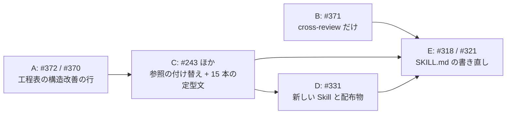

# 並行開発 バッチ 08 — 全体指示

マイルストーン v10.3.0 の 10 件を進めるための指示書である。**各担当は、この文書と自分の
担当ファイルの両方を読んでから着手する。** この文書は、担当どうしが同じ行を書き換えない
ための境界と、着手の順序と、担当をまたぐ約束を定める。担当ファイルだけでは、境界と順序が
分からない。

## 着手する前に知っておくこと

| 項目 | 現在の状態 |
| --- | --- |
| 現行版 | **`10.2.0`**（`main` と `develop` が同じ位置にある） |
| 次に出す版 | **`10.3.0`**。開発版は `10.3.0-dev.1` から |
| 開発の起点 | **`develop`**。`.ndf/worktree.json` の `base_branch` が宣言している |
| Pull Request の宛先 | **`develop`**。`--base develop` を必ず付ける |
| 配布の時期 | **このバッチのマージがすべて終わった後**。個別には版を上げない |
| `/goal` で工程を通すとき | 設計レビューのマージ前で 1 度止まり、承認を待つ |
| Skill の実体数 | 33 個。このバッチで **2 個増えて 35 個**になる |

## 10 件の主題

**主題は 3 つに分かれる。**

| 主題 | 課題 | 何を変えるか |
| --- | --- | --- |
| 収束ループの既定 | #372 / #370 / #371 | 誰がレビューし、いつ止め、どの工程で呼ぶかを 2 つの Skill で揃える |
| 工程の記録 | #287 / #281 / #282 / #243 | 進行をどこへ何の形で残すかを 1 つの Skill へ集める |
| 課題と承認の扱い | #331 / #318 / #321 | 蓄積した課題の手入れと、承認を求めるときの提示物を決める |

## 用語

| 語 | この文書での意味 |
| --- | --- |
| 担当 | 1 件以上の課題を最後まで進める実行主体。1 担当 = 1 作業ツリー = 1 Pull Request |
| 工程表 | `development-workflow/SKILL.md` の「モードごとに起動する Skill」の表 |
| 盤面 | GitHub Projects v2 のプロジェクト 1 つ |
| 母集合 | 収束ループが担当を選ぶ元になる CLI の集合 |
| 収束 | 収束ループへ新しい指摘が出なくなり、判定が終了の値を出した状態 |
| 手入れ | 既存の課題の本文・マイルストーン・ラベルを現状に合わせること |
| 対象リポジトリ | Skill を実行する先のリポジトリ。**ai-plugins 自身とは限らない** |

**「工程表」はこのバッチで 3 担当が触る。** 誰がどの行を触るかは「担当と課題」の下の境界表が
持つ。

## 担当と課題

| 担当 | 課題 | モード | ブランチ | 指示書 |
| --- | --- | --- | --- | --- |
| A | ラウンド内のレビューを軽くし、構造改善の既定を移す（#372 / #370） | `architecture` | `feat/issue-372-370-refactoring-default` | [01-issue-372-370.md](01-issue-372-370.md) |
| B | レビュワーの母集合と終了基準を揃える（#371） | `architecture` | `feat/issue-371-review-pool` | [02-issue-371.md](02-issue-371.md) |
| C | 進行の記録を 1 つの Skill へ集める（#243 / #282 / #281 / #287） | `architecture` | `feat/issue-243-progress-tracking` | [03-issue-243-282-281-287.md](03-issue-243-282-281-287.md) |
| D | 課題の一覧を手入れする手順を作る（#331） | `architecture` | `feat/issue-331-issue-upkeep` | [04-issue-331.md](04-issue-331.md) |
| E | 承認の提示物を決め、工程の到達点を置き直す（#318 / #321） | `standard` | `fix/issue-318-321-approval` | [05-issue-318-321.md](05-issue-318-321.md) |

各担当の指示書は**受け入れ条件・設計・決定の記録・テスト設計**を持つ。実装へ入る前にその
文書を読む。

## 着手の順序

**逐次で進める。** 5 担当のうち 4 担当が `development-workflow` の配下を触るため、同時に
進めると同じ行の衝突が繰り返し起きる。

| 順 | 担当 | 直前の担当を待つ理由 |
| --- | --- | --- |
| 1 | A | 工程表の「構造改善」と「Pull Request」の行を書き換える。以降の担当はこの形を前提にする |
| 2 | B | 触るのは `cross-review` の配下だけで、他の担当と重ならない。A と同時に進めてよい |
| 3 | C | 15 本の `SKILL.md` の定型文を置き換える。A が書き換えた行の上に載る |
| 4 | D | 配布物（`manifests/*-skills.txt` と Skill 数の記載）を C と同じ箇所で触る |
| 5 | E | `SKILL.md` 全体を 300 行以内へ書き直す。**A と C の変更を取り込んでから行う** |

## 境界

**同じファイルを触る担当を、行の単位で分ける。**

| ファイル | A | B | C | D | E |
| --- | --- | --- | --- | --- | --- |
| `development-workflow/SKILL.md` | 工程表の 2 行と関連する注記 | — | 定型文 1 行と参照の付け替え | — | **全体の書き直し** |
| `development-workflow/references/projects-tracking.md` | 対応表の 1 行 | — | **新しい Skill へ移設** | — | — |
| `development-workflow/references/workflow-modes.md` | 退避先の条件を追記 | — | — | — | 注記の移し先 |
| `cross-refactoring/` | すべて | — | 定型文 1 行 | — | — |
| `cross-review/` | Step 7 の呼び方 | すべて | 定型文 1 行 | — | — |
| `plugins/ndf/scripts/lib/` | — | 認証確認を追加 | 盤面の解決を追加 | — | — |
| `manifests/*-skills.txt` | — | — | 1 行追加 | 1 行追加 | — |
| `README.md` / `plugins/ndf/README.md` の Skill 数 | — | — | +1 | +1 | — |

**C と D は Skill の数を 1 つずつ増やす。** 後に着手する D は、C がマージした後の数（34）を
基準に +1 して 35 にする。`scripts/check-doc-staleness.py` が実体数と記載を突き合わせるため、
どちらかが古い数のままだと落ちる。

## 担当をまたぐ約束

### 1. 工程表の行を増やさない

**工程名は 4 箇所が同じ並びを持つ**（工程表・`projects-tracking.md` の対応表・
`projects-common.sh` の `PJ_STAGES`・盤面の単一選択）。#231 の検査がこの 4 つを突き合わせる。
行を足すと 4 箇所すべてと盤面の設定を直すことになるため、このバッチでは**既存の 15 行の中で
表現する**。

### 2. 進行の記録の呼び方は C が決める

C がマージされるまでは、既存の呼び方（各 `SKILL.md` の定型文）をそのまま使う。C の後に着手
する D と E は、C が置いた 1 行の形へ合わせる。

### 3. 認証の確認は B が共通層へ置く

A も参加 CLI の起動を扱うが、確認の実装は増やさない。B が `cross-refactoring` の
`check_auth` を共通層へ移し、`cross-review` から呼ぶ。A は移設後の位置を前提にしてよい
（A のマージが先なら、A は既存の位置のままでよい）。

### 4. 範囲外の課題はその場で起票する

`out-of-scope` の 3 択（起票する / 範囲内へ入れる / 起票しない）で判断し、3 つ目も理由を
1 行残す。起票した番号は担当の完了報告に並べる。

## 配布

**このバッチのマージがすべて終わった後に 1 度だけ版を上げる。** 担い手は最後のマージを
行った担当である。手順は `/ndf:release` にある。版数を持つ 15 箇所と、検査に載らない
2 箇所は `AGENTS.md` の「版の付け方と開発版の配布」が一覧を持つ。
