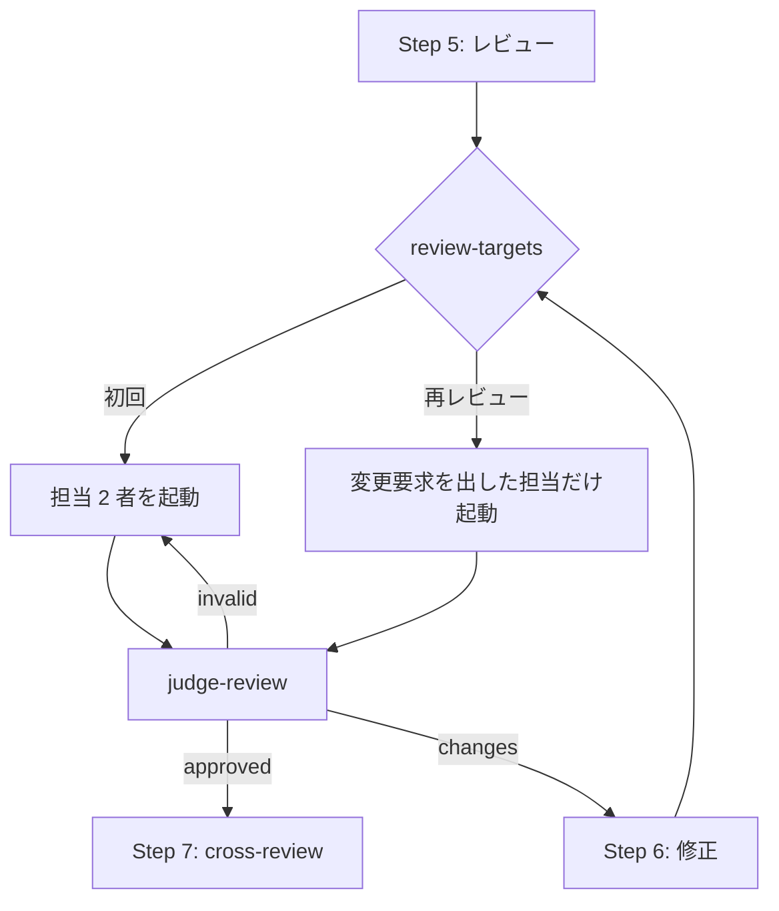

# 372 / 370: ラウンド内のレビューを軽くし、構造改善の既定を移す

`cross-refactoring` は修正のたびにレビュー担当 2 者を起動し直す。後段で Pull Request 全体を
`cross-review` にかけるため、同じ差分が二重にレビューされている（#372）。工程表の「構造改善」は
4 モードとも `refactoring` を指しており、何を直すかの発見と直した結果の評価が作業した AI 自身に
閉じている（#370）。全体の境界と着手の順序は [00-overview.md](00-overview.md) にある。

## 受け入れ条件

**#372（ラウンド内のレビューを軽くする）**

- [ ] ラウンドあたりの CLI 起動回数が減り、削減量が `docs/02-apply-and-review.md` の
      「なぜラウンド単位か」の表と同じ形で書かれている
- [ ] レビュー担当の人数が変わっても、判定と投稿確認（`judge-review`）が矛盾なく動く
- [ ] 取り消しの単位（改善項目ごと）が保たれている
- [ ] 後段の cross-review との役割の切り分けが Step 7 に書かれている
- [ ] 軽くしたことで失う検出を、どこで補うかが書かれている

**#370（構造改善の既定を移す）**

- [ ] 工程表の「構造改善」が `cross-refactoring` を指し、モードごとの要否が書かれている
- [ ] cross-refactoring を使わない条件と、そのときの退避先が書かれている
- [ ] 工程の並びが cross-refactoring の前提（open な Pull Request）と矛盾しない
- [ ] `refactoring` と `cross-refactoring` の関係が両方の SKILL.md で一致している
- [ ] `references/projects-tracking.md` の対応表と工程表が食い違わない

## 用語

| 語 | この文書での意味 |
| --- | --- |
| ラウンド | `cross-refactoring` の提案 1 巡。適用・レビュー・修正を含む |
| 再レビュー | 修正の後に同じラウンドでもう一度行うレビュー |
| 初回レビュー | そのラウンドで最初に行うレビュー |
| 退避先 | 前提を満たせないときに代わりに通す Skill |

## 構成要素

| 要素 | 責務 |
| --- | --- |
| `refactor.py` の `cmd_judge_review` | 変更要求を出した担当を状態へ記録する |
| `refactor.py` の `cmd_review_targets`（新設） | 次に起動するレビュー担当を返す。初回は 2 者、再レビューは変更要求を出した担当だけ |
| `refactor.py` の `judge` | 起動しなかった担当の判定を前回の結果から引き継ぐ |
| `docs/02-apply-and-review.md` | Step 5 の起動を `review-targets` 経由へ書き換え、削減量と失うものを書く |
| `SKILL.md`（`cross-refactoring`） | Step 7 の `cross-review` へ渡す観点を書く |
| `development-workflow/SKILL.md` | 工程表の「構造改善」と「Pull Request」の行を書き換える |
| `development-workflow/references/workflow-modes.md` | 退避先の条件を書く |
| `refactoring/SKILL.md` | `cross-refactoring` との関係を書く |

## 入出力の契約

### `refactor.py review-targets <ID> <ラウンド>`

| 項目 | 内容 |
| --- | --- |
| 入力 | 収束ループの識別子とラウンド番号 |
| 出力 | `REVIEW_TARGETS='<担当名の空白区切り>'` と `REVIEW_TARGETS_CSV=<カンマ区切り>` |
| 失敗の形 | ラウンドが存在しない場合は終了コード 1。担当が 0 人になる場合も 1（判定できない状態を進めない） |
| 互換性 | 新しい副コマンド。既存の呼び出し側は変わらない |

**初回と再レビューの区別は状態が持つ。** 呼び出し側は同じコマンドを 2 回呼ぶだけで、どちらか
を引数で伝えない。ラウンドの状態に `fix_reviewers` があれば再レビュー、無ければ初回である。

### 状態ファイルの差分

ラウンドの記録へ 2 つのキーを足す。

| キー | 型 | 意味 |
| --- | --- | --- |
| `fix_reviewers` | 文字列の配列 | 直前の判定で変更要求を出した担当。修正の後の再レビューの対象になる |
| `reviews[<担当>].carried_from_round_fix` | 整数 | その担当の判定を、何回目の修正の前から引き継いだか。起動した担当には付かない |

**`reviewers` は変えない。** ラウンドの担当は輪番が決めた 2 者のままで、そのうち誰を起動し直す
かだけが変わる。担当の記録を書き換えると、これまでのラウンドの記録と突き合わせられなくなる。

既存の状態ファイルにこの 2 つは無い。**無いときは初回レビューとして読む**ため、中断した実行を
再開しても壊れない。

## 処理の流れ

**`invalid`（差し戻し）は 2 者へ戻す。** 差し戻しは結果の形が判定に使えない状態であり、修正の
成否とは別である。承認した担当の結果も読めていない可能性があるため、絞らない。

## 決定の記録

### 決定 1: 再レビューは変更要求を出した担当だけにする

修正は指摘への対応であり、指摘を出していない担当が読む差分は、その担当が承認した内容に対する
他者の指摘への対応である。範囲外を触った修正は進行側の機械検証（`--scope` の逸脱・差分予算・
テスト）が既に拾う。

レビュー担当を 1 者へ減らす案は採らない。2 者は並列に起動するため待ち時間は遅い方に律速され、
短縮が限定的である一方、7 回目の実測では 3 者のうち 1 者だけが 5 件の指摘を出しており、輪番に
よってはその 1 者が外れる。

### 決定 2: ラウンド内のレビューを廃さない

最も軽くなるが、収束しない改善項目を項目単位で取り消せるのは、ラウンドの差分に対してその場で
判定しているからである。集約すると複数ラウンドの差分が混ざり、取り消しの単位が保てない。

### 決定 3: 重さを選ぶ引数を増やさない

`--reviewers N` のような引数を置くと、判定と投稿確認が担当の人数ごとに分岐し、組み合わせの
検証が増える。既定を軽くすれば、案件ごとに選ぶ必要が無い。

### 決定 4: 後段の cross-review には範囲を絞って渡す

Step 7 は Pull Request 全体を見る工程である。ラウンド内で見た観点（改善項目そのものの妥当性・
振る舞いの保存）は済んでいるため、`--focus` で**ラウンドを跨いだ整合**へ寄せる。渡す文言は
`SKILL.md` が定型として持つ。

### 決定 5: `--max-fix-rounds` の既定を変えない

現在の `3` を変える根拠となる実測が無い。再レビューの担当が減っても、修正の回数の上限は
指摘の質で決まる。

### 決定 6: 構造改善の既定は `architecture` と `legacy-refactor` に置く

`legacy-refactor` は構造改善そのものが目的の変更であり、`architecture` は複数モジュールに
またがるため、発見を別のランタイムへ分ける価値が大きい。`standard` の構造改善は変更のついでの
小さな整理になりやすく、4 CLI を複数ラウンド動かす費用に見合わない。

`standard` でも `cross-refactoring` を選べる。既定を `refactoring` に置くだけで、禁じない。

### 決定 7: 工程表の行を増やさず、「Pull Request」の行に注記を置く

`cross-refactoring` は open な Pull Request の上で回る。工程表では Pull Request が構造改善より
後にあるため、この Skill を使うモードでは `pr` を構造改善の前に 1 度呼び、Draft で開く。

行を分ける案は採らない。工程名は 4 箇所が同じ並びを持ち（[00-overview.md](00-overview.md) の
「工程表の行を増やさない」）、行を足すと盤面の設定まで変わる。

### 決定 8: 退避先は `refactoring` 単独とする

3 つの条件のいずれかに当たるとき、`cross-refactoring` を使わない。

| 条件 | 理由 |
| --- | --- |
| 振る舞い不変を示すテストが無い | `--baseline-test` が必須で、無ければ適用の検証が成り立たない |
| 参加 CLI のいずれかが未認証、または導入されていない | `init` が中断する |
| `--scope` を絞れない（対象が定まらない） | 提案が発散し、Pull Request が肥大する |

**退避したことを完了報告へ残す。** 条件に当たったかどうかは、後から差分だけを見ても分からない。

### 決定 9: 構造改善で cross-refactoring を通したら、工程表の「レビュー」を重ねて呼ばない

`cross-refactoring` の Step 7 は Pull Request 全体を `cross-review` にかける。工程表の
「レビュー」が求めるものと同じであるため、その実行をもって満たす。構造改善の後に実装の差分が
増えた場合だけ、改めて `cross-review` を呼ぶ。

## テスト設計

| 受け入れ条件 | 何で確かめるか |
| --- | --- |
| 再レビューが変更要求を出した担当だけになる | `review-targets` が、`fix_reviewers` を持つラウンドでその担当だけを返す単体テスト |
| 起動しなかった担当の判定を引き継ぐ | 承認済み担当の結果ファイルを消さずに `judge-review` を通し、`approved` になることを確かめる単体テスト |
| 担当が 0 人になる状態で進まない | `fix_reviewers` が空のラウンドで `review-targets` が終了コード 1 を返す単体テスト |
| 差し戻しは 2 者へ戻る | `invalid` の判定の後に `review-targets` が 2 者を返す単体テスト |
| 既存の状態ファイルを読める | `fix_reviewers` を持たない状態ファイルで初回として扱われる単体テスト |
| 取り消しの単位が保たれる | 既存の `test_abandon_items.py` が変わらず通る |
| 工程表と対応表が食い違わない | `scripts/tests/` の工程名の突き合わせ（#231 の検査）が通る |
| 両方の SKILL.md で関係が一致する | `refactoring` と `cross-refactoring` の双方が相手を指し、条件の記述が同じであることを目視で確かめる |

## 未確認のまま残ること

| 項目 | 内容 |
| --- | --- |
| 削減量の実測 | 7 回目の実測は 1 本のみで、ラウンド数も 4 と少ない。前後の比較は同じ Pull Request で取り直すまで確定しない |
| 判定一致率の意味 | 0.40〜0.67 という値が、2 者目の寄与を測るのに十分な標本かは分からない |
| `standard` での選択の頻度 | 既定を `refactoring` に置いたとき、実際に `cross-refactoring` が選ばれるかは記録が貯まってから見直す |
