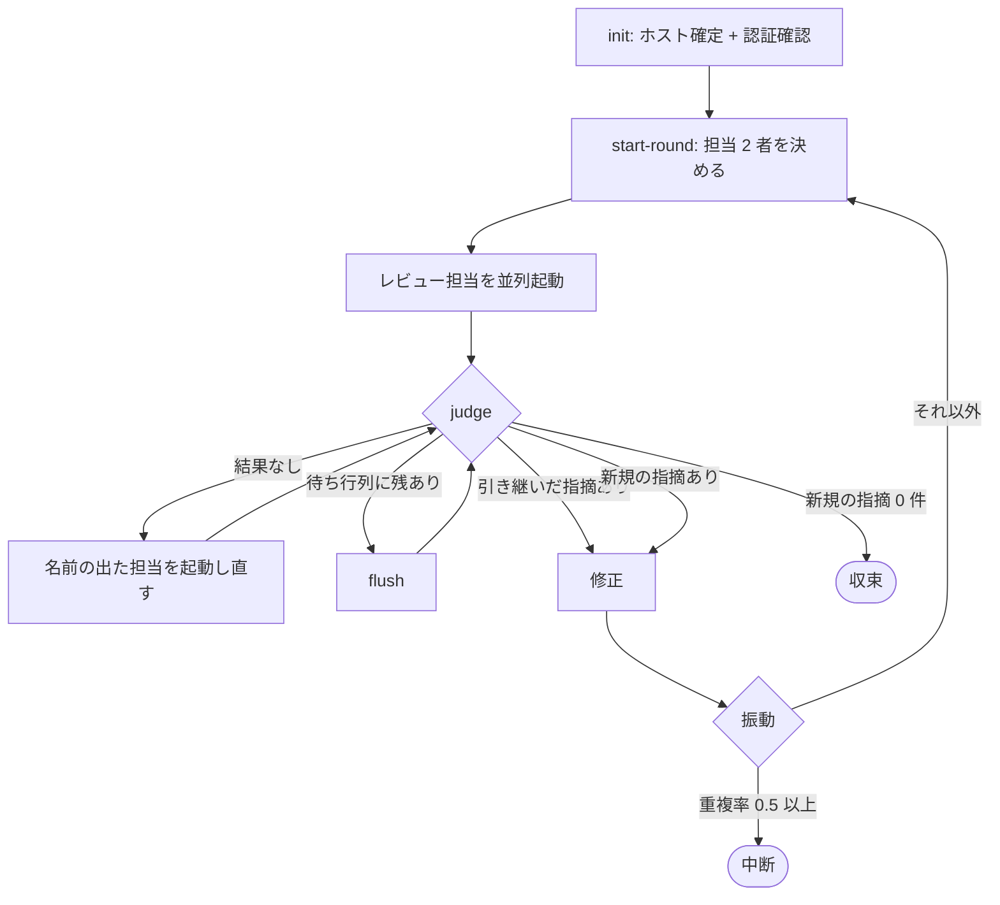

# 371: レビュワーの母集合と終了基準を揃える

`cross-review` はレビュワーを `codex` / `agy` の名指しで固定し、両者が `APPROVE` を返すまで
回る。ホストの概念が無いため、Claude Code 以外から呼んだときに自分自身をレビュワーへ含める。
終了基準は最も止まらない参加者に律速される。全体の境界と着手の順序は
[00-overview.md](00-overview.md) にある。

## 受け入れ条件

- [ ] レビュワーの母集合がホストとの関係で定義され、ホストを指定する手段がある
- [ ] 参加 CLI の認証を起動前に確認し、欠けたまま進まない
- [ ] 終了基準が「全員 `APPROVE`」以外の条件で書かれ、振動検知・引き継ぎ判定との関係が
      1 箇所に整理されている
- [ ] ラウンド上限の既定に根拠が書かれている
- [ ] 既存の状態ファイルの形式（`docs/04-contracts.md`）との差分が示されている

## 用語

| 語 | この文書での意味 |
| --- | --- |
| ホスト | この収束ループを起動している CLI 自身 |
| 母集合 | レビュー担当を選ぶ元になる CLI の集合 |
| レビュー担当 | そのラウンドで実際に起動する CLI |
| 新規の指摘 | そのラウンドの指摘のうち、前のラウンドの指摘と一致しないもの |
| 引き継いだ指摘 | 再開の時点で Pull Request に残っていた未解決の指摘 |

## 構成要素

| 要素 | 責務 |
| --- | --- |
| `lib/assignment.py` の `review_assign`（新設） | ラウンド番号とホストから、レビュー担当 2 者を返す |
| `lib/auth.py`（新設） | 参加 CLI の認証を確認する。`cross-refactoring` から移す |
| `state.py` の `cmd_init` | `--host` を受け取り、ホストを確定して状態へ書く。認証を確認する |
| `state.py` の `cmd_start_round` | そのラウンドのレビュー担当を決めて状態へ書く |
| `state.py` の `cmd_judge` | 新規の指摘の件数で収束を判定する |
| `state.py` の `_finding_key`（新設） | 指摘を一致の判定に使える形へ揃える。振動検知と共有する |
| `scripts/launch-reviewer.sh`（新設） | 共通層の `lib/launch-cli.sh` を通して 4 CLI のいずれかを起動する |
| `scripts/launch-codex.sh` / `launch-agy.sh` | 新しい入口への薄い委譲として残す |
| `docs/01-state-and-review.md` | 母集合・担当の決め方・終了基準を書く |
| `docs/04-contracts.md` | 状態ファイルの差分を書く |

## 入出力の契約

### 引数の追加

| 引数 | 意味 | 既定 |
| --- | --- | --- |
| `--host claude\|codex\|agy\|kiro` | この収束ループを起動している CLI | 環境変数から推定。推定できなければ失敗する |

**推定できないときに既定を置かない。** 誤ると母集合が狂い、ホストが自分自身をレビューする。
`cross-refactoring` と同じ扱いにする（`lib/assignment.py` の `detect_host`）。

`--only <ランタイム>` は残す。受け付ける値は母集合の 4 つに広げる。

### `lib/assignment.py review_assign(round_no, host) -> list[str]`

| 項目 | 内容 |
| --- | --- |
| 入力 | ラウンド番号（1 以上）とホスト名 |
| 出力 | レビュー担当 2 者の名前 |
| 失敗の形 | ラウンド番号が 0 以下、またはホストが母集合の外のとき `AssignmentError` |

母集合は `review_pool(host)`（全ランタイム − ホスト）の 3 者である。**外す 1 者を
`(round_no - 1) % 3` で回す。** 既存の `assign()` は実装担当を先に決めてから残りを絞るが、
この工程に適用の役は無いため、母集合から直接 2 者を選ぶ。

### 状態ファイルの差分

`docs/04-contracts.md` の `state.json` へ 3 つを足す。

| キー | 型 | 意味 |
| --- | --- | --- |
| `host` | 文字列 | 確定したホスト名 |
| `host_source` | 文字列 | `explicit`（`--host`）または `env`（環境変数からの推定） |
| `rounds[].reviewers` | 文字列の配列 | そのラウンドのレビュー担当 2 者 |

ラウンドの中の担当ごとの記録は、これまで `codex` / `agy` の 2 つのキーだった。**キーの名前を
担当名にする方式は変えず、取りうる名前が 4 つに増える**。

**`host` を持たない状態ファイルは、`reviewers` を `["codex", "agy"]` として読む。** 中断した
実行を再開したときに、母集合の変更で担当が入れ替わらないようにする。

### `judge` の出力

固定名の 2 変数を、担当名を含む 1 変数へ置き換える。

| 変更前 | 変更後 |
| --- | --- |
| `CODEX_INTENT=APPROVE` / `AGY_INTENT=REQUEST_CHANGES` | `REVIEWER_INTENTS='codex=APPROVE agy=REQUEST_CHANGES'` |
| — | `NEW_FINDINGS=<新規の指摘の件数>` |

`CARRIED_OVER_THREADS` と `PENDING_POSTS` は変えない。

## 終了基準

**3 つの層を、この順で見る。** いずれも同じ一致の判定（位置・近傍 3 行・本文）を使う。

| 順 | 層 | 見るもの | 結果 |
| --- | --- | --- | --- |
| 1 | 引き継ぎ | 再開の時点で残っていた未解決の指摘 | 修正の工程を 1 度通すまで収束させない |
| 2 | 新規性 | そのラウンドの指摘のうち、前のラウンドと一致しないもの（指摘そのものが 0 件のときも 0 件と数える） | **0 件なら収束** |
| 3 | 振動 | 前のラウンドとの重複率 | 0.5 以上で中断 |

**新規性を振動より先に見る。** 新規が 0 件のラウンドは重複率が 1.0 になるため、順序を逆にすると
収束すべきラウンドが中断として落ちる。

**指摘が 0 件のラウンドは、初回でも収束する。** 新規の指摘が 0 件であることが条件であり、
そもそも指摘が出なかったラウンドはこれを満たす。全員が `APPROVE` を返した初回のラウンドは、
これまでと同じく 1 ラウンドで終わる。

**指摘が 1 件以上あるときだけ、前のラウンドとの一致を見る。** 初回のラウンドには前の
ラウンドが無く、すべての指摘が新規になる。2 回目以降で、前のラウンドと一致する指摘だけが
残った状態が収束の条件である。

再提出された指摘は Pull Request に残る。**最終スイープ（Step 7.5）が残った未解決スレッドを
全て解消する**ため、無視して終わることにはならない。

## 処理の流れ

## 決定の記録

### 決定 1: 母集合を「全ランタイム − ホスト」にする

名指しの固定は、ホストが `codex` か `agy` のときに自分自身をレビュワーへ含める。同じ問題を
`cross-refactoring` は母集合の定義で避けており、実装は共通層の `lib/assignment.py` にある。
`cross-review` から呼べば、2 つの工程で担当の決め方が 1 つになる。

### 決定 2: レビュー担当は輪番で 2 者にする

母集合の 3 者すべてを毎ラウンド起動すると、起動回数が 1.5 倍になる。#372 がラウンド内の
レビューを軽くする方向と逆を向く。輪番にすれば、ラウンドを重ねたときに 3 者すべてが差分を見る。

### 決定 3: 終了基準を「新しい指摘が出ない」にする

全員 `APPROVE` は、最も止まらない参加者に律速される。#156 が観測した 6 ラウンドでは、一方が
round 4 以降 3 ラウンド連続で承認を返す間、もう一方が round 6 まで指摘を出し続け、round 5 の
指摘は修正済みの箇所を指していた。

同じ論点の再提出で止まる形にすると、新しい観点が出る限りは回り、出なくなった時点で止まる。

### 決定 4: 一致の判定を振動検知と共有する

新規性と振動は、同じ「前のラウンドと同じ指摘か」を別の目的で使う。判定を 2 つ持つと、片方
だけが更新されたときに、収束はするのに振動として中断する状態が作れてしまう。

### 決定 5: ラウンド上限の既定を `12` のままにする

#156 が v5.0.0 で計測した 17 本では、平均 4.1 ラウンド・最大 10 ラウンドである。上限は実測の
最大を上回る値に置く。母集合が広がっても、上限が律速する状況（新しい観点が出続ける）の
起きやすさは変わらない。

輪番が 1 周する数（3）へ揃える案は採らない。`cross-refactoring` の上限が輪番 1 周なのは、
適用担当が 1 周する必要があるためである。この工程に適用の役は無い。

### 決定 6: 認証の確認を共通層へ移す

`cross-refactoring` の `check_auth` と `AUTH_PROBES` を `lib/auth.py` へ移し、両方から呼ぶ。
母集合を広げると、導入していない CLI が担当に入りうる。未認証の CLI は起動から短時間で終わり、
結果を残さないまま担当から欠ける。`NDF_SKIP_AUTH_CHECK=1` の逃げ道はそのまま残す。

### 決定 7: レビュワーの起動を 1 本の入口へ寄せる

`launch-codex.sh` と `launch-agy.sh` が別々にあるため、担当が 4 つになると 2 本増える。共通層の
`lib/launch-cli.sh` を通す `launch-reviewer.sh <ランタイム>` を入口にする。既存の 2 本は
薄い委譲として残すため、呼び出し側の手順は段階的に移せる（#293 と同じ形）。

### 決定 8: 再開の互換を状態ファイルの既定で保つ

`host` を持たない状態ファイルは、これまでの 2 者を担当として読む。中断した実行を新しい版で
再開したときに、担当が入れ替わって前のラウンドの記録と突き合わせられなくなることを避ける。

## テスト設計

| 受け入れ条件 | 何で確かめるか |
| --- | --- |
| 母集合がホストとの関係で定義される | `review_assign` が、ホストを含まない 2 者を返す単体テスト（4 つのホストすべて） |
| ホストを指定する手段がある | `--host` を渡した `init` が状態へ `host` と `host_source=explicit` を書く単体テスト |
| 推定できないときに進まない | 手がかりの無い環境で `init` が失敗する単体テスト |
| 認証を起動前に確認する | 未認証を模した確認コマンドで `init` が中断する単体テスト。`NDF_SKIP_AUTH_CHECK=1` で飛ぶことも確かめる |
| 終了基準が新規の指摘で決まる | 前のラウンドと同じ指摘だけが残ったラウンドで `judge` が 0 を返す単体テスト |
| 新規性を振動より先に見る | 重複率 1.0 のラウンドが収束し、中断にならない単体テスト |
| 引き継ぎ判定との順序 | 引き継いだ指摘があるラウンドは、新規 0 件でも修正へ回る単体テスト |
| 状態ファイルの互換 | `host` を持たない状態ファイルで `reviewers` が 2 者になる単体テスト |
| 既存の判定が壊れない | `cross-review/tests/` の既存 39 本（461 件）が通る |

## 未確認のまま残ること

| 項目 | 内容 |
| --- | --- |
| 一致の判定の幅 | 近傍 3 行という値の根拠となる実測はまだ無い（#246 から引き継ぐ） |
| 4 者の母集合での実測 | `kiro` と `claude` がレビュワーに入ったときのラウンド数と指摘の質は、記録が貯まってから見直す |
| 再提出だけで収束したときの取りこぼし | 最終スイープが拾う前提であり、拾い切れなかった例はまだ無い |
