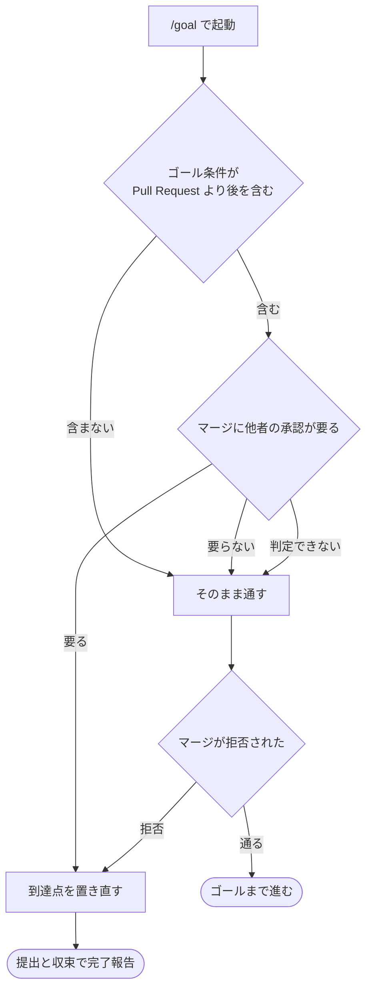

# 318 / 321: 承認の提示物を決め、工程の到達点を置き直す

設計レビューの承認を求める質問に、対象の Pull Request の URL が選択肢の説明の中にしか無い
（#318）。ゴール条件が Pull Request より後の工程を含むとき、マージに他者の承認が要るリポジトリ
では、進めないまま動き続ける（#321）。全体の境界と着手の順序は [00-overview.md](00-overview.md)
にある。

**この担当は最後に着手する。** `SKILL.md` 全体の書き直しを含むため、担当 A と担当 C が同じ
ファイルへ入れた変更を取り込んでから行う。

## 受け入れ条件

**#318（承認の提示物）**

- [ ] 承認を求めるときに提示する項目が表で定まっている
- [ ] Pull Request の URL を生の URL のまま提示する
- [ ] 同じ規定を設計レビューの承認と本番への配布の承認の両方が使い、定義は 1 箇所にある

**#321（到達点の置き直し）**

- [ ] ゴール条件が Pull Request より後の工程を含むとき、着手の時点でマージに他者の承認が
      要るかを判定する
- [ ] 要るときは到達点を Pull Request の提出とレビューの収束へ置き直す
- [ ] 完了報告に、止まった理由と、承認が付いた後に再開する手順が書かれる
- [ ] 判定できないときは、マージを試みて拒否された時点で同じ扱いへ移る

**書き直し**

- [ ] `SKILL.md` が 300 行以内である
- [ ] 判定の基準（モードの定義）と工程表の内容が変わっていない
- [ ] 多義語「環境」が一意な語へ言い換えられている
- [ ] `markdown-writing` のセルフチェック 5 種と多義語の検査が通る

## 用語

| 語 | この文書での意味 |
| --- | --- |
| 他者の承認 | この会話の外にいる人が Pull Request を承認すること |
| 到達点 | `/goal` が満たされたと判断する工程 |
| 提示物 | 承認を求めるときに利用者へ見せる項目 |

## 構成要素

| 要素 | 責務 |
| --- | --- |
| `development-workflow/references/approval-request.md`（新設） | 承認を求めるときの提示物の定義 |
| `development-workflow/SKILL.md` | `/goal` の節で到達点の置き直しを定め、提示物は参照を指す。全体を 300 行以内へ |
| `development-workflow/references/workflow-modes.md` | 工程表の後の注記のうち、条件に当たったときだけ読むものを受け取る |
| `release/SKILL.md` | 本番への配布の承認で、同じ提示物の参照を指す |

## 入出力の契約

### 承認を求めるときの提示物

| 項目 | 書き方 | 理由 |
| --- | --- | --- |
| Pull Request の URL | **生の URL のまま**書く | Markdown のリンクにすると利用者の画面では番号しか見えず、URL を取り出せない（`pr` の完了報告と同じ規約） |
| タイトル | そのまま | 何の変更かを示す |
| ベースと head | `<base> ← <head>` | どのブランチをどこへ入れるのかを示す |
| 変更量 | ファイル数と行数 | 読む分量の見当が付く |
| レビューの収束の状態 | 承認した担当と、未解決の指摘の件数 | 何を根拠に承認を求めているかを示す |

**配布の承認では 2 項目が変わる。** 対象が Pull Request ではなく版であるため、URL は比較の
できる差分を指し、変更量は配布物の差分になる。

| 項目 | 設計レビューの承認 | 本番への配布の承認 |
| --- | --- | --- |
| URL | Pull Request | 版の比較（`compare/<前の版>...<今の版>`） |
| 対象 | ブランチ | 版数 |
| 変更量 | ファイル数と行数 | 配布物の差分 |

### 他者の承認が要るかの判定

```bash
gh api "repos/<所有者>/<リポジトリ>/rules/branches/<起点>" --jq '[.[] | select(.type == "pull_request")]'
gh api "repos/<所有者>/<リポジトリ>/branches/<起点>/protection" --jq '.required_pull_request_reviews'
```

| 結果 | 到達点 |
| --- | --- |
| 承認が要る | Pull Request の提出とレビューの収束 |
| 要らない | ゴール条件が指す工程まで |
| 判定できない | ゴール条件が指す工程まで進み、マージが拒否された時点で置き直す |

**判定できないことを理由に待ち続けない。** 判定の手段が無いリポジトリでも、マージの拒否は観測できる。

## 処理の流れ



## 決定の記録

### 決定 1: 提示物の定義を 1 箇所に置き、2 つの節が指す

設計レビューの承認と本番への配布の承認は、どちらも「この会話の中で利用者に判断を求める」形で
ある。同じ表を 2 箇所へ書くと、片方だけが更新される。定義を `references/approval-request.md`
へ置き、`development-workflow` と `release` の両方から指す。

### 決定 2: 到達点の置き直しを、着手の時点で判定する

Pull Request を出してから気づくと、そこまでの工程を進めた後で待ち方を決めることになる。着手の
時点で分かっていれば、完了報告の形も最初から決まる。

### 決定 3: 待ち続けることと、自分でマージすることのどちらも採らない

前者は工程が進まないまま時間と実行の費用を消費する。後者は他者の承認を経ない変更が起点
ブランチへ入り、必須レビューを置いた意味が失われる。到達点を手前へ置き直し、**残りの工程を
別の起動で行う**形にする。

### 決定 4: 書き直しで判定の基準を変えない

モードの定義と工程表の内容は確定している。この書き直しが変えるのは置き場所と書き方である。
振る舞いを変える変更（#318 / #321）と書き方を変える変更は、**同じ Pull Request の中で別の
コミットに分ける**。

### 決定 5: 条件に当たったときだけ読む内容を参照へ移す

`SKILL.md` は 4 モードすべての起動時に読まれる。読む分量がそのまま毎回の費用になる。起動の
たびに要るのは判定の基準と工程表で、モード別の詳細・境界事例・盤面の記録・hook の説明は
条件に当たったときだけ読めばよい。

### 決定 6: 多義語「環境」を一意な語へ言い換える

指す対象が「利用者の環境」「検証環境」「導入済みの環境」で異なり、5 回現れる。読み手は別の
対象を思い浮かべたまま先へ進む（`markdown-writing` のルール 2）。言い換えが不自然な箇所だけ
用語表と初出の本文の両方へ定義を置く。

## テスト設計

| 受け入れ条件 | 何で確かめるか |
| --- | --- |
| 提示物の定義が 1 箇所にある | `development-workflow` と `release` の双方が同じ参照を指すことを検査するテスト |
| 生の URL で提示する | 参照の中に Markdown のリンク記法での例が無いことを検査するテスト |
| 判定の手段が書かれている | `gh api` の 2 つの経路が参照に書かれていることを目視で確かめる |
| `SKILL.md` が 300 行以内 | 行数を数えるテスト |
| 判定の基準が変わっていない | モードの定義と工程表の行を、書き直しの前後で突き合わせるテスト |
| 多義語の検査 | `markdown-writing` の 5 種の grep と、同一ファイル内 5 回以上の語の検査 |
| 工程名の一覧 | #231 の突き合わせの検査が通る |

## 未確認のまま残ること

| 項目 | 内容 |
| --- | --- |
| 必須レビューを置いたリポジトリでの実測 | このリポジトリは必須レビューを置いていないため、判定が働く経路は模した状態でしか確かめられない |
| 300 行の妥当性 | 書き直した後に読み落としが増えないかは、次のバッチの実行で分かる |
