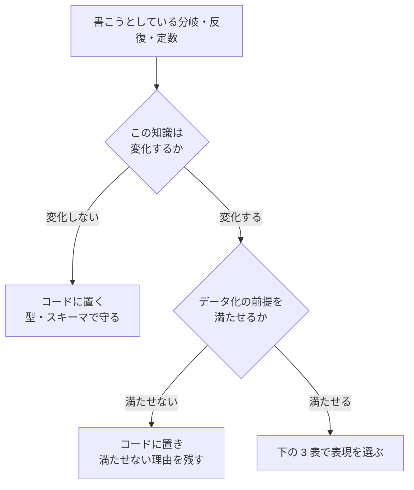

# 分析可能なコード

問うのは 2 つだけである。**実行前に、判断の網羅性を検査できるか。実行後に、その判断が下された理由を再現できるか。** どちらも「はい」にならない箇所が、この Skill の対象である。

## 中核方針

> **変化する知識はデータへ。安定した機構と不変条件はコードへ。両方をスキーマと計測で接続する。**

「コードよりデータ」だけでは、何でも設定ファイルへ追い出す方向に倒れる。移す対象は**変化する知識**に限る。

| データへ移す | コードに残す |
| --- | --- |
| 業務ルール、料率、しきい値、優先順位 | 不変条件、安全性の制約 |
| 分類・対応表（値から値への写像） | 機構（どう読み、どう書き、どう失敗を扱うか） |
| 環境ごとに変わる値 | 型・スキーマ・境界の定義 |
| 利用者が管理するカテゴリ | プロトコル、閉じた状態集合 |

データへ移しても複雑性は消えない。目的は**複雑性を検査・可視化・変更可能な形式へ移すこと**である。

## 先に読む: この Skill が禁じていないこと

この Skill は `if` / ループ / 定数の**禁止規則ではない**。次の 3 つは、いずれもこの Skill の誤用である。

| 誤用 | なぜ悪化するか |
| --- | --- |
| 条件分岐を機械的に対応表へ置き換える | 単純なガード節は対応表より意図が明確。網羅性を静的に検査できていた分岐を対応表へ移すと、検査が弱くなる（外部化した対応表は静的解析の視界から外れる） |
| 逐次ループを高階反復へ置き換えて「一括処理にした」とみなす | 高階反復は記述の変更にすぎない。一括実行にも並列実行にもなっていない |
| 定数をすべて外部設定へ出す | 条件・参照・既定値を足すうちに設定が独自言語になり、当初より変更しにくくなる |

3 つ目は既知のアンチパターン（inner-platform effect）である。**外部化は下の「データ化の前提」を満たせるときだけ行う。**

## 規範

### MUST

- 外部化したルール・設定・マスタデータには、**スキーマとバージョン**を持たせる
- 判断の結果には、**適用したルールの識別子・版・理由**を記録できる経路を用意する
- 一括処理では、成功件数だけでなく**失敗の件数・種類・対象**を報告する。**項目どうしが独立に処理できる**なら、最初の失敗で打ち切らず、最後まで処理してから集計を返す
- 外部入出力・副作用・時刻・乱数は、**境界として明示**する
- 不変条件と安全性の制約を、**変更可能な設定だけに依存させない**
- 閉じた状態集合は、**型またはスキーマで網羅性を検査できる形**で表現する

### SHOULD

- 条件の組み合わせが多い業務判断は、決定表またはポリシーとして表現する
- 純粋なデータ変換と、副作用を伴う処理を分離する
- 同種の大量処理は、逐次制御として書く前に一括処理として表現できないか検討する
- 並行化する処理では、冪等性・順序依存・再試行・打ち切り・取り消しを明示する
- 入れ子になった条件分岐は、ガード節・状態機械・決定表・登録表への変更を検討する
- 「コードを見なければ値の意味が分からない」不透明なコード値を使わない

### MAY

次はいずれも**そのままでよい**。この Skill を理由に書き換えない。

- 単純なガード節の条件分岐（早期リターンによる前提条件の検査）
- 閉じた型に対する網羅的な分岐（静的に網羅性を検査できるもの）
- 逐次依存・早期終了・ストリーム処理・メモリ制約下の明示的なループ
- 不変条件・プロトコル・閉じた状態集合を表す定数と列挙型
- 原子性・整合性・安全性を守るための即時打ち切り（fail-fast）と巻き戻し（rollback）。全体を 1 単位として成否を決める処理、後続に不正な入力が波及する処理、安全性検査の失敗はこれにあたる。打ち切った位置・理由・巻き戻しの範囲を記録できれば、分析可能性は損なわれない

## 判定



### 分岐の種類 → 適切な表現

| 分岐の種類 | 適切な表現 |
| --- | --- |
| 値から値への単純な対応 | 対応表（写像） |
| 処理方式の切り替え | 登録表（識別子から処理への対応） |
| 条件の組み合わせが多い業務判断 | 決定表、ルールエンジン |
| 認可・制約・組織ポリシー | ポリシーエンジン |
| 時系列で状態が変化する処理 | 状態機械 |
| 閉じた少数の型分岐 | 型に対する網羅的な分岐（データ化しない） |
| 前提条件の検査 | ガード節（データ化しない） |

### 反復の種類 → 何が変わるか

**この表の目的は、置き換えても何も変わらない場合を見分けることである。**

| 種類 | 実行の実体 | 得られるもの |
| --- | --- | --- |
| 高階反復 | 逐次 | **なし**（記述の変更のみ） |
| 一括演算 | 基盤側で一括実行 | 実行時間 |
| 一括入出力 | 呼び出し回数の削減 | 往復回数（大量データでは最大の効果） |
| 並行処理 | 待ち時間の重ね合わせ | 待ち時間。計算時間は減らない |
| 並列処理 | 複数の実行資源で同時 | 計算時間 |
| 分散データフロー | 基盤が分割・再試行・集約 | 規模と耐障害性 |

逐次ループから高階反復への置き換えは、**この表のどの行にも移動していない**。移すなら移動先の行を言えなければならない。

一括演算の基盤は言語によって有無が異なる。基盤がない言語では、一括入出力（往復回数の削減）が主戦場になる。手段は [references/language-notes.md](references/language-notes.md) を参照する。

### 定数の性質 → 置き場所

| 値の性質 | 置き場所 |
| --- | --- |
| 数学的・技術的な不変条件 | コード内の定数 |
| 閉じた状態集合・プロトコル | 型、列挙型、スキーマ |
| 頻繁に変わる業務ルール | 決定表、ポリシー、設定 |
| 環境ごとに変わる値 | 配備設定、環境変数 |
| 利用者が管理するカテゴリ | 参照テーブル（データベース） |
| 表示名・文言 | 多言語化資源、コンテンツ |
| 安全性の絶対制約 | コード・型・スキーマ・ポリシーの複数層 |

不透明なコード値（`status == 3`）は避ける。ただし**意味の分かる識別子を持つ列挙型まで排除しない**。型のない文字列に置き換えると、綴り誤りと未処理ケースの発見が実行時まで遅れる。

## データ化の前提

判断をデータへ移すなら、**移した先で次を用意できること**が条件である。用意できないなら、コードに残したほうが分析可能性は高い。

- [ ] スキーマがある
- [ ] 型またはバリデーションで検査される
- [ ] 版を持ち、変更履歴が追える
- [ ] 競合するルール・到達不能なルールを検出できる
- [ ] テストがある
- [ ] 変更の適用手順（移行）がある
- [ ] 誰が何を変更したか監査できる
- [ ] 実行時に、適用したルールの識別子と理由を記録する

**外部化した時点で、その対応表は静的解析の視界から外れる**（実測は
[references/language-notes.md](references/language-notes.md)）。これは外部化の失敗ではなく、
外部化とはそういうものである。**静的検査で守れなくなった分を、スキーマ検証で埋める。**
埋められないなら外部化しない。

## 判断を記録する

「計測可能」はログを増やすことではない。**1 つの判断につき 1 件、入力・決定・理由・実行文脈をまとめた構造化イベントを出す。**

```json
{
  "event_name": "discount_decided",
  "customer_id": "cus_123",
  "input": { "rank": "gold", "purchase_amount": 120000 },
  "decision": {
    "discount_rate": 0.2,
    "rule_id": "customer-rank-discount",
    "rule_version": "2026-08-01",
    "reason": "customer rank is gold"
  },
  "execution": { "code_version": "a13fd82", "duration_ms": 4, "trace_id": "..." }
}
```

- 属性は、絞り込み・グループ化・集計・相関に使える形にする
- `rule_id` と `rule_version` があると、「なぜこの結果になったか」を後から再現できる。外部化したルールほどこれが要る
- 個人情報と秘密情報の扱いは `logging-guidelines` に従う

一括処理では、これに加えて**終了時に失敗の集計**を出す。

```json
{
  "event_name": "import_completed",
  "total": 12000, "succeeded": 11940, "failed": 60,
  "failures_by_reason": { "invalid_date": 48, "missing_customer": 12 },
  "sample_failed_ids": ["row_88", "row_312", "row_940"]
}
```

途中の失敗をその場で握りつぶさず、**集めて返す**。項目が独立に処理できるのに最初の失敗で全体を止めると、どこまで進んだかが分からなくなる。逆に、全体を 1 単位として成否を決める処理では打ち切って巻き戻すのが正しい。その場合は**打ち切った位置・理由・巻き戻しの範囲**を同じ構造化イベントに含める。

## 例: 分岐のデータ化

```text
❌ 変化する料率が制御構文へ埋まっている
   if rank == "gold"        -> rate = 0.2
   else if rank == "silver" -> rate = 0.1
   else                     -> rate = 0

✅ 対応表として持ち、既定と未知の扱いを明示する
   rates = { gold: 0.2, silver: 0.1, bronze: 0.0 }   # 版とスキーマを持つ
   rate  = rates[rank]（未知の rank は失敗として扱い、握りつぶさない）
```

移した結果、次が言えるようになっていなければ移した意味がない。

- 料率の一覧を**コードを読まずに**確認できる
- 新しい階級の追加が、分岐の追加ではなくデータの追加になる
- どの階級にどの版の料率が適用されたか、記録から再現できる

## 言語ごとの手段

上の判定までは言語に依存しない。**それを実現する言語機能・ライブラリは
[references/language-notes.md](references/language-notes.md)** にある。記載のない言語では、
判定表から自分で対応付ける。

## 適用の順序

| 状況 | 進め方 |
| --- | --- |
| 新規実装 | 判定を先に済ませ、表現を選んでから書く |
| 既存コードの構造改善 | `safe-refactoring` の手順（テストで守る・1 手ずつ）に従う。この Skill は**改善の方向**だけを決める |
| 振る舞いを変える | `tdd-cycle` に従う。データ化と振る舞いの変更を同じ差分に混ぜない |

## 参照

- [references/language-notes.md](references/language-notes.md) — Python / TypeScript / PHP での手段
- `safe-refactoring` — 振る舞いを変えずに構造を変える手順
- `logging-guidelines` — 記録に含めてよい情報の判断
