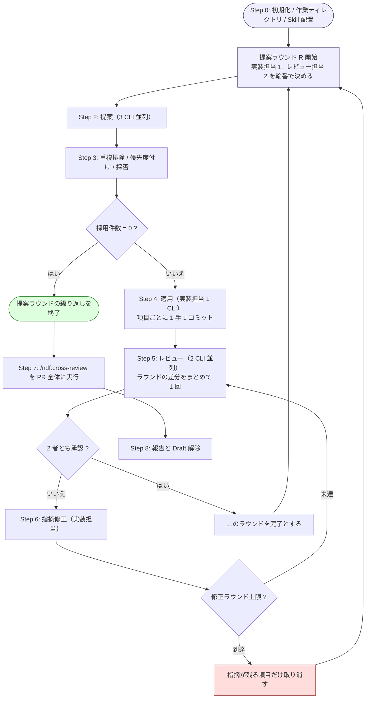

# 多ランタイム・リファクタリング収束ループ

**発見・適用・検証を別々のランタイムへ分担させ、指摘が尽きるまで回す。**
`/ndf:cross-review` がレビューを収束させるのと同じ発想で、リファクタリングを収束させる。

`refactoring` Skill は「テストで守りながら 1 手ずつ直す」手順を持つが、
**何を直すかの発見**と**直した結果の他者検証**を持たない。この Skill がその 2 つを補う。

詳細は `docs/` に、コマンドは `scripts/` に分けている。

- [docs/01-state-and-propose.md](docs/01-state-and-propose.md) — Step 0〜3（初期化 / Skill 配置 / 提案 / マージ）
- [docs/02-apply-and-review.md](docs/02-apply-and-review.md) — Step 4〜8（適用 / レビュー / 見送り / 報告）
- [docs/03-review-viewpoints.md](docs/03-review-viewpoints.md) — レビュー観点
- [scripts/refactor.py](scripts/refactor.py) — 状態管理（uv 自己完結、標準ライブラリのみ）
- [scripts/prepare-worktrees.sh](scripts/prepare-worktrees.sh) — 作業ディレクトリ準備と Skill 配置
- [scripts/launch-cli.sh](scripts/launch-cli.sh) — フェーズごとのプロンプト組み立てと CLI 起動
- 監視と CLI 起動の実体は `../cross-review/scripts/lib/`（収束ループ共通層）

## 設計方針

| 観点 | 方針 |
| --- | --- |
| 参加者 | **全員 CLI プロセス。** ホストのサブエージェント機能は使わない。ホストと同じランタイムが実装担当のラウンドでも別プロセスで起動する |
| 役割の分離 | 提案・レビューは**ホストを除く 3 者**、適用は**gemini を除く 3 者**。両者は重なるが一致しない |
| レビューの単位 | **提案ラウンドの差分全体**に対して 1 回。項目ごとに回すと CLI 起動回数が採用件数に比例して膨らむ |
| 収束しない項目 | **捨てる。** リファクタリングは任意の作業なので、揉める提案を Pull Request に残さない |
| 取り消しの単位 | **改善項目ごと（独立している範囲で）。** 範囲を新しい順に全て戻し、残す項目を積み直す。同一ファイルの隣接行を触る項目どうしは git だけでは分離できないため、そのときは**ラウンド全件へ退避する** |
| 範囲の扱い | `--scope` は**検証にも効く**。範囲外を触ったコミットを含む項目は失敗になる |
| 公開の責務 | **進行側だけが、検証を通した後に push する。** 実装担当は push しない。生成物の同期は `--sync-command` として push の直前に進行側が実行する |
| 検証の情報源 | **git と実際のテスト実行。** 結果ファイルの申告は検証に使わない（書き換えるだけで通る検査にしない） |
| 投稿 | **AI 自身が `gh api` で投稿する。** ホストの作業文脈に差分やレビュー本文を載せない |
| 状態の永続化 | `<work>/.cross_refactoring/cross-refactoring-rf<番号>-state.json` に集約。中断・再開可能 |
| 計測 | 起動時にモデルを固定し、コミットのトレーラーとレビューコメントへ実行主体を残す |

## 引数

| 引数 | 意味 | 既定 |
| --- | --- | --- |
| `[PR番号]` | 対象の Pull Request | 必須 |
| `--scope PATH...` | 対象範囲。**提案が無制限に広がらないよう必須。** 検証にも効くので、現状固定テストの置き場所も含める | 必須 |
| `--host claude\|codex\|kiro` | ホストの明示指定。未指定時は環境変数から推定 | 推定 |
| `--model RT=MODEL` | ランタイムごとのモデル。繰り返し指定できる | CLI の既定 |
| `--baseline-test CMD` | 着手前と各コミットで実行するテスト。**振る舞い不変を示す手段が無い書き換えは構造改善ではないため必須** | 必須 |
| `--max-outer-rounds N` | 提案ラウンドの上限 | `3` |
| `--max-fix-rounds N` | 1 ラウンドあたりの修正の上限 | `3` |
| `--max-items-per-round N` | 1 ラウンドの採用上限 | `5` |
| `--severity-threshold LEVEL` | この重要度未満は採用しない | `minor` |
| `--test-timeout SEC` | テスト 1 回あたりの上限秒数。超えたら失敗として扱う | `900` |
| `--sync-command CMD` | 生成物を同期するコマンド。**push の直前**に進行側が実行し、差分があれば進行側のコミットとして積む | なし |

```text
/ndf:cross-refactoring 130 --scope src/services tests/services --baseline-test "pytest -q"
/ndf:cross-refactoring 130 --scope src --baseline-test "pytest -q" --sync-command "make generate"
/ndf:cross-refactoring 130 --scope src --model codex=gpt-5.5 --model claude=opus-5
/ndf:cross-refactoring 130 --scope src --host codex --max-outer-rounds 1
```

**モデルを比べたいなら `--model kiro=<name>` を必ず指定する。** kiro の既定 `auto` は
実際に選ばれたモデルを取得できず、そのラウンドは集計から分離される。

## 担当の決め方

ホストセッションは**進行の制御に徹し、提案とレビューには参加しない**。
ただし**適用だけはホストと同じランタイムも担当しうる**。その場合も CLI プロセスとして
起動するため、ホストセッションの作業文脈からは切り離されている。

| 母集合 | 定義 | 中身 |
| --- | --- | --- |
| 提案・レビュー（`runtimes`） | 全ランタイム − ホスト | 常に 3 者 |
| 適用（`impl_capable`） | 全ランタイム − gemini | 常に claude / codex / kiro |

- **gemini は適用に参加しない。** NDF Skill を配布していないランタイムであり、
  `refactoring` Skill の手順を踏ませる適用には向かない。提案とレビューには常に参加する
- **ホストは適用にだけ参加する。** 提案とレビューから外れているので、
  「実装した者と評価する者が同一モデルにならない」構造は保たれる

割り当ては `refactor.py start-round` が返し、状態ファイルへ記録する。**再開しても変わらない。**

## 前提

- `gh` CLI が認証済みで、`jq` と `uv`（または Python 3.10 以上）が使える
- 参加する CLI が**すべてログイン済み**である。`init` が認証状態を確認し、1 つでも
  未認証なら中断する（未認証の CLI は起動から 15 秒で終わり、結果を残さないまま
  担当から脱落するため、確認しないと参加者が欠けた構成のまま進行する）

  | ランタイム | 確認コマンド |
  | --- | --- |
  | claude | `claude auth status` |
  | codex | `codex login status` |
  | gemini | `gemini --skip-trust -p ping --output-format text` |
  | kiro | `kiro-cli whoami` |

  確認コマンドは CLI の版で変わりうる。誤検知するときは `NDF_SKIP_AUTH_CHECK=1` で
  飛ばせる（飛ばしたことは出力に残る）

- ホストごとに次の CLI が使える（不足していると初期化時に失敗する）

  | ホスト | 必要な CLI |
  | --- | --- |
  | Claude Code | `codex` / `gemini` / `kiro-cli` |
  | Codex | `claude` / `gemini` / `kiro-cli` |
  | Kiro CLI | `claude` / `codex` / `gemini` |

- 対象の Pull Request が Draft で開いている（未作成なら `/ndf:pr` で先に作る）

## 全体フロー



**提案ラウンドの繰り返しの中にレビュー収束の繰り返しが入る**二段構造が、
`cross-review` との最大の差である。

## 実行

進行全体を 1 本の bash で駆動する。参加者が全て CLI なので、途中でホストへ戻る必要がない。

```bash
PLUGIN_ROOT="${PLUGIN_ROOT:-${CLAUDE_PLUGIN_ROOT}}"
SCRIPTS="$PLUGIN_ROOT/skills/cross-refactoring/scripts"
LIB="$PLUGIN_ROOT/skills/cross-review/scripts/lib"

# **中断（終了コード 4）は握り潰さない。** 取り消しに失敗した状態を「全件失敗」と
# 同じ扱いにすると、検証を通っていない変更を Pull Request に残したまま次の提案が
# 始まる。判定に使う終了コードだけを呼び出し側へ返し、それ以外は進行ごと止める。
rf() {
  "$SCRIPTS/refactor.py" "$@"; local rc=$?
  if [ $rc -eq 4 ]; then
    echo "❌ cross-refactoring を中断しました（refactor.py $1）" >&2
    exit 4
  fi
  return $rc
}

# 出力を `eval` する呼び出しは**別の関数にする**。`eval "$(rf ...)"` と書くと `rf` は
# コマンド置換のサブシェルで動くため、`exit 4` はサブシェルしか終わらせない。
# 外側の `eval` は空文字を評価して成功し、**中断したはずの進行がそのまま続く**。
# 出力と終了コードを親シェルで受け取ってから判定する。
rf_eval() {
  local out rc
  out=$("$SCRIPTS/refactor.py" "$@"); rc=$?
  if [ $rc -eq 4 ]; then
    echo "❌ cross-refactoring を中断しました（refactor.py $1）" >&2
    exit 4
  fi
  eval "$out"
  return $rc
}

rf_eval init "$PR" --scope $SCOPE \
        --baseline-test "$BASELINE" ${HOST:+--host "$HOST"} \
        --max-outer-rounds "$MAX_OUTER" --max-fix-rounds "$MAX_FIX" \
        --max-items-per-round "$MAX_ITEMS" $MODEL_ARGS
export CROSS_REFACTORING_TMP_DIR="$TMP_DIR"
"$SCRIPTS/prepare-worktrees.sh" "$ID"

while :; do                                   # 提案ラウンドの繰り返し
  rf_eval start-round "$ID" || break          # 終了コード 1 = 繰り返し終了
  for a in $RUNTIMES; do
    "$SCRIPTS/launch-cli.sh" "$a" propose "$ID" "$ROUND"
  done
  "$LIB/monitor.py" "$ID" --agents "$RUNTIMES_CSV" --tmp-dir "$TMP_DIR" \
      --stem-template "{agent}-propose-rf{id}-r$ROUND"
  rf merge-proposals "$ID" || break            # 終了コード 2 = 採用 0 件

  "$SCRIPTS/launch-cli.sh" "$IMPL" apply "$ID" "$ROUND"
  "$LIB/monitor.py" "$ID" --agents "$IMPL" --tmp-dir "$TMP_DIR" \
      --stem-template "{agent}-apply-r$ROUND" --timeout 3600
  rf merge-apply "$ID" "$ROUND" || continue    # 終了コード 2 = 全件失敗

  # 適用後の状態をレビュー担当へ見せるため、読み取り用を同期する
  "$SCRIPTS/prepare-worktrees.sh" "$ID" sync "$(git -C "$WORK" rev-parse HEAD)"

  while :; do                                 # レビュー収束の繰り返し
    for r in $REVIEWERS; do
      "$SCRIPTS/launch-cli.sh" "$r" review "$ID" "$ROUND"
    done
    "$LIB/monitor.py" "$ID" --agents "$REVIEWERS_CSV" --tmp-dir "$TMP_DIR" \
        --stem-template "{agent}-review-r$ROUND"
    rf judge-review "$ID" "$ROUND"; rc=$?
    [ $rc -eq 0 ] && break                    # 2 者とも承認
    [ $rc -eq 3 ] && continue                 # 形式不正 — 差し戻して再レビュー
    if rf should-abandon "$ID" "$ROUND"; then
      rf abandon-items "$ID" "$ROUND"; break
    fi
    "$SCRIPTS/launch-cli.sh" "$IMPL" fix "$ID" "$ROUND"
    "$LIB/monitor.py" "$ID" --agents "$IMPL" --tmp-dir "$TMP_DIR" \
        --stem-template "{agent}-fix-r$ROUND"
    rf merge-fix "$ID" "$ROUND"
    # 修正後の状態を再レビューさせる。同期しないと古い差分を評価してしまう
    "$SCRIPTS/prepare-worktrees.sh" "$ID" sync "$(git -C "$WORK" rev-parse HEAD)"
  done
  rf advance "$ID" || break
done

# 生成物の同期は `--sync-command` として push の直前に進行側が実行済み。
# ここで追加の作業は要らない。
```

### 終了コード

| コード | 意味 | 進行 |
| --- | --- | --- |
| 0 | 正常 | 続ける |
| 1 | 繰り返しの終了（`start-round` / `advance`） | 抜ける |
| 2 | 判定の結果（採用 0 件 / 全件失敗 / 変更要求 など） | 各コマンドの表に従う |
| 3 | レビュー結果の形式不正 | 差し戻して再レビュー |
| **4** | **中断**（取り消しの失敗、認証切れ、範囲を確定できないなど） | **進行ごと止める** |

出力を `eval` する呼び出し（`init` / `start-round`）は `rf_eval` を使う。
`eval "$(rf ...)"` と書くと `rf` はコマンド置換のサブシェルで動くため、`exit 4` は
サブシェルしか終わらせず、外側の `eval` は空文字を評価して成功する。
**中断したはずの進行がそのまま続く**ので、出力と終了コードは親シェルで受け取る。

続けて **Step 7** で `/ndf:cross-review <PR>` を実行する。レビューはラウンド単位なので、
**ラウンドを跨いだ整合はここで見る**。収束したら Draft を解除し、
`refactor.py report "$ID" --metrics` の出力を報告する。

状態ファイルに全ての状態が入るため、どこで落ちても同じコマンド列を叩き直せば再開できる。

## アンチパターン

| してはいけないこと | なぜ |
| --- | --- |
| ホストのサブエージェントで適用する | ホストの作業文脈に差分が載り、実装者とレビュー担当の独立性が崩れる |
| `launch-cli.sh` に「ホストなら起動しない」分岐を入れる | ホストは適用担当として起動しうる。分岐はランタイム名だけで行う |
| `--scope` を省く | 提案が発散し、Pull Request が肥大する |
| 実装担当に生成物を同期させる | 範囲外の変更が生まれ、範囲の検査で全件失敗する。同期は `--sync-command` で進行側が行う |
| 実装担当に push させる | 検証を通る前に公開され、取り消しの反映漏れが Pull Request に残る |
| 生成物を同期するリポジトリで `--sync-command` を省く | pre-push の検査で**あらゆる push が落ちる**。実装担当が同期に手を出し、範囲違反で全件失敗する |
| 取り消しの失敗を「全件失敗」として次のラウンドへ進む | 検証を通っていない変更が Pull Request に残る。終了コード 4 は必ず進行ごと止める |
| `--dry-run` の出力を実行結果と混同する | 確認用なので git も状態ファイルも触らない。進行は 1 歩も進まない |
| 複数の改善項目を 1 コミットにまとめる | 取り消し範囲が項目単位で決まらなくなる。適用結果の検証で失敗になる |
| 結果ファイルの申告を検証の材料にする | 実装担当は報告する側。JSON を書き換えるだけで通る検査は機械検証ではない |
| レビューの指摘に項目 ID を付けない | 同上。差し戻して再レビューになる |
| `git push --force` / `--no-verify` を使う | 他者の作業を消す。検証を飛ばす |
| 提案とレビューにホストを混ぜる | 実装者と評価者が同一モデルになりうる。初期化時に検査して失敗させている |
| kiro を既定モデルのまま計測する | `auto` は実際に選ばれたモデルを取得できない |
| 提案フェーズでコードを直す | 提案は読むだけ。直すのは実装担当 1 者に集約する |

## 完了報告

- ラウンド表（実装担当・レビュー担当とそれぞれのモデル、採用・適用・見送り・修正の件数）
- 改善項目の表（対象・スメル・手法・提案元・状態・コミット数）
- 見送った提案と、その理由
- `--metrics` の集計と、**比較として読むときの限界**
- `/ndf:cross-review` の収束結果
