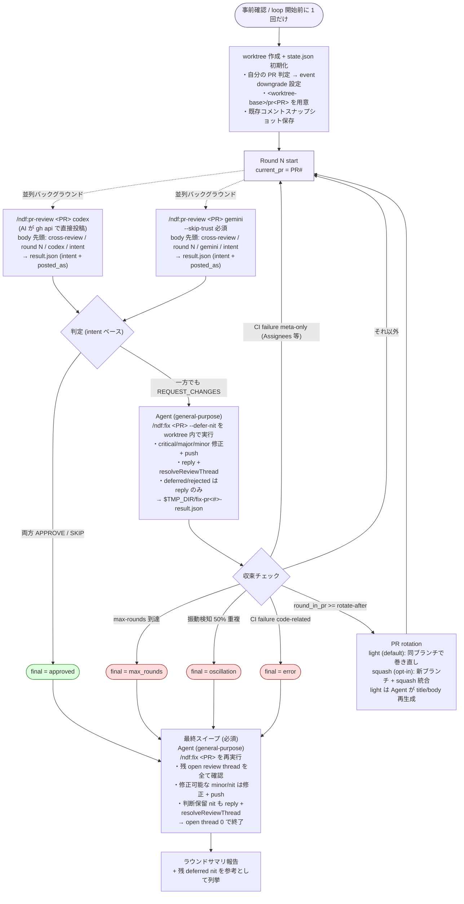

# クロスレビュー収束ループ

PR を **codex / gemini 両方** にレビューさせ、両者が `APPROVE` を返すまで
`/ndf:pr-review` と `/ndf:fix` を自動で回す。

/goalの引数として呼ばれた場合は、codex / gemini が`APPROVE` になるまで/cross-reviewを繰り返す。
  * codex / geminiのいずれかが不具合などで実行できなくなった場合は異常終了とする
   * /goalで呼ばれた場合はPR ローテーションは実施しなくてよい。
   * 振動検知した場合はAIが判断して正しい状態を決める。

詳細手順は `docs/` 配下に、主要コマンドは `scripts/` 配下に分割している:

- [docs/01-state-and-review.md](docs/01-state-and-review.md) — Step 0〜4 (state init / round / 並列レビュー / 判定 / 振動検知)
- [docs/02-fix-and-rotation.md](docs/02-fix-and-rotation.md) — Step 5〜8 (サブエージェント修正 / PR ローテーション / 終了処理)
- [scripts/state.py](scripts/state.py) — state.json 操作（uv 自己完結スクリプト、stdlib のみ）
- [scripts/launch-codex.sh](scripts/launch-codex.sh) / [scripts/launch-gemini.sh](scripts/launch-gemini.sh) — レビューランチャ
- [scripts/monitor.py](scripts/monitor.py) — codex/gemini プロセス多軸監視 (sentinel / pidfile / 早期エラー / stall / hard timeout / result.json)
- [scripts/wait-review.sh](scripts/wait-review.sh) — `monitor.py` の薄ラッパ（互換用）
- [scripts/rotate-pr.sh](scripts/rotate-pr.sh) — PR ローテーション

メインセッションからは `$SCRIPTS/state.py <subcommand>` 形式で呼ぶだけで、
state.json の読み書きや AI launcher 起動・完了待ちは全て委譲される。

## 設計方針

長丁場が予想されるため **メインセッションの context 消費を最小化** する:

| 観点 | 方針 |
|---|---|
| レビュー投稿 | **AI 自身が `gh api` で PR に直接投稿**。メインはペイロードを保持しない |
| 修正 | **必ずサブエージェント (`general-purpose`) で実行**。メイン context に diff は載せない |
| ユーザ問い合わせ | 自動判断を最大化（`critical`/`major`/`minor` は自動修正、ループ中の `nit` は deferred） |
| 取りこぼし防止 | **ループ終了時（approved / max_rounds / oscillation / error いずれも）に最終スイープを必須実行**。`/ndf:fix` を再実行し、残った open review thread（最終 APPROVE ラウンドの minor/nit インラインコメント含む）を **全て解消**。修正可能なものは修正 + push、判断保留 nit も reply + resolveReviewThread して **open thread 0 で終了** |
| 状態の永続化 | `<worktree>/.cross_review/cross-review-pr<番号>-state.json` に集約。中断・再開可能 |
| 長尺PR対策 | **`--rotate-after` ラウンドで PR をローテーション**（default=light: 同ブランチで PR 巻き直し / squash: 新ブランチ + squash 統合） |
| 振動検知 | 同じ指摘が 2 round で 50%以上重複したら中断 |

## 引数

| 引数 | 意味 | 既定 |
|---|---|---|
| `[PR番号]` | 対象 PR（省略時は直前 PR / 現在ブランチ） | — |
| `--max-rounds N` | 全体最大ラウンド数（PR ローテーションを含む通算） | `12` |
| `--rotate-after K` | この round 数で未収束なら PR ローテーション | `8` |
| `--rotate-mode light\|squash` | ローテーション方式。`light`: 同ブランチで旧 PR を close → 新 PR (title/body は現状の差分・実装から再生成)。`squash`: squash 統合 + 新ブランチ + `(rotated)` suffix | `light` |
| `--only codex` / `--only gemini` | 片方だけで回す（デバッグ用） | 両方 |
| `--focus TEXT` | 自動レビュー観点に上乗せして codex / gemini 両方に渡す追加観点。短い重点チェック向け | なし |
| `--extra-instructions-file PATH` | 自動レビュー観点に上乗せして codex / gemini 両方に渡す追加観点を UTF-8 テキストファイルから読む。長いチェックリスト向け | なし |

例:

```
/ndf:cross-review 123
/ndf:cross-review 123 --max-rounds 4 --rotate-after 2
/ndf:cross-review 123 --rotate-mode squash
/ndf:cross-review 123 --only codex
/ndf:cross-review 123 --focus "ドキュメントとコードの整合性を重点的に確認"
/ndf:cross-review 123 --extra-instructions-file /tmp/review-focus.md
```

### 自動レビュー観点テンプレート

`state.py init` は GitHub API の `pulls/<PR>/files --paginate` で変更ファイルを全件取得して分類し、
codex / gemini 両 launcher に同じ追加観点を渡す。`--focus` /
`--extra-instructions-file` は、この自動テンプレートの後ろに上乗せされる。

自動カテゴリ:

- `common`: PR 全体の目的、変更範囲、保守性、テスト、ロールバック容易性
- `docs_only`: ドキュメントのみ PR。企画・説明の妥当性、コード/設定/コマンド/他 docs との整合性
- `code`: 設計、正確性、可読性、冗長・重複、言語らしさ、セキュリティ、関数/ファイルの責務とサイズ
- `db_migration`: データ設計、型、NULL/default/制約/index、既存データ、backfill、ロールバック
- `test`: テストの仕様性、境界値、失敗系、flaky リスク
- `dependency`: 依存追加/更新、lockfile、ライセンス、互換性、セキュリティ
- `config_ci`: CI/設定、権限、secret、cache、環境差分
- `api_contract`: API 契約、互換性、schema、status、エラー形式、認可
- `auth_security`: 認証/認可、secret/PII、CSRF/CORS/session/JWT/OAuth
- `frontend`: UI 状態、アクセシビリティ、レスポンシブ、状態管理、表示文言
- `performance`: N+1、I/O、メモリ、ロック、cache、queue、冪等性
- `deletion_rename`: 削除/リネーム参照漏れ、後方互換、移行手順
- `generated`: 生成物、lockfile、再生成手順、差分ノイズ
- `i18n`: 翻訳キー、fallback、変数展開、表示幅、文言整合
- `infra`: IaC / Docker / Kubernetes 等の権限、secret、公開範囲、ロールバック

### `--rotate-mode` の選び方

- **`light` (default)**: PR を読む人 (将来のレビュアー / 後続 PR を作る人) が cross-review の存在を意識せずに済む。release branch 戦略・TODO 参照・コミット単位レビューを破壊しない。**通常はこちらを使う**
- **`squash`**: 巨大 PR を 1 commit に潰したい / `(rotated)` suffix で rotation 履歴を PR title に残したい場合のみ。release branch 戦略を使う運用とは併用しない

## 前提

- `/ndf:pr-review` が **AI 直接投稿**（外部 AI 自身が `gh api` で投稿）に対応
- `/ndf:fix` が **サブエージェント起動 + 重要度ベース自動修正 + Resolve Conversation** に対応
- `codex` / `gemini` CLI が動作し、`gh` CLI が認証済み
- `Agent(subagent_type="general-purpose", ...)` でサブエージェントを起動可能

## 事前確認（`state.py init` が自動実施）

ループ開始前に **4 つのプリチェック** が必要だが、すべて `scripts/state.py init`
が内部で実施する。メインは結果を KEY=VALUE 形式で受け取るだけで良い。

| # | 対策 | スクリプト側で何をするか |
|---|---|---|
| 1 | 自分の PR 判定（422 回避） | `gh api user` と `gh pr view --json author` を比較し `is_own_pr` / `event_downgrade` を state.json に書く |
| 2 | worktree 分離 | `git worktree add <worktree-base>/<owner>--<repo>/pr<PR> <head>` を冪等実行（`<worktree-base>` は `NDF_WORKTREE_BASE` env > `<システム tmpdir>/ndf-worktrees` の優先順で解決）。パスが存在しても現リポジトリの登録済み worktree でなければ `.stale-<ts>` に退避して作り直す |
| 3 | gemini trusted directory | `launch-gemini.sh` が `GEMINI_CLI_TRUST_WORKSPACE=true` + `--skip-trust` を必ず併用。**tmp dir は `<worktree>/.cross_review/`** を採用し、gemini の workspace 制約 (workspace 外の `write_file` がブロックされる) を根本回避 |
| 4 | 既存コメント差分 | `fix/scripts/fetch-pr-comments.sh` で 3 ソース (インラインコメント / レビュー body / PR レベルコメント) を一括取得し `$TMP_DIR/cross-review-pr<PR>-existing-comments.txt` に保存。gemini プロンプトには **内容をインライン埋め込み**、codex プロンプトには path を渡す |

### `<worktree-base>` の解決順

`state.py init` は worktree の親ディレクトリを以下の優先順で解決する:

1. `NDF_WORKTREE_BASE` 環境変数（明示オーバーライド）
2. `<システム tmpdir>/ndf-worktrees`（Python `tempfile.gettempdir()`。非永続領域のため
   コンテナ再作成で自動消滅し、共有 volume を消費しない）

worktree の実パスは `<base>/<owner>--<repo>/pr<PR>` 形式で、リポジトリ slug を含める
ことで**他リポジトリの同一 PR 番号と衝突しない**。永続 volume（旧 `/work/worktrees`）を
使っていた頃は別プロジェクトの残骸 worktree を誤って流用する事故があったため、
パスが存在しても `git worktree list` に登録されていなければ `.stale-<timestamp>` に
退避して作り直すガードも入っている。

解決した実パスは `state.json` の `worktree_path` に書かれるため、後続スクリプトや
サブエージェント prompt は state.json から読めば追従できる。

### intent / posted_as の両保持（最重要）

GitHub は **自分の PR には `REQUEST_CHANGES` でレビューを投稿できない**
（`HTTP 422`）。state.json には **両方** を保持する:

```json
"codex": {
  "intent": "REQUEST_CHANGES",   // AI の本来判定。ループ収束判定に使う
  "posted_as": "COMMENT",        // 422 回避でダウングレードした結果
  "comments": 5, "review_url": "..."
}
```

`state.py judge` は `intent` を見るので、ダウングレード投稿してもループは続行する。

## 全体フロー



## 実行ステップ概要（メインの bash 骨組み）

各ステップの詳細は `docs/` 参照。メインは以下のテンプレートで scripts/ を呼ぶだけ:

```bash
PLUGIN_ROOT="${PLUGIN_ROOT:-${CLAUDE_PLUGIN_ROOT}}"
SCRIPTS="$PLUGIN_ROOT/skills/cross-review/scripts"

# STATE_PR は state.json のキー (= 最初に init した PR 番号)。
# rotation 後も state.json のパスは変わらないため、scripts/ への引数には常に
# STATE_PR を渡す。「現在レビュー中の PR」は state.json の current_pr を内部参照する。
STATE_PR=$INITIAL_PR

# ROTATE_MODE は引数 --rotate-mode (default=light) から取得。light なら Step 6b で
# Agent (general-purpose) を起動して新 PR の title/body を生成する。
ROTATE_MODE=${ROTATE_MODE:-light}

# Step 0: state 初期化 / 再開
eval "$("$SCRIPTS/state.py" init "$STATE_PR" \
          --max-rounds "$MAX_ROUNDS" --rotate-after "$ROTATE_AFTER" \
          ${ONLY:+--only "$ONLY"} \
          ${FOCUS:+--focus "$FOCUS"} \
          ${EXTRA_INSTRUCTIONS_FILE:+--extra-instructions-file "$EXTRA_INSTRUCTIONS_FILE"})"
# eval で TMP_DIR がセットされる。後続スクリプトに env として伝播させる。
export CROSS_REVIEW_TMP_DIR="$TMP_DIR"
cd "$WORKTREE"

while :; do
  # Step 1: round 開始判定 (max_rounds 到達で exit 1)
  eval "$("$SCRIPTS/state.py" start-round "$STATE_PR")"

  # Step 2: 並列レビュー
  [ "$ONLY" != "gemini" ] && "$SCRIPTS/launch-codex.sh"  "$STATE_PR" "$ROUND"
  [ "$ONLY" != "codex"  ] && "$SCRIPTS/launch-gemini.sh" "$STATE_PR" "$ROUND"
  # 監視: 既定 timeout=7 分 / stall=3 分。失敗時は対象プロセスを kill して返す。
  "$SCRIPTS/monitor.py" "$STATE_PR" "${ONLY:-both}" || handle_review_failure $?

  [ "$ONLY" != "gemini" ] && "$SCRIPTS/state.py" read-result "$STATE_PR" codex
  [ "$ONLY" != "codex"  ] && "$SCRIPTS/state.py" read-result "$STATE_PR" gemini

  # Step 3: 判定 (0=approved/2=continue)
  if "$SCRIPTS/state.py" judge "$STATE_PR"; then break; fi

  # Step 4: 振動検知 (4=oscillation)
  "$SCRIPTS/state.py" check-oscillation "$STATE_PR" || [ $? -eq 2 ] || exit 4

  # Step 5: 修正サブエージェント起動 (Agent tool) → $TMP_DIR/fix-pr<STATE_PR>-result.json
  #   - メインで Agent(subagent_type=general-purpose, ...) を呼ぶ。docs/02 参照
  #   - tmp パスは launcher / monitor.py と同じく **STATE_PR ベース** で統一
  # Step 5 後段: fix 戻り値マージ + CI 分類 (3=code-fail で中断)
  "$SCRIPTS/state.py" merge-fix "$STATE_PR"

  # Step 6: PR ローテーション判定 (0=rotate/2=keep)。state.json の current_pr を内部更新。
  if "$SCRIPTS/state.py" should-rotate "$STATE_PR"; then
    # Step 6a: 旧 PR の素材 (title/body/isDraft + git log/diff stat) を dump
    eval "$("$SCRIPTS/rotate-pr.sh" prepare "$STATE_PR")"

    # Step 6b: light モードのみ。**メインセッション側で Agent(subagent_type="general-purpose") を起動して**
    #   prepare.json を読ませ、現状の差分・実装を反映した title/body を
    #   $TMP_DIR/rotate-pr<STATE_PR>-newtext.json に書き出させる。
    #   詳細プロンプトは docs/02-fix-and-rotation.md Step 6b 参照。
    #   squash モードでは Step 6b 不要。
    #
    #   ⚠ Bash 単体では Agent ツールを呼べない。下記のフローは「メイン会話セッション側で」
    #   実行される前提なので、bash の while ループそのものは pseudo-code として読み、
    #   実際には以下の 3 段階を **メインが順に駆動する** こと:
    #     (1) bash 側で `rotate-pr.sh prepare $STATE_PR` を実行 (これは普通の bash)
    #     (2) メインが Agent(...) を起動して newtext.json を書かせる (bash の外)
    #     (3) bash 側で `rotate-pr.sh execute $STATE_PR --mode light` を実行
    #   下記の if exit 10 は **誤ってメイン介在なしで Step 6c に進むことを防ぐガード** であり、
    #   exit 10 を観測したらメインは Step 6b の Agent を起動し、newtext.json が
    #   生成されてから **同じ STATE_PR で Step 6c (execute) を直接呼び直す**。
    #   state.json は完全に再開可能 (prepare.json はそのまま再利用される)。
    NEWTEXT_JSON="$TMP_DIR/rotate-pr$STATE_PR-newtext.json"
    if [ "$ROTATE_MODE" = "light" ] && [ ! -s "$NEWTEXT_JSON" ]; then
      echo "⏸  light モード: メインセッションで Agent(general-purpose) を起動し" >&2
      echo "    $NEWTEXT_JSON を生成してから rotate-pr.sh execute $STATE_PR --mode light を実行してください" >&2
      echo "    (docs/02-fix-and-rotation.md Step 6b 参照 / 再開プロトコルは下記 '## 再開プロトコル')" >&2
      exit 10
    fi

    # Step 6c: 実行。NEW_PR / NEW_PR_URL / NEW_BRANCH を eval で取り込む。
    eval "$("$SCRIPTS/rotate-pr.sh" execute "$STATE_PR" --mode "$ROTATE_MODE")"

    "$SCRIPTS/state.py" set-current-pr "$STATE_PR" "$NEW_PR"
    # NOTE: STATE_PR は変えない。次ループの scripts も $STATE_PR を渡す。
  fi
done

# Step 7.5: 最終スイープ (必須) — どの終了経路 (approved / max_rounds / oscillation /
#   error) でも、ループを抜けた直後に **メインが Agent(general-purpose) を起動** し、
#   /ndf:fix $STATE_PR を再実行して残った open review thread を全て解消する。
#   ⚠ bash 単体では Agent ツールを呼べないため、while ループを抜けたらメインが
#   Step 7.5 の Agent を駆動し、$TMP_DIR/sweep-pr$STATE_PR-result.json を生成させる
#   (プロンプトテンプレートは docs/02-fix-and-rotation.md Step 7.5)。
#   最終 APPROVE ラウンドで投稿された minor/nit インラインコメントはループ内 fix を
#   経由しないため、ここで拾わないと PR 上に未解決スレッドが残る。
#   sweep 結果 (sweep-pr$STATE_PR-result.json) はメインが Step 8 の報告に折り込む。

# Step 8: 終了処理 (deferred nit + ラウンドサマリ)
"$SCRIPTS/state.py" report "$STATE_PR"
```

各ステップの内容と契約（state.json / result.json スキーマ等）の詳細は:

- Step 0〜4 — [docs/01-state-and-review.md](docs/01-state-and-review.md)
- Step 5〜8 (最終スイープ Step 7.5 含む) — [docs/02-fix-and-rotation.md](docs/02-fix-and-rotation.md)

## light モード rotation の再開プロトコル (exit 10 を観測した時)

bash ループは Agent tool を呼べないため、light モードでは Step 6b の介入が必須。
メインセッションはループ全体を 1 回の bash で完結させず、以下のように駆動する:

1. **通常のループ実行** — Step 0〜6a まで bash で進めると、newtext.json が未生成の
   ため `exit 10` で停止する。state.json には prepare.json までの状態が
   永続化されているので **そのまま再開可能**。
2. **Step 6b (Agent 起動)** — メインが Agent(subagent_type=`general-purpose`) を
   起動し、prepare.json を読ませて `$TMP_DIR/rotate-pr$STATE_PR-newtext.json` を
   書き出させる (プロンプトテンプレートは docs/02-fix-and-rotation.md Step 6b)。
3. **Step 6c (execute) を直接呼ぶ** — メインが bash で以下を実行:

    ```bash
    eval "$("$SCRIPTS/rotate-pr.sh" execute "$STATE_PR" --mode light)"
    "$SCRIPTS/state.py" set-current-pr "$STATE_PR" "$NEW_PR"
    ```

4. **ループ再開** — Step 7 (次ラウンド) からループ全体を再開する。`STATE_PR` は
   不変なので、`start-round` 以降は通常通り進む。

> ⚠ exit 10 はエラーではなく **メイン介入待ちの一時停止シグナル**。final ステータスには
> 反映しない (中断扱いではない)。次回 round カウントにも影響しない。

## レビュー出力の制約

**目的**: PR 上に Resolve 義務を伴うインラインコメントを増やさない。
**修正アクションを伴わない記述は一切出さない** ことを両 launcher プロンプトで強制する。

### 1. body 先頭 identifier prefix（必須）

人間アカウントから AI が投稿するため、GitHub UI 上では誰のレビューか分からない。
body 先頭に必ず以下を入れる:

```
## 🤖 cross-review | round 1 | codex | REQUEST_CHANGES
```

書式: `## 🤖 cross-review | round <N> | <agent> | <event>`

- `<agent>`: `codex` / `gemini` のいずれか
- `<event>`: AI の本来の判定（`REQUEST_CHANGES` / `APPROVE` / `COMMENT`）
  `posted_as` ではなく `intent` を書く

### 2. インラインコメントの最小化（最重要）

インラインコメントは GitHub 上で **Resolve 操作が必須** になるため、本当に直すものだけ作る:

| 重要度 | インライン化 | 説明 |
|---|---|---|
| `critical` / `major` | ✅ する | 修正必須 |
| `minor` | ✅ する | 明らかな改善のみ。判断が割れるなら出さない |
| `nit` | ❌ **出さない** | 好み・スタイルはコメント化禁止。気になっても無視する |

**1 インラインコメント = 1 修正アクション** を厳守。
コメント本文は `[重要度 / カテゴリ] 修正提案` の 1 文で完結させ、
コード引用ブロック（``` ... ```）や現状説明だけのコメントは作らない。

**インラインは PR の差分に含まれる行にしか付かない。** 差分外の行を指定すると GitHub が
`HTTP 422 Line could not be resolved` を返し、**インラインだけでなくレビュー本体も投稿
されない**（指摘が丸ごと失われ、PR 上には何も残らない）。差分に無い箇所を指摘するときは
body に「ファイル名:行 + 指摘」の形で書く。422 が返ったら該当インラインを body へ移して
再投稿する。

### 3. body（総評）に書かないこと

- ❌ **「良い点」/「Strengths」/「Positives」/「評価できる点」セクション** — 一切書かない
- ❌ 個別ファイル・関数の褒め言葉
- ❌ 「特に問題ありません」「概ね良好です」等の評価文
- ❌ 対応不要な観察コメント（「〜のようです」「〜と思われます」止まり）

body に書くのは **設計レベル・PR 横断の修正提案** のみ。
書くことが無ければ body は `## 🤖 cross-review ...` の prefix 行 + 1 行サマリのみで良い。

### 4. event 判定

- `APPROVE` — 修正必須の指摘なし（minor 以下しか無い場合も APPROVE で良い）
- `REQUEST_CHANGES` — critical / major の指摘あり
- `COMMENT` — **基本使わない**。雑感だけの投稿は禁止

## CI failure の分類（誤中断防止）

「CI 失敗 → 即 `final=error`」は乱暴。`scripts/state.py merge-fix` が
fix 戻り値ファイル (`$TMP_DIR/fix-pr<PR>-result.json`) を受け取った際に
`ci_failed_checks` を以下で分類する:

| 分類 | パターン | 振る舞い |
|---|---|---|
| code-fail | `pint` / `larastan` / `phpstan` / `test` / `lint` / `type` / `build` / `ruff` / `eslint` / `tsc` / `mypy` | `final=error` で中断 (exit 3) |
| meta-only | `check_pr_requirements` / `assignees` / `reviewers` / `labels` / `meta` | `ci_note` に記録して継続 |
| 不明 | 上記以外 | 保守的に **code-fail 扱い** |

PR メタデータ系の check（Assignees / Reviewers / Labels）は **継続**、
pint / larastan / test / build などは **中断** を原則とする。

## アンチパターン

- ❌ **修正をメインセッション内で行う** — context が一気に膨れる。必ずサブエージェント
- ❌ **AI に Markdown だけ返させる** — メインがパース・投稿する設計は禁物。AI 直接投稿
- ❌ **nit を都度ユーザに問う** — ループ中は deferred 記録のみ。最終スイープ (Step 7.5) で Resolve
- ❌ **未解決スレッドを残したまま終了する** — approved/max_rounds 等いずれの終了経路でも
  Step 7.5 の最終スイープを必ず実行し、open review thread 0 で終える。特に **最終 APPROVE
  ラウンドの minor/nit インラインコメント**はループ内 fix を通らないため取りこぼしやすい
- ❌ **`max-rounds` なしで回す** — 無限ループの温床
- ❌ **PR ローテーションを忘れる** — 100+ コメントの巨大 PR になる
- ❌ **light モードで Agent (general-purpose) 呼び出しを省略する** — newtext.json が無いと `rotate-pr.sh execute --mode light` はエラーで止まる。prepare → Agent → execute の 3 段は不可分
- ❌ **light モードで新 PR の title/body に内部用語を漏らす** — 「round N」「rotated」「cross-review」「レビュー指摘で〜」等は禁止 (Agent プロンプトで明示禁止)
- ❌ **newtext.json に旧 PR の title/body をそのままコピーする** — 「現状の差分・実装を反映」が必須。古い説明が残ると後続 PR / 将来のレビュアーが混乱
- ❌ **`rotate-pr.sh` 内から `claude` CLI を呼んで title/body を生成する** — 環境依存・コスト管理外。Agent tool でメイン側から呼ぶ
- ❌ **CI 失敗を一律で中断** — コード関連／メタチェックを分類（上記参照）
- ❌ **自分の PR に `REQUEST_CHANGES` で投稿** — 必ず 422。事前判定 + COMMENT ダウングレード
- ❌ **`gemini --yolo` だけで起動** — trusted directory で YOLO 無効化。`--skip-trust` 併用
- ❌ **`pgrep -fa <prompt>` で完了判定** — gemini は long prompt が引数に乗り検知失敗。pidfile 必須
- ❌ **sentinel 単独で完了判定** — codex がクラッシュすると永遠に出ない。`monitor.py` の多軸判定 (pidfile / sentinel / 早期エラー / stall / hard timeout / result.json) を使うこと
- ❌ **投稿に失敗したまま result.json を書かずに終了する** — 収束ループは前ラウンドの結果を読むか、結果なしで止まる。エラー時ほど `post_error` 付きの result.json が要る（launcher が起動時に前ラウンドの result / payload を消すため、書かれなければ「結果なし」として扱われる）
- ❌ **タイムアウトなしで wait** — ハング検知不能。`monitor.py` の hard timeout (30 分既定) + stall timeout (10 分既定) を必ず効かせる
- ❌ **EARLY_ERROR の曖昧パターンで kill する** — 行頭の生 `Error:` / `Traceback` は codex がレビュー対象 diff の test コード片を echo するケースで誤検知する。明確な致命 (auth / quota / sandbox / HTTP 401-403-429 / gemini の YOLO 降格) **のみ** kill 対象とし、曖昧パターンは警告ログに留める。誤検知が再発する場合は `--no-early-error` / `MONITOR_NO_EARLY_ERROR=1` で検知自体を無効化する (sentinel / result.json / timeout で十分判定可能)

## monitor.py が誤って kill する場合の手順

`monitor.py` が EARLY_ERROR で codex / gemini を即時 kill してしまい、`result.json` が
生成されないケースは以下で切り分け・回避できる:

1. **err.log の冒頭を確認**: 検知パターン (`fatal_err` の `early error (fatal) in err.log: ...`) が
   本当に致命なのか、それとも diff body の echo / config validation 警告なのかを判別
   - **v4.11.0 で benign 自動判定を強化**: `_match_is_quoted()` が backtick / 「」 に加え
     **ダブル/シングルクォート文字列リテラル** (`"quota exceeded: ..."`) を、`EARLY_ERROR_BENIGN`
     が **grep 形式のソース引用行** (`path/to/file.py:22:    <code>`) を自動で benign 扱いする。
     codex が tests/*.py 等のテスト用文字列 (`"quota exceeded"`, `"sandbox error"`) を
     レビュー中に echo しても誤 kill しなくなった（旧版で PR #23 round 2 に発生した事例）
2. **gemini の `Error in: mcpServers.<name>` 警告**: `.gemini/settings.json` に `disabled: false`
   等の非互換キーがあると毎回出る。`launch-gemini.sh` の sanitize ロジック (v4.7.2+) で
   自動退避するため、最新版にアップデートすれば解消する
3. **誤検知が継続する場合**: `monitor.py --no-early-error` (もしくは `MONITOR_NO_EARLY_ERROR=1`
   環境変数) で EARLY_ERROR 検知自体を無効化し、hard timeout / stall / sentinel / result.json
   のみで判定するモードに切り替える
4. **新しい致命パターンを観測した場合**: `EARLY_ERROR_FATAL` に追記する (PR で plugin に反映)。
   曖昧パターンは `EARLY_ERROR_WARN` 側に置き、kill 対象にはしない
- ❌ **fix サブエージェントが Resolve をスキップ** — reply だけでは未対応扱い。Resolve まで実行
- ❌ **review body に identifier prefix を付け忘れる** — GitHub UI 上で誰のレビューか不明になる

## メイン context 節約の工夫

1. **大きいファイルはメイン context に載せない**: payload / err.log / diff は
   すべて `$TMP_DIR/` (= `state.py _tmp_dir()` の解決先) に置き、メインは
   state.json と result.json だけ読む
2. **サブエージェント分離**: 修正は別 context window で実行
3. **PR ローテーション**: 1 PR あたりの会話履歴を抑える
4. **AI 直接投稿**: 中間ペイロードがメインを通らない
5. **state.json で再開可能**: メインが落ちても次回起動時に続きから

## 作業完了報告（必須）

ループ終了後、メインからユーザへの報告:

- **最終ステータス**: `approved` / `max_rounds` / `oscillation` / `error`
- **総ラウンド数 / PR 数**: 例: `5 rounds / 2 PRs (rotated 1 回)`
- **PR 履歴**: 各 PR 番号 + closed/open 状態 + round 数
- **各ラウンドのサマリ表**:

  | round | PR | codex | gemini | fix | CI |
  |---|---|---|---|---|---|
  | 1 | #123 | REQ (5) | REQ (3) | abc123 (5 fixed, 2 deferred) | ✅ |
  | 2 | #123 | REQ (2) | APP | def456 (2 fixed) | ✅ |
  | 3 | #145 | APP | APP | — | — |

- **最終スイープ結果** (Step 7.5): `sweep-pr<PR>-result.json` の `resolved` /
  `fixed_in_sweep` / `remaining_open`。**`remaining_open` は 0 が正常**（残 open
  thread あり = 取りこぼし）。0 にできなかった場合は理由を明記
- **残 deferred nit リスト**（Step 7.5 で Resolve 済み。再対応が要るものがあれば参考列挙）
- **rejected 件数**（bot 誤指摘で却下したもの）
- **最終 PR URL**

詳細は PR 上のインラインコメントと state.json に残っているため、本報告では
繰り返さない。

## 関連

- `/ndf:pr-review` — 単発レビュー（AI 直接投稿対応）
- `/ndf:fix` — 指摘の分類・修正・返信・Resolve（サブエージェント起動対応）
- `/ndf:external-ai` — codex / gemini CLI 呼び出し手順（CLI 別の差分は `references/cli-codex.md` / `references/cli-gemini.md`）
- `/ndf:issue-plan-strategy` — multi-PR ワークフローでは **個別 PR ごとに本 cross-review が原則必須**。
  `/ndf:pr-review` 単発や Claude Code の `code-reviewer` は代替にせず、release ブランチへ merge する前に
  codex + gemini の APPROVE 収束を確認する (Step 6)
- `general-purpose` エージェント — fix 実行用サブエージェント
